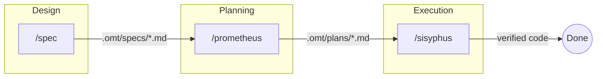
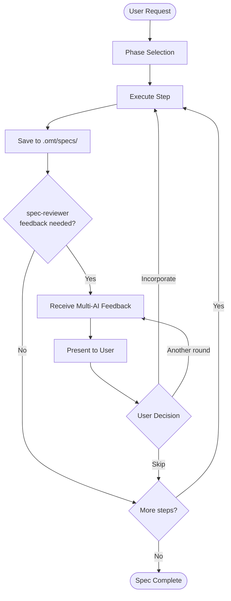
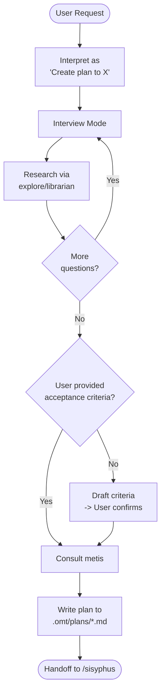
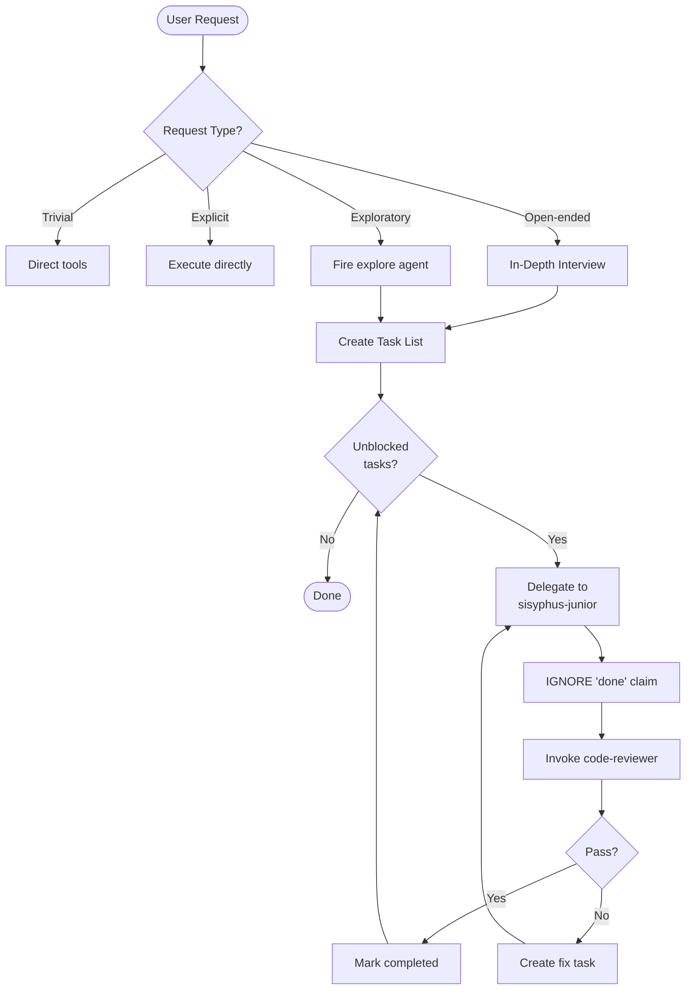

# oh-my-toong

**[한국어](README.md)** | English

**Claude Code skills and agents configuration with Greek mythology-inspired orchestration**

[](https://opensource.org/licenses/MIT)

## Acknowledgments

This project is still just a playground, but I'm learning and growing so much thanks to the Claude Code community.

I'm developing this while being inspired by, studying, and referencing the following projects. Thank you.

- [everything-claude-code](https://github.com/affaan-m/everything-claude-code)
- [oh-my-opencode](https://github.com/code-yeongyu/oh-my-opencode)
- [oh-my-claudecode](https://github.com/Yeachan-Heo/oh-my-claudecode)
- [claude-hud](https://github.com/jarrodwatts/claude-hud)
- [superpowers](https://github.com/obra/superpowers)
- [team-attention](https://github.com/team-attention/plugins-for-claude-natives)

---

## What is oh-my-toong?

oh-my-toong is a Claude Code skills and agents configuration repository. It provides structured methodologies, workflow automation, and specialized agent definitions that enhance AI-assisted development.

Like the Greek Titans who each governed specific domains, each skill and agent in oh-my-toong has a clearly defined responsibility with strict constraints. Prometheus plans but never implements. Oracle advises but never touches code. Sisyphus orchestrates while his agents execute. This separation of concerns ensures predictable, high-quality AI assistance.

## Features

- **Skill-based workflows** - Task-specific methodologies loaded on demand via the Skill tool
- **Specialized agents** - Subagents for delegation with clear role boundaries
- **Session hooks** - Lifecycle scripts for persistent modes and keyword detection
- **Project overrides** - Per-project skill customization without modifying core skills
- **Sync system** - Declarative synchronization to Claude Code configuration

## Philosophy

### Why oh-my-toong?

Claude Code's plugin system is still evolving, making it challenging to inject custom skills and workflows directly. oh-my-toong takes a different approach: **building a structured agentic development framework from the ground up**, drawing inspiration from established projects while creating patterns tailored for AI-assisted development.

### Agentic Development

oh-my-toong embraces **Agentic Development** - a paradigm where AI agents collaborate through clearly defined roles rather than a single agent doing everything:

| Role | Agent | Responsibility |
|------|-------|----------------|
| Design | spec | Creates comprehensive specifications before code |
| Planning | prometheus | Transforms requirements into executable work plans |
| Execution | sisyphus | Orchestrates implementation via specialized agents |
| Implementation | sisyphus-junior | Writes code (delegated by sisyphus) |
| Verification | code-reviewer | Validates all implementations |

**The Core Principle**: Separation of concerns prevents premature implementation and ensures quality through mandatory verification.

## Core Skills Architecture

The three foundational skills form a **Design -> Plan -> Execute** pipeline:



### spec - Software Specification Expert

**Purpose**: Prevent implementation of poorly-defined requirements by creating comprehensive, testable specifications.

**Core Constraint**: No phase completion without user confirmation. All acceptance criteria must be testable.



**Key Phases**:
1. Requirements - Clarify ambiguous requirements
2. Architecture - System structure changes
3. Domain - State machines, business rules
4. Detailed - Performance, concurrency
5. API - External API exposure

### prometheus - Strategic Planning Consultant

**Purpose**: Separate planning from execution. Create work plans before any code is written.

**Core Constraint**: **NEVER writes code**. Interprets ALL requests as planning requests.



**Forbidden Actions**:
- Writing code files (.ts, .js, .py, etc.)
- Editing source code
- Running implementation commands
- ANY action that "does the work"

### sisyphus - Task Orchestrator

**Purpose**: Orchestrate complex tasks through delegation, never solo execution.

**Core Constraint**: **ORCHESTRATE. DELEGATE. NEVER SOLO.** 2+ files OR complex analysis = DELEGATE.



**Verification Protocol**:
- **Zero Trust**: sisyphus-junior's "done" claims are ALWAYS ignored
- **Mandatory Review**: code-reviewer invoked after EVERY implementation
- **No Retry Limit**: Continue until code-reviewer passes
- **Persistence**: User cannot stop the process prematurely

> 📖 **Detailed Guide**: See the [Orchestration Guide](docs/ORCHESTRATION.en.md) for complete workflows and usage instructions.

## Directory Structure

```
oh-my-toong/
├── skills/                    # Task-specific methodologies (SKILL.md files)
│   ├── prometheus/            # Strategic planning consultant
│   ├── sisyphus/              # Task orchestrator with subagent delegation
│   ├── oracle/                # Architecture and debugging advisor
│   ├── explore/               # Codebase search and navigation
│   ├── librarian/             # External documentation researcher
│   ├── clarify/               # Requirements clarification gate
│   ├── metis/                 # Pre-planning gap analysis
│   ├── momus/                 # Work plan reviewer
│   ├── git-committer/         # Git commit workflow
│   ├── agent-council/         # Multi-AI advisory body
│   ├── spec/                  # Specification writing
│   ├── code-review/           # Code review
│   ├── spec-review/           # Multi-AI spec review service
│   └── performance-optimizer/ # Performance analysis and optimization
├── agents/                    # Subagent definitions for Task tool delegation
│   ├── sisyphus-junior.md     # Focused executor (works alone)
│   ├── oracle.md              # Architecture advisor
│   ├── explore.md             # Codebase search
│   ├── librarian.md           # External documentation
│   ├── momus.md               # Plan reviewer
│   ├── metis.md               # Pre-planning analysis
│   ├── code-reviewer.md       # Code review agent
│   └── spec-reviewer.md       # Spec review agent
├── commands/                  # Slash command definitions
│   ├── hud.md                 # Status bar HUD setup
│   ├── ralph.md               # Ralph Loop orchestration
│   └── cancel-ralph.md        # Cancel active Ralph Loop
├── hooks/                     # Session lifecycle scripts
│   ├── session-start.sh       # Restores persistent mode states
│   ├── keyword-detector.sh    # Detects keywords and injects context
│   ├── persistent-mode.js     # Prevents stopping when work incomplete
│   ├── pre-tool-enforcer.sh   # Pre-tool execution enforcement
│   └── post-tool-verifier.sh  # Post-tool verification
├── projects/                  # Project-specific skill overrides
├── scripts/                   # Utility and sync scripts
├── Makefile                   # Build automation
├── sync.yaml                  # Sync configuration
├── config.yaml                # Global settings
└── CLAUDE.md                  # Claude Code instructions
```

## Core Skills

| Skill | Purpose | Key Constraint |
|-------|---------|----------------|
| **prometheus** | Strategic planning consultant | Planner only - NEVER implements |
| **sisyphus** | Task orchestrator | Delegates via subagents - orchestrates, doesn't solo |
| **oracle** | Architecture/debugging advisor | READ-ONLY consultant - diagnoses, never implements |
| **explore** | Codebase search | Returns actionable results with absolute paths |
| **librarian** | External documentation researcher | Searches external docs - NOT internal codebase |
| **clarify** | Requirements clarification | MANDATORY gate before implementation |
| **metis** | Pre-planning analysis | Catches missing questions, undefined guardrails |
| **momus** | Work plan reviewer | Ruthlessly critical - catches gaps before implementation |
| **git-committer** | Git commit workflow | Korean messages, 50-char limit, atomic commits |
| **agent-council** | Multi-AI advisory body | For trade-offs and subjective decisions |
| **spec** | Specification writing | Structured spec creation workflow |
| **code-review** | Code review | Build/test/lint verification |
| **spec-review** | Spec review | Multi-AI advisory service |
| **performance-optimizer** | Performance optimization | Systematic analysis with Before/After verification |

## Agents

Agents are specialized subagent definitions used with Claude Code's Task tool for delegation.

| Agent | Role | Use When |
|-------|------|----------|
| **sisyphus-junior** | Focused task executor | Implementing individual tasks from a plan |
| **oracle** | Architecture advisor | Analyzing architecture or debugging issues |
| **explore** | Codebase navigator | Finding files, implementations, or code patterns |
| **librarian** | Documentation researcher | Researching external APIs, libraries, best practices |
| **momus** | Plan critic | Reviewing work plans before execution |
| **metis** | Pre-planning analyst | Catching gaps before plan generation |
| **code-reviewer** | Code reviewer | Reviewing code changes |
| **spec-reviewer** | Spec reviewer | Getting multi-AI feedback on designs |

## Commands

| Command | Description |
|---------|-------------|
| `/hud setup` | Configure the Oh-My-Toong HUD in Claude Code's status bar |
| `/hud restore` | Restore previous statusLine configuration |
| `/ralph <task>` | Start Ralph Loop for task completion with oracle verification |
| `/cancel-ralph` | Cancel active Ralph Loop and clean up state |

## Key Workflows

### Planning to Execution Flow

```
1. /prometheus <task>     Create work plan in .omt/plans/*.md
         ↓
2. /sisyphus              Orchestrate plan execution via subagents
         ↓
3. sisyphus-junior        Execute individual tasks with strict discipline
```

### Ralph Loop

Iterative completion enforcement with oracle verification. The loop continues until the oracle confirms the task is truly complete.

- State file: `.omt/ralph-state.json`
- Cancel with: `/cancel-ralph`

### Ultrawork Mode

Maximum precision mode activated via keywords (`ultrawork`, `ulw`, `uw`). Enables parallel agent utilization and enhanced verification.

## Hooks

| Hook | Event | Purpose |
|------|-------|---------|
| **session-start.sh** | SessionStart | Restores persistent mode states (ralph-loop, incomplete todos) |
| **keyword-detector.sh** | UserPromptSubmit | Detects keywords and injects mode context |
| **persistent-mode.js** | Stop | Prevents stopping when work remains incomplete |
| **pre-tool-enforcer.sh** | PreToolUse | Enforces tool execution constraints |
| **post-tool-verifier.sh** | PostToolUse | Verifies tool execution results |

## Installation

### Prerequisites

- Claude Code CLI installed
- Node.js v18+ (for HUD functionality)
- macOS or Linux

### Setup

1. Clone this repository:
   ```bash
   git clone https://github.com/yourusername/oh-my-toong.git
   cd oh-my-toong
   ```

2. Configure sync.yaml with your target project path:
   ```yaml
   path: /path/to/your/project

   skills:
     - component: prometheus
     - component: sisyphus
     # Add skills you want to use

   agents:
     - component: oracle
     - component: explore
     # Add agents you want to use

   hooks:
     - component: session-start.sh
       event: SessionStart
   ```

3. Validate and sync:
   ```bash
   make validate    # Check configuration
   make sync-dry    # Preview changes
   make sync        # Apply synchronization
   ```

### Project-Specific Skills

Create project-specific skill overrides in the `projects/` directory:

```
projects/
└── your-project-name/
    └── skills/
        └── testing/
            └── SKILL.md    # Custom testing skill for this project
```

Reference in sync.yaml:
```yaml
skills:
  - component: your-project-name:testing
```

## Conventions

### Commit Messages

- Written in Korean (한국어) with 명사형 종결
- 50-character limit for subject line
- Atomic commits (one logical change per commit)

### Naming Patterns

- **Skills**: Named after Greek mythology (Prometheus, Oracle, Sisyphus)
- **Test DisplayNames**: Korean
- **Test method names**: English with backticks
- **Council prompts**: English (for cross-model consistency)

### Skill Invocation

Skills are invoked via the Skill tool, not by reading files directly:

```
Skill(skill: "prometheus")  // Correct
Read("skills/prometheus/SKILL.md")  // Wrong
```

## HUD Display

After running `/hud setup`, the status bar shows a 2-line display:

**Line 1: Session & Resources**
```
23m | 5h:45%(2h) wk:67%(3d) | ctx:42% | agents:explore+2 | thinking
```

**Line 2: Tasks & Progress**
```
tasks:3/5 | ralph:2/10 | Implementing user auth...
```

| Element | Description | Color Coding |
|---------|-------------|--------------|
| `23m` | Session duration | Bold |
| `5h:45%(2h)` | 5-hour rate limit: 45% used, resets in 2h | Green <70%, Yellow 70-85%, Red >85% |
| `wk:67%(3d)` | Weekly rate limit: 67% used, resets in 3d | Same as above |
| `ctx:N%` | Context window usage | Dim <30%, Green 30-49%, Yellow 50-69%, Red 70%+ |
| `agents:name+N` | Running agents (first agent name + count) | Green |
| `thinking` | Extended thinking mode active | Cyan |
| `tasks:X/Y` | Task progress (completed/total) | Green if >0, Dim if 0/0 |
| `ralph:X/Y` | Ralph Loop iteration | Green <70%, Yellow >70%, Red at max |
| Active task | Current task description (25 chars max) | Dim |

**Graceful Degradation:**
- Rate limits hidden when OAuth unavailable
- Minimal display (`0m | ctx:0%`) when data unavailable
- State files >2 hours old are ignored (stale session detection)

## License

MIT License - see [LICENSE](LICENSE) for details.
