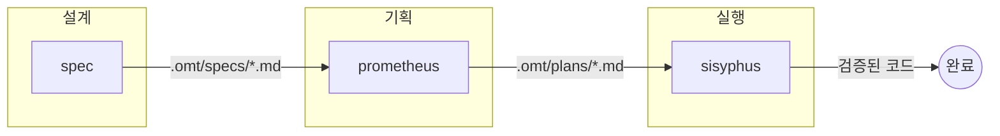
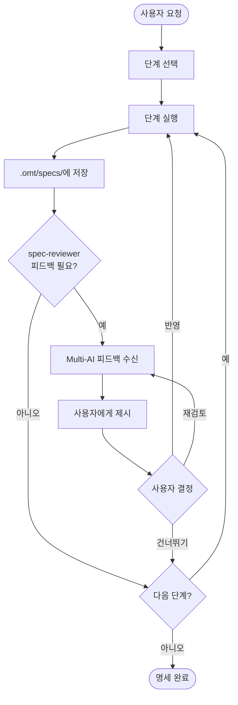
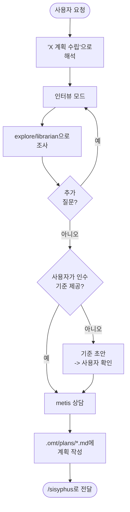
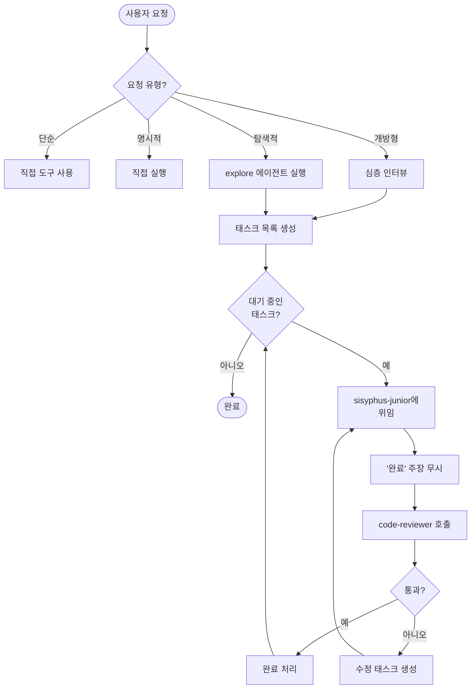

# oh-my-toong

한국어 | **[English](README.en.md)**

**그리스 신화에서 영감을 받은 Claude Code 스킬 및 에이전트 설정**

[](https://opensource.org/licenses/MIT)

## Acknowledgments

이 프로젝트는 아직 놀이터 수준이지만, Claude Code 커뮤니티 덕분에 정말 많이 배우고 성장하고 있습니다.

다음 프로젝트들에서 영감을 받고, 공부하고, 참고하며 개발하고 있습니다. 감사합니다.

- [everything-claude-code](https://github.com/affaan-m/everything-claude-code)
- [oh-my-opencode](https://github.com/code-yeongyu/oh-my-opencode)
- [oh-my-claudecode](https://github.com/Yeachan-Heo/oh-my-claudecode)
- [claude-hud](https://github.com/jarrodwatts/claude-hud)
- [superpowers](https://github.com/obra/superpowers)
- [team-attention](https://github.com/team-attention/plugins-for-claude-natives)

---

## oh-my-toong이란?

oh-my-toong은 Claude Code의 스킬과 에이전트 설정을 담은 저장소입니다. 체계적인 방법론, 워크플로우 자동화, 특화된 에이전트 정의를 통해 AI 기반 개발을 향상시킵니다.

그리스 신화의 티탄들이 각자의 영역을 관장했듯이, oh-my-toong의 각 스킬과 에이전트는 명확한 책임과 엄격한 제약을 가집니다. Prometheus는 계획만 하고 절대 구현하지 않습니다. Oracle은 조언만 하고 코드를 건드리지 않습니다. Sisyphus는 조율하고 그의 에이전트들이 실행합니다. 이러한 관심사의 분리가 예측 가능하고 고품질의 AI 지원을 보장합니다.

## 주요 기능

- **스킬 기반 워크플로우** - Skill 도구를 통해 필요할 때 로드되는 작업별 방법론
- **특화된 에이전트** - 명확한 역할 경계를 가진 위임용 서브에이전트
- **세션 훅** - 지속 모드와 키워드 감지를 위한 라이프사이클 스크립트
- **프로젝트 오버라이드** - 핵심 스킬을 수정하지 않고 프로젝트별 스킬 커스터마이징
- **동기화 시스템** - Claude Code 설정으로의 선언적 동기화

## 철학

### oh-my-toong을 만든 이유

Claude Code의 플러그인 시스템은 아직 발전 중이라, 커스텀 스킬과 워크플로우를 직접 주입하기 어렵습니다. oh-my-toong은 다른 접근 방식을 취합니다: 기존의 좋은 프로젝트들을 참고하면서 **AI 지원 개발에 특화된 에이전틱 개발 프레임워크를 직접 구축**합니다.

### 에이전틱 개발 (Agentic Development)

oh-my-toong은 **에이전틱 개발**을 지향합니다. 하나의 AI가 모든 것을 처리하는 대신, 명확한 역할을 가진 에이전트들이 협업합니다:

| 역할 | 에이전트 | 책임 |
|------|----------|------|
| 설계 | spec | 코드 작성 전 종합적인 명세 작성 |
| 기획 | prometheus | 요구사항을 실행 가능한 작업 계획으로 변환 |
| 실행 | sisyphus | 전문 에이전트를 통한 구현 조율 |
| 구현 | sisyphus-junior | 코드 작성 (sisyphus가 위임) |
| 검증 | code-reviewer | 모든 구현 검증 |

**핵심 원칙**: 관심사 분리를 통해 성급한 구현을 방지하고, 필수 검증을 통해 품질을 보장합니다.

## 핵심 스킬 아키텍처

세 가지 기반 스킬이 **설계 -> 기획 -> 실행** 파이프라인을 형성합니다:



### spec - 소프트웨어 명세 전문가

**목적**: 불명확한 요구사항의 구현을 방지하고, 포괄적이고 테스트 가능한 명세를 작성합니다.

**핵심 제약**: 사용자 확인 없이 단계를 완료할 수 없습니다. 모든 인수 기준은 테스트 가능해야 합니다.



**핵심 단계**:
1. 요구사항 - 모호한 요구사항 명확화
2. 아키텍처 - 시스템 구조 변경
3. 도메인 - 상태 머신, 비즈니스 규칙
4. 상세 - 성능, 동시성
5. API - 외부 API 노출

### prometheus - 전략적 기획 컨설턴트

**목적**: 기획과 실행을 분리합니다. 코드 작성 전에 작업 계획을 수립합니다.

**핵심 제약**: **절대 코드를 작성하지 않습니다**. 모든 요청을 기획 요청으로 해석합니다.



**금지된 행위**:
- 코드 파일 작성 (.ts, .js, .py 등)
- 소스 코드 편집
- 구현 명령 실행
- "작업을 수행하는" 모든 행위

### sisyphus - 태스크 오케스트레이터

**목적**: 복잡한 작업을 위임을 통해 조율합니다. 단독 실행하지 않습니다.

**핵심 제약**: **조율한다. 위임한다. 단독 작업 안 함.** 2개 이상 파일 OR 복잡한 분석 = 위임.



**검증 프로토콜**:
- **Zero Trust**: sisyphus-junior의 "완료" 주장은 항상 무시
- **필수 리뷰**: 모든 구현 후 code-reviewer 호출
- **Retry 제한 없음**: code-reviewer가 통과할 때까지 계속
- **지속성**: 사용자가 프로세스를 중단할 수 없음

> 📖 **상세 가이드**: [오케스트레이션 가이드](docs/ORCHESTRATION.md)에서 전체 워크플로우와 사용법을 확인하세요.

## 디렉토리 구조

```
oh-my-toong/
├── skills/                    # 작업별 방법론 (SKILL.md 파일)
│   ├── prometheus/            # 전략적 계획 컨설턴트
│   ├── sisyphus/              # 서브에이전트 위임을 통한 작업 오케스트레이터
│   ├── oracle/                # 아키텍처 및 디버깅 조언자
│   ├── explore/               # 코드베이스 검색 및 탐색
│   ├── librarian/             # 외부 문서 연구자
│   ├── clarify/               # 요구사항 명확화 게이트
│   ├── metis/                 # 사전 계획 갭 분석
│   ├── momus/                 # 작업 계획 검토자
│   ├── git-committer/         # Git 커밋 워크플로우
│   ├── agent-council/         # 다중 AI 자문단
│   ├── spec/                  # 명세서 작성
│   ├── code-review/           # 코드 리뷰
│   ├── spec-review/           # 다중 AI 명세서 리뷰 서비스
│   └── performance-optimizer/ # 성능 분석 및 최적화
├── agents/                    # Task 도구 위임용 서브에이전트 정의
│   ├── sisyphus-junior.md     # 집중 실행자 (단독 작업)
│   ├── oracle.md              # 아키텍처 조언자
│   ├── explore.md             # 코드베이스 검색
│   ├── librarian.md           # 외부 문서
│   ├── momus.md               # 계획 검토자
│   ├── metis.md               # 사전 계획 분석
│   ├── code-reviewer.md       # 코드 리뷰 에이전트
│   └── spec-reviewer.md       # 명세서 리뷰 에이전트
├── commands/                  # 슬래시 명령어 정의
│   ├── hud.md                 # 상태바 HUD 설정
│   ├── ralph.md               # Ralph Loop 조율
│   └── cancel-ralph.md        # 활성 Ralph Loop 취소
├── hooks/                     # 세션 라이프사이클 스크립트
│   ├── session-start.sh       # 지속 모드 상태 복원
│   ├── keyword-detector.sh    # 키워드 감지 및 컨텍스트 주입
│   ├── persistent-mode.js     # 작업 미완료 시 종료 방지
│   ├── pre-tool-enforcer.sh   # 도구 실행 전 강제
│   └── post-tool-verifier.sh  # 도구 실행 후 검증
├── projects/                  # 프로젝트별 스킬 오버라이드
├── scripts/                   # 유틸리티 및 동기화 스크립트
├── Makefile                   # 빌드 자동화
├── sync.yaml                  # 동기화 설정
├── config.yaml                # 전역 설정
└── CLAUDE.md                  # Claude Code 지침
```

## 핵심 스킬

| 스킬 | 용도 | 핵심 제약 |
|------|------|-----------|
| **prometheus** | 전략적 계획 컨설턴트 | 계획만 수행 - 절대 구현하지 않음 |
| **sisyphus** | 작업 오케스트레이터 | 서브에이전트를 통해 위임 - 조율만, 단독 작업 안 함 |
| **oracle** | 아키텍처/디버깅 조언자 | READ-ONLY 컨설턴트 - 진단만, 구현 안 함 |
| **explore** | 코드베이스 검색 | 절대 경로와 함께 실행 가능한 결과 반환 |
| **librarian** | 외부 문서 연구자 | 외부 문서 검색 - 내부 코드베이스 아님 |
| **clarify** | 요구사항 명확화 | 구현 전 필수 게이트 |
| **metis** | 사전 계획 분석 | 누락된 질문, 정의되지 않은 가드레일 포착 |
| **momus** | 작업 계획 검토자 | 가차 없는 비평 - 구현 전 갭 포착 |
| **git-committer** | Git 커밋 워크플로우 | 한국어 메시지, 50자 제한, 원자적 커밋 |
| **agent-council** | 다중 AI 자문단 | 트레이드오프 및 주관적 결정용 |
| **spec** | 명세서 작성 | 구조화된 명세서 생성 워크플로우 |
| **code-review** | 코드 리뷰 | 빌드/테스트/린트 검증 |
| **spec-review** | 명세서 리뷰 | 다중 AI 자문 서비스 |
| **performance-optimizer** | 성능 최적화 | Before/After 검증을 통한 체계적 분석 |

## 에이전트

에이전트는 Claude Code의 Task 도구와 함께 위임에 사용되는 특화된 서브에이전트 정의입니다.

| 에이전트 | 역할 | 사용 시점 |
|----------|------|-----------|
| **sisyphus-junior** | 집중 작업 실행자 | 계획에서 개별 작업 구현 시 |
| **oracle** | 아키텍처 조언자 | 아키텍처 분석 또는 디버깅 이슈 시 |
| **explore** | 코드베이스 탐색자 | 파일, 구현체, 코드 패턴 검색 시 |
| **librarian** | 문서 연구자 | 외부 API, 라이브러리, 모범 사례 조사 시 |
| **momus** | 계획 비평가 | 실행 전 작업 계획 검토 시 |
| **metis** | 사전 계획 분석가 | 계획 생성 전 갭 포착 시 |
| **code-reviewer** | 코드 리뷰어 | 코드 변경 리뷰 시 |
| **spec-reviewer** | 명세서 리뷰어 | 설계에 대한 다중 AI 피드백 시 |

## 명령어

| 명령어 | 설명 |
|--------|------|
| `/hud setup` | Claude Code 상태바에 Oh-My-Toong HUD 구성 |
| `/hud restore` | 이전 statusLine 설정 복원 |
| `/ralph <task>` | oracle 검증과 함께 작업 완료를 위한 Ralph Loop 시작 |
| `/cancel-ralph` | 활성 Ralph Loop 취소 및 상태 정리 |

## 주요 워크플로우

### 계획에서 실행까지

```
1. /prometheus <task>     .omt/plans/*.md에 작업 계획 생성
         ↓
2. /sisyphus              서브에이전트를 통해 계획 실행 조율
         ↓
3. sisyphus-junior        엄격한 규율로 개별 작업 실행
```

### Ralph Loop

oracle 검증을 통한 반복적 완료 강제. oracle이 작업이 정말로 완료되었음을 확인할 때까지 루프가 계속됩니다.

- 상태 파일: `.omt/ralph-state.json`
- 취소: `/cancel-ralph`

### Ultrawork Mode

키워드(`ultrawork`, `ulw`, `uw`)를 통해 활성화되는 최대 정밀 모드. 병렬 에이전트 활용과 향상된 검증을 가능하게 합니다.

## 훅

| 훅 | 이벤트 | 용도 |
|----|--------|------|
| **session-start.sh** | SessionStart | 지속 모드 상태 복원 (ralph-loop, 미완료 할 일) |
| **keyword-detector.sh** | UserPromptSubmit | 키워드 감지 및 모드 컨텍스트 주입 |
| **persistent-mode.js** | Stop | 작업 미완료 시 종료 방지 |
| **pre-tool-enforcer.sh** | PreToolUse | 도구 실행 제약 강제 |
| **post-tool-verifier.sh** | PostToolUse | 도구 실행 결과 검증 |

## 설치

### 사전 요구사항

- Claude Code CLI 설치됨
- Node.js v18+ (HUD 기능용)
- macOS 또는 Linux

### 설정

1. 이 저장소를 클론:
   ```bash
   git clone https://github.com/yourusername/oh-my-toong.git
   cd oh-my-toong
   ```

2. sync.yaml에 대상 프로젝트 경로 설정:
   ```yaml
   path: /path/to/your/project

   skills:
     - component: prometheus
     - component: sisyphus
     # 사용할 스킬 추가

   agents:
     - component: oracle
     - component: explore
     # 사용할 에이전트 추가

   hooks:
     - component: session-start.sh
       event: SessionStart
   ```

3. 검증 및 동기화:
   ```bash
   make validate    # 설정 확인
   make sync-dry    # 변경 사항 미리보기
   make sync        # 동기화 적용
   ```

### 프로젝트별 스킬

`projects/` 디렉토리에 프로젝트별 스킬 오버라이드 생성:

```
projects/
└── your-project-name/
    └── skills/
        └── testing/
            └── SKILL.md    # 이 프로젝트용 커스텀 테스팅 스킬
```

sync.yaml에서 참조:
```yaml
skills:
  - component: your-project-name:testing
```

```

## HUD 디스플레이

`/hud setup` 실행 후 상태바에 2줄 디스플레이 표시:

**1줄: 세션 및 리소스**
```
23m | 5h:45%(2h) wk:67%(3d) | ctx:42% | agents:explore+2 | thinking
```

**2줄: 작업 및 진행 상황**
```
tasks:3/5 | ralph:2/10 | Implementing user auth...
```

| 요소 | 설명 | 색상 규칙 |
|------|------|-----------|
| `23m` | 세션 지속 시간 | 굵게 |
| `5h:45%(2h)` | 5시간 사용량 제한: 45% 사용, 2시간 후 리셋 | 초록 <70%, 노랑 70-85%, 빨강 >85% |
| `wk:67%(3d)` | 주간 사용량 제한: 67% 사용, 3일 후 리셋 | 위와 동일 |
| `ctx:N%` | 컨텍스트 윈도우 사용량 | 흐림 <30%, 초록 30-49%, 노랑 50-69%, 빨강 70%+ |
| `agents:name+N` | 실행 중인 에이전트 (첫 에이전트명 + 개수) | 초록 |
| `thinking` | 확장 사고 모드 활성화 | 청록 |
| `tasks:X/Y` | 작업 진행 (완료/전체) | 진행 있으면 초록, 0/0이면 흐림 |
| `ralph:X/Y` | Ralph Loop 반복 횟수 | 초록 <70%, 노랑 >70%, 최대치에서 빨강 |
| Active task | 현재 작업 설명 (최대 25자) | 흐림 |

**Graceful Degradation:**
- OAuth 불가 시 사용량 제한 숨김
- 데이터 불가 시 최소 디스플레이 (`0m | ctx:0%`)
- 2시간 이상 된 상태 파일 무시 (오래된 세션 감지)

## 라이선스

MIT 라이선스 - 자세한 내용은 [LICENSE](LICENSE) 참조.
