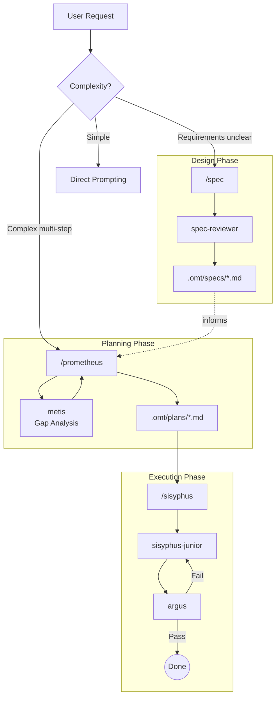

# Oh-My-Toong Orchestration Guide

**[한국어](ORCHESTRATION.md)** | English

---

## TL;DR - When to Use What

| Complexity | Approach | When to Use |
|------------|----------|-------------|
| **Simple** | Just prompt | Quick fixes, single-file changes |
| **Medium** | `/spec` | Need clear requirements before coding |
| **Complex** | `/prometheus` -> `/sisyphus` | Multi-step work requiring planning and orchestration |

**Decision Flow:**

```
Is it a quick fix or simple task?
  |-- YES -> Just prompt normally
  |-- NO  -> Are requirements unclear or complex?
              |-- YES -> Use /spec to create specification first
              |-- NO  -> Do you need multi-step execution?
                          |-- YES -> /prometheus for planning -> /sisyphus for execution
                          |-- NO  -> Just prompt with context
```

---

## 1. Overview

Traditional AI agents often mix planning and execution, leading to:
- **Context pollution**: Plan details mixed with code changes
- **Goal drift**: Losing sight of original objectives mid-implementation
- **AI slop**: Low-quality code from rushing without proper planning

Oh-My-Toong solves this by clearly separating roles:

| Role | Agent | Responsibility |
|------|-------|----------------|
| **Specification** | spec | Creates testable requirements before planning |
| **Planning** | prometheus | Strategic planning, NEVER writes code |
| **Execution** | sisyphus | Orchestrates via delegation, NEVER works alone |
| **Implementation** | sisyphus-junior | Writes code (delegated by sisyphus) |
| **Verification** | argus | Validates all implementations |

---

## 2. Overall Architecture



---

## 3. Key Components

### spec (The Specification Expert)

- **Role**: Creates comprehensive, testable specifications
- **Constraint**: No phase completion without user confirmation
- **Output**: `.omt/specs/{name}/spec.md`
- **Key Feature**: Multi-AI feedback via spec-reviewer

### prometheus (The Planner)

- **Role**: Strategic planning, requirements interviews
- **Constraint**: **READ-ONLY**. NEVER writes code.
- **Output**: `.omt/plans/{name}.md`
- **Workflow**: Interview -> Research -> Metis consultation -> Plan creation

### sisyphus (The Orchestrator)

- **Role**: Execution and delegation
- **Constraint**: **NEVER works alone**. ALL code changes = DELEGATE to sisyphus-junior.
- **Trust Model**: Zero trust for sisyphus-junior's "done" claims
- **Verification**: MANDATORY argus after every implementation

### sisyphus-junior (The Implementer)

- **Role**: Writes actual code
- **Constraint**: Works ALONE. No delegation to other agents.
- **Discipline**: Strict task focus, immediate completion marking

### argus (The Hundred-Eyed Guardian)

- **Role**: Validates all implementations - nothing escapes
- **Function**: Runs build/test/lint, evaluates code quality
- **Verdict**: APPROVE, REQUEST_CHANGES, or COMMENT

---

## 4. Workflow

### Phase 1: Specification (Optional but Recommended)

For complex features, start with `/spec`:

1. **Phase Selection**: Which phases are needed (Requirements, Architecture, Domain, etc.)
2. **Step Execution**: Design work for each step
3. **Multi-AI Review**: spec-reviewer provides feedback after each step
4. **User Confirmation**: Proceed only with explicit approval

### Phase 2: Planning

When requirements are clear, use `/prometheus`:

1. **Interview Mode**: Collects context through questions
2. **Research**: Investigates codebase via explore/librarian agents
3. **Metis Consultation**: MANDATORY gap analysis before plan creation
4. **Plan Generation**: Writes structured plan to `.omt/plans/*.md`

### Phase 3: Execution

With a plan ready, use `/sisyphus`:

1. **Task Creation**: Breaks plan into TaskCreate items
2. **Delegation**: Assigns tasks to sisyphus-junior
3. **Verification**: argus validates EVERY completion
4. **Iteration**: Continues until all tasks pass review

---

## 5. Commands

| Command | Purpose | Output |
|---------|---------|--------|
| `/spec <description>` | Create software specification | `.omt/specs/*.md` |
| `/prometheus <task>` | Create work plan | `.omt/plans/*.md` |
| `/sisyphus` | Execute plan via orchestration | Verified code changes |
| `/ralph <task>` | Iterative completion with oracle verification | Task completion |
| `/hud setup\|restore` | HUD setup and management | statusLine configuration |
| `/cancel-ralph` | Cancel Ralph Loop | State file cleanup |

---

## 6. Best Practices

### 1. Don't Skip Planning

Even "simple" tasks benefit from brief planning. The time invested in planning saves debugging time later.

### 2. Trust the Verification Protocol

When argus requests changes, fix them. Don't argue or skip. The protocol exists to catch real issues.

### 3. Use Specs for Unclear Requirements

If you find yourself repeatedly clarifying requirements during prometheus, step back and use `/spec` first.

### 4. Let Agents Do Their Jobs

- Don't manually verify sisyphus-junior's work (that's argus's job)
- Don't ask prometheus to "just write the code" (it can't and won't)
- Don't interrupt sisyphus mid-execution (it will persist anyway)

### 5. Single Plan Principle

Contain all TODOs in one plan file. This prevents context fragmentation and makes progress tracking easier.

---

## 7. Troubleshooting

| Problem | Solution |
|---------|----------|
| Prometheus keeps interviewing | It needs more context. Answer thoroughly or say "generate plan now". |
| Sisyphus won't stop | This is by design. It persists until verification passes. |
| argus keeps failing | Review the feedback carefully. The issues are real. |
| Spec is taking too long | Skip phases that aren't relevant (simple CRUD doesn't need Architecture phase). |

---

## See Also

- [README](../README.en.md) - Project overview
- [Core Skills Architecture](../README.en.md#core-skills-architecture) - Skill details with diagrams
