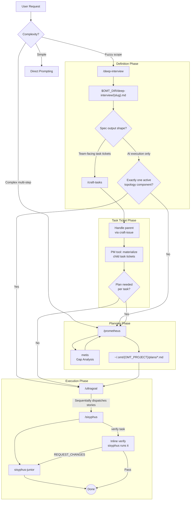

# Oh-My-Toong Orchestration Guide

**[한국어](ORCHESTRATION.md)** | English

---

## TL;DR - When to Use What

| Complexity | Approach | When to Use |
|------------|----------|-------------|
| **Simple** | Just prompt | Quick fixes, single-file changes |
| **Team task tickets** | `/deep-interview` -> `/craft-tasks` -> optional `/prometheus` per task -> `/ultragoal` -> `/sisyphus` | You need a settled design turned into shareable, trackable implementation task tickets |
| **Fuzzy scope** | `/deep-interview` -> AI execution only: `/ultragoal` (or `/prometheus` -> `/ultragoal`) -> `/sisyphus` | You have an idea but requirements are unclear |
| **Complex** | `/prometheus` -> `/ultragoal` -> `/sisyphus` | Multi-step work requiring planning and orchestration |

**Decision Flow:**

```
Is it a quick fix or simple task?
  |-- YES -> Just prompt normally
  |-- NO  -> Are the requirements clear?
              |-- NO  -> /deep-interview to crystallize a spec
                          |-- Need shareable, trackable implementation task tickets?
                                |-- YES -> /craft-tasks to create/update tasks (parent handling via craft-issue)
                                          -> /prometheus only when a task needs its own plan
                                          -> /ultragoal -> /sisyphus
                                |-- NO  -> /ultragoal if exactly one topology component is active
                                          otherwise /prometheus -> /ultragoal -> /sisyphus
              |-- YES -> Do you need multi-step execution?
                          |-- YES -> /prometheus for planning -> /ultragoal -> /sisyphus for execution
                          |-- NO  -> Just prompt with context
```

---

## 1. Overview

Traditional AI agents often mix planning and execution, leading to:
- **Context pollution**: Plan details mixed with code changes
- **Goal drift**: Losing sight of original objectives mid-implementation
- **AI slop**: Low-quality code from rushing without proper planning

Oh-My-Toong solves this by clearly separating roles:

| Role | Agent | Responsibility |
|------|-------|----------------|
| **Definition** | deep-interview | Resolves ambiguity into a spec, NEVER writes code |
| **Task ticketing** | craft-tasks | Creates and updates child tasks from a settled design; delegates parent handling to craft-issue |
| **Planning** | prometheus | Strategic planning, NEVER writes code |
| **Story execution** | ultragoal | Sequentially dispatches plan stories to sisyphus |
| **Execution** | sisyphus | Orchestrates via delegation, NEVER works alone |
| **Implementation** | sisyphus-junior | Writes code (delegated by sisyphus) |
| **Quality Assurance** | sisyphus (inline verify) | Runs a verify task's AC commands itself to validate implementation quality, plan compliance, and instruction fulfillment |

---

## 2. Overall Architecture


```mermaid
flowchart TD
    User[User Request] --> Decision{Complexity?}

    Decision -->|Simple| Direct[Direct Prompting]
    Decision -->|Fuzzy scope| DeepInterview["/deep-interview"]
    Decision -->|Complex multi-step| Prometheus

    subgraph Definition Phase
        DeepInterview --> SpecFile["$OMT_DIR/deep-interview/{slug}.md"]
        SpecFile --> Output{Spec output shape?}
        Output -->|Team-facing task tickets| CraftTasks["/craft-tasks"]
        Output -->|AI execution only| Route{Exactly one active<br/>topology component?}
    end

    subgraph Task Ticket Phase
        CraftTasks --> Parent["Handle parent<br/>via craft-issue"]
        Parent --> ChildTickets["PM tool: materialize<br/>child task tickets"]
        ChildTickets --> TaskPlan{Plan needed<br/>per task?}
    end

    subgraph Planning Phase
        Route -->|No| Prometheus["/prometheus"]
        TaskPlan -->|Yes| Prometheus
        Prometheus --> Metis[metis<br/>Gap Analysis]
        Metis --> Prometheus
        Prometheus --> PlanFile["~/.omt/{OMT_PROJECT}/plans/*.md"]
    end

    subgraph Execution Phase
        Route -->|Yes| Ultragoal["/ultragoal"]
        TaskPlan -->|No| Ultragoal
        PlanFile --> Ultragoal
        Ultragoal -->|Sequentially dispatches stories| Sisyphus["/sisyphus"]
        Sisyphus --> Junior[sisyphus-junior]
        Junior --> Done((Done))
        Sisyphus -->|verify task| QA[Inline verify<br/>sisyphus runs it]
        QA -->|Pass| Done
        QA -->|REQUEST_CHANGES| Junior
    end
```

---

## 3. Key Components

### deep-interview (The Definer)

- **Role**: Crystallizes a vague idea into a spec before autonomous execution
- **Constraint**: Tracks open decisions without a question-count limit. Completion requires both the score threshold and a closure audit. Never implements directly.
- **Output**: `$OMT_DIR/deep-interview/{slug}.md`
- **Workflow**: One question at a time, tracking decisions, counterexamples, and contradictions -> reopen affected dependents -> audit evidence and residual assumptions -> finalize the spec -> in Phase 5, recommend `/craft-tasks` when the output calls for shareable, trackable implementation task tickets; otherwise, when only AI execution is needed, recommend `/ultragoal` for exactly one active topology component or `/prometheus` otherwise. Present the non-recommended skill as an explicit override.
- **Origin**: Started from oh-my-claudecode and refined using [Ouroboros](https://github.com/Q00/ouroboros) closure audits and [grilling](https://github.com/mattpocock/skills) decision dependencies.

### craft-tasks (The Task Ticket Materializer)

- **Role**: Decomposes a settled design into shareable, trackable implementation task tickets for the team
- **Constraint**: Use only after intent, approach, invariants, and boundary are settled. If you only need an AI-execution plan, use `prometheus` instead.
- **Output**: Child task tickets materialized in the PM tool under a verified parent
- **Workflow**: Uses the deep-interview spec to delegate parent handling to craft-issue, verifies the returned parent association, updates existing task bodies, and creates only missing tasks. The create/update runtime contract is defined by `skills/craft-tasks/SKILL.md` and `skills/craft-tasks/scripts/task-write-journal.ts`; the real PM API remains outside this repository's harness, as documented.

#### PM write journal contract and recovery

`task-write-journal.ts` records crash-atomic, session-scoped local orchestration intents in `$OMT_DIR/task-write-journal-<sessionId>.json`. The journal is local orchestration state, not a PM field, comment, or idempotency primitive, so the workflow invents neither a PM custom field nor a nonexistent idempotency primitive.

`task-write-journal-<safe-session>.json`, `task-write-reconciliation-<safe-session>-<receiptId>.json`, and quarantined `task-write-journal-<safe-session>.quarantine.<artifactId>.json` are intentionally excluded from generic TTL cleanup by `SESSION_ARTIFACT_PREFIXES`. These filename families are for drift classification and recovery-entry recognition only and grant no deletion authority. Pending and malformed journal contents remain for explicit recovery, and malformed journal bytes are preserved as quarantine artifacts.

`create-prepare` requires a nested `creationPayload` containing the exact creation fields for the selected PM binding. When Linear is selected, those fields are optional `title`, `description`, and optional `blockedBy`; other PM bindings pass their equivalent exact fields. It injects the verified `parentId` into the PM payload and strips the orchestration-only `designAnchor` and `identityComment` from that PM payload. It returns the exact resulting `creationPayload` unchanged for `save_issue` and returns the canonical `identityComment` as a separate field.

For a new child, record the exact `save_issue` creation payload with `create-prepare` before calling `save_issue`. `create-prepare` validates and injects `parentId` into the exact `creationPayload`, then returns that payload unchanged for `save_issue` together with the canonical `identityComment` as a separate field. With Linear, retain the Linear-native payload containing `title`, `description`, and optional `blockedBy`; pass `identityComment` only as a separate comment. Verify the returned child’s `parentId` and exact `designAnchor`, then record its `childId` with `create-child` and send the separately stored `identityComment` through `create_comment`. `create-complete` verifies the association (`childId`, `parentId`, `designAnchor`); because PM does not return a nested `creationPayload`, the caller projects the PM re-read creation fields into the nested `creationPayload` passed to `create-complete`, which is then exactly deep-compared against the stored payload. It separately verifies that the PM re-read of the identity comment matches the stored `identityComment`; only then does it complete the intent. If `create-complete` receives the same verification for an already `complete` intent, it performs an idempotent complete replay and returns the existing result. If a response is lost, first use `get` to read the existing intent; when a recorded `childId` exists, re-read that child and the exact identity comment and retry only missing writes. If no verified result exists, call `manual-reconciliation`, record the terminal `manual-reconciliation-required` state, and stop. Never infer a child from title, description, time, or tree position, and never create a replacement child. Preserve the returned `taskIdentities` collection of `taskKey` and `childId` through the next handoff, and re-verify that retained identity before deleting a terminal receipt.

Cross-session recovery starts with `list --pending`, then an explicit `sourceSessionId` selection, followed by `get <intentId> --source-session <sourceSessionId>` for that journal. `list --pending` is read-only and returns deterministic JSON ordered by journal file and intent ID; it discovers nonterminal intents and unacknowledged terminal intents retained as receipts. Matching malformed journals are surfaced as explicit error entries carrying their `sourceSessionId`. Any transition of an intent from another session must likewise pass `--source-session <sourceSessionId>` to `create-child`, `create-complete`, `update-mutation-written`, `update-complete`, `manual-reconciliation`, `manual-reconciliation-missing`, `quarantine-journal`, or `receipt-ack`. `create-prepare`, `update-prepare`, and `list` reject `--source-session`. Without that argument, lookup and transitions remain current-session-only. Preserve the required `taskIdentities` and re-verify the PM result before calling `receipt-ack <intentId>`; `parentId`, `designAnchor`, and create’s `taskKey` plus optional `childId`, or update’s `childId`, must exactly match the stored values before the terminal receipt and intent are removed. Automatic cross-session fallback, journal copying, and replacement creation are forbidden.

For an existing child body or native-relation update, persist the exact `before`, `after`, and `changeComment` with `update-prepare` before the PM mutation. After the PM mutation and change-comment write, record `update-mutation-written`; re-read the body, relations, and change comment, then call `update-complete` only after those checks pass. On interruption, use `get` to preserve the intent’s change context and perform only missing writes. If no verified child or result exists, stop through the same terminal manual-reconciliation path. Repeated completion responses permit only an idempotent replay with the same verification values.

A terminal transition does not compact or omit the terminal intent immediately. `complete` and `manual-reconciliation-required` intents remain in the journal as unacknowledged terminal receipts and are discoverable through `list --pending`. After re-verifying the retained `taskIdentities` and the exact PM association, call `receipt-ack` to remove that intent; acknowledging the last intent deletes the journal file. If the journal file is readable but the intent ID is absent, use `manual-reconciliation-missing <intentId>` to write a `manual-reconciliation-required` receipt. If the journal contains malformed JSON or a malformed journal shape, `quarantine-journal` preserves the exact original bytes in `.quarantine.<artifactId>.json` and writes a `manual-reconciliation-required` receipt. A filesystem/I/O read error is surfaced and stops without rename, receipt, or mutation. A normal quarantine receipt covers its referenced artifact, so that artifact is suppressed from `list --reconciliation`; only an artifact without a receipt is an orphan entry. A source session with a quarantine receipt or orphan quarantine artifact is sealed: new journal appends and prepares are rejected, so use a new session. `list --reconciliation` returns deterministic entries for receipts, receipt-less orphan artifacts, malformed receipts, and identity/JSON errors, ordered by `sourceSessionId` and receipt or artifact ID. Journal, reconciliation-receipt, and quarantine-artifact filename families are recognition-only and excluded from generic `SESSION_ARTIFACT_PREFIXES` TTL cleanup. The lock publishes its initialized owner atomically, retries a transient empty release, and reclaims a stale empty legacy lock. Malformed or live locks are preserved and fail within a bounded timeout. Never infer identity from title, description, time, or tree position, and never create a replacement task.

### prometheus (The Planner)

Questions have no count limit and resolve prerequisite decisions first. Each answer produces the six weighted scores and decision changes; unanswered choices stay open. Explicit delegation permits a reasoned choice, and settled deep-interview decisions reopen only when new evidence changes their premises. ultraresearch handles competing claims and multi-source verification; one investigation's resource budget does not limit interview depth. Readiness requires the phase's closure audit as well as its score. Metis, human design approval, Momus, and HTML submission remain in place.

- **Role**: Strategic planning, requirements interviews
- **Constraint**: **READ-ONLY**. NEVER writes code.
- **Output**: `~/.omt/{OMT_PROJECT}/plans/{name}.md` (via `$OMT_DIR`)
- **Workflow**: Scope split gate -> Interview -> Research -> Metis consultation -> Plan creation -> hand off to `/ultragoal`
- **When to use**: Use it for the AI-execution-only route, or only when an individual task created by `craft-tasks` needs a separate AI-execution plan.
- **Scope split**: Complex and Architecture requests first settle whether a subset could be merged on its own and leave the system working. If one could, only the first subset becomes this run's scope; the rest each become their own prometheus run.

### ultragoal (The Story Executor)

- **Role**: Executes plan stories sequentially
- **Workflow**: Dispatches each story to `/sisyphus` in sequence and starts the next story only after the previous one completes

#### Iteration budget, no-progress, and resume

- During pursuit, `iteration` counts consecutive Stops with no observed progress. A diff-carrying commit or Story status transition resets it to `0`; Stops that wait for background work are not counted.
- Reaching `max_iterations` (default 10) soft-stops without dispatching new work as non-complete `budget_limited`, preserving state. After in-flight work drains and the completion gate is checked, only the user may run `resume-pursuit` to restore `pursuing` with `iteration=0`.
- `blocked` is separate: it is reported only for B1 (no actionable incomplete work) or when the configured `blocked-stop` predicate is met.

#### Final review result contract

The final review retains the four finder angles: correctness, regression, cleanup, and requirement gap. `impact` describes harm if the scenario occurs, and is not a proxy for occurrence frequency, exposure, patch size, maintenance cost, or finder angle. `priority` is a response recommendation. Assign HIGH/MEDIUM/LOW from actual exposure and harm against the permanent complexity, maintenance burden, and regression risk introduced by the minimum remedy; implementation difficulty or effort alone must not lower it. Every `COMPLETE` finding must have five nonblank assessment strings: `unfixed_cost`, `exposure`, `remedy`, `added_cost`, and `rationale`.

The final `code-reviewer` receives exactly the serialized review context and the caller-owned opaque artifact destination. The generic code-review publisher stores the original CodeReviewArtifact JSON unchanged and returns only the transport receipt `{path, sha256}`. The publisher does not know ultragoal and does not assign priority, scope, repair, completion, budget, or approval policy. The parent orchestrator must explicitly invoke the `get-review-result` CLI to obtain the original result; it must not read the receipt and apply subjective policy itself.

The consumer decides scope first. `OUT_OF_SCOPE` is retained as a non-blocking NOTE; `UNKNOWN` blocks without repair. If `PLAUSIBLE` verification remains unresolved, or scope admission is incomplete, consume the reviewer's `INCONCLUSIVE` artifact status as-is and route to `REQUEST_CHANGES` without recording or rewriting reviewer status and without speculative repair.

Routing for confirmed (`CONFIRMED`) IN_SCOPE findings:

| Priority | Consumer handling |
|---|---|
| HIGH | `REQUEST_CHANGES` → repair, affected checks, and a fresh review |
| MEDIUM | `COMMENT` → repair, affected checks, and hash-bound evidence via `record-comment-resolution --artifact-sha256 <sha> --evidence <paths>`; no re-review |
| LOW | `COMMENT` → report only; no repair, check evidence, or re-review |

Mixed results use the precedence `REQUEST_CHANGES` > `COMMENT` > `APPROVE`. `APPROVE` applies only when there are truly no findings; OUT_OF_SCOPE-only notes produce `COMMENT`, while any `UNKNOWN` or `INCONCLUSIVE` produces `REQUEST_CHANGES`. The initial five-review budget is used only for `REQUEST_CHANGES` rounds and absent-reviewer retries. `COMMENT` and `APPROVE` deny any extra dispatch, and review-budget renewal cannot bypass that rule. Objective and other completion gates remain in force.

### sisyphus (The Orchestrator)

- **Role**: Execution and delegation
- **Constraint**: **NEVER works alone**. ALL code changes = DELEGATE to sisyphus-junior.
- **Verification**: sisyphus handles verify tasks inline (explicit AC + PASS/FAIL verdict) by running the AC commands itself, skipping junior — there is no separate QA agent. Every implement task carries a paired verify task created in the same task list, so junior's output always reaches a verdict; junior's own self-check is evidence for that verdict, not a substitute for it.
- **Commit**: on APPROVE or COMMENT, sisyphus dispatches mnemosyne to commit that task's changes. Nothing is committed while a task sits in REQUEST_CHANGES, and a passing verdict that leaves changes uncommitted is an unfinished task.

### sisyphus-junior (The Implementer)

- **Role**: Writes actual code
- **Constraint**: Works ALONE. No delegation to other agents.
- **Discipline**: Strict task focus, immediate completion marking

### Inline verify (performed by sisyphus itself)

- **Role**: Validates a verify task's implementation quality, plan compliance, and instruction fulfillment — sisyphus does this itself, with no separate QA agent
- **Function**: Runs the build/test/lint commands named in the AC directly, saves evidence, then renders a verdict
- **Verdict**: APPROVE, REQUEST_CHANGES, or COMMENT
- **Manual QA**: For explicit or heavy verification, the `qa` skill can be invoked directly (it is just no longer wrapped by a dedicated agent)

---

## 4. Workflow

### Phase 0: Definition (when scope is fuzzy)

When requirements are unclear, crystallize a spec with `/deep-interview` before planning:

1. **One question at a time, without a count limit**: Settle prerequisites and follow the branches, counterexamples, and contradictions each answer reveals.
2. **Closure audit**: Scores guide investigation. Resolve decisions that could change implementation, examine evidence/failure scenarios/residual assumptions, and confirm shared understanding. Respect a stop immediately; label early delivery DRAFT.
3. **Spec finalization and route selection**: Save to `$OMT_DIR/deep-interview/{slug}.md`. In Phase 5, recommend `/craft-tasks` when the spec calls for shareable, trackable implementation task tickets. `craft-tasks` delegates parent handling to craft-issue and creates or updates child task tickets; use `/prometheus` only when an individual task needs an AI-execution plan. AI execution then runs through `/ultragoal` -> `/sisyphus`. When the spec only needs AI execution and no team-facing task tickets, preserve the existing route: recommend `/ultragoal` for exactly one active topology component, or `/prometheus` -> `/ultragoal` -> `/sisyphus` otherwise. Present the non-recommended skill as an explicit override.

### Phase 1: Planning

When a settled design must become shareable, trackable task tickets, use `/craft-tasks`. It delegates parent handling to craft-issue and creates or updates child tickets; use `/prometheus` only when an individual task needs an AI-execution plan.

When requirements are clear and you only need an AI-execution plan, use `/prometheus`:

1. **Scope Split Gate**: Complex and Architecture only. If a subset could be merged on its own, the subsets are listed in order and only the first becomes this run's scope
2. **Interview Mode**: Collects context through questions
3. **Research**: Investigates codebase via explore/librarian agents
4. **Metis Consultation**: MANDATORY gap analysis before plan creation
5. **Plan Generation**: Writes structured plan to `~/.omt/{OMT_PROJECT}/plans/*.md`

### Phase 2: Story Execution

With a plan ready, `/ultragoal` sequentially dispatches its stories to `/sisyphus`:

1. **Sequential Story Processing**: It dispatches the next story to sisyphus only after the previous story completes
2. **Task Creation**: sisyphus breaks the story into TaskCreate items
3. **Delegation**: Assigns tasks to sisyphus-junior
4. **Quality Assurance**: every implement task carries a paired verify task, handled inline by sisyphus (skip junior) — it runs the AC commands itself for a PASS/FAIL verdict
5. **Commit**: on APPROVE/COMMENT, mnemosyne is dispatched to commit that task's changes
6. **Iteration**: Continues until all stories and tasks pass review

`ultragoal`'s `iteration` counts consecutive no-progress Stops and resets to 0 on a diff-carrying commit or Story status transition; waiting for background work does not consume it. At `max_iterations` (default 10), it soft-stops as non-complete `budget_limited`, preserves state, and dispatches no new work. After in-flight work drains and the completion gate is checked, only the user-run `resume-pursuit` restores `pursuing` at iteration 0. `blocked` is separate and occurs only for B1 (no actionable incomplete work) or the configured `blocked-stop` predicate.

---

## 5. Commands

| Command | Purpose | Output |
|---------|---------|--------|
| `/deep-interview <idea>` | Crystallize a spec via ambiguity gating | `$OMT_DIR/deep-interview/{slug}.md` |
| `/craft-tasks <spec>` | Create or update tasks from a settled design; delegate parent handling to craft-issue | Child task tickets in the PM tool |
| `/prometheus <task>` | Create work plan | `~/.omt/{OMT_PROJECT}/plans/*.md` |
| `/ultragoal` | Sequentially dispatch plan stories to sisyphus | Story-by-story execution progress |
| `/sisyphus` | Orchestrate execution of a dispatched story | Verified code changes |
| `/hud setup\|restore` | HUD setup and management | statusLine configuration |

---

## 6. Best Practices

### 1. Don't Skip Planning

Even "simple" tasks benefit from brief planning. The time invested in planning saves debugging time later.

### 2. Trust the Verification Protocol

When the inline verify requests changes, fix them. Don't argue or skip. The protocol exists to catch real issues.

### 3. Use Interview Mode for Unclear Requirements

If you find yourself repeatedly clarifying requirements during prometheus, answer more thoroughly or let deep-interview collect sufficient context first. If the settled design must become team-facing task tickets, use craft-tasks after deep-interview and add prometheus only for tasks that need their own AI-execution plan.

### 4. Let Agents Do Their Jobs

- Don't manually verify sisyphus-junior's work — junior self-verifies with build/typecheck/tests, and a separate verify task is handled inline by sisyphus
- Don't ask prometheus to "just write the code" (it can't and won't)
- Don't interrupt sisyphus mid-execution (it will persist anyway)

### 5. Single Plan Principle

Keep one plan file per AI-execution scope. In the team-ticket route, craft-issue handles parents and craft-tasks creates and updates task tickets, while prometheus remains optional per task.

---

## 7. Troubleshooting

| Problem | Solution |
|---------|----------|
| Prometheus keeps interviewing | It needs more context. Answer thoroughly or say "generate plan now". |
| craft-tasks does not create child tickets | Check that intent, approach, invariants, and boundary are settled and that exactly one parent can be verified. |
| Sisyphus won't stop | This is by design. ultragoal counts consecutive no-progress Stops and may soft-stop as `budget_limited` at `max_iterations` (default 10), preserving state. |
| Inline verify keeps failing | Review the feedback carefully. The issues are real. |

---

## See Also

- [README](../README.en.md) - Project overview
- [Core Pipeline Skills](skills/core-pipeline.en.md) - deep-interview · craft-tasks · prometheus · ultragoal · sisyphus details
