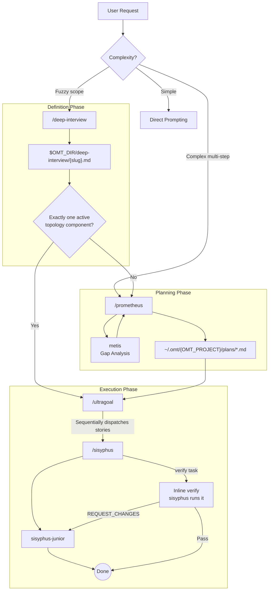

# Oh-My-Toong Orchestration Guide

**[한국어](ORCHESTRATION.md)** | English

---

## TL;DR - When to Use What

| Complexity | Approach | When to Use |
|------------|----------|-------------|
| **Simple** | Just prompt | Quick fixes, single-file changes |
| **Fuzzy scope** | `/deep-interview` -> conditional `/ultragoal` or `/prometheus` | You have an idea but requirements are unclear |
| **Complex** | `/prometheus` -> `/ultragoal` -> `/sisyphus` | Multi-step work requiring planning and orchestration |

**Decision Flow:**

```
Is it a quick fix or simple task?
  |-- YES -> Just prompt normally
  |-- NO  -> Are the requirements clear?
              |-- NO  -> /deep-interview to crystallize a spec -> /ultragoal if exactly one topology component is active; otherwise /prometheus
              |-- YES -> Do you need multi-step execution?
                          |-- YES -> /prometheus for planning -> /ultragoal -> /sisyphus for execution
                          |-- NO  -> Just prompt with context
```

---

## 1. Overview

Traditional AI agents often mix planning and execution, leading to:
- **Context pollution**: Plan details mixed with code changes
- **Goal drift**: Losing sight of original objectives mid-implementation
- **AI slop**: Low-quality code from rushing without proper planning

Oh-My-Toong solves this by clearly separating roles:

| Role | Agent | Responsibility |
|------|-------|----------------|
| **Definition** | deep-interview | Resolves ambiguity into a spec, NEVER writes code |
| **Planning** | prometheus | Strategic planning, NEVER writes code |
| **Story execution** | ultragoal | Sequentially dispatches plan stories to sisyphus |
| **Execution** | sisyphus | Orchestrates via delegation, NEVER works alone |
| **Implementation** | sisyphus-junior | Writes code (delegated by sisyphus) |
| **Quality Assurance** | sisyphus (inline verify) | Runs a verify task's AC commands itself to validate implementation quality, plan compliance, and instruction fulfillment |

---

## 2. Overall Architecture


```mermaid
flowchart TD
    User[User Request] --> Decision{Complexity?}

    Decision -->|Simple| Direct[Direct Prompting]
    Decision -->|Fuzzy scope| DeepInterview["/deep-interview"]
    Decision -->|Complex multi-step| Prometheus

    subgraph Definition Phase
        DeepInterview --> SpecFile["$OMT_DIR/deep-interview/{slug}.md"]
        SpecFile --> Route{Exactly one active<br/>topology component?}
    end

    subgraph Planning Phase
        Route -->|No| Prometheus["/prometheus"]
        Prometheus --> Metis[metis<br/>Gap Analysis]
        Metis --> Prometheus
        Prometheus --> PlanFile["~/.omt/{OMT_PROJECT}/plans/*.md"]
    end

    subgraph Execution Phase
        Route -->|Yes| Ultragoal["/ultragoal"]
        PlanFile --> Ultragoal
        Ultragoal -->|Sequentially dispatches stories| Sisyphus["/sisyphus"]
        Sisyphus --> Junior[sisyphus-junior]
        Junior --> Done((Done))
        Sisyphus -->|verify task| QA[Inline verify<br/>sisyphus runs it]
        QA -->|Pass| Done
        QA -->|REQUEST_CHANGES| Junior
    end
```

---

## 3. Key Components

### deep-interview (The Definer)

- **Role**: Crystallizes a vague idea into a spec before autonomous execution
- **Constraint**: Won't proceed to execution while the ambiguity score stays above threshold. Never implements directly.
- **Output**: `$OMT_DIR/deep-interview/{slug}.md`
- **Workflow**: One question at a time, targeting the weakest clarity dimension -> measure ambiguity -> finalize spec once below threshold -> in Phase 5, recommend `/ultragoal` when exactly one topology component is active; otherwise recommend `/prometheus`. Present the non-recommended skill as an explicit override.
- **Origin**: Borrowed almost as-is from oh-my-claudecode (omc), whose implementation was simply too good to reinvent (originally inspired by [Ouroboros](https://github.com/Q00/ouroboros))

### prometheus (The Planner)

- **Role**: Strategic planning, requirements interviews
- **Constraint**: **READ-ONLY**. NEVER writes code.
- **Output**: `~/.omt/{OMT_PROJECT}/plans/{name}.md` (via `$OMT_DIR`)
- **Workflow**: Scope split gate -> Interview -> Research -> Metis consultation -> Plan creation -> hand off to `/ultragoal`
- **Scope split**: Complex and Architecture requests first settle whether a subset could be merged on its own and leave the system working. If one could, only the first subset becomes this run's scope; the rest each become their own prometheus run.

### ultragoal (The Story Executor)

- **Role**: Executes plan stories sequentially
- **Workflow**: Dispatches each story to `/sisyphus` in sequence and starts the next story only after the previous one completes

#### Iteration budget, no-progress, and resume

- During pursuit, `iteration` counts consecutive Stops with no observed progress. A diff-carrying commit or Story status transition resets it to `0`; Stops that wait for background work are not counted.
- Reaching `max_iterations` (default 10) soft-stops without dispatching new work as non-complete `budget_limited`, preserving state. After in-flight work drains and the completion gate is checked, only the user may run `resume-pursuit` to restore `pursuing` with `iteration=0`.
- `blocked` is separate: it is reported only for B1 (no actionable incomplete work) or when the configured `blocked-stop` predicate is met.

### sisyphus (The Orchestrator)

- **Role**: Execution and delegation
- **Constraint**: **NEVER works alone**. ALL code changes = DELEGATE to sisyphus-junior.
- **Verification**: sisyphus handles verify tasks inline (explicit AC + PASS/FAIL verdict) by running the AC commands itself, skipping junior — there is no separate QA agent. Every implement task carries a paired verify task created in the same task list, so junior's output always reaches a verdict; junior's own self-check is evidence for that verdict, not a substitute for it.
- **Commit**: on APPROVE or COMMENT, sisyphus dispatches mnemosyne to commit that task's changes. Nothing is committed while a task sits in REQUEST_CHANGES, and a passing verdict that leaves changes uncommitted is an unfinished task.

### sisyphus-junior (The Implementer)

- **Role**: Writes actual code
- **Constraint**: Works ALONE. No delegation to other agents.
- **Discipline**: Strict task focus, immediate completion marking

### Inline verify (performed by sisyphus itself)

- **Role**: Validates a verify task's implementation quality, plan compliance, and instruction fulfillment — sisyphus does this itself, with no separate QA agent
- **Function**: Runs the build/test/lint commands named in the AC directly, saves evidence, then renders a verdict
- **Verdict**: APPROVE, REQUEST_CHANGES, or COMMENT
- **Manual QA**: For explicit or heavy verification, the `qa` skill can be invoked directly (it is just no longer wrapped by a dedicated agent)

---

## 4. Workflow

### Phase 0: Definition (when scope is fuzzy)

When requirements are unclear, crystallize a spec with `/deep-interview` before planning:

1. **One question at a time**: Targets the weakest clarity dimension
2. **Ambiguity gating**: Repeats until the score drops below threshold
3. **Spec finalization and route selection**: Save to `$OMT_DIR/deep-interview/{slug}.md`. In Phase 5, recommend `/ultragoal` when exactly one topology component is active; otherwise recommend `/prometheus`. Present the non-recommended skill as an explicit override.

### Phase 1: Planning

When requirements are clear, use `/prometheus`:

1. **Scope Split Gate**: Complex and Architecture only. If a subset could be merged on its own, the subsets are listed in order and only the first becomes this run's scope
2. **Interview Mode**: Collects context through questions
3. **Research**: Investigates codebase via explore/librarian agents
4. **Metis Consultation**: MANDATORY gap analysis before plan creation
5. **Plan Generation**: Writes structured plan to `~/.omt/{OMT_PROJECT}/plans/*.md`

### Phase 2: Story Execution

With a plan ready, `/ultragoal` sequentially dispatches its stories to `/sisyphus`:

1. **Sequential Story Processing**: It dispatches the next story to sisyphus only after the previous story completes
2. **Task Creation**: sisyphus breaks the story into TaskCreate items
3. **Delegation**: Assigns tasks to sisyphus-junior
4. **Quality Assurance**: every implement task carries a paired verify task, handled inline by sisyphus (skip junior) — it runs the AC commands itself for a PASS/FAIL verdict
5. **Commit**: on APPROVE/COMMENT, mnemosyne is dispatched to commit that task's changes
6. **Iteration**: Continues until all stories and tasks pass review

`ultragoal`'s `iteration` counts consecutive no-progress Stops and resets to 0 on a diff-carrying commit or Story status transition; waiting for background work does not consume it. At `max_iterations` (default 10), it soft-stops as non-complete `budget_limited`, preserves state, and dispatches no new work. After in-flight work drains and the completion gate is checked, only the user-run `resume-pursuit` restores `pursuing` at iteration 0. `blocked` is separate and occurs only for B1 (no actionable incomplete work) or the configured `blocked-stop` predicate.

---

## 5. Commands

| Command | Purpose | Output |
|---------|---------|--------|
| `/deep-interview <idea>` | Crystallize a spec via ambiguity gating | `$OMT_DIR/deep-interview/{slug}.md` |
| `/prometheus <task>` | Create work plan | `~/.omt/{OMT_PROJECT}/plans/*.md` |
| `/ultragoal` | Sequentially dispatch plan stories to sisyphus | Story-by-story execution progress |
| `/sisyphus` | Orchestrate execution of a dispatched story | Verified code changes |
| `/hud setup\|restore` | HUD setup and management | statusLine configuration |

---

## 6. Best Practices

### 1. Don't Skip Planning

Even "simple" tasks benefit from brief planning. The time invested in planning saves debugging time later.

### 2. Trust the Verification Protocol

When the inline verify requests changes, fix them. Don't argue or skip. The protocol exists to catch real issues.

### 3. Use Interview Mode for Unclear Requirements

If you find yourself repeatedly clarifying requirements during prometheus, answer more thoroughly or let the interview mode collect sufficient context first.

### 4. Let Agents Do Their Jobs

- Don't manually verify sisyphus-junior's work — junior self-verifies with build/typecheck/tests, and a separate verify task is handled inline by sisyphus
- Don't ask prometheus to "just write the code" (it can't and won't)
- Don't interrupt sisyphus mid-execution (it will persist anyway)

### 5. Single Plan Principle

Contain all TODOs in one plan file. This prevents context fragmentation and makes progress tracking easier.

---

## 7. Troubleshooting

| Problem | Solution |
|---------|----------|
| Prometheus keeps interviewing | It needs more context. Answer thoroughly or say "generate plan now". |
| Sisyphus won't stop | This is by design. ultragoal counts consecutive no-progress Stops and may soft-stop as `budget_limited` at `max_iterations` (default 10), preserving state. |
| Inline verify keeps failing | Review the feedback carefully. The issues are real. |

---

## See Also

- [README](../README.en.md) - Project overview
- [Core Pipeline Skills](skills/core-pipeline.en.md) - deep-interview · prometheus · ultragoal · sisyphus details
