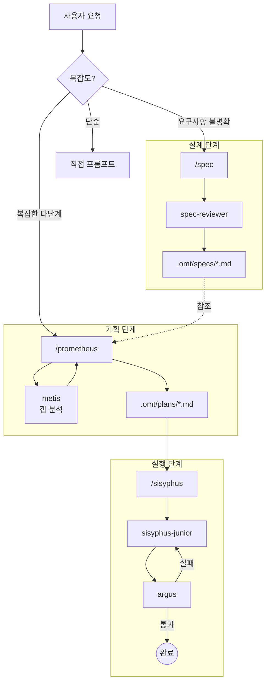

# Oh-My-Toong 오케스트레이션 가이드

한국어 | **[English](ORCHESTRATION.en.md)**

---

## 핵심 요약 - 언제 무엇을 사용할까

| 복잡도 | 접근 방식 | 사용 시점 |
|--------|----------|-----------|
| **단순** | 그냥 프롬프트 | 빠른 수정, 단일 파일 변경 |
| **중간** | `/spec` | 코딩 전 명확한 요구사항 필요 |
| **복잡** | `/prometheus` -> `/sisyphus` | 기획과 조율이 필요한 다단계 작업 |

**결정 흐름:**

```
빠른 수정이나 단순 작업인가?
  |-- 예 -> 그냥 평소처럼 프롬프트
  |-- 아니오 -> 요구사항이 불명확하거나 복잡한가?
                  |-- 예 -> /spec으로 명세 먼저 작성
                  |-- 아니오 -> 다단계 실행이 필요한가?
                                  |-- 예 -> /prometheus로 기획 -> /sisyphus로 실행
                                  |-- 아니오 -> 컨텍스트와 함께 프롬프트
```

---

## 1. 개요

기존 AI 에이전트는 종종 기획과 실행을 섞어서 다음과 같은 문제를 일으킵니다:
- **컨텍스트 오염**: 계획 세부사항과 코드 변경이 뒤섞임
- **목표 이탈**: 구현 도중 원래 목표를 놓침
- **AI 슬롭**: 제대로 된 기획 없이 급하게 작성한 저품질 코드

Oh-My-Toong은 역할을 명확히 분리하여 이를 해결합니다:

| 역할 | 에이전트 | 책임 |
|------|----------|------|
| **명세** | spec | 기획 전 테스트 가능한 요구사항 작성 |
| **기획** | prometheus | 전략적 기획, 절대 코드 작성 안 함 |
| **실행** | sisyphus | 위임을 통한 조율, 절대 단독 작업 안 함 |
| **구현** | sisyphus-junior | 코드 작성 (sisyphus가 위임) |
| **검증** | argus | 모든 구현 검증 |

---

## 2. 전체 아키텍처



---

## 3. 핵심 컴포넌트

### spec (명세 전문가)

- **역할**: 포괄적이고 테스트 가능한 명세 작성
- **제약**: 사용자 확인 없이 단계 완료 불가
- **출력**: `.omt/specs/{name}/spec.md`
- **핵심 기능**: spec-reviewer를 통한 다중 AI 피드백

### prometheus (기획자)

- **역할**: 전략적 기획, 요구사항 인터뷰
- **제약**: **READ-ONLY**. 절대 코드 작성 안 함.
- **출력**: `.omt/plans/{name}.md`
- **워크플로우**: 인터뷰 -> 조사 -> Metis 상담 -> 계획 작성

### sisyphus (오케스트레이터)

- **역할**: 실행과 위임
- **제약**: **절대 단독 작업 안 함**. 모든 코드 변경 = sisyphus-junior 위임.
- **신뢰 모델**: sisyphus-junior의 "완료" 주장에 Zero Trust
- **검증**: 모든 구현 후 argus 필수 호출

### sisyphus-junior (구현자)

- **역할**: 실제 코드 작성
- **제약**: 단독 작업. 다른 에이전트에 위임 안 함.
- **규율**: 엄격한 태스크 집중, 즉시 완료 표시

### argus (백눈의 감시자)

- **역할**: 모든 구현 검증 - 잠들지 않는 눈
- **기능**: 빌드/테스트/린트 실행, 코드 품질 평가
- **판정**: APPROVE, REQUEST_CHANGES, 또는 COMMENT

---

## 4. 워크플로우

### 1단계: 명세 (선택이지만 권장)

복잡한 기능의 경우 `/spec`으로 시작:

1. **단계 선택**: 필요한 단계 선택 (요구사항, 아키텍처, 도메인 등)
2. **단계 실행**: 각 단계별 설계 작업
3. **다중 AI 리뷰**: spec-reviewer가 각 단계 후 피드백 제공
4. **사용자 확인**: 명시적 승인 후에만 진행

### 2단계: 기획

요구사항이 명확할 때 `/prometheus` 사용:

1. **인터뷰 모드**: 질문을 통해 컨텍스트 수집
2. **조사**: explore/librarian 에이전트로 코드베이스 조사
3. **Metis 상담**: 계획 작성 전 필수 갭 분석
4. **계획 생성**: `.omt/plans/*.md`에 구조화된 계획 작성

### 3단계: 실행

계획이 준비되면 `/sisyphus` 사용:

1. **태스크 생성**: 계획을 TaskCreate 항목으로 분해
2. **위임**: sisyphus-junior에 태스크 할당
3. **검증**: argus가 모든 완료 검증
4. **반복**: 모든 태스크가 리뷰 통과할 때까지 계속

---

## 5. 명령어

| 명령어 | 용도 | 출력 |
|--------|------|------|
| `/spec <설명>` | 소프트웨어 명세 작성 | `.omt/specs/*.md` |
| `/prometheus <작업>` | 작업 계획 생성 | `.omt/plans/*.md` |
| `/sisyphus` | 조율을 통한 계획 실행 | 검증된 코드 변경 |
| `/ralph <작업>` | oracle 검증과 함께 반복적 완료 | 작업 완료 |
| `/hud setup\|restore` | HUD 설정 및 관리 | statusLine 설정 |
| `/cancel-ralph` | Ralph Loop 취소 | 상태 파일 정리 |

---

## 6. 모범 사례

### 1. 기획을 건너뛰지 마세요

"단순한" 작업도 간단한 기획으로 이점을 얻습니다. 기획에 투자한 시간이 나중에 디버깅 시간을 절약합니다.

### 2. 검증 프로토콜을 신뢰하세요

argus가 변경을 요청하면 수정하세요. 논쟁하거나 건너뛰지 마세요. 프로토콜은 실제 이슈를 잡기 위해 존재합니다.

### 3. 불명확한 요구사항에는 명세를 사용하세요

prometheus 도중 요구사항을 반복적으로 명확히 해야 한다면, 한 걸음 물러나서 `/spec`을 먼저 사용하세요.

### 4. 에이전트가 자기 일을 하게 두세요

- sisyphus-junior의 작업을 수동으로 검증하지 마세요 (argus의 일입니다)
- prometheus에게 "그냥 코드를 작성해달라"고 요청하지 마세요 (할 수 없고 하지 않습니다)
- sisyphus 실행 중에 끼어들지 마세요 (어차피 계속됩니다)

### 5. 단일 계획 원칙

모든 TODO를 하나의 계획 파일에 담으세요. 컨텍스트 분산을 방지하고 진행 추적을 쉽게 합니다.

---

## 7. 문제 해결

| 문제 | 해결책 |
|------|--------|
| Prometheus가 계속 인터뷰함 | 더 많은 컨텍스트가 필요합니다. 자세히 답하거나 "지금 계획을 생성해"라고 말하세요. |
| Sisyphus가 멈추지 않음 | 설계된 대로입니다. 검증 통과까지 지속됩니다. |
| argus가 계속 실패함 | 피드백을 주의 깊게 검토하세요. 이슈는 실제입니다. |
| 명세가 너무 오래 걸림 | 관련 없는 단계는 건너뛰세요 (단순 CRUD에는 아키텍처 단계가 필요 없습니다). |

---

## 참고 자료

- [README](../README.md) - 프로젝트 개요
- [핵심 스킬 아키텍처](../README.md#핵심-스킬-아키텍처) - 다이어그램과 함께하는 스킬 상세
