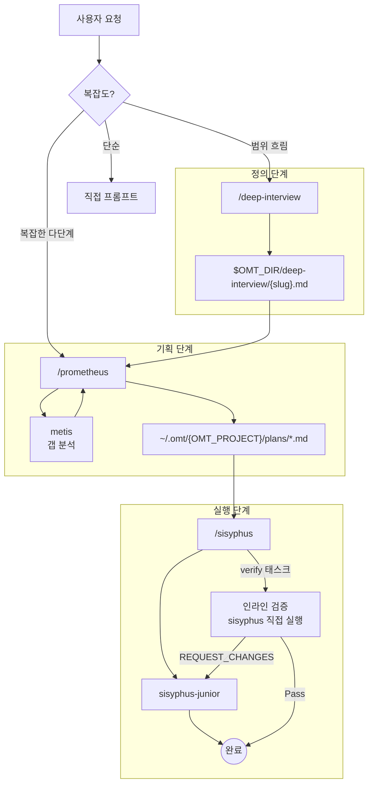

# Oh-My-Toong 오케스트레이션 가이드

한국어 | **[English](ORCHESTRATION.en.md)**

---

## 핵심 요약 - 언제 무엇을 사용할까

| 복잡도 | 접근 방식 | 사용 시점 |
|--------|----------|-----------|
| **단순** | 그냥 프롬프트 | 빠른 수정, 단일 파일 변경 |
| **범위 흐림** | `/deep-interview` -> `/prometheus` -> `/sisyphus` | 아이디어는 있지만 요구사항이 불명확한 작업 |
| **복잡** | `/prometheus` -> `/sisyphus` | 기획과 조율이 필요한 다단계 작업 |

**결정 흐름:**

```
빠른 수정이나 단순 작업인가?
  |-- 예 -> 그냥 평소처럼 프롬프트
  |-- 아니오 -> 요구사항이 명확한가?
                  |-- 아니오 -> /deep-interview로 명세 수렴 -> /prometheus -> /sisyphus
                  |-- 예 -> 다단계 실행이 필요한가?
                              |-- 예 -> /prometheus로 기획 -> /sisyphus로 실행
                              |-- 아니오 -> 컨텍스트와 함께 프롬프트
```

---

## 1. 개요

기존 AI 에이전트는 종종 기획과 실행을 섞어서 다음과 같은 문제를 일으킵니다:
- **컨텍스트 오염**: 계획 세부사항과 코드 변경이 뒤섞임
- **목표 이탈**: 구현 도중 원래 목표를 놓침
- **AI 슬롭**: 제대로 된 기획 없이 급하게 작성한 저품질 코드

Oh-My-Toong은 역할을 명확히 분리하여 이를 해결합니다:

| 역할 | 에이전트 | 책임 |
|------|----------|------|
| **정의** | deep-interview | 모호성을 해소해 명세로 수렴, 절대 코드 작성 안 함 |
| **기획** | prometheus | 전략적 기획, 절대 코드 작성 안 함 |
| **실행** | sisyphus | 위임을 통한 조율, 절대 단독 작업 안 함 |
| **구현** | sisyphus-junior | 코드 작성 (sisyphus가 위임) |
| **품질 보증** | sisyphus (인라인 검증) | verify 태스크의 AC 명령을 직접 실행해 구현 품질·계획 준수·지시 이행 검증 |

---

## 2. 전체 아키텍처


```mermaid
flowchart TD
    User[사용자 요청] --> Decision{복잡도?}

    Decision -->|단순| Direct[직접 프롬프트]
    Decision -->|범위 흐림| DeepInterview["/deep-interview"]
    Decision -->|복잡한 다단계| Prometheus

    subgraph 정의 단계
        DeepInterview --> SpecFile["$OMT_DIR/deep-interview/{slug}.md"]
    end

    subgraph 기획 단계
        SpecFile --> Prometheus["/prometheus"]
        Prometheus --> Metis[metis<br/>갭 분석]
        Metis --> Prometheus
        Prometheus --> PlanFile["~/.omt/{OMT_PROJECT}/plans/*.md"]
    end

    subgraph 실행 단계
        PlanFile --> Sisyphus["/sisyphus"]
        Sisyphus --> Junior[sisyphus-junior]
        Junior --> Done((완료))
        Sisyphus -->|verify 태스크| QA[인라인 검증<br/>sisyphus 직접 실행]
        QA -->|Pass| Done
        QA -->|REQUEST_CHANGES| Junior
    end
```

---

## 3. 핵심 컴포넌트

### deep-interview (정의자)

- **역할**: 모호한 아이디어를 자율 실행 전에 명세로 수렴
- **제약**: 모호성 점수가 임계값을 넘으면 실행으로 넘어가지 않음. 직접 구현 안 함.
- **출력**: `$OMT_DIR/deep-interview/{slug}.md` (prometheus의 입력)
- **워크플로우**: 한 번에 한 질문, 가장 약한 명확성 차원을 겨냥 -> 모호성 측정 -> 임계값 이하면 명세 확정
- **출처**: oh-my-claudecode(omc)의 구현이 워낙 잘 만들어져 거의 그대로 가져와 다듬었습니다 (originally [Ouroboros](https://github.com/Q00/ouroboros) 영감)

### prometheus (기획자)

- **역할**: 전략적 기획, 요구사항 인터뷰
- **제약**: **READ-ONLY**. 절대 코드 작성 안 함.
- **출력**: `~/.omt/{OMT_PROJECT}/plans/{name}.md` (`$OMT_DIR` 경유)
- **워크플로우**: 인터뷰 -> 조사 -> Metis 상담 -> 계획 작성

### sisyphus (오케스트레이터)

- **역할**: 실행과 위임
- **제약**: **절대 단독 작업 안 함**. 모든 코드 변경 = sisyphus-junior 위임.
- **검증**: verify 태스크(AC 명시 + PASS/FAIL 판정)는 sisyphus가 AC 명령을 직접 실행해 인라인으로 처리(junior 생략) — 별도 QA 에이전트는 없습니다. implement 태스크는 sisyphus-junior의 완료 보고로 완결 — implement 경로에는 별도 QA 단계가 없습니다.

### sisyphus-junior (구현자)

- **역할**: 실제 코드 작성
- **제약**: 단독 작업. 다른 에이전트에 위임 안 함.
- **규율**: 엄격한 태스크 집중, 즉시 완료 표시

### 인라인 검증 (sisyphus가 직접 수행)

- **역할**: verify 태스크의 구현 품질·계획 준수·지시 이행 검증 — 별도 QA 에이전트 없이 sisyphus가 직접 수행
- **기능**: AC로 명시된 빌드/테스트/린트 명령을 직접 실행하고 증거를 저장한 뒤 판정
- **판정**: APPROVE, REQUEST_CHANGES, 또는 COMMENT
- **수동 QA**: 명시적·대규모 검증이 필요하면 `qa` 스킬을 직접 호출할 수 있습니다(이제 별도 에이전트로 감싸지 않습니다)

---

## 4. 워크플로우

### 0단계: 정의 (범위가 흐릴 때)

요구사항이 불명확하면 기획 전에 `/deep-interview`로 명세를 먼저 수렴시킵니다:

1. **한 질문씩**: 가장 약한 명확성 차원을 겨냥해 질문
2. **모호성 게이팅**: 점수가 임계값 아래로 떨어질 때까지 반복
3. **명세 확정**: `$OMT_DIR/deep-interview/{slug}.md`에 저장 -> prometheus 입력

### 1단계: 기획

요구사항이 명확할 때 `/prometheus` 사용:

1. **인터뷰 모드**: 질문을 통해 컨텍스트 수집
2. **조사**: explore/librarian 에이전트로 코드베이스 조사
3. **Metis 상담**: 계획 작성 전 필수 갭 분석
4. **계획 생성**: `~/.omt/{OMT_PROJECT}/plans/*.md`에 구조화된 계획 작성

### 2단계: 실행

계획이 준비되면 `/sisyphus` 사용:

1. **태스크 생성**: 계획을 TaskCreate 항목으로 분해
2. **위임**: sisyphus-junior에 태스크 할당
3. **품질 보증**: verify 태스크는 sisyphus가 AC 명령을 직접 실행해 인라인으로 PASS/FAIL 판정을 내리고(junior 생략), implement 태스크는 sisyphus-junior의 완료 보고로 완결(별도 QA 단계 없음)
4. **반복**: 모든 태스크가 리뷰 통과할 때까지 계속

---

## 5. 명령어

| 명령어 | 용도 | 출력 |
|--------|------|------|
| `/deep-interview <아이디어>` | 모호성 게이팅으로 명세 수렴 | `$OMT_DIR/deep-interview/{slug}.md` |
| `/prometheus <작업>` | 작업 계획 생성 | `~/.omt/{OMT_PROJECT}/plans/*.md` |
| `/sisyphus` | 조율을 통한 계획 실행 | 검증된 코드 변경 |
| `/hud setup\|restore` | HUD 설정 및 관리 | statusLine 설정 |

---

## 6. 모범 사례

### 1. 기획을 건너뛰지 마세요

"단순한" 작업도 간단한 기획으로 이점을 얻습니다. 기획에 투자한 시간이 나중에 디버깅 시간을 절약합니다.

### 2. 검증 프로토콜을 신뢰하세요

인라인 검증이 변경을 요청하면(REQUEST_CHANGES) 수정하세요. 논쟁하거나 건너뛰지 마세요. 프로토콜은 실제 이슈를 잡기 위해 존재합니다.

### 3. 불명확한 요구사항에는 인터뷰 모드를 활용하세요

prometheus 도중 요구사항을 반복적으로 명확히 해야 한다면, 더 충분한 답변을 제공하거나 인터뷰 모드에서 컨텍스트를 먼저 정리하세요.

### 4. 에이전트가 자기 일을 하게 두세요

- sisyphus-junior의 작업을 수동으로 검증하지 마세요 — junior가 빌드/타입체크/테스트로 자가 검증하고, 별도 verify 태스크가 있으면 sisyphus가 인라인으로 검증합니다
- prometheus에게 "그냥 코드를 작성해달라"고 요청하지 마세요 (할 수 없고 하지 않습니다)
- sisyphus 실행 중에 끼어들지 마세요 (어차피 계속됩니다)

### 5. 단일 계획 원칙

모든 TODO를 하나의 계획 파일에 담으세요. 컨텍스트 분산을 방지하고 진행 추적을 쉽게 합니다.

---

## 7. 문제 해결

| 문제 | 해결책 |
|------|--------|
| Prometheus가 계속 인터뷰함 | 더 많은 컨텍스트가 필요합니다. 자세히 답하거나 "지금 계획을 생성해"라고 말하세요. |
| Sisyphus가 멈추지 않음 | 설계된 대로입니다. 검증 통과까지 지속됩니다. |
| 인라인 검증이 계속 실패함 | 피드백을 주의 깊게 검토하세요. 이슈는 실제입니다. |

---

## 참고 자료

- [README](../README.md) - 프로젝트 개요
- [핵심 파이프라인 스킬](skills/core-pipeline.md) - deep-interview · prometheus · sisyphus 상세
