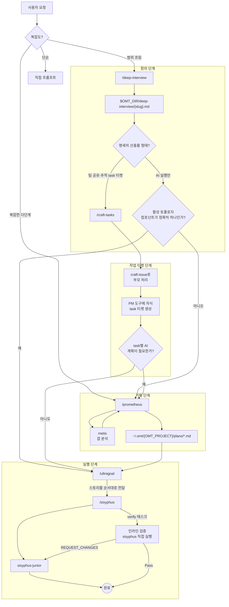

# Oh-My-Toong 오케스트레이션 가이드

한국어 | **[English](ORCHESTRATION.en.md)**

---

## 핵심 요약 - 언제 무엇을 사용할까

| 복잡도 | 접근 방식 | 사용 시점 |
|--------|----------|-----------|
| **단순** | 그냥 프롬프트 | 빠른 수정, 단일 파일 변경 |
| **팀 작업 티켓** | `/deep-interview` -> `/craft-tasks` -> task별 선택적 `/prometheus` -> `/ultragoal` -> `/sisyphus` | 확정된 설계를 팀이 공유·추적할 구현 task 티켓으로 만들 때 |
| **범위 흐림** | `/deep-interview` -> AI 실행만 필요하면 `/ultragoal` (또는 `/prometheus` -> `/ultragoal`) -> `/sisyphus` | 아이디어는 있지만 요구사항이 불명확한 작업 |
| **복잡** | `/prometheus` -> `/ultragoal` -> `/sisyphus` | 기획과 조율이 필요한 다단계 작업 |

**결정 흐름:**

```
빠른 수정이나 단순 작업인가?
  |-- 예 -> 그냥 평소처럼 프롬프트
  |-- 아니오 -> 요구사항이 명확한가?
                  |-- 아니오 -> /deep-interview로 명세 수렴
                                |-- 팀이 공유·추적할 구현 task 티켓이 필요한가?
                                      |-- 예 -> /craft-tasks로 작업 생성·최신화 (부모 처리는 craft-issue)
                                               -> task별 필요할 때만 /prometheus
                                               -> /ultragoal -> /sisyphus
                                      |-- 아니오 -> 활성 토폴로지 컴포넌트가 정확히 하나면 /ultragoal
                                                   아니면 /prometheus -> /ultragoal -> /sisyphus
                  |-- 예 -> 다단계 실행이 필요한가?
                              |-- 예 -> /prometheus로 기획 -> /ultragoal -> /sisyphus로 실행
                              |-- 아니오 -> 컨텍스트와 함께 프롬프트
```

---

## 1. 개요

기존 AI 에이전트는 종종 기획과 실행을 섞어서 다음과 같은 문제를 일으킵니다:
- **컨텍스트 오염**: 계획 세부사항과 코드 변경이 뒤섞임
- **목표 이탈**: 구현 도중 원래 목표를 놓침
- **AI 슬롭**: 제대로 된 기획 없이 급하게 작성한 저품질 코드

Oh-My-Toong은 역할을 명확히 분리하여 이를 해결합니다:

| 역할 | 에이전트 | 책임 |
|------|----------|------|
| **정의** | deep-interview | 모호성을 해소해 명세로 수렴, 절대 코드 작성 안 함 |
| **작업 티켓화** | craft-tasks | 확정된 설계를 자식 task 티켓으로 생성·최신화하고 부모 처리는 craft-issue에 위임 |
| **기획** | prometheus | 전략적 기획, 절대 코드 작성 안 함 |
| **스토리 실행** | ultragoal | 계획의 스토리를 순서대로 sisyphus에 전달 |
| **실행** | sisyphus | 위임을 통한 조율, 절대 단독 작업 안 함 |
| **구현** | sisyphus-junior | 코드 작성 (sisyphus가 위임) |
| **품질 보증** | sisyphus (인라인 검증) | verify 태스크의 AC 명령을 직접 실행해 구현 품질·계획 준수·지시 이행 검증 |

---

## 2. 전체 아키텍처


```mermaid
flowchart TD
    User[사용자 요청] --> Decision{복잡도?}

    Decision -->|단순| Direct[직접 프롬프트]
    Decision -->|범위 흐림| DeepInterview["/deep-interview"]
    Decision -->|복잡한 다단계| Prometheus

    subgraph 정의 단계
        DeepInterview --> SpecFile["$OMT_DIR/deep-interview/{slug}.md"]
        SpecFile --> Output{명세의 산출물 형태?}
        Output -->|팀 공유·추적 task 티켓| CraftTasks["/craft-tasks"]
        Output -->|AI 실행만| Route{활성 토폴로지<br/>컴포넌트가 정확히 하나인가?}
    end

    subgraph 작업 티켓 단계
        CraftTasks --> Parent["craft-issue로<br/>부모 처리"]
        Parent --> ChildTickets["PM 도구에 자식<br/>task 티켓 생성"]
        ChildTickets --> TaskPlan{task별 AI<br/>계획이 필요한가?}
    end

    subgraph 기획 단계
        Route -->|아니오| Prometheus["/prometheus"]
        TaskPlan -->|예| Prometheus
        Prometheus --> Metis[metis<br/>갭 분석]
        Metis --> Prometheus
        Prometheus --> PlanFile["~/.omt/{OMT_PROJECT}/plans/*.md"]
    end

    subgraph 실행 단계
        Route -->|예| Ultragoal["/ultragoal"]
        TaskPlan -->|아니오| Ultragoal
        PlanFile --> Ultragoal
        Ultragoal -->|스토리를 순서대로 전달| Sisyphus["/sisyphus"]
        Sisyphus --> Junior[sisyphus-junior]
        Junior --> Done((완료))
        Sisyphus -->|verify 태스크| QA[인라인 검증<br/>sisyphus 직접 실행]
        QA -->|Pass| Done
        QA -->|REQUEST_CHANGES| Junior
    end
```

---

## 3. 핵심 컴포넌트

### deep-interview (정의자)

- **역할**: 모호한 아이디어를 자율 실행 전에 명세로 수렴
- **제약**: 질문 횟수 제한 없이 열린 결정을 추적. 점수 임계값과 종료 점검을 모두 통과해야 완료. 직접 구현 안 함.
- **출력**: `$OMT_DIR/deep-interview/{slug}.md`
- **워크플로우**: 한 번에 한 질문으로 결정·반례·충돌 추적 -> 의존 결정 재검토 -> 근거와 남은 가정으로 종료 점검 -> 명세 확정 -> 5단계에서 산출물이 팀이 공유·추적할 구현 task 티켓이면 `/craft-tasks`를 권장하고, 그렇지 않고 AI 실행만 필요하면 활성 토폴로지 컴포넌트가 정확히 하나일 때 `/ultragoal`, 아니면 `/prometheus`를 권장. 권장하지 않은 다른 스킬은 명시적 재정의 옵션으로 제시
- **출처**: oh-my-claudecode에서 출발해 [Ouroboros](https://github.com/Q00/ouroboros)의 종료 점검과 [grilling](https://github.com/mattpocock/skills)의 결정 의존관계 추적을 참고해 개선했습니다.

### craft-tasks (작업 티켓 생성자)

- **역할**: 확정된 설계를 팀이 공유·추적할 수 있는 구현 task 티켓으로 분해
- **제약**: 의도·접근 방식·불변식·경계가 확정된 설계에만 사용합니다. AI 실행 계획만 필요하면 `prometheus`를 사용합니다.
- **출력**: 검증된 부모 아래 PM 도구에 생성된 자식 task 티켓
- **워크플로우**: deep-interview 명세를 바탕으로 부모 처리를 craft-issue에 맡기고, 반환된 부모 연결을 검증한 뒤 기존 작업의 본문을 최신화하고 누락된 구현 task만 생성합니다. 생성·업데이트의 실행 계약은 `skills/craft-tasks/SKILL.md`와 `skills/craft-tasks/scripts/task-write-journal.ts`에 있으며, 실제 PM API는 이 저장소의 harness 바깥에 있다는 기존 경계를 따릅니다.

#### PM 쓰기 저널 계약과 복구

`task-write-journal.ts`는 세션별 `$OMT_DIR/task-write-journal-<sessionId>.json`에 crash-atomic한 로컬 orchestration intent를 기록합니다. 이 저널은 PM 필드·코멘트·idempotency primitive가 아니므로 PM custom field나 존재하지 않는 idempotency primitive를 발명하지 않습니다.

새 자식은 정확한 `save_issue` 생성 payload를 먼저 `create-prepare`로 기록한 뒤에만 `save_issue`를 호출합니다. `create-prepare`는 생성한 `taskKey`에서 canonical Task identity comment를 구성해 payload에 바인딩하고, `save_issue`에 그대로 전달할 정확한 `creationPayload`를 반환합니다. 반환된 자식의 `parentId`와 정확한 `designAnchor`를 검증한 뒤 `create-child`로 `childId`를 기록하고, 그 다음 canonical identity comment를 씁니다. `create-complete`는 저장된 comment가 해당 `taskKey`에서 파생된 정확한 canonical comment인지 검증한 뒤, PM에서 다시 읽은 `title`(있으면)·`body`·`relations`·`identityComment`가 저장된 `creationPayload`와 일치하는지 확인합니다. 이 PM re-read가 모두 통과한 뒤에만 완료 처리합니다. 응답이 사라지면 기존 intent를 다시 읽고, 기록된 `childId`가 있으면 그 자식과 exact identity comment를 다시 읽어 누락된 쓰기만 재시도합니다. 정확한 결과가 없으면 `manual-reconciliation`을 호출해 `manual-reconciliation-required`를 기록하고 종료합니다. 제목·본문·시간·트리 위치로 자식을 추정하거나 대체 자식을 생성하지 않습니다.

교차 세션 복구는 `list --pending`으로 시작해 명시적으로 `sourceSessionId`를 선택한 다음 `get <intentId> --source-session <sourceSessionId>`로 해당 저널을 읽습니다. 이후 다른 세션의 intent를 전이할 때도 `create-child`, `create-complete`, `update-mutation-written`, `update-complete`, `manual-reconciliation`에 같은 `--source-session <sourceSessionId>`를 명시합니다. 인자를 생략한 조회·전이는 현재 세션 저널만 대상으로 합니다. `list --pending`은 읽기 전용이며 저널 파일과 intent ID를 정렬한 결정적 JSON을 반환하고, 손상된 저널은 `sourceSessionId`가 포함된 명시적 오류 항목으로 표면화합니다. 세션 간 자동 fallback, 저널 복사, 대체 자식 생성은 금지합니다.

기존 자식의 본문·native relations를 바꿀 때는 PM mutation 전에 정확한 `before`·`after`·`changeComment`를 `update-prepare`로 저장합니다. PM mutation과 change comment를 쓴 직후 `update-mutation-written`을 기록하고, body·relations·change comment를 다시 읽어 확인한 뒤에만 `update-complete`를 호출합니다. 중단 시 `get`으로 intent의 변경 문맥을 보존하고 누락된 쓰기만 수행하며, 검증된 자식 결과가 없으면 위와 같은 terminal manual reconciliation으로 멈춥니다.

### prometheus (기획자)

질문 횟수 상한 없이 선행 결정부터 명확화합니다. 매 답변 뒤 여섯 차원의 가중 점수와 결정 변화를 보여주고, 미응답은 열린 선택으로 남깁니다. 명시적 위임은 근거를 갖춰 결정하며, deep-interview에서 확정한 결정은 새 근거가 전제를 바꿀 때만 재검토합니다. ultraresearch는 상충 주장·다중 출처 검증에 사용하고 조사 한 번의 자원 한도와 질문 깊이를 구분합니다. 점수뿐 아니라 단계별 종료 점검을 통과해야 하며, Metis·사용자 설계 승인·Momus·HTML 제출 절차는 유지합니다.

- **역할**: 전략적 기획, 요구사항 인터뷰
- **제약**: **READ-ONLY**. 절대 코드 작성 안 함.
- **출력**: `~/.omt/{OMT_PROJECT}/plans/{name}.md` (`$OMT_DIR` 경유)
- **워크플로우**: 범위 분할 판정 -> 인터뷰 -> 조사 -> Metis 상담 -> 계획 작성 -> `/ultragoal`에 전달
- **사용 시점**: 팀 task 티켓이 필요 없는 AI 실행 경로에서 사용하거나, `craft-tasks`가 만든 각 task에 별도 AI 실행 계획이 필요할 때만 선택합니다.
- **범위 분할**: Complex·Architecture 요청은 인터뷰 전에 "혼자 머지해도 시스템이 도는 부분집합이 있나"를 먼저 묻고, 있으면 첫 덩어리만 이번 실행의 범위로 삼습니다. 나머지는 각자 별도 prometheus 실행이 됩니다.

### ultragoal (스토리 실행자)

- **역할**: 계획의 스토리를 순서대로 실행
- **워크플로우**: 각 스토리를 `/sisyphus`에 순차적으로 전달하고, 이전 스토리가 끝난 뒤 다음 스토리를 시작

#### 반복 예산·진전 없음·재개

- pursuit 중 `iteration`은 진전이 관찰되지 않은 Stop의 연속 횟수입니다. diff를 포함한 커밋이나 Story 상태 전환이 발생하면 `0`으로 리셋되며, 백그라운드 작업을 기다리는 Stop은 집계하지 않습니다.
- `max_iterations`(기본 10)에 도달하면 새 작업을 디스패치하지 않고 상태를 보존한 비완료 `budget_limited`로 소프트 정지합니다. 진행 중 작업을 비운 뒤 completion gate를 확인하고, 사용자만 `resume-pursuit`를 실행해 `pursuing`과 `iteration=0`을 복원할 수 있습니다.
- `blocked`는 별도 경로입니다. 실행 가능한 미완료 항목이 없는 B1이거나 설정한 `blocked-stop` 조건이 충족될 때만 보고합니다.

#### 최종 리뷰 결과 계약

최종 리뷰는 기존 네 가지 finder 관점(정확성, 회귀, 정리, 요구사항 누락)을 유지합니다. `impact`는 발생했을 때의 순수한 피해만 나타내며, 발생 빈도·노출·패치 크기·유지보수 비용·finder 관점을 대리값으로 사용하지 않습니다. `priority`는 대응 권고입니다. 실제 노출과 피해를 기준으로, 최소 remedy가 만드는 영구적 복잡성·유지보수 부담·회귀 위험까지 비교해 HIGH/MEDIUM/LOW를 정하며, 구현 난이도나 작업량 자체로 낮추지 않습니다. `COMPLETE`의 모든 finding에는 `unfixed_cost`, `exposure`, `remedy`, `added_cost`, `rationale` 다섯 assessment 문자열이 모두 비어 있지 않아야 합니다.

최종 `code-reviewer`에는 직렬화된 리뷰 컨텍스트와 caller가 소유한 opaque artifact destination만 전달합니다. generic code-review publisher는 원본 CodeReviewArtifact JSON을 그대로 저장하고 `{path, sha256}` transport receipt만 반환합니다. publisher는 ultragoal을 알지 못하며 priority, scope, 수리, 완료, 예산 또는 승인 정책을 결정하지 않습니다. parent orchestrator는 receipt를 직접 해석하지 않고 `get-review-result` CLI를 명시적으로 호출해 원본 결과를 가져온 뒤 아래 consumer 정책을 적용합니다.

Consumer는 먼저 scope를 판정합니다. `OUT_OF_SCOPE`는 비차단 NOTE로 남기고, `UNKNOWN`은 수리 없이 차단합니다. `PLAUSIBLE` 검증이 해소되지 않거나 scope 판정이 미완료이면 reviewer artifact의 `INCONCLUSIVE` 상태를 그대로 소비하고, consumer가 이를 기록하거나 덮어쓰지 않은 채 `REQUEST_CHANGES`로 라우팅합니다.

확정된(`CONFIRMED`) IN_SCOPE finding의 라우팅은 다음과 같습니다.

| Priority | Consumer 처리 |
|---|---|
| HIGH | `REQUEST_CHANGES` → 수리, 영향받은 검사, 새 리뷰 |
| MEDIUM | `COMMENT` → 수리, 영향받은 검사, `record-comment-resolution --artifact-sha256 <sha> --evidence <경로들>`로 hash-bound 증거 기록; 재리뷰 없음 |
| LOW | `COMMENT` → 보고만 함; 수리·검사 증거·재리뷰 없음 |

혼합 결과의 우선순위는 `REQUEST_CHANGES` > `COMMENT` > `APPROVE`입니다. 진짜 finding이 하나도 없을 때만 `APPROVE`이며, `OUT_OF_SCOPE` NOTE만 있으면 `COMMENT`, `UNKNOWN` 또는 `INCONCLUSIVE`가 있으면 `REQUEST_CHANGES`입니다. 초기 5회 review budget은 `REQUEST_CHANGES` 라운드와 reviewer 부재 재시도에만 사용하며, `COMMENT`와 `APPROVE`는 추가 dispatch를 허용하지 않고 budget renewal로도 이 규칙을 우회할 수 없습니다. objective와 기타 completion gate는 계속 적용됩니다.

### sisyphus (오케스트레이터)

- **역할**: 실행과 위임
- **제약**: **절대 단독 작업 안 함**. 모든 코드 변경 = sisyphus-junior 위임.
- **검증**: verify 태스크(AC 명시 + PASS/FAIL 판정)는 sisyphus가 AC 명령을 직접 실행해 인라인으로 처리(junior 생략) — 별도 QA 에이전트는 없습니다. 모든 implement 태스크는 같은 태스크 목록에 verify 태스크가 짝으로 생성되므로 junior 산출물은 항상 판정까지 도달합니다. junior의 자체 검증은 그 판정의 증거이지 판정을 대신하지 않습니다.
- **커밋**: APPROVE 또는 COMMENT가 나오면 sisyphus가 mnemosyne을 디스패치해 해당 태스크의 변경을 커밋합니다. REQUEST_CHANGES 상태에서는 아무것도 커밋하지 않으며, 판정이 통과했는데 변경이 커밋되지 않은 채로 남으면 그 태스크는 미완료입니다.

### sisyphus-junior (구현자)

- **역할**: 실제 코드 작성
- **제약**: 단독 작업. 다른 에이전트에 위임 안 함.
- **규율**: 엄격한 태스크 집중, 즉시 완료 표시

### 인라인 검증 (sisyphus가 직접 수행)

- **역할**: verify 태스크의 구현 품질·계획 준수·지시 이행 검증 — 별도 QA 에이전트 없이 sisyphus가 직접 수행
- **기능**: AC로 명시된 빌드/테스트/린트 명령을 직접 실행하고 증거를 저장한 뒤 판정
- **판정**: APPROVE, REQUEST_CHANGES, 또는 COMMENT
- **수동 QA**: 명시적·대규모 검증이 필요하면 `qa` 스킬을 직접 호출할 수 있습니다(이제 별도 에이전트로 감싸지 않습니다)

---

## 4. 워크플로우

### 0단계: 정의 (범위가 흐릴 때)

요구사항이 불명확하면 기획 전에 `/deep-interview`로 명세를 먼저 수렴시킵니다:

1. **한 질문씩, 횟수 제한 없이**: 선행 결정부터 질문하고 답변이 드러낸 분기·반례·충돌을 추적
2. **종료 점검**: 점수는 조사 방향을 돕습니다. 구현을 바꿀 미결정이 없고, 근거·실패 시나리오·남은 가정을 검토한 뒤 사용자와 이해를 확인합니다. 중단은 즉시 존중하고 조기 전달은 DRAFT로 표시합니다.
3. **명세 확정 및 경로 선택**: `$OMT_DIR/deep-interview/{slug}.md`에 저장합니다. 5단계에서 산출물이 팀이 공유·추적할 구현 task 티켓이면 `/craft-tasks`를 권장합니다. `craft-tasks`는 부모 처리를 craft-issue에 위임하고 PM 도구의 자식 task 티켓을 생성·최신화하며, 각 task에 AI 실행 계획이 필요할 때만 `/prometheus`를 선택적으로 적용합니다. 이후 AI 실행은 `/ultragoal`이 `/sisyphus`에 전달합니다. 팀 task 티켓이 필요하지 않고 AI 실행만 필요한 명세는 기존대로 활성 토폴로지 컴포넌트가 정확히 하나면 `/ultragoal`, 아니면 `/prometheus` -> `/ultragoal` -> `/sisyphus`를 권장하고, 권장하지 않은 스킬은 명시적 재정의 옵션으로 제시합니다.

### 1단계: 기획

확정된 설계를 팀이 공유·추적할 task 티켓으로 만들려면 `/craft-tasks`를 사용합니다. `craft-tasks`가 부모 처리를 craft-issue에 맡기고 자식 티켓을 생성·최신화한 뒤, 각 task의 AI 실행 계획이 필요할 때만 `/prometheus`를 선택적으로 사용합니다.

팀 task 티켓 없이 AI 실행 계획이 필요하고 요구사항이 명확할 때 `/prometheus`를 사용합니다:

1. **범위 분할 판정**: Complex·Architecture 요청만 해당. 혼자 머지해도 시스템이 도는 부분집합이 있으면 덩어리를 순서대로 나열하고 첫 덩어리만 이번 범위로 잡습니다
2. **인터뷰 모드**: 질문을 통해 컨텍스트 수집
3. **조사**: explore/librarian 에이전트로 코드베이스 조사
4. **Metis 상담**: 계획 작성 전 필수 갭 분석
5. **계획 생성**: `~/.omt/{OMT_PROJECT}/plans/*.md`에 구조화된 계획 작성

### 2단계: 스토리 실행

계획이 준비되면 `/ultragoal`이 스토리를 순서대로 `/sisyphus`에 전달합니다:

1. **스토리 순차 처리**: 이전 스토리가 끝난 뒤 다음 스토리를 sisyphus에 전달
2. **태스크 생성**: sisyphus가 스토리를 TaskCreate 항목으로 분해
3. **위임**: sisyphus-junior에 태스크 할당
4. **품질 보증**: 모든 implement 태스크에 verify 태스크가 짝으로 붙고, sisyphus가 AC 명령을 직접 실행해 인라인으로 PASS/FAIL 판정(junior 생략)
5. **커밋**: APPROVE/COMMENT가 나오면 mnemosyne을 디스패치해 해당 태스크의 변경을 커밋
6. **반복**: 모든 스토리와 태스크가 리뷰를 통과할 때까지 계속

`ultragoal`의 `iteration`은 진전 없는 Stop의 연속 횟수이며, diff-carrying commit 또는 Story 상태 전환에서 0으로 돌아갑니다. 백그라운드 작업 대기는 소비하지 않습니다. `max_iterations`(기본 10)에 도달하면 상태를 보존한 비완료 `budget_limited`로 소프트 정지하고 새 작업을 디스패치하지 않습니다. 진행 중 작업과 completion gate를 확인한 뒤 사용자만 `resume-pursuit`로 `pursuing` 및 iteration 0을 복원합니다. `blocked`는 B1(실행 가능한 미완료 항목 없음) 또는 설정한 `blocked-stop`일 때만 별도로 발생합니다.

---

## 5. 명령어

| 명령어 | 용도 | 출력 |
|--------|------|------|
| `/deep-interview <아이디어>` | 모호성 게이팅으로 명세 수렴 | `$OMT_DIR/deep-interview/{slug}.md` |
| `/craft-tasks <명세>` | 확정된 설계를 task 티켓으로 생성·최신화하고 부모 처리는 craft-issue에 위임 | PM 도구의 자식 task 티켓 |
| `/prometheus <작업>` | 작업 계획 생성 | `~/.omt/{OMT_PROJECT}/plans/*.md` |
| `/ultragoal` | 계획의 스토리를 순서대로 sisyphus에 전달 | 스토리별 실행 진행 |
| `/sisyphus` | 전달된 스토리를 조율해 실행 | 검증된 코드 변경 |
| `/hud setup\|restore` | HUD 설정 및 관리 | statusLine 설정 |

---

## 6. 모범 사례

### 1. 기획을 건너뛰지 마세요

"단순한" 작업도 간단한 기획으로 이점을 얻습니다. 기획에 투자한 시간이 나중에 디버깅 시간을 절약합니다.

### 2. 검증 프로토콜을 신뢰하세요

인라인 검증이 변경을 요청하면(REQUEST_CHANGES) 수정하세요. 논쟁하거나 건너뛰지 마세요. 프로토콜은 실제 이슈를 잡기 위해 존재합니다.

### 3. 불명확한 요구사항에는 인터뷰 모드를 활용하세요

prometheus 도중 요구사항을 반복적으로 명확히 해야 한다면, 더 충분한 답변을 제공하거나 deep-interview에서 컨텍스트를 먼저 정리하세요. 확정된 설계를 팀 task 티켓으로 남기려면 deep-interview 다음에 craft-tasks를 사용하고, AI 실행 계획이 필요할 때만 task별로 prometheus를 이어서 사용합니다.

### 4. 에이전트가 자기 일을 하게 두세요

- sisyphus-junior의 작업을 수동으로 검증하지 마세요 — junior가 빌드/타입체크/테스트로 자가 검증하고, 별도 verify 태스크가 있으면 sisyphus가 인라인으로 검증합니다
- prometheus에게 "그냥 코드를 작성해달라"고 요청하지 마세요 (할 수 없고 하지 않습니다)
- sisyphus 실행 중에 끼어들지 마세요 (어차피 계속됩니다)

### 5. 단일 계획 원칙

AI 실행 계획을 만들 때 하나의 실행 범위는 하나의 계획 파일에 담으세요. 팀 task 티켓 경로에서는 craft-issue가 부모 처리를, craft-tasks가 작업 티켓의 생성·최신화를 맡고, 각 task의 계획이 필요할 때만 task별 prometheus를 선택합니다.

---

## 7. 문제 해결

| 문제 | 해결책 |
|------|--------|
| Prometheus가 계속 인터뷰함 | 더 많은 컨텍스트가 필요합니다. 자세히 답하거나 "지금 계획을 생성해"라고 말하세요. |
| craft-tasks가 자식 티켓을 만들지 않음 | 설계의 의도·접근 방식·불변식·경계가 확정됐는지, 부모가 하나로 확인되는지 점검하세요. |
| Sisyphus가 멈추지 않음 | 설계된 대로입니다. ultragoal은 진전 없는 Stop을 `iteration`으로 세고, `max_iterations`(기본 10)에서 `budget_limited`로 상태를 보존한 채 소프트 정지할 수 있습니다. |
| 인라인 검증이 계속 실패함 | 피드백을 주의 깊게 검토하세요. 이슈는 실제입니다. |

---

## 참고 자료

- [README](../README.md) - 프로젝트 개요
- [핵심 파이프라인 스킬](skills/core-pipeline.md) - deep-interview · craft-tasks · prometheus · ultragoal · sisyphus 상세
