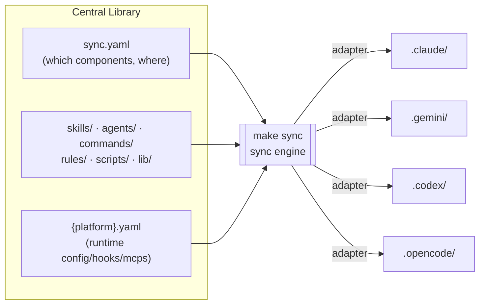
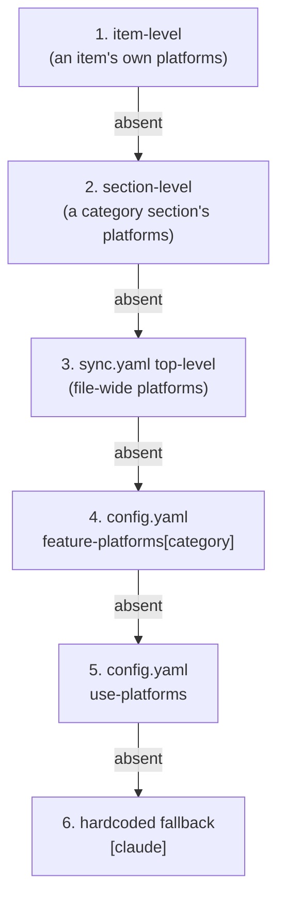
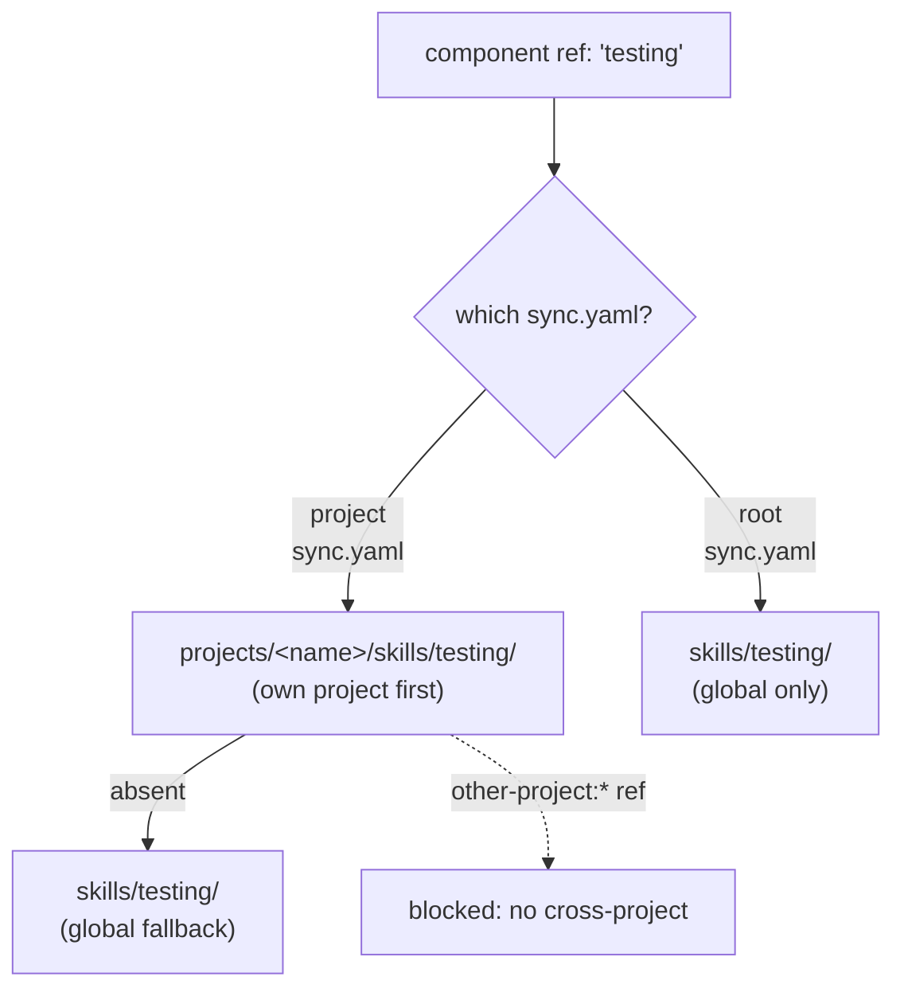

# Oh-My-Toong Architecture - The Central-Management Sync Engine

English | **[한국어](architecture.md)**

---

## TL;DR - What This Document Covers

oh-my-toong is an **agent central-management project**. It keeps skills/agents/hooks/rules in a single, version-controlled central library and syncs them **selectively** into each target project's `.claude/`. Even when projects share the same library, each can run a different configuration — and that is what **upward-search override** provides.

Syncing to multiple platforms (Claude / Gemini / Codex / OpenCode) is a **secondary, supporting feature**. It exists for platform independence — so that a centrally managed component can run on any platform — not because multi-platform is the point of the project.

If the [README](../README.md) tells you *what* this project is, this document is the deep dive behind that headline: *how* the sync engine actually works.

> This document explains the sync **engine**. What each individual skill does belongs to the skills pages ([core-pipeline](./skills/core-pipeline.md), [review-quality](./skills/review-quality.md), [authoring](./skills/authoring.md), [knowledge-graph-pins](./skills/knowledge-graph-pins.md), [utilities-personal](./skills/utilities-personal.md)).

---

## 1. The Big Picture

The central library is organized into directories by component type. `sync.yaml` is the manifest that declares *which* components go to *which* target project on *which* platform. Running `make sync` reads that declaration and populates the `.<platform>/` directories of the target projects.

| Component | Current count | Description |
|-----------|---------------|-------------|
| skills | 33 | Skill definitions (`skills/<name>/SKILL.md`) |
| agents | 11 | Subagent prompts (`agents/<name>.md`) |
| commands | 2 | Slash command definitions (`commands/<name>.md`) |
| rules | - | Behavioral rules (deployed to the target's `.claude/rules/`) |
| scripts | - | Deployed script packages |

> Counts change every time a component is added to or removed from the library. The filesystem is always the source of truth.

---

## 2. Two-Pass Sync - Components and Runtime Config

When processing a single `sync.yaml`, the engine performs two jobs of different character as **separate passes**.

### (a) Component deployment — `syncCategory()`

It iterates over five categories (skills, agents, commands, scripts, rules) and copies each item, through a per-platform adapter, into the target's `.<platform>/`. What it handles here are **files** — tangible components like skill directories, agent markdown, and command definitions.

### (b) Runtime config application — `syncPlatformConfigs()`

It reads the `{platform}.yaml` files that sit next to `sync.yaml` (e.g. `claude.yaml`, `gemini.yaml`) and applies each platform's **runtime configuration**. What it handles here is not file copying but **config merging** — config, hooks, mcps, and plugins are merged into each platform's settings file (`settings.json`, `config.toml`, `opencode.json`, etc.).

### Why split the passes

The two jobs differ in **their inputs, their targets, and how they operate.**

| Aspect | (a) `syncCategory()` | (b) `syncPlatformConfigs()` |
|--------|----------------------|------------------------------|
| Input | the component list in `sync.yaml` | the config blocks in `{platform}.yaml` |
| Target | directories like `.<platform>/skills/` | settings files like `settings.json`/`config.toml` |
| Operation | back up → wipe → copy files | **deep merge** into existing config |
| Idempotency | rewrites the whole directory | merges while preserving existing values |

Components follow "the list declared this run is the entire truth," so the directory must be wiped and refilled for orphans to disappear (see §6). Runtime config, in contrast, must coexist with values the user or team put in by hand, so it must be merged rather than clobbered. Mixing them into one pass would let one set of rules break the other. So `processYaml()` keeps them clearly separate: it first applies config via `syncPlatformConfigs()`, then deploys the categories via `syncCategory()`, and finally handles the shared library (§5).

---

## 3. Platform Selection - The 6-Level Cascade

"Which platforms should this component deploy to?" is not a value fixed in one place. It is decided by a **6-level cascade** in which the most specific declaration wins. Each level **fully replaces** the previous one — there is no merging.

| Priority | Source | Meaning |
|----------|--------|---------|
| 1 (highest) | item's `platforms` | "this component specifically, to these platforms" |
| 2 | section's `platforms` | "this whole category, to these platforms" |
| 3 | `sync.yaml` top-level `platforms` | "this target project, to these platforms" |
| 4 | `feature-platforms` in `config.yaml` | per-category global default (e.g. skills → all 4 platforms) |
| 5 | `use-platforms` in `config.yaml` | the global default (e.g. `[claude]`) |
| 6 (lowest) | hardcoded `[claude]` | the safety net when nothing is declared |

Thanks to this design, the common case declares nothing and follows the global default, and when a specific component or project needs an exception, you add a single line at exactly that level.

---

## 4. Per-Project Differentiation - Upward-Search Resolution

To share one central library yet still run a different variant per project, the key is the **resolution** rule that turns a component name into an actual file path. The engine resolves component references via **upward search**.

- When a **project `sync.yaml`** (e.g. `projects/<name>/sync.yaml`) references the `testing` skill:
  1. It looks in **its own project** directory first — `projects/<name>/skills/testing/`
  2. If absent, it falls back to the **global** library — `skills/testing/`
- A **root `sync.yaml`** looks only at global paths — `skills/testing/`

So if a project keeps its own version under the same name, it **overrides** the global one. This is the mechanism that implements "one central library + per-project differentiation." Global components stay shared, and when one project needs to diverge, you drop a same-named component into that project's directory — that's all.

### Cross-project references are blocked

This upward search runs in one direction only: **own project → global**. One project referencing another project's component (e.g. `other-project:oracle`) is blocked, and a root `sync.yaml` referencing a project-scoped component is blocked too. Projects are isolated, so one project's variant never leaks into another.

---

## 5. Shared-Library Deployment - `syncLib()` and the `@lib/` Alias

TypeScript components (such as scripts bundled inside a skill) often depend on shared helper modules (`lib/**`). `syncLib()` picks out only the modules a deployed component actually uses and deploys them alongside it under `.<platform>/lib/`.

It works in three steps.

1. **Scan**: walk the `.ts` files deployed to the target and find `@lib/` imports (recursively following transitive dependencies).
2. **Selective deploy**: copy only the referenced `lib/` modules. If nothing uses them, nothing is deployed.
3. **Alias rewrite**: rewrite the `@lib/` alias in the deployed files to a relative path based on the deployed location. The alias only works in source; the deployed copy needs a relative path to find the module at runtime.

> **Key contract**: shared modules must be imported via the `@lib/` alias. A dependency imported by a relative path (`../lib/...`) is **not collected.** The collector follows only the `@lib/` alias, so a relative import reaching into `lib/` silently drops that module from the deployed bundle, and the deployed copy dies at runtime with "Cannot find module." This trap is invisible to dry-run (which inspects declarations, not the deployed copy).

---

## 6. Orphan Cleanup - Back Up, Then Wipe Before Write

When you **remove** a component from the library, the file may still linger in targets that received it earlier. The engine cleans up these orphans per category directory with a **back up → wipe → rewrite** sequence.

For each platform×category combination, right before the first write:

1. **Back up** the category directory into the backup session.
2. **Wipe** the directory entirely.
3. **Rewrite** only the items declared in this `sync.yaml`.

This guarantees "declared list = deployment result," so a component that is no longer declared cannot squat in the target.

- **`rules/` is the exception.** The rules directory may hold user-managed files, so it is not wiped wholesale.
- Backups are kept for `backup_retention_days` (from `config.yaml`), and older backups are cleaned up at the end of the sync.

---

## 7. Adapters - Per-Platform Translation and the Support Matrix

Each platform has its own directory layout and file format. Adapters **translate** the standard components of the central library into the form each platform understands. Not every platform supports every category.

| Category | claude | gemini | codex | opencode |
|----------|:------:|:------:|:-----:|:--------:|
| agents | O | - | - | O |
| commands | O | O | - | O |
| skills | O | O | O | O |
| scripts | O | O | O | O |
| rules | O | - | - | O |

Unsupported combinations (e.g. codex + agents) are skipped entirely, with no backup or write.

### Differences in translation

The same component is transformed differently per platform.

- **claude**: the widest native support. It mostly copies components as-is and injects `add-skills`/`add-hooks` into agent frontmatter.
- **gemini**: **converts** commands to `.toml` rather than `.md` (reading the frontmatter description to generate TOML). agents/rules are unsupported.
- **codex**: supports only skills/scripts. config and mcps are inserted into `config.toml` as **managed blocks** wrapped in `# --- omt:... ---` markers, leaving user settings outside the markers untouched.
- **opencode**: **translates** agent frontmatter (e.g. `subagent_type` → `mode: subagent`, removes `add-skills`). hooks are unsupported. When deploying rules, it ensures the instructions glob in `opencode.json`.

For non-claude platforms, the engine finishes by rewriting `.claude/` path references inside deployed markdown to `.<platform>/`, so the docs point at their own platform's paths.

---

## 8. Local Overlay - `*.local.yaml`

For when each machine needs different settings (work Mac vs personal Mac), every YAML input is split into a git-tracked `base.yaml` and a gitignored `*.local.yaml`. It is the same pattern as Vite/Next.js's `.env` + `.env.local`. The two are automatically **deep merged** during `make sync`.

The merge policy follows the value's type.

| Value type | Merge behavior |
|------------|----------------|
| Scalar (string/number/bool) | local replaces base |
| Object | recursive deep merge |
| Array | concat + dedup (base order preserved) |

The crucial point is that arrays are **concat + dedup**, not overwrite. As a result, safety rules like `permissions.deny` keep their base entries even when local adds more.

### Per-machine project whitelist

`enabled-projects` in `config.local.yaml` lets you declare "on this machine, sync only these projects." Priority runs CLI `--projects` > `enabled-projects` > all-enabled. An empty array (`[]`) is normalized to "all enabled" for safety. The root `sync.yaml` (global skills/agents) is exempt from this whitelist and always runs on every machine — an intentional asymmetry.

---

## 9. What Is NOT a Component - README and docs

This repository's root `README.md` and the documents under `docs/` (including this one) are **not components.** No `sync.yaml` references them, so they are **never deployed** to a target project. They are documentation about the repository, not input to the sync engine.

There is exactly one default file exclusion: `*.test.ts` is always dropped whenever any component is copied. Otherwise, every file inside a component directory is deployed with it — for example, if a skill bundles a `README.md` in its own directory, that `README.md` **is deployed** as part of the skill. "README is not deployed" applies only to the root README, not to files inside a component.

---

## References

- [README](../README.md) - project overview and headline
- [Orchestration Guide](./ORCHESTRATION.en.md) - prometheus / sisyphus workflow
- Skill pages: [core-pipeline](./skills/core-pipeline.md) · [review-quality](./skills/review-quality.md) · [authoring](./skills/authoring.md) · [knowledge-graph-pins](./skills/knowledge-graph-pins.md) · [utilities-personal](./skills/utilities-personal.md)
