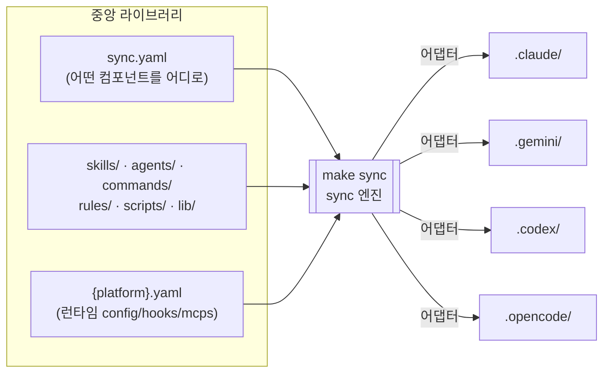
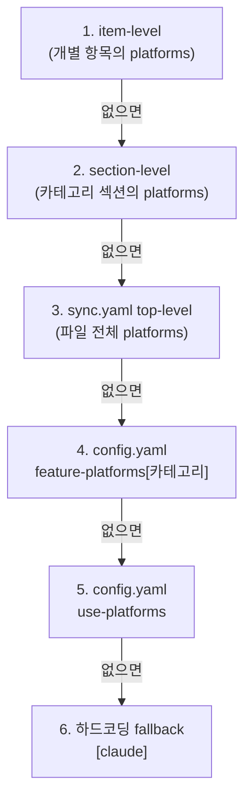
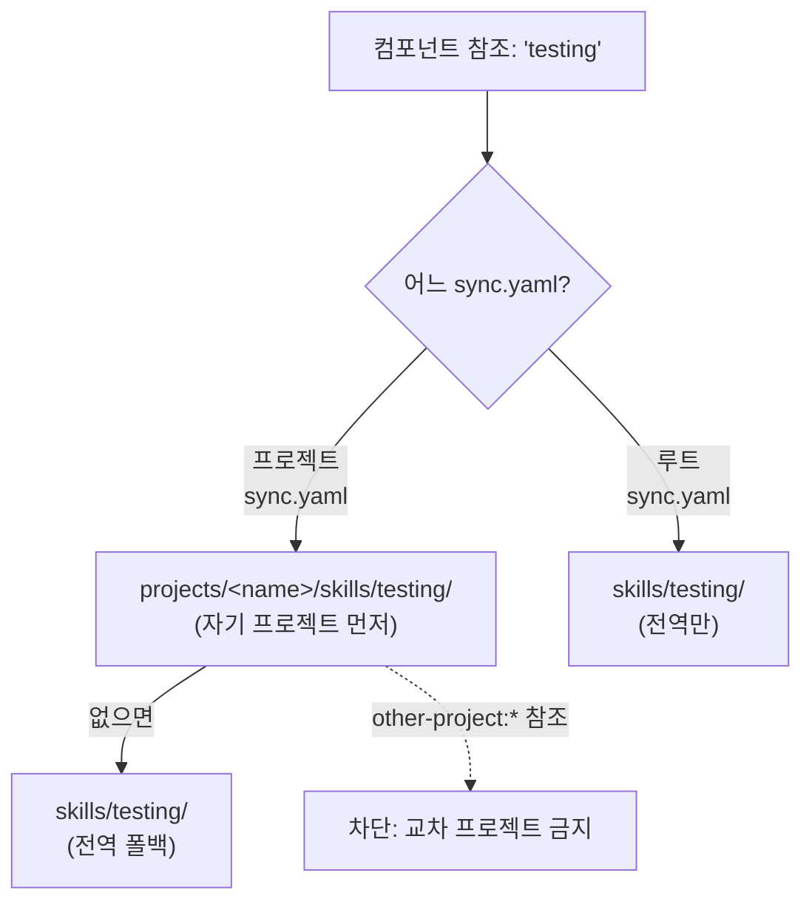

# Oh-My-Toong 아키텍처 - 중앙 관리 sync 엔진

한국어 | **[English](architecture.en.md)**

---

## 핵심 요약 - 이 문서가 다루는 것

oh-my-toong은 **에이전트 중앙 관리 프로젝트**입니다. skills/agents/hooks/rules를 버전 관리되는 하나의 중앙 라이브러리에 모아 두고, 각 대상 프로젝트의 `.claude/`로 **선별적으로** 동기화합니다. 같은 라이브러리를 쓰더라도 프로젝트마다 다른 구성을 줄 수 있는데, 이를 **상향 탐색(upward-search) 오버라이드**가 담당합니다.

여러 플랫폼(Claude / Gemini / Codex / OpenCode)으로의 동기화는 **부차적인 지원 기능**입니다. "한 곳에서 관리한 컴포넌트를 어느 플랫폼에서도 쓸 수 있게" 만드는 플랫폼 독립성을 위한 것이지, 이 프로젝트의 본질은 아닙니다.

[README](../README.md)가 이 프로젝트를 "무엇"이라고 소개한다면, 이 문서는 그 한 줄 뒤에 있는 sync 엔진이 **어떻게** 동작하는지를 다루는 심화 문서입니다.

> 이 문서는 sync **엔진**을 설명합니다. 개별 스킬이 무엇을 하는지는 각 스킬 페이지의 몫입니다 ([core-pipeline](./skills/core-pipeline.md), [review-quality](./skills/review-quality.md), [authoring](./skills/authoring.md), [knowledge-graph-pins](./skills/knowledge-graph-pins.md), [utilities-personal](./skills/utilities-personal.md)).

---

## 1. 큰 그림

중앙 라이브러리는 컴포넌트 종류별로 디렉토리에 정리되어 있습니다. `sync.yaml`은 "어떤 컴포넌트를, 어느 대상 프로젝트로, 어느 플랫폼에" 배포할지 선언하는 매니페스트입니다. `make sync`를 실행하면 이 선언을 읽어 대상 프로젝트의 `.<platform>/` 디렉토리를 채웁니다.

| 컴포넌트 | 현재 개수 | 설명 |
|----------|-----------|------|
| skills | 33 | 스킬 정의 (`skills/<name>/SKILL.md`) |
| agents | 11 | 서브에이전트 프롬프트 (`agents/<name>.md`) |
| commands | 2 | 슬래시 명령어 정의 (`commands/<name>.md`) |
| rules | - | 행동 규칙 (대상의 `.claude/rules/`로 배포) |
| scripts | - | 배포되는 스크립트 패키지 |

> 개수는 라이브러리에 컴포넌트를 추가/제거할 때마다 바뀝니다. 항상 파일시스템이 정답입니다.

---

## 2. 두 갈래의 sync - 컴포넌트와 런타임 설정

하나의 `sync.yaml`을 처리할 때, 엔진은 성격이 다른 두 가지 작업을 **별개의 패스**로 수행합니다.

### (a) 컴포넌트 배포 — `syncCategory()`

5개 카테고리(skills, agents, commands, scripts, rules)를 순회하며, 각 항목을 플랫폼별 어댑터를 통해 대상의 `.<platform>/` 아래로 복사합니다. 여기서 다루는 것은 **파일** — 스킬 디렉토리, 에이전트 마크다운, 명령어 정의처럼 형태가 있는 컴포넌트입니다.

### (b) 런타임 설정 적용 — `syncPlatformConfigs()`

`sync.yaml` 옆에 놓인 `{platform}.yaml`(예: `claude.yaml`, `gemini.yaml`)을 읽어 각 플랫폼의 **런타임 설정**을 적용합니다. 여기서 다루는 것은 파일 복사가 아니라 **설정 머지** — config, hooks, mcps, plugins를 각 플랫폼의 설정 파일(`settings.json`, `config.toml`, `opencode.json` 등)에 병합합니다.

### 왜 패스를 나누는가

두 작업은 **입력도, 대상도, 동작 방식도 다릅니다.**

| 구분 | (a) `syncCategory()` | (b) `syncPlatformConfigs()` |
|------|----------------------|------------------------------|
| 입력 | `sync.yaml`의 컴포넌트 목록 | `{platform}.yaml`의 설정 블록 |
| 대상 | `.<platform>/skills/` 등 디렉토리 | `settings.json`/`config.toml` 등 설정 파일 |
| 동작 | 백업 → 비우기 → 파일 복사 | 기존 설정에 **deep merge** |
| 멱등성 | 디렉토리를 통째로 다시 씀 | 기존 값을 보존하며 병합 |

컴포넌트는 "이번에 선언된 목록이 곧 전부"라서 디렉토리를 비우고 다시 채워야 고아 파일이 사라집니다(아래 §6). 반면 런타임 설정은 사용자나 팀이 직접 넣은 값과 공존해야 하므로 통째로 덮으면 안 되고 병합해야 합니다. 같은 패스에 섞으면 한쪽 규칙이 다른 쪽을 망가뜨립니다. 그래서 `processYaml()`은 먼저 `syncPlatformConfigs()`로 설정을 적용한 뒤, 카테고리들을 `syncCategory()`로 배포하고, 마지막에 공유 라이브러리(§5)를 처리하는 순서로 명확히 분리합니다.

---

## 3. 플랫폼 결정 - 6단계 캐스케이드

"이 컴포넌트를 어느 플랫폼에 배포할까?"는 한 곳에 고정된 값이 아니라, 가장 구체적인 선언이 이기는 **6단계 캐스케이드**로 결정됩니다. 각 단계는 이전 단계를 **완전히 대체**합니다 — 병합이 아닙니다.

| 우선순위 | 출처 | 의미 |
|----------|------|------|
| 1 (최상) | 항목의 `platforms` | "이 컴포넌트만 특별히 이 플랫폼들로" |
| 2 | 섹션의 `platforms` | "이 카테고리 전체를 이 플랫폼들로" |
| 3 | `sync.yaml` 최상위 `platforms` | "이 대상 프로젝트는 이 플랫폼들로" |
| 4 | `config.yaml`의 `feature-platforms` | 카테고리별 전역 기본값 (예: skills는 4개 플랫폼 모두) |
| 5 | `config.yaml`의 `use-platforms` | 전역 기본값 (예: `[claude]`) |
| 6 (최하) | 하드코딩 `[claude]` | 아무것도 선언되지 않았을 때의 안전망 |

이 설계 덕분에 평소엔 아무 선언 없이 전역 기본값을 따르다가, 특정 컴포넌트나 특정 프로젝트만 예외를 줘야 할 때 정확히 그 레벨에만 한 줄을 추가하면 됩니다.

---

## 4. 프로젝트별 차별화 - 상향 탐색(upward-search) 해석

같은 중앙 라이브러리를 공유하면서도 프로젝트마다 다른 변형을 쓰려면, 컴포넌트 이름을 실제 파일 경로로 바꾸는 **해석(resolution)** 규칙이 핵심입니다. 엔진은 컴포넌트 참조를 **상향 탐색**으로 해석합니다.

- **프로젝트 `sync.yaml`** (예: `projects/<name>/sync.yaml`)이 `testing` 스킬을 참조하면:
  1. 먼저 **자기 프로젝트** 디렉토리를 본다 — `projects/<name>/skills/testing/`
  2. 없으면 **전역** 라이브러리로 폴백 — `skills/testing/`
- **루트 `sync.yaml`**은 전역 경로만 본다 — `skills/testing/`

즉 프로젝트가 같은 이름으로 자기만의 버전을 두면 전역 버전을 **가립니다(override)**. 이것이 "하나의 중앙 라이브러리 + 프로젝트별 차별화"를 구현하는 메커니즘입니다. 전역 컴포넌트는 그대로 공유하되, 특정 프로젝트만 다르게 가야 할 때 그 프로젝트 디렉토리에 동명의 컴포넌트를 두면 끝입니다.

### 교차 프로젝트 참조 차단

이 상향 탐색은 **자기 프로젝트 → 전역**의 한 방향뿐입니다. 한 프로젝트가 다른 프로젝트의 컴포넌트를 참조하는 것(예: `other-project:oracle`)은 막혀 있고, 루트 `sync.yaml`이 프로젝트 스코프 컴포넌트를 참조하는 것도 막혀 있습니다. 프로젝트는 서로 격리되어, 한 프로젝트의 변형이 다른 프로젝트로 새지 않습니다.

---

## 5. 공유 라이브러리 배포 - `syncLib()`와 `@lib/` 별칭

TypeScript 컴포넌트(스킬에 번들된 스크립트 등)는 종종 공유 헬퍼 모듈(`lib/**`)에 의존합니다. `syncLib()`는 배포된 컴포넌트가 실제로 쓰는 모듈만 골라서 `.<platform>/lib/`에 함께 배포합니다.

동작은 세 단계입니다.

1. **스캔**: 대상에 배포된 `.ts` 파일들을 훑어 `@lib/` 임포트를 찾는다 (전이 의존성까지 재귀적으로 추적).
2. **선별 배포**: 실제로 참조된 `lib/` 모듈만 복사한다. 아무도 안 쓰면 아무것도 배포하지 않는다.
3. **별칭 재작성**: 배포된 파일의 `@lib/` 별칭을 배포 위치 기준의 상대 경로로 바꾼다. 별칭은 소스에서만 통하고 배포본에서는 상대 경로여야 런타임에 모듈을 찾기 때문이다.

> **핵심 규약**: 공유 모듈은 반드시 `@lib/` 별칭으로 임포트해야 합니다. 상대 경로(`../lib/...`)로 임포트한 의존성은 **수집되지 않습니다.** 수집기는 `@lib/` 별칭만 따라가므로, 상대 경로로 `lib/`를 찌르면 그 모듈이 배포 번들에서 조용히 빠지고, 배포본은 런타임에 "Cannot find module"로 죽습니다. 이 함정은 dry-run으로는 보이지 않습니다(배포본이 아니라 선언만 보기 때문).

---

## 6. 고아 정리 - 백업 후 비우고 쓰기

라이브러리에서 컴포넌트를 **제거**하면, 이전에 배포된 대상에는 그 파일이 남아 있을 수 있습니다. 엔진은 각 카테고리 디렉토리에 대해 **백업 → 비우기 → 다시 쓰기** 순서로 이 고아 파일을 정리합니다.

플랫폼×카테고리 조합마다 첫 쓰기 직전에:

1. 해당 카테고리 디렉토리를 백업 세션으로 **백업**한다.
2. 디렉토리를 통째로 **비운다**.
3. 이번 `sync.yaml`에 선언된 항목만 **다시 쓴다**.

이렇게 하면 "선언된 목록 = 배포 결과"가 보장되어, 더 이상 선언되지 않은 컴포넌트가 대상에 눌러앉지 못합니다.

- **`rules/`는 예외**입니다. 규칙 디렉토리는 사용자가 직접 관리하는 파일을 담을 수 있어 통째로 비우지 않습니다.
- 백업은 `config.yaml`의 `backup_retention_days`만큼 보관되고, 그보다 오래된 백업은 sync 종료 시 정리됩니다.

---

## 7. 어댑터 - 플랫폼별 번역과 지원 매트릭스

각 플랫폼은 자기만의 디렉토리 레이아웃과 파일 포맷을 가집니다. 어댑터는 중앙 라이브러리의 표준 컴포넌트를 각 플랫폼이 이해하는 형태로 **번역**합니다. 모든 플랫폼이 모든 카테고리를 지원하는 것은 아닙니다.

| 카테고리 | claude | gemini | codex | opencode |
|----------|:------:|:------:|:-----:|:--------:|
| agents | O | - | - | O |
| commands | O | O | - | O |
| skills | O | O | O | O |
| scripts | O | O | O | O |
| rules | O | - | - | O |

지원하지 않는 조합(예: codex + agents)은 백업·쓰기 없이 통째로 건너뜁니다.

### 번역의 차이

같은 컴포넌트라도 플랫폼에 따라 다르게 변환됩니다.

- **claude**: 네이티브 지원이 가장 넓습니다. 컴포넌트를 대체로 그대로 복사하고, agent 프론트매터에 `add-skills`/`add-hooks`를 주입합니다.
- **gemini**: commands를 `.md`가 아니라 `.toml`로 **변환**합니다(프론트매터의 description을 읽어 TOML 생성). agents/rules는 지원하지 않습니다.
- **codex**: skills/scripts만 지원합니다. config·mcps는 `config.toml`에 `# --- omt:... ---` 마커로 둘러싼 **관리 블록(managed block)**으로 삽입해, 마커 밖의 사용자 설정은 건드리지 않습니다.
- **opencode**: agent 프론트매터를 **번역**합니다(예: `subagent_type` → `mode: subagent`, `add-skills` 제거). hooks는 지원하지 않습니다. rules를 배포할 때 `opencode.json`의 instructions glob을 보장합니다.

비-claude 플랫폼에 대해서는 배포된 마크다운 안의 `.claude/` 경로 참조를 `.<platform>/`로 바꿔, 문서가 자기 플랫폼의 경로를 가리키도록 마무리합니다.

---

## 8. 로컬 오버레이 - `*.local.yaml`

기기마다 다른 설정(회사 Mac vs 개인 Mac)이 필요할 때를 위해, 모든 YAML 입력은 git에서 추적되는 `base.yaml`과 gitignore되는 `*.local.yaml`로 나뉩니다. Vite/Next.js의 `.env` + `.env.local` 패턴과 같습니다. `make sync` 시 둘이 자동으로 **deep merge**됩니다.

병합 정책은 값의 유형을 따릅니다.

| 값 유형 | 병합 방식 |
|---------|-----------|
| Scalar (string/number/bool) | local이 base를 대체 |
| Object | 재귀 deep merge |
| Array | concat + dedup (base 순서 유지) |

배열이 덮어쓰기가 아니라 **concat + dedup**이라는 점이 중요합니다. 덕분에 `permissions.deny` 같은 안전 규칙은 local에서 항목을 추가해도 base 항목이 보존됩니다.

### 기기별 프로젝트 화이트리스트

`config.local.yaml`의 `enabled-projects`로 "이 기기에서는 이 프로젝트만 sync"를 지정할 수 있습니다. CLI `--projects` > `enabled-projects` > 전부 활성 순으로 우선합니다. 빈 배열(`[]`)은 안전을 위해 "전부 활성"으로 정규화됩니다. 단, 루트 `sync.yaml`(전역 skills/agents)은 이 화이트리스트의 영향을 받지 않고 모든 기기에서 항상 실행됩니다 — 의도된 비대칭입니다.

---

## 9. 컴포넌트가 아닌 것 - README와 docs

이 저장소의 루트 `README.md`와 `docs/` 아래 문서들(이 문서 포함)은 **컴포넌트가 아닙니다.** 어떤 `sync.yaml`도 이들을 참조하지 않으므로, 대상 프로젝트로 **절대 배포되지 않습니다.** 저장소를 설명하는 문서일 뿐, sync 엔진의 입력이 아닙니다.

기본 파일 제외 규칙은 단 하나뿐입니다: `*.test.ts`는 어떤 컴포넌트를 복사하든 항상 빠집니다. 그 외에는 컴포넌트 디렉토리 안의 모든 파일이 함께 배포됩니다 — 예를 들어 어떤 스킬이 자기 디렉토리에 `README.md`를 번들로 두었다면, 그 `README.md`는 스킬의 일부로서 **정상적으로 배포됩니다.** "README는 배포 안 된다"는 루트 README에만 해당하는 이야기이지, 컴포넌트 내부 파일에는 적용되지 않습니다.

---

## 참고 자료

- [README](../README.md) - 프로젝트 개요와 헤드라인
- [오케스트레이션 가이드](./ORCHESTRATION.md) - prometheus / sisyphus 워크플로우
- 스킬 페이지: [core-pipeline](./skills/core-pipeline.md) · [review-quality](./skills/review-quality.md) · [authoring](./skills/authoring.md) · [knowledge-graph-pins](./skills/knowledge-graph-pins.md) · [utilities-personal](./skills/utilities-personal.md)
