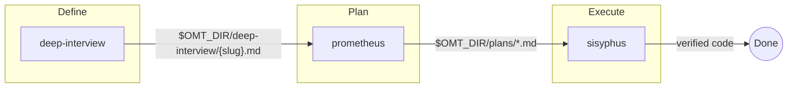
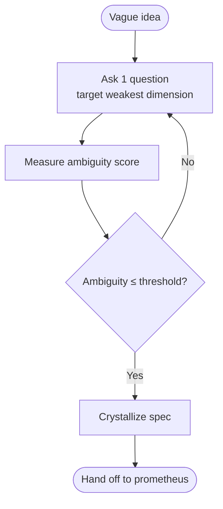
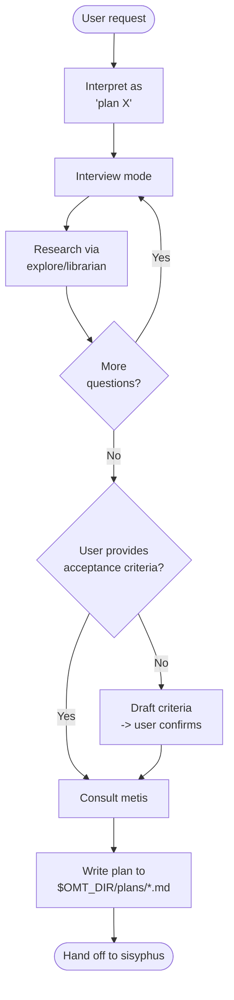
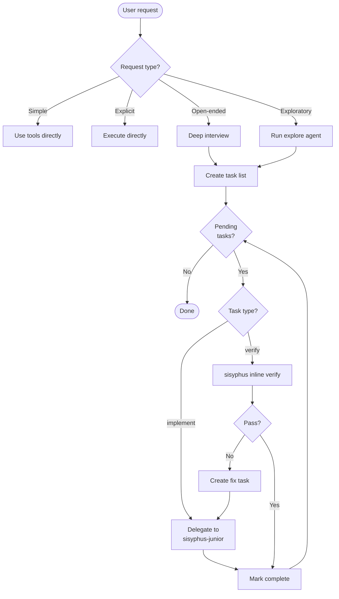

English | [한국어](core-pipeline.md)

# Core Pipeline Skills

oh-my-toong is a library that version-controls AI agent configuration centrally and differentiates it per project. At its center sits the **agentic-development pipeline** — instead of one AI shouldering everything, skills and agents with clear roles collaborate. This document covers the core skills that make up that pipeline in detail.

For skills in other areas, see the separate documents.

- [Code/design review and quality](./review-quality.en.md)
- [Research](./research.en.md)
- [Docs, slides, and PR authoring](./authoring.en.md)
- [Knowledge graph (pins)](./knowledge-graph-pins.en.md)
- [Utilities and personal workflows](./utilities-personal.en.md)

For the full picture, see the [README](../../README.en.md).

---

## 1. Why a Pipeline

The conventional approach mixes planning and execution in a single session, which causes:

- **Context pollution**: plan details and code changes tangle in one conversation.
- **Goal drift**: the original intent is lost mid-implementation.
- **AI slop**: low-quality code, written in a hurry without a proper spec, piles up.

The core pipeline prevents this by separating concerns. Each stage of **define → plan → execute → verify** is owned by a distinct role, and stages hand off through files (specs, plans). No stage proceeds until the previous one is clear enough.

| Stage | Skill | Responsibility | Output |
|-------|-------|----------------|--------|
| Define | deep-interview | Resolve ambiguity, converge to a spec | `$OMT_DIR/deep-interview/{slug}.md` |
| Plan | prometheus | Turn the spec into an executable work plan | `$OMT_DIR/plans/*.md` |
| Execute | sisyphus | Orchestrate implementation via specialist agents | Verified code changes |
| Verify | sisyphus (inline) | Run a verify task's AC commands to confirm implementation quality, plan compliance, instruction fulfillment | APPROVE / REQUEST_CHANGES |

Supporting roles attach to this spine. **clarify** is a gate that halts whenever ambiguity appears at any stage; **momus** is a critic that reviews plans before execution; **diagnose** is a read-only advisor that diagnoses root causes; **agent-council** is an advisory body that gathers multiple opinions when judgment is split.

---

## 2. The Define → Plan → Execute Pipeline

Three foundational skills form the spine of the pipeline.

Each arrow is a file handoff. deep-interview hands a spec to prometheus, prometheus hands a plan to sisyphus, and sisyphus closes out with verified code changes. Skipping a stage still works, but the clarity of each stage determines the quality of the next.

---

## 3. deep-interview — Socratic Deep Interview

**Purpose**: Converge a vague idea into a clear specification before autonomous execution. It asks one question at a time, targeting the weakest dimension, until a weighted ambiguity score drops below the threshold.

**Core constraint**: It does not proceed to execution while ambiguity exceeds the threshold. It never implements directly; it produces a spec and hands it to prometheus.

**When to use**: Use it when you have an idea but the scope is fuzzy, or when you say "interview me", "don't assume", "make sure you understand". Conversely, if the request already names file paths, function names, and acceptance criteria, it is right to execute directly without an interview.

**Pipeline link**: The output spec is saved to `$OMT_DIR/deep-interview/{slug}.md` and becomes prometheus's input. It is built on the premise that specification quality is the primary bottleneck in AI-assisted development.

> This skill was borrowed almost as-is from [oh-my-claudecode](https://github.com/Yeachan-Heo/oh-my-claudecode) (omc), whose implementation was simply too good to reinvent (originally inspired by [Ouroboros](https://github.com/Q00/ouroboros)).

---

## 4. prometheus — Strategic Planning Consultant

**Purpose**: Separate planning from execution. Build a work plan before writing any code.

**Core constraint**: **It never writes code.** It interprets every request as a planning request. Commands like "just implement it" or "skip the plan" cannot move it out of planning mode — the mode is sticky for the entire session.

**When to use**: Use it before implementing, fixing, or creating a feature, especially when scope and requirements are unclear.

**Forbidden actions**:

- Writing code files (.ts, .js, .py, etc.)
- Editing source code
- Running implementation commands
- Anything that "does the work"

**Pipeline link**: It proceeds interview → research (explore/librarian) → metis gap analysis → plan writing. The resulting plan is saved to `$OMT_DIR/plans/*.md` and becomes sisyphus's input.

---

## 5. sisyphus — Task Orchestrator

**Purpose**: Orchestrate complex work through delegation. It never executes solo.

**Core constraint**: **Orchestrate. Delegate. Never solo.** Even a one-line code change is delegated to sisyphus-junior rather than written directly. It is a conductor, not a soloist.

**When to use**: Use it for multi-step work that needs delegation, parallelization, or systematic completion verification — especially when tempted to do everything yourself.

**Verification protocol**:

- **Verification**: an implement task completes on sisyphus-junior's report (no separate QA step). When verification is needed, it is a separate verify task that sisyphus handles inline by running the AC commands itself.
- **Evidence Audit Gate**: when sisyphus runs an inline verify (a verify task), it proceeds through the Evidence Audit Gate (a verify task changes no files, so it does not commit). Commits are performed by mnemosyne after junior completes an implement task.
- **No retry limit**: it continues until the inline verify passes.
- **Persistence**: the user cannot interrupt the process to stop it midway.

**Routing principle**: The delegation target is decided by task type. Implementation tasks that change files go to sisyphus-junior, verification tasks needing a PASS/FAIL verdict are handled inline by sisyphus (it runs the AC commands itself), root-cause/architecture analysis goes to oracle, and codebase search goes to explore. Whatever path the previous task took, a new task follows the path of its own type.

---

## 6. Supporting Skills

### clarify — Requirements Clarification Gate

**Purpose**: Turn ambiguous requirements into actionable specifications. It acts as a mandatory pre-implementation gate.

**Core constraint**: Before writing any code or creating any file, it confirms four things — delivery method, triggers, scope, success criteria. If any is unclear, it **must ask**. Pressure like "just do it" or "by EOD" cannot bypass the gate — the user can waive DETAILS but not DIRECTION.

**Difference from deep-interview**: clarify is a lightweight four-item check gate that halts the moment you are about to assume, at any stage; deep-interview is a full iterative interview session gated by an ambiguity score.

### momus — Work Plan Reviewer

**Purpose**: Ruthlessly critique a work plan before execution to catch context gaps. Named after the Greek god of criticism.

**Core constraint**: If simulating implementation reveals missing information AND the plan provides no reference to find it, it returns REQUEST_CHANGES. But it does not demand perfection — when in doubt, it APPROVEs. Its job is to catch blocking gaps, not to nitpick.

**Pipeline link**: It sits between prometheus's plan and sisyphus's execution, filtering out plans that would stall. (When delegated, it is invoked as the momus agent.)

### diagnose — Read-only Architecture/Debug Advisor

**Purpose**: Provide architecture analysis, bug debugging, root-cause identification, and technical recommendations.

**Core constraint**: **It is read-only — it diagnoses but never implements.** It delegates the analysis request to a detached worker (Hephaestus) and collects results by polling. If the worker is unavailable, it falls back to in-session analysis.

**When to use**: Use it for requests like "root cause", "what's wrong", "architecture review", "investigate" — when you need an analysis report, not a PASS/FAIL verdict. (When delegated, it is invoked as the oracle agent.)

### agent-council — Multi-AI Advisory Body

**Purpose**: Gather multiple AI perspectives to help with uncertain decisions.

**Core constraint**: **The council provides opinions; the caller makes the final decision.** It is not used for problems with an objective answer (compile errors, code style, clear specs). If all members are unavailable, it falls back to a single-voice in-session advisory.

**When to use**: Use it for decisions without a single right answer — architecture trade-offs, subjective quality judgments, disagreements in risk assessment.

---

## 7. Delegation Agent Roster

If skills are the *methodologies*, agents are the *delegation targets*. sisyphus and prometheus pick from the agents below by task type and have them work in isolated subagent contexts. There are currently 13 agents. (A verify task needing a PASS/FAIL verdict is not a delegation target — sisyphus handles it inline itself.)

| Agent | Role | When used |
|-------|------|-----------|
| sisyphus-junior | Executor that performs multi-step implementation solo | When actually changing code/files (delegated by sisyphus) |
| oracle | Returns root cause + prioritized recommendations with file:line citations. Never modifies files | When architecture analysis or debugging diagnosis is needed |
| explore | Codebase searcher returning structured results with absolute paths | When finding files, patterns, or implementations (not external docs) |
| librarian | External documentation researcher with mandatory source URLs | When researching external APIs, libraries, or open-source implementations |
| metis | Plan reviewer that catches missing questions, undefined guardrails, unvalidated assumptions, and scope risks. Blocking (REQUEST_CHANGES) fires only on a finite four-axis whitelist (requirements traceability, scope boundary, AC unverifiability (including a missing `\| decider:` clause), unvalidated load-bearing assumption); everything else is demoted to COMMENT (advisory), and a same-item deadlock is capped after 3 rounds by prometheus recording it as carried-forward and proceeding | When checking plans/specs/requirements before implementation (consulted by prometheus) |
| momus | Returns simulation-based work-plan critique with certainty-classified findings and a verdict | When critiquing a work plan before execution |
| daedalus | Reviews designs with steelman antithesis and tradeoff tension analysis | When weighing the soundness of a plan/design |
| mnemosyne | Git specialist performing atomic commits in an isolated context | When preventing commits from polluting the conversation context |
| chunk-reviewer | Reviews a completed major step against the original plan and coding standards | When wrapping up a large step and running a review round |
| tech-claim-examiner | CTO-perspective examiner evaluating resume technical claims with a 5-axis framework | When verifying technical claims on a resume |
| code-reviewer | Orchestrator that runs the full code-review skill in an isolated context — intent acquisition → evidence verification → chunk-reviewer dispatch → per-candidate verifier fan-out → findings synthesis | When a pure code review needs to run in an isolated context and return findings only |
| hermes | Depth-escalation peer to explore/librarian that extracts blocked, authenticated, or bot-protected sources through three tiers — curl_cffi → agent-reach → Chrome stealth | When fetching content from a source that resists plain HTTP (blocked, auth-gated, bot-protected) |
| issue-reviewer | READ-ONLY checklist reviewer — at craft-issue Stage 6's Checklist Review Gate, checks the issue set being written against the rule files already in the repo, immediately before any write | When craft-issue gates an issue set against the checklist before writing (it never writes itself) |

---

## See Also

- [README](../../README.en.md) — project overview and the central-management + per-project-differentiation story
- [Code/design review and quality](./review-quality.en.md)
- [Research](./research.en.md)
- [Docs, slides, and PR authoring](./authoring.en.md)
- [Knowledge graph (pins)](./knowledge-graph-pins.en.md)
- [Utilities and personal workflows](./utilities-personal.en.md)
