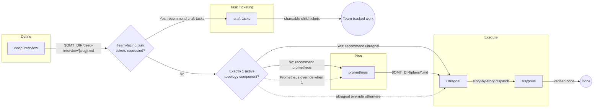
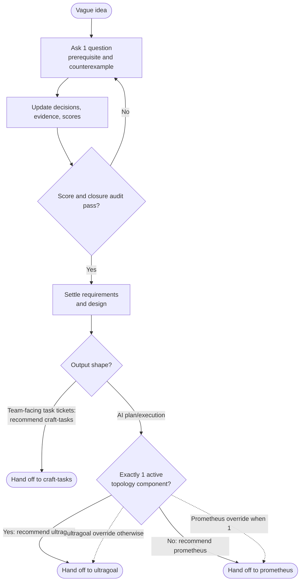
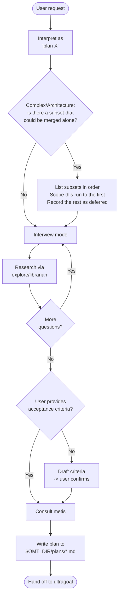
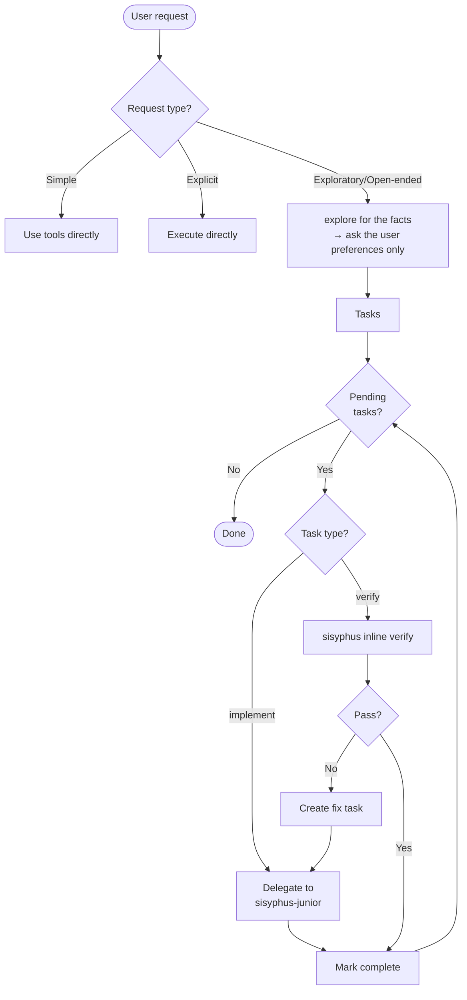

English | [한국어](core-pipeline.md)

# Core Pipeline Skills

oh-my-toong is a library that version-controls AI agent configuration centrally and differentiates it per project. At its center sits the **agentic-development pipeline** — instead of one AI shouldering everything, skills and agents with clear roles collaborate. This document covers the core skills that make up that pipeline in detail.

For skills in other areas, see the separate documents.

- [Code/design review and quality](./review-quality.en.md)
- [Research](./research.en.md)
- [Docs, slides, and PR authoring](./authoring.en.md)
- [Knowledge graph (pins)](./knowledge-graph-pins.en.md)
- [Utilities and personal workflows](./utilities-personal.en.md)

For the full picture, see the [README](../../README.en.md).

---

## 1. Why a Pipeline

The conventional approach mixes planning and execution in a single session, which causes:

- **Context pollution**: plan details and code changes tangle in one conversation.
- **Goal drift**: the original intent is lost mid-implementation.
- **AI slop**: low-quality code, written in a hurry without a proper spec, piles up.

The core pipeline prevents this by separating concerns. Each stage and branch of **define → task ticketing/planning → execute → verify** is owned by a distinct role, and stages hand off through files (specs, plans) or child tickets in the PM tool. No stage proceeds until the previous one is clear enough.

| Stage | Skill | Responsibility | Output |
|-------|-------|----------------|--------|
| Define | deep-interview | Resolve ambiguity and settle requirements/design | `$OMT_DIR/deep-interview/{slug}.md` |
| Task ticketing | craft-tasks (when team-facing task tickets are needed) | Decompose the settled design into shareable child tickets | Shareable child tickets in the PM tool |
| Plan | ultragoal (exactly 1 active topology component) / prometheus (otherwise) | For specs that do not request team-facing task tickets, choose the Phase 5 AI planning/execution route and offer the other route as an explicit override | ultragoal execution / human-readable plan |
| Execute | ultragoal → sisyphus | ultragoal dispatches stories to sisyphus to orchestrate execution | Verified code changes |
| Verify | sisyphus (inline) | Run a verify task's AC commands to confirm implementation quality, plan compliance, instruction fulfillment | APPROVE / REQUEST_CHANGES |

Supporting roles attach to this spine. **clarify** is a gate that halts whenever ambiguity appears at any stage; **momus** is a critic that reviews plans before execution; **diagnose** is a read-only advisor that diagnoses root causes; **agent-council** is an advisory body that gathers multiple opinions when judgment is split.

---

## 2. The Define → Task Ticketing/Planning → Execute Pipeline

Four foundational skills form the spine of the pipeline.

```mermaid
flowchart LR
    subgraph Define
        deep["deep-interview"]
    end
    subgraph Task Ticketing
        craft["craft-tasks"]
    end
    subgraph Plan
        prometheus["prometheus"]
    end
    subgraph Execute
        ultragoal["ultragoal"]
        sisyphus["sisyphus"]
    end

    deep -->|"$OMT_DIR/deep-interview/{slug}.md"| Shape{Team-facing task<br/>tickets requested?}
    Shape -->|Yes: recommend craft-tasks| craft
    Shape -->|No| Route{Exactly 1 active<br/>topology component?}
    Route -->|Yes: recommend ultragoal| ultragoal
    Route -->|No: recommend prometheus| prometheus
    Route -.->|Prometheus override when 1| prometheus
    Route -.->|ultragoal override otherwise| ultragoal
    craft -->|"shareable child tickets"| Tickets((Team-tracked work))
    prometheus -->|"$OMT_DIR/plans/*.md"| ultragoal
    ultragoal -->|"story-by-story dispatch"| sisyphus
    sisyphus -->|"verified code"| Done((Done))
```

Each arrow represents a file or PM-tool handoff. In Phase 5, deep-interview first checks the spec's output shape. When team-facing task tickets are requested, it recommends craft-tasks as the post-design task-ticket stage, which decomposes the settled design into shareable child tickets. When team-facing task tickets are not requested, it recommends ultragoal when there is exactly one active topology component and prometheus otherwise, while offering the non-recommended route as an explicit override. If prometheus is selected, it produces a human-readable plan and hands it to ultragoal; ultragoal dispatches stories to sisyphus one at a time, and sisyphus closes out with verified code changes. Skipping a stage still works, but the clarity of each stage determines the quality of the next.

---

## 3. deep-interview — Socratic Deep Interview

The presentation explains the design and its reasons in the author's first person to a colleague or team-lead with no prior context. Use plain language, first-use domain glosses, and big-picture diagrams without thinning the design into an overview.

A probe isolating one condition uses an independent hypothetical copy of a confirmed case and varies only that condition. Changing the requester or amount while testing a role confounds the comparison. Record the anchor case, changed condition, and unanswered or confirmed outcome in the decision register's `checks`, and carry it into the spec. Label interaction probes as joint cases.

**Purpose**: Converge a vague idea into clear requirements and a settled design before autonomous execution or task decomposition. It asks one question at a time without a count limit, following prerequisites and the counterexamples, contradictions, and downstream decisions each answer reveals. Scores guide investigation; an audit of evidence and open decisions governs closure.

**Core constraint**: Completion requires both the score threshold and the closure audit. Keep interviewing while an open decision could change implementation; respect explicit stops and label early delivery DRAFT. It never implements directly; after settling requirements and design, Phase 5 first checks the spec's output shape. When team-facing task tickets are requested, it recommends craft-tasks to decompose the settled design into shareable child tickets; otherwise, it recommends ultragoal or prometheus by the active topology-component count and offers the other route as an explicit override.

**When to use**: Use it when you have an idea but the scope is fuzzy, or when you say "interview me", "don't assume", "make sure you understand". Use an existing PRD or detailed request as evidence. An explicitly requested deep interview is not skipped because the starting context is already detailed.

```mermaid
flowchart TB
    Start([Vague idea]) --> Ask[Ask 1 question<br/>prerequisite and counterexample]
    Ask --> Score[Update decisions, evidence, scores]
    Score --> Gate{Score and closure audit pass?}
    Gate -->|No| Ask
    Gate -->|Yes| Spec[Settle requirements<br/>and design]
    Spec --> Shape{Output shape?}
    Shape -->|Team-facing task tickets:<br/>recommend craft-tasks| Tasks([Hand off to craft-tasks])
    Shape -->|AI plan/execution| Route{Exactly 1 active<br/>topology component?}
    Route -->|Yes: recommend ultragoal| Ultra([Hand off to ultragoal])
    Route -->|No: recommend prometheus| Prom([Hand off to prometheus])
    Route -.->|Prometheus override when 1| Prom
    Route -.->|ultragoal override otherwise| Ultra
```

**Pipeline link**: The output spec is saved to `$OMT_DIR/deep-interview/{slug}.md` with requirements and design settled. In Phase 5, deep-interview first checks the output shape. When team-facing task tickets are requested, it recommends craft-tasks to decompose the settled design into shareable child tickets. When team-facing task tickets are not requested, it recommends ultragoal when there is exactly one active topology component and prometheus otherwise, while offering the non-recommended route as an explicit override. If prometheus is selected, it uses the spec to produce a human-readable plan and hands it to ultragoal. This flow is built on the premise that specification quality is the primary bottleneck in AI-assisted development.

> Started from [oh-my-claudecode](https://github.com/Yeachan-Heo/oh-my-claudecode) and refined using [Ouroboros](https://github.com/Q00/ouroboros) closure audits and [grilling](https://github.com/mattpocock/skills) decision dependencies.

---

## 4. prometheus — Strategic Planning Consultant

**Purpose**: Separate planning from execution. Build a work plan before writing any code.

**Core constraint**: **It never writes code.** It interprets every request as a planning request. Commands like "just implement it" or "skip the plan" cannot move it out of planning mode — the mode is sticky for the entire session.

**When to use**: Use it before implementing, fixing, or creating a feature, especially when scope and requirements are unclear.

```mermaid
flowchart TB
    Start([User request]) --> Interpret["Interpret as<br/>'plan X'"]
    Interpret --> Split{"Complex/Architecture:<br/>is there a subset that<br/>could be merged alone?"}
    Split -->|No| Interview[Interview mode]
    Split -->|Yes| Slice["List subsets in order<br/>Scope this run to the first<br/>Record the rest as deferred"]
    Slice --> Interview
    Interview --> Research[Research via<br/>explore/librarian]
    Research --> More{More<br/>questions?}
    More -->|Yes| Interview
    More -->|No| Criteria{User provides<br/>acceptance criteria?}
    Criteria -->|Yes| Metis[Consult metis]
    Criteria -->|No| Draft[Draft criteria<br/>-> user confirms]
    Draft --> Metis
    Metis --> Write["Write plan to<br/>$OMT_DIR/plans/*.md"]
    Write --> Handoff([Hand off to ultragoal])
```

**Forbidden actions**:

- Writing code files (.ts, .js, .py, etc.)
- Editing source code
- Running implementation commands
- Anything that "does the work"

**Scope Split Gate**: Requests classified Complex or Architecture settle one question before the interview begins — *is there a subset of this work that could be merged on its own, leaving the system working, with something that verifies it?* If there is, the request is not one plan. The subsets are listed in order with the behavior-preserving one first, **only the first subset** becomes this run's scope, and the rest are recorded under `## Context` as deferred, each naming its blocker. Each deferred subset becomes its own prometheus run. Trivial and Scoped skip this gate.

**Pipeline link**: It proceeds interview → research (explore/librarian) → metis gap analysis → plan writing. The resulting plan is saved to `$OMT_DIR/plans/*.md` and becomes ultragoal's input. One prometheus run produces one plan — a request that splits into several plans is run one subset at a time.

Question count does not end the interview. The requirements draft records decisions, dependencies, evidence, rejected alternatives, and counterexamples, carrying them into the design ADR and plan. Valid deep-interview agreements are reused; changed premises reopen only affected decisions and dependents. Silence and uncertainty are not delegation. Weighted score reports and five questioning stances remain, with librarian or ultraresearch verifying necessary external facts. Normal completion follows requirements closure audit → Metis → co-design and human approval → plan and Momus → HTML presentation. The new decision closure audit is a prompt contract and does not replace existing state or submission gates.

---

## 5. sisyphus — Task Orchestrator

**Purpose**: Orchestrate complex work through delegation. It never executes solo.

**Core constraint**: **Orchestrate. Delegate. Never solo.** Even a one-line code change is delegated to sisyphus-junior rather than written directly. It is a conductor, not a soloist.

**When to use**: Use it for multi-step work that needs delegation, parallelization, or systematic completion verification — especially when tempted to do everything yourself.

```mermaid
flowchart TB
    Start([User request]) --> Classify{Request type?}
    Classify -->|Simple| Direct[Use tools directly]
    Classify -->|Explicit| Execute[Execute directly]
    Classify -->|Exploratory/Open-ended| Explore[explore for the facts<br/>→ ask the user preferences only]

    Explore --> Tasks

    Tasks --> Loop{Pending<br/>tasks?}
    Loop -->|No| Done([Done])
    Loop -->|Yes| Route{Task type?}
    Route -->|implement| Delegate[Delegate to<br/>sisyphus-junior]
    Delegate --> Complete[Mark complete]
    Route -->|verify| Review[sisyphus inline verify]
    Review --> Pass{Pass?}
    Pass -->|Yes| Complete
    Pass -->|No| Fix[Create fix task]
    Fix --> Delegate
    Complete --> Loop
```

**Verification protocol**:

- **Verification**: every implement task carries a paired verify task. Sisyphus handles it inline by running the AC commands itself (no separate QA agent); junior's own self-check is evidence for that verdict, not a substitute for it.
- **Commit**: on an APPROVE/COMMENT verdict, mnemosyne is dispatched to commit that task's changes. Nothing is committed while a task sits in REQUEST_CHANGES.
- **Evidence-backed verdict**: on a verify task sisyphus runs the AC commands itself, saves each output to the evidence path, and renders the verdict from that observed output alone (a verify task changes no files, so it does not commit). Commits are performed by mnemosyne after junior completes an implement task.
- **Fix loop**: REQUEST_CHANGES → oracle diagnosis → fix task carrying that diagnosis verbatim → junior → re-verify that one task only. Already-passed tasks are never re-run.
- **Loop exit**: if oracle reframes the problem after 3 consecutive failed hypotheses, the fix loop halts and the reframe is surfaced to the user.

**Routing principle**: The delegation target is decided by task type. Implementation tasks that change files go to sisyphus-junior, verification tasks needing a PASS/FAIL verdict are handled inline by sisyphus (it runs the AC commands itself), root-cause/architecture analysis goes to oracle, and codebase search goes to explore. Whatever path the previous task took, a new task follows the path of its own type.

### ultragoal final-review convergence

**Scope**: Per-story sisyphus execution and self-verification are unchanged. This control applies only to the final accumulated-diff `code-reviewer` dispatch after every story is `APPROVE`d.

**Decision**: scope is evaluated first. `OUT_OF_SCOPE` becomes NOTE and `UNKNOWN` becomes REQUEST_CHANGES with no speculative repair. `IN_SCOPE + CONFIRMED + HIGH/MEDIUM` is BLOCK/REQUEST_CHANGES; `IN_SCOPE + CONFIRMED + LOW` is FIX/COMMENT; `IN_SCOPE + PLAUSIBLE + HIGH` is ADJUDICATE/REQUEST_CHANGES; and `IN_SCOPE + PLAUSIBLE + MEDIUM/LOW` is NOTE/COMMENT. Any BLOCK/ADJUDICATE yields REQUEST_CHANGES; otherwise FIX/NOTE yields COMMENT, and an empty result yields APPROVE. For ultragoal only, the reviewer submits the original CodeReviewArtifact JSON (`status`, contract hash, report, reviewer, timestamp, findings with scope evidence) through `bun ${CLAUDE_SKILL_DIR}/../ultragoal/scripts/ultragoal-state.ts submit-review --artifact '<parent-artifact-path>' --json -`; the script derives the result on read as nested `findings: {repair, adjudicate, notes}`. Other code-review callers retain direct artifact writes. `get-review-result` is called by the parent orchestrator. After a COMMENT repair the confirmed repair-list and affected checks, record `record-comment-resolution --artifact-sha256 <sha> --evidence <comma paths>`. COMMENT/APPROVE never trigger a re-review, even after budget renewal. Valid hash-bearing INCONCLUSIVE routes to REQUEST_CHANGES; invalid/hashless input is rejected.

**Five-dispatch window and user mediation**: Claude and Codex `PreToolUse` hooks automatically claim/count active `phase=pursuing` `code-reviewer` dispatches. The initial window is five for REQUEST_CHANGES rounds and absent-reviewer retries; it is not a reason to waive a required fresh review. COMMENT/APPROVE do not consume a re-review. To continue after exhaustion, present `approve-review-dispatch-renewal` for the user to run themselves, which increases the cap by five.

**Dismissing a wrong blocking finding**: the only exit when a blocking finding is wrong. The AI proposes a dismissal only when it can quote the source line that makes the finding's failure scenario unreachable; on explicit user approval the USER runs `dismiss-review-finding --ref <file:line> --class <correctness|regression|cleanup|requirement-gap> --rationale <refutation>`. Because blocking follows the diagonal rather than class, all four classes are dismissable, and dismissing a non-BLOCK finding (FIX/NOTE) is refused. One dismissal removes one finding from the blocking set, pinned to that artifact's raw bytes so it does not carry into the next review round.

### ultragoal iteration budget, no-progress, and resume

`ultragoal` pursuit `iteration` counts consecutive Stops with no observed progress. A diff-carrying commit or Story status transition resets it to `0`; Stops waiting for background work do not consume it. At `max_iterations` (default 10), pursuit soft-stops as non-complete `budget_limited`, preserves state, and dispatches no new work. After in-flight work drains and the completion gate is checked, only the user-run `resume-pursuit` restores `pursuing` at iteration 0. `blocked` is separate and occurs only for B1 (no actionable incomplete work) or the configured `blocked-stop` predicate.

---

## 6. Supporting Skills

### clarify — Requirements Clarification Gate

**Purpose**: Turn ambiguous requirements into actionable specifications. It acts as a mandatory pre-implementation gate.

**Core constraint**: Before writing any code or creating any file, it confirms four things — delivery method, triggers, scope, success criteria. If any is unclear, it **must ask**. Pressure like "just do it" or "by EOD" cannot bypass the gate — the user can waive DETAILS but not DIRECTION.

**Difference from deep-interview**: clarify is a lightweight four-item check gate that halts the moment you are about to assume, at any stage; deep-interview is a full iterative interview session gated by an ambiguity score.

### momus — Work Plan Reviewer

**Purpose**: Ruthlessly critique a work plan before execution to catch context gaps. Named after the Greek god of criticism.

**Core constraint**: If simulating implementation reveals missing information AND the plan provides no reference to find it, it returns REQUEST_CHANGES. But it does not demand perfection — when in doubt, it APPROVEs. Its job is to catch blocking gaps, not to nitpick.

**Pipeline link**: It sits between prometheus's plan and sisyphus's execution, filtering out plans that would stall. (When delegated, it is invoked as the momus agent.)

### diagnose — Read-only Architecture/Debug Advisor

**Purpose**: Provide architecture analysis, bug debugging, root-cause identification, and technical recommendations.

**Core constraint**: **It is read-only — it diagnoses but never implements.** It delegates the analysis request to a detached Codex worker running `codex exec` (`gpt-6-astra`, high reasoning effort) and collects results by polling. If the worker is unavailable or fails because the CLI is missing, times out, errors, or is canceled, it falls back to in-session analysis. generic-job enforces both `settings.deny` and `settings.mcps.allow` for the worker; the MCP allowlist is opt-in/fail-closed. diagnose currently allows only `codegraph`.

**When to use**: Use it for requests like "root cause", "what's wrong", "architecture review", "investigate" — when you need an analysis report, not a PASS/FAIL verdict. (When delegated, it is invoked as the oracle agent.)

### agent-council — Multi-AI Advisory Body

**Purpose**: Gather multiple AI perspectives to help with uncertain decisions.

**Core constraint**: **The council provides opinions; the caller makes the final decision.** It is not used for problems with an objective answer (compile errors, code style, clear specs). Each member argues its own perspective with subagent spawning and OMT skill loading blocked (`settings.deny`). If all members are unavailable, it falls back to a single-voice in-session advisory.

**When to use**: Use it for decisions without a single right answer — architecture trade-offs, subjective quality judgments, disagreements in risk assessment.

---

## 7. Delegation Agent Roster

If skills are the *methodologies*, agents are the *delegation targets*. sisyphus and prometheus pick from the agents below by task type and have them work in isolated subagent contexts. There are currently 12 agents. (A verify task needing a PASS/FAIL verdict is not a delegation target — sisyphus handles it inline itself.)

| Agent | Role | When used |
|-------|------|-----------|
| sisyphus-junior | Executor that performs multi-step implementation solo | When actually changing code/files (delegated by sisyphus) |
| oracle | Returns root cause + prioritized recommendations with file:line citations. Never modifies files | When architecture analysis or debugging diagnosis is needed |
| explore | Codebase searcher returning structured results with absolute paths | When finding files, patterns, or implementations (not external docs) |
| librarian | External documentation researcher with mandatory source URLs | When researching external APIs, libraries, or open-source implementations |
| metis | Plan reviewer that catches missing questions, undefined guardrails, unvalidated assumptions, and scope risks. Blocking (REQUEST_CHANGES) fires only on a finite four-axis whitelist (requirements traceability, scope boundary, AC unverifiability (including a missing `\| decider:` clause), unvalidated load-bearing assumption); everything else is demoted to COMMENT (advisory); review is capped at 2 rounds per artifact (initial + one re-review) — blockers needing a user decision are asked before the re-review, and any residual after the cap is recorded as carried-forward and the pipeline proceeds | When checking plans/specs/requirements before implementation (consulted by prometheus) |
| momus | Returns simulation-based work-plan critique with certainty-classified findings and a verdict | When critiquing a work plan before execution |
| daedalus | Reviews designs with steelman antithesis and tradeoff tension analysis | When weighing the soundness of a plan/design |
| mnemosyne | Git specialist performing atomic commits in an isolated context | When preventing commits from polluting the conversation context |
| tech-claim-examiner | CTO-perspective examiner evaluating resume technical claims with a 5-axis framework | When verifying technical claims on a resume |
| code-reviewer | Orchestrator that runs the full code-review skill in an isolated context — intent acquisition → single finder job fanning out angle finders (correctness/regression/cleanup/requirement) → per-candidate verifier fan-out → findings synthesis | When a pure code review needs to run in an isolated context and return findings only |
| hermes | Depth-escalation peer to explore/librarian that extracts blocked, authenticated, or bot-protected sources through three tiers — curl_cffi → agent-reach → Chrome stealth | When fetching content from a source that resists plain HTTP (blocked, auth-gated, bot-protected) |
| issue-reviewer | READ-ONLY checklist reviewer — at craft-issue Stage 6's Checklist Review Gate, checks the issue set being written against the rule files already in the repo, immediately before any write | When craft-issue gates an issue set against the checklist before writing (it never writes itself) |

---

## See Also

- [README](../../README.en.md) — project overview and the central-management + per-project-differentiation story
- [Code/design review and quality](./review-quality.en.md)
- [Research](./research.en.md)
- [Docs, slides, and PR authoring](./authoring.en.md)
- [Knowledge graph (pins)](./knowledge-graph-pins.en.md)
- [Utilities and personal workflows](./utilities-personal.en.md)
