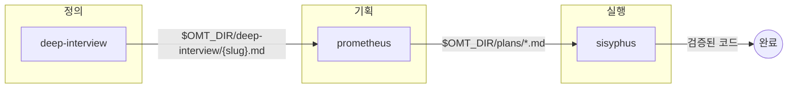
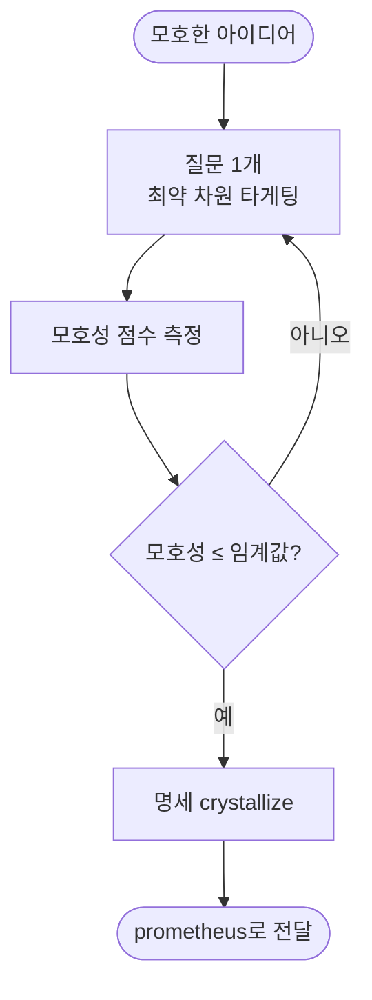
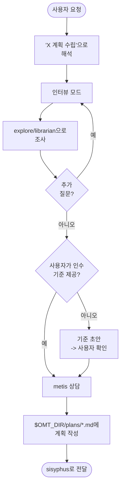
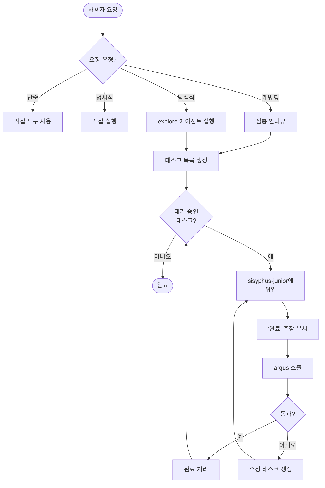
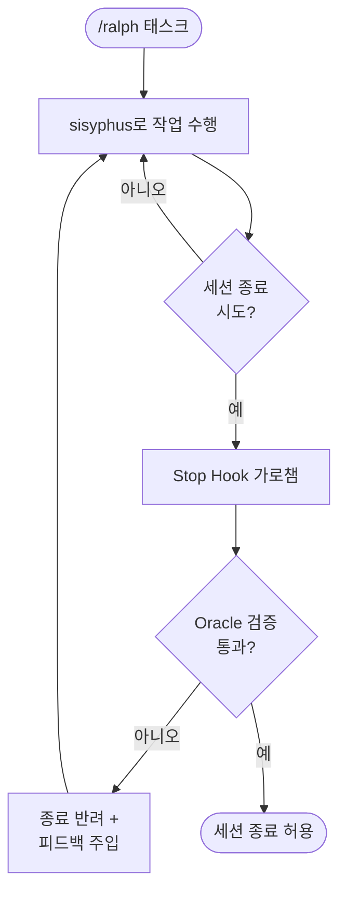

한국어 | [English](core-pipeline.en.md)

# 핵심 파이프라인 스킬

oh-my-toong은 AI 에이전트 설정을 중앙에서 버전 관리하고 프로젝트별로 분화하는 라이브러리입니다. 그 중심에는 **에이전틱 개발 파이프라인** — 하나의 AI가 모든 것을 떠안는 대신, 명확한 역할을 가진 스킬과 에이전트가 협업하는 구조 — 이 있습니다. 이 문서는 그 파이프라인을 구성하는 핵심 스킬을 상세히 다룹니다.

다른 영역의 스킬은 별도 문서를 참고하세요.

- [코드/디자인 리뷰 및 품질](./review-quality.md)
- [문서·발표·PR 작성](./authoring.md)
- [지식 그래프(pins)](./knowledge-graph-pins.md)
- [유틸리티 및 개인 워크플로우](./utilities-personal.md)

전체 그림은 [README](../../README.md)와 [아키텍처 문서](../architecture.md)를 참고하세요.

---

## 1. 왜 파이프라인인가

기존 방식은 기획과 실행을 한 세션에 섞어 다음 문제를 일으킵니다.

- **컨텍스트 오염**: 계획 세부사항과 코드 변경이 한 대화에 뒤섞입니다.
- **목표 이탈**: 구현 도중 원래 의도를 놓칩니다.
- **AI 슬롭**: 제대로 된 명세 없이 급하게 작성한 저품질 코드가 쌓입니다.

핵심 파이프라인은 관심사를 분리해 이를 막습니다. **정의 → 기획 → 실행 → 검증**의 각 단계를 별도 역할이 맡고, 단계 사이는 파일(명세, 계획)로 넘깁니다. 앞 단계가 충분히 명확해지기 전에는 다음 단계로 넘어가지 않습니다.

| 단계 | 스킬 | 책임 | 산출물 |
|------|------|------|--------|
| 정의 | deep-interview | 모호성을 해소해 명세로 수렴 | `$OMT_DIR/deep-interview/{slug}.md` |
| 기획 | prometheus | 명세를 실행 가능한 작업 계획으로 변환 | `$OMT_DIR/plans/*.md` |
| 실행 | sisyphus | 전문 에이전트를 통한 구현 조율 | 검증된 코드 변경 |
| 검증 | argus | 구현 품질·계획 준수·지시 이행 확인 | APPROVE / REQUEST_CHANGES |

여기에 보조 역할이 붙습니다. **clarify**는 어느 단계든 모호함이 보이면 멈추는 게이트, **momus**는 실행 전 계획을 검토하는 비평가, **diagnose**는 원인을 진단하는 읽기 전용 조언자, **agent-council**은 판단이 갈릴 때 다수 의견을 모으는 자문 기구입니다.

---

## 2. 정의 → 기획 → 실행 파이프라인

세 가지 기반 스킬이 파이프라인의 척추를 이룹니다.

각 화살표는 파일 핸드오프입니다. deep-interview는 명세를 prometheus에 넘기고, prometheus는 계획을 sisyphus에 넘기며, sisyphus는 검증된 코드 변경으로 마무리합니다. 단계를 건너뛰어도 동작하지만, 앞 단계의 명확성이 뒤 단계의 품질을 결정합니다.

---

## 3. deep-interview — 소크라테스식 심층 인터뷰

**목적**: 모호한 아이디어를 자율 실행 전에 명확한 명세로 수렴시킵니다. 가중치 기반 모호성 점수가 임계값 아래로 떨어질 때까지, 한 번에 하나씩, 가장 약한 차원을 겨냥해 질문합니다.

**핵심 제약**: 모호성이 임계값을 넘으면 실행으로 넘어가지 않습니다. 직접 구현하지 않고, 명세를 만들어 prometheus로 넘깁니다.

**언제 쓰나**: 아이디어는 있지만 범위가 흐릿할 때, "물어봐줘", "넘겨짚지 마", "확실히 이해했는지 봐줘" 같은 요청이 있을 때 씁니다. 반대로 파일 경로·함수명·인수 기준까지 명확한 요청이라면 인터뷰 없이 바로 실행하는 게 맞습니다.

**파이프라인 연결**: 출력 명세는 `$OMT_DIR/deep-interview/{slug}.md`에 저장되어 prometheus의 입력이 됩니다. "specification quality가 AI 개발의 핵심 병목"이라는 전제 위에 설계되었습니다.

---

## 4. prometheus — 전략적 기획 컨설턴트

**목적**: 기획과 실행을 분리합니다. 코드 작성 전에 작업 계획을 수립합니다.

**핵심 제약**: **절대 코드를 작성하지 않습니다.** 모든 요청을 기획 요청으로 해석합니다. "그냥 구현해", "계획은 건너뛰어" 같은 명령으로도 기획 모드를 벗어날 수 없습니다 — 모드는 세션 내내 고정(sticky)됩니다.

**언제 쓰나**: 기능을 구현·수정·생성하기 전, 특히 범위와 요구사항이 불명확할 때 씁니다.

**금지된 행위**:

- 코드 파일 작성 (.ts, .js, .py 등)
- 소스 코드 편집
- 구현 명령 실행
- "작업을 수행하는" 모든 행위

**파이프라인 연결**: 인터뷰 → 조사(explore/librarian) → metis 갭 분석 → 계획 작성 순으로 진행합니다. 산출된 계획은 `$OMT_DIR/plans/*.md`에 저장되어 sisyphus의 입력이 됩니다.

---

## 5. sisyphus — 태스크 오케스트레이터

**목적**: 복잡한 작업을 위임을 통해 조율합니다. 단독 실행하지 않습니다.

**핵심 제약**: **조율한다. 위임한다. 단독 작업 안 함.** 한 줄짜리 코드 변경이라도 직접 작성하지 않고 sisyphus-junior에 위임합니다. 지휘자이지 연주자가 아닙니다.

**언제 쓰나**: 위임·병렬화·체계적 완료 검증이 필요한 다단계 작업, 특히 모든 걸 직접 하고 싶은 충동이 들 때 씁니다.

**검증 프로토콜**:

- **Zero Trust**: sisyphus-junior의 "완료" 주장은 항상 무시합니다.
- **필수 리뷰**: 모든 구현 후 argus를 호출합니다.
- **Retry 제한 없음**: argus가 통과할 때까지 계속합니다.
- **지속성**: 사용자가 프로세스 중간에 끼어들어 멈출 수 없습니다.

**라우팅 원칙**: 작업 유형으로 위임 대상을 결정합니다. 파일을 변경하는 구현 태스크는 sisyphus-junior, PASS/FAIL 판정이 필요한 검증 태스크는 argus, 원인·아키텍처 분석은 oracle, 코드베이스 검색은 explore로 보냅니다. 직전 태스크가 어떤 경로였든 새 태스크는 자기 유형의 경로를 따릅니다.

---

## 6. 보조 스킬

### clarify — 요구사항 명확화 게이트

**목적**: 모호한 요구사항을 실행 가능한 명세로 바꿉니다. 구현 전 필수 게이트로 동작합니다.

**핵심 제약**: 코드를 작성하거나 파일을 만들기 전에 전달 방식·트리거·범위·성공 기준 네 가지를 확인합니다. 하나라도 불명확하면 **반드시 질문**합니다. "그냥 해줘", "EOD까지" 같은 압박으로도 게이트를 우회할 수 없습니다 — 사용자는 세부사항(DETAILS)은 위임할 수 있어도 방향(DIRECTION)은 위임할 수 없습니다.

**deep-interview와의 차이**: clarify는 어느 단계에서든 가정하려는 순간 멈추는 가벼운 4항목 체크 게이트이고, deep-interview는 모호성 점수로 게이트되는 본격적 반복 인터뷰 세션입니다.

### momus — 작업 계획 검토자

**목적**: 실행 전 작업 계획을 가차없이 비평해 컨텍스트 갭을 잡아냅니다. 비평의 신 이름에서 따왔습니다.

**핵심 제약**: 구현을 시뮬레이션했을 때 정보가 빠져 있고, 계획에 그 정보를 찾을 참조도 없으면 REQUEST_CHANGES를 냅니다. 단, 완벽함을 요구하지는 않습니다 — 애매하면 APPROVE합니다. 막는 갭을 잡는 게 목적이지 트집을 잡는 게 아닙니다.

**파이프라인 연결**: prometheus의 계획과 sisyphus의 실행 사이에 들어가, 막힐 계획을 미리 걸러냅니다. (위임 시에는 momus 에이전트로 호출합니다.)

### diagnose — 읽기 전용 아키텍처·디버깅 조언자

**목적**: 아키텍처 분석, 버그 디버깅, 근본 원인 식별, 기술적 권고를 제공합니다.

**핵심 제약**: **읽기 전용입니다 — 진단하되 구현하지 않습니다.** 분석 요청을 detached 워커(Hephaestus)에 위임하고 폴링으로 결과를 거둡니다. 워커가 불가하면 in-session 분석으로 폴백합니다.

**언제 쓰나**: "원인 분석", "뭐가 문제", "아키텍처 리뷰", "조사해" 같은 요청에 씁니다. 판정(PASS/FAIL)이 아니라 분석 보고서가 필요할 때입니다. (위임 시에는 oracle 에이전트로 호출합니다.)

### agent-council — 다중 AI 자문 기구

**목적**: 여러 AI의 관점을 모아 불확실한 결정을 돕습니다.

**핵심 제약**: **자문은 의견을 줄 뿐, 최종 결정은 호출자가 합니다.** 객관적 정답이 있는 문제(컴파일 에러, 코드 스타일, 명확한 스펙)에는 쓰지 않습니다. 멤버 전원이 불가하면 in-session 단일 음성 자문으로 폴백합니다.

**언제 쓰나**: 아키텍처 트레이드오프, 주관적 품질 판단, 리스크 평가 불일치처럼 정답이 하나가 아닌 결정에 씁니다.

---

## 7. 위임 에이전트 명단

스킬이 *방법론*이라면, 에이전트는 *위임 대상*입니다. sisyphus와 prometheus는 작업 유형에 따라 아래 에이전트를 골라 격리된 서브에이전트 컨텍스트에서 일을 시킵니다. 현재 11개 에이전트가 있습니다.

| 에이전트 | 역할 | 언제 쓰나 |
|----------|------|-----------|
| sisyphus-junior | 다단계 구현을 단독 수행하는 실행자 | 코드/파일을 실제로 변경할 때 (sisyphus가 위임) |
| oracle | 근본 원인 + 우선순위 권고를 file:line으로 반환. 파일 미변경 | 아키텍처 분석·디버깅 진단이 필요할 때 |
| explore | 절대 경로 기반 구조화 결과를 반환하는 코드베이스 검색기 | 파일·패턴·구현을 찾을 때 (외부 문서 제외) |
| librarian | 출처 URL을 필수로 다는 외부 문서 연구자 | 외부 API·라이브러리·오픈소스 구현을 조사할 때 |
| metis | 빠진 질문·미정의 가드레일·미검증 가정·범위 리스크를 잡는 계획 검토자 | 구현 전 계획·스펙·요구사항을 점검할 때 (prometheus가 상담) |
| argus | 구현 품질·계획 준수·지시 이행을 검증하는 품질 보증 가디언 | 구현 후 PASS/FAIL 판정이 필요할 때 |
| momus | 시뮬레이션 기반 작업 계획 비평을, 확신도 분류와 판정으로 반환 | 실행 전 작업 계획을 비평할 때 |
| daedalus | 스틸맨 반론과 트레이드오프 긴장 분석으로 설계를 검토 | 계획·설계의 건전성을 따져볼 때 |
| mnemosyne | 격리된 컨텍스트에서 atomic 커밋을 수행하는 Git 전문가 | 커밋으로 대화 컨텍스트가 오염되는 걸 막을 때 |
| chunk-reviewer | 주요 단계 완료분을 원래 계획·코딩 표준에 비추어 리뷰 | 큰 단계를 마치고 리뷰 라운드를 돌릴 때 |
| tech-claim-examiner | 5축 프레임워크로 이력서 기술 주장을 평가하는 CTO 관점 심사자 | 이력서의 기술적 주장을 검증할 때 |

---

## 8. Ralph Loop — 완료 검증 강제 루프

**목적**: `/ralph` 키워드를 활성화하면, Oracle 검증을 통과할 때까지 세션 종료를 거부합니다.

**핵심 메커니즘**: Stop hook이 세션 종료 시도를 가로채, 요구사항 완료 여부를 분석하고 미완료 시 종료를 반려합니다.

**검증 조건**:

- `<oracle-approved>VERIFIED_COMPLETE</oracle-approved>` 태그가 필수입니다.
- 미완료 태스크가 있으면 종료를 거부합니다.
- 최대 10회 반복 후에는 강제 종료를 허용합니다.

### 명령어

| 명령어 | 용도 |
|--------|------|
| `/ralph <작업>` | 가장 먼저 sisyphus 스킬을 로드한 뒤, Ralph Loop를 켠 상태로 작업을 실행 |
| `/cancel-ralph` | 활성 Ralph Loop를 취소하고 모든 상태 파일을 정리 |

Ralph 상태는 `$OMT_DIR/ralph-state-*.json`에 저장되며, `/cancel-ralph`가 이 파일들과 연동된 ultrawork 상태까지 정리합니다.

---

## 더 보기

- [README](../../README.md) — 프로젝트 개요와 중앙 관리 + 프로젝트 분화 스토리
- [아키텍처 문서](../architecture.md) — 동기화 시스템과 전체 구조
- [코드/디자인 리뷰 및 품질](./review-quality.md)
- [문서·발표·PR 작성](./authoring.md)
- [지식 그래프(pins)](./knowledge-graph-pins.md)
- [유틸리티 및 개인 워크플로우](./utilities-personal.md)
