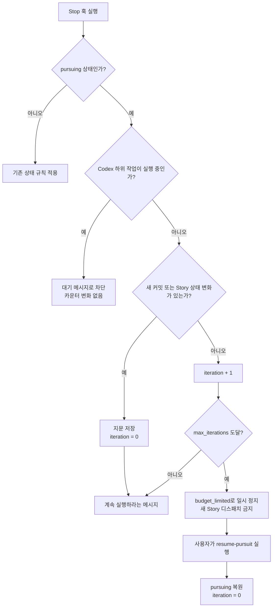

# Ultragoal의 “무진전 실행 제어” 변경 설명

대상 커밋: `acd90900` (`feat: ultragoal 무진전 실행 제어 추가`)

## 한눈에 보기

이 변경은 `ultragoal`이 멈춤을 막는 횟수를 **전체 반복 횟수**가 아니라 **진전 없이 끝난 Stop의 연속 횟수**로 세도록 바꿉니다. 따라서 실제로 작업이 진행되고 있다면 반복 예산이 다시 0이 되고, 하위 에이전트가 아직 일하고 있다면 기다리는 동안 예산을 쓰지 않습니다.

기존에는 작업을 잘 진행해도 Stop이 반복되면 `max_iterations`에 도달할 수 있었습니다. 이제는 다음 두 사건만 “진전”으로 인정합니다.

- 저장소에 실제 파일 차이가 있는 커밋이 새로 생김
- Ultragoal Story의 상태가 바뀜

진전이 없는 Stop이 `max_iterations`(기본 10회)에 도달하면 완료로 처리하지 않습니다. 상태를 보존한 `budget_limited`로 일시 정지하며, 재개는 사용자가 직접 `resume-pursuit`를 실행해야 합니다.

## 왜 바꿨나

`iteration`은 원래 “계속하라고 막은 횟수”에 가까웠습니다. 이 방식은 정상적인 실행도 같은 비용으로 취급합니다. 예를 들어 스토리를 하나 끝내고 커밋을 만들었더라도 다음 Stop에서 계속 카운터가 올라가므로, 긴 작업은 진전이 있어도 제한에 걸릴 수 있었습니다.

이번 변경의 기준은 다음처럼 바뀝니다.

| 상황 | 이전 해석 | 새 해석 |
| --- | --- | --- |
| Stop이 한 번 발생 | 반복 1회 소비 | 진전 여부를 먼저 확인 |
| 파일을 바꾼 새 커밋 | 별도 보상 없음 | 무진전 카운터를 0으로 초기화 |
| Story 상태 변경 | 별도 보상 없음 | 무진전 카운터를 0으로 초기화 |
| 하위 에이전트 실행 중 | Codex에서는 감지하지 못함 | 기다리라는 차단 메시지, 카운터 유지 |
| 한도 도달 | 예산 소진 상태로 정지 | `budget_limited`로 보존 정지 후 사용자 재개 |

## 새 실행 흐름



### 1. 진전 판정: `progress.ts`

새 파일 `lib/persistent-mode-core/progress.ts`가 현재 상태의 “지문(fingerprint)”을 계산합니다.

- `last_seen_head`: 마지막으로 확인한 Git `HEAD`
- `last_seen_stories_digest`: 각 Story의 `id`와 `status`만 정렬해 SHA-256으로 요약한 값

커밋은 단순히 `HEAD`가 바뀌었다고 인정하지 않습니다. 이전 `HEAD`가 현재 `HEAD`의 조상인지 확인한 뒤, 그 구간에 실제 diff가 있어야 합니다. 그래서 빈 커밋, amend/rebase로 갈라진 이력, 변경 후 되돌린 이력은 진전으로 세지 않습니다. 작업 트리에만 남은 미커밋 변경도 세지 않습니다.

Story 쪽은 제목이나 설명 변경이 아니라 `id`와 `status`의 조합이 달라질 때만 진전입니다. 정렬 후 해시하므로 Story 배열 순서만 바뀐 경우에는 오탐하지 않습니다.

첫 관찰에서는 비교 기준이 없으므로 진전으로 세지 않고 지문만 저장합니다. Git 저장소가 아니거나 Git 명령이 실패해도 “진전 없음”으로 안전하게 처리합니다.

### 2. Stop 판단: `decision.ts`

`lib/persistent-mode-core/decision.ts`는 pursuing 중인 ultragoal에 대해 먼저 위 지문을 비교합니다.

- **진전 있음**: 최신 지문을 저장하고 `iteration`을 0으로 만든 뒤 계속 실행을 요구합니다.
- **진전 없음**: `iteration`을 1 늘립니다.
- **한도 도달**: `active=false`, `phase=budget_limited`로 기록하고 새 작업을 시작하지 말라는 메시지를 냅니다.

메시지의 표현도 `ITERATION`에서 `NO-PROGRESS`로 바뀌어, 숫자가 전체 반복이 아니라 무진전 연속 횟수임을 드러냅니다.

### 3. 하위 작업 대기: Codex 전용 감지기

`hooks/codex-persistent-mode/cli.ts`는 pursuing 상태에서만 Codex의 `state_5.sqlite`를 읽어, 이 세션이 생성한 열린 자식 작업을 찾습니다. 각 자식의 rollout JSONL 끝부분(최대 64 KiB)을 확인합니다.

- 마지막 상태가 `task_started`이면 실행 중으로 봅니다.
- `task_complete` 또는 `turn_aborted`가 마지막이면 완료된 작업으로 봅니다.
- rollout 파일이 오래되었으면 stale로 보고 제외합니다.
- 큰 rollout에서 시작 기록이 잘렸고 종료 기록도 없으면, 실행 중일 가능성을 보수적으로 유지합니다.

실행 중인 자식이 있으면 Codex Stop 훅은 종료를 조용히 허용하지 않습니다. 대신 “백그라운드 작업을 기다리라”는 차단 메시지를 내고 `iteration`은 증가시키지 않습니다. 완료 알림이 Stop 훅 재실행을 보장하지 않는 Codex 특성 때문에, 단순 허용 대신 명시적으로 대기시키는 방식입니다.

`sqlite3`, 상태 DB, rollout 파일 또는 JSON이 없거나 손상된 경우 감지기는 stderr에 진단 한 줄을 남기고 자식 수를 0으로 계산합니다. 즉, 감지 기능의 고장 자체가 사용자를 영구 차단하지는 않습니다. 이 때문에 `sqlite3`가 런타임 요구사항으로 문서화되었습니다.

### 4. 예산 소진 뒤의 사용자 재개

`skills/ultragoal/scripts/ultragoal-state.ts`에 `resume-pursuit` 명령이 추가되었습니다.

이 명령은 다음 상태 전이만 허용합니다.

```text
budget_limited  --(사용자 실행 resume-pursuit)-->  pursuing
```

성공하면 `active=true`, `iteration=0`, `budget_limit_notified=false`로 복원합니다. 기존 outcome, Story, 요약 등은 유지합니다. 파일이 없거나 손상됐거나 phase가 `budget_limited`가 아니면 거부하며 상태를 바꾸지 않습니다.

이 명령은 에이전트가 실행할 수 없습니다. `write-guard-core.sh`와 Claude/Codex용 가드가 직접 호출, 변수 우회, 인자 순서 변경, 공백 변형까지 차단합니다. 의도는 예산을 다시 여는 판단을 사용자에게 맡기는 것입니다.

## 동시성 안전성

Ultragoal 상태 파일은 여러 훅과 명령이 읽고 수정할 수 있습니다. 이번 변경은 기존에 review dispatch 예약에만 있던 파일 락을 `lib/persistent-mode-core/state-lock.ts`로 분리하고, 일반적인 `updateUltragoalState`와 ultragoal CLI의 병합 쓰기에도 적용합니다.

락은 디렉터리 생성으로 획득합니다. 이미 락이 있으면 짧게 재시도하고, 오래됐거나 소유 프로세스가 죽은 락은 회수합니다. 그래도 경합이 계속되면 락 없이 쓰지 않고 실패합니다. 락을 풀 때는 소유 토큰을 확인하므로, 다른 실행자가 이어받은 락을 실수로 지우지 않습니다.

이 조치는 Stop 훅의 지문/카운터 업데이트, 사용자 재개, review dispatch 예약처럼 같은 상태를 바꾸는 작업이 서로의 변경을 덮어쓰지 않게 합니다.

## 부수 변경

- `status` 명령은 비활성 terminal 상태도 읽도록 바뀌어 `budget_limited`를 실제로 표시합니다. 반면 기존 `get`의 active-only 동작은 유지합니다.
- 문서(README, orchestration, core pipeline)는 새 무진전 의미, 백그라운드 대기, 사용자 재개 절차, `sqlite3` 요구사항을 반영했습니다.
- 디자인 리뷰 job 테스트는 `stop` 직후 worker가 완전히 종료될 때까지 기다린 후 정리하도록 보강했습니다. queued 상태의 비동기 worker가 정리 디렉터리와 경합하는 테스트 레이스를 줄이는 목적입니다.

## 테스트가 확인하는 것

변경에는 다음 범주의 회귀 테스트가 추가·확장되었습니다.

- 실제 파일 diff가 있는 커밋은 카운터를 리셋하고, 빈 커밋·작업 트리 변경·amend/rebase·되돌린 변경은 리셋하지 않음
- Story 상태 변화는 리셋하고, 순서나 비상태 필드 변화는 리셋하지 않음
- 10번째 연속 무진전 Stop에서 `budget_limited`로 전환됨
- 실행 중인 Codex child는 대기시키고, 완료·중단·stale child는 대기시키지 않음
- SQLite/rollout 이상은 진단 후 fail-open 처리됨
- 정상·stale·후임 락과 락 경합에서 상태 파일을 안전하게 다룸
- `resume-pursuit`의 허용 상태, 거부 상태, CLI 노출, 에이전트 실행 차단을 확인함

## 읽을 때 기억할 핵심

1. `max_iterations`는 이제 “얼마나 오래 일했는가”가 아니라 “얼마나 오래 진전 없이 Stop했는가”의 한도입니다.
2. 현재 하위 작업이 끝나지 않았다면 기다릴 뿐, 예산을 소비하지 않습니다.
3. 한도 도달은 완료가 아니라 보존된 일시 정지입니다.
4. 재개 권한은 에이전트가 아니라 사용자에게 있습니다.

## 퀴즈

1. 파일을 실제로 바꾼 커밋이 하나 추가된 뒤 Stop이 발생했습니다. `iteration`에는 어떤 변화가 일어나며, 그 이유는 무엇인가요?

2. Story의 제목만 바꾸고 상태는 그대로 두었습니다. 이것이 진전으로 인정되지 않는 이유를 `last_seen_stories_digest`의 입력값 관점에서 설명해 보세요.

3. Codex child가 `task_started` 뒤 아직 `task_complete`를 기록하지 않은 상태입니다. Stop 훅은 무엇을 출력하고, `iteration`은 왜 증가하지 않나요?

4. `budget_limited`가 된 뒤 AI가 스스로 `resume-pursuit`를 호출할 수 없는 이유는 무엇이며, 누가 어떤 명령으로 재개해야 하나요?

5. 상태 파일 락이 계속 경합 중일 때 “락 없이 일단 쓰기”를 하지 않는 이유는 무엇인가요?

### 정답

1. `iteration`은 0으로 리셋됩니다. 이전에 본 HEAD 이후 실제 diff가 포함된 커밋이 생긴 것이 관찰 가능한 진전이기 때문입니다.
2. digest는 Story의 `id`와 `status` 쌍만 정렬해 해시합니다. 제목은 입력에 없으므로 해시가 바뀌지 않습니다.
3. 백그라운드 작업을 기다리라는 차단 메시지를 출력합니다. 아직 실행 중인 위임 작업은 Stop을 통한 무진전으로 간주하지 않기 때문입니다.
4. 예산 재개는 사용자 승인으로 제한한 작업이므로 write guard가 AI의 Bash 실행을 거부합니다. 사용자가 `bun <ultragoal-state.ts 경로> resume-pursuit`를 직접 실행합니다.
5. 동시에 일어난 업데이트가 서로를 덮어써 Story 상태, 지문, 카운터 또는 review 예약 같은 중요한 상태가 사라질 수 있기 때문입니다. 경합 시 실패하는 편이 조용한 데이터 손실보다 안전합니다.
