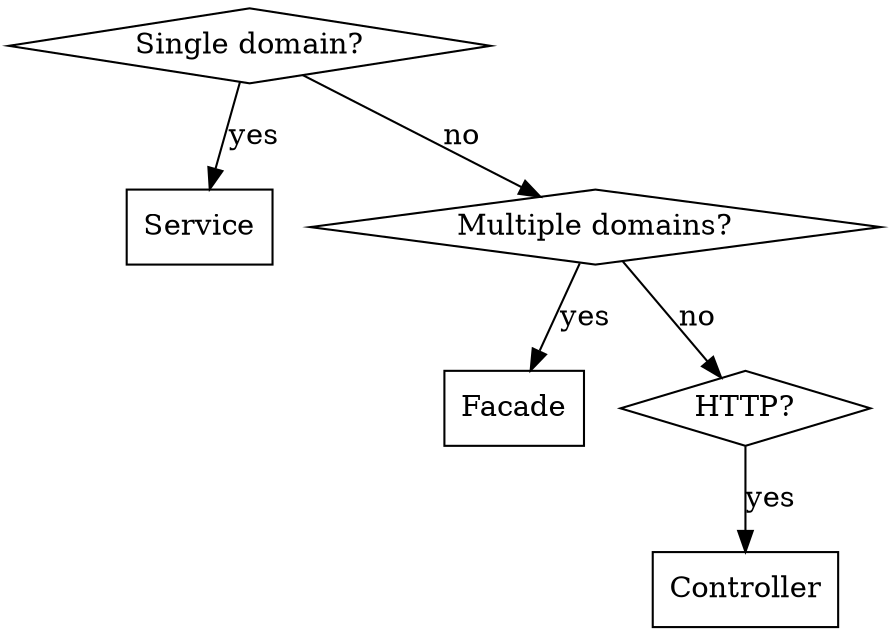

# 레이어 경계

이 코드를 Controller/Facade/Service/Domain 중 어느 레이어에 두는지, 레이어 간 의존 방향과 트랜잭션 경계를 어떻게 지키는지 판단하는 기준을 담는다. 이 문서는 implementation docs 8개 전체의 진입점이기도 하다.

## 목차

1. **빠른 판단** — Quick Decision 그래프로 레이어를 정한다
2. **세 가지 설계 원칙** — 책임 할당·객체 협력·표현 일관성
3. **레이어 구조와 의존 방향** — interfaces → application → domain ← infrastructure
4. **Controller는 Facade만 호출한다** — Controller → Facade → Service 흐름
5. **Service와 Facade의 책임 분담** — 단일 도메인 오케스트레이션 vs 도메인 간 조율
6. **트랜잭션 경계** — 어느 레이어가 `@Transactional`을 갖는가
7. **이벤트 리스너의 위치** — `interfaces/event/{domain}/`
8. **안티패턴** — 레이어 배치에서 흔히 깨지는 5가지 규칙
9. **도메인 순수성** — 도메인이 아무것도 import하지 않는 이유
10. **의존성 검사 방법** — `domain/` 패키지의 금지된 import 목록
11. **이런 생각이 들면 멈춰라** — Red Flags
12. **관련 문서 찾기** — implementation docs 8개 지도

---

## 1. 빠른 판단

새 코드를 작성하기 전에 먼저 이 그래프로 어느 레이어에 둘지 정한다. 단일 도메인만 다루면 Service, 여러 도메인을 조율해야 하면 Facade, HTTP 요청/응답을 다뤄야 하면 Controller다.



이 문서는 implementation docs 8개의 진입점 역할도 겸한다. 지금 다루려는 관심사가 레이어 배치가 아니라 다른 주제라면 12절 "관련 문서 찾기"에서 해당 문서로 바로 이동한다.

## 2. 세 가지 설계 원칙

이 프로젝트는 **책임 할당(responsibility assignment)**, **객체 협력(object collaboration)**, **표현 일관성(expression consistency)** 세 가지 원칙을 따른다. 이어지는 절들은 모두 이 세 원칙을 레이어 배치·의존 방향·트랜잭션 경계라는 구체적인 규범으로 옮긴 것이다.

## 3. 레이어 구조와 의존 방향

이 프로젝트의 패키지 구조는 4개 레이어로 나뉜다.

```
interfaces/     → HTTP handling, event listening
    ↓
application/    → Cross-domain coordination (Facade)
    ↓
domain/         → Single-domain business logic (Service)
    ↑
infrastructure/ → Data access, external systems (Repository 구현체)
```

Facade 없이 Controller가 Service를 직접 호출하면 도메인 간 조율이 어려워진다. Service 간 수평 의존은 순환 참조를 일으키고 테스트 복잡도를 높인다. Facade는 도메인 간 조율 지점으로, 필요하면 여러 Service를 하나의 트랜잭션으로 묶는다.

의존 방향을 화살표로 압축하면 다음과 같다.

```
interfaces → application → domain ← infrastructure
```

**규칙**: 도메인은 다른 레이어에서 아무것도 import하지 않는다(순수). 무엇이 허용되고 무엇이 금지되는지의 전체 목록은 9절에서 다룬다.

## 4. Controller는 Facade만 호출한다

**항상**: `Controller -> Facade -> Service` (`Controller -> Service`는 금지)

```kotlin
// ❌ Wrong: Controller injects Service directly
@RestController
class ProductV1Controller(
    private val productService: ProductService,  // Service, not Facade
) : ProductV1ApiSpec
```

```kotlin
// ✅ Correct
@RestController
class ProductV1Controller(
    private val productFacade: ProductFacade,  // Facade, NOT Service
) : ProductV1ApiSpec
```

Facade가 단일 도메인만 다루는 단순한 케이스라도 이 규칙에 예외는 없다 — Facade는 항상 필요하다.

## 5. Service와 Facade의 책임 분담

Service와 Facade는 둘 다 오케스트레이션 계층이지만, 조율하는 도메인 개수가 다르다.

| 레이어 | `@Transactional` | 수평 의존 | 이유 |
|-------|---------------|------------------------|-----|
| Facade | 원자성이 필요할 때 | 여러 Service 조합 가능 | 여러 Service를 하나의 트랜잭션으로 묶는다 |
| Service | 원자성이 필요할 때 | 다른 Service 의존 금지 | 단일 도메인 내부의 원자성을 보장한다 |

`readOnly` 사용법(Master/Slave DB 라우팅)의 상세는 6절에서 다룬다.

**Facade는 조율만 한다** — `if`/`when`/`switch` 같은 비즈니스 로직을 넣지 않는다. 판단은 Service/Entity에 위임한다. 이 규칙이 깨졌을 때의 구체적인 Before/After는 8절 "Facade의 비즈니스 로직"에서 다룬다.

### Service (단일 도메인)

```kotlin
@Component
class CouponService(
    private val couponRepository: CouponRepository,  // ✅ Own Repository
    private val eventPublisher: ApplicationEventPublisher,
) {
    // ❌ Wrong: Injecting other domain Service/Repository is prohibited
    // private val orderService: OrderService
    // private val pointRepository: PointRepository

    @Transactional(readOnly = true)
    fun findById(id: Long): Coupon {
        return couponRepository.findById(id)
            ?: throw CoreException(ErrorType.NOT_FOUND, "[couponId = $id] 쿠폰을 찾을 수 없습니다.")
    }

    @Transactional
    fun issue(command: CouponCommand.Issue): Coupon {
        val coupon = Coupon.create(command.userId, command.couponType)
        return couponRepository.save(coupon)
    }
}
```

### Facade (도메인 간 조율)

```kotlin
@Component
class OrderFacade(
    private val orderService: OrderService,     // ✅ Can combine multiple Services
    private val couponService: CouponService,
    private val pointService: PointService,
    private val eventPublisher: ApplicationEventPublisher,
) {
    @Transactional  // ✅ Transaction boundary is at Facade
    fun createOrder(criteria: OrderCriteria.Create): OrderInfo.Create {
        // 1. Use coupon (if present)
        criteria.couponId?.let { couponId ->
            couponService.use(CouponCommand.Use(couponId))
        }

        // 2. Deduct points (if present)
        criteria.pointAmount?.let { amount ->
            pointService.use(PointCommand.Use(criteria.userId, amount))
        }

        // 3. Create order
        val order = orderService.create(criteria.to())

        // 4. Publish event
        eventPublisher.publishEvent(OrderCreatedEventV1.from(order))

        return OrderInfo.Create.from(order)
    }
}
```

## 6. 트랜잭션 경계

`@Transactional`을 실제로 어느 레이어가 갖는지는 4개 레이어 전체를 기준으로 정한다.

| 레이어 | `@Transactional` | 목적 |
|-------|---------------|---------|
| Controller | ❌ Never | HTTP handling only |
| Facade | When atomicity needed | Wraps multiple Services in single transaction |
| Service | When atomicity needed | Ensures atomicity within single domain |
| Repository | When atomicity needed | Ensures atomicity for complex repository operations |

**`readOnly` 사용법**: Master/Slave DB 라우팅 목적이다. 읽기 전용 쿼리에는 `readOnly=true`를 써서 Slave DB로 라우팅한다.

```kotlin
// Service query method - readOnly for Slave DB routing
@Transactional(readOnly = true)
fun findAll(query: CouponQuery): List<Coupon>

// Service write method - @Transactional when atomicity needed within domain
@Transactional
fun use(command: CouponCommand.Use): Coupon
```

> ⚠️ 주의: Facade와 Service 양쪽 모두에 `@Transactional`이 있을 때 전파(propagation)를 이해하지 못하면 데이터 정합성이 깨진다.

```kotlin
// Scenario: Both layers have @Transactional
class PointService {
    @Transactional  // propagation=REQUIRED (default)
    fun use(command: PointCommand): Point
}

class CouponService {
    @Transactional  // propagation=REQUIRED (default)
    fun issue(command: CouponCommand): Coupon
}

class RewardFacade {
    @Transactional
    fun grantReward(criteria: RewardCriteria): RewardInfo {
        pointService.use(criteria.pointCommand)   // Participates in Facade's tx
        couponService.issue(criteria.couponCommand)  // Participates in Facade's tx
        // Both operations execute atomically in one transaction ✅
    }
}

// ⚠️ THE TRAP: When Services are called directly (not through Facade)
// Each Service creates its OWN transaction!
// → If pointService.use() succeeds but couponService.issue() fails,
//   point deduction is committed while coupon issuance is rolled back = data inconsistency

// ✅ SOLUTION: Understand your call paths
// - Facade → Service: Service joins Facade's transaction (propagation=REQUIRED)
// - Direct Service call: Service manages its own transaction (atomicity within domain)
// - Cross-domain coordination: MUST go through Facade for atomicity
```

## 7. 이벤트 리스너의 위치

**위치**: `interfaces/event/{domain}/`

```kotlin
@Component
class OrderEventListener(
    private val notificationService: NotificationService,  // ✅ Service call
) {
    // ❌ Wrong: Direct Repository call is prohibited
    // private val notificationRepository: NotificationRepository

    @Async
    @TransactionalEventListener(phase = TransactionPhase.AFTER_COMMIT)
    fun onOrderCreated(event: OrderCreatedEventV1) {
        notificationService.sendOrderConfirmation(event.orderId)
    }
}
```

## 8. 안티패턴

### ❌ Service → Service 수평 의존

```kotlin
// Wrong
class OrderService(
    private val pointService: PointService,  // Horizontal dependency!
) {
    fun createOrder(command: OrderCommand.Create): Order {
        pointService.use(...)  // Calling another Service from Service
        ...
    }
}
```

조율은 Service가 아니라 Facade에서 한다 — 5절의 `OrderFacade` 예시가 올바른 형태다.

### ❌ Facade → Facade 의존

```kotlin
// Wrong
class OrderFacade(
    private val paymentFacade: PaymentFacade,  // Facade-to-Facade dependency!
    private val notificationFacade: NotificationFacade,  // Facade-to-Facade dependency!
    private val rewardFacade: RewardFacade,  // Facade-to-Facade dependency!
)

// ✅ CORRECT: Event-based communication
@Component
class OrderFacade(
    private val orderService: OrderService,
    private val eventPublisher: ApplicationEventPublisher,
) {
    @Transactional
    fun completeOrder(orderId: Long): OrderInfo {
        val order = orderService.complete(orderId)
        eventPublisher.publishEvent(OrderCompletedEventV1.from(order))
        return OrderInfo.from(order)
    }
}

// Other domains handle via event listeners
@Component
class RewardEventListener(
    private val rewardService: RewardService,
) {
    @TransactionalEventListener(phase = TransactionPhase.AFTER_COMMIT)
    fun onOrderCompleted(event: OrderCompletedEventV1) {
        rewardService.accumulate(event.userId, event.totalAmount)
    }
}
```

### ❌ Facade의 비즈니스 로직

```kotlin
// Wrong - Business logic decisions in Facade
@Component
class OrderFacade {
    @Transactional
    fun fulfillOrder(order: Order) {
        if (order.type == OrderType.REGULAR) {     // Business logic!
            shippingService.scheduleStandard(order)
        } else if (order.type == OrderType.SUBSCRIPTION) {  // Business logic!
            paymentService.setupAutoPayment(order)
            shippingService.scheduleStandard(order)
        } else if (order.type == OrderType.RESERVATION) {   // Business logic!
            reservationService.setReservationDate(order)
        }
    }
}

// ✅ CORRECT: Facade only coordinates, business logic in Service/Entity
@Component
class OrderFacade {
    @Transactional
    fun fulfillOrder(criteria: OrderCriteria): OrderInfo.Fulfill {
        val order = orderService.fulfill(criteria.to())  // Service handles type-specific processing
        return OrderInfo.Fulfill.from(order)
    }
}

@Component
class OrderService {
    @Transactional
    fun fulfill(command: OrderCommand): Order {
        val order = orderRepository.findById(command.orderId)
            ?: throw CoreException(ErrorType.NOT_FOUND, "[orderId = ${command.orderId}] 주문을 찾을 수 없습니다.")

        order.fulfill()  // Entity handles type-specific processing (polymorphism or internal logic)
        return orderRepository.save(order)
    }
}
```

### ❌ EventListener의 비즈니스 로직

```kotlin
// Wrong
@TransactionalEventListener(phase = TransactionPhase.AFTER_COMMIT)
fun onOrderCreated(event: OrderCreatedEventV1) {
    if (event.totalAmount >= 100000) {  // Business logic leakage!
        // VIP notification
    } else {
        // Regular notification
    }
}

// Correct - Service makes the decision
@TransactionalEventListener(phase = TransactionPhase.AFTER_COMMIT)
fun onOrderCreated(event: OrderCreatedEventV1) {
    notificationService.sendOrderConfirmation(event.orderId)  // Service determines VIP status
}
```

### ❌ 도메인의 Infrastructure Import

```kotlin
// Wrong: In domain/ package
package com.project.domain.coupon

import com.project.infrastructure.persistence.CouponJpaRepository  // ❌
import org.springframework.data.jpa.repository.JpaRepository  // ❌
```

## 9. 도메인 순수성

**방향**: `interfaces -> application -> domain <- infrastructure`

**도메인은 다른 레이어에서 아무것도 import하지 않는다.**

이 절의 규칙은 Entity·Value Object 같은 순수 도메인 모델을 대상으로 한다. Service는 3절의 패키지 구조상 `domain/`에 위치하지만 Spring 빈으로 등록되어 오케스트레이션을 수행하는 컴포넌트이므로 `@Component`/`@Service` 스테레오타입 어노테이션은 물론, 5·6절이 규정하는 대로 원자성이 필요할 때는 `@Transactional`도 붙는다 — 5절의 `CouponService`가 그 예다.

| Domain에서 허용 | Domain에서 금지 |
|------------------|---------------------|
| JPA: `@Entity`, `@Table`, `@Column` 등 | `@Transactional` (Entity·Value Object 한정 — Service는 위 예외 참조) |
| Kotlin 표준 라이브러리 | `@JsonProperty`, `@JsonIgnore` |
| `registerEvent()`를 통한 도메인 이벤트 | Spring Data imports |

**Repository 추상화**: 인터페이스는 도메인에, 구현체는 인프라스트럭처에 둔다.

이 규칙을 더 구체적으로 풀면, 도메인에 허용되는 것은 다음 세 가지뿐이다.

- JPA 어노테이션: `@Entity`, `@Table`, `@Column`, `@Index`, `@ManyToOne` 등
- Kotlin 표준 라이브러리
- `registerEvent()`를 통한 도메인 이벤트

반대로 아래 import가 `domain/` 패키지 파일에 있으면 위반이다.

```kotlin
// These imports in domain/ package (Entity·Value Object 등 순수 도메인 모델) = VIOLATION
import org.springframework.stereotype.*          // @Component, @Service — Entity/VO 한정 위반, Service는 위 예외 참조
import org.springframework.transaction.*         // @Transactional — Entity/VO 한정 위반, Service는 위 예외 참조
import org.springframework.data.*                // JpaRepository
import org.springframework.web.*                 // @RestController
import com.fasterxml.jackson.annotation.*        // @JsonProperty
import com.project.infrastructure.*
import com.project.application.*
import com.project.interfaces.*
```

"Repository 추상화"를 실제 코드로 옮기면 인터페이스와 구현체가 레이어를 가로질러 나뉜다.

```kotlin
// Domain layer: Interface
package com.project.domain.order

interface OrderRepository {
    fun findById(id: Long): Order?
    fun save(order: Order): Order
}

// Infrastructure layer: Implementation
package com.project.infrastructure.persistence.order

@Repository
class OrderRdbRepository(
    private val orderJpaRepository: OrderJpaRepository
) : OrderRepository {
    override fun findById(id: Long): Order? = orderJpaRepository.findById(id).orElse(null)
    override fun save(order: Order): Order = orderJpaRepository.save(order)
}
```

## 10. 의존성 검사 방법

```kotlin
// If these imports exist in domain/ package files, it's a violation:
import com.project.infrastructure.*
import com.project.application.*
import com.project.interfaces.*
import org.springframework.data.*
import org.springframework.web.*
```

## 11. 이런 생각이 들면 멈춰라

| 이런 생각이 든다면 | 실제로는 |
|---|---|
| "Controller calling Service directly" | Controller -> Facade -> Service is MANDATORY |
| "Facade is unnecessary for simple cases" | Facade is ALWAYS required |
| "Service calling Service" | Coordinate in Facade |
| "Facade->Facade dependency" | Use domain events |
| "@Transactional on Service" | Normal when atomicity is needed within a single domain (5·6절) — Facade is only needed to combine multiple Services |
| "Inject JpaRepository directly" | Define interface in domain |
| "@JsonProperty in domain" | JSON is infrastructure concern |
| "Business logic in Facade" | Facade coordinates only, logic in Service/Entity |
| "External call inside @Transactional" | Use AFTER_COMMIT event listener |

## 12. 관련 문서 찾기

지금 다루려는 주제가 레이어 배치가 아니라면 아래 문서로 이동한다. 테스트 관련 규범(레벨 판단, 상태 검증, 케이스 추출 등)은 이 지도가 아니라 `../testing/`에 따로 있다 — 12절이 안내하는 대상은 구현(implementation) 관련 문서로 한정한다.

| 문서 | 담당 관심사 |
|------|-------------|
| `./layer-boundaries.md` (이 문서) | 레이어 배치·의존 방향·트랜잭션 경계·도메인 순수성 |
| `./entity-patterns.md` | 엔티티 캡슐화 7규칙·리치 도메인 모델 |
| `./domain-events.md` | 도메인 이벤트·EventListener·크로스도메인 통신 |
| `./dto-patterns.md` | Request/Criteria/Command/Info/Response 흐름 |
| `./error-handling.md` | CoreException·ErrorType·Null Safety·에러 메시지 |
| `./api-patterns.md` | ApiSpec·Query/PageQuery |
| `./caching-patterns.md` | Cache-Aside·CacheKey·무효화 |
| `./naming-conventions.md` | 컴포넌트·메서드·변수·불리언 네이밍 |
