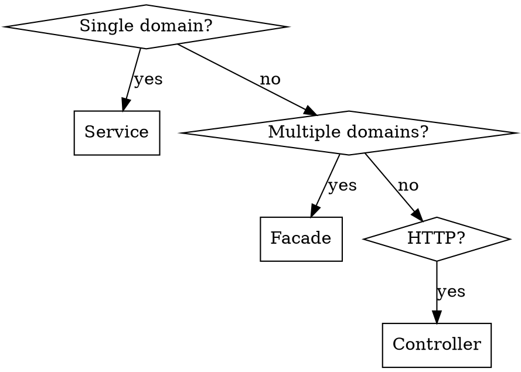

# Implementation Guide

## Overview

This project follows **responsibility assignment**, **object collaboration**, and **expression consistency**.

## Quick Decision



## Critical Rules (Non-negotiable)

### 1. Controller Flow

**ALWAYS**: `Controller -> Facade -> Service` (never `Controller -> Service`)

```kotlin
@RestController
class ProductV1Controller(
    private val productFacade: ProductFacade,  // Facade, NOT Service
) : ProductV1ApiSpec
```

See `references/layer-boundaries.md` for detailed patterns.

### 2. Layer Responsibilities

| Layer | @Transactional | Horizontal Dependencies | Why |
|-------|---------------|------------------------|-----|
| Facade | When atomicity needed | Multiple Services OK | Wraps multiple Services in single transaction |
| Service | When atomicity needed | No other Services | Ensures atomicity within single domain |

**readOnly usage**: Master/Slave DB routing. Use `readOnly=true` for read-only queries to route to Slave DB.

**Facade = COORDINATION ONLY** - No business logic (if/when/switch). Delegate to Service/Entity.

See `references/layer-boundaries.md` for transaction boundaries and anti-patterns.

### 3. Error Handling

**Required**: `CoreException` + `ErrorType` (single exception type)

```kotlin
throw CoreException(ErrorType.NOT_FOUND, "[id = $id] 엔티티를 찾을 수 없습니다.")
```

See `references/error-handling.md` for ErrorType enum and patterns.

### 4. DTO Flow

```
Request.toCriteria() -> Criteria.to() -> Command -> Entity -> Info.from() -> Response.from()
```

See `references/dto-patterns.md` for complete layer structure.

### 5. Domain Events

| Requirement | Pattern |
|-------------|---------|
| Naming | `{Action}EventV{n}` (version suffix required) |
| Interface | Must implement `DomainEvent` |
| Fields | `occurredAt: Instant` required |
| Factory | `companion object { fun from(entity) }` |
| Children | Use snapshots, not entity references |

```kotlin
data class OrderCreatedEventV1(
    val orderId: Long,
    val items: List<OrderItemSnapshot>,  // Snapshot, not entity
    override val occurredAt: Instant = Instant.now(),
) : DomainEvent {
    companion object {
        fun from(order: Order): OrderCreatedEventV1 = OrderCreatedEventV1(...)
    }
}
```

### 6. EventListener Pattern

| Type | Phase | Error Handling |
|------|-------|---------------|
| Sync | BEFORE_COMMIT | Failure rolls back tx |
| Async | AFTER_COMMIT | try-catch required, log errors |

**Always**: `@TransactionalEventListener(phase = TransactionPhase.XXX)` - never plain `@EventListener`

**Logging format**: `logger.info("[Event] {Action} start/complete - eventType: ${event::class.simpleName}, id: $id")`

### 7. Entity Encapsulation

Seven Rules:
1. **BaseEntity**: ALL entities extend `BaseEntity` (provides id, createdAt, updatedAt, deletedAt)
2. **@Table indexes**: ALWAYS define indexes for query optimization
3. **private set**: ALL mutable properties
4. **Behavior methods**: State changes via domain verbs (`use()`, `pay()`), not setters
5. **Immutable VOs**: `val` fields, operations return new instances
6. **Init validation**: Validate in `init` block or factory
7. **registerEvent()**: Publish events for business-significant state changes

### 8. Naming Conventions

| Component | Pattern | Example |
|-----------|---------|---------|
| Controller | `{Domain}V{n}Controller` | `ProductV1Controller` |
| ApiSpec | `{Domain}V{n}ApiSpec` | `ProductV1ApiSpec` |
| Facade | `{Domain}Facade` | `ProductFacade` |
| Service | `{Domain}Service` | `ProductService` |
| Event | `{Action}EventV{n}` | `OrderCreatedEventV1` |
| Query | `{Domain}PageQuery` | `ProductPageQuery` |

**Methods**: Domain verbs (`use`, `expire`, `cancel`), not technical (`process`, `handle`, `execute`)

**Variables**: Full names (`totalAmount`, `quantity`), not abbreviations (`amt`, `qty`)

**Booleans**: `is{Adjective}`, `has{Noun}`, `canBe{Verb}`

### 9. Domain Purity

**Direction**: `interfaces -> application -> domain <- infrastructure`

**Domain imports NOTHING** from other layers.

| Allowed in Domain | Forbidden in Domain |
|------------------|---------------------|
| JPA: `@Entity`, `@Table`, `@Column` | `@Transactional` |
| `@Component` on Service | `@JsonProperty`, `@JsonIgnore` |
| | Spring Data imports |

**Repository Abstraction**: Interface in domain, implementation in infrastructure.

### 10. Null Safety

| Rule | Pattern |
|------|---------|
| Required fields | Non-nullable (no `?`) |
| Not found | `?: throw CoreException(ErrorType.NOT_FOUND, "[id = $id] ...")` |
| Optional | `?.let { }`, `listOfNotNull()` |
| **Forbidden** | `!!` operator |

### 11. API Patterns

- **ApiSpec interface**: Swagger annotations go here, Controller implements it
- **Query/PageQuery**: Encapsulate pagination with init validation

```kotlin
data class ProductPageQuery(val page: Int, val size: Int) {
    init {
        require(page >= 0) { "[page = $page] 페이지는 0 이상이어야 합니다." }
        require(size in 1..100) { "[size = $size] 페이지 크기는 1~100이어야 합니다." }
    }
}
```

### 12. Messages

- **Error messages**: Korean, `[field = $value]` prefix AT START
- **KDoc**: Korean

```kotlin
// Correct
"[userId = $userId] 사용자를 찾을 수 없습니다."

// Wrong (prefix at end)
"사용자를 찾을 수 없습니다. [userId = $userId]"
```

## Red Flags (Top 25)

| Thought | Reality |
|---------|---------|
| "Controller calling Service directly" | Controller -> Facade -> Service is MANDATORY |
| "Facade is unnecessary for simple cases" | Facade is ALWAYS required |
| "Service calling Service" | Coordinate in Facade |
| "Facade->Facade dependency" | Use domain events |
| "@Transactional on Service" | Only readOnly or managed in Facade |
| "require() is fine" | Use CoreException |
| "Domain exception per domain" | Single CoreException + ErrorType |
| "Return Entity directly" | DTO layer required |
| "English error message" | Korean with [field = $value] prefix |
| "Entity without BaseEntity" | ALL entities MUST extend BaseEntity |
| "var without private set" | ALL mutable properties need private set |
| "@Table without indexes" | ALWAYS define indexes |
| "Event without V1 suffix" | Version suffix required |
| "Just @EventListener" | Use @TransactionalEventListener with phase |
| "Async listener without try-catch" | Async failures must be caught and logged |
| "Inject JpaRepository directly" | Define interface in domain |
| "@JsonProperty in domain" | JSON is infrastructure concern |
| "Nullable for required fields" | Non-nullable by default |
| "!! operator" | Use ?: throw CoreException |
| "process/handle method names" | Use domain verbs |
| "Short variable names (amt, qty)" | Full descriptive names required |
| "Business logic in Facade" | Facade coordinates only, logic in Service/Entity |
| "External call inside @Transactional" | Use AFTER_COMMIT event listener |
| "Entity is just data holder" | Anemic domain model anti-pattern - entities MUST have behavior |
| "Skip validation in init" | Invalid objects are forbidden |

## References

Load these files ONLY when working on specific areas:

| File | When to Load |
|------|-------------|
| `references/layer-boundaries.md` | Code placement, Service vs Facade, transactions |
| `references/error-handling.md` | Exception creation, validation failures, ErrorType enum |
| `references/dto-patterns.md` | API endpoints, Request/Response/Criteria/Command/Info classes |
| `references/domain-events.md` | Event publishing, EventListener patterns, cross-domain communication |
| `references/entity-patterns.md` | Entity design, encapsulation rules, null safety, domain purity |
| `references/naming-conventions.md` | Method/variable/message naming, Korean messages |
| `references/api-patterns.md` | ApiSpec interface, Query/PageQuery patterns |
