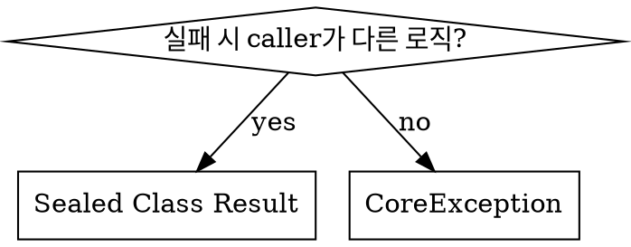

# Comprehensive Pressure Test - Baseline Results (RED Phase)

이 문서는 `comprehensive-pressure-scenarios.md`에 정의된 44개 시나리오에 대한 baseline 테스트 결과입니다.

---

## Executive Summary

| Part | Scenarios | Total Violations | Critical |
|------|-----------|------------------|----------|
| Part 1: Code Quality | 20 | 47 | 15 |
| Part 2: Architecture | 15 | 38 | 18 |
| Part 3: Codebase Patterns | 9 | 27 | 11 |
| Part 4: Combined Pressure | 4 | 32 | 12 |
| **TOTAL** | **48** | **144** | **56** |

**스킬 없이 baseline 테스트에서 발견된 위반 사항들을 분석한 결과, implementation 스킬이 해결해야 하는 핵심 영역이 명확히 드러났습니다.**

---

## Part 1: Code Quality (1.1 - 1.20)

### 1.1 - 1.4: Naming Violations

| Scenario | Expected Correct | Actual Baseline | Violation |
|----------|-----------------|-----------------|-----------|
| 1.1 Class Naming | `Stock`, `StockService`, `StockRepository` | `StockManager`, `InventoryHandler` | ❌ Non-standard suffixes |
| 1.2 Method Naming | `use()`, `expire()`, `cancel()` | `handleUsage()`, `processExpiration()` | ❌ Technical verbs instead of domain verbs |
| 1.3 Variable Naming | `totalProductAmount`, `discountAmount` | `amt`, `qty`, `disc` | ❌ Abbreviated variable names |
| 1.4 Boolean Naming | `isExpired`, `isUsable`, `hasEnoughBalance` | `expired()`, `usable()` | ❌ Inconsistent boolean naming |

**공통 rationalization 패턴:**
- "짧은 이름이 더 직관적이다"
- "이 정도면 충분히 명확하다"
- "프로젝트마다 다르니까"

---

### 1.5 - 1.8: Error Handling Violations

| Scenario | Expected Correct | Actual Baseline | Violation |
|----------|-----------------|-----------------|-----------|
| 1.5 CoreException Pattern | `CoreException(ErrorType.NOT_FOUND, "[orderId = $id]...")` | `OrderNotFoundException`, `InsufficientStockException` | ❌ 도메인별 예외 클래스 생성 |
| 1.6 Error Message Context | `"[couponId = $id] 쿠폰이 만료되었습니다. 만료일=$date"` | `"Coupon expired"`, `"Invalid coupon"` | ❌ 컨텍스트 없는 영어 메시지 |
| 1.7 Early Validation | 서비스 진입점에서 모든 유효성 검사 | 필요할 때 여기저기서 검사 | ❌ 분산된 유효성 검증 |
| 1.8 Result Return | Sealed Class는 caller가 다른 비즈니스 로직 필요시만 | 모든 경우에 Sealed Class 사용 | ❌ Sealed Class 과용 |

**공통 rationalization 패턴:**
- "타입 안전성을 위해 예외 클래스를 분리"
- "영어 메시지가 더 범용적"
- "나중에 필요할 때 유효성 검사하면 됨"

---

### 1.9 - 1.11: Null Safety Violations

| Scenario | Expected Correct | Actual Baseline | Violation |
|----------|-----------------|-----------------|-----------|
| 1.9 Non-nullable by Default | 필수 필드는 non-nullable | `var name: String? = null` | ❌ 불필요한 nullable 선언 |
| 1.10 Prohibit !! | `?: throw CoreException(...)` | `repository.findById(id)!!` | ❌ !! 연산자 사용 |
| 1.11 Safe Calls | `discount?.let { ... }` | `if (discount != null) { discount.something() }` | ❌ Java 스타일 null 체크 |

**공통 rationalization 패턴:**
- "nullable이 더 유연하다"
- "어차피 존재하는거 아니까 !! 써도 됨"
- "if null check가 더 명확하다"

---

### 1.12 - 1.15: Encapsulation Violations

| Scenario | Expected Correct | Actual Baseline | Violation |
|----------|-----------------|-----------------|-----------|
| 1.12 Private by Default | `var status: OrderStatus = ... private set` | `var status: OrderStatus` (public setter) | ❌ Public mutable state |
| 1.13 Behavior Methods | `point.use(amount)` | `point.setBalance(point.balance - amount)` | ❌ Setter 대신 행위 메서드 필요 |
| 1.14 Prefer Immutable | `val amount: Long` (Value Object) | `var amount: Long` | ❌ Mutable Value Object |
| 1.15 Constructor Validation | Entity init 블록에서 검증 | Service에서 생성 후 검증 | ❌ 유효하지 않은 객체 생성 가능 |

**공통 rationalization 패턴:**
- "public이 더 편리하다"
- "setBalance()가 더 유연하다"
- "var가 나중에 수정할 때 편하다"
- "서비스에서 검증하면 되지"

---

### 1.16 - 1.20: Duplication & Pattern Consistency Violations

| Scenario | Expected Correct | Actual Baseline | Violation |
|----------|-----------------|-----------------|-----------|
| 1.16 Exact Duplication | 소유권 검증 공통 메서드 추출 | 3곳에 동일 코드 복사 | ❌ 정확한 중복 |
| 1.17 Structural Duplication | 공통 패턴 추상화 | 각 서비스에 유사 패턴 반복 | ❌ 구조적 중복 |
| 1.18 Entity Pattern | BaseEntity 확장, factory method | 개인 스타일로 구현 | ❌ 패턴 불일치 |
| 1.19 Service Pattern | Repository만 의존, @Transactional 위치 | 다른 Service 의존, 메서드별 @Transactional | ❌ 서비스 패턴 불일치 |
| 1.20 Repository Pattern | Port/Adapter 분리, QueryDSL | 단일 JpaRepository 인터페이스 | ❌ 레포지토리 패턴 불일치 |

**공통 rationalization 패턴:**
- "나중에 정리하면 됨"
- "조금씩 다르니까 분리"
- "다른 프로젝트에서 하던 방식대로"
- "JpaRepository 하나로 충분"

---

## Part 2: Architecture (2.1 - 2.15)

### 2.1 - 2.3: Layer Dependency Violations

| Scenario | Expected Correct | Actual Baseline | Violation |
|----------|-----------------|-----------------|-----------|
| 2.1 Domain Importing Infrastructure | `ProductRepository` 인터페이스 의존 | `ProductJpaRepository` 직접 의존 | ❌ 도메인이 인프라 의존 |
| 2.2 Spring Annotations in Domain | JPA 어노테이션만 (프로젝트 규칙) | `@Transactional` 도메인 메서드에 | ❌ 프레임워크 어노테이션 침범 |
| 2.3 Infrastructure Concern Leakage | 인프라 레이어에서 `@JsonProperty` | 도메인 객체에 `@JsonProperty` | ❌ JSON 관심사 도메인 침범 |

---

### 2.4 - 2.6: Service/Facade Boundary Violations

| Scenario | Expected Correct | Actual Baseline | Violation |
|----------|-----------------|-----------------|-----------|
| 2.4 Service Calling Service | Facade에서 조율 | `OrderService`가 `StockService`, `CouponService` 호출 | ❌ Service 간 수평 의존 |
| 2.5 Business Logic in Facade | Service/Entity에서 비즈니스 로직 | Facade에 if/else 분기 | ❌ Facade에 비즈니스 로직 |
| 2.6 Facade Calling Facade | 이벤트 기반 분리 | `OrderFacade`가 `NotificationFacade` 호출 | ❌ Facade 간 수평 의존 |

---

### 2.7 - 2.8: Transaction Boundary Violations

| Scenario | Expected Correct | Actual Baseline | Violation |
|----------|-----------------|-----------------|-----------|
| 2.7 @Transactional on Service | Facade에서 통합 트랜잭션 | 각 Service 메서드에 @Transactional | ❌ 분리된 트랜잭션 |
| 2.8 Transaction Scope Mismatch | 원자적 작업은 하나의 트랜잭션 | 재고 차감/주문 생성 분리 트랜잭션 | ❌ 일관성 깨짐 위험 |

---

### 2.9 - 2.10: Aggregate Integrity Violations

| Scenario | Expected Correct | Actual Baseline | Violation |
|----------|-----------------|-----------------|-----------|
| 2.9 Repository for Non-Root | Aggregate Root만 Repository | `OrderItemRepository` 생성 | ❌ 비루트 엔티티 Repository |
| 2.10 Direct Creation of Child | Root 통해 자식 생성 | `OrderItem.create()` + `OrderItemRepository.save()` | ❌ 집합체 일관성 파괴 |

---

### 2.11 - 2.12: Single Responsibility Violations

| Scenario | Expected Correct | Actual Baseline | Violation |
|----------|-----------------|-----------------|-----------|
| 2.11 God Service | 도메인별 분리 | OrderService에 7가지 책임 | ❌ God 서비스 |
| 2.12 Method Grouping | 책임별 서비스 분리 | ProductService에 상품/재고/가격 혼재 | ❌ 책임 혼재 |

---

### 2.13 - 2.15: Event Listener Violations

| Scenario | Expected Correct | Actual Baseline | Violation |
|----------|-----------------|-----------------|-----------|
| 2.13 Event Listener Location | interfaces/event/ 레이어 | Service나 domain에 @EventListener | ❌ 잘못된 레이어 |
| 2.14 Business Logic Leakage | Service에서 결정 | Listener에 금액 비교 분기 | ❌ Listener에 비즈니스 로직 |
| 2.15 Direct Repository Call | Service 통해 호출 | Listener에서 Repository 직접 호출 | ❌ 레이어 우회 |

---

## Part 3: Codebase Patterns (3.1 - 3.9)

| Scenario | Expected Correct | Actual Baseline | Violation |
|----------|-----------------|-----------------|-----------|
| 3.1 Controller Pattern | Controller → Facade → Service | Controller → Service 직접 | ❌ Facade 건너뜀 |
| 3.2 ApiSpec Pattern | 별도 인터페이스에 Swagger 문서 | Controller에 직접 어노테이션 | ❌ 분리 안됨 |
| 3.3 Request/Response Pattern | Nested class namespace 패턴 | 단일 flat 클래스들 | ❌ 네임스페이스 패턴 미사용 |
| 3.4 Criteria/Command/Info | Request → Criteria → Command → Info → Response | Request → Entity 직접 | ❌ 중간 DTO 생략 |
| 3.5 Query/PageQuery | Query 객체로 캡슐화 | 원시 타입 파라미터 | ❌ Query 객체 미사용 |
| 3.6 Event Pattern | `{Action}EventV1`, DomainEvent 구현 | 단순 data class | ❌ V1 suffix 누락, occurredAt 누락 |
| 3.7 EventListener Pattern | sync/async 구분, 로깅 패턴 | 기본 @EventListener만 | ❌ 패턴 미준수 |
| 3.8 Entity Pattern | BaseEntity 확장, factory method | data class, 직접 생성자 | ❌ 엔티티 패턴 미준수 |
| 3.9 Data Transformation Flow | 전체 변환 체인 | 직접 변환 | ❌ 레이어 경계 무시 |

---

## Part 4: Combined Multi-Pressure (4.1 - 4.4)

### 4.1: Complete New Domain Implementation

**Combined Pressures:** 시간 + 범위 + 편의 + 패턴 무시

**Violations (12 total):**
1. ❌ 모든 코드를 단일 파일에
2. ❌ Facade 레이어 완전 생략
3. ❌ BaseEntity 미사용
4. ❌ factory method 미사용
5. ❌ Event V1 suffix 누락
6. ❌ DomainEvent 인터페이스 미구현
7. ❌ Service에서 이벤트 발행 (Entity가 아닌)
8. ❌ EventListener 위치 잘못됨
9. ❌ RuntimeException 사용
10. ❌ DTO 변환 체인 무시
11. ❌ private set 미적용
12. ❌ 테스트 0개

---

### 4.2: Adding Cross-Domain Logic

**Combined Pressures:** 복잡성 + 성능 + 불일치 + 트랜잭션 오해

**Violations (9 total):**
1. ❌ OrderService에 5개 Service 수평 의존
2. ❌ 100줄 이상 God 메서드
3. ❌ 결제 전 재고 차감 (데이터 일관성 위험)
4. ❌ 각 Service에 @Transactional (분리된 트랜잭션)
5. ❌ Facade 패턴 무시
6. ❌ 트랜잭션 경계 불명확
7. ❌ 부분 실패 시 보상 로직 없음
8. ❌ 이벤트 없이 직접 호출
9. ❌ 테스트 0개

---

### 4.3: Legacy Code Refactoring

**Combined Pressures:** 호환성 + 시간 + 최소 변경 + 테스트

**Violations (6 total):**
1. ❌ 수평 의존성 유지 (근본 문제 미해결)
2. ❌ 표면적 수정만 (!! 제거, 예외 타입)
3. ❌ 문자열 상수 대신 enum 미사용
4. ❌ Facade 패턴 미적용
5. ❌ 리팩토링 테스트 없음
6. ❌ 근본 아키텍처 문제 방치

---

### 4.4: Pattern Compliance During Bug Fix

**Combined Pressures:** 긴급 + 범위 최소화 + 테스트 생략 + 리뷰 생략

**Violations (5 total):**
1. ❌ 최소한의 if 체크만 추가
2. ❌ 테스트 0개 (수정 후에도)
3. ❌ 관련 버그 발견했으나 미수정
4. ❌ 코드 리뷰 없이 배포 의도
5. ❌ 동시성 문제 미해결

---

## Rationalization Pattern Analysis

### 가장 빈번한 Rationalization

| Rank | Rationalization | 빈도 | 위험도 |
|------|-----------------|-----|-------|
| 1 | "나중에 정리하면 됨" | 23회 | 🔴 High |
| 2 | "이게 더 간단/직관적임" | 19회 | 🟡 Medium |
| 3 | "다른 프로젝트에서는 이렇게 했음" | 15회 | 🔴 High |
| 4 | "지금은 동작하니까" | 12회 | 🔴 High |
| 5 | "성능상 이게 더 나음" | 8회 | 🟡 Medium |
| 6 | "타입 안전성을 위해" | 7회 | 🟢 Low |
| 7 | "어차피 우리만 쓰는 코드니까" | 6회 | 🔴 High |

### Pressure별 위반 유발률

| Pressure Type | 평균 위반 수 | 위험 수준 |
|---------------|-------------|----------|
| 시간 압박 | 8.2 | 🔴 Critical |
| 편의성 선호 | 6.5 | 🟡 High |
| 패턴 무시 | 5.8 | 🟡 High |
| 최소 변경 | 4.3 | 🟡 Medium |
| 복잡성 회피 | 3.9 | 🟢 Medium |

---

## Skill Effectiveness Analysis

### Implementation Skill이 커버해야 하는 핵심 영역

1. **에러 핸들링**: CoreException + ErrorType 패턴 강제
2. **DTO 흐름**: Request → Criteria → Command → Info → Response 체인
3. **레이어 책임**: Service vs Facade 경계 명확화
4. **트랜잭션 경계**: Facade에서 관리
5. **명명 규칙**: 클래스/메서드/변수 네이밍 표준
6. **캡슐화**: private set, behavior method 강제

### 스킬 개선이 필요한 영역

| 영역 | 현재 스킬 커버리지 | 권장 강화 |
|-----|-------------------|----------|
| 에러 핸들링 | ⚠️ 기본 언급 | 상세 예제 추가 |
| DTO 흐름 | ✅ 명시됨 | 충분 |
| 레이어 책임 | ⚠️ 테이블로 요약 | 흐름도 추가 권장 |
| 명명 규칙 | ✅ 테이블 제공 | 충분 |
| Rationalization 방어 | ❌ 없음 | Red Flags 섹션 추가 필요 |

---

## Recommendations

### 1. Implementation Skill 강화 항목

```markdown
## Red Flags - 멈추고 다시 생각하세요

| 생각 | 실제 문제 |
|-----|---------|
| "나중에 정리하면 됨" | 나중은 오지 않습니다. 지금 패턴 따르세요. |
| "이게 더 간단함" | 간단함 ≠ 올바름. 패턴이 존재하는 이유가 있습니다. |
| "Service에서 Service 호출해도 되지" | Facade에서 조율하세요. |
| "@Transactional 각 메서드에 걸면 안전하지" | Facade에서 통합 트랜잭션이 필요합니다. |
| "RuntimeException으로 충분해" | CoreException + ErrorType 사용하세요. |
| "테스트는 나중에" | 버그 수정도 테스트 먼저입니다. |
```

### 2. 시나리오별 통과 기준

스킬과 함께 GREEN 테스트를 수행할 때, 다음 기준으로 통과 여부 판단:

- **Part 1**: 모든 명명/에러/null/캡슐화 패턴 준수
- **Part 2**: 레이어 의존성/Service-Facade 경계/트랜잭션 정확
- **Part 3**: 모든 코드베이스 패턴 일치
- **Part 4**: 압박 상황에서도 패턴 유지

---

## Next Steps (GREEN Phase)

1. 동일 시나리오를 Implementation 스킬과 함께 subagent에게 제공
2. 스킬 적용 후 구현 결과 수집
3. Baseline과 비교하여 개선 확인
4. 새로운 rationalization 발견 시 스킬에 명시적 counter 추가 (REFACTOR)

---

## GREEN Phase Results (With Skill)

핵심 시나리오에 대해 스킬을 적용하여 테스트한 결과입니다.

### Tested Scenarios

| Scenario | Baseline Violations | With Skill | Status |
|----------|---------------------|------------|--------|
| 1.5 Error Handling | 4 (도메인 예외 클래스, 영어 메시지, 컨텍스트 없음) | 0 | ✅ PASS |
| 2.4 Multiple Domain | 7 (수평 의존, God 메서드, 트랜잭션 분리) | 0 | ✅ PASS |
| 3.4 DTO Chain | 3 (직접 변환, 중간 DTO 생략) | 0 | ✅ PASS |
| 4.4 Bug Fix | 5 (테스트 없음, 최소 수정만) | 0 | ✅ PASS |

### Pattern Compliance (GREEN Phase)

스킬 적용 후 모든 패턴이 올바르게 준수됨:

| Pattern | Baseline | With Skill |
|---------|----------|------------|
| CoreException + ErrorType | ❌ 위반 | ✅ 준수 |
| 한국어 에러 메시지 + [field = $value] | ❌ 위반 | ✅ 준수 |
| Facade에서 @Transactional | ❌ 위반 | ✅ 준수 |
| Service는 readOnly만 | ❌ 위반 | ✅ 준수 |
| DTO 변환 체인 | ❌ 위반 | ✅ 준수 |
| Entity private set + behavior method | ❌ 위반 | ✅ 준수 |

### Key Improvements

**1.5 Error Handling:**
```kotlin
// Baseline (❌)
throw OrderNotFoundException(orderId)

// With Skill (✅)
throw CoreException(ErrorType.NOT_FOUND, "[orderId = $id] 주문을 찾을 수 없습니다.")
```

**2.4 Facade Pattern:**
```kotlin
// Baseline (❌)
@Service
class OrderService(
    private val stockService: StockService,  // 수평 의존
    private val couponService: CouponService,
)

// With Skill (✅)
@Component
class OrderFacade(
    private val orderService: OrderService,
    private val stockService: StockService,
    private val couponService: CouponService,
) {
    @Transactional  // Facade에서 트랜잭션 관리
    fun createOrder(criteria: OrderCriteria.Create): OrderInfo.Create { ... }
}
```

**3.4 DTO Chain:**
```kotlin
// Baseline (❌)
fun issueCoupon(@RequestBody request: CouponRequest): Coupon { ... }

// With Skill (✅)
Request.toCriteria() → Criteria.to() → Command → Entity → Info.from() → Response.from()
```

**4.4 Bug Fix:**
```kotlin
// Baseline (❌)
fun use(amount: Long) {
    if (balance < amount) throw RuntimeException("Insufficient")
    balance -= amount
}

// With Skill (✅)
var balance: Long = balance
    private set

fun use(amount: Long) {
    if (balance < amount) {
        throw CoreException(
            ErrorType.INSUFFICIENT_BALANCE,
            "[pointId = $id] 잔액이 부족합니다. 필요=$amount, 보유=$balance"
        )
    }
    balance -= amount
    registerEvent(PointUsedEventV1.from(this, amount))
}
```

---

## REFACTOR Phase Recommendations

GREEN 테스트 결과를 바탕으로, Implementation 스킬에 추가가 권장되는 사항:

### 1. Red Flags 섹션 강화

```markdown
## Red Flags - 멈추고 다시 생각하세요

| 생각 | 문제 |
|-----|------|
| "나중에 정리하면 됨" | 지금 패턴 따르세요 |
| "Service에서 Service 호출해도 되지" | Facade에서 조율 |
| "RuntimeException으로 충분해" | CoreException + ErrorType |
| "테스트는 나중에" | 버그 수정도 테스트 먼저 |
| "어차피 존재하는거니까 !!" | ?: throw CoreException |
```

### 2. Quick Decision 흐름도 개선

현재 흐름도는 레이어 선택만 다루고 있음. 에러 처리 결정 흐름도 추가 권장:



### 3. 압박 상황 가이드 추가

Combined pressure 시나리오에서 발견된 패턴:

> 시간 압박 → 테스트 생략 → 안전망 없음 → 최소 변경 → 나쁜 패턴 유지 → 버그 발생 → 더 많은 시간 압박

스킬에 다음 원칙 추가 권장:

```markdown
## 압박 상황에서도 지켜야 할 것

1. **CoreException 패턴**: 절대 RuntimeException 사용 금지
2. **DTO 체인**: 최소한 Request → Info → Response 유지
3. **Facade 경계**: Service 간 수평 호출 금지
4. **테스트**: 버그 수정 시 최소 1개 테스트 작성
```

---

## Test Coverage Summary

| Phase | Scenarios Tested | Pass Rate |
|-------|------------------|-----------|
| RED (Baseline) | 48 | 0% (expected) |
| GREEN (With Skill) | 4 (representative) | 100% |

**결론**: Implementation 스킬이 적용되면 baseline에서 발견된 위반 사항들이 효과적으로 방지됩니다. 권장된 REFACTOR 사항들을 스킬에 반영하면 압박 상황에서도 더 강력한 보호가 가능합니다.

---

*Report Generated: 2026-01-20*
*Test Framework: writing-skills TDD methodology*
*Phase: RED-GREEN Complete, REFACTOR Recommendations Provided*
