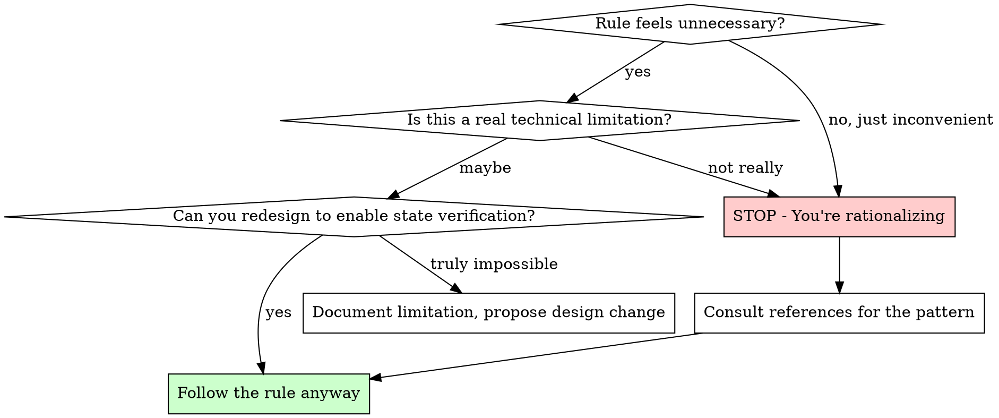

# Testing Skill

Test writing standards and quality guidelines following Classical TDD (state verification only).

## Quick Reference

| Test Level  | File Pattern          | When to Use                                 | External Deps            |
|-------------|-----------------------|---------------------------------------------|--------------------------|
| Unit        | `*Test.kt`            | Domain logic, value objects, pure functions | None                     |
| Integration | `*IntegrationTest.kt` | Service + Repository, transactions          | Real DB                  |
| Concurrency | `*ConcurrencyTest.kt` | Locking, race conditions                    | Real DB                  |
| Adapter     | `*AdapterTest.kt`     | External API clients, queries               | WireMock, Testcontainers |
| E2E         | `*E2ETest.kt`         | Full API flow, auth                         | Full stack               |
| Batch       | `*BatchTest.kt`       | Spring Batch jobs                           | Real DB                  |

## Core Philosophy

Tests serve three purposes: verify correctness, document behavior, and enable safe refactoring.

- **Tests as Executable Documentation**: Tests are the most accurate documentation because they're always up-to-date.
- **Tests Enable Fearless Refactoring**: With good tests, you can safely change implementation. But this only works if
  tests verify behavior, not implementation.
- **Tests Reveal Design Problems**: If a test is hard to write, that's feedback about your design.

---

## The Iron Law

```
VERIFY STATE, NEVER INTERACTIONS.
NO EXCEPTIONS. NO NEGOTIATIONS.
```

This applies to ALL tests:

- Not "except for simple utilities"
- Not "except when state verification is hard"
- Not "except when the team already uses verify()"
- Not "just this once"

**Violating the letter of this rule IS violating the spirit.**

---

## 🚨 Red Flags - STOP If You Think These

These thoughts mean you're rationalizing. STOP and reconsider:

| Thought                                  | Reality                                                              |
|------------------------------------------|----------------------------------------------------------------------|
| "This is too simple for BDD structure"   | Simple code deserves consistent structure. Lower cost = less excuse. |
| "verify() is fine for external services" | Use WireMock/Adapter test. If impossible, it's design feedback.      |
| "The team already uses this pattern"     | Check the actual codebase. Existing tests follow Classical TDD.      |
| "State verification is impossible here"  | Redesign to return verifiable result. "Hard to test" = "bad design". |
| "I'll refactor to proper pattern later"  | Later never comes. Do it right now.                                  |
| "This is just a utility class"           | Utilities need BDD too. Consistency > convenience.                   |
| "It's overkill for this case"            | Rules exist precisely for these "exception" moments.                 |
| "Factory method is boilerplate"          | 5 minutes now saves hours of confusion later.                        |
| "Time pressure - need to ship fast"      | Fast + wrong = slower than slow + right.                             |
| "Service has domain logic, needs Unit Test" | Domain logic belongs in Domain model. Service only orchestrates.  |
| "Mock Unit Test is faster than Integration" | Speed is not the goal. Correct test level is.                      |
| "verify() is just extra insurance"       | Any verify() use is forbidden. No "insurance" exceptions.            |
| "Following the spirit, not the letter"   | Violating the letter IS violating the spirit. No exceptions.         |

**All of these mean: Follow the rules anyway.**

---

## Rationalization Table

Common excuses and why they're wrong:

| Excuse                                       | Why It's Wrong                               | What To Do Instead               |
|----------------------------------------------|----------------------------------------------|----------------------------------|
| "verify() is the only way to test this"      | WireMock, Testcontainers exist. Or redesign. | Use Adapter test pattern         |
| "BDD structure is overhead for simple tests" | Consistency trumps perceived efficiency      | Apply same structure everywhere  |
| "Factory methods are boilerplate"            | They're investment, not cost                 | Create factory with all defaults |
| "DRY - share setup between tests"            | Test isolation > code reuse                  | Fresh fixtures per test          |
| "The user insisted on verify()"              | Project rules > user preference              | Educate on Classical TDD         |
| "Other projects use Mockito verify()"        | This project's rules apply here              | Follow this project's standards  |
| "I'll fix the structure later"               | Technical debt compounds                     | Do it correctly now              |
| "It's urgent, no time for proper tests"      | Bad tests are worse than no tests            | Take time to do it right         |
| "State verified, verify() is extra safety"   | ANY verify() usage is forbidden. No hybrids. | Remove verify(), state only      |
| "Service does X, so Unit Test for X"         | If X is domain logic, test Domain model      | Unit Test Domain, Integration Service |
| "Mock is faster than real DB"                | Speed < correctness. Mocks hide real bugs.   | Use real DB via Integration Test |

---

## Decision Flow: When Rules Feel Burdensome



---

## CRITICAL: State/Result Verification ONLY (Classical TDD)

This project follows **Classical TDD (Detroit School)**. All tests MUST verify **outcomes**, NOT **interactions**.

> **Verify WHAT happened, not HOW it happened.**

### ✅ ALLOWED

```kotlin
assertThat(result).isEqualTo(expected)
assertThat(point.balance).isEqualTo(700L)
assertThatThrownBy { point.use(500L) }.isInstanceOf(CoreException::class.java)
```

### ❌ FORBIDDEN

```kotlin
verify(repository).save(any())
verify(mock, times(1)).method()
verifyNoInteractions(mock)

// ❌ ALSO FORBIDDEN: "Hybrid approach" - state + verify()
assertThat(order.status).isEqualTo(OrderStatus.PLACED)  // state verification ✅
verify(paymentClient).requestPayment(any())              // then verify ❌ STILL FORBIDDEN!
```

**No "extra insurance" verify()**: If you did state verification, you're done. Adding verify() for "safety" is still forbidden.

## Test Level Overview

For level classification criteria, decision flow, and file naming conventions, see `references/test-level-guide.md`

## BDD Structure

### Nested Classes

Use `@Nested` per behavior (method/endpoint). No more than 1 level of nesting.

```kotlin
@Nested
@DisplayName("use")
inner class Use {
    // All cases for use()
}
```

### Naming Convention

- `@DisplayName`: Korean description
- Method name: English with backticks, `[result] when [condition]`

### Given/When/Then

Every test must have comments specifying concrete values and expected results.

```kotlin
@Test
@DisplayName("주문 금액이 올바르게 계산된다")
fun `calculates total correctly`() {
    // given
    val initialBalance = 1000L
    val point = createPoint(balance = initialBalance)

    // when
    val deductAmount = 300L
    point.deduct(deductAmount)

    // then
    assertThat(point.balance).isEqualTo(initialBalance - deductAmount)
}
```

## Factory Method Pattern

Every test class must have private factory methods with **all parameters defaulted**.

```kotlin
// Unit Test: domain object creation
private fun createPoint(
    id: Long = 0L,
    userId: Long = 1L,
    balance: Long = 1000L,
    status: PointStatus = PointStatus.ACTIVE,
): Point = Point.of(id, userId, balance, status)

// Integration Test: includes DB persistence
private fun createProduct(
    price: Money = Money.krw(10000),
    stockQuantity: Int = 100,
): Product {
    val brand = brandRepository.save(Brand.create("Test Brand"))
    val product = productRepository.save(Product.create(name = "Test Product", price = price, brand = brand))
    stockRepository.save(Stock.create(product.id, stockQuantity))
    return product
}
```

## Essential Rules

### Expose Only What Matters

```kotlin
// ❌ Bad: What is this test about?
val point = Point.of(id = 1L, userId = 42L, balance = 1000L, status = PointStatus.ACTIVE)

// ✅ Good: Clearly about balance deduction
val point = createPoint(balance = 1000L)
```

### Single Logical Assertion

Each test verifies one behavior. Multiple `assertThat` is fine if they verify aspects of the same result.

### Meaningful Variable Names

```kotlin
// ❌ Bad
assertThat(result).isEqualTo(700)

// ✅ Good
val initialBalance = 1000L
val deductAmount = 300L
assertThat(point.balance).isEqualTo(initialBalance - deductAmount)
```

### Test Isolation

- No shared mutable state
- Database cleanup in `@AfterEach`
- No test interdependence

## When to Skip Test Generation

### Pure data objects with no behavior

- **Command** - use case input (e.g., `CreateOrderCommand`)
- **Event** - immutable fact record (e.g., `OrderCreatedEvent`)
- **DTO / Request / Response** - data transfer only

### Infrastructure triggers with no business logic

- **Scheduler** - `@Scheduled` methods that only invoke service methods
    - Scheduler's responsibility is only "when to call", not "what to do"
    - Test the invoked service method instead (Integration Test)
    - Cron expression correctness is Spring Framework's responsibility

---

## References

Load references based on the current task. Each file provides detailed patterns and real code examples.

### When determining test level

- `references/test-level-guide.md` - Level classification criteria and decision flow

### When generating test skeletons

- `references/test-generation.md` - Spec to test skeleton process, quality checklist

### When writing tests by level

- `references/unit-test.md` - Unit test patterns (state change, validation, ParameterizedTest, domain events)
- `references/integration-test.md` - Integration patterns (rollback, Spring Event, Kafka Consumer)
- `references/concurrency-test.md` - Concurrency patterns (thread pool, locking, idempotency)
- `references/adapter-test.md` - Adapter patterns (WireMock, Circuit Breaker, Retry, complex queries)
- `references/e2e-test.md` - E2E patterns (HTTP status codes, auth failures, API contract)
- `references/batch-test.md` - Spring Batch patterns (Processor unit test, Step/Job integration test)

### When deciding external dependencies strategy

- `references/external-dependencies.md` - External dependencies by test level (Real DB, WireMock, Testcontainers)

---

## Common Mistakes

| Mistake                            | Why It's Wrong                      | Fix                                                  |
|------------------------------------|-------------------------------------|------------------------------------------------------|
| `verify(mock).save(any())`         | Interaction verification, not state | Assert on returned/persisted state                   |
| Shared mutable state between tests | Test pollution, flaky results       | Create fresh fixtures per test                       |
| Testing implementation details     | Breaks on refactor                  | Test observable behavior only                        |
| Magic numbers in assertions        | Unclear what's being tested         | Use named variables: `initialBalance - deductAmount` |
| Multiple behaviors per test        | Hard to diagnose failures           | One logical assertion per test                       |
| Missing `@AfterEach` cleanup       | DB pollution across tests           | Clean up created entities                            |
| Unit Test for pure delegation      | Mock returns mock - no real testing | Skip Unit, write Integration Test instead            |
| State + verify() hybrid            | Any verify() is forbidden           | Remove verify(), keep state verification only        |
