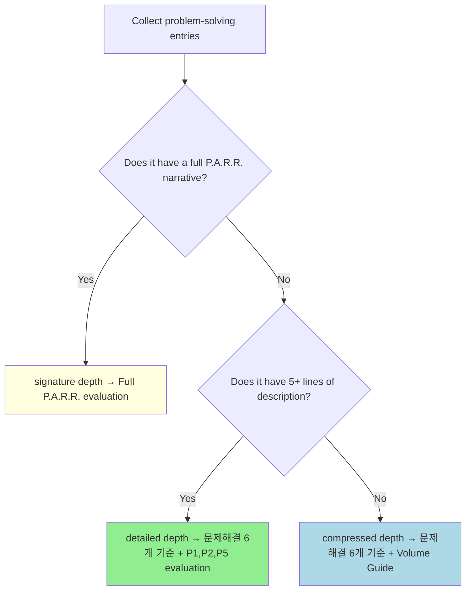

# Problem-Solving Evaluation Reference

## Table of Contents

 1. [Depth Determination](#1-depth-determination)
 2. [Career-Level Depth Distribution Guide](#2-career-level-depth-distribution-guide)
 3. [Career-Level Selection Criteria (Signature Depth)](#3-career-level-selection-criteria-signature-depth)
 4. [P.A.R.R. Evaluation Dimensions P1-P5 (Signature Depth)](#4-parr-evaluation-dimensions-p1-p5-signature-depth)
 5. [P.A.R.R. Additional Dimensions P6-P8 (Signature Depth Only)](#5-parr-additional-dimensions-p6-p8-signature-depth-only)
 6. [Career-Level Misapplication Guard](#6-career-level-misapplication-guard)
 7. [P.A.R.R. Evaluation Output Format](#7-parr-evaluation-output-format)
 8. [Before/After Detection — New Grad / Junior](#8-beforeafter-detection--new-grad--junior)
 9. [Before/After Detection — Mid / Senior](#9-beforeafter-detection--mid--senior)
10. [Improvement Analysis](#10-improvement-analysis)
11. [Specific Feedback Principles](#11-specific-feedback-principles)
12. [AI-Style Overpackaging Detection](#12-ai-style-overpackaging-detection)
13. [Visual Material Guidelines](#13-visual-material-guidelines)
14. [Writing Guidance: Signature Depth P.A.R.R.](#14-writing-guidance-signature-depth-parr)
15. [Writing Guidance Trigger: Signature/Detailed Depth](#15-writing-guidance-trigger-signaturedetailed-depth)
16. [Red Flags: Signature/Detailed Depth](#16-red-flags-signaturedetailed-depth)
17. [Compressed Depth Evaluation](#17-compressed-depth-evaluation)
18. [Before/After Detection (Compressed Depth)](#18-beforeafter-detection-compressed-depth)
19. [Writing Guidance: Compressed Depth](#19-writing-guidance-compressed-depth)
20. [Writing Guidance Trigger: Compressed Depth](#20-writing-guidance-trigger-compressed-depth)
21. [Red Flags: Compressed Depth](#21-red-flags-compressed-depth)

---

## Mandatory Evaluation Checklist

아래 항목은 문제해결 섹션 평가 시 반드시 체크하고, 결과를 Phase 11 출력에 포함해야 한다.

### 구조 체크
- [ ] [문제] verbose 판정 — 아래 시그널 중 2개 이상 해당하면 [개요]+[문제] 분리 권장:
  - 비즈니스 맥락 + 기술 이슈가 [문제] 안에 혼재
  - [문제]만 단독으로 5줄 이상
  - "이게 왜 문제인지"에 도달하기까지 배경 설명이 3줄 이상
  - 시그널 해당 없으면 분리 불필요로 판정하고 넘어감
- [ ] 회고가 있으면 → 감상적 성장 서사 FLAG, 아키텍처 한계 + 확장 방향(2-3줄)은 OK. 회고 자체는 OPTIONAL

### 포트폴리오 다양성
- [ ] 전체 문제해결 엔트리의 테마 분류 수행 (정합성, 성능, 안정성, 비즈니스, 데이터 파이프라인 등)
- [ ] 2개 이상 동일 테마면 FLAG — 테마 겹침 경고 + 교체 권장

### Depth별 필수 확인
- [ ] Signature depth: P.A.R.R. P1-P5 전체 적용, 실패 arc 존재 여부, 멈추는 판단 확인
- [ ] Detailed depth: 최소 1개 실패 시도, why-chain 확인
- [ ] Compressed depth: 3-5줄 이내, 문제→해결→결과 흐름 확인

---

## Overview

The resume's "signature project", "problem-solving", and "other projects" are not separate categories. They are all **detailed descriptions showing how this person solves problems**, differentiated only by **depth**.

---

## 1. Depth Determination

Classify every problem-solving entry by depth first, then apply the evaluation criteria for each depth level.



**Common base**: 문제해결 6개 기준(탐색적 인과·근거 깊이·사고 귀속·대안 비교·면접 심층성·섹션 적합성)은 모든 depth에 적용. **Depth-specific additions**: signature adds P1-P8, detailed adds P1+P2+P5, compressed adds volume guide.

---

## 2. Career-Level Depth Distribution Guide

The recommended depth distribution varies by years of experience. Junior candidates need to prove more detail; senior candidates should be concise.

| Career Level | signature | detailed | compressed | Total problem-solving entries |
| --- | --- | --- | --- | --- |
| New Grad / Junior (0-3 yrs) | 1 | 2 per position | 0-2 | 5-8 |
| Mid (3-7 yrs) | 1 | 1-2 | 3-5 | 5-8 |
| Senior (7+ yrs) | 1 | 0-1 | 3-5 | 4-7 |

**Note candidate pool**: If candidates exist at `$OMT_DIR/review-resume/problem-solving/`, you may suggest the most JD-relevant combination from the full candidate pool — not just the entries currently in the resume.

### Portfolio Theme Diversity

문제해결 포트폴리오 전체를 평가할 때, **기술 테마 다양성**을 확인. 2개 이상의 엔트리가 동일 테마를 공유하면 플래그.

| Technical Theme | Example Topics |
|----------------|---------------|
| 정합성 (Consistency) | race condition, distributed lock, transaction sync |
| 성능 (Performance) | caching, query optimization, response time |
| 안정성 (Resilience) | circuit breaker, retry, fallback, fault isolation |
| 비즈니스 메트릭 (Business) | cost reduction, headcount, conversion rate |
| 데이터 파이프라인 | ETL, streaming, batch processing |

**왜 중요한가**: 같은 테마의 프로젝트가 여러 개면 "이 사람은 이것밖에 못하나?" 인상을 줌. 각 signature/detailed 엔트리가 서로 다른 테마를 커버하도록 조합을 추천.

---

## 3. Career-Level Selection Criteria (Signature Depth)

The framing of a signature depth entry must match the candidate's career level. The P.A.R.R. structure is the same, but what needs to be proven differs.

| Career Level | Years | What to Prove | Signature Depth Focus | Key Evidence |
| --- | --- | --- | --- | --- |
| New Grad (신입) | 0 (bootcamp/university) | CS depth, learning velocity | Deep CS problem (e.g., concurrency, distributed systems) | 3+ failed attempts with specific learning from each |
| Junior (주니어) | 0-3 | Problem-solving depth + technical foundations | CS depth OR early production problem-solving | Clear problem→approach→result→reflection arc |
| Mid (미들) | 3-7 | Engineering judgment, trade-off awareness | Experiment-based decisions, domain-specific failures | Trade-off analysis with data-driven reasoning |
| Senior (시니어) | 7+ | Business impact, leadership, system thinking | Business metric impact, stopping judgment, team leverage | Business outcome metrics, team/org influence |

Selection criteria (applicable across all career levels):

1. Was this technically the hardest problem you faced?
2. Are there 2-3 failed attempts with specific numbers?
3. Did you repeatedly ask yourself "Why?" at each step?
4. Is there data-validated evidence of the result?
5. Can you explain "Why did I try this?" and "Why didn't it work?" for each attempt?

For Mid/Senior: the four signature strengths are:

1. **No single right answer** — problems where the answer requires judgment, not just CS knowledge
2. **Experiment-based decisions** — model comparisons, A/B tests, metric-driven choices
3. **Stopping judgment** — "93% was achievable, but we stopped at 85% for cost reasons"
4. **Business impact** — headcount reduction, cost savings, throughput improvement measured in business terms

---

## 4. P.A.R.R. Evaluation Dimensions P1-P5 (Signature Depth)

Apply to signature depth entries. After 문제해결 6개 기준 평가 후, apply the full P1-P5 as additional evaluation. For detailed depth entries, apply only P1, P2, P5.

| \# | Dimension | Question | Fail Signal |
| --- | --- | --- | --- |
| P1 | Narrative depth | Is this a story of thought process, not a technology list? | "Redis 분산 락을 사용했습니다", "GPT-4를 사용했습니다" — results only, no reasoning |
| P2 | Failure arc | Are there 2-3 attempts with specific failure numbers? | No failure process, or jumps directly to final solution without showing failed attempts |
| P3 | Verification depth | Is the verification appropriate for the domain? | New Grad/Junior: "부하 테스트 수행"만. Mid/Senior: "정확도 85%"만 있고 에러 분석 없음 |
| P4 | Reflection quality | Are trade-offs + acknowledged limits + honest confession present? | "분산 시스템을 배웠다", "LLM은 만능이 아니다" — abstract takeaway with no specifics |
| P5 | "Why?" chain | Does every attempt include both "Why did I try this?" AND "Why didn't it work?" | Either the selection reason OR the failure reason is missing from any attempt |

**Feature Listing Anti-Pattern**: If the project entry consists only of verb + feature/technology name, flag immediately as P1 FAIL:

- Specific patterns to detect: `[feature name] 개발` (e.g., "페이징 기능 개발", "장바구니 기능 개발")
- `[tech name] 구현` (e.g., "OAuth 소셜 로그인 구현", "Redis 캐시 구현")
- `[tech name] 적용` (e.g., "Kafka 적용", "ElasticSearch 적용")
- `[tech name] 연동` (e.g., "결제 API 연동", "외부 API 연동")
- Pattern: \[feature/tech name\] + verb only, no problem context, no outcome → flag as "Feature Listing Anti-Pattern"

---

## 5. P.A.R.R. Additional Dimensions P6-P8 (Signature Depth Only)

Apply P6-P8 additionally to signature depth entries from Mid/Senior candidates (3+ years of professional experience).

| \# | Dimension | Question | Fail Signal |
| --- | --- | --- | --- |
| P6 | Domain-specific failure reasoning | Does each attempt's failure explain WHY this approach doesn't work in THIS domain (not just CS principles)? | Explains failure using only CS principles (MVCC, CAP) without domain context, or lists numbers without causal reasoning |
| P7 | Stopping judgment | Is there an explicit, intentional decision to stop at a certain point for cost/time/risk reasons? | The final number (85%, 93%) is stated without explaining the judgment behind stopping there |
| P8 | Business impact | Are business outcomes (headcount reduction, cost savings, revenue impact) stated in concrete terms? | Abstract language: "성능 개선", "효율화". No monetary amount, ratio, or count |

---

## 6. Career-Level Misapplication Guard

**IMPORTANT: Do not evaluate Mid/Senior signature projects using New Grad/Junior criteria.**

| New Grad/Junior Criterion (misapplied to Mid/Senior) | Mid/Senior Criterion (correct) |
| --- | --- |
| "CS 깊이 부족" (MVCC, CAP 언급 없음) | "Does engineering judgment come through?" |
| "Race Condition 의도적 재현이 없다" | "Is the verification appropriate for the domain (error analysis, sample testing)?" |
| "왜 Vision+Text 분리인가?"에 CS 메커니즘 기대 | "Why this structure?" — experimental results and domain reasons are sufficient |
| "시도 1 실패는 예측 가능했다" | "Even a predictable failure is valuable when confirmed experimentally" |
| Treating "stopping judgment" as a weakness | "Stopping judgment" is a core strength of production-level engineering |

**IMPORTANT: Do not evaluate New Grad/Junior signature projects using Mid/Senior criteria.**

| Mid/Senior Criterion (misapplied to New Grad/Junior) | New Grad/Junior Criterion (correct) |
| --- | --- |
| "Where are the 3 failed attempts?" → wrong framing | "Does the CS depth come through in the failure arc?" |
| "Where's the trade-off analysis?" | "Is the trade-off explained through CS principles like MVCC, CAP?" |
| "Where's the business impact?" | New Grad/Junior proves CS depth and learning velocity — business impact is not the goal |
| "멈추는 판단이 없다" | Stopping judgment is a Mid/Senior concept — not expected from New Grad/Junior |

---

## 7. P.A.R.R. Evaluation Output Format

**Signature depth** entries:

```
[Problem-Solving: {entry name} — signature depth]
- 문제해결 6개 기준: (output separately, refer to Section-Specific Evaluation)
- P1 Narrative depth: PASS / FAIL (reason)
- P2 Failure arc: PASS / FAIL (reason)
- P3 Verification depth: PASS / FAIL (reason)
- P4 Reflection quality: PASS / FAIL (reason)
- P5 "Why?" chain: PASS / FAIL (reason)
```

For Mid/Senior, append:

```
- P6 Domain-specific failure reasoning: PASS / FAIL (reason)
- P7 Stopping judgment: PASS / FAIL (reason)
- P8 Business impact: PASS / FAIL (reason)
```

**Detailed depth** entries:

```
[Problem-Solving: {entry name} — detailed depth]
- 문제해결 6개 기준: (output separately)
- P1 Narrative depth: PASS / FAIL (reason)
- P2 Failure arc: PASS / FAIL (reason)
- P5 "Why?" chain: PASS / FAIL (reason)
```

**Compressed depth** entries: Apply 문제해결 6개 기준 + Volume Guide only (P.A.R.R. not applied).

---

## 8. Before/After Detection — New Grad / Junior

**Before — Feature Listing Anti-Pattern (flag immediately):**

```
온라인 서점 쇼핑몰
• 선착순 쿠폰 발급 기능 개발
• Redis 분산 락 사용하여 동시성 문제 해결
Spring Boot, MySQL, Redis 사용
• JMeter로 부하 테스트 수행
• 성능 개선 완료
```

Before problems:

- "Redis 사용", "동시성 해결" = results only, no reasoning
- No explanation of why Redis, whether alternatives were considered
- Thought process: zero. Engineering depth: zero.
- Hiring manager reaction: "그래서 뭘 배웠는데?" (Skip)

**After — New Grad / Junior Gold Standard (CS depth + thought process):**

```
온라인 서점 - 선착순 쿠폰 시스템

[문제]
파이널 프로젝트 QA 중 치명적 버그 발견: 재고 100개 쿠폰이 152개 발급. 하지만 로컬 환경에서는 재현 안 됨.
Thread.sleep(100)을 강제 삽입해 동시성 상황 재현. 문제의 본질 파악: MySQL READ COMMITTED 격리 수준에서 두
트랜잭션이 동시 재고 조회 → MVCC 특성상 필연적 문제.

[해결 과정]
시도 1 - 락 없이 해결 가능한가?
낙관적 락 + CAS: 동시 1000건 중 950건 실패, 재시도 폭증. Exponential Backoff 최적화해도 평균 응답 1.2초.
DB 격리 수준 상향(SERIALIZABLE): Gap Lock 발생, 처리량 60% 감소. 거부.

시도 2 - 어떤 락인가?
비관적 락(SELECT FOR UPDATE): Lock Escalation으로 Table Lock 전이, 커넥션 풀 고갈, 응답 800ms.
Application Lock(synchronized): 단일 서버 작동, 하지만 Scale-out 불가. 서버 2대 실험 → 즉시 재현.
깨달음: 분산 환경 작동 락 필요.

시도 3 - 왜 Redis 분산 락인가?
Redis 선택 이유: Lua 스크립트 원자성, TTL 자동 해제, Single Thread로 Race Condition 차단.
Redisson vs 직접 구현: Spin Lock 비효율 vs Pub/Sub 기반 Wait/Notify. Redisson 선택.
Lock 설정 근거: Wait 3초(선착순 특성), Lease 5초(로직 최대 실행 시간+여유).

[검증]
JMeter 동시 100 Thread, Ramp-up 0초. 재고 100개 → 발급 100건, 중복 0건.
Lock Contention 측정: Redis MONITOR로 패턴 분석, 평균 대기 180ms, 최대 2.8초.
극한 시나리오: 재고 10개, 동시 500건 → 10건만 성공, 정합성 100%.

[회고]
배운 것: MVCC와 격리 수준 트레이드오프, 분산 시스템 일관성(CAP 정리), Redlock 알고리즘과 한계(Martin
Kleppmann 논문).
인정하는 한계: Redis SPOF, 멱등성 미보장. 해결 방향: Cluster/Sentinel, 발급 이력 테이블.
솔직한 고백: 처음엔 "Redis 쓰면 되겠지"였습니다. 멘토님 "락 없이 못 푸나?" 질문에 3일 밤새며 CAS, 격리 수준,
MVCC 공부. 비로소 이해: 문제는 답 찾기가 아니라 왜 그것이 답인지 설명하는 것.

→ 파이널 프로젝트 최우수상 (12팀 중 1위)
```

---

## 9. Before/After Detection — Mid / Senior

**Before — Result Listing Anti-Pattern (flag immediately):**

```
메뉴 메타데이터 자동 추출
• LLM 기반 시스템 개발
• 5개 모델 비교하여 최적 조합 선택
• 정확도 85% 달성
• 인력 11명에서 3명으로 절감
```

Before problems:

- "5개 모델 비교" = no explanation of why, no criteria
- No explanation of why this approach, why previous attempts failed
- No reasoning behind stopping at 85%
- Hiring manager reaction: "그래서 어떤 판단을 내린 건데?" (Skip)

**After — Mid / Senior Gold Standard (engineering judgment + business impact):**

```
메뉴 사진 메타데이터 자동 추출 시스템

[문제]
F&B 커머스 플랫폼에서 입점 업체 메뉴 등록 시 영양정보, 알레르기, 카테고리 등 15개 필드를 수작업 입력.
담당 인력 11명, 신메뉴 반영까지 4주. 성수기 메뉴 교체율 40% 상승 시 병목 심화. 월 인건비 약 2,200만원.

[해결 과정]
시도 1 - 왜 규칙 기반부터? 가장 예측 가능하고 비용이 낮아서.
정규식 + 사전 매핑. 결과: 정확도 40%. 왜 안 되는가: "크림파스타", "까르보나라", "셰프 스페셜 A" — 같은 음식도
이름이 다르고, 임의 이름이면 규칙 무력화. 교훈: 자연어 이해가 필요한 문제를 패턴 매칭으로 풀 수 없다.

시도 2 - 왜 단일 LLM? 자연어 이해력이 있으니까.
GPT-4V에 메뉴 사진 직접 입력, 15개 필드 한 번에 추출. 결과: 정확도 65%, 할루시네이션 30%.
왜 안 되는가: 사진에 없는 알레르기 정보를 "추론"해서 생성. 15개 필드를 한 번에 요구하니 "아는 척" 빈도 증가.
교훈: 관찰(사진에서 보이는 것)과 추론(도메인 지식 기반 매핑)을 분리해야 한다.

시도 3 - 왜 2단계 파이프라인?
Stage 1 (Vision): 보이는 것만 서술. Stage 2 (Text): 서술문을 메타데이터로 매핑.
왜 이 구조인가: 각 단계가 하나의 역할만 수행하므로 할루시네이션 원인 추적 가능.
5개 모델 조합 비교 — 정확도, 비용, 속도 매트릭스. 87% 조합 대비 정확도 2%↓ 비용 33%↓인 조합 선택.

[검증]
500건 랜덤 샘플: 정확도 85%, 할루시네이션 2% (단일 LLM 대비 28%p 감소).
에러 분석: Stage 1 오류 45건(사진 품질), Stage 2 오류 29건(매핑 모호성). 각 단계별 개선 방향 명확.
비용: 건당 ₩30 (수작업 건당 ₩3,000 대비 1/100).

[회고]
멈춘 이유: fine-tuning으로 93%까지 실험 확인. 그러나 월 200만원 추가 + 모델 업데이트마다 재학습.
85%+수작업 검수가 TCO 최적이라는 판단.
인정하는 한계: 사진 품질 의존성(어두운 사진 정확도 60%), 신메뉴 카테고리 미학습.
비즈니스 결과: 인력 11→3명(월 약 1,600만원 절감), 재고 파악 4주→1주.
```

---

## 10. Improvement Analysis

### New Grad / Junior

Why the After is better — use as review reference criteria:

- **Problem root cause**: "MVCC 특성상 필연적" — Before states only "동시성 문제" without explaining why
- **Depth of attempts**: 3-stage approach (락 없이 → 어떤 락 → 왜 Redis) — Before jumps directly to "Redis 사용"
- **Failure data per attempt**: "950건 실패", "처리량 60% 감소" — Before has zero failure process
- **Repeated Why questions**: "왜 락인가?", "왜 Redis인가?", "왜 Redisson인가?" — Before has zero Why
- **CS knowledge applied**: MVCC, CAP theorem, Redlock — Before lists only technology names
- **Verification depth**: Lock Contention analysis, not just a load test — Before has only "부하 테스트 수행"
- **Acknowledged limits**: SPOF, idempotency — Before ends with "성능 개선 완료"

### Mid / Senior

Why the After is better — use as review reference criteria:

- **Domain-specific failure reasoning**: "메뉴명 다양성으로 규칙 무력화", "할루시네이션 30%" — Before has zero failure explanation
- **Two Whys per attempt**: "왜 이걸 시도했나?" + "왜 안 됐나?" for each — Before lists results only
- **Experiment-based decision**: 5-model comparison via accuracy/cost/speed matrix — Before says only "최적 조합 선택"
- **Stopping judgment**: "93% 가능했지만 비용 대비 보류" — Before ends with "85% 달성"
- **Business impact**: Specific amounts (월 1,600만원), processing speed (4주→1주) — Before says only "인력 절감"
- **Error analysis**: Per-stage error classification with improvement direction — Before shows only "정확도 85%"

---

## 11. Specific Feedback Principles

Abstract feedback is prohibited. For each P1-P5 FAIL, provide a specific direction.

**Bad feedback (abstract):**

- "서사가 부족합니다"
- "더 깊이 있게 써주세요"
- "회고가 약합니다"

**Good feedback (specific):**

- "시도 2에서 왜 실패했는지 구체적 수치가 없습니다. '처리량 60% 감소'처럼 각 시도의 실패를 수치로 보여주세요"
- "\[검증\]에서 JMeter 부하 테스트만 있습니다. Race Condition을 의도적으로 재현한 시나리오와 극한 시나리오(재고 10개, 동시 500건)가 필요합니다"
- "\[회고\]에서 '분산 시스템을 배웠다'는 추상적입니다. 구체적으로 MVCC와 격리 수준의 트레이드오프, Redis SPOF 같은 인정하는 한계를 적으세요"

---

## 12. AI-Style Overpackaging Detection

Flag the following patterns immediately:

- A gap between what was actually done (e.g., splitting a request into two stages) and how it is described (e.g., "architectural principle")
- Unnecessary academicization: "Separation of Concerns라는 기본적인 아키텍처 원리"
- AI-style grandiose framing: "돌파구는 \~ 원칙에 있었다"

Good narrative uses plain language:

- "처음엔 Redis만 쓰면 되는 줄 알았습니다"
- "하지만 멘토님의 '락 없이 못 푸나?' 질문에 3일 밤을 새웠습니다"
- "낙관적 락으로 950건이 실패하는 걸 보고 깨달았습니다"

---

## 13. Visual Material Guidelines

**Include when:**

- A diagram conveys understanding 10x faster than text alone
- Before/After scenarios for concurrency problems
- Comparison tables of 3+ alternatives (in compact form)

**Do NOT include:**

- Diagrams added just to look impressive
- Architecture diagrams with no accompanying explanation
- Code screenshots

For New Grad/Junior, plain text is often sufficient without visual materials. When needed, a simple arrow diagram showing "락 없이 → 어떤 락 → 분산 락" is sufficient.

---

## 14. Writing Guidance: Signature Depth P.A.R.R.

Use when the P.A.R.R. structure is missing from a signature or detailed depth entry, or when structural problems are found in P1-P5 evaluation.

### P.A.R.R. + Depth Writing Template

Apply the full P.A.R.R. formula, but show the depth of thought process — not a technology list.

**Problem**:Why does this problem matter? What is the business risk? What is the root cause?

**Approach:**

- Not just technology selection: "Redis 썼습니다" (X), "GPT-4 사용했습니다" (X)
- Every attempt must include both Whys:
  - **Why did I try this?** (selection reason)
  - **Why didn't it work?** (failure reason — explained in domain context)
- New Grad/Junior: evidence of diving into CS knowledge (isolation levels, MVCC, CAP theory, etc.)
- Mid/Senior: why this approach doesn't work in this domain ("메뉴명 다양성으로 규칙 커버 불가", "할루시네이션 30%로 신뢰성 부족")

**Result:**

- New Grad/Junior: intentional Race Condition reproduction, edge case testing
- Mid/Senior: business metrics (headcount reduction, cost savings, throughput increase), experiment result numbers

**Reflection (optional):**

회고는 OPTIONAL. 진짜 아키텍처 트레이드오프가 있을 때만 포함. 감상적 회고는 제거.
- GOOD: 아키텍처 한계 + 확장 방향 (2-3줄). e.g., "트래픽 증가 시 메시지 큐 기반 전환 가능", "유저 중복 발급 요구사항 추가 시 DB 제약조건 변경 필요"
- BAD: 감상적 성장 서사. e.g., "기술적 완성도가 곧 정답이라 생각했지만, 이 프로젝트를 거치면서 관리 비용을 같이 보는 습관이 생겼다"
- Mid/Senior additional: stopping judgment ("93%까지 가능했지만 비용 대비 85%에서 보류")

### 개요/문제 분리 패턴

[문제] 섹션이 길어질 때(비즈니스 맥락과 기술 이슈가 섞여 verbose해지는 경우), [개요]와 [문제]를 분리하여 가독성 확보.

- **[개요]**: 비즈니스 맥락 — 이 시스템이 왜 존재하는지, 규모, 비즈니스 비용
- **[문제]**: 기술 이슈 — 관찰된 증상, 진단한 원인, 기술적 의미

**Verbose 시그널 (2개 이상 해당 시 분리 권장):**
1. 비즈니스 맥락 + 기술 이슈가 [문제] 안에 혼재
2. [문제]만 단독으로 5줄 이상
3. "이게 왜 문제인지"에 도달하기까지 배경 설명이 3줄 이상

시그널 해당 없으면 분리 불필요.

**When to split**: [문제]가 길고 비즈니스 설명과 기술 진단이 혼재. 분리하면 스캐너가 [개요]를 건너뛰고 [문제]만 읽을 수 있음.
**When NOT to split**: 문제가 순수 기술적이라 비즈니스 전제가 짧을 때. 강제 분리는 불필요한 구조를 만듦.

Writing template:

```
[문제] 문제의 본질은 무엇인가?
[해결 과정]
  시도 1: 왜 이걸 시도했나? → 실패, 왜 이 도메인에서 안 됐는가?
  시도 2: 왜 이걸 다음으로 시도했나? → 실패, 무엇을 깨달았는가?
  시도 3: 왜 이것이 답인가? → 성공
[검증] 어떻게 증명했는가?
[회고] (optional) 아키텍처 한계 + 확장 방향. 감상적 성장 서사 금지.
```

A 2-3 attempt → failure → insight arc is strongly recommended. If the story genuinely succeeds on the first try, it can still pass IF the candidate provides: (1) alternative approaches considered and why they were rejected before implementation, (2) verification data proving the solution works under stress, and (3) acknowledged risks or limitations of the chosen approach. Without at least one of these compensating elements, a first-try success reads as "someone told me to do it and I just did it." Each attempt must include both "Why did I try this?" and "Why didn't it work?" Numbers alone without reasons are just a list, not a failure arc.

### Narrative Principles

This is not a technical document. It is a story showing your thought process.

Good examples (New Grad / Junior):

- "처음엔 Redis만 쓰면 되는 줄 알았습니다"
- "하지만 멘토님의 '락 없이 못 푸나?' 질문에 3일 밤을 새웠습니다"

Good examples (Mid / Senior):

- "처음엔 정규식으로 충분할 줄 알았습니다. 하지만 '셰프 스페셜 A'라는 메뉴명 하나에 규칙 전체가 무력화됐습니다"
- "93%까지 올릴 수 있었지만, fine-tuning 월 200만원 추가 비용. 85%에서 멈추고 수작업 보조로 대체했습니다"
- "5개 모델 조합을 정확도, 비용, 속도로 비교. 87% 조합 대비 정확도 2% 낮지만 비용 33% 절감되는 조합을 선택했습니다"

Bad examples (all career levels):

- "Redis 분산 락을 사용했습니다" / "GPT-4를 사용했습니다"
- "부하 테스트 결과 성공했습니다" / "정확도 85% 달성했습니다"
- "성능이 개선되었습니다" / "인력이 절감되었습니다"

---

## 15. Writing Guidance Trigger: Signature/Detailed Depth

After P.A.R.R. evaluation, check the following conditions:

- **Condition**: 3 or more P.A.R.R. dimensions are FAIL, or the P.A.R.R. structure is entirely absent
- **Immediate trigger**: If the \[문제\]/\[해결 과정\]/\[검증\]/\[회고\] structure is completely absent — trigger immediately without counting
- **Message to deliver**: "P.A.R.R. 평가 차원 중 N개가 FAIL입니다. 이 문제해결 엔트리는 구조적 재작성이 필요합니다. 위의 Writing Guidance: Signature Depth P.A.R.R. 섹션의 템플릿과 서사 원칙을 참고하여 다시 작성해 보세요."

This trigger is not optional. If the P.A.R.R. structure is absent entirely, trigger immediately.

---

## 16. Red Flags: Signature/Detailed Depth

| Thought | Reality |
| --- | --- |
| "기술 스택만 나열하면 되겠지" | Technology listing = zero thought process. The Before anti-pattern itself. |
| "한 번에 성공했어" | A first-try success needs compensating depth: alternative approaches considered, verification data, and acknowledged risks. Without these, it reads as "someone told me to do it." |
| "회고에 뭘 배웠는지 쓰면 되잖아" | "분산 시스템을 배웠다" is abstract. Specific trade-offs, acknowledged limits, and an honest confession are required. |
| "매일 밤새며 공부했다고 쓰면 감동적이잖아" | Self-promotion ≠ engineering insight. "What did I initially assume incorrectly?" is the key. |
| "왜 Redis인지는 당연하잖아" | "Obvious" means thinking has stopped. Every attempt requires both "Why did I try this?" + "Why didn't it work?" |
| "CS 이론은 과한 거 아니야?" | New Grad/Junior: CS knowledge is evidence of depth. Mid/Senior: domain context is evidence of depth. Show the right depth for the right level. |
| "현업이니까 CS 깊이를 보여줘야지" | Mid/Senior signature projects require engineering judgment, not CS depth. Experiment-based decisions, stopping judgment, business impact. |
| "결과 수치만 있으면 되잖아" | "40%, 65%, 85%" are results, not reasons. Why each number came out is what matters. |
| "85% 달성했으니 성공이잖아" | Why you stopped at 85% matters more. "Stopping judgment" is the differentiator for Mid/Senior engineers. |
| "Feature Listing이지만 결과 수치는 있잖아" | Verb + feature/tech name with a number at the end is still Feature Listing. The thought process (Why → Why not) must be present. |

---

## 17. Compressed Depth Evaluation

Apply to compressed depth entries (items described as "other projects" or concise bullet-format entries in the resume). Do not apply P.A.R.R. (P1-P5). Use 문제해결 6개 기준 + Volume Guide only.

### Evaluation Criteria (문제해결 6개 기준 + Volume Guide)

Apply 문제해결 6개 기준(탐색적 인과·근거 깊이·사고 귀속·대안 비교·면접 심층성·섹션 적합성)을 compressed depth entries의 각 라인에 적용. Additionally check the volume guide:

**Volume guide:**

- 3-5 projects recommended
- 3-5 lines per project (bullet format)
- Section total: max 25 lines
- If 5+ projects: recommend selecting the strongest 3-5

**Ordering:** Priority order — most relevant to the target position first, then technical diversity, team collaboration, other

### Compressed Depth Output Format

After evaluating all compressed depth entries, output a section-level check:

```
[Problem-Solving: Compressed Depth — Section Check]
- Entry count: N (recommended 3-5) — PASS / FAIL
- Lines per entry: avg N (recommended 3-5) — PASS / FAIL
- Total section length: N lines (max 25) — PASS / FAIL
- Ordering: priority order — PASS / FAIL (reason)
```

### Important Note

Attempt enumeration, retrospective, and trade-off comparison are **not required** in compressed depth entries. Their absence is NOT a FAIL — those elements belong to signature/detailed depth.

### Explicit Anti-Patterns (ENHANCED)

**Feature Listing Anti-Pattern**: Same detection patterns as defined in the P.A.R.R. Evaluation section above (verb + feature/technology name only, no problem context, no outcome). When detected in other projects, flag as 탐색적 인과 FAIL and request the underlying problem context and outcome.

**Over-Narration Anti-Pattern**: Signature-level narrative (attempts, retrospective, trade-off comparison) used in non-signature projects. Flag and recommend compression to 3-5 bullet lines.

---

## 18. Before/After Detection (Compressed Depth)

**Before — Feature Listing Anti-Pattern (flag immediately):**

```
기타 프로젝트
• 페이징 기능 개발
• OAuth 소셜 로그인 구현
• 결제 API 개발
• 장바구니 기능 개발
```

**After — Compressed P.A.R.R. Gold Standard (bullet format):**

```
그 외 프로젝트

상품 상세 조회 최적화
- 상품 상세 조회 p99 10초, 좋아요 수를 매 요청마다 COUNT 집계하는 구조적 한계
- 집계 테이블 분리 및 복합 인덱스 추가로 읽기 부하 제거
- p99 **10초 → 500ms** 단축, 가입자 상품 상세 조회 CTR **10% → 22%** 개선

선착순 쿠폰 초과 발급 긴급 대응
- 한정 수량(300매) 쿠폰 초과 발급 발생, 다음날 2차 이벤트 예정으로 즉시 대응 필요
- 재고 조회-차감 사이 race condition 확인, `UPDATE ... WHERE stock > 0` 원자적 갱신으로 추가 인프라 없이 해결
- k6 200 VU 부하 테스트로 동시 요청 시나리오 검증 (p95 1초 이내)
- **2시간** 내 핫픽스 완료, 2차 이벤트 초과 발급 **0건**

상품 조회 캐시 적용
- 피크 시간대 상품 조회 p95 500ms로 SLO 미달, 반복 조회 상품의 캐시 부재가 원인
- Redis 캐시 적용으로 DB 직접 조회 부하 제거
- p95 **500ms → 150ms** 달성, DB 부하 **50%** 감소
```

---

## 19. Writing Guidance: Compressed Depth

Use when content restructuring is needed for compressed depth entries based on 탐색적 인과/근거 깊이 평가. Guides compressing verbose narratives or converting feature lists into problem-solving narratives.

### Strategy: Supporting Backdrop

If the signature depth entry shows depth, compressed depth entries show **conciseness and consistency**. Their role is to prove technical breadth without overlapping with the signature entry.

### Compressed P.A.R.R. Structure Template

Apply a compressed version of the full P.A.R.R. Exclude attempt enumeration, retrospective, and trade-off comparison.

Bullet (`-`) format, 3-5 lines per project:

```
[프로젝트명]
- 문제 1줄: 현상 + 원인 (수치 포함)
- 해결 1~2줄: 원인 진단 + 기술 선택과 이유
- 검증 0~1줄: 테스트 방법과 조건 (있는 경우)
- 성과 1줄: **굵은 숫자**로 Before → After
```

Required elements:

- Problem: phenomenon + structural cause (1 line)
- Action: cause diagnosis + technology selection reason (1-2 lines)
- Verification: test method/conditions (0-1 lines, can be merged into Action)
- Result: **bold numbers** showing Before → After (1 line)

Excluded elements:

- Long narrative ("처음엔...", "3일 밤을 새우며...")
- Multiple attempt enumeration (시도 1, 시도 2, 시도 3)
- Detailed trade-off comparison
- \[회고\] section

### Volume Guide and Ordering

- 3-5 projects, 3-5 lines each, section total max 25 lines
- If user has not specified ordering, recommend priority order:
  1. Most technically impressive project after signature
  2. Project showing technical diversity (different tech from signature)
  3. Project demonstrating team collaboration
  4. Other projects
- If 5+ projects: request selection down to 3-5 — more is not more impressive

### Pre-Writing Validation (Compressed Depth)

Apply the standard Pre-Writing Validation flowchart. Additionally:

1. Did the user provide only a feature list? → Ask: "어떤 문제가 있었나요?", "검증 결과 숫자는?"
2. Did the user write signature-level detail (verbose narrative)? → Guide to compress to 3-5 bullet lines
3. 5+ projects? → Request selection down to 3-5
4. No numbers? → Always request (Absolute Rule: never fabricate metrics)

---

## 20. Writing Guidance Trigger: Compressed Depth

After completing 문제해결 6개 기준 evaluation on compressed depth entries, check:

- **Trigger formula**: `탐색적 인과_FAIL_count / evaluable_lines > 0.5` OR `근거 깊이_FAIL_count / evaluable_lines > 0.5` (evaluable_lines = bullet lines evaluated by 문제해결 6개 기준, excluding titles, blank lines, and section markers)
- **Missing section**: If there are no compressed depth entries at all, recommend adding them
- **Message to deliver**: "전체 N개 라인 중 탐색적 인과/근거 깊이 FAIL이 과반수입니다 (탐색적 인과: X/N, 근거 깊이: X/N). 이 섹션은 표현 수정이 아니라 내용 재구성이 필요합니다. 위의 Writing Guidance: Compressed Depth 섹션의 템플릿을 참고하여 재작성해 보세요."

This trigger is not optional.

---

## 21. Red Flags: Compressed Depth

| Thought | Reality |
| --- | --- |
| "P1-P5로 깊이를 평가해야지" | Applying P1-P5 to compressed depth is an excessive requirement. Use 문제해결 6개 기준 + volume guide only. |
| "시도→실패→깨달음이 없으니 FAIL" | Attempt enumeration is signature depth only. Compressed depth passes with problem→solution→verification→result bullet flow. |
| "잘 쓰였으니 넘어가자" | Even well-written entries must be checked for 탐색적 인과(diagnostic causality) and 근거 깊이(evidence depth). |
| "프로젝트가 7개인데 각각 평가하면 되지" | Check the volume guide (5+ entries) before individual evaluation. If 5+, recommend selection first. |
| "숫자가 없으니 대충 넣자" | Fabricating metrics is prohibited. If numbers are missing, always request them from the user. |
| "기능 나열이지만 깔끔하게 정리됐잖아" | Clean feature listing is still the Feature Listing Anti-Pattern. Problem context and outcome are required. |
| "signature 수준으로 깊이 있게 써야지" | Over-narration in compressed entries creates imbalance. 3-5 bullet lines per entry. |
