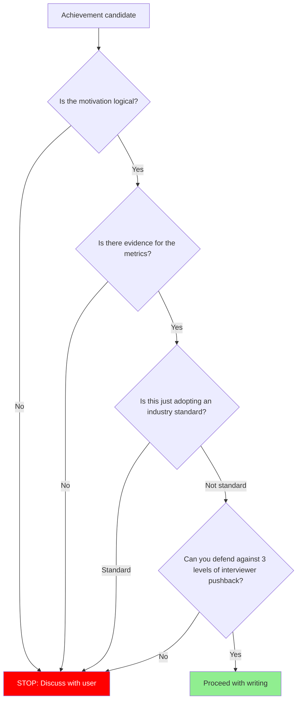

# Section-Specific Evaluation Reference

## Table of Contents

1. [Career vs Problem-Solving Distinction](#1-career-vs-problem-solving-distinction)
2. [Career Section Evaluation](#2-career-section-evaluation)
   - [Dimension Table](#dimension-table)
   - [PASS / FAIL Examples](#pass--fail-examples)
   - [Output Format](#career-evaluation-output-format)
3. [Problem-Solving Section Evaluation](#3-problem-solving-section-evaluation)
   - [Dimension Table](#dimension-table-1)
   - [PASS / FAIL Examples](#pass--fail-examples-1)
   - [Interview Depth Enhancement: Trade-off Richness Check](#interview-depth-enhancement-trade-off-richness-check)
   - [Output Format](#problem-solving-evaluation-output-format)
   - [Summary Count Format](#summary-count-format)
4. [Section Fitness Rules](#4-section-fitness-rules)
   - [Career vs Problem-Solving Distinction](#career-vs-problem-solving-distinction)
   - [Migration Rules](#migration-rules)
   - [Career-Level Volume Recommendations](#career-level-volume-recommendations)
   - [First-Page Primacy Rule](#first-page-primacy-rule)
   - [JD-Based Content Selection & Keyword Matching](#jd-based-content-selection--keyword-matching)
   - [Cross-Section Consistency Rule](#cross-section-consistency-rule)
5. [Writing Guidance Trigger: Achievement Lines](#5-writing-guidance-trigger-achievement-lines)
6. [Interview Simulation](#6-interview-simulation)

---

## Mandatory Evaluation Checklist

아래 항목은 평가 시 반드시 체크하고, 결과를 HTML Report 출력에 포함해야 한다.

### Career Section
- [ ] 6개 기준(Linear Causation, Metric Specificity, Role Clarity, Standard Transcendence, Hook Potential, Section Fitness) 각각에 대해 PASS/FAIL 판정
- [ ] Hook Potential이 높은 bullet과 낮은 bullet 식별
- [ ] Section Fitness 위반 시 문제해결 섹션으로 이동 권장

### Problem-Solving Section
- [ ] 6개 기준(Diagnostic Causation, Evidence Depth, Thought Visibility, Beyond-Standard Reasoning, Interview Depth, Section Fitness) 각각에 대해 PASS/FAIL 판정
- [ ] Interview Depth: 3단계 pushback 시뮬레이션 결과 포함

### Technical Stack Placement
- [ ] 기술 섹션이 자기소개 바로 아래에 위치하는지 확인 (JD 기술 스택 매칭이 7초 스캔에 포함되어야 ATS+리크루터 모두 유리)
- [ ] PASS: 자기소개 직후 / WARNING: 2번째 이후 / FAIL: 3번째 이후 또는 페이지 하단

### Portfolio Theme Diversity
- [ ] 문제해결 엔트리의 테마 분류 (Consistency, Performance, Resilience, Business Metrics, Data Pipeline 등)
- [ ] 2개 이상 동일 테마면 FLAG — 하나를 다른 테마로 교체 권장

### Cross-Section Consistency
- [ ] 자기소개에서 언급한 에피소드/키워드가 경력 또는 문제해결에서 뒷받침되는지 확인
- [ ] 뒷받침 없는 hook은 FLAG

---

## 1. Career vs Problem-Solving Distinction

The career section and the problem-solving section answer fundamentally different questions and must be evaluated against separate criteria.

- **Career** (경력): "What did this person achieve?" — direction and impact. Career bullets are **hooks** that invite interview questions.
- **Problem-Solving / Project Detail** (문제해결 / 프로젝트 상세): "How does this person approach problems?" — thought process and depth. Problem-solving entries are **proof** of engineering thinking.

The two sections are **independent**. Career bullets and problem-solving entries do not need a 1:1 correspondence. Every career section line is evaluated against the Career 6 criteria; every problem-solving section line is evaluated against the Problem-Solving 6 criteria.

---

## 2. Career Section Evaluation

### Dimension Table

| Dimension | Question | Fail Signal |
|-----------|----------|-------------|
| Linear Causation | 목표→실행→성과가 한 줄 안에서 선형 인과로 연결되는가? | "개선", "향상", "도입" without mechanism or outcome |
| Metric Specificity | 성과가 검증 가능한 수치(before→after, 절대값)로 뒷받침되는가? | 모호한 퍼센트, 정의 없는 baseline, 측정 방법 불명 |
| Role Clarity | 개인 기여가 팀 성과와 구분되는가? | "참여", "기여", "N인 프로젝트" without personal scope |
| Standard Transcendence | 업계 표준을 넘어서는 차별화된 성과인가? | Webhook, CI/CD, Docker, REST API 등을 단독 성과로 제시 |
| Hook Potential | 이 한 줄이 면접관의 호기심을 자극하여 질문을 유도하는가? | 기술명 나열, 질문 유도력 없는 평범한 서술 |
| Section Fitness | 성과 기술(achievement statement)인가, 문제 서사(problem narrative)인가? | 문제 진단/해결 과정이 경력 섹션에 위치 |

### PASS / FAIL Examples

**Linear Causation — 목표→실행→성과 선형 인과:**

| Verdict | Example | Reason |
|---------|---------|--------|
| PASS | "결제-주문 상태 동기화 스케줄러 구축으로 주간 불일치 15→0건 달성" | 목표(불일치 해소)→실행(스케줄러 구축)→성과(0건) 연결 명확 |
| PASS | "Redis 캐시를 상품 목록/상세 API에 적용, 피크 시간 DB CPU 90%→50% 절감" | 적용 대상→기술 행동→수치 성과 연결 명확 |
| FAIL | "결제 시스템 개선" | 무엇을 어떻게? 성과는? — 인과 전체 누락 |
| FAIL | "비동기 처리로 성능 향상" | 어디에 적용? 얼마나? — 인과 불완전 |

**Metric Specificity — 검증 가능한 수치:**

| Verdict | Example | Reason |
|---------|---------|--------|
| PASS | "주간 결제-주문 불일치 15건→0건" | before→after 명확, 검증 가능 |
| PASS | "피크 시간 DB CPU 90%→50%, 평균 응답 속도 1.2s→0.3s" | 복수 지표, 조건(피크 시간) 명시 |
| FAIL | "성능 50% 향상" | 무엇의 50%? 어떤 조건에서? baseline 불명 |
| FAIL | "대폭 절감" | "대폭"의 정의 없음, 검증 불가 |

**Role Clarity — 개인 기여 식별:**

| Verdict | Example | Reason |
|---------|---------|--------|
| PASS | "직접 설계한 보상 트랜잭션 스케줄러로 결제 불일치 해소" | 개인 행동(직접 설계) 명시 |
| PASS | "POS 서버 연동 장애 격리 아키텍처를 주도적으로 설계·구현" | 역할(주도 설계·구현) 명확 |
| FAIL | "팀에서 결제 시스템 개선" | 본인이 뭘 했는지 불명 |
| FAIL | "3인 프로젝트로 주문 시스템 개발" | 인원수만 있고 본인 역할 범위 없음 |

**Standard Transcendence — 업계 표준 이상의 성과:**

| Verdict | Example | Reason |
|---------|---------|--------|
| PASS | "Webhook 실패 시 보상 트랜잭션 + 스케줄러 구축, 결제 불일치 0건" | 표준(Webhook) **위에** 구축한 차별화 성과 |
| PASS | "Redis 캐시 + TTL 전략 + 캐시 무효화 로직으로 DB 부하 80% 절감" | 단순 캐시가 아닌 전략적 설계 + 성과 |
| FAIL | "Webhook 기반 비동기 결제 시스템 도입" | 업계 표준 그 자체 — 성과 아님 |
| FAIL | "CI/CD 파이프라인 구축" | 인프라 기본 |
| FAIL | "Docker 기반 배포 환경 구성" | 현대 개발의 기본 |

**Hook Potential — 면접 질문 유도:**

| Verdict | Example | Reason |
|---------|---------|--------|
| PASS | "선착순 쿠폰 race condition을 원자적 갱신으로 해결, 초과 발급 0건" | 면접관: "원자적 갱신이 정확히 뭔가요?" — 질문 자연 유도 |
| PASS | "외부 POS 장애가 주문에 전파되지 않는 복원력 아키텍처 설계" | 면접관: "어떤 패턴을 썼나요?" — 호기심 자극 |
| FAIL | "쿠폰 시스템 개발" | 물어볼 게 없음 — 면접관 시선 머무르지 않음 |
| FAIL | "주문 시스템 안정화" | 너무 추상적, 구체적 질문 떠오르지 않음 |

**Section Fitness — 올바른 섹션 배치:**

| Verdict | Example | Reason |
|---------|---------|--------|
| PASS | "보상 트랜잭션 스케줄러 구축으로 결제 불일치 0건 달성" | [시스템]을 [행동]하여 [결과] 패턴 — 성과 기술 |
| PASS | "비동기 메시지큐 기반 주문 처리 파이프라인 구축으로 피크 시간 처리량 3배 향상" | 시스템 구축 + 성과 수치 — 성과 기술 |
| FAIL | "결제-주문 상태 불일치 문제를 발견하고, 원인을 분석한 결과..." | 문제 서사 → 문제해결 섹션으로 이동 필요 |
| FAIL | "POS 서버의 간헐적 타임아웃 원인을 분석하여 Circuit Breaker 패턴을 도입하게 된 과정..." | 원인 분석 + 도입 과정 서사 → 문제해결 섹션으로 이동 필요 |

### Career Evaluation Output Format (Internal)

This is the internal evaluation format used during Section-Specific Evaluation. The user-facing output format is defined in SKILL.md HTML Report phase.

```
[Career Line] "원문 그대로"
- Linear Causation: PASS / FAIL (reason)
- Metric Specificity: PASS / FAIL (reason)
- Role Clarity: PASS / FAIL / N/A (reason)
- Standard Transcendence: PASS / FAIL (reason)
- Hook Potential: PASS / FAIL (reason)
- Section Fitness: PASS / FAIL (reason)
```

---

## 3. Problem-Solving Section Evaluation

"문제해결" and "프로젝트 상세" are the same intent with different tab names. Both are deep narrative spaces for demonstrating problem detection and problem-solving ability.

### Dimension Table

| Dimension | Question | Fail Signal |
|-----------|----------|-------------|
| Diagnostic Causation | 문제 발견→원인 진단→시도→실패 이유→해결이 탐색적 인과로 연결되는가? | 해결책으로 직행, 중간 시도의 실패 원인 분석 없음 |
| Evidence Depth | 각 시도의 실패/성공이 구체적 수치와 근거로 뒷받침되는가? | "안 됐다", "비효율적", "느렸다" without data |
| Thought Visibility | 문제 진단과 기술 선택이 본인의 사고 과정에서 나왔는가? | "멘토 조언으로", "팀에서 결정", "블로그 참고" without personal reasoning |
| Beyond-Standard Reasoning | 기술 선택이 대안 비교와 trade-off 분석으로 뒷받침되는가? | "[기술] 사용", "[기술] 적용" without why-this-not-that |
| Interview Depth | 3단계 pushback(구현→판단→대안)을 견딜 서사 깊이가 있는가? | 한 줄 해결, 실패 과정 없음, trade-off 없음 |
| Section Fitness | 사고 과정 서사인가, 성과 나열인가? | 문제해결 섹션에 성과 bullet만 나열 |

### PASS / FAIL Examples

**Diagnostic Causation — 발견→진단→시도→실패→해결:**

| Verdict | Example | Reason |
|---------|---------|--------|
| PASS | "QA 중 재고 100개 쿠폰이 152개 발급 → Thread.sleep으로 재현 → READ COMMITTED + MVCC 특성 진단 → 낙관적 락 시도 후 950건 실패 → 분산 환경 락 필요성 도출" | 발견→재현→진단→시도→실패 원인→해결 방향 전체 arc 연결 |
| PASS | "정규식 정확도 40% → 자연어 이해 필요 판단 → 단일 LLM 할루시네이션 30% → 관찰/추론 분리 필요성 도출 → 2단계 파이프라인" | 각 시도마다 왜 안 됐는지 → 다음 시도로 연결되는 학습 arc |
| FAIL | "동시성 문제를 Redis 분산 락으로 해결" | 왜 다른 건 안 됐는지, 어떻게 발견했는지 없음 — 해결책으로 직행 |
| FAIL | "LLM 파이프라인으로 정확도 85% 달성" | 왜 이 구조인지, 이전 시도가 왜 실패했는지 없음 |

**Evidence Depth — 시도별 구체적 실패/성공 데이터:**

| Verdict | Example | Reason |
|---------|---------|--------|
| PASS | "낙관적 락: 동시 1000건 중 950건 실패, Exponential Backoff 적용해도 평균 응답 1.2초" | 실패 건수 + 대응 후에도 남는 문제까지 수치로 |
| PASS | "단일 LLM: 정확도 65%, 할루시네이션 30% — 사진에 없는 알레르기 정보를 생성" | 수치 + 구체적 실패 양상(무엇이 잘못됐는지) |
| FAIL | "낙관적 락은 효율적이지 않았다" | 어디서 얼마나 비효율? — 데이터 없음 |
| FAIL | "첫 번째 시도는 정확도가 낮았다" | 얼마나 낮았는지, 무엇이 문제였는지 없음 |

**Thought Visibility — 본인 사고 과정 귀속:**

| Verdict | Example | Reason |
|---------|---------|--------|
| PASS | "사진에 없는 정보를 LLM이 '추론'해서 생성하는 것을 확인 → 관찰과 추론을 분리해야 한다는 결론을 내림" | 관찰→판단→결론이 본인 사고로 연결 |
| PASS | "멘토님의 '락 없이 못 푸나?' 질문에서 출발 → 3일간 CAS, 격리 수준, MVCC를 직접 실험 → 분산 락 필요성 스스로 확인" | 계기는 외부지만, 탐색과 결론은 본인 |
| FAIL | "팀 회의에서 2단계 파이프라인으로 결정" | 본인의 사고 과정 없이 팀 결정만 기술 |
| FAIL | "Redis 분산 락이 적합하다는 블로그를 참고하여 적용" | 왜 이 상황에 맞는지 자기 판단 없음 |

**Beyond-Standard Reasoning — 대안 비교 + trade-off 분석:**

| Verdict | Example | Reason |
|---------|---------|--------|
| PASS | "비관적 락: Lock Escalation → Table Lock 전이 위험 / Advisory Lock: RDB 공유 메모리 소비 + 스케일아웃 제약 / → 분산 락: Lua 원자성 + TTL 자동 해제" | 대안별 적합 시나리오 + 배제 이유 후 선택 근거 |
| PASS | "5개 모델 조합을 정확도·비용·속도 매트릭스로 비교, 87% 조합 대비 2%↓ 비용 33%↓ 조합 선택" | 다차원 비교 기준 + 의사결정 근거 |
| FAIL | "Redis 분산 락을 사용했습니다" | 왜 Redis? 다른 대안은? — 선택 근거 부재 |
| FAIL | "GPT-4V를 사용했습니다" | 왜 이 모델? 다른 모델은? — 비교 없음 |

**Interview Depth — 3단계 pushback 생존력:**

| Verdict | Example | Reason |
|---------|---------|--------|
| PASS | 2-3회 시도 실패 arc + 각 실패의 구체적 데이터와 교훈 + 최종 선택의 trade-off | L1("어떻게?")→L2("왜?")→L3("다른 건?") 모두 서사에서 직접 답변 가능 |
| PASS | "정규식(정확도 40%) → 단일 LLM(할루시네이션 30%) → 관찰/추론 분리 파이프라인(정확도 85%) — 각 단계 실패 원인과 다음 시도의 동기가 연결된 서사" | L1("2단계 파이프라인 어떻게?")→L2("왜 분리?")→L3("단일 LLM에서 프롬프트 튜닝은?") 모두 답변 가능 |
| FAIL | "Redis 분산 락으로 동시성 문제 해결" | L1 — 구현 상세 없음 / L2 — 선택 근거 없음 / L3 — 대안 없음, 모든 레벨 답 불가 |
| FAIL | "LLM 할루시네이션 문제를 2단계 파이프라인으로 해결했습니다" | L1("어떻게 분리?") — 구조 상세 없음 / L2("왜 분리가 답?") — 근거 없음 / L3("프롬프트 엔지니어링은?") — 대안 검토 없음 |

**Section Fitness — 올바른 섹션 배치 (문제해결):**

| Verdict | Example | Reason |
|---------|---------|--------|
| PASS | "[문제] → [해결 과정] → [검증] → [회고]" 구조의 탐색 서사 | 사고 과정이 드러나는 서사 구조 |
| PASS | "선착순 쿠폰 초과 발급 버그 → MVCC 진단 → 3단계 락 실험 → Redis 분산 락 선택 → 검증 → 회고" 형태의 문제 탐색 서사 | 문제→진단→시도→해결→회고 arc가 드러나는 서사 |
| FAIL | "메뉴 메타데이터 자동 추출 시스템 구축, 인력 11→3명 절감" | 성과 bullet → 경력 섹션으로 이동 필요 |
| FAIL | "선착순 쿠폰 race condition 해결로 초과 발급 0건 달성, Redis 분산 락 구현" | 결과 요약 bullet → 경력 섹션으로 이동 필요 |

### Interview Depth Enhancement: Trade-off Richness Check

For problem-solving entries, Interview Depth passes only when each alternative or attempt includes **rich trade-off reasoning** — not just "tried it, didn't work." Every excluded alternative must show why it was considered AND why it was ruled out in this specific context.

**Bad — alternatives listed without trade-off:**
```
대안 1 — 낙관적 락: 안 맞아서 배제
대안 2 — Redis 분산 락: 인프라 없어서 배제
```

**Good — each alternative with applicable scenario + specific exclusion reason:**
```
대안 1 — 낙관적 락(version 기반)
- 충돌이 드문 환경에서는 락 없이 대부분의 요청이 성공해 효율적이나,
  선착순처럼 동시 요청이 같은 row에 집중되면 재시도 폭증으로
  오히려 DB 부하 가중

대안 2 — DB 락(비관적 락 / Advisory Lock)
- 비관적 락은 조회-검증-갱신이 필요한 복잡한 비즈니스 로직에서는
  정합성을 보장하는 정석이나, 재고를 1 차감하는 단순 연산에
  두 단계를 거치는 것은 과도
- Advisory Lock은 스케일아웃이 어려운 RDB의 공유 메모리를
  소비하며, 단일 row 차감에 DB 세션 단위의 락을 도입하는 것은
  비용 대비 이점이 적다고 판단
```

### Problem-Solving Evaluation Output Format (Internal)

This is the internal evaluation format used during Section-Specific Evaluation. The user-facing output format is defined in SKILL.md HTML Report phase.

```
[Problem-Solving Line] "원문 그대로"
- Diagnostic Causation: PASS / FAIL (reason)
- Evidence Depth: PASS / FAIL (reason)
- Thought Visibility: PASS / FAIL / N/A (reason)
- Beyond-Standard Reasoning: PASS / FAIL (reason)
- Interview Depth: PASS / FAIL (reason)
- Section Fitness: PASS / FAIL (reason)
```

### Summary Count Format (Internal)

This is the internal evaluation format used during Section-Specific Evaluation. The user-facing output format is defined in SKILL.md HTML Report phase.

After all lines are evaluated, produce a split summary:

```
[Career Summary] Linear Causation: X/Y FAIL, Metric Specificity: X/Y FAIL, Role Clarity: X/Y FAIL, Standard Transcendence: X/Y FAIL, Hook Potential: X/Y FAIL, Section Fitness: X/Y FAIL
[Problem-Solving Summary] Diagnostic Causation: X/Y FAIL, Evidence Depth: X/Y FAIL, Thought Visibility: X/Y FAIL, Beyond-Standard Reasoning: X/Y FAIL, Interview Depth: X/Y FAIL, Section Fitness: X/Y FAIL
```

These counts drive the Writing Guidance Triggers.

---

## 4. Section Fitness Rules

### Career vs Problem-Solving Distinction

Career (6 criteria) evaluates direction and impact. Problem-Solving (6 criteria) evaluates thought process and depth. See Section 2 and Section 3 above for full criteria.

Never put problem descriptions like "Resolved payment-order state inconsistency" in the career section. That belongs in the problem-solving section.

### Migration Rules

State these as direct instructions, not suggestions:

- "문제를 발견하고 해결했다" → **Move this line to the 문제해결 / 프로젝트 상세 section**
- "시스템을 구축하여 성과 달성" → **Move this line to the 경력 section**
- Same work appearing in both sections → flag as duplication, choose one
- When recommending migration, specify: "[라인 원문] → [대상 섹션]으로 이동"

### Career-Level Volume Recommendations

Career-level guidance for 문제해결 / 프로젝트 상세 entry count. Candidates with fewer years need more detailed problem-solving narratives to compensate for limited career breadth.

| Career Level | Recommended Entries per Position | Primary Strategy |
|---|---|---|
| New Grad (신입) | 2 entries per position | Prove CS depth and learning velocity. Signature project + detailed problem-solving entries. |
| Junior (주니어) | 2 entries per position | Prove depth + technical foundations. Signature project + key problem-solving entries. |
| Mid (미들) | 1-2 entries per position | Balance depth and breadth. Signature project + major problem-solving entries. |
| Senior (시니어) | Selective | Impact and leadership focus. Signature project less critical than career achievements and system thinking. |

### First-Page Primacy Rule

There is NO hard page limit. A 4-page resume is acceptable if every page earns its space. However, the opening section must function as a standalone executive summary:

**The opening section (approximately the first 500 words or 20-25 bullet lines) must contain:**
- Role identity + core competency (self-introduction)
- Top 2-3 quantified achievements
- Signature project summary (problem + outcome in 2-3 lines)
- Technical stack overview

**Why:** Recruiters spend ~7.4 seconds on initial screening (Ladders Eye-Tracking Study, 2018). Everything that determines "read further vs reject" must appear in the opening section. Remaining sections are for depth — they will only be read if the opening section earns the reader's attention.

**Evaluation:**
- PASS: Opening section contains identity, achievements, and signature summary
- WARNING: Key achievements or signature project buried past the opening section
- FAIL: Opening section is entirely career history or education with no impact signals

### Technical Stack Section Placement

**Why**: JD 기술 스택과의 매칭이 7초 스캔에 들어와야 ATS와 리크루터 모두에서 유리. 기술 섹션이 경력 뒤에 묻히면 스택 매칭이 늦게 확인됨.

기술 섹션은 소개 바로 아래 배치 권장.

**Evaluation**:
- PASS: 기술 섹션이 자기소개 바로 다음에 위치
- WARNING: 기술 섹션이 경력 섹션 뒤에 위치
- FAIL: 기술 섹션이 이력서 마지막에 위치하거나 아예 없음

### JD-Based Content Selection & Keyword Matching

#### JD Keyword Matching (AI/ATS Screening)

When a JD (Job Description) text is provided, evaluate keyword alignment. Modern hiring pipelines use ATS (Applicant Tracking Systems) and AI-based screening that filter resumes by keyword match rate before human review.

**Evaluation criteria:**
- Extract key technical skills, tools, and domain terms from the target JD
- Check which JD keywords appear in the resume (exact match or close synonym)
- Calculate approximate match rate: matched keywords / total JD keywords

**Output format (when target JD is available):**
```
[JD Keyword Match]
- JD keywords identified: N
- Matched in resume: M (list top matches)
- Missing from resume: K (list missing keywords)
- Match rate: M/N (X%)
- Recommendation: [Add missing keywords where genuine experience exists / Match rate is sufficient]
```

**Guidelines:**
- Match rate > 70%: Strong alignment — PASS
- Match rate 40-70%: Partial alignment — recommend adding missing keywords where the candidate has genuine experience
- Match rate < 40%: Weak alignment — flag as potential ATS risk
- NEVER recommend adding keywords for skills the candidate does not actually possess (Absolute Rule 4)
- Keyword placement matters: technical stack section and achievement lines are highest-weight ATS zones
- Every JD keyword match must map to a specific project or achievement in the resume. A keyword that appears only in the technical stack section with no supporting achievement line is a **weak match** — flag it and recommend adding an evidence line.

**When no JD is provided:** Skip this check. Note: "JD keyword matching skipped — no target JD available."

#### JD-Based Content Selection

JD가 제공된 경우, 키워드 매칭에 그치지 않고 **컨텐츠 선별 자체를 JD에 최적화**한다. 노트 풀에 더 적합한 후보가 있다면 swap을 추천한다.

**경력 bullet / 문제해결 엔트리 JD 적합도 평가:**
- 현재 이력서에 포함된 경력 bullet과 문제해결 엔트리 각각에 대해 JD 키워드 및 도메인 관련성을 평가
- 노트 풀(note pool)에 JD에 더 적합한 candidate가 있으면 swap을 구체적으로 추천:
  - "현재 [엔트리 원문] → [노트 풀 후보 제목]으로 교체 검토 (JD 키워드 [키워드명] 커버)"
- 노트 풀 후보가 없는 경우: 현재 엔트리의 JD 관련 키워드 강조 방향 제시

**자기소개 유형 추천:**
- 자기소개 유형(A/B/C/D)도 JD에 맞춰 추천한다 (각 유형의 포지셔닝은 self-introduction.md 참고)
- JD가 강조하는 역량(예: 시스템 설계, 문제해결 깊이, 리더십, 특정 도메인 경험)에 따라 어떤 유형이 가장 효과적인 후킹을 만드는지 판단
- 추천 형식: "JD 분석 결과 [역량] 강조가 유리 → 자기소개 유형 [X] 추천 (이유)"

**When no JD is provided:** 이 섹션 전체를 스킵한다. Note: "JD-based content selection skipped — no target JD available."

### Cross-Section Consistency Rule

자기소개에서 후킹(언급)한 프로젝트/에피소드/성과는 반드시 경력 또는 문제해결 섹션에 대응하는 엔트리가 있어야 한다.

**Core Intuition:**
- 자기소개 = 면접관의 시선을 끄는 후킹 포인트
- 문제해결 = 그 후킹의 증거(proof)
- 후킹했으면 증거가 있어야 한다. 후킹 없는 증거는 묻히고, **증거 없는 후킹은 신뢰를 떨어뜨린다.**

**Why This Rule Matters:**
- 면접관은 자기소개에서 관심이 생긴 프로젝트를 이력서에서 찾는다 → 없으면 신뢰 하락
- 자기소개에서 흘렸던(간략히 언급한) 프로젝트/성과는 문제해결 쪽에서 상세 서술해야 한다
- 자기소개에 있는 것은 JD에 맞춘 핵심 후킹 요소 → 가장 시선을 끄는 프로젝트들이므로 문제해결 탭에서 증거로 뒷받침되어야 함

**Evaluation Method:**
1. 자기소개에서 언급된 프로젝트/에피소드/성과 키워드를 추출
2. 각 키워드에 대해 경력 섹션 또는 문제해결 섹션에 대응 엔트리가 있는지 확인
3. 특히 후킹 수준(면접관이 질문할 만한)의 프로젝트는 문제해결 섹션에 **상세 서술**이 있어야 함 — 경력 한 줄만으로는 부족

**PASS / FAIL Examples:**

| Verdict | Self-Intro Reference | Career/Problem-Solving Match | Reason |
|---------|---------------------|------------------------------|--------|
| PASS | "결제-주문 상태 불일치를 시스템 간 동기화 문제로 재정의" 언급 | 문제해결 섹션에 해당 프로젝트 상세 서술 존재 | 후킹 → 증거 연결 완전 |
| FAIL | "선착순 쿠폰 race condition을 원자적으로 해결" 언급 | 문제해결/경력 어디에도 해당 프로젝트 없음 | 후킹만 있고 증거 전무 → 면접관이 이력서에서 찾을 수 없음 |
| FAIL | "LLM 기반 자동화로 월 1,500만원 절감" 언급 | 경력에 한 줄만 있고 문제해결에 상세 서술 없음 | 후킹 수준의 프로젝트인데 증거가 부족 — 면접관이 질문했을 때 이력서에서 뒷받침이 없음 |

**출력 형식 (자기소개 후킹-증거 점검):**
```
[Cross-Section Consistency Check]
자기소개 후킹 키워드: [추출된 키워드 목록]

- "[후킹 원문]" → 문제해결/경력 대응: PASS / FAIL
  (FAIL인 경우: "문제해결 섹션에 상세 서술 추가 필요" 또는 "경력 엔트리 보강 필요")
```

### Portfolio Theme Overlap Detection

**Why**: 동일 테마의 문제해결 엔트리가 2개 이상이면 "이 사람은 이것밖에 못하나?" 인상을 줌. 다양한 테마를 커버하면 "여러 종류의 문제를 풀 수 있는 사람"으로 읽힘.

전체 이력서 평가 시, 문제해결 엔트리들의 기술 테마 다양성을 확인. 2개 이상의 엔트리가 동일 테마를 공유하면 플래그.

| Technical Theme | Example Topics |
|----------------|---------------|
| Consistency | race condition, distributed lock, transaction sync |
| Performance | caching, query optimization, response time |
| Resilience | circuit breaker, retry, fallback, fault isolation |
| Business Metrics | cost reduction, headcount, conversion rate |
| Data Pipeline | ETL, streaming, batch processing |

**Evaluation**:
- PASS: 각 signature/detailed 엔트리가 서로 다른 테마
- FLAG: 2+ 엔트리가 동일 테마 → "포트폴리오 테마 겹침 — [엔트리1]과 [엔트리2]가 모두 [테마]. 다른 테마의 엔트리로 교체 검토."

---

## 5. Writing Guidance Trigger: Achievement Lines

After completing the section-specific evaluation and summary counts, check if the writing guidance trigger condition is met. This is a mandatory check.

**Career trigger**: `Linear Causation FAIL 수 / career_lines > 0.5` OR `Metric Specificity FAIL 수 / career_lines > 0.5` (career_lines = 경력 섹션에서 경력 6개 기준으로 평가된 bullet 라인 수, 제목·빈 줄·섹션 마커 제외)

**Problem-solving trigger**: `Diagnostic Causation FAIL 수 / problem_lines > 0.5` OR `Evidence Depth FAIL 수 / problem_lines > 0.5` (problem_lines = 문제해결 섹션에서 문제해결 6개 기준으로 평가된 라인 수)

When triggered, deliver the full section-specific evaluation first, then deliver the corresponding message:

**Career trigger message:**
> "경력 섹션 전체 N개 라인 중 X개가 Linear Causation/Metric Specificity FAIL입니다. 이 경력 기술은 표현 수정이 아니라 내용 재구성이 필요합니다. 위의 Writing Guidance: Achievement Lines 섹션의 템플릿과 사전 검증 플로우차트를 참고하여 재작성해 보세요."

위 경력 섹션 트리거 충족 시, `Read references/experience-mining.md` Section-Specific Evaluation section을 참조하여 Experience Mining Interview를 진행한다. 유저가 opt-out하면 위의 Writing Guidance 메시지로 대체한다.

**Problem-solving trigger message:**
> "문제해결 섹션 전체 N개 라인 중 X개가 Diagnostic Causation/Evidence Depth FAIL입니다. 이 문제해결 기술은 사고 과정이 드러나도록 재구성이 필요합니다. 위의 P.A.R.R. Writing Template과 Before/After 예시를 참고하여 재작성해 보세요."

위 문제해결 섹션 트리거 충족 시, `Read references/experience-mining.md` Section-Specific Evaluation section을 참조하여 Experience Mining Interview를 진행한다. 유저가 opt-out하면 위의 Writing Guidance 메시지로 대체한다.

Additional trigger conditions (any one also triggers):
- Section structure needs reorganization (Section Fitness failures pointing to section migration)
- Achievement lines need [Target] + [Action] + [Outcome] restructuring

### Achievement Line Structure

Use this guidance when Linear Causation or Metric Specificity failures indicate that career lines need content restructuring, not expression polishing.

```
[Target context] + [Technical action] + [Measurable outcome]
```

| Bad example | Problem | Good example |
|-------------|---------|--------------|
| Reduced DB CPU by introducing Redis cache | No context on what was cached | Applied Redis cache to product list/detail APIs, reducing peak-hour DB CPU from 90% to 50% |
| Improved payment system | No specifics on what or how | Built payment-order state sync scheduler, reducing weekly payment-order mismatches from 15 to 0 |
| Introduced webhook-based async payment system | This is already the standard | Built payment state sync scheduler to handle webhook delivery failures |

### Technical Keyword Selection

Choose specific keywords that invite rich follow-up questions.

| Abstract (avoid) | Specific (use) | Interview questions it invites |
|-------------------|----------------|-------------------------------|
| Auto-recovery system | Sync scheduler | Interval? Concurrent execution prevention? |
| Performance optimization | Redis cache | TTL strategy? Invalidation timing? |
| Message-based processing | Kafka | Partition design? At-least-once guarantee? |

### Pre-Writing Validation

Before writing or rewriting any achievement line, walk through these questions in order. If any answer is "No," stop writing and discuss with the user.



---

## 6. Interview Simulation

This section extends the 3-level pushback simulation (node H in the Evaluation Protocol flowchart) to the **writing guidance** context. When the agent is helping write or rewrite achievement lines (not just reviewing), apply the same 3-level simulation as a quality gate before finalizing each line. If the candidate cannot answer all 3 levels, that line will hurt more than help.

### 3-Level Pushback

| Level | Question Pattern | What It Tests |
|-------|-----------------|---------------|
| L1 | "구체적으로 어떻게 구현했나요?" | Implementation knowledge |
| L2 | "왜 그 방식을 선택했나요?" | Technical judgment |
| L3 | "다른 대안은 검토하지 않았나요?" | Trade-off awareness |

Apply all three levels to every line — including well-written ones. Well-written lines get harder L1-L3, not softer ones.

For well-written lines (e.g., "5분 주기 스케줄러"), pushback goes deeper:
- L1: "왜 5분인가요? 3분이나 10분은 안 되나요?"
- L2: "동시 실행 방지는 어떻게 했나요?"
- L3: "스케줄러가 죽으면 어떻게 되나요?"

Apply the same simulation to existing lines when reviewing. "Just polish" does not override this check.

### L3 Trade-off Quality Standard

When evaluating L3 ("다른 대안은 검토하지 않았나요?"), each excluded alternative must include **both**:
1. The scenario where this alternative would have been the right choice
2. The specific reason it was ruled out in this situation

A bare "배제" or "인프라 없어서" is insufficient. The answer must show engineering judgment, not just a conclusion.

| Quality | Example |
|---------|---------|
| **Bad — no trade-off, just a verdict** | "낙관적 락: 안 맞아서 배제 / Redis 분산 락: 인프라 없어서 배제" |
| **Good — scenario + this-situation reason** | "낙관적 락(version 기반): 충돌이 드문 환경에서는 락 없이 대부분의 요청이 성공해 효율적이나, 선착순처럼 동시 요청이 같은 row에 집중되면 재시도 폭증으로 오히려 DB 부하 가중 / DB 락(비관적 락 / Advisory Lock): 비관적 락은 조회-검증-갱신이 필요한 복잡한 비즈니스 로직에서는 정합성을 보장하는 정석이나, 재고를 1 차감하는 단순 연산에 두 단계를 거치는 것은 과도. Advisory Lock은 스케일아웃이 어려운 RDB의 공유 메모리를 소비하며, 단일 row 차감에 DB 세션 단위의 락을 도입하는 것은 비용 대비 이점이 적다고 판단" |

### Obvious Elimination vs Interview Backup

Alternatives that are obviously inapplicable (e.g., `synchronized` in a multi-instance environment) do not belong in the resume body — they waste space and signal shallow thinking. Prepare these as **interview backup answers** instead: know why they fail, but do not surface them in writing unless the context demands it.
