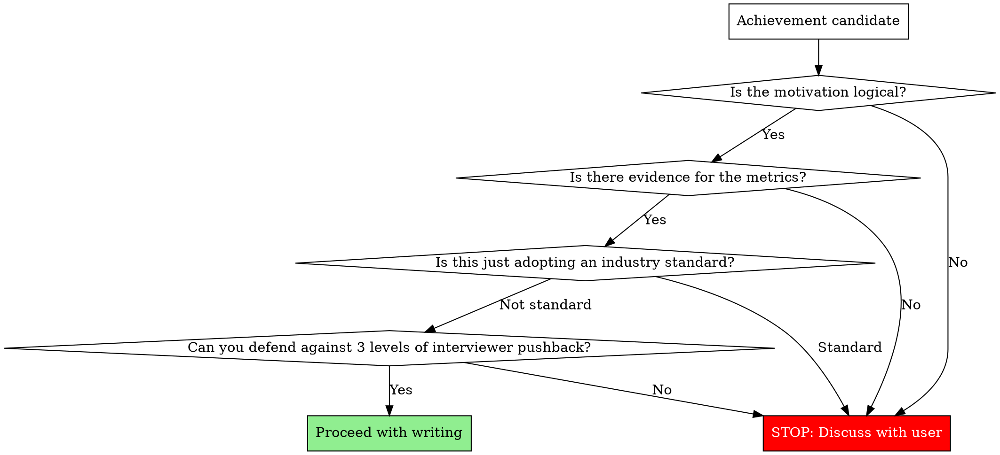

# Make Resume

Every single line on a resume is a **seed for an interview conversation**. When the interviewer asks "Why?", can you present a logically coherent story? That is the only criterion.

## Absolute Rules

1. **Never fabricate metrics.** If the user doesn't provide numbers, ask. Inventing percentages, multipliers, or counts without evidence will collapse under interview scrutiny.
2. **Never uncritically accept the user's premise.** If they say "150ms was the problem," push back: "Isn't 150ms acceptable?" Unrealistic premises get exposed in interviews.
3. **Never claim industry standards as achievements.** Webhook-based payment processing is already the standard. "Introduced" is not an achievement — only what you built ON TOP of the standard counts.

## Pre-Writing Validation

Before writing any achievement, walk through these questions in order. If any answer is "No," stop writing and discuss with the user.



## Achievement Line Structure

```
[Target context] + [Technical action] + [Measurable outcome]
```

| Bad example | Problem | Good example |
|-------------|---------|--------------|
| Reduced DB CPU by introducing Redis cache | No context on what was cached | Applied Redis cache to product list/detail APIs, reducing peak-hour DB CPU from 90% to 50% |
| Improved payment system | No specifics on what or how | Built payment-order state sync scheduler, reducing weekly payment-order mismatches from 15 to 0 |
| Introduced webhook-based async payment system | This is already the standard | Built payment state sync scheduler to handle webhook delivery failures |

## Career Section vs Problem-Solving Section

| Section | Role | Tone | Unit |
|---------|------|------|------|
| Career | Skim-and-hook | "Built [system] achieving [outcome]" | System/Feature |
| Problem-solving | Deep narrative | Problem recognition → Definition → Solution → Outcome | Problem |

Never put problem descriptions like "Resolved payment-order state inconsistency" in the career section. That belongs in the problem-solving section.

## Technical Keyword Selection

Choose specific keywords that invite rich follow-up questions.

| Abstract (avoid) | Specific (use) | Interview questions it invites |
|-------------------|----------------|-------------------------------|
| Auto-recovery system | Sync scheduler | Interval? Concurrent execution prevention? |
| Performance optimization | Redis cache | TTL strategy? Invalidation timing? |
| Message-based processing | Kafka | Partition design? At-least-once guarantee? |

## Interview Simulation (Mandatory)

After writing each achievement line, run this simulation:

1. **"How did you implement this?"** (Implementation method)
2. **"Why did you choose that approach?"** (Technical judgment rationale)
3. **"Did you consider any alternatives?"** (Trade-off awareness)

If you can't answer all 3 levels, that line will hurt more than help.

## Red Flags — If You Think This, STOP

| Thought | Reality |
|---------|---------|
| "There are no metrics, so I'll just make some up" | Fabricated metrics collapse in interviews. Ask the user. |
| "The user said this, so I'll write it as-is" | If the premise is unrealistic, the interviewer will catch it. Verify first. |
| "This is obviously an achievement" | If it's an industry standard, it's not an achievement. Only what's built on top counts. |
| "It's just the career section, keep it simple" | Even simple lines must follow [Target] + [Action] + [Outcome]. |
| "It's problem-solving, so list the technologies" | It's not a tech list — it's a narrative. Why → How → Result. |
| "The user said just polish, don't change content" | "Just polish" does NOT override validation. Polishing flawed lines makes them look more credible but equally vulnerable in interviews. Run the flowchart on every line regardless. |
| "They already wrote it, I'll just clean up the grammar" | Pre-written lines need the SAME validation as new ones. Sunk cost is not a reason to skip checks. |

## 시그니처 프로젝트 (P.A.R.R.)

### 왜 시그니처 프로젝트인가

1페이지 남은 공간에 당신의 최고급 스테이크를 선보이고, "네가 개발하면서 만났던 가장 어려운 문제는?" 이라는 질문에 완벽하게 답하는 것.

**40초 규칙:**
- 이력서는 민주주의가 아닙니다. 모든 프로젝트를 똑같이 다룰 필요가 없습니다.
- 1페이지에서 설득하지 못하면 끝입니다.
- 팀장은 40초 중 30초를 1페이지에 씁니다. 2페이지는 보지 않습니다.
- 그래서 1페이지 남은 공간 전부를 단 하나의 프로젝트에 몰빵합니다.

**레이아웃:**
- 경력/교육: 6~8줄
- 시그니처 프로젝트: 남은 공간 전부 (15~25줄)
- 1페이지를 약간 넘어가도 괜찮습니다 (단, 2페이지를 다 채우면 안 됨)

**면접 질문 연결:**
이 프로젝트는 면접관이 100% 물어볼 질문에 대한 답입니다:
"네가 개발하면서 만났던 가장 어려웠던 문제가 뭐야?"
화이트보드 앞에 선 것처럼, 면접관 바로 앞에 앉은 것처럼 이 프로젝트를 설명해야 합니다.

### 프로젝트 선택 기준

당신의 모든 경험 중 가장 자랑스러운 프로젝트 1개를 선택하십시오. 선택 기준:
1. 기술적으로 가장 어려웠던 문제인가?
2. 여러 번 시도하고 실패한 과정이 있는가?
3. "왜?"라는 질문을 스스로에게 던졌는가?
4. 데이터로 검증한 결과가 있는가?
5. 각 시도마다 "왜 이걸 시도했나?"와 "왜 안 됐나?"를 설명할 수 있는가?

### 부트캠프 시그니처 vs 현업 시그니처

**시그니처 프로젝트의 프레이밍은 경력 맥락에 따라 달라야 합니다.** P.A.R.R. 구조는 동일하지만, 무엇을 증명하는지가 다릅니다.

| | 부트캠프 시그니처 | 현업 시그니처 |
|---|---|---|
| 증명할 것 | "나는 CS를 깊이 파고들 수 있다" | "나는 실제 비즈니스 문제를 해결한다" |
| 인상적인 것 | MVCC, CAP 정리, 격리 수준 | 월 1,500만원 절감, 인력 73% 감축 |
| 시행착오의 가치 | 개념을 체화하는 과정 | 정답 없는 영역에서 답을 찾아가는 과정 |
| 실패 이유 설명 | CS 원리로 설명 ("MVCC 특성상 필연적") | 도메인 맥락으로 설명 ("메뉴명 다양성으로 규칙 커버 불가") |
| 핵심 키워드 | 격리 수준, 트레이드오프, 학습 | 실험, 비용 대비, 비즈니스 임팩트 |

**맥락 판단 기준:**
- 부트캠프/사이드 프로젝트/취준 경험 → 부트캠프 시그니처
- 현업 1년차 이상의 실무 경험 → 현업 시그니처

**현업 시그니처의 4대 강점:**
1. **정답이 없는 문제** — 동시성은 정답이 있음(락). LLM 정확도, 시스템 설계 같은 영역은 정답이 없음. 정답 없는 영역에서 답을 찾아가는 과정이 진짜 강점
2. **실험 기반 의사결정** — 모델 N종 비교, A/B 테스트, 수치 기반 판단과 검증. "감으로 선택"이 아닌 데이터로 결정
3. **멈추는 판단** — "93% 가능했지만 비용 대비 보류". 더 올릴 수 있지만 안 올리는 판단이 현업 엔지니어링의 핵심
4. **비즈니스 임팩트** — 인력 절감, 비용 절감, 처리 속도 향상 등 사업에 미친 실질적 영향

### P.A.R.R. + 깊이

P.A.R.R. 공식을 완전한 형태로 적용하되, 단순한 기술 나열이 아닌 사고 과정의 깊이를 보여줘야 합니다.

**Problem (문제):**
왜 이 문제가 중요한가? 비즈니스 리스크는? 문제의 본질은?

**Approach (접근):**
- 단순 기술 선택이 아님: "Redis 썼습니다" (X), "GPT-4 사용했습니다" (X)
- **각 시도마다 반드시 두 가지 Why:**
  - **왜 이걸 시도했나?** (선택 이유)
  - **왜 안 됐나?** (실패 이유 — 도메인 맥락에서 설명)
- 부트캠프: CS 지식으로 파고든 흔적 (격리 수준, MVCC, CAP 이론 등)
- 현업: 도메인에서 왜 이 접근이 안 되는지 ("메뉴명 다양성으로 규칙 커버 불가", "할루시네이션 30%로 신뢰성 부족")

**Result (결과):**
- 부트캠프: Race Condition 의도적 재현, 극한 시나리오 테스트
- 현업: 비즈니스 메트릭(인력 절감, 비용 절감, 처리량 증가), 실험 결과 수치

**Reflection (회고):**
- 배운 것의 본질 (트레이드오프, 한계 인정)
- 솔직한 고백 ("처음엔...", "3일 밤을 새우며...")
- **현업 추가: 멈추는 판단** ("93%까지 가능했지만 비용 대비 85%에서 보류")
- 다음 개선 방향

### 작성 템플릿

```
[문제] 문제의 본질은 무엇인가?
[해결]
  시도 1: 왜 이걸 시도했나? → 실패, 왜 이 도메인에서 안 됐는가?
  시도 2: 왜 이걸 다음으로 시도했나? → 실패, 무엇을 깨달았는가?
  시도 3: 왜 이것이 답인가? → 성공
[검증] 어떻게 증명했는가?
[회고] 무엇을 배웠는가? 한계는? 솔직한 고백은? (현업: 멈추는 판단은?)
```

**최소 2-3단계의 시도→실패→깨달음 아크는 필수입니다.** 한 번에 성공한 이야기는 "누가 알려줘서 따라한 것"으로 읽힙니다.
**각 시도마다 "왜 이걸 시도했나?"와 "왜 안 됐나?"가 반드시 포함되어야 합니다.** 수치만 있고 이유가 없으면 실패가 아니라 나열입니다.

### 서사 원칙

**기술 문서가 아닙니다. 당신의 사고 과정을 보여주는 이야기입니다.**

좋은 예 (부트캠프):
- "처음엔 Redis만 쓰면 되는 줄 알았습니다"
- "하지만 멘토님의 '락 없이 못 푸나?' 질문에 3일 밤을 새웠습니다"

좋은 예 (현업):
- "처음엔 정규식으로 충분할 줄 알았습니다. 하지만 '셰프 스페셜 A'라는 메뉴명 하나에 규칙 전체가 무력화됐습니다"
- "93%까지 올릴 수 있었지만, fine-tuning 월 200만원 추가 비용. 85%에서 멈추고 수작업 보조로 대체했습니다"
- "5개 모델 조합을 정확도, 비용, 속도로 비교. 87% 조합 대비 정확도 2% 낮지만 비용 33% 절감되는 조합을 선택했습니다"

나쁜 예:
- "Redis 분산 락을 사용했습니다" / "GPT-4를 사용했습니다"
- "부하 테스트 결과 성공했습니다" / "정확도 85% 달성했습니다"
- "성능이 개선되었습니다" / "인력이 절감되었습니다"

### Before/After 전문 비교 (부트캠프)

**Before — 기술 나열 (안티패턴):**
```
온라인 서점 쇼핑몰
• 선착순 쿠폰 발급 기능 개발
• Redis 분산 락 사용하여 동시성 문제 해결
Spring Boot, MySQL, Redis 사용
• JMeter로 부하 테스트 수행
• 성능 개선 완료
```

**Before의 문제점:**
- "Redis 사용", "동시성 해결" = 결과만 나열
- 왜 Redis인지, 다른 방법은 고민했는지 전혀 없음
- 사고 과정 제로, 엔지니어링 깊이 제로
- 팀장의 반응: "그래서 뭘 배웠는데?" (Skip)

**After — 김민준 서사 (골드 스탠다드):**
```
온라인 서점 - 선착순 쿠폰 시스템

[문제]
파이널 프로젝트 QA 중 치명적 버그 발견: 재고 100개 쿠폰이 152개 발급. 하지만 로컬 환경에서는 재현 안 됨.
Thread.sleep(100)을 강제 삽입해 동시성 상황 재현. 문제의 본질 파악: MySQL READ COMMITTED 격리 수준에서 두
트랜잭션이 동시 재고 조회 → MVCC 특성상 필연적 문제.

[해결 과정]
시도 1 - 락 없이 해결 가능한가?
낙관적 락 + CAS: 동시 1000건 중 950건 실패, 재시도 폭증. Exponential Backoff 최적화해도 평균 응답 1.2초.
DB 격리 수준 상향(SERIALIZABLE): Gap Lock 발생, 처리량 60% 감소. 거부.

시도 2 - 어떤 락인가?
비관적 락(SELECT FOR UPDATE): Lock Escalation으로 Table Lock 전이, 커넥션 풀 고갈, 응답 800ms.
Application Lock(synchronized): 단일 서버 작동, 하지만 Scale-out 불가. 서버 2대 실험 → 즉시 재현.
깨달음: 분산 환경 작동 락 필요.

시도 3 - 왜 Redis 분산 락인가?
Redis 선택 이유: Lua 스크립트 원자성, TTL 자동 해제, Single Thread로 Race Condition 차단.
Redisson vs 직접 구현: Spin Lock 비효율 vs Pub/Sub 기반 Wait/Notify. Redisson 선택.
Lock 설정 근거: Wait 3초(선착순 특성), Lease 5초(로직 최대 실행 시간+여유).

[검증]
JMeter 동시 100 Thread, Ramp-up 0초. 재고 100개 → 발급 100건, 중복 0건.
Lock Contention 측정: Redis MONITOR로 패턴 분석, 평균 대기 180ms, 최대 2.8초.
극한 시나리오: 재고 10개, 동시 500건 → 10건만 성공, 정합성 100%.

[회고]
배운 것: MVCC와 격리 수준 트레이드오프, 분산 시스템 일관성(CAP 정리), Redlock 알고리즘과 한계(Martin
Kleppmann 논문).
인정하는 한계: Redis SPOF, 멱등성 미보장. 해결 방향: Cluster/Sentinel, 발급 이력 테이블.
솔직한 고백: 처음엔 "Redis 쓰면 되겠지"였습니다. 멘토님 "락 없이 못 푸나?" 질문에 3일 밤새며 CAS, 격리 수준,
MVCC 공부. 비로소 이해: 문제는 답 찾기가 아니라 왜 그것이 답인지 설명하는 것.

→ 파이널 프로젝트 최우수상 (12팀 중 1위)
```

### 개선 이유 분석 — 부트캠프 (왜 After가 더 나은가)

- **문제 본질 파악**: "MVCC 특성상 필연적" — Before는 "동시성 문제"만 말하고 왜인지 모름
- **시도의 깊이**: 3단계 접근 (락 없이 → 어떤 락 → 왜 Redis) — Before는 바로 "Redis 사용"
- **각 시도의 실패와 이유**: "950건 실패", "처리량 60% 감소" — Before는 실패 과정 제로
- **Why 질문 반복**: "왜 락인가?", "왜 Redis인가?", "왜 Redisson인가?" — Before는 Why 제로
- **CS 지식 적용**: MVCC, CAP 정리, Redlock — Before는 기술명만 나열
- **검증 깊이**: 단순 테스트가 아닌 Lock Contention 분석 — Before는 "부하 테스트 수행"
- **한계 인정**: SPOF, 멱등성 — Before는 "성능 개선 완료"로 끝

### Before/After 전문 비교 (현업)

**Before — 결과 나열 (안티패턴):**
```
메뉴 메타데이터 자동 추출
• LLM 기반 시스템 개발
• 5개 모델 비교하여 최적 조합 선택
• 정확도 85% 달성
• 인력 11명에서 3명으로 절감
```

**Before의 문제점:**
- "5개 모델 비교" = 왜 비교했는지, 어떤 기준인지 제로
- 왜 이 접근이었는지, 이전 시도는 왜 실패했는지 전혀 없음
- 85%에서 왜 멈췄는지 판단 과정 없음
- 팀장의 반응: "그래서 어떤 판단을 내린 건데?" (Skip)

**After — 현업 엔지니어링 판단 서사 (골드 스탠다드):**
```
메뉴 사진 메타데이터 자동 추출 시스템

[문제]
F&B 커머스 플랫폼에서 입점 업체 메뉴 등록 시 영양정보, 알레르기, 카테고리 등 15개 필드를 수작업 입력.
담당 인력 11명, 신메뉴 반영까지 4주. 성수기 메뉴 교체율 40% 상승 시 병목 심화. 월 인건비 약 2,200만원.

[해결 과정]
시도 1 - 왜 규칙 기반부터? 가장 예측 가능하고 비용이 낮아서.
정규식 + 사전 매핑. 결과: 정확도 40%. 왜 안 되는가: "크림파스타", "까르보나라", "셰프 스페셜 A" — 같은 음식도
이름이 다르고, 임의 이름이면 규칙 무력화. 교훈: 자연어 이해가 필요한 문제를 패턴 매칭으로 풀 수 없다.

시도 2 - 왜 단일 LLM? 자연어 이해력이 있으니까.
GPT-4V에 메뉴 사진 직접 입력, 15개 필드 한 번에 추출. 결과: 정확도 65%, 할루시네이션 30%.
왜 안 되는가: 사진에 없는 알레르기 정보를 "추론"해서 생성. 15개 필드를 한 번에 요구하니 "아는 척" 빈도 증가.
교훈: 관찰(사진에서 보이는 것)과 추론(도메인 지식 기반 매핑)을 분리해야 한다.

시도 3 - 왜 2단계 파이프라인?
Stage 1 (Vision): 보이는 것만 서술. Stage 2 (Text): 서술문을 메타데이터로 매핑.
왜 이 구조인가: 각 단계가 하나의 역할만 수행하므로 할루시네이션 원인 추적 가능.
5개 모델 조합 비교 — 정확도, 비용, 속도 매트릭스. 87% 조합 대비 정확도 2%↓ 비용 33%↓인 조합 선택.

[검증]
500건 랜덤 샘플: 정확도 85%, 할루시네이션 2% (단일 LLM 대비 28%p 감소).
에러 분석: Stage 1 오류 45건(사진 품질), Stage 2 오류 29건(매핑 모호성). 각 단계별 개선 방향 명확.
비용: 건당 ₩30 (수작업 건당 ₩3,000 대비 1/100).

[회고]
멈춘 이유: fine-tuning으로 93%까지 실험 확인. 그러나 월 200만원 추가 + 모델 업데이트마다 재학습.
85%+수작업 검수가 TCO 최적이라는 판단.
인정하는 한계: 사진 품질 의존성(어두운 사진 정확도 60%), 신메뉴 카테고리 미학습.
비즈니스 결과: 인력 11→3명(월 약 1,600만원 절감), 재고 파악 4주→1주.
```

### 개선 이유 분석 — 현업 (왜 After가 더 나은가)

- **도메인 실패 이유**: "메뉴명 다양성으로 규칙 무력화", "할루시네이션 30%" — Before는 왜 실패했는지 제로
- **각 시도에 Why 2개**: "왜 이걸 시도했나?" + "왜 안 됐나?" — Before는 결과만 나열
- **실험 기반 의사결정**: 5개 모델 조합을 매트릭스로 비교 — Before는 "최적 조합 선택"만
- **멈추는 판단**: "93% 가능했지만 비용 대비 보류" — Before는 "85% 달성"으로 끝
- **비즈니스 임팩트**: 구체적 금액(월 1,600만원), 처리 속도(4주→1주) — Before는 "인력 절감"만
- **에러 분석**: Stage별 오류 분류, 개선 방향 — Before는 "정확도 85%"만

### 시각 자료 기준

**넣어야 할 때:**
- 말로 설명하는 것보다 그림이 10배 빠르게 이해되는 경우
- 동시성 문제 Before/After 시나리오
- 3가지 이상 대안 비교표 (간결한 형태)

**넣지 말아야 할 때:**
- 억지로 화려하게 만든 그림
- 설명 없는 아키텍처 다이어그램
- 코드 스크린샷

김민준 페르소나의 경우, 시각 자료 없이도 텍스트만으로 충분히 강력합니다. 필요하다면 "락 없이 → 어떤 락 → 분산 락" 3단계 흐름을 간단한 화살표로 표현할 수 있습니다.

### 시그니처 프로젝트 Red Flags

| Thought | Reality |
|---------|---------|
| "기술 스택만 나열하면 되겠지" | 기술 나열 = 사고 과정 제로. Before 안티패턴 그 자체. |
| "한 번에 성공했어" | 한 번에 성공한 이야기는 "누가 알려줘서 따라한 것". 최소 2-3단계 시도→실패→깨달음 필수. |
| "회고에 뭘 배웠는지 쓰면 되잖아" | "분산 시스템을 배웠다"는 추상적. 구체적 트레이드오프, 인정하는 한계, 솔직한 고백이 필요. |
| "매일 밤새며 공부했다고 쓰면 감동적이잖아" | 자기 PR ≠ 엔지니어링 인사이트. "처음에 뭘 잘못 가정했는가?"가 핵심. |
| "왜 Redis인지는 당연하잖아" | "당연하다"는 사고 정지. 각 시도에 "왜 이걸 시도했나?" + "왜 안 됐나?" Why 2개 필수. |
| "CS 이론은 과한 거 아니야?" | 부트캠프: CS 지식이 사고 깊이의 증거. 현업: 도메인 맥락이 사고 깊이의 증거. 맥락에 맞는 깊이를 보여주는 것. |
| "현업이니까 CS 깊이를 보여줘야지" | 현업 시그니처는 CS 깊이가 아닌 엔지니어링 판단력이 핵심. 실험 기반 의사결정, 멈추는 판단, 비즈니스 임팩트. |
| "결과 수치만 있으면 되잖아" | "40%, 65%, 85%"는 결과지 이유가 아님. 각 시도에서 왜 그 수치가 나왔는지가 핵심. |
| "85% 달성했으니 성공이잖아" | 왜 85%에서 멈췄는지가 더 중요. "멈추는 판단"이 현업 엔지니어의 차별점. |

## 그 외 프로젝트 (압축 P.A.R.R.)

### 전략: 병풍의 역할

1페이지 시그니처 프로젝트에서 승부는 났습니다. "그 외 프로젝트"는 **병풍** — 존재해야 하고, 깔끔해야 하고, 과하지 않아야 합니다.

시그니처가 "깊이"를 보여줬다면, 그 외 프로젝트는 **"간결함과 일관성"**을 보여줍니다.

### 분량 가이드

- 프로젝트당 **3~5줄** (불릿)
- 전체 **3~5개** 프로젝트
- 섹션 전체: **20줄 이내**
- 5개 초과 시 → 사용자에게 선별 요청

### 배치 순서

사용자가 순서를 지정하지 않았다면, 중요도 순 배치를 권장합니다:

1. 시그니처 다음으로 자신 있는 프로젝트
2. 기술적 다양성을 보여주는 프로젝트 (시그니처와 다른 기술)
3. 팀 협업이 드러나는 프로젝트
4. 기타 프로젝트

### 압축 P.A.R.R. 구조

시그니처 프로젝트의 완전한 P.A.R.R.을 압축합니다. **시도 나열, 회고, 트레이드오프 비교는 제외합니다.**

불릿(`-`) 형식으로 프로젝트당 3~5줄:

```
[프로젝트명]
- 문제 1줄: 현상 + 원인 (수치 포함)
- 해결 1~2줄: 원인 진단 + 기술 선택과 이유
- 검증 0~1줄: 테스트 방법과 조건 (있는 경우)
- 성과 1줄: **굵은 숫자**로 Before → After
```

**포함 요소:**
- 문제: 현상 + 구조적 원인 (1줄)
- 해결: 원인 진단 + 기술 선택 이유 (1~2줄)
- 검증: 테스트 방법/조건 (0~1줄, 해결에 포함 가능)
- 성과: **굵은 숫자**로 개선 결과 (1줄)

**제외 요소:**
- 긴 서사 ("처음엔...", "3일 밤을 새우며...")
- 다수의 시도 나열 (시도 1, 시도 2, 시도 3)
- 상세한 트레이드오프 비교
- [회고] 섹션

### Pre-Writing Validation (그 외 프로젝트)

기존 Pre-Writing Validation 플로우차트는 그대로 적용합니다. 추가로:

1. 사용자가 기능만 나열했나? → "어떤 문제가 있었나요?", "검증 결과 숫자는?" 질문
2. 사용자가 시그니처 수준으로 장황하게 썼나? → 3-5줄 불릿으로 압축 안내
3. 프로젝트 5개 초과? → 3-5개로 선별 요청
4. 숫자가 없는가? → 반드시 요청 (Absolute Rule 1: Never fabricate metrics)

### Before/After

**Before — 기능만 나열 (안티패턴):**
```
기타 프로젝트
• 페이징 기능 개발
• OAuth 소셜 로그인 구현
• 결제 API 개발
• 장바구니 기능 개발
```

**After — 압축 P.A.R.R. (불릿 형식):**
```
그 외 프로젝트

상품 상세 조회 최적화
- 상품 상세 조회 p99 10초, 좋아요 수를 매 요청마다 COUNT 집계하는 구조적 한계
- 집계 테이블 분리 및 복합 인덱스 추가로 읽기 부하 제거
- p99 **10초 → 500ms** 단축, 가입자 상품 상세 조회 CTR **10% → 22%** 개선

선착순 쿠폰 초과 발급 긴급 대응
- 한정 수량(300매) 쿠폰 초과 발급 발생, 다음날 2차 이벤트 예정으로 즉시 대응 필요
- 재고 조회-차감 사이 race condition 확인, `UPDATE ... WHERE stock > 0` 원자적 갱신으로 추가 인프라 없이 해결
- k6 200 VU 부하 테스트로 동시 요청 시나리오 검증 (p95 1초 이내)
- **2시간** 내 핫픽스 완료, 2차 이벤트 초과 발급 **0건**

상품 조회 캐시 적용
- 피크 시간대 상품 조회 p95 500ms로 SLO 미달, 반복 조회 상품의 캐시 부재가 원인
- Redis 캐시 적용으로 DB 직접 조회 부하 제거
- p95 **500ms → 150ms** 달성, DB 부하 **50%** 감소
```

### 그 외 프로젝트 Red Flags

| Thought | Reality |
|---------|---------|
| "기능 리스트만 다듬어주면 되겠지" | 기능 나열은 문제-해결-검증 흐름이 없다. "그래서?" 반응을 받는다. 압축 P.A.R.R.로 변환 필수. |
| "시그니처 수준으로 깊이 있게 써야지" | 그 외 프로젝트에 시도 나열, 회고, 트레이드오프는 과하다. 3-5줄 불릿으로 압축. |
| "프로젝트가 많을수록 인상적이겠지" | 5개 초과는 산만함. 3-5개가 적정. 양보다 질. |
| "순서는 사용자가 준 대로" | 기술 깊이 순으로 배치해야 팀장의 첫인상이 좋다. 배치 순서 조언 필수. |
| "숫자가 없으니 대충 넣자" | Absolute Rule 1 위반. 숫자가 없으면 사용자에게 반드시 요청. |
