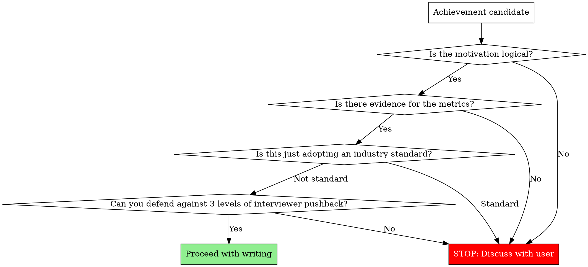

# Make Resume

Every single line on a resume is a **seed for an interview conversation**. When the interviewer asks "Why?", can you present a logically coherent story? That is the only criterion.

## Absolute Rules

1. **Never fabricate metrics.** If the user doesn't provide numbers, ask. Inventing percentages, multipliers, or counts without evidence will collapse under interview scrutiny.
2. **Never uncritically accept the user's premise.** If they say "150ms was the problem," push back: "Isn't 150ms acceptable?" Unrealistic premises get exposed in interviews.
3. **Never claim industry standards as achievements.** Webhook-based payment processing is already the standard. "Introduced" is not an achievement — only what you built ON TOP of the standard counts.

## Pre-Writing Validation

Before writing any achievement, walk through these questions in order. If any answer is "No," stop writing and discuss with the user.



## Achievement Line Structure

```
[Target context] + [Technical action] + [Measurable outcome]
```

| Bad example | Problem | Good example |
|-------------|---------|--------------|
| Reduced DB CPU by introducing Redis cache | No context on what was cached | Applied Redis cache to product list/detail APIs, reducing peak-hour DB CPU from 90% to 50% |
| Improved payment system | No specifics on what or how | Built payment-order state sync scheduler, reducing weekly payment-order mismatches from 15 to 0 |
| Introduced webhook-based async payment system | This is already the standard | Built payment state sync scheduler to handle webhook delivery failures |

## Career Section vs Problem-Solving Section

| Section | Role | Tone | Unit |
|---------|------|------|------|
| Career | Skim-and-hook | "Built [system] achieving [outcome]" | System/Feature |
| Problem-solving | Deep narrative | Problem recognition → Definition → Solution → Outcome | Problem |

Never put problem descriptions like "Resolved payment-order state inconsistency" in the career section. That belongs in the problem-solving section.

## Technical Keyword Selection

Choose specific keywords that invite rich follow-up questions.

| Abstract (avoid) | Specific (use) | Interview questions it invites |
|-------------------|----------------|-------------------------------|
| Auto-recovery system | Sync scheduler | Interval? Concurrent execution prevention? |
| Performance optimization | Redis cache | TTL strategy? Invalidation timing? |
| Message-based processing | Kafka | Partition design? At-least-once guarantee? |

## Interview Simulation (Mandatory)

After writing each achievement line, run this simulation:

1. **"How did you implement this?"** (Implementation method)
2. **"Why did you choose that approach?"** (Technical judgment rationale)
3. **"Did you consider any alternatives?"** (Trade-off awareness)

If you can't answer all 3 levels, that line will hurt more than help.

## Red Flags — If You Think This, STOP

| Thought | Reality |
|---------|---------|
| "There are no metrics, so I'll just make some up" | Fabricated metrics collapse in interviews. Ask the user. |
| "The user said this, so I'll write it as-is" | If the premise is unrealistic, the interviewer will catch it. Verify first. |
| "This is obviously an achievement" | If it's an industry standard, it's not an achievement. Only what's built on top counts. |
| "It's just the career section, keep it simple" | Even simple lines must follow [Target] + [Action] + [Outcome]. |
| "It's problem-solving, so list the technologies" | It's not a tech list — it's a narrative. Why → How → Result. |
| "The user said just polish, don't change content" | "Just polish" does NOT override validation. Polishing flawed lines makes them look more credible but equally vulnerable in interviews. Run the flowchart on every line regardless. |
| "They already wrote it, I'll just clean up the grammar" | Pre-written lines need the SAME validation as new ones. Sunk cost is not a reason to skip checks. |

## 시그니처 프로젝트 (P.A.R.R.)

### 왜 시그니처 프로젝트인가

1페이지 남은 공간에 당신의 최고급 스테이크를 선보이고, "네가 개발하면서 만났던 가장 어려운 문제는?" 이라는 질문에 완벽하게 답하는 것.

**40초 규칙:**
- 이력서는 민주주의가 아닙니다. 모든 프로젝트를 똑같이 다룰 필요가 없습니다.
- 1페이지에서 설득하지 못하면 끝입니다.
- 팀장은 40초 중 30초를 1페이지에 씁니다. 2페이지는 보지 않습니다.
- 그래서 1페이지 남은 공간 전부를 단 하나의 프로젝트에 몰빵합니다.

**레이아웃:**
- 경력/교육: 6~8줄
- 시그니처 프로젝트: 남은 공간 전부 (15~25줄)
- 1페이지를 약간 넘어가도 괜찮습니다 (단, 2페이지를 다 채우면 안 됨)

**면접 질문 연결:**
이 프로젝트는 면접관이 100% 물어볼 질문에 대한 답입니다:
"네가 개발하면서 만났던 가장 어려웠던 문제가 뭐야?"
화이트보드 앞에 선 것처럼, 면접관 바로 앞에 앉은 것처럼 이 프로젝트를 설명해야 합니다.

### 프로젝트 선택 기준

당신의 모든 경험 중 가장 자랑스러운 프로젝트 1개를 선택하십시오. 선택 기준:
1. 기술적으로 가장 어려웠던 문제인가?
2. 여러 번 시도하고 실패한 과정이 있는가?
3. "왜?"라는 질문을 스스로에게 던졌는가?
4. CS 지식을 깊이 파고든 흔적이 있는가?
5. 데이터로 검증한 결과가 있는가?

### P.A.R.R. + 엔지니어링 깊이

P.A.R.R. 공식을 완전한 형태로 적용하되, 단순한 기술 나열이 아닌 사고 과정의 깊이를 보여줘야 합니다.

**Problem (문제):**
왜 이 문제가 중요한가? 비즈니스 리스크는? 문제의 본질은?

**Approach (접근):**
- 단순 기술 선택이 아님: "Redis 썼습니다" (X)
- 깊이있는 탐구: "왜 락이 필요한가?", "락 없이 못 푸나?", "왜 이 방식인가?"
- 시도했던 실패들, 각 대안의 한계를 깨달은 과정
- CS 지식으로 파고든 흔적 (격리 수준, MVCC, CAP 이론 등)

**Result (결과):**
- 단순 부하 테스트가 아님
- Race Condition을 의도적으로 재현한 검증
- 극한 시나리오, Failover 시나리오 테스트

**Reflection (회고):**
- 배운 것의 본질 (트레이드오프, 한계 인정)
- 솔직한 고백 ("처음엔...", "3일 밤을 새우며...")
- 다음 개선 방향

### 작성 템플릿

```
[문제] 문제의 본질은 무엇인가?
[해결]
  시도 1: 실패, 왜 안 됐는가?
  시도 2: 실패, 무엇을 깨달았는가?
  시도 3: 성공, 왜 이것인가?
[검증] 어떻게 증명했는가?
[회고] 무엇을 배웠는가? 한계는? 솔직한 고백은?
```

**최소 2-3단계의 시도→실패→깨달음 아크는 필수입니다.** 한 번에 성공한 이야기는 "누가 알려줘서 따라한 것"으로 읽힙니다.

### 서사 원칙

**기술 문서가 아닙니다. 당신의 사고 과정을 보여주는 이야기입니다.**

좋은 예:
- "처음엔 Redis만 쓰면 되는 줄 알았습니다"
- "하지만 멘토님의 '락 없이 못 푸나?' 질문에 3일 밤을 새웠습니다"
- "낙관적 락으로 950건이 실패하는 걸 보고 깨달았습니다"

나쁜 예:
- "Redis 분산 락을 사용했습니다"
- "부하 테스트 결과 성공했습니다"
- "성능이 개선되었습니다"

### Before/After 전문 비교

**Before — 기술 나열 (안티패턴):**
```
온라인 서점 쇼핑몰
• 선착순 쿠폰 발급 기능 개발
• Redis 분산 락 사용하여 동시성 문제 해결
Spring Boot, MySQL, Redis 사용
• JMeter로 부하 테스트 수행
• 성능 개선 완료
```

**Before의 문제점:**
- "Redis 사용", "동시성 해결" = 결과만 나열
- 왜 Redis인지, 다른 방법은 고민했는지 전혀 없음
- 사고 과정 제로, 엔지니어링 깊이 제로
- 팀장의 반응: "그래서 뭘 배웠는데?" (Skip)

**After — 김민준 서사 (골드 스탠다드):**
```
온라인 서점 - 선착순 쿠폰 시스템

[문제]
파이널 프로젝트 QA 중 치명적 버그 발견: 재고 100개 쿠폰이 152개 발급. 하지만 로컬 환경에서는 재현 안 됨.
Thread.sleep(100)을 강제 삽입해 동시성 상황 재현. 문제의 본질 파악: MySQL READ COMMITTED 격리 수준에서 두
트랜잭션이 동시 재고 조회 → MVCC 특성상 필연적 문제.

[해결 과정]
시도 1 - 락 없이 해결 가능한가?
낙관적 락 + CAS: 동시 1000건 중 950건 실패, 재시도 폭증. Exponential Backoff 최적화해도 평균 응답 1.2초.
DB 격리 수준 상향(SERIALIZABLE): Gap Lock 발생, 처리량 60% 감소. 거부.

시도 2 - 어떤 락인가?
비관적 락(SELECT FOR UPDATE): Lock Escalation으로 Table Lock 전이, 커넥션 풀 고갈, 응답 800ms.
Application Lock(synchronized): 단일 서버 작동, 하지만 Scale-out 불가. 서버 2대 실험 → 즉시 재현.
깨달음: 분산 환경 작동 락 필요.

시도 3 - 왜 Redis 분산 락인가?
Redis 선택 이유: Lua 스크립트 원자성, TTL 자동 해제, Single Thread로 Race Condition 차단.
Redisson vs 직접 구현: Spin Lock 비효율 vs Pub/Sub 기반 Wait/Notify. Redisson 선택.
Lock 설정 근거: Wait 3초(선착순 특성), Lease 5초(로직 최대 실행 시간+여유).

[검증]
JMeter 동시 100 Thread, Ramp-up 0초. 재고 100개 → 발급 100건, 중복 0건.
Lock Contention 측정: Redis MONITOR로 패턴 분석, 평균 대기 180ms, 최대 2.8초.
극한 시나리오: 재고 10개, 동시 500건 → 10건만 성공, 정합성 100%.

[회고]
배운 것: MVCC와 격리 수준 트레이드오프, 분산 시스템 일관성(CAP 정리), Redlock 알고리즘과 한계(Martin
Kleppmann 논문).
인정하는 한계: Redis SPOF, 멱등성 미보장. 해결 방향: Cluster/Sentinel, 발급 이력 테이블.
솔직한 고백: 처음엔 "Redis 쓰면 되겠지"였습니다. 멘토님 "락 없이 못 푸나?" 질문에 3일 밤새며 CAS, 격리 수준,
MVCC 공부. 비로소 이해: 문제는 답 찾기가 아니라 왜 그것이 답인지 설명하는 것.

→ 파이널 프로젝트 최우수상 (12팀 중 1위)
```

### 개선 이유 분석 (왜 After가 더 나은가)

- **문제 본질 파악**: "MVCC 특성상 필연적" — Before는 "동시성 문제"만 말하고 왜인지 모름
- **시도의 깊이**: 3단계 접근 (락 없이 → 어떤 락 → 왜 Redis) — Before는 바로 "Redis 사용"
- **각 시도의 실패와 이유**: "950건 실패", "처리량 60% 감소" — Before는 실패 과정 제로
- **Why 질문 반복**: "왜 락인가?", "왜 Redis인가?", "왜 Redisson인가?" — Before는 Why 제로
- **CS 지식 적용**: MVCC, CAP 정리, Redlock — Before는 기술명만 나열
- **검증 깊이**: 단순 테스트가 아닌 Lock Contention 분석 — Before는 "부하 테스트 수행"
- **한계 인정**: SPOF, 멱등성 — Before는 "성능 개선 완료"로 끝

### 시각 자료 기준

**넣어야 할 때:**
- 말로 설명하는 것보다 그림이 10배 빠르게 이해되는 경우
- 동시성 문제 Before/After 시나리오
- 3가지 이상 대안 비교표 (간결한 형태)

**넣지 말아야 할 때:**
- 억지로 화려하게 만든 그림
- 설명 없는 아키텍처 다이어그램
- 코드 스크린샷

김민준 페르소나의 경우, 시각 자료 없이도 텍스트만으로 충분히 강력합니다. 필요하다면 "락 없이 → 어떤 락 → 분산 락" 3단계 흐름을 간단한 화살표로 표현할 수 있습니다.

### 시그니처 프로젝트 Red Flags

| Thought | Reality |
|---------|---------|
| "기술 스택만 나열하면 되겠지" | 기술 나열 = 사고 과정 제로. Before 안티패턴 그 자체. |
| "한 번에 성공했어" | 한 번에 성공한 이야기는 "누가 알려줘서 따라한 것". 최소 2-3단계 시도→실패→깨달음 필수. |
| "회고에 뭘 배웠는지 쓰면 되잖아" | "분산 시스템을 배웠다"는 추상적. 구체적 트레이드오프, 인정하는 한계, 솔직한 고백이 필요. |
| "매일 밤새며 공부했다고 쓰면 감동적이잖아" | 자기 PR ≠ 엔지니어링 인사이트. "처음에 뭘 잘못 가정했는가?"가 핵심. |
| "왜 Redis인지는 당연하잖아" | "당연하다"는 사고 정지. "왜 락인가?→왜 Redis인가?→왜 Redisson인가?" Why 체인 필수. |
| "CS 이론은 과한 거 아니야?" | 격리 수준, MVCC, CAP 등 CS 지식이 사고 깊이의 증거. 기술명만 나열하는 것과의 차이. |
