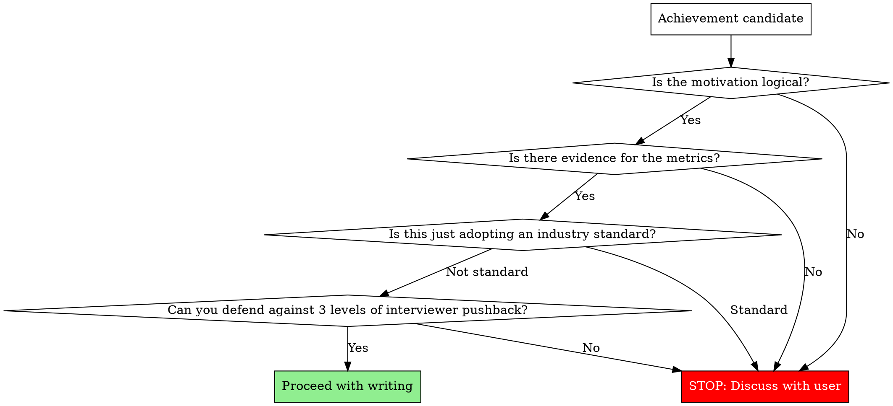

# Make Resume

Every single line on a resume is a **seed for an interview conversation**. When the interviewer asks "Why?", can you present a logically coherent story? That is the only criterion.

## Absolute Rules

1. **Never fabricate metrics.** If the user doesn't provide numbers, ask. Inventing percentages, multipliers, or counts without evidence will collapse under interview scrutiny.
2. **Never uncritically accept the user's premise.** If they say "150ms was the problem," push back: "Isn't 150ms acceptable?" Unrealistic premises get exposed in interviews.
3. **Never claim industry standards as achievements.** Webhook-based payment processing is already the standard. "Introduced" is not an achievement — only what you built ON TOP of the standard counts.

## Pre-Writing Validation

Before writing any achievement, walk through these questions in order. If any answer is "No," stop writing and discuss with the user.



## Achievement Line Structure

```
[Target context] + [Technical action] + [Measurable outcome]
```

| Bad example | Problem | Good example |
|-------------|---------|--------------|
| Reduced DB CPU by introducing Redis cache | No context on what was cached | Applied Redis cache to product list/detail APIs, reducing peak-hour DB CPU from 90% to 50% |
| Improved payment system | No specifics on what or how | Built payment-order state sync scheduler, reducing weekly payment-order mismatches from 15 to 0 |
| Introduced webhook-based async payment system | This is already the standard | Built payment state sync scheduler to handle webhook delivery failures |

## Career Section vs Problem-Solving Section

| Section | Role | Tone | Unit |
|---------|------|------|------|
| Career | Skim-and-hook | "Built [system] achieving [outcome]" | System/Feature |
| Problem-solving | Deep narrative | Problem recognition → Definition → Solution → Outcome | Problem |

Never put problem descriptions like "Resolved payment-order state inconsistency" in the career section. That belongs in the problem-solving section.

## Technical Keyword Selection

Choose specific keywords that invite rich follow-up questions.

| Abstract (avoid) | Specific (use) | Interview questions it invites |
|-------------------|----------------|-------------------------------|
| Auto-recovery system | Sync scheduler | Interval? Concurrent execution prevention? |
| Performance optimization | Redis cache | TTL strategy? Invalidation timing? |
| Message-based processing | Kafka | Partition design? At-least-once guarantee? |

## Interview Simulation (Mandatory)

After writing each achievement line, run this simulation:

1. **"How did you implement this?"** (Implementation method)
2. **"Why did you choose that approach?"** (Technical judgment rationale)
3. **"Did you consider any alternatives?"** (Trade-off awareness)

If you can't answer all 3 levels, that line will hurt more than help.

## Red Flags — If You Think This, STOP

| Thought | Reality |
|---------|---------|
| "There are no metrics, so I'll just make some up" | Fabricated metrics collapse in interviews. Ask the user. |
| "The user said this, so I'll write it as-is" | If the premise is unrealistic, the interviewer will catch it. Verify first. |
| "This is obviously an achievement" | If it's an industry standard, it's not an achievement. Only what's built on top counts. |
| "It's just the career section, keep it simple" | Even simple lines must follow [Target] + [Action] + [Outcome]. |
| "It's problem-solving, so list the technologies" | It's not a tech list — it's a narrative. Why → How → Result. |
| "The user said just polish, don't change content" | "Just polish" does NOT override validation. Polishing flawed lines makes them look more credible but equally vulnerable in interviews. Run the flowchart on every line regardless. |
| "They already wrote it, I'll just clean up the grammar" | Pre-written lines need the SAME validation as new ones. Sunk cost is not a reason to skip checks. |
