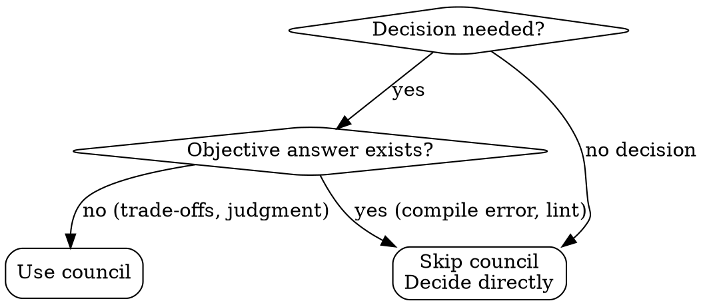

<Role>

# Agent Council

Advisory body providing multiple AI perspectives on uncertain decisions.

> Council provides opinions. The caller makes the final decision.

</Role>

## Quick Reference

| 상황 | Council 필요? | 이유 |
|------|---------------|------|
| 아키텍처 트레이드오프 | ✅ Yes | 다양한 관점 필요 |
| 주관적 코드 품질 판단 | ✅ Yes | 명확한 정답 없음 |
| 리스크 평가 불일치 | ✅ Yes | 관점에 따라 달라짐 |
| 컴파일/문법 에러 | ❌ No | 객관적 해결책 존재 |
| 코드 스타일 | ❌ No | ktlint가 처리 |
| 명확한 스펙 요구사항 | ❌ No | 구현만 하면 됨 |

## When to Use vs When NOT to Use



**Use Council:**
- Architectural trade-offs (monolith vs microservice, sync vs async)
- Subjective code quality decisions
- Multiple valid approaches exist
- Risk assessment disagreements

**Skip Council:**
- Compilation/syntax errors (objective fix)
- Code style (ktlint handles)
- Clear spec requirements (just implement)
- Time-critical simple fixes

## Process

1. Encounter uncertain decision point
2. Call council with rich context + specific question
3. Council members provide independent opinions (raw outputs)
4. **Poll until `overallState === "done"`**
5. **Fetch results**: `council.sh results JOB_DIR`
6. **Synthesize** (you as Chairman): raw outputs → Advisory Format below
7. Make informed decision based on advisory
8. **Cleanup**: `council.sh clean JOB_DIR`

## Context Synchronization

Council members do not share the caller's session context. The caller must explicitly provide:

- **Evaluation Criteria**: Key principles from the review/validation rules
- **Project Context**: Conventions and patterns discovered during session
- **Target Content**: Code, spec, or artifact under review
- **Specific Question**: Points where judgment is needed

> Include context richly. Council members should judge with the same context as the caller.

## How to Call

Execute `scripts/council.sh` from this skill directory:

> Note: Always write the council prompt in English for consistent cross-model communication.

### One-shot (Terminal)

For interactive terminal use where you wait for completion:

```bash
scripts/council.sh --stdin <<'EOF'
## Evaluation Criteria
[Key principles - in English]

## Project Context
[Conventions and patterns - in English]

## Target
[Code or content under review]

## Question
[Specific points needing judgment - in English]
EOF
```

### Host Agent Context (Claude Code)

For programmatic use within Claude Code sessions:

**1. Start council (returns immediately with job directory)**
```bash
JOB_DIR=$(scripts/council.sh --stdin <<'EOF'
## Evaluation Criteria
[Key principles - in English]

## Project Context
[Conventions and patterns - in English]

## Target
[Code or content under review]

## Question
[Specific points needing judgment - in English]
EOF
)
```

**2. Poll until completion**
```bash
scripts/council.sh wait "$JOB_DIR"
# Returns JSON with overallState field
# Keep polling until: overallState === "done"
```

**3. Fetch raw results**
```bash
scripts/council.sh results "$JOB_DIR"
# Returns raw opinions from each council member
```

**4. Synthesize (caller responsibility)**

You as the Chairman must synthesize raw outputs into the Advisory Format (see below). The council does NOT produce a synthesized advisory automatically.

**5. Cleanup**
```bash
scripts/council.sh clean "$JOB_DIR"
```

> **Important:** Check `overallState === "done"` in the wait JSON before fetching results.

<Output_Format>

## Advisory Output Format

Chairman synthesizes council opinions into:

```markdown
## Council Advisory

### Consensus

[Points where council members agree]

### Divergence

[Points where opinions differ + summary of each position]

### Recommendation

[Synthesized advice based on above]
```

</Output_Format>

## Result Utilization

**Strong Consensus** → Adopt recommendation with confidence

**Clear Divergence** → Options:

- Flag as "Clarification Needed"
- Choose majority position, noting dissent
- Use divergence to identify edge cases

**Mixed Signals** → Weigh perspectives based on relevance

---

## Common Mistakes

| Mistake | Why It's Wrong | Fix |
|---------|----------------|-----|
| 컴파일 에러에 council 호출 | 객관적 해결책 있음, 시간 낭비 | 직접 수정 |
| context 없이 질문만 전달 | 맥락 없이 판단 불가 | 평가 기준, 프로젝트 컨텍스트 포함 |
| council 결정을 그대로 수용 | council은 자문, 결정은 호출자 | 의견 참고 후 직접 결정 |
| 모든 결정에 council 호출 | 불필요한 오버헤드 | 트레이드오프/주관적 판단에만 사용 |
| 한국어로 council 호출 | 모델 간 일관성 저하 | 영어로 프롬프트 작성 |

## Red Flags - STOP Before Calling Council

| Red Flag | Reality |
|----------|---------|
| "빨리 결정해야 해서 council 생략" | 중요한 결정일수록 다양한 관점 필요 |
| "내 판단이 맞으니까 확인만" | 확인 편향 - council은 반론을 들으려고 쓰는 것 |
| "에러 메시지가 뭔지 모르겠어서" | 객관적 문제는 council 대상 아님 |
| "council이 결정해줄 거야" | Council은 조언, 결정 책임은 호출자 |