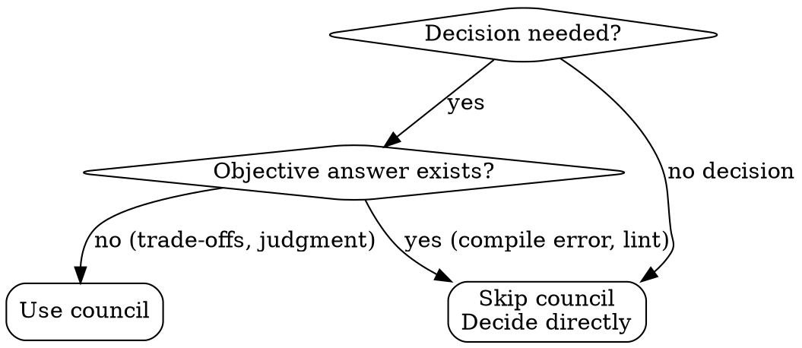

<Role>

# Agent Council

Advisory body providing multiple AI perspectives on uncertain decisions.

> Council provides opinions. The caller makes the final decision.

</Role>

## Quick Reference

| 상황 | Council 필요? | 이유 |
|------|---------------|------|
| 아키텍처 트레이드오프 | ✅ Yes | 다양한 관점 필요 |
| 주관적 코드 품질 판단 | ✅ Yes | 명확한 정답 없음 |
| 리스크 평가 불일치 | ✅ Yes | 관점에 따라 달라짐 |
| 컴파일/문법 에러 | ❌ No | 객관적 해결책 존재 |
| 코드 스타일 | ❌ No | ktlint가 처리 |
| 명확한 스펙 요구사항 | ❌ No | 구현만 하면 됨 |

## When to Use vs When NOT to Use


```dot
digraph council_decision {
    rankdir=TB;
    node [shape=box, style=rounded];

    start [label="Decision needed?", shape=diamond];
    objective [label="Objective answer exists?", shape=diamond];
    skip [label="Skip council\nDecide directly"];
    use [label="Use council"];

    start -> objective [label="yes"];
    start -> skip [label="no decision"];
    objective -> skip [label="yes (compile error, lint)"];
    objective -> use [label="no (trade-offs, judgment)"];
}
```

**Use Council:**
- Architectural trade-offs (monolith vs microservice, sync vs async)
- Subjective code quality decisions
- Multiple valid approaches exist
- Risk assessment disagreements

**Skip Council:**
- Compilation/syntax errors (objective fix)
- Code style (ktlint handles)
- Clear spec requirements (just implement)
- Time-critical simple fixes

## Process

1. Encounter uncertain decision point
2. Call council with rich context + specific question
3. Council members provide independent opinions (raw outputs)
4. **Collect**: `bun $SCRIPTS_DIR/council/job.ts collect JOB_DIR` — repeat until `overallState` is `"done"`
5. **Read each member's output file** via the Read tool
6. **Synthesize** (you as Chairman): raw outputs → Advisory Format below
7. Make informed decision based on advisory
8. **Cleanup**: `bun $SCRIPTS_DIR/council/job.ts clean JOB_DIR`

## Context Synchronization

Council members do not share the caller's session context. The caller must explicitly provide:

- **Evaluation Criteria**: Key principles from the review/validation rules
- **Project Context**: Conventions and patterns discovered during session
- **Target Content**: Code, spec, or artifact under review
- **Specific Question**: Points where judgment is needed

> Include context richly. Council members should judge with the same context as the caller.

## How to Call

```bash
SCRIPTS_DIR=$(ls -d .{claude,gemini,codex,opencode}/scripts 2>/dev/null | head -1)
```

Execute `bun $SCRIPTS_DIR/council/job.ts` from the project root:

> Note: Always write the council prompt in English for consistent cross-model communication.

### One-shot (Terminal)

For interactive terminal use where you wait for completion:

```bash
bun $SCRIPTS_DIR/council/job.ts start --stdin <<'EOF'
## Evaluation Criteria
[Key principles - in English]

## Project Context
[Conventions and patterns - in English]

## Target
[Code or content under review]

## Question
[Specific points needing judgment - in English]
EOF
```

### Host Agent Context (Claude Code)

For programmatic use within Claude Code sessions:

**CRITICAL**: Always set `timeout: 180000` on every Bash tool call.

**1. Start council (Bash, timeout: 180000)**
```bash
PROMPT_FILE=$(mktemp)
cat > "$PROMPT_FILE" << 'PROMPT_EOF'
## Evaluation Criteria
[Key principles - in English]

## Project Context
[Conventions and patterns - in English]

## Target
[Code or content under review]

## Question
[Specific points needing judgment - in English]
PROMPT_EOF
JOB_DIR=$(bun $SCRIPTS_DIR/council/job.ts start --stdin < "$PROMPT_FILE")
```
Output: JOB_DIR path (one line on stdout).

> **Important**: Write prompts in English for consistent cross-model communication.

**2. Collect results (Bash, timeout: 180000)**

Poll until all members complete. Re-run this step if not done.
```bash
bun $SCRIPTS_DIR/council/job.ts collect "$JOB_DIR"
```

Response JSON (done):
```json
{
  "overallState": "done",
  "id": "...",
  "members": [
    { "member": "claude", "outputFilePath": "/path/to/output.txt", "errorMessage": null },
    { "member": "gemini", "outputFilePath": "/path/to/output.txt", "errorMessage": null },
    { "member": "codex", "outputFilePath": null, "errorMessage": "timed_out" }
  ]
}
```

Response JSON (not done — re-run this step):
```json
{ "overallState": "running", "id": "...", "counts": { "total": 3, "done": 1, "running": 2, "queued": 0 } }
```

**3. Read raw outputs**

Use the Read tool to read each member's `outputFilePath` from the manifest.
Only read entries where `outputFilePath` is non-null (null = infrastructure failure; see Degradation Policy).

**4. Synthesize (caller responsibility)**

You as the Chairman must synthesize raw outputs into the Advisory Format (see below). The council does NOT produce a synthesized advisory automatically.

**5. Cleanup (Bash, timeout: 180000)**
```bash
bun $SCRIPTS_DIR/council/job.ts clean "$JOB_DIR"
```

### Synthesis Protocol

When synthesizing raw outputs:
1. Extract each reviewer's core position and key reasoning
2. Overlapping positions → Consensus
3. Conflicting positions → Divergence (report ALL, not majority)
4. Unique concerns from any reviewer → include in advisory
5. On divergence: consult Model Characteristics table to inform weighting. Cite the table when weighting one model's opinion higher.

## Model Characteristics (Synthesis Weighting)

> Last verified: 2026-02 (review quarterly as models update)

When synthesizing, weight each model's opinion based on the question domain:

| Member | Primary Strengths | Weight Higher When |
|--------|-------------------|-------------------|
| claude | Nuanced trade-off reasoning, instruction coherence across long context, risk/impact assessment | Architecture decisions, requirement ambiguity resolution, risk evaluation |
| codex | Code-level feasibility analysis, implementation cost/complexity estimation, API contract design | "Is this buildable?" questions, implementation approach choices, technical debt evaluation |
| gemini | Broad factual grounding, alternative solution discovery, edge case identification | Technology comparisons, "what are we missing?" questions, assumption challenges |

**Application rules:**
- On **consensus**: model strengths are irrelevant — report agreement as-is
- On **divergence**: reference the table above. If the question is about implementation feasibility and codex disagrees with claude and gemini, state: "Codex's position carries additional weight here as an implementation feasibility question (see Model Characteristics)"
- On **contradiction with table**: if a model gives a strong argument outside its listed strengths, the argument's quality overrides the table. Strengths are tie-breakers, not vetoes
- **Never discard** a model's opinion solely because the domain doesn't match its listed strengths

<Output_Format>

## Advisory Output Format

Chairman synthesizes council opinions into:

```markdown
## Council Advisory

### Consensus

[Points where council members agree]

### Divergence

[Points where opinions differ + summary of each position]

### Recommendation

[Synthesized advice. When model opinions diverge, note which model's expertise is most relevant to this domain and why — referencing Model Characteristics table]
```

</Output_Format>

## Result Utilization

**Strong Consensus** → Adopt recommendation with confidence

**Clear Divergence** → Options:

- Flag as "Clarification Needed"
- Choose majority position, noting dissent
- Use divergence to identify edge cases

**Mixed Signals** → Weigh perspectives based on relevance

**Partial Results** → Apply Degradation Policy. Synthesize from available responses, note missing perspectives.

---

## Common Mistakes

| Mistake | Why It's Wrong | Fix |
|---------|----------------|-----|
| 컴파일 에러에 council 호출 | 객관적 해결책 있음, 시간 낭비 | 직접 수정 |
| context 없이 질문만 전달 | 맥락 없이 판단 불가 | 평가 기준, 프로젝트 컨텍스트 포함 |
| council 결정을 그대로 수용 | council은 자문, 결정은 호출자 | 의견 참고 후 직접 결정 |
| 모든 결정에 council 호출 | 불필요한 오버헤드 | 트레이드오프/주관적 판단에만 사용 |
| 한국어로 council 호출 | 모델 간 일관성 저하 | 영어로 프롬프트 작성 |

## Red Flags - STOP Before Calling Council

| Red Flag | Reality |
|----------|---------|
| "빨리 결정해야 해서 council 생략" | 중요한 결정일수록 다양한 관점 필요 |
| "내 판단이 맞으니까 확인만" | 확인 편향 - council은 반론을 들으려고 쓰는 것 |
| "에러 메시지가 뭔지 모르겠어서" | 객관적 문제는 council 대상 아님 |
| "council이 결정해줄 거야" | Council은 조언, 결정 책임은 호출자 |

## Degradation Policy

Council members may fail due to CLI unavailability, timeout, or errors. This is NOT the same as quorum logic.

**Critical distinction:**
- **PROHIBITED quorum logic**: "2/3 responded, that's enough, skip the third" — this is giving up on a working member
- **PERMITTED degradation**: "2/3 responded, third member's CLI crashed (missing_cli/timed_out/error state)" — this is handling infrastructure failure

**Decision tree:**
1. `overallState === 'done'` AND all members have terminal states?
2. Check failed members' states:
   - `missing_cli` → CLI not installed. Degradation applies.
   - `timed_out` → CLI exceeded timeout. Degradation applies.
   - `error` (non-zero exit) → CLI failed. Degradation applies.
   - `canceled` → Manually stopped. Degradation applies.
3. Synthesize from successful members only.

**Synthesis by response count:**

| Responses | Action | Output Modification |
|-----------|--------|---------------------|
| 3/3 | Full synthesis | Standard advisory format |
| 2/3 | Partial synthesis | Prepend: "⚠️ Partial advisory (2/3 respondents). [failed_member] unavailable: [state]. The following synthesis lacks [failed_member]'s perspective ([see Model Characteristics for what this model typically contributes])." |
| 1/3 | Single response report | Prepend: "⚠️ Limited advisory (1/3 respondents). [failed_members] unavailable. Presenting single response from [available_member] without synthesis. Treat as individual opinion, not council advisory." |
| 0/3 | Failure report | "❌ Council advisory unavailable. All members failed: [list states]. No synthesis possible." |

**Partial synthesis rules:**
- Use "partial consensus (N/3 respondents)" when reporting agreement
- In Divergence section, note: "Note: [missing_member]'s perspective is absent. Based on Model Characteristics, this model typically contributes [strength area] — this gap may affect the advisory's completeness in that domain."
- Do NOT extrapolate what the missing model "would have said"
