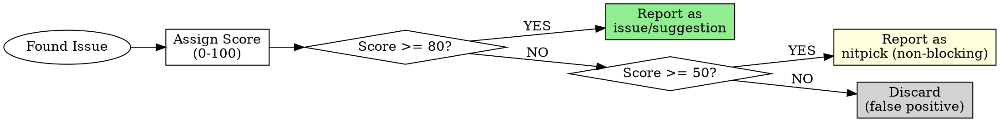

# Feedback Protocol

Guidelines for providing actionable, well-calibrated code review feedback.

---

## Confidence Scoring (MANDATORY)

**Every issue MUST include a confidence score.** Score determines whether to report.

### Scoring Scale

| Score | Meaning | Criteria | Report? |
|-------|---------|----------|---------|
| **0** | False positive | Doesn't hold up to light scrutiny. Pre-existing issue. | NO |
| **25** | Uncertain | Might be real, might be false positive. Unable to verify. Style issue not in documented standards. | NO |
| **50** | Real but minor | Verified issue, but nitpick. Rarely happens in practice. Low importance relative to rest of change. | As `nitpick (non-blocking)` |
| **75** | High confidence | Double-checked and verified. Likely to occur in practice. Important, directly impacts functionality. | YES |
| **100** | Absolute certainty | Confirmed issue. Will happen frequently. Evidence directly proves it. | YES |

### Threshold Rule

**Report only issues scoring 80+.** Lower scores are filtered automatically.



### Scoring Checklist

Before assigning a score, verify:

| Question | YES adds points | NO subtracts points |
|----------|-----------------|---------------------|
| Can you demonstrate the failure? | +30 | -30 |
| Is it in code changed by this PR? | +20 | -50 (disqualify) |
| Does documented standard prohibit this? | +20 | -10 |
| Would a senior engineer flag this? | +15 | -20 |
| Will it cause problems in production? | +15 | -10 |

### Example

```markdown
issue (blocking) [Confidence: 85]: SQL injection vulnerability

**What:** User input directly interpolated into query string.
**Evidence:** Line 42: `query = f"SELECT * FROM users WHERE id = {user_id}"`
**Why 85:** Demonstrable failure (+30), in changed code (+20), security standard (+20), senior would flag (+15) = 85
```

---

## Rich Feedback Protocol (MANDATORY)

**Every issue MUST be actionable.** Provide full context so the implementer can make informed decisions.

### Required Components

| Component | Purpose | Question Answered |
|-----------|---------|-------------------|
| **What** | Identify the problem | What exactly is wrong? |
| **Why** | Explain the reasoning | Why does this matter? |
| **How** | Provide solutions (1+) | How can this be fixed? |
| **Tradeoff** | Compare alternatives | What are the pros/cons of each approach? |
| **Benefit** | Motivate the change | What improves after fixing? |

### Format

```markdown
<label> [Confidence: N]: <subject>

**What:** [Specific problem description]
**Why:** [Reasoning - why this matters, what could go wrong]
**How:**
  - Option A: [solution] -> [tradeoff]
  - Option B: [solution] -> [tradeoff]
**Benefit:** [What improves after fixing]
```

### Bad vs Good Examples

**BAD: Vague, no context, no alternatives**
```
issue: Variable name is unclear.
```

**BAD: States problem but no reasoning or solutions**
```
issue: This function is too long and should be refactored.
```

**GOOD: Complete, actionable feedback**
```
suggestion [Confidence: 75]: Extract validation logic into separate function

**What:** `processOrder()` at line 45-120 handles both validation and processing (75 lines).
**Why:** Violates Single Responsibility. Testing validation requires mocking entire order flow.
         When validation rules change, risk of breaking processing logic.
**How:**
  - Option A: Extract `validateOrder()` -> Clean separation, but adds one more function to maintain
  - Option B: Use validation decorator/middleware -> More flexible, but adds indirection
**Benefit:** Independent testability, clearer boundaries, easier rule changes.
```

**GOOD: Security issue with full context**
```
issue (blocking) [Confidence: 90]: SQL injection vulnerability

**What:** Line 42: `query = f"SELECT * FROM users WHERE id = {user_id}"`
**Why:** Attacker can inject `; DROP TABLE users; --` via user_id parameter.
         No input sanitization. Direct string interpolation into query.
**How:**
  - Option A: Use parameterized query `cursor.execute("SELECT * FROM users WHERE id = ?", (user_id,))`
             -> Standard solution, works everywhere
  - Option B: Use ORM (SQLAlchemy, etc.) -> More abstraction, prevents class of errors
**Benefit:** Eliminates SQL injection attack vector. Passes security audit.
```

### Red Flags for Feedback Quality

| Bad Pattern | Problem | Fix |
|-------------|---------|-----|
| "This is wrong" | No explanation | Add **Why** |
| "Fix this" | No guidance | Add **How** with options |
| "Should be X" | No tradeoffs | Add alternatives and tradeoffs |
| "Not good" | Subjective | Provide concrete evidence |
| Single solution only | No choice | Always provide 2+ options |

---

## Validation (Before Posting)

For each issue found:

| Check | Question |
|-------|----------|
| Can you **quote** the specific line? |
| Can you **explain** why it's wrong? |
| Can you **demonstrate** the failure case? |
| Have you **confirmed** it's not intentional? |

**If ANY answer is NO, do NOT post that comment.**

---

## Conventional Comments

Format: `<label> [decorations]: <subject>`

### Labels

| Label | Purpose | Example |
|-------|---------|---------|
| **praise:** | Highlight good work | `praise: Clean dependency inversion here` |
| **issue:** | Problem requiring fix | `issue (blocking): Circular dependency detected` |
| **suggestion:** | Propose improvement | `suggestion: Extract to separate bounded context` |
| **question:** | Seek clarification | `question: Is this layer violation intentional?` |
| **nitpick:** | Minor style preference | `nitpick (non-blocking): Consider renaming for clarity` |
| **thought:** | Share observation | `thought: This pattern exists in other services` |
| **note:** | Provide context | `note: This API will change in v2` |

### Decorations

| Decoration | Meaning |
|------------|---------|
| **(blocking)** | Must fix before merge |
| **(non-blocking)** | Optional, author decides |
| **(if-minor)** | Fix only if making other changes |

### Example

```
issue (blocking): Circular dependency between services

OrderService -> PaymentService -> OrderService creates a cycle.
This makes testing difficult and indicates unclear boundaries.

// Current
class PaymentService {
    constructor(private orderService: OrderService) {}  // X
}

// Suggested: Use event or extract shared interface
class PaymentService {
    constructor(private orderRepository: OrderRepository) {}  // OK
}
```
