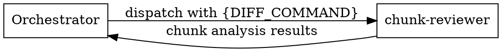
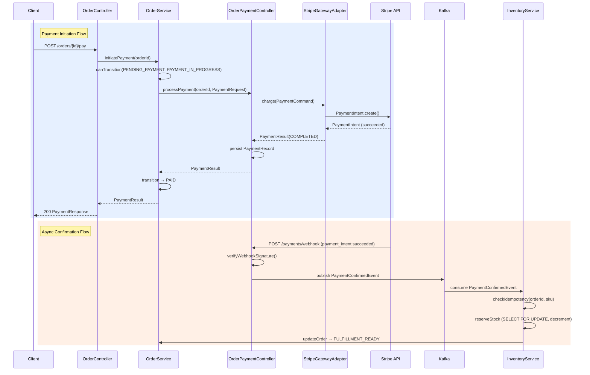

# Code Review

Orchestrates chunk-reviewer agents against diffs. Handles input parsing, context gathering, chunking, and result synthesis.

## Input Modes

```bash
# PR (number or URL)
/code-review pr 123
/code-review pr https://github.com/org/repo/pull/123

# Branch comparison
/code-review main feature/auth

# Auto-detect (current branch vs origin/main or origin/master)
/code-review
```

## Do vs Delegate Decision Matrix

| Action | YOU Do | DELEGATE |
|--------|--------|----------|
| Requirements 3-question gate | Yes | - |
| Diff range determination & git | Yes | - |
| Chunking decision | Yes | - |
| Walkthrough/critique synthesis | Yes | - |
| Walkthrough context enrichment | NEVER | explore |
| Cross-file impact / design fit (Phase 1 only) | NEVER | oracle |
| Individual chunk review | NEVER | chunk-reviewer |
| Code modification | NEVER | (forbidden entirely) |

**RULE**: Orchestration, synthesis, decisions = Do directly. Convention search, impact analysis, chunk review = DELEGATE. Code modification = FORBIDDEN.

### Role Separation



**Your role as orchestrator:**
- Dispatch chunk-reviewer agents with diff command strings
- Synthesize chunk analysis results into walkthrough + critique
- Make chunking decisions and determine final verdict

**NOT your role:**
- Reading raw diff content (never run `git diff` without `--stat` or `--name-only`)
- Reviewing code directly
- Loading changed file content via Read tool

### Context Budget

**Allowed in orchestrator context:**
- `git diff {range} --stat` output
- `git diff {range} --name-only` output
- `git log {range} --oneline` output
- CLAUDE.md file content
- explore/oracle agent summaries (Phase 1a)
- chunk-reviewer results

**Forbidden in orchestrator context:**
- Raw diff lines (`git diff` without `--stat`/`--name-only`)
- `Read` tool on diff target source files
- Any tool that loads changed file content into orchestrator context

**RULE**: If a command would put diff lines or source code into your context, it is forbidden. Only metadata (stats, file names, commit messages) and agent outputs are allowed.

## Step 0: Requirements Context

Three-question gate — adapt by input mode:

**PR mode:**
1. Auto-extract PR metadata:
   `gh pr view <number> --json title,body,labels,comments,reviews`
2. Scan PR body and comments for references to related documents (previous PRs, issues, Jira tickets, design docs, external URLs, review threads, etc.):
   - GitHub refs (`#123`) → fetch context via `gh pr view` or `gh issue view`
   - Non-fetchable references (Jira, Notion, Confluence, etc.) → note for user inquiry
3. If description is substantial (>1 sentence): proceed with auto-extracted context, confirm with user: "Extracted requirements from PR description: [summary]. Anything to add?"
4. If description is thin AND no linked references found: ask user "Do you have core requirements or a spec for this PR?"
5. If non-fetchable external references found, ask user: "The PR references these external documents: [links]. Please share relevant context if available. (If not, review will proceed with available information)"

**Branch comparison mode:**
Ask user: "What was implemented on this branch? If there are original requirements/spec, please share."

**Auto-detect mode:**
1. Infer from commit messages (`git log --oneline`)
2. Ask user: "Do you have requirements/spec for the recent work? (If not, review will focus on code quality)"

**User deferral** ("없어", "그냥 리뷰해줘", "skip"):
→ Set {REQUIREMENTS} = "N/A - code quality review only"
→ Proceed without blocking

**Vague Answer Handling:**
- Explicit deferral ("없어", "skip", "그냥 해줘") → Treat as N/A and proceed
- Vague answer → Refine with follow-up question:

| User says | Follow-up |
|-----------|-----------|
| "대충 있어" / "뭐 좀 있긴 한데" | "Where can I find them? (PR description, Notion, Jira, etc.)" |
| "그냥 성능 개선이야" | "What specific metrics were you trying to improve? (latency, throughput, memory, etc.)" |
| "여러 가지 고쳤어" | "What are the 1-2 most important changes? I'll identify the rest from code." |

Rule: 2 consecutive vague answers → Declare "I'll identify the context directly from the code" and proceed. No infinite questioning.

**Question Method:**

| Situation | Method |
|-----------|--------|
| 2-4 structured choices (review scope, severity threshold) | AskUserQuestion tool |
| Free-form / subjective (intent, context, concerns) | Plain text question |

**Question Quality Standard:**

| BAD | GOOD |
|-----|------|
| "요구사항이 있나요?" | "Do you have core requirements or a spec for this PR? (If not, review will focus on code quality)" |
| "어떤 부분을 볼까요?" | "23 files changed. Any specific area to focus on? (If not, I'll review everything)" |
| "테스트 있나요?" | "Do you have test coverage standards? (e.g., 80% line coverage, mandatory scenarios, etc.)" |

Rule: Every question must include a default action in parentheses. Ensure progress is possible even without user response.

**One Question Per Message:**
One question at a time. Proceed to the next question only after receiving an answer. Never bundle multiple questions in a single message.

**Step 0 Exit Condition:**
Proceed to Step 1 when any of the following are met:
- Requirements captured (PR description, user input, or spec reference)
- User explicitly deferred ("skip", "없어", "그냥 리뷰해줘")
- 2-strike vague limit reached → proceed with code-quality-only review

**Context Brokering:**
- DO NOT ask user about codebase facts (file locations, patterns, architecture)
- USE explore/oracle in Step 5 Phase 1 for codebase context
- ONLY ask user about: requirements, intent, specific concerns

## Step 1: Input Parsing

Determine range and setup for subsequent steps:

| Input | Setup | Range |
|-------|-------|-------|
| `pr <number or URL>` | Fetch PR ref locally (see below) | `origin/<baseRefName>...pr-<number>` |
| `<base> <target>` | (none — branches already local) | `<base>...<target>` |
| (none) | Detect default branch (`origin/main` or `origin/master`) | `<default>...HEAD` |

### PR Mode: Local Ref Setup (NO checkout)

Fetch the PR ref and base branch without switching the current branch:

```bash
# 1. Get base branch name
BASE_REF=$(gh pr view <number> --json baseRefName --jq '.baseRefName')

# 2. Fetch PR ref and base branch (no checkout — user's working directory untouched)
git fetch origin pull/<number>/head:pr-<number>
git fetch origin ${BASE_REF}
```

The range `origin/<baseRefName>...pr-<number>` uses three-dot syntax to show only changes introduced by the PR (not changes on the base branch since the PR branched).

All subsequent steps use `{range}` from this table. All diff commands use `git diff {range} -- <files>` for path-filtered output.

## Early Exit

After Input Parsing, before proceeding to Step 2:

1. Run `git diff {range} --stat` (using the range determined in Step 1)
2. If empty diff: report "No changes detected (between <base> and <target>)" and exit
3. If binary-only diff: report "Only binary file changes detected" and exit

## Step 2: Context Gathering

Collect in parallel (using `{range}` from Step 1):

1. `git diff {range} --stat` (change scale)
2. `git diff {range} --name-only` (file list)
3. `git log {range} --oneline` (commit history)
4. CLAUDE.md files: repo root + each changed directory's CLAUDE.md (if exists)

## Step 3: Chunking Decision

Determine scale from `--stat` summary line (`N files changed, X insertions(+), Y deletions(-)`):

| Condition | Strategy |
|-----------|----------|
| Total changed lines (insertions + deletions) < 1500 AND changed files < 30 | Single review |
| Total changed lines >= 1500 OR changed files >= 30 | Group into chunks by directory/module affinity |

Chunking heuristic: group files sharing a directory prefix or import relationships.

**Per-chunk size guide:**
- Target ~1500 lines per chunk (soft guide — files are the atomic unit)
- If adding the next file exceeds ~1500 lines, start a new chunk
- If a single file alone exceeds ~1500 lines, it becomes its own chunk
- If a directory group is oversized, split by subdirectory; if still oversized (flat structure), batch alphabetically (~10-15 files per chunk)

### Per-Chunk Diff Command Construction

For each chunk, construct the diff command string using git's native path filtering:

```bash
git diff {range} -- <file1> <file2> ... <fileN>
```

The orchestrator constructs this command string but does NOT execute it. The command is passed to the chunk-reviewer via {DIFF_COMMAND}, and each reviewer CLI executes it independently.

## Step 4: Agent Dispatch

1. Read dispatch template from `chunk-reviewer-prompt.md`
2. Interpolate placeholders with context from Steps 0-2:
   - {WHAT_WAS_IMPLEMENTED} ← Step 0 description
   - {DESCRIPTION} ← Step 0 or commit messages
   - {REQUIREMENTS} ← Step 0 requirements (or "N/A - code quality review only")
   - {FILE_LIST} ← Step 2 file list
   - {DIFF_COMMAND} ← diff command string: `git diff {range}` (single chunk) or `git diff {range} -- <chunk-files>` (multi-chunk). Orchestrator constructs this string but does NOT execute it.
   - {CLAUDE_MD} ← Step 2 CLAUDE.md content (or empty)
   - {COMMIT_HISTORY} ← Step 2 commit history
3. Dispatch `chunk-reviewer` agent(s) via Task tool (`subagent_type: "chunk-reviewer"`) with interpolated prompt

**Dispatch rules:**

| Scale | Action |
|-------|--------|
| Single chunk | 1 agent call |
| Multiple chunks | Parallel dispatch -- all chunks in ONE response. Each chunk gets its own interpolated template with chunk-specific {DIFF_COMMAND} and {FILE_LIST} |

### Result Scope Validation

After all agents return, before proceeding to Step 5, validate that each chunk-reviewer analyzed the correct files:

1. Compare each agent's **Chunk Analysis section headers** (file names) against the chunk's **{FILE_LIST}**
2. If an agent analyzed files outside its assigned chunk, **re-dispatch** that chunk with the same interpolated prompt

## Step 5: Walkthrough Synthesis + Result Synthesis

After all agents return, produce the final output in two phases.

### Phase 1: Walkthrough Synthesis (MANDATORY)

Orchestrator directly produces the Walkthrough from:
- All chunk Chunk Analysis sections (raw comprehension material from chunk-reviewer agents)
- Step 2 context (CLAUDE.md, commit history) + Phase 1a results (if any)

**Execution order:** First evaluate Phase 1a (context enrichment). Then generate the sections below.

### Phase 1a: Context Enrichment (Conditional)

After reading all chunk Chunk Analysis sections, assess whether the available information is sufficient to write the Walkthrough. If gaps exist, dispatch explore/oracle before writing Phase 1 output.

**When to dispatch:**

| Trigger | Agent | Example |
|---------|-------|---------|
| Core Logic Analysis requires understanding cross-module relationships not visible from chunk analysis | explore | "Chunk A shows OrderService calling PaymentGateway, but the gateway's implementation and other consumers are in Chunk B's scope or outside the diff" |
| Architecture Diagram requires understanding existing class/module hierarchy beyond what's in the diff | explore | "New class extends BaseRepository but the base class and its other subclasses are not in any chunk" |
| Chunk-reviewer Cross-File Concerns section flags architectural patterns requiring codebase investigation | oracle | "Cross-file concern: adapter error codes may not match controller expectations — need to verify existing error handling contract" |
| Multiple chunks flag inconsistent patterns suggesting architectural misalignment | oracle | "Chunk A uses Result<T> for error handling, Chunk B uses exceptions — need to determine which is the project convention" |

**When NOT to dispatch:**

| Condition | Reason |
|-----------|--------|
| Simple changes (test-only, doc-only, config-only, single-function logic) | Chunk analysis is self-sufficient |
| Chunk analysis provides complete understanding of all changed modules | No gaps to fill |
| Trivial diff (< 5 files, < 100 lines) | Sparse analysis is expected, not a gap |
| Cross-File Concerns section is empty across all chunks | No architectural investigation needed |

**Dispatch rules:**
- At most 1 explore and 1 oracle per review (never per-chunk)
- explore and oracle may be dispatched in parallel if both are needed
- If agent returns empty or times out, proceed with synthesis using available data

**Explore prompt structure** (4-Field, chunk-analysis-aware):
```
Task(subagent_type="explore", prompt="
[CONTEXT] Reviewing changes to {file_list}. Chunk analysis revealed: {specific_gap_from_chunk_analysis}.
[GOAL] Fill the context gap identified during walkthrough synthesis to produce accurate Core Logic Analysis and Architecture Diagram.
[DOWNSTREAM] Output used by orchestrator to write Phase 1 Walkthrough — not injected into any reviewer prompt.
[REQUEST] Find: {targeted_search_based_on_gap}. Return file paths with pattern descriptions. Skip unrelated directories.")
```

**Oracle dispatch** (same trigger announcement pattern):
```
Consulting Oracle for [specific gap from chunk analysis].
```
Oracle receives the specific chunk-reviewer findings that triggered the dispatch, not generic diff metadata.

**Data flow:**
```
Phase 1: Read all Chunk Analysis sections
       → Assess: sufficient for Walkthrough? (check decision table)
       → If gaps: dispatch explore/oracle (Phase 1a)
       → Write Walkthrough using: Chunk Analysis + Step 2 metadata + Phase 1a results (if any)
```

#### Change Summary
- 1-2 paragraph prose summary of the entire change's purpose and context
- Include motivation, approach taken, and overall impact
- Written for someone unfamiliar with the code to understand the change

#### Core Logic Analysis
- Consolidate all chunk Chunk Analyses into a unified module/feature-level narrative
- Cover both core changes AND supporting/peripheral changes
- Explain data flow, design decisions, and side effects from the perspective of inter-module relationships
- Level of detail: enough to understand the full change WITHOUT reading the code

#### Architecture Diagram
- Mermaid class diagram or component diagram
- Show changed classes/modules and their relationships (inheritance, composition, dependency)
- Distinguish new vs modified elements
- If no structural changes (e.g., logic-only changes within existing methods): write "No structural changes — existing architecture preserved"

#### Sequence Diagram
- Mermaid sequence diagram visualizing the primary call flow(s) affected by the changes
- Include actors, method calls, return values, and significant conditional branches
- If no call flow changes (e.g., variable rename, config change): write "No call flow changes"

### Phase 2: Critique Synthesis

For multi-chunk reviews:

1. **Merge** all Strengths, Issues, Recommendations sections
2. **Deduplicate** issues appearing in multiple chunks
   - When the same issue appears across chunks at different P-levels, promote to the highest P-level (e.g., P1 in Chunk A + P0 in Chunk B → promote to P0)
3. **Identify cross-file concerns** -- issues spanning chunk boundaries (e.g., interface contract mismatches, inconsistent error handling patterns)
4. **Normalize severity labels** across chunks using P0 / P1 / P2 / P3 scale. When the same issue appears in multiple chunks at different P-levels, promote to the highest P-level and note the discrepancy.
5. **Collect per-model verdicts** from all chunks for Final Adjudication
6. **Produce unified critique** (Strengths / Issues / Recommendations / Assessment)

For single-chunk reviews, Phase 2 still performs Final Adjudication (severity adjudication, P0 protection, verdict determination, Out of Scope classification) on the single chunk's results before producing final output.

#### Step 7: Final Severity Adjudication

**Order of operations:** Adjudicate per-model severity within each chunk FIRST. Then normalize across chunks by promoting to the highest adjudicated P-level.

| Condition | Action |
|-----------|--------|
| All models agree on P-level | Adopt as-is |
| Models disagree on P-level | Orchestrator evaluates each model's reasoning against P0-P3 rubric (3-axis: impact delta, probability, maintainability) and assigns final P-level with 1-2 sentence justification |

**P0 Protection Rule:** If ANY single model assigns P0 AND its reasoning satisfies the P0 rubric criteria (outage/data loss/security + triggered in normal operation), the final P-level MUST NOT be lower than P0. If reasoning does NOT satisfy P0 criteria, orchestrator may downgrade with explicit justification.

Under degradation (fewer responding models), P0 protection still applies — a single responding model's P0 is protected if rubric criteria are satisfied.

#### Step 8: Final Verdict Determination

| Condition | Verdict |
|-----------|---------|
| P0 issues unresolved | **No** |
| Only P1 issues unresolved | Orchestrator discretion — **Yes with conditions** possible (justification required) |
| Only P2/P3 issues | **Yes** |

#### Step 9: Out of Scope Classification

1. Collect issues tagged `[Pre-existing]` by reviewers
2. Place in `### Out of Scope (Pre-existing Issues)` section
3. Sort by P-level (P0 > P1 > P2 > P3), then by file path within same level
4. These do NOT affect merge verdict

**Exception:** If PR aggravates a pre-existing issue (increases blast radius, frequency, or severity), move to main issues section.

**Cross-chunk rule:** If ANY model in ANY chunk flags an issue as non-pre-existing (on a changed line), treat as current issue in main section.

### Final Output Format

```
## Walkthrough

### Change Summary
[Generated in Phase 1]

### Core Logic Analysis
[Generated in Phase 1]

### Architecture Diagram
[Generated in Phase 1 — Mermaid or "No structural changes — existing architecture preserved"]

### Sequence Diagram
[Generated in Phase 1 — Mermaid or "No call flow changes"]

---

## Strengths
[Generated in Phase 2]

## Issues

### P0 (Must Fix)
[Per-issue with 5-field format + Review Consensus]

### P1 (Should Fix)
[Per-issue with 5-field format + Review Consensus]

### P2 (Consider Fix)
[Per-issue with 5-field format + Review Consensus]

### P3 (Optional)
[Per-issue with 5-field format + Review Consensus]

Per-issue format:
**[P{X}] {issue title}**
- **File**: {file}:{line}
- **Problem**: ...
- **Impact**: ...
- **Probability**: ...
- **Maintainability**: ...
- **Fix**: ...
- **Review Consensus**: {N}/3 models identified ({Model A} P{X}, {Model B} P{Y}; adjudicated P{Z} because {reason})

## Out of Scope (Pre-existing Issues)
[Issues in unchanged context lines, sorted by P-level then file path. Do not affect merge verdict.]

## Recommendations
[Generated in Phase 2]

## Assessment
[Generated in Phase 2]
```

### Example Final Output

Synthesized from 3 chunks: (A) Order API + domain, (B) Payment integration, (C) Inventory + messaging.

````
## Walkthrough

### Change Summary
Implements end-to-end order payment flow for the e-commerce platform, spanning three domains: order lifecycle management (creation, validation, state transitions), payment gateway integration (Stripe charge creation, webhook handling, refund support), and inventory reservation (stock deduction on payment confirmation with Kafka-based async messaging). The PR introduces 9 new files and modifies 3 existing files across the API, domain, infrastructure, and messaging layers. Orders transition through a state machine (`CREATED` → `PENDING_PAYMENT` → `PAYMENT_IN_PROGRESS` → `PAID` → `FULFILLMENT_READY`), with inventory reserved asynchronously on payment confirmation via a Kafka event. A Flyway migration adds the `payment_records` and `inventory_reservations` tables to support the new flows.

### Core Logic Analysis

**Order Lifecycle (order/)**:
`OrderController.kt` exposes `POST /api/v1/orders` for creation and `POST /api/v1/orders/{id}/pay` to initiate payment. `OrderService.kt` owns the order state machine — `canTransition()` validates allowed state changes, `initiatePayment()` transitions from `CREATED`/`PENDING_PAYMENT` to `PAYMENT_IN_PROGRESS` and delegates to the payment layer. `OrderRepository.kt` extends Spring Data JPA with a custom `findByIdWithLock()` using `@Lock(PESSIMISTIC_WRITE)` to prevent concurrent payment attempts on the same order. The state machine is enforced at the service layer, not via DB constraints — this means invalid transitions are caught in application code but not at the storage level.

**Payment Integration (payment/)**:
`OrderPaymentController.kt` orchestrates the payment flow: validates order state, delegates to `StripeGatewayAdapter.charge()`, and persists the `PaymentRecord`. `StripeGatewayAdapter.kt` implements the `PaymentGateway` port interface — maps domain `PaymentCommand` to Stripe `PaymentIntentCreateParams`, calls the Stripe SDK, and maps the response back. The webhook endpoint receives async payment confirmations from Stripe and publishes a `PaymentConfirmedEvent` to Kafka for downstream processing. `PaymentRequest.kt` is the DTO carrying amount, currency, and callback URL from the API boundary.

**Inventory Reservation (inventory/)**:
`InventoryService.kt` listens for `PaymentConfirmedEvent` via `@KafkaListener` and reserves stock by decrementing `available_quantity` in the `inventory` table. Uses `SELECT ... FOR UPDATE` to prevent overselling under concurrent reservations. If stock is insufficient, publishes an `InventoryShortageEvent` to a separate topic for the order service to handle (cancellation or backorder). `InventoryReservation` entity tracks which order reserved which SKUs and quantities — used for idempotency checks on retry.

**Messaging (kafka/)**:
`PaymentEventProducer.kt` publishes `PaymentConfirmedEvent` and `PaymentFailedEvent` to the `payment-events` topic. Uses `KafkaTemplate` with a `ProducerRecord` that includes the `orderId` as the message key for partition affinity — all events for the same order land on the same partition, preserving ordering. No dead letter topic is configured for the `payment-events` consumer group.

**Database (migration/)**:
`V2024_001__add_payment_and_inventory_tables.sql` adds two tables: `payment_records` (transaction ID, order ID, amount, currency, status, Stripe payment intent ID, timestamps) and `inventory_reservations` (order ID, SKU, quantity, reserved_at). Both tables have foreign keys to `orders`. The `payment_records` table has a unique constraint on `stripe_payment_intent_id` for idempotency. No index on `inventory_reservations.order_id` despite being used in the idempotency lookup query.

### Architecture Diagram


### Sequence Diagram


---

## Strengths
- Clean hexagonal architecture: Stripe interaction fully encapsulated behind `PaymentGateway` port interface, domain never references Stripe SDK types (StripeGatewayAdapter.kt:1-15)
- Order state machine validation prevents double-charging — `canTransition()` check with pessimistic locking rejects concurrent payment attempts on the same order (OrderService.kt:42-58, OrderRepository.kt:12)
- Kafka partition key strategy using `orderId` ensures ordering guarantees per order — payment confirmed before inventory reserved, never reversed (PaymentEventProducer.kt:23-31)
- Idempotency check on inventory reservation prevents duplicate stock deductions on Kafka consumer retries (InventoryService.kt:34-42)

## Issues

### P0 (Must Fix)

**[P0] `@Transactional` wrapping external HTTP call to Stripe**
- **File**: OrderPaymentController.kt:34-67
- **Problem**: `processPayment()` is `@Transactional` but includes `StripeGatewayAdapter.charge()` — an external HTTP round-trip (500ms-2s). The DB connection is held open for the entire network call.
- **Impact**: Under concurrent load, 10 in-flight payments saturate the HikariCP pool, blocking all DB operations including order browsing and cart. Full system outage from DB connection exhaustion.
- **Probability**: Triggered in normal operation — every payment request holds a DB connection for the duration of the Stripe call.
- **Maintainability**: Tight coupling between transaction boundary and external call makes it impossible to tune DB pool and payment timeout independently.
- **Fix**: Split into two transactions: (1) validate + mark `PAYMENT_IN_PROGRESS`, (2) after Stripe call, persist result + update status. Use compensating job for stuck `PAYMENT_IN_PROGRESS` orders.
- **Review Consensus**: 3/3 models identified (Opus P0, Sonnet P0, Gemini P0; adjudicated P0 — unanimous)

**[P0] No circuit breaker on Stripe API calls**
- **File**: StripeGatewayAdapter.kt:44-78
- **Problem**: No circuit breaker, bulkhead, or timeout override on `charge()` and `refund()`. Stripe SDK default timeout is 30s.
- **Impact**: Combined with the `@Transactional` issue, a Stripe degradation cascades into full system unavailability. All DB connections blocked waiting on Stripe.
- **Probability**: Stripe degradations occur multiple times per year; each occurrence triggers cascade failure in normal operation.
- **Maintainability**: No isolation between external dependency failure and internal system health.
- **Fix**: Add Resilience4j `@CircuitBreaker` (50% failure threshold, 30s wait, 3 half-open calls). Set Stripe SDK timeout to 5s. Return `PaymentResult.TEMPORARILY_UNAVAILABLE` as fallback.
- **Review Consensus**: 3/3 models identified (Opus P0, Sonnet P0, Gemini P1; adjudicated P0 — Gemini's P1 reasoning did not account for cascade failure to unrelated endpoints, which satisfies outage criteria)

**[P0] HTTPS not validated on webhook callback URL**
- **File**: PaymentRequest.kt:8-12
- **Problem**: `callbackUrl: String` with only `@NotBlank` validation. Accepts `http://` scheme — payment confirmations could be sent over plaintext.
- **Impact**: Payment data interceptable via MITM attack in production environment. Security breach exposing payment confirmation details.
- **Probability**: Any attacker on the network path can exploit; production environments route through public internet.
- **Maintainability**: Simple validation gap — fix is additive with no architectural change.
- **Fix**: Custom `@ValidCallbackUrl` annotation: well-formed URL, `https` scheme, no private/loopback IP. Production: allowlist of registered callback domains.
- **Review Consensus**: 2/3 models identified (Opus P0, Sonnet P0; adjudicated P0 — Gemini did not flag but both flagging models' reasoning satisfies security + production criteria)

### P1 (Should Fix)

**[P1] No dead letter queue for failed payment callbacks**
- **File**: OrderPaymentController.kt:85-102
- **Problem**: Failed webhook processing silently drops events. Stripe retries for 3 days then gives up permanently.
- **Impact**: Data loss — payment confirmations permanently lost after Stripe retry exhaustion, leaving orders in inconsistent state.
- **Probability**: Occurs under realistic failure conditions (deserialization errors, transient DB failures during webhook processing).
- **Maintainability**: No observability into dropped events; debugging requires manual Stripe dashboard correlation.
- **Fix**: Configure dead letter topic for the webhook consumer group. Add admin dashboard for manual reprocessing of failed events.
- **Review Consensus**: 3/3 models identified (Opus P1, Sonnet P1, Gemini P1; adjudicated P1 — unanimous)

**[P1] Currency field is unbounded String instead of ISO 4217 enum**
- **File**: PaymentRequest.kt:6
- **Problem**: Invalid currency codes reach Stripe, producing cryptic 400 errors surfaced as generic 500 to clients.
- **Impact**: Data integrity violation — invalid currencies accepted at API boundary, causing downstream failures with misleading error messages.
- **Probability**: Realistic with any non-trivial API consumer; typos and unsupported currency codes are common in integration testing and production.
- **Maintainability**: Validation gap at API boundary forces debugging at Stripe integration layer instead of catching at input.
- **Fix**: Replace `String` with `Currency` enum (ISO 4217 subset supported by business). Validate at DTO level with `@ValidCurrency`.
- **Review Consensus**: 2/3 models identified (Opus P1, Gemini P1; adjudicated P1 — Sonnet flagged as P2 but data integrity impact under realistic input justifies P1)

**[P1] Missing index on `inventory_reservations.order_id`**
- **File**: V2024_001__add_payment_and_inventory_tables.sql:28
- **Problem**: Idempotency lookup on every Kafka message does a full table scan. Grows linearly with order volume.
- **Impact**: Performance degradation — inventory reservation latency increases linearly with order history, eventually causing Kafka consumer lag and order processing delays.
- **Probability**: Guaranteed at scale; table grows monotonically with every order.
- **Maintainability**: Missing index is a single-line fix but has compounding production impact if left unaddressed.
- **Fix**: Add `CREATE INDEX idx_inventory_reservations_order_id ON inventory_reservations(order_id)` to migration.
- **Review Consensus**: 3/3 models identified (Opus P1, Sonnet P1, Gemini P2; adjudicated P1 — performance degradation is guaranteed at scale, not speculative)

**[P1] Kafka message loss leaves orders stuck in PAID state**
- **File**: PaymentEventProducer.kt:23-31, InventoryService.kt
- **Problem**: If `PaymentConfirmedEvent` is lost (producer failure, Kafka outage, or consumer deserialization error), the order remains in `PAID` state indefinitely and never transitions to `FULFILLMENT_READY`. No compensating mechanism exists.
- **Impact**: Orders permanently stuck — customers charged but never fulfilled. Cross-chunk gap: order state machine (Chunk A) assumes async inventory flow (Chunk C) always completes.
- **Probability**: Partial system failure under realistic conditions — Kafka producer failures, broker outages, and deserialization errors are well-documented operational scenarios.
- **Maintainability**: No observability into stuck orders; requires manual DB queries to detect and resolve.
- **Fix**: Implement scheduled reconciliation job that detects orders in `PAID` state beyond a threshold (e.g., 15 minutes) and either retries the event or alerts operations.
- **Review Consensus**: 2/3 models identified (Opus P1, Sonnet P1; adjudicated P1 — partial system failure under realistic conditions with no recovery path)

### P2 (Consider Fix)

**[P2] No structured logging on payment events**
- **File**: OrderPaymentController.kt:34-102, StripeGatewayAdapter.kt:44-78
- **Problem**: No correlation ID, no MDC context across payment flow. End-to-end payment debugging across sync and async flows requires manual log correlation.
- **Impact**: No direct bug or data loss. Significant increase in mean time to diagnose payment issues in production.
- **Probability**: Every production debugging session for payment issues is affected.
- **Maintainability**: Major maintainability gap — async flows spanning 3 services are effectively undebuggable without distributed tracing.
- **Fix**: Implement distributed tracing with correlation ID propagated through HTTP headers, Kafka message headers, and consumer MDC context.
- **Review Consensus**: 3/3 models identified (Opus P2, Sonnet P2, Gemini P2; adjudicated P2 — unanimous)

### P3 (Optional)

**[P3] Missing OpenAPI annotations on payment endpoints**
- **File**: OrderPaymentController.kt:28-33
- **Problem**: API consumers have no contract documentation for payment flow.
- **Impact**: No runtime impact. Documentation gap affects API consumer onboarding and integration testing.
- **Probability**: N/A — documentation issue, not a runtime concern.
- **Maintainability**: Improves developer experience but no functional consequence.
- **Fix**: Add `@Operation`, `@ApiResponse`, `@Schema` annotations to payment controller endpoints.
- **Review Consensus**: 2/3 models identified (Opus P3, Gemini P3; adjudicated P3 — documentation improvement only)

**[P3] Hardcoded retry count and timeout values**
- **File**: StripeGatewayAdapter.kt:45, StripeGatewayAdapter.kt:52
- **Problem**: Retry count and timeout values hardcoded in source. Not configurable per environment.
- **Impact**: No runtime bug. Requires code change and redeployment to tune for different environments.
- **Probability**: N/A — only triggered when operational tuning is needed.
- **Maintainability**: Small configurability improvement; extract to `application.yml` properties.
- **Fix**: Extract to Spring `@ConfigurationProperties` with sensible defaults. Allow per-environment override.
- **Review Consensus**: 2/3 models identified (Sonnet P3, Gemini P3; adjudicated P3 — readability/configurability improvement)

## Recommendations
- Introduce a `PaymentApplicationService` between controllers and adapters to own transaction boundaries — resolves the P0 `@Transactional` issue and establishes a pattern for future payment gateway integrations
- Add Resilience4j circuit breaker as a cross-cutting concern via Spring AOP — resolves the P0 circuit breaker issue and any future payment gateway integration (PayPal, Toss) will need the same protection pattern
- Implement distributed tracing with correlation ID propagated through HTTP headers → Kafka message headers → consumer MDC — addresses the P2 logging issue and is prerequisite for debugging the async payment confirmation flow that spans 3 services
- Set up a dead letter topic with an admin dashboard for payment event reprocessing — resolves the P1 dead letter queue issue; failed webhook events and inventory shortage events both need manual intervention workflows

## Assessment
**Ready to merge: No**
**Reasoning:** Three P0 issues block merge — `@Transactional` spanning external HTTP calls risks connection pool starvation under load, missing circuit breaker enables cascading failures from Stripe outages, and unvalidated callback URL scheme violates transport security requirements. All P0 issues must be resolved before this code handles production payment traffic. Four P1 issues (dead letter queue, currency validation, missing index, stuck orders) should be addressed before or immediately after merge.
````
