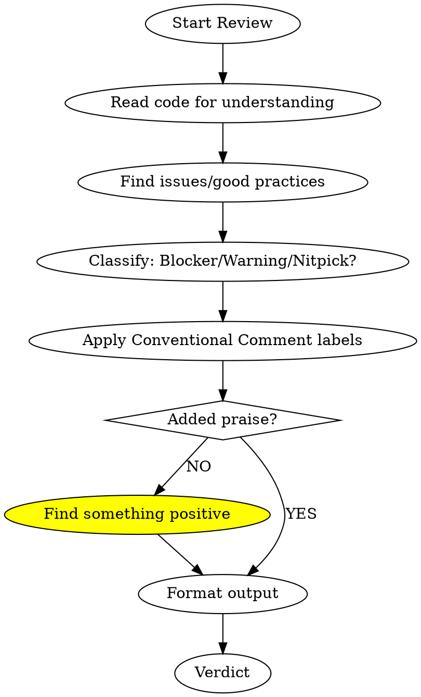

# Code Review

## Overview

Provide feedback format and communication patterns. NOT what makes "good code" - that's injected separately.

**Core principle:** Constructive feedback that helps, not demands.

## Review Process



## Conventional Comments

Format: `<label> [decorations]: <subject>`

### Labels

| Label | Purpose | Example |
|-------|---------|---------|
| **praise:** | Highlight good work | `praise: Clean separation of concerns here` |
| **suggestion:** | Propose improvement | `suggestion: Consider extracting to helper` |
| **issue:** | Problem requiring change | `issue (blocking): Null check missing` |
| **nitpick:** | Minor style preference | `nitpick (non-blocking): Prefer const` |
| **question:** | Seek clarification | `question: Why async here?` |
| **thought:** | Share observation | `thought: This pattern appears elsewhere` |
| **todo:** | Small task for author | `todo: Add JSDoc for public API` |
| **chore:** | Maintenance task | `chore: Update dependency version` |
| **note:** | Context for reader | `note: This will change in v2` |

### Decorations

| Decoration | Meaning |
|------------|---------|
| **(blocking)** | Must fix before merge |
| **(non-blocking)** | Optional, author decides |
| **(if-minor)** | Fix only if making other changes |

### Full Format

```
<label> [decorations]: <subject>

[optional discussion with context and reasoning]
```

**Example:**
```
issue (blocking): Race condition in counter increment

Multiple threads can read-modify-write simultaneously.
Consider using AtomicInteger or synchronized block.
```

## Severity Classification

| Severity | Decoration | Merge | Examples |
|----------|------------|-------|----------|
| **Blocker** | (blocking) | Blocked | Security flaw, data loss, crash |
| **Warning** | (none) | Proceed with caution | Performance issue, missing test |
| **Nitpick** | (non-blocking) | Go ahead | Style, naming preference |

## Red Flags - STOP

| Excuse | Reality |
|--------|---------|
| "No time for praise" | Balance builds trust, takes 10 seconds |
| "Obvious issues don't need labels" | Labels make intent clear |
| "Blocking is too harsh" | Clear expectations prevent confusion |
| "Commands are direct" | Questions invite collaboration |
| "HIGH/MEDIUM/LOW is standard" | Blocker/Warning/Nitpick maps to action |

## Output Format

```markdown
## Summary
| Metric | Count |
|--------|-------|
| Blockers | N |
| Warnings | N |
| Nitpicks | N |
| Praise | N |

## Blockers
[issue (blocking): ... for each]

## Warnings
[issue/suggestion: ... for each]

## Nitpicks
[nitpick (non-blocking): ... for each]

## Good Practices
[praise: ... for each - REQUIRED section]

## Verdict
[APPROVE / REQUEST_CHANGES / COMMENT]
```

## Quick Reference

```
praise:     Good work           nitpick:    Style preference
suggestion: Propose change      question:   Ask why
issue:      Problem found       thought:    Observation
todo:       Small task          chore:      Maintenance
note:       Context             (blocking): Must fix
```

**Tone check:** Replace commands with questions.
- "Should be X" -> "What about X?"
- "Must fix" -> "issue (blocking): ..."
- "Wrong" -> "question: Is this intentional?"
