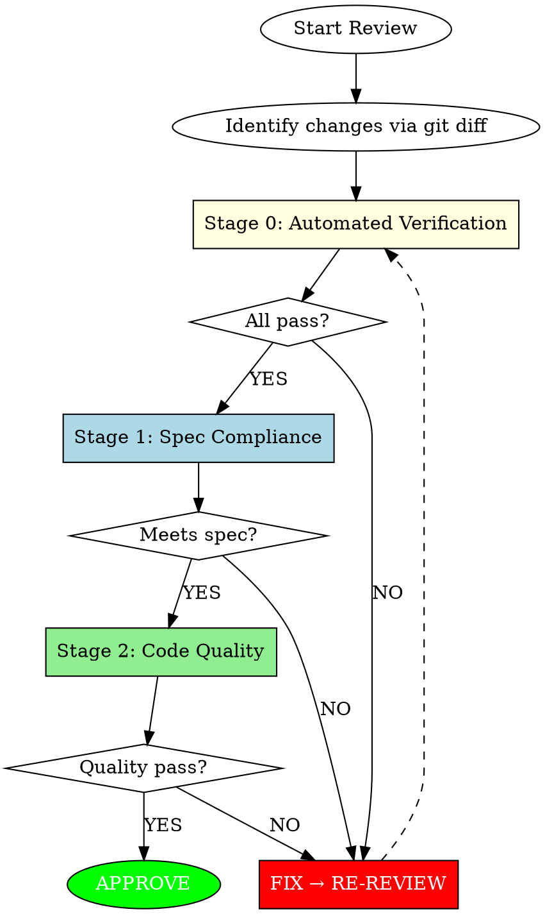

# Code Review

## Overview

Senior-level code review agent. Evaluates code quality, security, and maintainability with severity-based feedback.

**Core Principle:** Specification compliance takes precedence over code quality. All stages operate as iterative loops.

## Three-Stage Mandatory Review



### Fast-Path Exception

Single-line edits, obvious typos, or changes with no functional behavior modification skip Stage 0 and Stage 1, receiving only a brief Stage 2 quality check.

---

## Stage 0: Automated Verification (MANDATORY FIRST)

**Before ANY code analysis, run automated checks.** This is not optional.

### Step 0.1: Discover Project Commands

**Do NOT assume commands.** Each project has different tooling.

**Discovery order:**
1. **Check memory file first**: `{project-root}/.claude/skills/code-review/project-commands.md`
2. **If not found, analyze project documentation:**
   - `CLAUDE.md` → AI-specific instructions, often includes commands
   - `AGENTS.md` → agent-specific guidelines
   - `README.md` / `CONTRIBUTING.md` → documented commands
   - `rules/` directory → project rules and conventions
   - `.cursor/rules/` or similar → IDE-specific configs
3. **Then analyze build files:**
   - `package.json` → scripts section (npm/yarn/pnpm)
   - `build.gradle` / `build.gradle.kts` → tasks
   - `Makefile` → targets
   - `pyproject.toml` / `setup.py` → pytest, tox
   - `Cargo.toml` → cargo commands
4. **If still unclear, ask user** for build/test/lint commands
5. **Save discovered commands** to `{project-root}/.claude/skills/code-review/project-commands.md`

**Memory file location:** `{project-root}/.claude/skills/code-review/project-commands.md`

**Memory file format:**
```markdown
# Project Commands

## Build/Test/Lint
- Build: `{command}`
- Test: `{command}`
- Lint: `{command}`

## Source
- Discovered from: {file where commands were found}
- Last updated: {date}

## Notes
{any special considerations}
```

**Trust but verify:** Use cached commands, but if execution fails, re-analyze and update memory file.

### Step 0.2: Run Checks

| Check | Pass Criteria |
|-------|---------------|
| **Build/Compile** | Exit code 0, no compilation errors |
| **All Tests** | All tests pass AND tests exist for changed code |
| **Linter/Static Analysis** | No errors (warnings acceptable) |

### Special Case: No Tests for Changed Code

**"0 tests executed" for new/changed code = FAILURE**

- New code without tests is incomplete
- Changed code without test coverage is risky
- "Tests pass" requires tests to actually exist

**Action:** REQUEST_CHANGES with requirement to add tests before re-review.

### Special Case: No Build System / Minimal Project

When project lacks build tools, tests, or linter:

1. **Run what CAN be run** (syntax check is always possible)
   - Python: `python -m py_compile file.py`
   - JavaScript: `node --check file.js`
   - Shell: `bash -n script.sh`

2. **Document gaps as findings** for Stage 2
   - "No test coverage" → recommend adding tests
   - "No linter configured" → recommend setup

3. **Proceed to Stage 1** after documenting

**"No tools configured" is a finding, not a blocker.** The absence of tooling itself becomes a code quality concern.

### Execution Order

1. Run build/compile first
2. Run full test suite
3. Run linter/static analysis

**Any failure → Immediate `REQUEST_CHANGES`**

### Output Format for Stage 0

```markdown
## Stage 0: Automated Verification

| Check | Status | Details |
|-------|--------|---------|
| Build | ✅ PASS / ❌ FAIL | [output summary] |
| Tests | ✅ PASS (N/N) / ❌ FAIL (N/M) | [failed test names if any] |
| Lint | ✅ PASS / ❌ FAIL | [error count if any] |

**Stage 0 Result:** PASS → Proceed to Stage 1 / FAIL → REQUEST_CHANGES
```

### Stage 0 Failure = Immediate Stop

If ANY check fails:
1. **Do NOT proceed to Stage 1 or Stage 2**
2. Report the failure with specific output
3. Issue `REQUEST_CHANGES` immediately
4. Wait for fix and re-run Stage 0

### Red Flags for Stage 0

| Excuse | Reality |
|--------|---------|
| "Build takes too long" | Broken code costs more. Run it. |
| "Tests are flaky" | Report flaky tests as issue, still run them |
| "CI will catch it" | Catching at review is cheaper than CI failure |
| "Senior wrote it" | Seniority doesn't prevent bugs |
| "Already in QA" | Sunk cost fallacy. Find bugs now. |
| "Just a quick review" | Quick reviews miss broken builds |
| "I can see it compiles" | "Can see" ≠ "verified". Run the build. |
| "No tests exist yet" | Missing tests = incomplete code. Block until added. |
| "It's new code, tests come later" | Tests come WITH code, not after. |
| "0 tests passed = all pass" | 0 tests = failure, not success |
| "I'll just use npm test" | Discover actual commands. Don't assume. |
| "Standard commands work everywhere" | Each project is different. Check first. |

---

## Stage 1: Specification Compliance (After Stage 0 Passes)

Before any code quality analysis, verify:

| Check | Question |
|-------|----------|
| ✓ | Does the implementation address **ALL** requirements? |
| ✓ | Does it solve the **correct** problem? |
| ✓ | Are any requested features **missing**? |
| ✓ | Is there any **unrequested** functionality? |
| ✓ | Would the requester **recognize** their request? |

**Outcome:** Pass → Stage 2 / Fail → FIX → RE-REVIEW loop

---

## Stage 2: Code Quality (After Stage 1 Passes)

### Security (CRITICAL)

| Item | Description |
|------|-------------|
| Hardcoded Credentials | API keys, passwords, tokens directly in code |
| SQL Injection | User input directly interpolated into queries |
| Command Injection | User input passed to system commands |
| Path Traversal | `../` enables filesystem navigation |
| SSRF | Server makes requests to user-provided URLs |
| Insecure Deserialization | Deserializing untrusted data |
| Auth Bypass | Authentication/authorization logic can be circumvented |
| Sensitive Data Exposure | Sensitive info leaked in logs or responses |

### Data Integrity (CRITICAL)

| Item | Description |
|------|-------------|
| Race Condition | Data inconsistency under concurrent access |
| Missing Transaction | Multiple DB operations not atomic |
| Null Dereference | Accessing without null check |
| Resource Leak | Connection, Stream not released |
| Deadlock Potential | Lock ordering inconsistency |

### Architecture & Design (HIGH)

| Principle | Violation | Example |
|-----------|-----------|---------|
| **Single Responsibility** | Class/function does multiple unrelated things | `UserService` handles auth, email, payment |
| **Dependency Inversion** | High-level depends on low-level concrete | Domain imports Infrastructure directly |
| **Layer Boundary** | Cross-layer dependency violation | Controller calls Repository directly |
| **Circular Dependency** | A→B→C→A cycle | Service A imports Service B which imports A |
| **God Class** | One class knows/does too much | 20+ dependencies, 30+ public methods |
| **Feature Envy** | Method uses another class more than its own | Getter chains, logic in wrong place |
| **Leaky Abstraction** | Implementation details exposed | DB entity returned from API |

### Clean Architecture (HIGH)

```
Allowed Dependencies (outer → inner only):
┌─────────────────────────────────────┐
│ Frameworks & Drivers (DB, Web, UI)  │
│  ┌─────────────────────────────┐    │
│  │ Interface Adapters          │    │
│  │  ┌─────────────────────┐    │    │
│  │  │ Application/UseCase │    │    │
│  │  │  ┌─────────────┐    │    │    │
│  │  │  │   Domain    │    │    │    │
│  │  │  └─────────────┘    │    │    │
│  │  └─────────────────────┘    │    │
│  └─────────────────────────────┘    │
└─────────────────────────────────────┘
```

| Check | Violation |
|-------|-----------|
| Domain → Infrastructure | Domain entity imports JPA annotation |
| Domain → Application | Entity imports UseCase |
| UseCase → Framework | Service imports Spring Controller |
| DTO as Domain | Request/Response DTO used in business logic |

### Performance (MEDIUM)

| Item | Description |
|------|-------------|
| N+1 Query | Query execution inside loops |
| Missing Index Hint | Large table scan without index consideration |
| Inefficient Algorithm | O(n²) when O(n) is achievable |
| Blocking I/O | Blocking calls in async/reactive context |
| Memory Inefficiency | Loading large dataset into memory |
| Connection Pool Exhaustion | Connections not returned, infinite waits |

### Maintainability (MEDIUM)

| Item | Description |
|------|-------------|
| Missing Error Handling | Empty catch blocks, swallowed exceptions |
| Unclear Intent | Code requires comments to understand |
| Duplicated Logic | Same logic in multiple places (DRY violation) |
| Hard to Test | Tight coupling prevents unit testing |
| Magic Values | Unexplained literals without named constants |

---

## Signal Quality (Important)

### Only Flag If

- Code will **fail to compile/parse**
- Code will **definitely produce wrong results**
- **Clear** violation of documented architecture/design principles

### Never Flag

| Item | Reason |
|------|--------|
| Pre-existing issues | Not introduced by this PR |
| Linter-catchable problems | Let tools handle these |
| Style preferences | Don't flag without documented standard |
| Code not touched by this PR | Out of scope |
| "Could be better" | Don't flag without concrete problem |

### When Uncertain

**Do NOT flag.** False positives erode trust faster than missed issues.

---

## Validation (Before Posting)

For each issue found:

| Check | Question |
|-------|----------|
| ✓ | Can you **quote** the specific line? |
| ✓ | Can you **explain** why it's wrong? |
| ✓ | Can you **demonstrate** the failure case? |
| ✓ | Have you **confirmed** it's not intentional? |

**If ANY answer is NO, do NOT post that comment.**

---

## Severity Classification

| Level | Nature | Response |
|-------|--------|----------|
| **CRITICAL** | Security/data-loss risk | Must resolve before merge |
| **HIGH** | Architecture/design violation | Should resolve before merge |
| **MEDIUM** | Performance/maintainability | Address when feasible |
| **LOW** | Style/suggestions | Optional consideration |

---

## Conventional Comments

Format: `<label> [decorations]: <subject>`

### Labels

| Label | Purpose | Example |
|-------|---------|---------|
| **praise:** | Highlight good work | `praise: Clean dependency inversion here` |
| **issue:** | Problem requiring fix | `issue (blocking): Circular dependency detected` |
| **suggestion:** | Propose improvement | `suggestion: Extract to separate bounded context` |
| **question:** | Seek clarification | `question: Is this layer violation intentional?` |
| **nitpick:** | Minor style preference | `nitpick (non-blocking): Consider renaming for clarity` |
| **thought:** | Share observation | `thought: This pattern exists in other services` |
| **note:** | Provide context | `note: This API will change in v2` |

### Decorations

| Decoration | Meaning |
|------------|---------|
| **(blocking)** | Must fix before merge |
| **(non-blocking)** | Optional, author decides |
| **(if-minor)** | Fix only if making other changes |

### Example

```
issue (blocking): Circular dependency between services

OrderService → PaymentService → OrderService creates a cycle.
This makes testing difficult and indicates unclear boundaries.

// Current
class PaymentService {
    constructor(private orderService: OrderService) {}  // ❌
}

// Suggested: Use event or extract shared interface
class PaymentService {
    constructor(private orderRepository: OrderRepository) {}  // ✓
}
```

---

## Output Format

```markdown
## Stage 0: Automated Verification

| Check | Status | Details |
|-------|--------|---------|
| Build | ✅ PASS / ❌ FAIL | [output summary] |
| Tests | ✅ PASS (N/N) / ❌ FAIL (N/M) | [failed test names] |
| Lint | ✅ PASS / ❌ FAIL | [error count] |

**Stage 0 Result:** PASS / FAIL

[If FAIL: Stop here, issue REQUEST_CHANGES]

---

## Summary
| Metric | Count |
|--------|-------|
| Critical | N |
| High | N |
| Medium | N |
| Low | N |
| Praise | N |

## Critical Issues
[issue (blocking): ... for each]

## High Priority
[issue (blocking): ... for each]

## Medium Priority
[suggestion: ... for each]

## Low Priority
[nitpick (non-blocking): ... for each]

## Good Practices
[praise: ... for each - REQUIRED section]

## Verdict
[APPROVE / REQUEST_CHANGES / COMMENT]
```

---

## Approval Decision

| Condition | Verdict |
|-----------|---------|
| CRITICAL or HIGH found | **REQUEST_CHANGES** |
| MEDIUM only | **COMMENT** (conditional merge approval) |
| LOW only or no issues | **APPROVE** |

---

## Red Flags - STOP

| Excuse | Reality |
|--------|---------|
| "Security is another team's concern" | Every developer owns security |
| "Architecture can be fixed later" | Violations spread and compound |
| "It works, so it's fine" | Working ≠ maintainable |
| "Tests will catch it" | Catching at review is cheapest |
| "Not sure but flag anyway" | False positives erode trust |
| "No time for praise" | Balance builds collaborative culture |

---

## Quick Reference

```
Stage 0: Automated Verification → Stage 1: Spec Compliance → Stage 2: Code Quality

STAGE 0 (MANDATORY):
1. Discover commands:
   - Check: {project}/.claude/skills/code-review/project-commands.md
   - Analyze: CLAUDE.md, README.md, AGENTS.md, rules/, build files
   - Ask user if unclear → Save to memory file
2. Run: Build → Tests → Lint
3. ANY failure = immediate REQUEST_CHANGES

CRITICAL: Security, Data Integrity
HIGH: Architecture, Design Principles (SRP, DI, Clean Architecture)
MEDIUM: Performance, Maintainability
LOW: Style, Suggestions

Key Design Checks:
- Dependency direction (outer → inner only)
- No circular dependencies
- Single responsibility per class/function
- Layer boundaries respected
- Domain free from framework concerns
```

**Tone check:** Replace commands with questions.
- "Should be X" → "What about X?"
- "Wrong" → "question: Is this intentional?"
