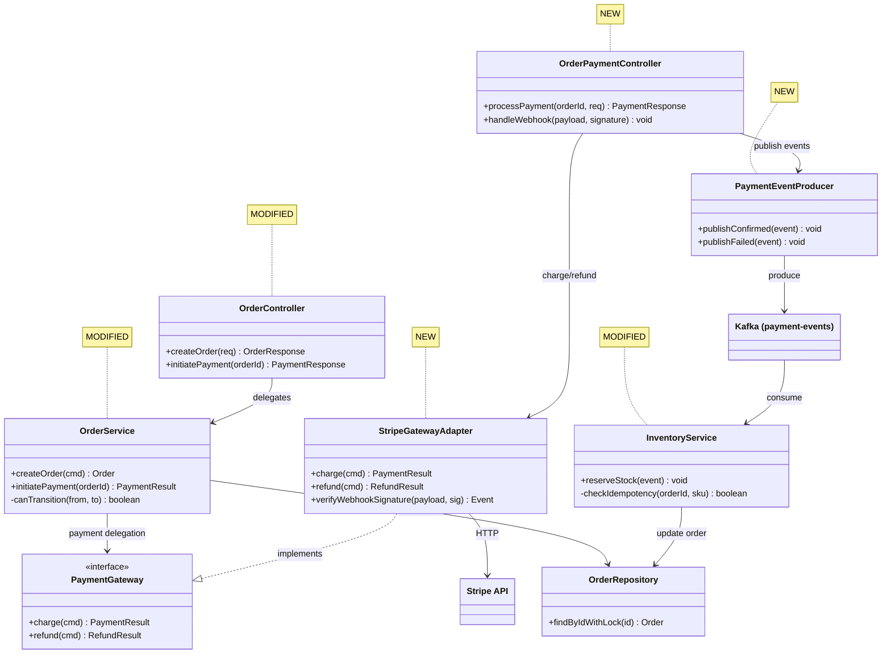
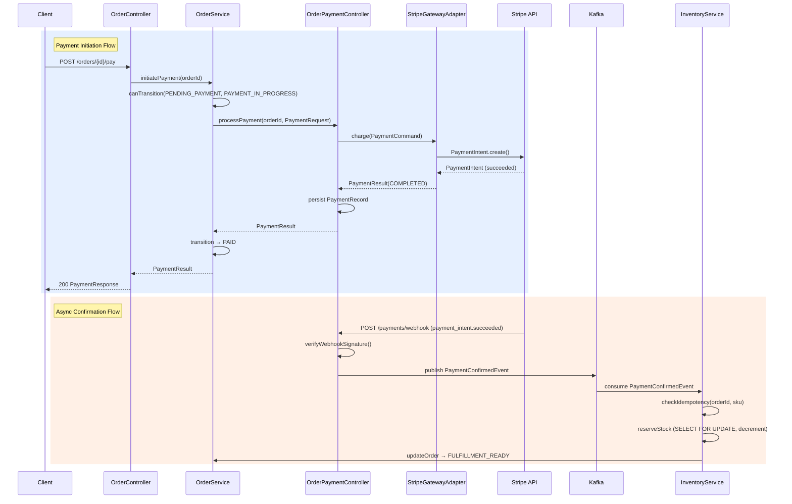

# Code Review

Orchestrates chunk-reviewer agents against diffs. Handles input parsing, context gathering, chunking, and result synthesis.

## Input Modes

```bash
# PR (number or URL)
/code-review pr 123
/code-review pr https://github.com/org/repo/pull/123

# Branch comparison
/code-review main feature/auth

# Auto-detect (current branch vs origin/main or origin/master)
/code-review
```

## Step 0: Requirements Context

Three-question gate — adapt by input mode:

**PR mode:**
1. Auto-extract PR title + description via `gh pr view <number> --json title,body`
2. If description is substantial (>1 sentence): proceed with auto-extracted context, confirm with user: "PR 설명에서 요구사항을 추출했습니다: [요약]. 추가할 사항이 있나요?"
3. If description is thin: ask user "이 PR의 핵심 요구사항이나 spec이 있나요?"

**Branch comparison mode:**
Ask user: "이 브랜치에서 무엇을 구현했나요? 원래 요구사항/spec이 있다면 알려주세요."

**Auto-detect mode:**
1. Infer from commit messages (`git log --oneline`)
2. Ask user: "최근 작업의 요구사항/spec이 있나요? (없으면 코드 품질 중심으로 리뷰합니다)"

**User deferral** ("없어", "그냥 리뷰해줘", "skip"):
→ Set {REQUIREMENTS} = "N/A - code quality review only"
→ Proceed without blocking

**Vague Answer Handling:**
- Explicit deferral ("없어", "skip", "그냥 해줘") → N/A 처리 후 진행
- Vague answer → 후속 질문으로 구체화:

| User says | Follow-up |
|-----------|-----------|
| "대충 있어" / "뭐 좀 있긴 한데" | "어디서 확인할 수 있나요? (PR description, Notion, Jira 등)" |
| "그냥 성능 개선이야" | "구체적으로 어떤 지표를 개선하려고 했나요? (latency, throughput, memory 등)" |
| "여러 가지 고쳤어" | "가장 중요한 변경 1-2가지만 알려주세요. 나머지는 코드에서 파악합니다." |

Rule: 2회 연속 vague → "코드에서 직접 파악하겠습니다" 선언 후 진행. 무한 질문 금지.

**Question Method:**

| Situation | Method |
|-----------|--------|
| 2-4 structured choices (review scope, severity threshold) | AskUserQuestion tool |
| Free-form / subjective (intent, context, concerns) | Plain text question |

**Question Quality Standard:**

| BAD | GOOD |
|-----|------|
| "요구사항이 있나요?" | "이 PR의 핵심 요구사항이나 spec이 있나요? (없으면 코드 품질 중심으로 리뷰합니다)" |
| "어떤 부분을 볼까요?" | "변경 파일이 23개입니다. 특히 집중할 영역이 있나요? (없으면 전체 리뷰합니다)" |
| "테스트 있나요?" | "테스트 커버리지 기준이 있나요? (예: 80% line coverage, 특정 시나리오 필수 등)" |

Rule: 모든 질문에 default 행동을 괄호로 명시. User가 답하지 않아도 진행 가능하게.

**One Question Per Message:**
질문은 한 번에 하나씩. 답변을 받은 후 다음 질문 진행. 여러 질문을 한 메시지에 묶지 말 것.

**Step 0 Exit Condition:**
다음 중 하나 충족 시 Step 1로 진행:
- Requirements captured (PR description, user input, or spec reference)
- User explicitly deferred ("skip", "없어", "그냥 리뷰해줘")
- 2-strike vague limit reached → proceed with code-quality-only review

**Context Brokering:**
- DO NOT ask user about codebase facts (file locations, patterns, architecture)
- USE explore/oracle in Step 2 for codebase context
- ONLY ask user about: requirements, intent, specific concerns

## Step 1: Input Parsing

Determine diff command and range for subsequent steps:

| Input | Diff Command | Range |
|-------|-------------|-------|
| `pr <number or URL>` | `gh pr diff <number>` | Extract via `gh pr view <number> --json baseRefName,headRefName` → `origin/<baseRefName>..<headRefName>` |
| `<base> <target>` | `git diff <base>...<target>` | `<base>...<target>` |
| (none) | Detect default branch (`origin/main` or `origin/master`), then `git diff <default>...HEAD` | `<default>...HEAD` |

All subsequent steps use `{range}` from this table.

## Early Exit

After Input Parsing, before proceeding to Step 2:

1. Run `git diff {range} --stat` (using the range determined in Step 1)
2. If empty diff: report "변경사항이 없습니다 (<base>와 <target> 사이)" and exit
3. If binary-only diff: report "바이너리 파일 변경만 감지되었습니다" and exit

## Step 2: Context Gathering

Collect in parallel (using `{range}` from Step 1):

1. `git diff {range} --stat` (change scale)
2. `git diff {range} --name-only` (file list)
3. `git log {range} --oneline` (commit history)
4. CLAUDE.md files: repo root + each changed directory's CLAUDE.md (if exists)

Subagent context:

### Agent Role Separation

| Agent | Role | Scope | Trigger |
|-------|------|-------|---------|
| explore | Codebase convention baseline | Internal codebase patterns, naming, structure | Always (lightweight) |
| oracle | Deep codebase analysis | Cross-file impact, hidden dependencies, architectural fit | Conditional (see triggers) |
| librarian | External documentation verification | Official docs, best practices, known pitfalls | Conditional (see triggers) |

Role clarity:
- explore = "코드베이스에서 관습을 찾아라" (targeted grep)
- oracle = "이 변경이 기존 시스템에 안전한지 분석하라" (deep reasoning)
- librarian = "이 라이브러리/API를 올바르게 쓰고 있는지 확인하라" (external reference)

### Explore -- Codebase Convention Baseline

Chunk-reviewer는 diff만 보므로 "이 코드가 프로젝트 관습에 맞는지"를 판단할 기준이 없다. Explore가 제공하는 convention baseline이 없으면 chunk-reviewer는:
- 프로젝트에서 이미 해결된 패턴을 무시하고 새 패턴을 제안 (noise)
- 프로젝트 관습에 맞는 코드를 "개선 필요"로 오판 (false positive)
- 프로젝트 관습을 위반하는 코드를 놓침 (false negative)

→ 그래서 항상 dispatch. Cost 낮고 (targeted grep 수준), value 높음 (모든 chunk 리뷰의 품질 보정).

5. Dispatch explore agent (4-Field prompt):
   ```
   Task(subagent_type="explore", prompt="
   [CONTEXT] Reviewing a PR that changes {file_list}. PR description: {DESCRIPTION}.
   [GOAL] Understand existing codebase conventions to evaluate whether the PR follows established patterns.
   [DOWNSTREAM] Output injected into {CODEBASE_CONTEXT} to calibrate chunk-reviewer agent against project norms.
   [REQUEST] Find: naming conventions, error handling patterns, test structure, and related implementations for the changed modules. Return file paths with pattern descriptions. Skip unrelated directories.")
   ```
   → Always dispatch (lightweight, provides codebase context)

### Oracle -- Deep Codebase Analysis

핵심 원칙: **diff만으로는 이 변경의 안전성을 판단할 수 없을 때** dispatch.

Diff는 "무엇이 바뀌었는가"를 보여주지만, "이 변경이 기존 시스템에서 안전한가"는 알려주지 않는다. Oracle은 코드베이스 전체를 읽고 다음 4가지 유형의 질문에 답한다:

| 유형 | 질문 | 예시 |
|------|------|------|
| Impact analysis | "이 변경이 어디까지 영향을 미치는가?" | migration이 기존 쿼리를 깨뜨리는가, 캐시 키 변경이 다른 서비스를 무효화하는가 |
| Consistency verification | "기존 패턴과 일관되는가?" | 새 에러 핸들링이 기존 전략과 다른가, 새 연동의 retry 정책이 기존과 불일치하는가 |
| Hidden interaction | "보이지 않는 의존성이 있는가?" | 이 lock이 다른 lock과 deadlock을 만드는가, 이 이벤트가 consumer의 기대와 맞는가 |
| Design fitness | "아키텍처 원칙에 맞는가?" | 레이어 경계를 위반하는가, 기존 추상화를 우회하는가 |

**When NOT to dispatch oracle:**
- 단순 리팩토링 (rename, extract method, move file) -- diff로 충분
- 테스트만 변경 -- production 영향 없음
- 문서/설정만 변경 -- 아키텍처 분석 불필요
- 단일 함수 내부 로직 변경 (외부 인터페이스 불변) -- cross-file 영향 없음
- explore 결과로 이미 충분한 컨텍스트를 확보한 경우

**Oracle trigger conditions:**
- Changed files include `*migration*`, `*schema*`, `*.sql` → (impact analysis)
- Changed files span 3+ top-level directories → (design fitness, consistency verification)
- Changed files include `*auth*`, `*security*`, `*crypto*`, `*permission*` → (consistency verification, hidden interaction)
- Changed files involve performance-critical patterns: `*cache*`, `*queue*`, `*batch*`, `*index*` → (hidden interaction, impact analysis)
- Changed files contain complex business logic: state machine, transaction coordination, multi-step workflows → (hidden interaction, consistency verification)
- Changed files involve concurrency: `*lock*`, `*mutex*`, `*worker*`, `*thread*`, `*async*`, `*coroutine*` → (hidden interaction)
- Changed files introduce external integrations: new HTTP clients, webhooks, SDK wrappers, third-party API adapters → (consistency verification, design fitness)

6. Dispatch oracle agent (only if trigger conditions met):
   Briefly announce "Consulting Oracle for [reason]" before invocation.
   → Only if trigger conditions met (see above)

### Librarian -- External Documentation Verification

핵심 원칙: **외부 문서 없이는 올바른 사용법을 판단할 수 없을 때** dispatch.

Chunk-reviewer가 라이브러리 코드를 리뷰할 때, 코드 자체는 문법적으로 올바를 수 있지만:
- deprecated API를 사용하고 있는가?
- 알려진 보안 취약점이 있는 버전인가?
- 공식 문서에서 권장하지 않는 패턴인가?

→ 이런 정보는 코드베이스에 없고, 외부 문서에만 있음.

**When NOT to dispatch librarian:**
- 기존 dependency의 사소한 사용 변경 -- 이미 프로젝트에서 검증된 패턴
- 내부 코드만 변경 -- 외부 문서 참조 불필요
- 버전 변경 없는 설정 변경 -- breaking change 우려 없음

**Librarian trigger conditions:**
- New dependency introduced (new entries in `build.gradle`, `package.json`, `go.mod`, `requirements.txt`, etc.)
- External API integration added or modified (REST clients, SDK usage, webhook handlers)
- Framework migration or major version upgrade
- New infrastructure pattern introduced (caching strategy, message queue, search engine, etc.)

7. Dispatch librarian agent (only if trigger conditions met):
   Briefly announce "Consulting Librarian for [dependency/API]" before invocation.
   ```
   Task(subagent_type="librarian", prompt="
   [CONTEXT] Reviewing a PR that introduces {dependency/API/pattern}.
   [GOAL] Verify usage against official documentation and known best practices.
   [DOWNSTREAM] Output injected into {CODEBASE_CONTEXT} to catch misuse patterns the chunk-reviewer might miss.
   [REQUEST] Find: correct usage examples, common pitfalls, version-specific breaking changes, and security advisories for {dependency/API}. Return concise findings with doc URLs.")
   ```
   → Only if trigger conditions met (see above)

## Step 3: Chunking Decision

| Condition | Strategy |
|-----------|----------|
| Changed files <= 15 | Single review -- skip to Step 4 with full diff |
| Changed files > 15 | Group into chunks of ~10-15 files by directory/module affinity |

Chunking heuristic: group files sharing a directory prefix or import relationships.

## Step 4: Agent Dispatch

1. Read dispatch template from `chunk-reviewer-prompt.md`
2. Interpolate placeholders with context from Steps 0-2:
   - {WHAT_WAS_IMPLEMENTED} ← Step 0 description
   - {DESCRIPTION} ← Step 0 or commit messages
   - {REQUIREMENTS} ← Step 0 requirements (or "N/A - code quality review only")
   - {CODEBASE_CONTEXT} ← Step 2 explore/oracle output (or empty)
   - {FILE_LIST} ← Step 2 file list
   - {DIFF} ← Step 1 diff (full or chunk)
   - {CLAUDE_MD} ← Step 2 CLAUDE.md content (or empty)
   - {COMMIT_HISTORY} ← Step 2 commit history
3. Dispatch `chunk-reviewer` agent(s) via Task tool (`subagent_type: "chunk-reviewer"`) with interpolated prompt

**Dispatch rules:**

| Scale | Action |
|-------|--------|
| Single chunk | 1 agent call |
| Multiple chunks | Parallel dispatch -- all chunks in ONE response. Each chunk gets its own interpolated template with chunk-specific {DIFF} and {FILE_LIST} |

## Step 5: Walkthrough Synthesis + Result Synthesis

After all agents return, produce the final output in two phases.

### Phase 1: Walkthrough Synthesis (MANDATORY)

Orchestrator directly produces the Walkthrough from:
- All chunk Chunk Analysis sections (raw comprehension material from chunk-reviewer agents)
- Step 2 context (explore/oracle output, CLAUDE.md, commit history)

**Generate the following sections:**

#### Change Summary
- 1-2 paragraph prose summary of the entire change's purpose and context
- Include motivation, approach taken, and overall impact
- Written for someone unfamiliar with the code to understand the change

#### Core Logic Analysis
- Consolidate all chunk Chunk Analyses into a unified module/feature-level narrative
- Cover both core changes AND supporting/peripheral changes
- Explain data flow, design decisions, and side effects from the perspective of inter-module relationships
- Level of detail: enough to understand the full change WITHOUT reading the code

#### Architecture Diagram
- Mermaid class diagram or component diagram
- Show changed classes/modules and their relationships (inheritance, composition, dependency)
- Distinguish new vs modified elements
- If no structural changes (e.g., logic-only changes within existing methods): write "No structural changes — existing architecture preserved"

#### Sequence Diagram
- Mermaid sequence diagram visualizing the primary call flow(s) affected by the changes
- Include actors, method calls, return values, and significant conditional branches
- If no call flow changes (e.g., variable rename, config change): write "No call flow changes"

### Phase 2: Critique Synthesis

For multi-chunk reviews:

1. **Merge** all Strengths, Issues, Recommendations sections
2. **Deduplicate** issues appearing in multiple chunks
3. **Identify cross-file concerns** -- issues spanning chunk boundaries (e.g., interface contract mismatches, inconsistent error handling patterns)
4. **Normalize severity labels** across chunks using Critical / Important / Minor scale -- reconcile inconsistent labels for same-type issues across chunks; escalate recurring cross-chunk issues
5. **Determine final verdict** -- "Ready to merge?" is the STRICTEST of all chunk verdicts (any "No" = overall "No")
6. **Produce unified critique** (Strengths / Issues / Recommendations / Assessment)

For single-chunk reviews, Phase 2 returns the agent's critique output directly (Strengths through Assessment).

### Final Output Format

```
## Walkthrough

### Change Summary
[Generated in Phase 1]

### Core Logic Analysis
[Generated in Phase 1]

### Architecture Diagram
[Generated in Phase 1 — Mermaid or "No structural changes — existing architecture preserved"]

### Sequence Diagram
[Generated in Phase 1 — Mermaid or "No call flow changes"]

---

## Strengths
[Generated in Phase 2]

## Issues
[Generated in Phase 2]

## Recommendations
[Generated in Phase 2]

## Assessment
[Generated in Phase 2]
```

### Example Final Output

Synthesized from 3 chunks: (A) Order API + domain, (B) Payment integration, (C) Inventory + messaging.

````
## Walkthrough

### Change Summary
Implements end-to-end order payment flow for the e-commerce platform, spanning three domains: order lifecycle management (creation, validation, state transitions), payment gateway integration (Stripe charge creation, webhook handling, refund support), and inventory reservation (stock deduction on payment confirmation with Kafka-based async messaging). The PR introduces 9 new files and modifies 3 existing files across the API, domain, infrastructure, and messaging layers. Orders transition through a state machine (`CREATED` → `PENDING_PAYMENT` → `PAYMENT_IN_PROGRESS` → `PAID` → `FULFILLMENT_READY`), with inventory reserved asynchronously on payment confirmation via a Kafka event. A Flyway migration adds the `payment_records` and `inventory_reservations` tables to support the new flows.

### Core Logic Analysis

**Order Lifecycle (order/)**:
`OrderController.kt` exposes `POST /api/v1/orders` for creation and `POST /api/v1/orders/{id}/pay` to initiate payment. `OrderService.kt` owns the order state machine — `canTransition()` validates allowed state changes, `initiatePayment()` transitions from `CREATED`/`PENDING_PAYMENT` to `PAYMENT_IN_PROGRESS` and delegates to the payment layer. `OrderRepository.kt` extends Spring Data JPA with a custom `findByIdWithLock()` using `@Lock(PESSIMISTIC_WRITE)` to prevent concurrent payment attempts on the same order. The state machine is enforced at the service layer, not via DB constraints — this means invalid transitions are caught in application code but not at the storage level.

**Payment Integration (payment/)**:
`OrderPaymentController.kt` orchestrates the payment flow: validates order state, delegates to `StripeGatewayAdapter.charge()`, and persists the `PaymentRecord`. `StripeGatewayAdapter.kt` implements the `PaymentGateway` port interface — maps domain `PaymentCommand` to Stripe `PaymentIntentCreateParams`, calls the Stripe SDK, and maps the response back. The webhook endpoint receives async payment confirmations from Stripe and publishes a `PaymentConfirmedEvent` to Kafka for downstream processing. `PaymentRequest.kt` is the DTO carrying amount, currency, and callback URL from the API boundary.

**Inventory Reservation (inventory/)**:
`InventoryService.kt` listens for `PaymentConfirmedEvent` via `@KafkaListener` and reserves stock by decrementing `available_quantity` in the `inventory` table. Uses `SELECT ... FOR UPDATE` to prevent overselling under concurrent reservations. If stock is insufficient, publishes an `InventoryShortageEvent` to a separate topic for the order service to handle (cancellation or backorder). `InventoryReservation` entity tracks which order reserved which SKUs and quantities — used for idempotency checks on retry.

**Messaging (kafka/)**:
`PaymentEventProducer.kt` publishes `PaymentConfirmedEvent` and `PaymentFailedEvent` to the `payment-events` topic. Uses `KafkaTemplate` with a `ProducerRecord` that includes the `orderId` as the message key for partition affinity — all events for the same order land on the same partition, preserving ordering. No dead letter topic is configured for the `payment-events` consumer group.

**Database (migration/)**:
`V2024_001__add_payment_and_inventory_tables.sql` adds two tables: `payment_records` (transaction ID, order ID, amount, currency, status, Stripe payment intent ID, timestamps) and `inventory_reservations` (order ID, SKU, quantity, reserved_at). Both tables have foreign keys to `orders`. The `payment_records` table has a unique constraint on `stripe_payment_intent_id` for idempotency. No index on `inventory_reservations.order_id` despite being used in the idempotency lookup query.

### Architecture Diagram


### Sequence Diagram


---

## Strengths
- Clean hexagonal architecture: Stripe interaction fully encapsulated behind `PaymentGateway` port interface, domain never references Stripe SDK types (StripeGatewayAdapter.kt:1-15)
- Order state machine validation prevents double-charging — `canTransition()` check with pessimistic locking rejects concurrent payment attempts on the same order (OrderService.kt:42-58, OrderRepository.kt:12)
- Kafka partition key strategy using `orderId` ensures ordering guarantees per order — payment confirmed before inventory reserved, never reversed (PaymentEventProducer.kt:23-31)
- Idempotency check on inventory reservation prevents duplicate stock deductions on Kafka consumer retries (InventoryService.kt:34-42)

## Issues

### Critical (Must Fix)
1. **`@Transactional` wrapping external HTTP call to Stripe**
   - File: OrderPaymentController.kt:34-67
   - Issue: `processPayment()` is `@Transactional` but includes `StripeGatewayAdapter.charge()` — an external HTTP round-trip (500ms-2s). The DB connection is held open for the entire network call. Under concurrent load, 10 in-flight payments saturate the HikariCP pool, blocking all DB operations including order browsing and cart.
   - Fix: Split into two transactions: (1) validate + mark `PAYMENT_IN_PROGRESS`, (2) after Stripe call, persist result + update status. Use compensating job for stuck `PAYMENT_IN_PROGRESS` orders.
   - Requirement trace: REQ-PAY-003 "Payment processing must not degrade order browsing or cart operations under load"

2. **No circuit breaker on Stripe API calls**
   - File: StripeGatewayAdapter.kt:44-78
   - Issue: No circuit breaker, bulkhead, or timeout override on `charge()` and `refund()`. Stripe SDK default timeout is 30s. Combined with the `@Transactional` issue, a Stripe degradation cascades into full system unavailability.
   - Fix: Add Resilience4j `@CircuitBreaker` (50% failure threshold, 30s wait, 3 half-open calls). Set Stripe SDK timeout to 5s. Return `PaymentResult.TEMPORARILY_UNAVAILABLE` as fallback.
   - Requirement trace: REQ-PAY-007 "System must gracefully degrade when third-party payment provider is unavailable"

3. **HTTPS not validated on webhook callback URL**
   - File: PaymentRequest.kt:8-12
   - Issue: `callbackUrl: String` with only `@NotBlank` validation. Accepts `http://` scheme — payment confirmations could be sent over plaintext, interceptable via MITM.
   - Fix: Custom `@ValidCallbackUrl` annotation: well-formed URL, `https` scheme, no private/loopback IP. Production: allowlist of registered callback domains.
   - Requirement trace: REQ-SEC-012 "All payment-related data transmission must use TLS 1.2+"

### Important (Should Fix)
1. **No dead letter queue for failed payment callbacks** — OrderPaymentController.kt:85-102. Failed webhook processing silently drops events. Stripe retries for 3 days then gives up permanently.
2. **Currency field is unbounded String instead of ISO 4217 enum** — PaymentRequest.kt:6. Invalid currency codes reach Stripe, producing cryptic 400 errors surfaced as generic 500 to clients.
3. **Missing index on `inventory_reservations.order_id`** — V2024_001__add_payment_and_inventory_tables.sql:28. Idempotency lookup on every Kafka message does a full table scan. Grows linearly with order volume.
4. **No structured logging on payment events** — OrderPaymentController.kt:34-102, StripeGatewayAdapter.kt:44-78. No correlation ID, no MDC context. End-to-end payment debugging across sync and async flows requires manual log correlation.
5. **Kafka message loss leaves orders stuck in PAID state** — PaymentEventProducer.kt:23-31, InventoryService.kt. If `PaymentConfirmedEvent` is lost (producer failure, Kafka outage, or consumer deserialization error), the order remains in `PAID` state indefinitely and never transitions to `FULFILLMENT_READY`. No compensating mechanism (scheduled reconciliation job, timeout-based retry) exists to detect and recover stuck orders. This is a cross-chunk gap: the order state machine (Chunk A) assumes the async inventory flow (Chunk C) always completes, but the messaging layer (Chunk C) has no delivery guarantee beyond Kafka's at-least-once semantics.

### Minor (Nice to Have)
1. **Missing OpenAPI annotations on payment endpoints** — OrderPaymentController.kt:28-33. API consumers have no contract documentation for payment flow.
2. **Hardcoded retry count and timeout values** — StripeGatewayAdapter.kt:45, StripeGatewayAdapter.kt:52. Not configurable per environment.

## Recommendations
- Introduce a `PaymentApplicationService` between controllers and adapters to own transaction boundaries — the controller handles HTTP, the adapter handles Stripe, and the service orchestrates the domain flow between them
- Add Resilience4j circuit breaker as a cross-cutting concern via Spring AOP — any future payment gateway integration (PayPal, Toss) will need the same protection pattern
- Implement distributed tracing with correlation ID propagated through HTTP headers → Kafka message headers → consumer MDC — critical for debugging the async payment confirmation flow that spans 3 services
- Set up a dead letter topic with an admin dashboard for payment event reprocessing — failed webhook events and inventory shortage events both need manual intervention workflows

## Assessment
**Ready to merge: No**
**Reasoning:** Three Critical issues block merge — `@Transactional` spanning external HTTP calls risks connection pool starvation under load, missing circuit breaker enables cascading failures from Stripe outages, and unvalidated callback URL scheme violates transport security requirements. All three must be resolved before this code handles production payment traffic.
````
