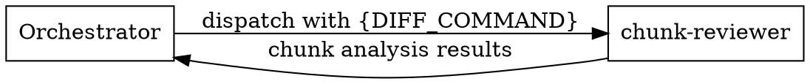
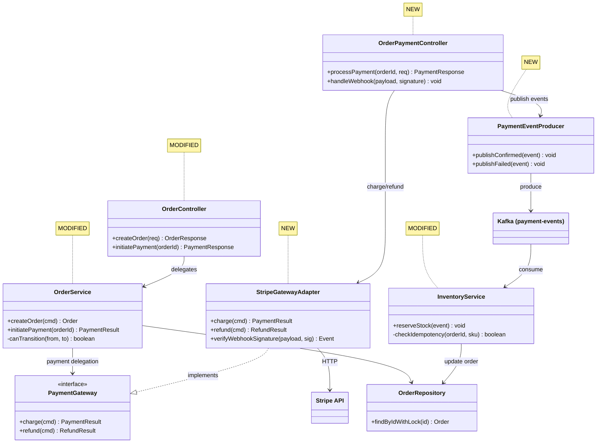
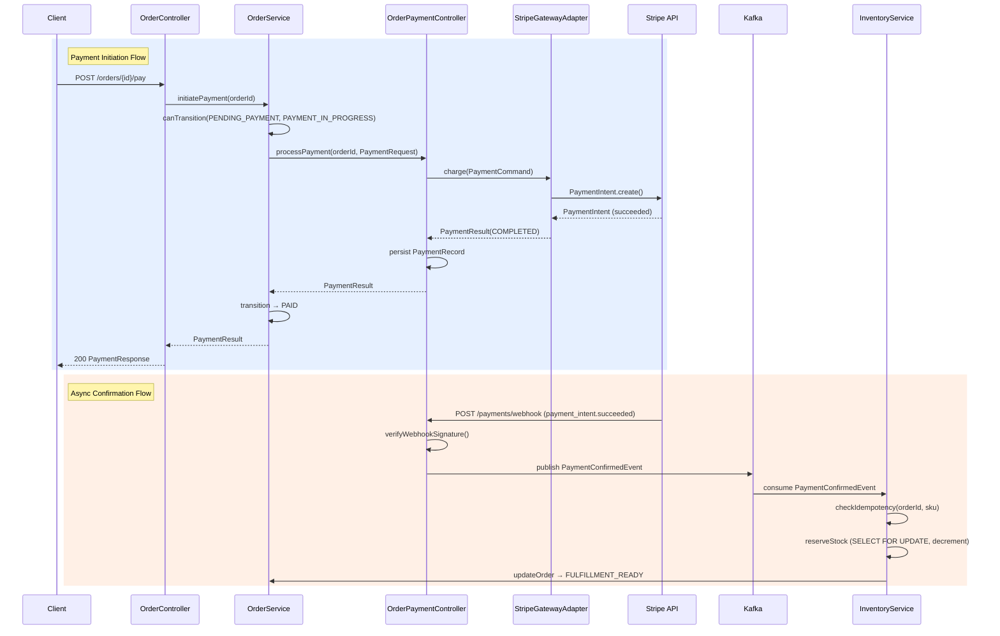

# Code Review

Orchestrates chunk-reviewer agents against diffs. Handles input parsing, context gathering, chunking, and result synthesis.

## Input Modes

```bash
# PR (number or URL)
/code-review pr 123
/code-review pr https://github.com/org/repo/pull/123

# Branch comparison
/code-review main feature/auth

# Auto-detect (current branch vs origin/main or origin/master)
/code-review
```

## Do vs Delegate Decision Matrix

| Action | YOU Do | DELEGATE |
|--------|--------|----------|
| Requirements 3-question gate | Yes | - |
| Diff range determination & git | Yes | - |
| Evidence Verification (build/test/lint) | Yes | - |
| Chunking decision | Yes | - |
| Walkthrough/critique synthesis | Yes | - |
| Walkthrough context enrichment | NEVER | explore |
| Cross-file impact / design fit (Phase 1 only) | NEVER | oracle |
| Worker claim fact-check (Phase 2) | NEVER | explore/oracle |
| Individual chunk review | NEVER | chunk-reviewer |
| Finding enrichment (Phase 3) | NEVER | oracle |
| Code modification | NEVER | (forbidden entirely) |

**RULE**: Orchestration, synthesis, decisions = Do directly. Convention search, impact analysis, chunk review = DELEGATE. Code modification = FORBIDDEN.

### Role Separation


```dot
digraph role_separation {
    rankdir=LR;
    "Orchestrator" [shape=box];
    "chunk-reviewer" [shape=box];
    "Orchestrator" -> "chunk-reviewer" [label="dispatch with {DIFF_COMMAND}"];
    "chunk-reviewer" -> "Orchestrator" [label="chunk analysis results"];
}
```

**Your role as orchestrator:**
- Dispatch chunk-reviewer agents with diff command strings
- Synthesize chunk analysis results into walkthrough + critique
- Make chunking decisions and determine final verdict

**NOT your role:**
- Reading raw diff content (never run `git diff` without `--stat` or `--name-only`)
- Reviewing code directly
- Loading changed file content via Read tool

### Context Budget

**Allowed in orchestrator context:**
- `git diff {range} --stat` output
- `git diff {range} --name-only` output
- `git log {range} --oneline` output
- CLAUDE.md file content
- Step 3 evidence summary (structured table — build/test/lint status + test coverage mapping, truncated to summary on success / last 30 lines on failure)
- explore/oracle agent summaries (Phase 1a)
- chunk-reviewer results
- Phase 3 oracle enrichment results (finding-specific code, context, diffs, references)

**Forbidden in orchestrator context:**
- Raw diff lines (`git diff` without `--stat`/`--name-only`)
- `Read` tool on diff target source files
- Any tool that loads changed file content into orchestrator context

**RULE**: If a command would put diff lines or source code into your context, it is forbidden. Only metadata (stats, file names, commit messages) and agent outputs are allowed.

## Step 0: Requirements Context

Three-question gate — adapt by input mode:

**PR mode:**
1. Auto-extract PR metadata:
   `gh pr view <number> --json title,body,labels,comments,reviews`
2. Scan PR body and comments for references to related documents (previous PRs, issues, Jira tickets, design docs, external URLs, review threads, etc.):
   - GitHub refs (`#123`) → fetch context via `gh pr view` or `gh issue view`
   - Non-fetchable references (Jira, Notion, Confluence, etc.) → note for user inquiry
3. If description is substantial (>1 sentence): proceed with auto-extracted context, confirm with user: "Extracted requirements from PR description: [summary]. Anything to add?"
4. If description is thin AND no linked references found: ask user "Do you have core requirements or a spec for this PR?"
5. If non-fetchable external references found, ask user: "The PR references these external documents: [links]. Please share relevant context if available. (If not, review will proceed with available information)"

**Branch comparison mode:**
Ask user: "What was implemented on this branch? If there are original requirements/spec, please share."

**Auto-detect mode:**
1. Infer from commit messages (`git log --oneline`)
2. Ask user: "Do you have requirements/spec for the recent work? (If not, review will focus on code quality)"

**User deferral** ("없어", "그냥 리뷰해줘", "skip"):
→ Set {REQUIREMENTS} = "N/A - code quality review only"
→ Proceed without blocking

**Vague Answer Handling:**
- Explicit deferral ("없어", "skip", "그냥 해줘") → Treat as N/A and proceed
- Vague answer → Refine with follow-up question:

| User says | Follow-up |
|-----------|-----------|
| "대충 있어" / "뭐 좀 있긴 한데" | "Where can I find them? (PR description, Notion, Jira, etc.)" |
| "그냥 성능 개선이야" | "What specific metrics were you trying to improve? (latency, throughput, memory, etc.)" |
| "여러 가지 고쳤어" | "What are the 1-2 most important changes? I'll identify the rest from code." |

Rule: 2 consecutive vague answers → Declare "I'll identify the context directly from the code" and proceed. No infinite questioning.

**Question Method:**

| Situation | Method |
|-----------|--------|
| 2-4 structured choices (review scope, severity threshold) | AskUserQuestion tool |
| Free-form / subjective (intent, context, concerns) | Plain text question |

**Question Quality Standard:**

| BAD | GOOD |
|-----|------|
| "요구사항이 있나요?" | "Do you have core requirements or a spec for this PR? (If not, review will focus on code quality)" |
| "어떤 부분을 볼까요?" | "23 files changed. Any specific area to focus on? (If not, I'll review everything)" |
| "테스트 있나요?" | "Do you have test coverage standards? (e.g., 80% line coverage, mandatory scenarios, etc.)" |

Rule: Every question must include a default action in parentheses. Ensure progress is possible even without user response.

**One Question Per Message:**
One question at a time. Proceed to the next question only after receiving an answer. Never bundle multiple questions in a single message.

**Project Context:**

Include project context when interpolating the chunk-reviewer prompt template in Step 5. Describe what kind of software this is, who uses it, how it runs, and what depends on it — based on CLAUDE.md, README.md, and other available information.

If the available context is insufficient to characterize the project, ask the user: "What kind of software is this? (e.g., personal CLI tool, internal team service, public-facing API, shared library, etc.)"

**Step 0 Exit Condition:**
Proceed to Step 1 when any of the following are met:
- Requirements captured (PR description, user input, or spec reference)
- User explicitly deferred ("skip", "없어", "그냥 리뷰해줘")
- 2-strike vague limit reached → proceed with code-quality-only review

**Context Brokering:**
- DO NOT ask user about codebase facts (file locations, patterns, architecture)
- USE explore/oracle in Step 6 Phase 1 for codebase context
- ONLY ask user about: requirements, intent, specific concerns

## Step 1: Input Parsing

Determine range and setup for subsequent steps:

| Input | Setup | Range |
|-------|-------|-------|
| `pr <number or URL>` | Fetch PR ref locally (see below) | `origin/<baseRefName>...pr-<number>` |
| `<base> <target>` | (none — branches already local) | `<base>...<target>` |
| (none) | Detect default branch (`origin/main` or `origin/master`) | `<default>...HEAD` |

### PR Mode: Local Ref Setup (NO checkout)

Fetch the PR ref and base branch without switching the current branch:

```bash
# 1. Get base branch name
BASE_REF=$(gh pr view <number> --json baseRefName --jq '.baseRefName')

# 2. Fetch PR ref and base branch (no checkout — user's working directory untouched)
git fetch origin pull/<number>/head:pr-<number>
git fetch origin ${BASE_REF}
```

The range `origin/<baseRefName>...pr-<number>` uses three-dot syntax to show only changes introduced by the PR (not changes on the base branch since the PR branched).

All subsequent steps use `{range}` from this table. All diff commands use `git diff {range} -- <files>` for path-filtered output.

## Early Exit

After Input Parsing, before proceeding to Step 2:

1. Run `git diff {range} --stat` (using the range determined in Step 1)
2. If empty diff: report "No changes detected (between <base> and <target>)" and exit
3. If binary-only diff: report "Only binary file changes detected" and exit

## Step 2: Context Gathering

Collect in parallel (using `{range}` from Step 1):

1. `git diff {range} --stat` (change scale)
2. `git diff {range} --name-only` (file list)
3. `git log {range} --oneline` (commit history)
4. CLAUDE.md files: repo root + each changed directory's CLAUDE.md (if exists)

## Step 3: Evidence Verification

Run build, test, and lint checks BEFORE dispatching any chunk-reviewer agents. This is a fail-fast gate — a failing check aborts the review immediately.

### Command Discovery

**Do NOT assume commands.** Discover per-project commands in this order:

1. **Memory file first**: `~/.omt/{project}/project-commands.md` — derive `{project}` with: `basename -s .git $(git remote get-url origin 2>/dev/null)`, fallback: `basename $(git rev-parse --show-toplevel 2>/dev/null || pwd)`
2. **Project documentation**: `CLAUDE.md`, `AGENTS.md`, `README.md`, `CONTRIBUTING.md`
3. **Build files**: `package.json` scripts, `build.gradle` / `build.gradle.kts` tasks, `Makefile` targets, `pyproject.toml`, `Cargo.toml`
4. **If still unclear**: Ask user for build/test/lint commands

Discovery is **per-command** and **independent** — if build is found but lint is not, run build and test; skip only the undiscovered command. If no commands are discovered at all, skip this step with the unavailable message (see Output Format below).

Default timeout per command: **120 seconds**.

### Execution Order

Run in sequence — stop immediately on first failure:

1. Build / compile
2. Full test suite
3. Linter / static analysis

**Any failure → do NOT dispatch chunk-reviewer agents. Report failure and exit.**

### Output Format: {EVIDENCE_RESULTS}

Produce a two-part structured table after all checks complete.

**Part 1 — Automated Checks**

| Check | Status | Details |
|-------|--------|---------|
| Build | PASS / FAIL | Success: one-line summary. Failure: last 30 lines of output |
| Tests | PASS (N passed) / FAIL (N/M failed) | Success: pass count. Failure: last 30 lines of output |
| Lint | PASS / FAIL | Success: one-line summary or "No errors". Failure: last 30 lines of output |

**Part 2 — Test Coverage Mapping**

Identify production source files from the Step 2 file list: source code files (exclude non-code files such as config, documentation, build scripts, migrations, Markdown, YAML, JSON, images, etc.) that do NOT match test glob patterns (`*Test*`, `*Spec*`, `*_test*`, `test_*`, `*.test.*`, `*.spec.*`, `*_spec*`).

For each production source file, find its corresponding test file:

| Production Source File | Test File | Coverage Status |
|------------------------|-----------|-----------------|
| `path/to/File.kt` | `path/to/FileTest.kt` | In diff / Exists, not in diff / No test found |

Coverage Status values:
- **In diff**: test file exists AND is in the diff (changed alongside production code)
- **Exists, not in diff**: test file exists in the repo but was NOT changed
- **No test found**: no test file matching the production source file name found

If more than 30 production source files are in the diff, group by directory instead of listing per file.

**Unavailable message** (no commands discovered): "Evidence verification unavailable — no build/test/lint commands discovered"

### Fail-Fast Gate

If any check fails:
1. Populate {EVIDENCE_RESULTS} Part 1 with the failure details (last 30 lines of failing command output)
2. Omit Part 2 (Test Coverage Mapping) — it is not needed on failure
3. Do NOT proceed to Step 4 or dispatch chunk-reviewer agents
4. Report {EVIDENCE_RESULTS} and exit immediately

## Step 4: Chunking Decision

Determine scale from `--stat` summary line (`N files changed, X insertions(+), Y deletions(-)`):

| Condition | Strategy |
|-----------|----------|
| Total changed lines (insertions + deletions) < 1500 AND changed files < 30 | Single review |
| Total changed lines >= 1500 OR changed files >= 30 | Group into chunks by directory/module affinity |

Chunking heuristic: group files sharing a directory prefix or import relationships.

**Per-chunk size guide:**
- Target ~1500 lines per chunk (soft guide — files are the atomic unit)
- If adding the next file exceeds ~1500 lines, start a new chunk
- If a single file alone exceeds ~1500 lines, it becomes its own chunk
- If a directory group is oversized, split by subdirectory; if still oversized (flat structure), batch alphabetically (~10-15 files per chunk)

### Per-Chunk Diff Command Construction

For each chunk, construct the diff command string using git's native path filtering:

```bash
git diff {range} -- <file1> <file2> ... <fileN>
```

The orchestrator constructs this command string but does NOT execute it. The command is passed to the chunk-reviewer via {DIFF_COMMAND}, and each reviewer CLI executes it independently.

## Step 5: Agent Dispatch

1. Read dispatch template from `../../scripts/chunk-review/chunk-reviewer-prompt.md`
2. Interpolate placeholders with context from Steps 0-3:
   - {WHAT_WAS_IMPLEMENTED} ← Step 0 description
   - {DESCRIPTION} ← Step 0 or commit messages
   - {REQUIREMENTS} ← Step 0 requirements (or "N/A - code quality review only")
   - {PROJECT_CONTEXT} ← Step 0 project context
   - {FILE_LIST} ← Step 2 file list
   - {DIFF_COMMAND} ← diff command string: `git diff {range}` (single chunk) or `git diff {range} -- <chunk-files>` (multi-chunk). Orchestrator constructs this string but does NOT execute it.
   - {CLAUDE_MD} ← Step 2 CLAUDE.md content (or empty)
   - {COMMIT_HISTORY} ← Step 2 commit history
   - {EVIDENCE_RESULTS} ← Step 3 evidence summary (Source: Step 3. Fallback: "Evidence verification unavailable — no build/test/lint commands discovered")
3. Dispatch `chunk-reviewer` agent(s) via Task tool (`subagent_type: "chunk-reviewer"`) with interpolated prompt

**Dispatch rules:**

| Scale | Action |
|-------|--------|
| Single chunk | 1 agent call |
| Multiple chunks | Parallel dispatch -- all chunks in ONE response. Each chunk gets its own interpolated template with chunk-specific {DIFF_COMMAND} and {FILE_LIST} |

### Result Scope Validation

After all chunk-reviewers return, verify each response covers all files in its assigned FILE_LIST.
If any chunk response clearly omits assigned files, re-dispatch a new chunk-reviewer with only the missing files.
Cap: maximum 1 re-dispatch per original chunk; if the re-dispatch also fails, accept partial coverage.
After all re-dispatches complete, merge all chunk results (original + re-dispatched) before proceeding to Step 6.

## Step 6: Walkthrough Synthesis + Result Synthesis

After all agents return, produce the final output in two phases.

### Phase 1: Walkthrough Synthesis (MANDATORY)

Orchestrator directly produces the Walkthrough from:
- All chunk Chunk Analysis sections (per-symbol/per-file What Changed descriptions from chunk-reviewer agents)
- Step 2 context (CLAUDE.md, commit history) + Phase 1a results (if any)

**Execution order:** First evaluate Phase 1a (context enrichment). Then generate the sections below.

### Phase 1a: Context Enrichment (Conditional)

After reading all chunk Chunk Analysis sections (What Changed entries), assess whether the available information is sufficient to write the Walkthrough. If gaps exist, dispatch explore/oracle before writing Phase 1 output.

**When to dispatch:**

| Trigger | Agent | Example |
|---------|-------|---------|
| Core Logic Analysis requires understanding cross-module relationships not visible from What Changed entries | explore | "Chunk A shows OrderService calling PaymentGateway, but the gateway's implementation and other consumers are in Chunk B's scope or outside the diff" |
| Architecture Diagram requires understanding existing class/module hierarchy beyond what's in the diff | explore | "New class extends BaseRepository but the base class and its other subclasses are not in any chunk" |
| Chunk-reviewer Cross-File Concerns section flags architectural patterns requiring codebase investigation | oracle | "Cross-file concern: adapter error codes may not match controller expectations — need to verify existing error handling contract" |
| Multiple chunks flag inconsistent patterns suggesting architectural misalignment | oracle | "Chunk A uses Result<T> for error handling, Chunk B uses exceptions — need to determine which is the project convention" |

**When NOT to dispatch:**

| Condition | Reason |
|-----------|--------|
| Simple changes (test-only, doc-only, config-only, single-function logic) | Chunk analysis is self-sufficient |
| Chunk analysis provides complete understanding of all changed modules | No gaps to fill |
| Trivial diff (< 5 files, < 100 lines) | Sparse analysis is expected, not a gap |
| Cross-File Concerns section is empty across all chunks | No architectural investigation needed |

**Dispatch rules:**
- At most 1 explore and 1 oracle per review (never per-chunk)
- explore and oracle may be dispatched in parallel if both are needed
- If agent returns empty or times out, proceed with synthesis using available data

**Explore prompt structure** (4-Field, chunk-analysis-aware):
```
Task(subagent_type="explore", prompt="
[CONTEXT] Reviewing changes to {file_list}. Chunk analysis revealed: {specific_gap_from_what_changed}.
[GOAL] Fill the context gap identified during walkthrough synthesis to produce accurate Core Logic Analysis and Architecture Diagram.
[DOWNSTREAM] Output used by orchestrator to write Phase 1 Walkthrough — not injected into any reviewer prompt.
[REQUEST] Find: {targeted_search_based_on_gap}. Return file paths with pattern descriptions. Skip unrelated directories.")
```

**Oracle dispatch** (same trigger announcement pattern):
```
Consulting Oracle for [specific gap from chunk analysis].
```
Oracle receives the specific chunk-reviewer findings that triggered the dispatch, not generic diff metadata.

**Data flow:**
```
Phase 1: Read all What Changed entries from Chunk Analysis
       → Assess: sufficient for Walkthrough? (check decision table)
       → If gaps: dispatch explore/oracle (Phase 1a)
       → Write Walkthrough using: What Changed entries + Step 2 metadata + Phase 1a results (if any)
```

#### Change Summary
- 1-2 paragraph prose summary of the entire change's purpose and context
- Include motivation, approach taken, and overall impact
- Written for someone unfamiliar with the code to understand the change

#### Core Logic Analysis
- Consolidate all What Changed entries into a unified module/feature-level narrative
- Cover both core changes AND supporting/peripheral changes
- Enrich with Step 2 metadata (commit messages, PR description, CLAUDE.md) and Phase 1a results when available
- Explain data flow, design decisions, and side effects from the perspective of inter-module relationships
- Level of detail: enough to understand the full change WITHOUT reading the code

#### Architecture Diagram
- Mermaid class diagram or component diagram
- Show changed classes/modules and their relationships (inheritance, composition, dependency)
- Distinguish new vs modified elements
- If no structural changes (e.g., logic-only changes within existing methods): write "No structural changes — existing architecture preserved"

#### Sequence Diagram
- Mermaid sequence diagram visualizing the primary call flow(s) affected by the changes
- Include actors, method calls, return values, and significant conditional branches
- If no call flow changes (e.g., variable rename, config change): write "No call flow changes"

### Severity Rubric (P0-P3)

Workers **propose** P-levels with supporting evidence. The orchestrator **adjudicates** the final P-level based on worker proposals and their reasoning.

| P-Level | Impact Delta | Probability | Maintainability |
|---------|-------------|-------------|-----------------|
| **P0** (must-fix) | Outage, data loss, or security breach | Triggered during normal operation | System inoperable if unfixed |
| **P1** (should-fix) | **Demonstrable defect**: partial failure, incorrect behavior, data corruption, or security weakness in the current code | **Occurs under realistic conditions** that exist today -- not hypothetical future states | Fix corrects an actual bug or closes a real vulnerability |
| **P2** (consider-fix) | **(a)** Bug exists but trigger probability is unrealistic today, OR **(b)** No bug today but code will predictably fail as the system grows/evolves, OR **(c)** No bug but maintainability significantly improves | Low probability today, or projected under realistic growth/change | Significant improvement to resilience, debuggability, or long-term health |
| **P3** (optional) | No correctness issue, no projected failure | N/A | Readability, consistency, or style improvement only |

**P1 vs P2 Decision Gate:** "Is there a defect in the current code, AND does it manifest under conditions that exist today?" Both must be yes for P1. If the defect's trigger is unrealistic → P2(a). If no defect today but predictable future failure → P2(b). If no defect and no projected failure but significant maintainability gain → P2(c).

### Phase 2: Critique Synthesis

For multi-chunk reviews:

1. **Merge** all Strengths, Issues, Recommendations sections
2. **Deduplicate** issues appearing in multiple chunks
   - When the same issue appears across chunks at different P-levels, promote to the highest P-level (e.g., P1 in Chunk A + P0 in Chunk B → promote to P0)
3. **Identify cross-file concerns** -- issues spanning chunk boundaries (e.g., interface contract mismatches, inconsistent error handling patterns)
4. **Normalize severity labels** across chunks using the P0-P3 rubric. When the same issue appears in multiple chunks at different P-levels, promote to the highest P-level and note the discrepancy.
5. **Collect per-worker verdicts** from all chunks for Final Adjudication
6. **Produce unified critique** (Strengths / Issues / Recommendations / Assessment)

For single-chunk reviews, Phase 2 still performs Final Adjudication (severity adjudication, verdict determination, Out of Scope classification) on the single chunk's results before producing final output.

#### Step 7: Final Severity Adjudication

Workers **propose** severity levels with supporting evidence; the orchestrator **adjudicates** the final P-level. Workers are evidence providers — their analyses are inputs to the orchestrator's judgment, not substitutes for it. Treat their severity assessments with critical objectivity — always question, always verify before accepting. Unanimous agreement among workers does not exempt the orchestrator from deliberation.

**Order of operations:** Adjudicate per-worker severity within each chunk FIRST. Then normalize across chunks by promoting to the highest adjudicated P-level.

| Condition | Action |
|-----------|--------|
| All workers agree on P-level | Apply Project Context Check. If workers' probability and impact assumptions are consistent with the actual project context → adopt with brief confirmation (e.g., "Workers' P1 assessment aligns with project context: the defect manifests under today's traffic conditions."). If project context contradicts workers' assumptions → perform full rubric adjudication with justification citing the decisive axis. |
| Workers disagree on P-level | Orchestrator evaluates each worker's reasoning against the P0-P3 rubric (3-axis: impact delta, probability, maintainability). Apply the P1/P2 decision gate: "Is there a demonstrable defect that manifests under today's conditions?" Assign final P-level with 1-2 sentence justification citing the decisive axis. |

**Project Context Check:** Before finalizing each P-level, verify that the workers' probability and impact assessments are realistic for the actual project context. Ask: "Does the threat model these workers assumed match this project?"

Examples of context-driven recalibration (both directions — context can lower OR raise severity):

- **Models assess P2 for silent numeric truncation. Project processes financial transactions.** — Models may treat truncation as a minor data quality issue because the field is rarely at boundary values. But the project context shows this service calculates payment amounts subject to regulatory audit. Even rare truncation produces incorrect financial records with legal consequences. The impact axis shifts from "cosmetic data issue" to "regulatory violation." Recalibrate **upward to P0** (the domain amplifies impact beyond what the code pattern alone suggests).

- **Models assess P0 for missing auth on endpoint. Project is a localhost-only dev tool.** — Models flag any unauthenticated endpoint as a security breach. But the project context shows the tool binds to localhost only, has no network exposure, and is used by a single developer. There is no remote attacker who can reach this endpoint. The probability axis shifts from "any network user can access" to "requires local access that the developer already has." Recalibrate **downward to P3** (the security pattern is real but the attack surface does not exist).

- **Models assess P1 for no circuit breaker. Project is a utility library.** — Models flag missing circuit breaker as a resilience gap. But the project context shows this is a utility library that does not make network calls — its consumers do. The library cannot implement a circuit breaker because it does not control the network layer. This is not a lower-severity issue; it is a **false positive** — the concern is misapplied to the wrong architectural layer. Recalibrate: **dismiss** (not applicable to this codebase; if worth noting, add as a recommendation for consumers, not as an issue in this code).

- **Models assess P3 for missing pagination. Project is a rapidly growing SaaS.** — Models treat unbounded queries as a style issue because the current dataset is small. But the project context shows user growth of 10x per quarter with no ceiling. If current queries already show measurable latency degradation at today's data volume: recalibrate **upward to P1** (demonstrable defect under today's conditions -- the defect exists and manifests now). If current dataset is still within SLA but growth trajectory makes future degradation certain: recalibrate **upward to P2(b)** (no defect today, but predictable failure under realistic growth).

**Low-Consensus Fact Verification:** When only 1 out of N workers reports an issue, the factual premise may be wrong — the worker may have misunderstood how the code works. Before adjudicating severity, dispatch explore or oracle to verify the factual claim against the actual code. If the premise is false, dismiss as false positive.

**Adjudication examples:**

- **Unanimous agreement, context validates.** Three workers assess P1 for "no dead-letter queue on Kafka consumer." Workers cite: deserialization failures in current logs, schema changed twice last quarter, failed messages permanently lost. Project context: production order processing service with active schema evolution. — Orchestrator confirms: workers' probability assessment ("schema changes cause deserialization failures today") is consistent with project context. **Adopt P1.** Confirmation: "Workers' P1 aligns with project context — deserialization failures are confirmed in current logs, not hypothetical."

- **Unanimous agreement, context contradicts.** Three workers assess P0 for "no rate limiting on API endpoint." Workers cite: any user can exhaust resources, causing outage for all users. Project context: internal admin dashboard behind corporate VPN, used by 3 team members. — Orchestrator overrides: workers assumed a public-facing threat model, but the project context shows no external access. The 3 internal users cannot produce meaningful load. The probability axis shifts from "normal operation" to "impossible under current deployment." **Recalibrate to P3.** Decisive axis: probability — the threat model workers assumed does not match this project.

- **Worker disagreement.** Worker A assesses P1 for "deprecated Elasticsearch RestHighLevelClient." Reasoning: "deprecated API is a defect; ES upgrade is planned next quarter." Worker B assesses P2(b). Reasoning: "the client works correctly with current ES 8.x; failure is future, not today." — Orchestrator applies P1/P2 decision gate: (1) Is there a defect in the current code? The client functions correctly — no incorrect behavior today. (2) Does it manifest under today's conditions? No — the deprecation has no runtime effect on ES 8.x. Worker A conflated "deprecated" with "defective." **Adjudicated P2(b).** Decisive axis: probability — the trigger (ES 9.0 removal) does not exist under today's conditions.

#### Step 8: Final Verdict Determination

| Condition | Verdict | Merge Gate |
|-----------|---------|------------|
| P0 issues unresolved | **No** | Hard block -- no exceptions |
| Only P1 issues unresolved | **No** (default) / **Yes with conditions** (override) | Soft block -- override requires: (1) explicit justification per P1 issue, (2) tracking artifact (issue number, TODO with ticket), and (3) confirmation that fix timeline is committed |
| Only P2/P3 issues | **Yes** | Non-blocking |

**Override Protocol for P1 Soft Block:**
When the orchestrator determines "Yes with conditions" for P1 issues, the Assessment section must include:
- Per-P1 justification: why deferral is acceptable for this specific issue
- Tracking artifact: issue number or TODO with ticket reference
- Fix timeline: when the fix will be delivered (e.g., "next sprint", "follow-up PR")
- Conditions without tracking artifacts are not valid overrides

#### Step 9: Out of Scope Classification

1. Collect issues tagged `[Pre-existing]` by reviewers
2. Place in `### Out of Scope (Pre-existing Issues)` section
3. Sort by P-level (P0 > P1 > P2 > P3), then by file path within same level
4. These do NOT affect merge verdict

**Exception:** If PR aggravates a pre-existing issue (increases blast radius, frequency, or severity), move to main issues section.

**Cross-chunk rule:** If ANY worker in ANY chunk flags an issue as non-pre-existing (on a changed line), treat as current issue in main section.

### Phase 3: Finding Enrichment

After Phase 2 adjudication completes (severity finalized, verdict determined, Out of Scope classified), enrich each adjudicated finding with concrete code evidence before generating final output.

**Purpose:** Make each finding self-contained — developer reads the output and can decide + act without opening any file.

**Why after Phase 2:** Phase 2 deduplicates, dismisses false positives, and merges cross-chunk findings. Enriching before adjudication wastes oracle work on findings that may be dismissed or merged.

**Scope:** ALL P-levels (P0-P3) in the main Issues section. Out of Scope (pre-existing) issues are NOT enriched.

#### File Grouping

Group adjudicated findings by file path. Dispatch one oracle per file group, all in parallel (single response).

| Condition | Action |
|-----------|--------|
| Findings reference N distinct files | Create N groups (one per file) |
| Single finding references multiple files (cross-file issue) | Group under the primary file |
| Total groups > 8 | Merge smallest groups into batches of 2-3 files |

#### Oracle Enrichment Prompt

````
Consulting Oracle for finding enrichment: {file_path} ({N} findings).

Task(subagent_type="oracle", prompt="
[CONTEXT] Code review finding enrichment. File: {file_path}

[FINDINGS]
{for each finding in this file group:}
  - [{P-level}] {issue title} at {file}:{line}
    Problem: {Phase 2 adjudicated Problem}
    Fix direction: {Phase 2 adjudicated Fix}
{end for}

[INSTRUCTIONS]
For each finding, produce exactly these 4 fields:

1. Current Code: Read the file. Extract 5-15 lines centered on the issue location. Include the function/class/section signature for context. Use the file's language for the code fence (```kotlin, ```bash, ```yaml, ```markdown, etc.).

2. Context: State which function/class/section this code belongs to. Describe the data flow: where input comes from → what transformation happens → where output goes. Explain why this code exists.

3. Fix: Produce a concrete unified diff (```diff block) showing the minimal fix. The diff must apply cleanly to the current code. If the fix requires structural changes that cannot be expressed as a simple diff, describe the design direction instead and note 'Concrete diff not possible — structural change required'.

4. Blast Radius: Search (Grep/Glob) for references to the symbol/function/section affected. List files that import, call, or reference it. If no external references exist, state 'This location only'. Include evidence (grep result summary).

[CONSTRAINTS]
- Do NOT re-evaluate severity or change Problem/Impact fields.
- Do NOT add new findings.
- Enrich only — add concrete evidence to existing findings.

[OUTPUT FORMAT]
For each finding, output:
### {issue title}
**Current Code**:
[code block with language tag]

**Context**: ...

**Fix**:
[diff block or design direction]

**Blast Radius**: ...
")
````

#### Enrichment Merge

After all oracles return, merge enrichment fields into each finding. The orchestrator transforms Phase 2 fields into the final enriched output:

| Phase 2 Field | Enriched Field | Transformation |
|---------------|----------------|----------------|
| File: {file}:{line} | **Location**: `{file}:{line}` — {section name} | Section name from oracle Context |
| — | **Current Code** | From oracle (NEW) |
| — | **Context** | From oracle (NEW) |
| Problem | **Problem** | Label unchanged, content unchanged |
| Impact + Probability | **Impact** | Merge into single actionable statement |
| Maintainability | — | Removed (visible from code) |
| Fix | **Fix** | Replaced by oracle diff (concrete) |
| — | **Blast Radius** | From oracle (NEW) |
| Review Consensus | **Review Consensus** | Unchanged |

#### Edge Cases

| Situation | Handling |
|-----------|----------|
| Oracle fails or times out | Use Phase 2 fields with English labels. Omit Current Code, Context, Blast Radius. Use Phase 2 Fix text as Fix. Prepend "(enrichment unavailable)" to finding. |
| Finding references a deleted file | Oracle reads the file at base branch (`git show {base}:{file}`). Note "(deleted file)" in Context. |
| Finding spans multiple files | Primary file gets the code snippet. Other files listed in Blast Radius with brief context. |
| Diff cannot be expressed simply | Fix states design direction + "Concrete diff not possible — structural change required". |
| Zero findings after Phase 2 | Skip Phase 3 entirely. |

#### Data Flow

```
Phase 2 output (adjudicated findings with P-levels, verdict)
  → Group findings by file path
  → Dispatch oracle per file group (parallel, single response)
  → Collect oracle results (Current Code, Context, Fix, Blast Radius)
  → Merge enrichment into each finding (field transformation table above)
  → Generate Final Output with enriched fields
```

### Final Output Format

```
## Walkthrough

### Change Summary
[Generated in Phase 1]

### Core Logic Analysis
[Generated in Phase 1]

### Architecture Diagram
[Generated in Phase 1 — Mermaid or "No structural changes — existing architecture preserved"]

### Sequence Diagram
[Generated in Phase 1 — Mermaid or "No call flow changes"]

---

## Strengths
[Generated in Phase 2]

## Issues

### P0 (Must Fix)
[Issues that block merge: outage, data loss, security vulnerabilities triggered in normal operation]

### P1 (Should Fix)
[Demonstrable defects: partial failure, incorrect behavior, data corruption, or security weakness under today's realistic conditions]

### P2 (Consider Fix)
[Bugs with unrealistic triggers today, OR predictable future failures, OR significant maintainability improvements]

### P3 (Optional)
[Quality, readability, consistency improvements with no correctness or maintainability concern]

Per-issue format (enriched by Phase 3):
**[P{X}-{N}] {issue title}**
- **Location**: `{file}:{line}` — {section/function name}
- **Current Code**:
  ```{lang}
  [5-15 lines centered on the issue]
  ```
- **Context**: {what procedure/section this is in} → {data flow: input source → output destination}
- **Problem**: {problem description}
- **Impact**: {impact + probability merged into actionable statement}
- **Fix**:
  ```diff
  [concrete diff showing the fix]
  ```
- **Blast Radius**: {grep/reference evidence — what other files reference this, or "This location only"}
- **Review Consensus**: {N}/3 models identified ({Model A} P{X}, {Model B} P{Y}; adjudicated P{Z} because {reason})

Numbering: {N} is a sequential counter within each P-level section (e.g., P0-1, P0-2, P1-1, P1-2, P1-3).

Fallback (enrichment unavailable): If Phase 3 oracle fails for a finding, omit Current Code, Context, Blast Radius fields. Use Phase 2 Fix text as Fix. Prepend "(enrichment unavailable)" to the issue title.

## Out of Scope (Pre-existing Issues)
[Issues in unchanged context lines, sorted by P-level then file path. Do not affect merge verdict.]

## Recommendations
[Generated in Phase 2]

## Assessment
[Generated in Phase 2]
```

### Example Final Output

Synthesized from 3 chunks: (A) Order API + domain, (B) Payment integration, (C) Inventory + messaging.

````
## Walkthrough

### Change Summary
Implements end-to-end order payment flow for the e-commerce platform, spanning three domains: order lifecycle management (creation, validation, state transitions), payment gateway integration (Stripe charge creation, webhook handling, refund support), and inventory reservation (stock deduction on payment confirmation with Kafka-based async messaging). The PR introduces 9 new files and modifies 3 existing files across the API, domain, infrastructure, and messaging layers. Orders transition through a state machine (`CREATED` → `PENDING_PAYMENT` → `PAYMENT_IN_PROGRESS` → `PAID` → `FULFILLMENT_READY`), with inventory reserved asynchronously on payment confirmation via a Kafka event. A Flyway migration adds the `payment_records` and `inventory_reservations` tables to support the new flows.

### Core Logic Analysis

**Order Lifecycle (order/)**:
`OrderController.kt` exposes `POST /api/v1/orders` for creation and `POST /api/v1/orders/{id}/pay` to initiate payment. `OrderService.kt` owns the order state machine — `canTransition()` validates allowed state changes, `initiatePayment()` transitions from `CREATED`/`PENDING_PAYMENT` to `PAYMENT_IN_PROGRESS` and delegates to the payment layer. `OrderRepository.kt` extends Spring Data JPA with a custom `findByIdWithLock()` using `@Lock(PESSIMISTIC_WRITE)` to prevent concurrent payment attempts on the same order. The state machine is enforced at the service layer, not via DB constraints — this means invalid transitions are caught in application code but not at the storage level.

**Payment Integration (payment/)**:
`OrderPaymentController.kt` orchestrates the payment flow: validates order state, delegates to `StripeGatewayAdapter.charge()`, and persists the `PaymentRecord`. `StripeGatewayAdapter.kt` implements the `PaymentGateway` port interface — maps domain `PaymentCommand` to Stripe `PaymentIntentCreateParams`, calls the Stripe SDK, and maps the response back. The webhook endpoint receives async payment confirmations from Stripe and publishes a `PaymentConfirmedEvent` to Kafka for downstream processing. `PaymentRequest.kt` is the DTO carrying amount, currency, and callback URL from the API boundary.

**Inventory Reservation (inventory/)**:
`InventoryService.kt` listens for `PaymentConfirmedEvent` via `@KafkaListener` and reserves stock by decrementing `available_quantity` in the `inventory` table. Uses `SELECT ... FOR UPDATE` to prevent overselling under concurrent reservations. If stock is insufficient, publishes an `InventoryShortageEvent` to a separate topic for the order service to handle (cancellation or backorder). `InventoryReservation` entity tracks which order reserved which SKUs and quantities — used for idempotency checks on retry.

**Messaging (kafka/)**:
`PaymentEventProducer.kt` publishes `PaymentConfirmedEvent` and `PaymentFailedEvent` to the `payment-events` topic. Uses `KafkaTemplate` with a `ProducerRecord` that includes the `orderId` as the message key for partition affinity — all events for the same order land on the same partition, preserving ordering. No dead letter topic is configured for the `payment-events` consumer group.

**Database (migration/)**:
`V2024_001__add_payment_and_inventory_tables.sql` adds two tables: `payment_records` (transaction ID, order ID, amount, currency, status, Stripe payment intent ID, timestamps) and `inventory_reservations` (order ID, SKU, quantity, reserved_at). Both tables have foreign keys to `orders`. The `payment_records` table has a unique constraint on `stripe_payment_intent_id` for idempotency. No index on `inventory_reservations.order_id` despite being used in the idempotency lookup query.

### Architecture Diagram

```mermaid
classDiagram
    class OrderController {
        +createOrder(req) OrderResponse
        +initiatePayment(orderId) PaymentResponse
    }
    class OrderService {
        +createOrder(cmd) Order
        +initiatePayment(orderId) PaymentResult
        -canTransition(from, to) boolean
    }
    class OrderRepository {
        +findByIdWithLock(id) Order
    }
    class OrderPaymentController {
        +processPayment(orderId, req) PaymentResponse
        +handleWebhook(payload, signature) void
    }
    class StripeGatewayAdapter {
        +charge(cmd) PaymentResult
        +refund(cmd) RefundResult
        +verifyWebhookSignature(payload, sig) Event
    }
    class PaymentEventProducer {
        +publishConfirmed(event) void
        +publishFailed(event) void
    }
    class InventoryService {
        +reserveStock(event) void
        -checkIdempotency(orderId, sku) boolean
    }
    class PaymentGateway {
        <<interface>>
        +charge(cmd) PaymentResult
        +refund(cmd) RefundResult
    }
    class Stripe["Stripe API"]
    class Kafka["Kafka (payment-events)"]

    OrderController --> OrderService : delegates
    OrderService --> OrderRepository : persistence
    OrderService --> PaymentGateway : payment delegation
    OrderPaymentController --> StripeGatewayAdapter : charge/refund
    OrderPaymentController --> PaymentEventProducer : publish events
    StripeGatewayAdapter ..|> PaymentGateway : implements
    StripeGatewayAdapter --> Stripe : HTTP
    PaymentEventProducer --> Kafka : produce
    Kafka --> InventoryService : consume
    InventoryService --> OrderRepository : update order

    note for OrderController "MODIFIED"
    note for OrderService "MODIFIED"
    note for OrderPaymentController "NEW"
    note for StripeGatewayAdapter "NEW"
    note for PaymentEventProducer "NEW"
    note for InventoryService "MODIFIED"
```

### Sequence Diagram

```mermaid
sequenceDiagram
    participant Client
    participant OrderCtrl as OrderController
    participant OrderSvc as OrderService
    participant PayCtrl as OrderPaymentController
    participant Stripe as StripeGatewayAdapter
    participant StripeAPI as Stripe API
    participant Kafka as Kafka
    participant InvSvc as InventoryService

    rect rgb(230, 240, 255)
    note right of Client: Payment Initiation Flow
    Client->>OrderCtrl: POST /orders/{id}/pay
    OrderCtrl->>OrderSvc: initiatePayment(orderId)
    OrderSvc->>OrderSvc: canTransition(PENDING_PAYMENT, PAYMENT_IN_PROGRESS)
    OrderSvc->>PayCtrl: processPayment(orderId, PaymentRequest)
    PayCtrl->>Stripe: charge(PaymentCommand)
    Stripe->>StripeAPI: PaymentIntent.create()
    StripeAPI-->>Stripe: PaymentIntent (succeeded)
    Stripe-->>PayCtrl: PaymentResult(COMPLETED)
    PayCtrl->>PayCtrl: persist PaymentRecord
    PayCtrl-->>OrderSvc: PaymentResult
    OrderSvc->>OrderSvc: transition → PAID
    OrderSvc-->>OrderCtrl: PaymentResult
    OrderCtrl-->>Client: 200 PaymentResponse
    end

    rect rgb(255, 240, 230)
    note right of Client: Async Confirmation Flow
    StripeAPI->>PayCtrl: POST /payments/webhook (payment_intent.succeeded)
    PayCtrl->>PayCtrl: verifyWebhookSignature()
    PayCtrl->>Kafka: publish PaymentConfirmedEvent
    Kafka->>InvSvc: consume PaymentConfirmedEvent
    InvSvc->>InvSvc: checkIdempotency(orderId, sku)
    InvSvc->>InvSvc: reserveStock (SELECT FOR UPDATE, decrement)
    InvSvc->>OrderSvc: updateOrder → FULFILLMENT_READY
    end
```

---

## Strengths
- Clean hexagonal architecture: Stripe interaction fully encapsulated behind `PaymentGateway` port interface, domain never references Stripe SDK types (StripeGatewayAdapter.kt:1-15)
- Order state machine validation prevents double-charging — `canTransition()` check with pessimistic locking rejects concurrent payment attempts on the same order (OrderService.kt:42-58, OrderRepository.kt:12)
- Kafka partition key strategy using `orderId` ensures ordering guarantees per order — payment confirmed before inventory reserved, never reversed (PaymentEventProducer.kt:23-31)
- Idempotency check on inventory reservation prevents duplicate stock deductions on Kafka consumer retries (InventoryService.kt:34-42)

## Issues

### P0 (Must Fix)

**[P0-1] `@Transactional` wrapping external HTTP call to Stripe**
- **Location**: `OrderPaymentController.kt:34` — `processPayment()`
- **Current Code**:
  ```kotlin
  @PostMapping("/{orderId}/payment")
  @Transactional
  fun processPayment(@PathVariable orderId: Long, @RequestBody @Valid request: PaymentRequest): ResponseEntity<PaymentResponse> {
      val order = orderRepository.findByIdWithLock(orderId)
          ?: throw OrderNotFoundException(orderId)
      order.transitionTo(OrderStatus.PAYMENT_IN_PROGRESS)
      val result = stripeGatewayAdapter.charge(order, request)  // external HTTP call inside TX
      val record = paymentRecordRepository.save(PaymentRecord.from(order, result))
      order.transitionTo(OrderStatus.PAID)
      return ResponseEntity.ok(PaymentResponse.from(record))
  }
  ```
- **Context**: HTTP POST handler → Stripe API call → DB persist. DB 트랜잭션이 외부 HTTP 호출을 포함하여 Stripe 응답 대기 동안 DB 커넥션을 점유
- **Problem**: `processPayment()`는 `@Transactional`이지만 `StripeGatewayAdapter.charge()` — 외부 HTTP 왕복(500ms-2s)을 포함함. DB 커넥션이 전체 네트워크 호출 동안 열려 있음
- **Impact**: 동시 부하 시 10개의 진행 중인 결제가 HikariCP 풀을 고갈시켜 주문 조회, 장바구니 등 모든 DB 작업 차단 — 모든 결제 요청이 정상 운영 중 DB 커넥션을 Stripe 호출 동안 보유하므로 즉시 발현됨
- **Fix**:
  ```diff
  -@PostMapping("/{orderId}/payment")
  -@Transactional
  -fun processPayment(@PathVariable orderId: Long, @RequestBody @Valid request: PaymentRequest): ResponseEntity<PaymentResponse> {
  -    val order = orderRepository.findByIdWithLock(orderId)
  -        ?: throw OrderNotFoundException(orderId)
  -    order.transitionTo(OrderStatus.PAYMENT_IN_PROGRESS)
  -    val result = stripeGatewayAdapter.charge(order, request)
  -    val record = paymentRecordRepository.save(PaymentRecord.from(order, result))
  -    order.transitionTo(OrderStatus.PAID)
  -    return ResponseEntity.ok(PaymentResponse.from(record))
  -}
  +@PostMapping("/{orderId}/payment")
  +fun processPayment(@PathVariable orderId: Long, @RequestBody @Valid request: PaymentRequest): ResponseEntity<PaymentResponse> {
  +    val order = paymentApplicationService.initiatePayment(orderId)  // TX 1: validate + mark IN_PROGRESS
  +    val result = stripeGatewayAdapter.charge(order, request)        // external call outside TX
  +    val record = paymentApplicationService.persistResult(order, result)  // TX 2: save result + update status
  +    return ResponseEntity.ok(PaymentResponse.from(record))
  +}
  ```
- **Blast Radius**: `OrderController.kt:initiatePayment()` → `processPayment()` 호출
- **Review Consensus**: 3/3 models identified (Opus P0, Sonnet P0, Gemini P0; adjudicated P0 — unanimous)

**[P0-2] No circuit breaker on Stripe API calls**
- **Location**: `StripeGatewayAdapter.kt:44` — `charge()`
- **Current Code**:
  ```kotlin
  class StripeGatewayAdapter(
      private val stripeClient: StripeClient,
  ) : PaymentGateway {

      fun charge(order: Order, request: PaymentRequest): PaymentResult {
          val chargeParams = ChargeCreateParams.builder()
              .setAmount(order.totalAmount.toLong())
              .setCurrency(request.currency)
              .setSource(request.paymentToken)
              .build()
          val charge = stripeClient.charges().create(chargeParams)
          return PaymentResult.from(charge)
      }
  }
  ```
- **Context**: `OrderPaymentController.processPayment()` → `charge()` → Stripe SDK HTTP 호출. 서킷 브레이커 없이 Stripe 장애 시 모든 호출이 30초 타임아웃까지 대기
- **Problem**: `charge()`와 `refund()`에 서킷 브레이커, 벌크헤드, 타임아웃 오버라이드가 없음. Stripe SDK 기본 타임아웃은 30s
- **Impact**: P0-1의 `@Transactional` 문제와 결합 시 Stripe 장애가 전체 시스템 불가용으로 이어짐 — Stripe 장애는 연간 수 차례 발생하며 발생 시마다 정상 운영 중 연쇄 실패 유발
- **Fix**:
  ```diff
  +@CircuitBreaker(name = "stripe", fallbackMethod = "chargeFallback")
   fun charge(order: Order, request: PaymentRequest): PaymentResult {
       val chargeParams = ChargeCreateParams.builder()
           .setAmount(order.totalAmount.toLong())
           .setCurrency(request.currency)
           .setSource(request.paymentToken)
           .build()
       val charge = stripeClient.charges().create(chargeParams)
       return PaymentResult.from(charge)
   }
  +
  +fun chargeFallback(order: Order, request: PaymentRequest, ex: Exception): PaymentResult =
  +    PaymentResult.TEMPORARILY_UNAVAILABLE
  ```
- **Blast Radius**: `OrderPaymentController.kt`, `refund()` 동일 패턴
- **Review Consensus**: 3/3 models identified (Opus P0, Sonnet P0, Gemini P1; adjudicated P0 — Gemini's P1 reasoning did not account for cascade failure to unrelated endpoints, which satisfies outage criteria)

**[P0-3] HTTPS not validated on webhook callback URL**
- **Location**: `PaymentRequest.kt:8` — `PaymentRequest` data class
- **Current Code**:
  ```kotlin
  data class PaymentRequest(
      @field:NotBlank
      val currency: String,
      @field:NotBlank
      val paymentToken: String,
      @field:NotBlank
      val callbackUrl: String,   // http:// 허용 — plaintext 전송 가능
  )
  ```
- **Context**: API 입력 DTO → `OrderPaymentController.processPayment()` 파라미터. `callbackUrl`은 결제 확인 웹훅 전송 대상 URL
- **Problem**: `callbackUrl: String`에 `@NotBlank` 검증만 존재. `http://` 스킴을 허용하여 결제 확인이 평문으로 전송될 수 있음
- **Impact**: 프로덕션 환경에서 MITM 공격으로 결제 데이터 탈취 가능 — 네트워크 경로상 모든 공격자가 악용 가능하며 프로덕션은 공용 인터넷을 경유함
- **Fix**:
  ```diff
  -    @field:NotBlank
  -    val callbackUrl: String,
  +    @field:ValidCallbackUrl
  +    val callbackUrl: String,
  ```
- **Blast Radius**: 이 위치만 해당
- **Review Consensus**: 2/3 models identified (Opus P0, Sonnet P0; adjudicated P0 — Gemini did not flag but both flagging models' reasoning satisfies security + production criteria)

### P1 (Should Fix)

**[P1-1] No dead letter queue for failed payment callbacks**
- **Location**: `OrderPaymentController.kt:85` — `handleWebhook()`
- **Current Code**:
  ```kotlin
  @PostMapping("/webhook")
  fun handleWebhook(@RequestBody payload: String, @RequestHeader("Stripe-Signature") sig: String): ResponseEntity<Unit> {
      return try {
          val event = webhookService.parse(payload, sig)
          paymentEventHandler.handle(event)
          ResponseEntity.ok().build()
      } catch (ex: Exception) {
          log.error("Webhook processing failed", ex)
          ResponseEntity.ok().build()   // 예외를 삼키고 200 반환 — Stripe 재시도 차단
      }
  }
  ```
- **Context**: Stripe 웹훅 수신 → 파싱 → `paymentEventHandler.handle()`. 예외 발생 시 이벤트가 조용히 드롭됨
- **Problem**: 웹훅 처리 실패 시 이벤트를 조용히 드롭함. Stripe는 3일간 재시도 후 영구 포기
- **Impact**: 데이터 손실 — Stripe 재시도 소진 후 결제 확인이 영구 유실되어 주문이 불일치 상태로 남음. 역직렬화 오류, DB 일시 장애 등 현실적인 장애 조건에서 발생
- **Fix**:
  ```diff
  -        } catch (ex: Exception) {
  -            log.error("Webhook processing failed", ex)
  -            ResponseEntity.ok().build()
  +        } catch (ex: Exception) {
  +            log.error("Webhook processing failed, sending to DLT", ex)
  +            deadLetterPublisher.publish(WebhookDeadLetter(payload, sig, ex.message))
  +            ResponseEntity.status(HttpStatus.INTERNAL_SERVER_ERROR).build()
           }
  ```
- **Blast Radius**: `application.yml` Kafka consumer config 연관
- **Review Consensus**: 3/3 models identified (Opus P1, Sonnet P1, Gemini P1; adjudicated P1 — unanimous)

**[P1-2] Currency field is unbounded String instead of ISO 4217 enum**
- **Location**: `PaymentRequest.kt:6` — `PaymentRequest.currency`
- **Current Code**:
  ```kotlin
  data class PaymentRequest(
      @field:NotBlank
      val currency: String,    // "USDD", "KRW2" 등 잘못된 값 허용
      @field:NotBlank
      val paymentToken: String,
      @field:NotBlank
      val callbackUrl: String,
  )
  ```
- **Context**: API 입력 DTO → `StripeGatewayAdapter.charge()`에서 `request.currency` 직접 사용. 잘못된 값이 Stripe API까지 전달됨
- **Problem**: 유효하지 않은 통화 코드가 Stripe에 도달하여 모호한 400 오류가 클라이언트에 일반 500으로 노출됨
- **Impact**: API 경계에서 유효하지 않은 통화를 허용해 하위 실패를 유발 — 통합 테스트와 프로덕션에서 오타 및 미지원 통화 코드는 일반적이며 디버깅이 Stripe 레이어까지 밀려남
- **Fix**:
  ```diff
  -    @field:NotBlank
  -    val currency: String,
  +    val currency: Currency,   // enum Currency { KRW, USD, EUR, JPY, ... }
  ```
- **Blast Radius**: `StripeGatewayAdapter.charge()`에서 currency 사용
- **Review Consensus**: 2/3 models identified (Opus P1, Gemini P1; adjudicated P1 — Sonnet flagged as P2 but data integrity impact under realistic input justifies P1)

**[P1-3] Missing index on `inventory_reservations.order_id`**
- **Location**: `V2024_001__add_payment_and_inventory_tables.sql:28` — `CREATE TABLE inventory_reservations`
- **Current Code**:
  ```sql
  CREATE TABLE inventory_reservations (
      id          BIGINT       NOT NULL AUTO_INCREMENT,
      order_id    BIGINT       NOT NULL,
      product_id  BIGINT       NOT NULL,
      quantity    INT          NOT NULL,
      reserved_at DATETIME     NOT NULL,
      PRIMARY KEY (id)
      -- order_id 인덱스 없음 — 매 Kafka 메시지마다 full scan
  );
  ```
- **Context**: `InventoryService.kt`의 Kafka 컨슈머가 멱등성 체크를 위해 `order_id`로 조회. 인덱스 없이 테이블 전체 스캔
- **Problem**: 매 Kafka 메시지마다 멱등성 조회가 풀 테이블 스캔을 수행. 주문량에 따라 선형 증가
- **Impact**: 재고 예약 지연이 주문 이력에 비례하여 증가해 Kafka 컨슈머 랙과 주문 처리 지연 유발 — 테이블이 모든 주문마다 단조 증가하므로 스케일 시 보장된 성능 저하
- **Fix**:
  ```diff
       PRIMARY KEY (id)
  +    -- 멱등성 조회 성능 보장
  +);
  +
  +CREATE INDEX idx_inventory_reservations_order_id
  +    ON inventory_reservations (order_id);
  -);
  ```
- **Blast Radius**: 이 위치만 해당
- **Review Consensus**: 3/3 models identified (Opus P1, Sonnet P1, Gemini P2; adjudicated P1 — performance degradation is guaranteed at scale, not speculative)

**[P1-4] Kafka message loss leaves orders stuck in PAID state**
- **Location**: `PaymentEventProducer.kt:23` — `publishConfirmed()`
- **Current Code**:
  ```kotlin
  fun publishConfirmed(order: Order) {
      val event = PaymentConfirmedEvent(
          orderId = order.id,
          confirmedAt = Instant.now(),
      )
      kafkaTemplate.send("payment.confirmed", order.id.toString(), event)
      // 전송 결과 확인 없음 — 실패 시 조용히 유실
  }
  ```
- **Context**: `OrderPaymentController` → `publishConfirmed()` → Kafka → `InventoryService` 컨슈머. 이벤트 유실 시 주문이 `PAID`에 영구 고착됨
- **Problem**: `PaymentConfirmedEvent` 유실 시(프로듀서 실패, Kafka 중단, 컨슈머 역직렬화 오류) 주문이 `PAID` 상태에 무기한 잔류하고 `FULFILLMENT_READY`로 전이되지 않음. 보상 메커니즘 없음
- **Impact**: 주문이 영구 고착 — 고객은 결제됐으나 이행되지 않음. Kafka 프로듀서 실패, 브로커 중단, 역직렬화 오류는 잘 알려진 운영 시나리오이며 stuck 주문 감지 수단 없음
- **Fix**: `kafkaTemplate.send()`는 `ListenableFuture`를 반환하므로 콜백 추가 + 주기적 재조정 Job 도입:
  ```diff
  -    kafkaTemplate.send("payment.confirmed", order.id.toString(), event)
  +    kafkaTemplate.send("payment.confirmed", order.id.toString(), event)
  +        .addCallback(
  +            { log.info("PaymentConfirmedEvent sent: orderId=${order.id}") },
  +            { ex -> log.error("PaymentConfirmedEvent send failed: orderId=${order.id}", ex) }
  +        )
  ```
- **Blast Radius**: `InventoryService.kt` consumer, `OrderService.kt` state machine
- **Review Consensus**: 2/3 models identified (Opus P1, Sonnet P1; adjudicated P1 — partial system failure under realistic conditions with no recovery path)

### P2 (Consider Fix)

**[P2-1] No structured logging on payment events**
- **Location**: `OrderPaymentController.kt:34` — payment flow entry
- **Current Code**:
  ```kotlin
  @Transactional
  fun processPayment(@PathVariable orderId: Long, @RequestBody @Valid request: PaymentRequest): ResponseEntity<PaymentResponse> {
      log.info("Processing payment for orderId=$orderId")
      val order = orderRepository.findByIdWithLock(orderId) ?: throw OrderNotFoundException(orderId)
      order.transitionTo(OrderStatus.PAYMENT_IN_PROGRESS)
      val result = stripeGatewayAdapter.charge(order, request)
      log.info("Payment charged for orderId=$orderId")
      // MDC 없음 — Kafka 컨슈머와 로그 연결 불가
  ```
- **Context**: HTTP 핸들러 → Stripe 호출 → Kafka 발행 → `InventoryService` 컨슈머. 동기+비동기 흐름이 3개 서비스에 걸쳐 있으나 연결 수단 없음
- **Problem**: 결제 플로우 전반에 correlation ID와 MDC 컨텍스트 없음. 동기+비동기 플로우 간 end-to-end 디버깅에 수동 로그 상관이 필요함
- **Impact**: 직접적인 버그나 데이터 손실 없음. 프로덕션 결제 이슈 진단 시 평균 시간이 크게 증가 — 모든 프로덕션 디버깅 세션에 영향
- **Fix**:
  ```diff
  +    val correlationId = UUID.randomUUID().toString()
  +    MDC.put("correlationId", correlationId)
  +    MDC.put("orderId", orderId.toString())
      log.info("Processing payment for orderId=$orderId")
  ```
- **Blast Radius**: `StripeGatewayAdapter.kt`, `InventoryService.kt` 전체 payment flow
- **Review Consensus**: 3/3 models identified (Opus P2, Sonnet P2, Gemini P2; adjudicated P2 — unanimous)

### P3 (Optional)

**[P3-1] Missing OpenAPI annotations on payment endpoints**
- **Location**: `OrderPaymentController.kt:28` — controller class
- **Current Code**:
  ```kotlin
  @RestController
  @RequestMapping("/api/orders")
  class OrderPaymentController(
      private val orderRepository: OrderRepository,
      private val stripeGatewayAdapter: StripeGatewayAdapter,
  ) {
      @PostMapping("/{orderId}/payment")
      fun processPayment(@PathVariable orderId: Long, @RequestBody @Valid request: PaymentRequest): ResponseEntity<PaymentResponse> {
  ```
- **Context**: 결제 API 진입점. `@Operation`, `@ApiResponse` 없이 Swagger UI에 메타데이터 미노출
- **Problem**: API 소비자에게 결제 플로우 계약 문서가 없음
- **Impact**: 런타임 영향 없음. API 소비자 온보딩과 통합 테스트에 영향을 미치는 문서화 갭
- **Fix**:
  ```diff
  +@Operation(summary = "결제 처리", description = "주문에 대한 Stripe 결제를 실행합니다")
  +@ApiResponse(responseCode = "200", description = "결제 성공")
  +@ApiResponse(responseCode = "402", description = "결제 실패")
   @PostMapping("/{orderId}/payment")
   fun processPayment(...): ResponseEntity<PaymentResponse> {
  ```
- **Blast Radius**: 이 위치만 해당
- **Review Consensus**: 2/3 models identified (Opus P3, Gemini P3; adjudicated P3 — documentation improvement only)

**[P3-2] Hardcoded retry count and timeout values**
- **Location**: `StripeGatewayAdapter.kt:45` — config constants
- **Current Code**:
  ```kotlin
  class StripeGatewayAdapter(
      private val stripeClient: StripeClient,
  ) : PaymentGateway {
      private val TIMEOUT = 30_000L       // 하드코딩 — 환경별 조정 불가
      private val MAX_RETRIES = 3         // 하드코딩 — 환경별 조정 불가

      fun charge(order: Order, request: PaymentRequest): PaymentResult {
          stripeClient.setTimeout(TIMEOUT)
  ```
- **Context**: `StripeGatewayAdapter` 내 상수. 환경 변경 없이 튜닝하려면 소스 수정 + 재배포 필요
- **Problem**: 재시도 횟수와 타임아웃 값이 소스에 하드코딩되어 환경별 설정 불가
- **Impact**: 런타임 버그 없음. 환경별 튜닝에 코드 변경과 재배포가 필요함
- **Fix**:
  ```diff
  -    private val TIMEOUT = 30_000L
  -    private val MAX_RETRIES = 3
  +    // application.yml: stripe.timeout-ms: 30000, stripe.max-retries: 3
  +    @Value("\${stripe.timeout-ms:30000}") private val timeoutMs: Long = 30_000L
  +    @Value("\${stripe.max-retries:3}") private val maxRetries: Int = 3
  ```
- **Blast Radius**: `application.yml` 추가 필요
- **Review Consensus**: 2/3 models identified (Sonnet P3, Gemini P3; adjudicated P3 — readability/configurability improvement)

## Recommendations
- Introduce a `PaymentApplicationService` between controllers and adapters to own transaction boundaries — resolves the P0 `@Transactional` issue and establishes a pattern for future payment gateway integrations
- Add Resilience4j circuit breaker as a cross-cutting concern via Spring AOP — resolves the P0 circuit breaker issue and any future payment gateway integration (PayPal, Toss) will need the same protection pattern
- Implement distributed tracing with correlation ID propagated through HTTP headers → Kafka message headers → consumer MDC — addresses the P2 logging issue and is prerequisite for debugging the async payment confirmation flow that spans 3 services
- Set up a dead letter topic with an admin dashboard for payment event reprocessing — resolves the P1 dead letter queue issue; failed webhook events and inventory shortage events both need manual intervention workflows

## Assessment
**Ready to merge: No**
**Reasoning:** Three P0 issues block merge — `@Transactional` spanning external HTTP calls risks connection pool starvation under load, missing circuit breaker enables cascading failures from Stripe outages, and unvalidated callback URL scheme violates transport security requirements. All P0 issues must be resolved before this code handles production payment traffic. Four P1 issues (dead letter queue, currency validation, missing index, stuck orders) should be addressed before or immediately after merge.
````
