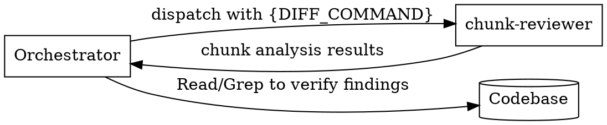
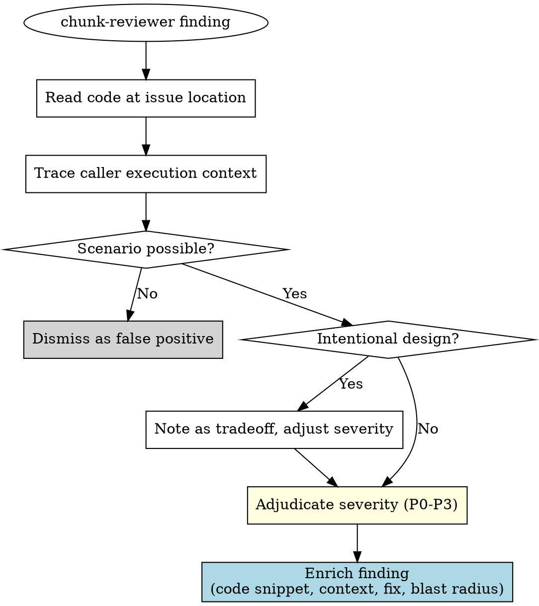

# Code Review

Orchestrates chunk-reviewer agents against diffs. Handles input parsing, context gathering, chunking, and result synthesis.

## Premises (apply to orchestrator AND chunk-reviewer)

These two premises are non-negotiable. They are forwarded to every chunk-reviewer dispatch and they govern every decision in this skill.

1. **Worktree environment** — This review runs inside a git worktree dedicated to the PR/branch under review. Checkout has zero cost to the user's primary working directory. Therefore: **ensure the working directory reflects the post-change state of the target ref before any analysis** — by checking it out (PR mode) or by verifying the caller already arrived on it (other modes). Do not pretend the file system is read-only or stuck at base.

   Note: 비-PR 모드(branch comparison, auto-detect)는 checkout이 발생하지 않으므로 PR 모드의 `--git-dir` 가드는 의도적으로 적용되지 않는다 — 비-PR 모드는 verify-only(HEAD 일치 + clean tree)로 위 "post-change state" 요건을 충족한다. 두 path의 비대칭은 결함이 아니라 설계.

2. **No diff-only review** — A diff is a delta. The unit of review is the *system the diff produces*. Always trace dependencies, callers, callees, interfaces, configurations, and runtime context across files. If you cannot explain how the changed code behaves end-to-end against the surrounding system, you have not reviewed it.

These premises must be reflected in the chunk-reviewer dispatch prompt — see Step 5.

## Input Modes

```bash
# PR (number or URL)
/code-review pr 123
/code-review pr https://github.com/org/repo/pull/123

# Branch comparison
/code-review main feature/auth

# Auto-detect (current branch vs origin/main or origin/master)
/code-review
```

## Do vs Delegate Decision Matrix

| Action | YOU Do | DELEGATE |
|--------|--------|----------|
| Requirements 3-question gate | Yes | - |
| Diff range determination & git | Yes | - |
| Evidence Verification (build/test/lint) | Yes | - |
| Chunking decision | Yes | - |
| Walkthrough/critique synthesis | Yes | - |
| Walkthrough context enrichment | Yes (read code directly) | explore (fallback for broad architectural scope) |
| Finding verification & enrichment (Phase 2) | Yes (read code directly) | - |
| Individual chunk review | NEVER | chunk-reviewer |
| Code modification | NEVER | (forbidden entirely) |

**RULE**: Orchestration, synthesis, decisions, and verification = Do directly by reading code. Multi-model review = DELEGATE to chunk-reviewer. Code modification = FORBIDDEN.

### Role Separation


```dot
digraph role_separation {
    rankdir=LR;
    "Orchestrator" [shape=box];
    "chunk-reviewer" [shape=box];
    "Codebase" [shape=cylinder];
    "Orchestrator" -> "chunk-reviewer" [label="dispatch with {DIFF_COMMAND}"];
    "chunk-reviewer" -> "Orchestrator" [label="chunk analysis results"];
    "Orchestrator" -> "Codebase" [label="Read/Grep to verify findings"];
}
```

**Your role as orchestrator:**
- Dispatch chunk-reviewer agents with diff command strings
- Synthesize chunk analysis results into walkthrough + critique
- **Directly read code to verify chunk-reviewer findings** (Read, Grep, Glob tools)
- Make chunking decisions and determine final verdict

**NOT your role:**
- Modifying any source files
- Running the raw `git diff` command (chunk-reviewers execute the diff)

### Context Budget

**Allowed in orchestrator context:**
- `git diff {range} --stat` output
- `git diff {range} --name-only` output
- `git log {range} --oneline` output
- CLAUDE.md file content
- Step 3 evidence summary (structured table — build/test/lint status + test coverage mapping, truncated to summary on success / last 30 lines on failure)
- chunk-reviewer results
- **Targeted code reading** via Read/Grep/Glob for finding verification (Phase 2) and walkthrough enrichment (Phase 1a)

**Forbidden in orchestrator context:**
- Running the raw `git diff` command (chunk-reviewers execute the diff, not you)
- Modifying any source files

**Context management for code reading:**
- Read only files relevant to specific findings or walkthrough gaps — not the entire diff
- Target 10-30 lines per finding verification (the issue location + caller context)
- For walkthrough enrichment, read key architectural files (configs, base classes) — not every changed file
- If a PR has 50+ findings requiring verification, batch in groups of 10 to manage context

**RULE**: You CAN and SHOULD read code to verify findings and enrich the walkthrough. You CANNOT run the raw diff command or modify files.

## Step 0: Intent and Context Acquisition

**Intent acquisition is non-negotiable.** Either intent is confirmed (from artifacts, interview, or both), or the user explicitly defers to a code-quality-only review. There is no third option — proceeding without intent and without explicit deferral is forbidden. Reviewing without intent produces wrong severities, missed scope creep, and false positives born from misunderstanding the author's goal.

### Acquisition order

1. **PR/branch artifacts** — PR title, description, labels, commit history, code review comments and threads
2. **Linked references (recursive)** — every link found in the artifacts above, followed transitively until the trail ends
3. **Codebase signals** — CLAUDE.md, README, ADRs, related history in changed paths
4. **User interview** — only for what the artifacts cannot reveal

### Acquire all reachable references

PR descriptions, commits, and comments routinely link to richer context (issue trackers, design docs, chat threads). **Follow every link recursively** — a linked ticket may itself link to a doc which links to a discussion thread; keep following until the trail ends.

Do not name specific tools. Use whatever fetch capability the environment provides for each link type. If a link cannot be fetched directly (no credential, no MCP for that platform, network unreachable), do not skip it — mark it for the user interview step.

Sources to consult per input mode:

| Input mode | Sources |
|------------|---------|
| PR | `gh pr view --json title,body,labels,comments,reviews`, `gh pr view --comments`, linked issues, `gh issue view <n>`, every external link found in the chain, commit messages on the PR branch |
| Branch comparison | Commit messages, branch name conventions, any linked tickets discovered in commits, related issues |
| Auto-detect | Recent commit messages on HEAD, any linked tickets found there |

### User interview — only for what artifacts cannot reveal

After exhausting fetchable sources, ask the user about:
- **Intent** — what problem is this PR solving and why was this approach chosen
- **Alternatives** — what was considered and rejected, and why
- **Constraints** — deadlines, dependencies, compatibility commitments, hidden requirements
- **Concerns** — known risks, untested paths, areas the author is uncertain about

DO NOT interview the user about codebase facts (file locations, patterns, architecture, who calls what). Use Read/Grep/Glob and the explore agent for those — they are reachable from the working directory.

### Intent Block Gate (hard exit condition)

Before exiting Step 0, the state must be one of:

| State | Action |
|-------|--------|
| **Intent confirmed** — author's goal, approach, and constraints are understood from artifacts and/or interview | Proceed to Step 1 |
| **User explicit deferral** — user says "skip", "그냥 리뷰해줘", "없어", "code quality only", or unambiguous equivalent | Set {REQUIREMENTS} = "N/A — code-quality-only review (user deferred)" and proceed |
| **Neither** — artifacts thin and user not yet asked, OR user gave vague answers without explicit deferral | **BLOCK**. Do not proceed. Continue interview until one of the two states above is reached. |

There is no "I tried hard enough, just review" path. The block IS the safety mechanism.

### Vague answer refinement

When the user gives a vague answer that is not an explicit deferral, refine ONCE with a specific follow-up:

각 follow-up 메시지는 deferral 옵션을 함께 안내하여 사용자가 "skip / 그냥 리뷰해줘 / 없어" 어휘를 몰라도 escape 가능하도록 한다.

| User says | Follow-up |
|-----------|-----------|
| "대충 있어" / "뭐 좀 있긴 한데" | "어디서 찾을 수 있나요? 링크나 문서 위치를 알려주세요. (답하기 어려우면 'skip'으로 코드 품질만 리뷰 가능)" |
| "그냥 성능 개선이야" | "어떤 지표를 개선하려 했나요? (latency, throughput, memory 등 — 답하기 어려우면 'skip'으로 코드 품질만 리뷰 가능)" |
| "여러 가지 고쳤어" | "가장 중요한 1-2개만 알려주세요. 나머지는 코드에서 식별하겠습니다. (답하기 어려우면 'skip'으로 코드 품질만 리뷰 가능)" |

If refinement still yields a vague answer, surface the block explicitly to the user:

> "의도를 명확히 잡기 어렵습니다. 둘 중 하나를 선택해주세요: (1) [구체적 질문]에 답하여 의도 확정, 또는 (2) 'skip / 코드 품질만 리뷰' 명시적 deferral. 둘 중 하나를 명시하기 전까지 리뷰는 시작하지 않습니다."

This is not adversarial — it is refusing to silently produce a worse review.

### Question discipline

| Situation | Method |
|-----------|--------|
| 2-4 structured choices (review scope, severity threshold) | AskUserQuestion tool |
| Free-form / subjective (intent, alternatives, constraints, concerns) | Plain text question |

**One question per message.** Never bundle. Wait for the answer before the next question.

**Question quality** — every question must include either a specific anchor (a summary the user can correct) or a default action in parentheses (so progress is possible without an answer):

| BAD | GOOD |
|-----|------|
| "요구사항이 있나요?" | "PR 본문과 연결된 이슈에서 [요약]을 추출했습니다. 보완할 부분이 있나요?" |
| "어떤 부분을 볼까요?" | "23개 파일이 변경됐습니다. 집중할 영역이 있나요? (없으면 전체 리뷰)" |

### Project Context

Include project context when interpolating the chunk-reviewer prompt template in Step 5. Describe what kind of software this is, who uses it, how it runs, and what depends on it — based on CLAUDE.md, README.md, and the artifacts gathered above.

If available context is insufficient to characterize the project, ask the user once: "What kind of software is this? (e.g., personal CLI tool, internal team service, public-facing API, shared library, etc.)"

### Step 0 Exit Condition

Proceed to Step 1 only when the Intent Block Gate state is **Intent confirmed** or **User explicit deferral**. Any other state → continue at Step 0.

## Step 1: Input Parsing

Determine range and setup for subsequent steps:

| Input | Setup | Range |
|-------|-------|-------|
| `pr <number or URL>` | Fetch and check out PR ref into the worktree (see below) | `origin/<baseRefName>...pr-<number>` |
| `<base> <target>` | Verify HEAD is `<target>` via `git rev-parse --abbrev-ref HEAD`; verify clean tree via `git status --porcelain`. Abort if mismatch or dirty. | `<base>...<target>` |
| (none) | Detect default branch (`origin/main` or `origin/master`). Verify HEAD is the target branch via `git rev-parse --abbrev-ref HEAD`; verify clean tree via `git status --porcelain`. Abort if mismatch or dirty. | `<default>...HEAD` |

### PR Mode: Worktree Checkout (per Premise 1)

This skill assumes the orchestrator is already running inside a worktree dedicated to this review (the caller is responsible for creating the worktree). Therefore: **fetch the PR ref AND check it out**. The working directory must reflect the post-change state of the PR so that all subsequent code reading (Phase 1a, Phase 2 verification, chunk-reviewer Step 2) sees the actual code under review.

**PR ID 추출 규칙**: 사용자가 URL(`https://github.com/<org>/<repo>/pull/<N>`) 형식으로 호출하면, 아래 bash로 진입하기 *전에* trailing path segment에서 numeric `<N>`을 추출해 `<number>` 자리에 substitute하라. URL을 그대로 substitute하면 `git fetch origin pull/<URL>/head`가 invalid refspec으로 실패하고 `git checkout -B pr-<URL>`이 invalid 브랜치명으로 실패한다.

```bash
# 0. Safety guards (Premise 1 enforcement) — abort BEFORE any state change
if [ -n "$(git status --porcelain)" ]; then
  echo "Error: working directory has uncommitted changes — refusing to checkout over the user's work" >&2
  exit 1
fi
# Distinguish primary repo from linked worktree.
# In a linked worktree, --git-dir points inside .git/worktrees/<wt>,
# while --git-common-dir points to the shared .git directory; they differ.
# In a primary clone they are equal — refuse so we never checkout over the user's main work tree.
if [ "$(git rev-parse --git-dir 2>/dev/null)" = "$(git rev-parse --git-common-dir 2>/dev/null)" ]; then
  echo "Error: refusing to run in primary repo — create a dedicated linked worktree first (Premise 1)" >&2
  exit 1
fi

# 1. Get base branch name
BASE_REF=$(gh pr view <number> --json baseRefName --jq '.baseRefName')

# 2. Fetch base branch first, then PR ref last so FETCH_HEAD points to PR head
#    (rerun-safe — force-push on the PR is picked up on re-review)
git fetch origin ${BASE_REF}
git fetch origin pull/<number>/head

# 3. Reset local pr-<N> to the freshly fetched PR head (FETCH_HEAD) and check it out
#    so the working directory matches the PR state
git checkout -B pr-<number> FETCH_HEAD
```

If the working directory is dirty (uncommitted changes) or the caller is not in a worktree, abort and report — do not silently checkout over the user's work. The worktree premise is the safety net; without it, the safety net is gone.

All range formats use **three-dot syntax** (`A...B`), which is equivalent to `git diff $(git merge-base A B)..B`. This shows only changes introduced by the target since the common ancestor — not changes on the base branch. This prevents false positives when `origin/main` has moved ahead after branching.

All subsequent steps use `{range}` from this table. All diff commands use `git diff {range} -- <files>` for path-filtered output. After checkout, code reading via Read/Grep/Glob reflects the **post-change** state, which is the intended behavior — diff shows the delta, the working directory shows the result.

## Early Exit

After Input Parsing, before proceeding to Step 2:

1. Run `git diff {range} --stat` (using the range determined in Step 1)
2. If empty diff: report "No changes detected (between <base> and <target>)" and exit
3. If binary-only diff: report "Only binary file changes detected" and exit

## Step 2: Context Gathering

Collect in parallel (using `{range}` from Step 1):

1. `git diff {range} --stat` (change scale)
2. `git diff {range} --name-only` (file list)
3. `git log {range} --oneline` (commit history)
4. CLAUDE.md files: repo root + each changed directory's CLAUDE.md (if exists)

## Step 3: Evidence Verification

Run build, test, and lint checks BEFORE dispatching any chunk-reviewer agents. This is a fail-fast gate — a failing check aborts the review immediately.

### Command Discovery

**Do NOT assume commands.** Discover per-project commands in this order:

1. **Memory file first**: `~/.omt/{project}/project-commands.md` — derive `{project}` with: `basename -s .git $(git remote get-url origin 2>/dev/null)`, fallback: `basename $(git rev-parse --show-toplevel 2>/dev/null || pwd)`
2. **Project documentation**: `CLAUDE.md`, `AGENTS.md`, `README.md`, `CONTRIBUTING.md`
3. **Build files**: `package.json` scripts, `build.gradle` / `build.gradle.kts` tasks, `Makefile` targets, `pyproject.toml`, `Cargo.toml`
4. **If still unclear**: Ask user for build/test/lint commands

Discovery is **per-command** and **independent** — if build is found but lint is not, run build and test; skip only the undiscovered command. If no commands are discovered at all, skip this step with the unavailable message (see Output Format below).

Default timeout per command: **120 seconds**.

### Execution Order

Run in sequence — stop immediately on first failure:

1. Build / compile
2. Full test suite
3. Linter / static analysis

**Any failure → do NOT dispatch chunk-reviewer agents. Report failure and exit.**

### Output Format: {EVIDENCE_RESULTS}

Produce a two-part structured table after all checks complete.

**Part 1 — Automated Checks**

| Check | Status | Details |
|-------|--------|---------|
| Build | PASS / FAIL | Success: one-line summary. Failure: last 30 lines of output |
| Tests | PASS (N passed) / FAIL (N/M failed) | Success: pass count. Failure: last 30 lines of output |
| Lint | PASS / FAIL | Success: one-line summary or "No errors". Failure: last 30 lines of output |

**Part 2 — Test Coverage Mapping**

Identify production source files from the Step 2 file list: source code files (exclude non-code files such as config, documentation, build scripts, migrations, Markdown, YAML, JSON, images, etc.) that do NOT match test glob patterns (`*Test*`, `*Spec*`, `*_test*`, `test_*`, `*.test.*`, `*.spec.*`, `*_spec*`).

For each production source file, find its corresponding test file:

| Production Source File | Test File | Coverage Status |
|------------------------|-----------|-----------------|
| `path/to/File.kt` | `path/to/FileTest.kt` | In diff / Exists, not in diff / No test found |

Coverage Status values:
- **In diff**: test file exists AND is in the diff (changed alongside production code)
- **Exists, not in diff**: test file exists in the repo but was NOT changed
- **No test found**: no test file matching the production source file name found

If more than 30 production source files are in the diff, group by directory instead of listing per file.

**Unavailable message** (no commands discovered): "Evidence verification unavailable — no build/test/lint commands discovered"

### Fail-Fast Gate

If any check fails:
1. Populate {EVIDENCE_RESULTS} Part 1 with the failure details (last 30 lines of failing command output)
2. Omit Part 2 (Test Coverage Mapping) — it is not needed on failure
3. Do NOT proceed to Step 4 or dispatch chunk-reviewer agents
4. Report {EVIDENCE_RESULTS} and exit immediately

## Step 4: Chunking Decision

Determine scale from `--stat` summary line (`N files changed, X insertions(+), Y deletions(-)`):

| Condition | Strategy |
|-----------|----------|
| Total changed lines (insertions + deletions) < 1500 AND changed files < 30 | Single review |
| Total changed lines >= 1500 OR changed files >= 30 | Group into chunks by directory/module affinity |

Chunking heuristic: group files sharing a directory prefix or import relationships.

**Per-chunk size guide:**
- Target ~1500 lines per chunk (soft guide — files are the atomic unit)
- If adding the next file exceeds ~1500 lines, start a new chunk
- If a single file alone exceeds ~1500 lines, it becomes its own chunk
- If a directory group is oversized, split by subdirectory; if still oversized (flat structure), batch alphabetically (~10-15 files per chunk)

### Per-Chunk Diff Command Construction

For each chunk, construct the diff command string using git's native path filtering:

```bash
git diff {range} -- <file1> <file2> ... <fileN>
```

The orchestrator constructs this command string but does NOT execute it. The command is passed to the chunk-reviewer via {DIFF_COMMAND}, and each reviewer CLI executes it independently.

## Step 5: Agent Dispatch

1. Read dispatch template from `../orchestrate-review/scripts/chunk-reviewer-prompt.md`
2. Interpolate placeholders with context from Steps 0-4:
   - {WHAT_WAS_IMPLEMENTED} ← Step 0 description
   - {DESCRIPTION} ← Step 0 or commit messages
   - {REQUIREMENTS} ← Step 0 requirements (or "N/A - code quality review only")
   - {PROJECT_CONTEXT} ← Step 0 project context
   - {FILE_LIST} ← Step 2 file list
   - {DIFF_COMMAND} ← diff command string: `git diff {range}` (single chunk) or `git diff {range} -- <chunk-files>` (multi-chunk). Orchestrator constructs this string but does NOT execute it.
   - {CLAUDE_MD} ← Step 2 CLAUDE.md content (or empty)
   - {COMMIT_HISTORY} ← Step 2 commit history
   - {EVIDENCE_RESULTS} ← Step 3 evidence summary (Source: Step 3. Fallback: "Evidence verification unavailable — no build/test/lint commands discovered")
3. Dispatch `chunk-reviewer` agent(s) via Task tool (`subagent_type: "chunk-reviewer"`) with interpolated prompt

**Dispatch rules:**

| Scale | Action |
|-------|--------|
| Single chunk | 1 agent call |
| Multiple chunks | Parallel dispatch -- all chunks in ONE response. Each chunk gets its own interpolated template with chunk-specific {DIFF_COMMAND} and {FILE_LIST} |

### Result Scope Validation

After all chunk-reviewers return, verify each response covers all files in its assigned FILE_LIST.
If any chunk response clearly omits assigned files, re-dispatch a new chunk-reviewer with only the missing files.
Cap: maximum 1 re-dispatch per original chunk; if the re-dispatch also fails, accept partial coverage.
After all re-dispatches complete, merge all chunk results (original + re-dispatched) before proceeding to Step 6.

## Step 6: Walkthrough Synthesis + Result Synthesis

After all agents return, produce the final output in two phases.

### Phase 1: Walkthrough Synthesis (MANDATORY)

Orchestrator directly produces the Walkthrough from:
- All chunk Chunk Analysis sections (per-symbol/per-file What Changed descriptions from chunk-reviewer agents)
- Step 2 context (CLAUDE.md, commit history) + Phase 1a results (if any)

**Execution order:** First evaluate Phase 1a (context enrichment). Then generate the sections below.

### Phase 1a: Context Enrichment (Conditional)

After reading all chunk Chunk Analysis sections (What Changed entries), assess whether the available information is sufficient to write the Walkthrough. If gaps exist, **read the relevant code directly** before writing Phase 1 output.

**When to read code for enrichment:**

| Gap | What to Read | Example |
|-----|-------------|---------|
| Cross-module relationships unclear | Interfaces, base classes, caller/callee code | "Chunk A shows OrderService calling PaymentGateway — read the gateway interface and its implementations" |
| Architecture hierarchy unknown | Class hierarchy, module structure | "New class extends BaseRepository — read the base class to understand the contract" |
| Inconsistent patterns across chunks | Both implementations + project conventions | "Chunk A uses Result<T>, Chunk B uses exceptions — read both to determine project convention" |

**When NOT to enrich:**

| Condition | Reason |
|-----------|--------|
| Simple changes (test-only, doc-only, config-only, single-function logic) | Chunk analysis is self-sufficient |
| Chunk analysis provides complete understanding of all changed modules | No gaps to fill |
| Trivial diff (< 5 files, < 100 lines) | Sparse analysis is expected, not a gap |

**Fallback**: For very broad architectural exploration (10+ files across many modules), dispatch an explore agent instead of reading everything directly. This is the exception, not the default.

**Data flow:**
```
Phase 1: Read all What Changed entries from Chunk Analysis
       → Assess: sufficient for Walkthrough?
       → If gaps: Read relevant code directly (Read/Grep/Glob)
       → Write Walkthrough using: What Changed entries + Step 2 metadata + code reading results
```

#### Change Summary
- 1-2 paragraph prose summary of the entire change's purpose and context
- Include motivation, approach taken, and overall impact
- Written for someone unfamiliar with the code to understand the change

#### Core Logic Analysis
- Consolidate all What Changed entries into a unified module/feature-level narrative
- Cover both core changes AND supporting/peripheral changes
- Enrich with Step 2 metadata (commit messages, PR description, CLAUDE.md) and Phase 1a results when available
- Explain data flow, design decisions, and side effects from the perspective of inter-module relationships
- Level of detail: enough to understand the full change WITHOUT reading the code

#### Architecture Diagram
- Mermaid class diagram or component diagram
- Show changed classes/modules and their relationships (inheritance, composition, dependency)
- Distinguish new vs modified elements
- If no structural changes (e.g., logic-only changes within existing methods): write "No structural changes — existing architecture preserved"

#### Sequence Diagram
- Mermaid sequence diagram visualizing the primary call flow(s) affected by the changes
- Include actors, method calls, return values, and significant conditional branches
- If no call flow changes (e.g., variable rename, config change): write "No call flow changes"

### Severity Rubric (P0-P3)

Workers **propose** P-levels with supporting evidence. The orchestrator **adjudicates** the final P-level based on worker proposals and their reasoning.

| P-Level | Impact Delta | Probability | Maintainability |
|---------|-------------|-------------|-----------------|
| **P0** (must-fix) | Outage, data loss, or security breach | Triggered during normal operation | System inoperable if unfixed |
| **P1** (should-fix) | **Demonstrable defect**: partial failure, incorrect behavior, data corruption, or security weakness in the current code | **Occurs under realistic conditions** that exist today -- not hypothetical future states | Fix corrects an actual bug or closes a real vulnerability |
| **P2** (consider-fix) | **(a)** Bug exists but trigger probability is unrealistic today, OR **(b)** No bug today but code will predictably fail as the system grows/evolves, OR **(c)** No bug but maintainability significantly improves | Low probability today, or projected under realistic growth/change | Significant improvement to resilience, debuggability, or long-term health |
| **P3** (optional) | No correctness issue, no projected failure | N/A | Readability, consistency, or style improvement only |

**P1 vs P2 Decision Gate:** "Is there a defect in the current code, AND does it manifest under conditions that exist today?" Both must be yes for P1. If the defect's trigger is unrealistic → P2(a). If no defect today but predictable future failure → P2(b). If no defect and no projected failure but significant maintainability gain → P2(c).

### Phase 2: Critique Synthesis

For multi-chunk reviews:

1. **Merge** all Strengths, Issues, Recommendations sections
2. **Deduplicate** issues appearing in multiple chunks
   - When the same issue appears across chunks at different P-levels, promote to the highest P-level (e.g., P1 in Chunk A + P0 in Chunk B → promote to P0)
3. **Identify cross-file concerns** -- issues spanning chunk boundaries (e.g., interface contract mismatches, inconsistent error handling patterns)
4. **Normalize severity labels** across chunks using the P0-P3 rubric. When the same issue appears in multiple chunks at different P-levels, promote to the highest P-level and note the discrepancy.
5. **Collect per-worker verdicts** from all chunks for Final Adjudication
6. **Produce unified critique** (Strengths / Issues / Recommendations / Assessment)

For single-chunk reviews, Phase 2 still performs Final Adjudication (severity adjudication, verdict determination, Out of Scope classification) on the single chunk's results before producing final output.

#### Step 7: Final Severity Adjudication

Workers **propose** severity levels with supporting evidence; the orchestrator **adjudicates** the final P-level. Workers are evidence providers — their analyses are inputs to the orchestrator's judgment, not substitutes for it. Treat their severity assessments with critical objectivity — always question, always verify before accepting. Unanimous agreement among workers does not exempt the orchestrator from deliberation.

**Order of operations:** Adjudicate per-worker severity within each chunk FIRST. Then normalize across chunks by promoting to the highest adjudicated P-level.

| Condition | Action |
|-----------|--------|
| All workers agree on P-level | Apply Project Context Check. If workers' probability and impact assumptions are consistent with the actual project context → adopt with brief confirmation (e.g., "Workers' P1 assessment aligns with project context: the defect manifests under today's traffic conditions."). If project context contradicts workers' assumptions → perform full rubric adjudication with justification citing the decisive axis. |
| Workers disagree on P-level | Orchestrator evaluates each worker's reasoning against the P0-P3 rubric (3-axis: impact delta, probability, maintainability). Apply the P1/P2 decision gate: "Is there a demonstrable defect that manifests under today's conditions?" Assign final P-level with 1-2 sentence justification citing the decisive axis. |

**Project Context Check:** Before finalizing each P-level, verify that the workers' probability and impact assessments are realistic for the actual project context. Ask: "Does the threat model these workers assumed match this project?"

Examples of context-driven recalibration (both directions — context can lower OR raise severity):

- **Models assess P2 for silent numeric truncation. Project processes financial transactions.** — Models may treat truncation as a minor data quality issue because the field is rarely at boundary values. But the project context shows this service calculates payment amounts subject to regulatory audit. Even rare truncation produces incorrect financial records with legal consequences. The impact axis shifts from "cosmetic data issue" to "regulatory violation." Recalibrate **upward to P0** (the domain amplifies impact beyond what the code pattern alone suggests).

- **Models assess P0 for missing auth on endpoint. Project is a localhost-only dev tool.** — Models flag any unauthenticated endpoint as a security breach. But the project context shows the tool binds to localhost only, has no network exposure, and is used by a single developer. There is no remote attacker who can reach this endpoint. The probability axis shifts from "any network user can access" to "requires local access that the developer already has." Recalibrate **downward to P3** (the security pattern is real but the attack surface does not exist).

- **Models assess P1 for no circuit breaker. Project is a utility library.** — Models flag missing circuit breaker as a resilience gap. But the project context shows this is a utility library that does not make network calls — its consumers do. The library cannot implement a circuit breaker because it does not control the network layer. This is not a lower-severity issue; it is a **false positive** — the concern is misapplied to the wrong architectural layer. Recalibrate: **dismiss** (not applicable to this codebase; if worth noting, add as a recommendation for consumers, not as an issue in this code).

- **Models assess P3 for missing pagination. Project is a rapidly growing SaaS.** — Models treat unbounded queries as a style issue because the current dataset is small. But the project context shows user growth of 10x per quarter with no ceiling. If current queries already show measurable latency degradation at today's data volume: recalibrate **upward to P1** (demonstrable defect under today's conditions -- the defect exists and manifests now). If current dataset is still within SLA but growth trajectory makes future degradation certain: recalibrate **upward to P2(b)** (no defect today, but predictable failure under realistic growth).

**Direct Finding Verification (MANDATORY):** Before adjudicating severity for ANY finding — regardless of consensus level — the orchestrator MUST verify the factual claim by reading the actual code. Workers analyze diffs in isolation and may miss runtime context (caller execution model, messaging topology, transaction boundaries). Unanimous agreement does not make a claim true.

For each finding, read the relevant code and verify:
1. **Is the claimed scenario structurally possible?** Trace the call chain from the entry point to the issue location. Check the caller's execution model (threading, message dispatch, scheduling).
2. **Does the runtime context support the claim?** A race condition requires concurrent access. A message ordering issue requires out-of-order delivery. Verify these preconditions against the actual infrastructure (e.g., Kafka partition key, consumer group config, thread pool setup).
3. **Is this an intentional design choice?** Check for comments, commit messages, or PR description that explain the pattern as a deliberate tradeoff.


```dot
digraph verification_flow {
    rankdir=TB;
    "chunk-reviewer finding" [shape=ellipse];
    "Read code at issue location" [shape=box];
    "Trace caller execution context" [shape=box];
    "Scenario possible?" [shape=diamond];
    "Dismiss as false positive" [shape=box, style=filled, fillcolor=lightgray];
    "Intentional design?" [shape=diamond];
    "Note as tradeoff, adjust severity" [shape=box];
    "Adjudicate severity (P0-P3)" [shape=box, style=filled, fillcolor=lightyellow];
    "Enrich finding\n(code snippet, context, fix, blast radius)" [shape=box, style=filled, fillcolor=lightblue];

    "chunk-reviewer finding" -> "Read code at issue location";
    "Read code at issue location" -> "Trace caller execution context";
    "Trace caller execution context" -> "Scenario possible?";
    "Scenario possible?" -> "Dismiss as false positive" [label="No"];
    "Scenario possible?" -> "Intentional design?" [label="Yes"];
    "Intentional design?" -> "Note as tradeoff, adjust severity" [label="Yes"];
    "Intentional design?" -> "Adjudicate severity (P0-P3)" [label="No"];
    "Note as tradeoff, adjust severity" -> "Adjudicate severity (P0-P3)";
    "Adjudicate severity (P0-P3)" -> "Enrich finding\n(code snippet, context, fix, blast radius)";
}
```

**Verification produces enrichment as a byproduct.** When you read code to verify a finding, you already have the code snippet, understand the context, and can identify the blast radius. Capture these during verification — no separate enrichment phase needed.

**Enrichment fields to produce during verification:**
- **Current Code**: 5-15 lines centered on the issue (already read for verification)
- **Context**: Function/class it belongs to, data flow (discovered while tracing call chain)
- **Fix**: Concrete diff or design direction (informed by verified understanding)
- **Blast Radius**: Use Grep/Glob to find references to affected symbols

**Adjudication examples:**

- **Unanimous agreement, context validates.** Three workers assess P1 for "no dead-letter queue on Kafka consumer." Workers cite: deserialization failures in current logs, schema changed twice last quarter, failed messages permanently lost. Project context: production order processing service with active schema evolution. — Orchestrator confirms: workers' probability assessment ("schema changes cause deserialization failures today") is consistent with project context. **Adopt P1.** Confirmation: "Workers' P1 aligns with project context — deserialization failures are confirmed in current logs, not hypothetical."

- **Unanimous agreement, context contradicts.** Three workers assess P0 for "no rate limiting on API endpoint." Workers cite: any user can exhaust resources, causing outage for all users. Project context: internal admin dashboard behind corporate VPN, used by 3 team members. — Orchestrator overrides: workers assumed a public-facing threat model, but the project context shows no external access. The 3 internal users cannot produce meaningful load. The probability axis shifts from "normal operation" to "impossible under current deployment." **Recalibrate to P3.** Decisive axis: probability — the threat model workers assumed does not match this project.

- **Worker disagreement.** Worker A assesses P1 for "deprecated Elasticsearch RestHighLevelClient." Reasoning: "deprecated API is a defect; ES upgrade is planned next quarter." Worker B assesses P2(b). Reasoning: "the client works correctly with current ES 8.x; failure is future, not today." — Orchestrator applies P1/P2 decision gate: (1) Is there a defect in the current code? The client functions correctly — no incorrect behavior today. (2) Does it manifest under today's conditions? No — the deprecation has no runtime effect on ES 8.x. Worker A conflated "deprecated" with "defective." **Adjudicated P2(b).** Decisive axis: probability — the trigger (ES 9.0 removal) does not exist under today's conditions.

#### Step 8: Final Verdict Determination

| Condition | Verdict | Merge Gate |
|-----------|---------|------------|
| P0 issues unresolved | **No** | Hard block -- no exceptions |
| Only P1 issues unresolved | **No** (default) / **Yes with conditions** (override) | Soft block -- override requires: (1) explicit justification per P1 issue, (2) tracking artifact (issue number, TODO with ticket), and (3) confirmation that fix timeline is committed |
| Only P2/P3 issues | **Yes** | Non-blocking |

**Override Protocol for P1 Soft Block:**
When the orchestrator determines "Yes with conditions" for P1 issues, the Assessment section must include:
- Per-P1 justification: why deferral is acceptable for this specific issue
- Tracking artifact: issue number or TODO with ticket reference
- Fix timeline: when the fix will be delivered (e.g., "next sprint", "follow-up PR")
- Conditions without tracking artifacts are not valid overrides

#### Step 9: Out of Scope Classification

1. Collect issues tagged `[Pre-existing]` by reviewers
2. Place in `### Out of Scope (Pre-existing Issues)` section
3. Sort by P-level (P0 > P1 > P2 > P3), then by file path within same level
4. These do NOT affect merge verdict

**Exception:** If PR aggravates a pre-existing issue (increases blast radius, frequency, or severity), move to main issues section.

**Cross-chunk rule:** If ANY worker in ANY chunk flags an issue as non-pre-existing (on a changed line), treat as current issue in main section.

### Phase 2 Data Flow (Verification + Enrichment Combined)

```
chunk-reviewer results (proposed findings with P-levels)
  → Merge/deduplicate across chunks
  → For each finding: Read code → Trace caller context → Verify claim
  → Dismiss false positives / Adjust severity based on verified context
  → Enrichment fields captured as byproduct of verification
  → Final Adjudication (severity, verdict, out-of-scope)
  → Generate Final Output with verified, enriched findings
```

#### Edge Cases

| Situation | Handling |
|-----------|----------|
| Finding references a deleted file | Read the file at base branch (`git show {base}:{file}`). Note "(deleted file)" in Context. |
| Finding spans multiple files | Primary file gets the code snippet. Other files listed in Blast Radius with brief context. |
| Fix cannot be expressed as simple diff | State design direction + "Concrete diff not possible — structural change required". |
| Zero findings after verification | Skip enrichment. Report clean review. |
| 50+ findings requiring verification | Batch in groups of 10 by file proximity. Verify highest-severity first. |

### Final Output Format

```
## Walkthrough

### Change Summary
[Generated in Phase 1]

### Core Logic Analysis
[Generated in Phase 1]

### Architecture Diagram
[Generated in Phase 1 — Mermaid or "No structural changes — existing architecture preserved"]

### Sequence Diagram
[Generated in Phase 1 — Mermaid or "No call flow changes"]

---

## Strengths
[Generated in Phase 2]

## Issues

### P0 (Must Fix)
[Issues that block merge: outage, data loss, security vulnerabilities triggered in normal operation]

### P1 (Should Fix)
[Demonstrable defects: partial failure, incorrect behavior, data corruption, or security weakness under today's realistic conditions]

### P2 (Consider Fix)
[Bugs with unrealistic triggers today, OR predictable future failures, OR significant maintainability improvements]

### P3 (Optional)
[Quality, readability, consistency improvements with no correctness or maintainability concern]

Per-issue format (enriched during Phase 2 verification):
**[P{X}-{N}] {issue title}**
- **Location**: `{file}:{line}` — {section/function name}
- **Current Code**:
  ```{lang}
  [5-15 lines centered on the issue]
  ```
- **Context**: {what procedure/section this is in} → {data flow: input source → output destination}
- **Problem**: {problem description}
- **Impact**: {impact + probability merged into actionable statement}
- **Fix**:
  ```diff
  [concrete diff showing the fix]
  ```
- **Blast Radius**: {grep/reference evidence — what other files reference this, or "This location only"}
- **Review Consensus**: {N}/3 models identified ({Model A} P{X}, {Model B} P{Y}; adjudicated P{Z} because {reason})

Numbering: {N} is a sequential counter within each P-level section (e.g., P0-1, P0-2, P1-1, P1-2, P1-3).

Fallback (verification skipped): If a finding could not be verified due to context budget constraints, omit Current Code, Context, Blast Radius fields. Use worker's Fix text as Fix. Prepend "(unverified)" to the issue title.

## Out of Scope (Pre-existing Issues)
[Issues in unchanged context lines, sorted by P-level then file path. Do not affect merge verdict.]

## Recommendations
[Generated in Phase 2]

## Assessment
[Generated in Phase 2]
```

### Example Final Output

See `references/output-example.md` for a complete example synthesized from 3 chunks (Order API + domain, Payment integration, Inventory + messaging). Read it when producing your first review output to understand the expected format, level of detail, and enrichment style.
