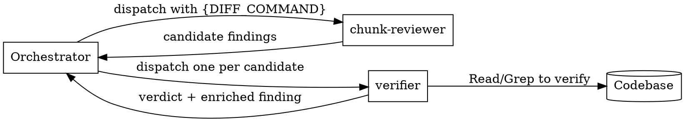

# Code Review

Orchestrates chunk-reviewer agents against diffs. Handles input parsing, context gathering, chunking, and result synthesis.

## Premises (apply to orchestrator AND chunk-reviewer)

These two premises are non-negotiable. They are forwarded to every chunk-reviewer dispatch and they govern every decision in this skill.

1. **Post-change state** — The working directory reflects the post-change state of the target ref. PR mode achieves this by checking out the PR head into a dedicated linked worktree (see Step 1). Non-PR modes (branch comparison, auto-detect) achieve this by verifying HEAD-match + clean-tree on the current working directory (also Step 1). Either way: read code freely from the working directory — the diff is the delta, the working directory is the result. Do not pretend the file system is read-only or stuck at base.

2. **No diff-only review** — A diff is a delta. The unit of review is the *system the diff produces*. Always trace dependencies, callers, callees, interfaces, configurations, and runtime context across files. If you cannot explain how the changed code behaves end-to-end against the surrounding system, you have not reviewed it.

These premises must be reflected in the chunk-reviewer dispatch prompt — see Step 5.

## Input Modes

```bash
# PR (number or URL)
/code-review pr 123
/code-review pr https://github.com/org/repo/pull/123

# Branch comparison
/code-review main feature/auth

# Auto-detect (current branch vs origin/main or origin/master)
/code-review
```

## Do vs Delegate Decision Matrix

| Action | YOU Do | DELEGATE |
|--------|--------|----------|
| Requirements 3-question gate | Yes | - |
| Diff range determination & git | Yes | - |
| Evidence Verification (build/test/lint) | Yes | - |
| Chunking decision | Yes | - |
| Findings synthesis (rank/class verified findings) | Yes | - |
| Individual candidate verification (Phase 2) | NEVER | verifier subagent (one per candidate) |
| Individual chunk review | NEVER | chunk-reviewer |
| Code modification | NEVER | (forbidden entirely) |

**RULE**: Orchestration, synthesis, and decisions = Do directly. Per-candidate verification = DELEGATE to verifier subagents (one per candidate). Multi-angle finding = DELEGATE to chunk-reviewer. Code modification = FORBIDDEN.

### Role Separation


```dot
digraph role_separation {
    rankdir=LR;
    "Orchestrator" [shape=box];
    "chunk-reviewer" [shape=box];
    "verifier" [shape=box];
    "Codebase" [shape=cylinder];
    "Orchestrator" -> "chunk-reviewer" [label="dispatch with {DIFF_COMMAND}"];
    "chunk-reviewer" -> "Orchestrator" [label="candidate findings"];
    "Orchestrator" -> "verifier" [label="dispatch one per candidate"];
    "verifier" -> "Codebase" [label="Read/Grep to verify"];
    "verifier" -> "Orchestrator" [label="verdict + enriched finding"];
}
```

**Your role as orchestrator:**
- Dispatch chunk-reviewer agents with diff command strings (each fans out the angle finders)
- Dispatch one verifier subagent per candidate; collect their verdicts and drop REFUTED
- Synthesize the kept findings into a ranked findings report (text only)
- Make chunking decisions and rank the verified findings (no merge verdict — this review reports, it does not gate)

**NOT your role:**
- Modifying any source files
- Running the raw `git diff` command (chunk-reviewers and verifiers execute the diff)
- Judging candidates in your own context — each candidate goes to its own verifier subagent

### Context Budget

**Allowed in orchestrator context:**
- `git diff {range} --stat` output
- `git diff {range} --name-only` output
- `git log {range} --oneline` output
- CLAUDE.md file content
- Step 3 evidence summary (structured table — build/test/lint status + test coverage mapping, truncated to summary on success / last 30 lines on failure)
- chunk-reviewer results (candidate findings)
- Verifier subagent verdicts + enriched findings (Phase 2)

**Forbidden in orchestrator context:**
- Running the raw `git diff` command (chunk-reviewers and verifiers execute the diff, not you)
- Reading code to verify candidates in your own context (each candidate goes to its own verifier subagent)
- Modifying any source files

**Context management:**
- Per-candidate code reading happens inside verifier subagents, not your context — see Phase 2 cap & batching

**RULE**: Per-candidate verification is delegated to verifier subagents. You CANNOT run the raw diff command or modify files.

## Step 0: Intent and Context Acquisition

**Intent acquisition is non-negotiable.** Either intent is confirmed (from artifacts, interview, or both), or the user explicitly defers to a code-quality-only review. There is no third option — proceeding without intent and without explicit deferral is forbidden. Reviewing without intent produces wrong severities, missed scope creep, and false positives born from misunderstanding the author's goal.

### Acquisition order

1. **PR/branch artifacts** — PR title, description, labels, commit history, code review comments and threads
2. **Linked references (recursive)** — every link found in the artifacts above, followed transitively until the trail ends
3. **Codebase signals** — CLAUDE.md, README, ADRs, related history in changed paths
4. **User interview** — only for what the artifacts cannot reveal

### Acquire all reachable references

PR descriptions, commits, and comments routinely link to richer context (issue trackers, design docs, chat threads). **Follow every link recursively** — a linked ticket may itself link to a doc which links to a discussion thread; keep following until the trail ends.

Do not name specific tools. Use whatever fetch capability the environment provides for each link type. If a link cannot be fetched directly (no credential, no MCP for that platform, network unreachable), do not skip it — mark it for the user interview step.

Sources to consult per input mode:

| Input mode | Sources |
|------------|---------|
| PR | `gh pr view --json title,body,labels,comments,reviews`, `gh pr view --comments`, linked issues, `gh issue view <n>`, every external link found in the chain, commit messages on the PR branch |
| Branch comparison | Commit messages, branch name conventions, any linked tickets discovered in commits, related issues |
| Auto-detect | Recent commit messages on HEAD, any linked tickets found there |

### User interview — only for what artifacts cannot reveal

After exhausting fetchable sources, ask the user about:
- **Intent** — what problem is this PR solving and why was this approach chosen
- **Alternatives** — what was considered and rejected, and why
- **Constraints** — deadlines, dependencies, compatibility commitments, hidden requirements
- **Concerns** — known risks, untested paths, areas the author is uncertain about

DO NOT interview the user about codebase facts (file locations, patterns, architecture, who calls what). Use Read/Grep/Glob and the explore agent for those — they are reachable from the working directory.

### Intent Block Gate (hard exit condition)

Before exiting Step 0, the state must be one of:

| State | Action |
|-------|--------|
| **Intent confirmed** — author's goal, approach, and constraints are understood from artifacts and/or interview | Proceed to Step 1 |
| **User explicit deferral** — user says "skip", "그냥 리뷰해줘", "없어", "code quality only", or unambiguous equivalent | Set {REQUIREMENTS} = "N/A — code-quality-only review (user deferred)" and proceed |
| **Neither** — artifacts thin and user not yet asked, OR user gave vague answers without explicit deferral | **BLOCK**. Do not proceed. Continue interview until one of the two states above is reached. |

There is no "I tried hard enough, just review" path. The block IS the safety mechanism.

### Vague answer refinement

When the user gives a vague answer that is not an explicit deferral, refine ONCE with a specific follow-up:

각 follow-up 메시지는 deferral 옵션을 함께 안내하여 사용자가 "skip / 그냥 리뷰해줘 / 없어" 어휘를 몰라도 escape 가능하도록 한다.

| User says | Follow-up |
|-----------|-----------|
| "대충 있어" / "뭐 좀 있긴 한데" | "어디서 찾을 수 있나요? 링크나 문서 위치를 알려주세요. (답하기 어려우면 'skip'으로 코드 품질만 리뷰 가능)" |
| "그냥 성능 개선이야" | "어떤 지표를 개선하려 했나요? (latency, throughput, memory 등 — 답하기 어려우면 'skip'으로 코드 품질만 리뷰 가능)" |
| "여러 가지 고쳤어" | "가장 중요한 1-2개만 알려주세요. 나머지는 코드에서 식별하겠습니다. (답하기 어려우면 'skip'으로 코드 품질만 리뷰 가능)" |

If refinement still yields a vague answer, surface the block explicitly to the user:

> "의도를 명확히 잡기 어렵습니다. 둘 중 하나를 선택해주세요: (1) [구체적 질문]에 답하여 의도 확정, 또는 (2) 'skip / 코드 품질만 리뷰' 명시적 deferral. 둘 중 하나를 명시하기 전까지 리뷰는 시작하지 않습니다."

This is not adversarial — it is refusing to silently produce a worse review.

### Question discipline

| Situation | Method |
|-----------|--------|
| 2-4 structured choices (review scope, focus areas) | AskUserQuestion tool |
| Free-form / subjective (intent, alternatives, constraints, concerns) | Plain text question |

**One question per message.** Never bundle. Wait for the answer before the next question.

**Question quality** — every question must include either a specific anchor (a summary the user can correct) or a default action in parentheses (so progress is possible without an answer):

| BAD | GOOD |
|-----|------|
| "요구사항이 있나요?" | "PR 본문과 연결된 이슈에서 [요약]을 추출했습니다. 보완할 부분이 있나요?" |
| "어떤 부분을 볼까요?" | "23개 파일이 변경됐습니다. 집중할 영역이 있나요? (없으면 전체 리뷰)" |

### Project Context

Include project context when interpolating the chunk-reviewer prompt template in Step 5. Describe what kind of software this is, who uses it, how it runs, and what depends on it — based on CLAUDE.md, README.md, and the artifacts gathered above.

If available context is insufficient to characterize the project, ask the user once: "What kind of software is this? (e.g., personal CLI tool, internal team service, public-facing API, shared library, etc.)"

### Step 0 Exit Condition

Proceed to Step 1 only when the Intent Block Gate state is **Intent confirmed** or **User explicit deferral**. Any other state → continue at Step 0.

## Step 1: Input Parsing

Determine range and setup for subsequent steps:

| Input | Setup | Range |
|-------|-------|-------|
| `pr <number or URL>` | Fetch and check out PR ref into the worktree (see below) | `origin/<baseRefName>...pr-<number>` |
| `<base> <target>` | Verify HEAD is `<target>` via `git rev-parse --abbrev-ref HEAD`; verify clean tree via `git status --porcelain -uno`. Abort if mismatch or dirty. | `<base>...<target>` |
| (none) | Detect default branch (`origin/main` or `origin/master`). Verify HEAD is the target branch via `git rev-parse --abbrev-ref HEAD`; verify clean tree via `git status --porcelain -uno`. Abort if mismatch or dirty. | `<default>...HEAD` |

### PR Mode: Worktree Checkout (per Premise 1)

This skill assumes the orchestrator is already running inside a worktree dedicated to this review (the caller is responsible for creating the worktree). Therefore: **fetch the PR ref AND check it out**. The working directory must reflect the post-change state of the PR so that all subsequent code reading (Phase 2 verification, chunk-reviewer Step 2) sees the actual code under review.

**PR ID 추출 규칙**: 사용자가 URL(`https://github.com/<org>/<repo>/pull/<N>`) 형식으로 호출하면, 아래 bash로 진입하기 *전에* trailing path segment에서 numeric `<N>`을 추출해 `<number>` 자리에 substitute하라. URL을 그대로 substitute하면 `git fetch origin pull/<URL>/head`가 invalid refspec으로 실패하고 `git checkout -B pr-<URL>`이 invalid 브랜치명으로 실패한다.

```bash
set -euo pipefail

# 0. Safety guards (Premise 1 enforcement) — abort BEFORE any state change
# -uno: untracked files are preserved by checkout; only check tracked modifications
if [ -n "$(git status --porcelain -uno)" ]; then
  echo "Error: working directory has uncommitted changes — refusing to checkout over the user's work" >&2
  exit 1
fi
# Distinguish primary repo from linked worktree.
# In a linked worktree, --git-dir points inside .git/worktrees/<wt>,
# while --git-common-dir points to the shared .git directory; they differ.
# In a primary clone they are equal — refuse so we never checkout over the user's main work tree.
if [ "$(git rev-parse --git-dir 2>/dev/null)" = "$(git rev-parse --git-common-dir 2>/dev/null)" ]; then
  echo "Error: refusing to run in primary repo — create a dedicated linked worktree first (Premise 1). Hint: 'git worktree add ../review-pr-<N> -b review/pr-<N>'" >&2
  exit 1
fi

# 1. Get base branch name (abort if gh fails or returns empty)
BASE_REF=$(gh pr view <number> --json baseRefName --jq '.baseRefName')
if [ -z "$BASE_REF" ]; then
  echo "Error: gh pr view returned empty baseRefName — aborting before any fetch" >&2
  exit 1
fi

# 2. Fetch base branch first, then PR ref last so FETCH_HEAD points to PR head
#    (rerun-safe — force-push on the PR is picked up on re-review)
git fetch origin "${BASE_REF}"
git fetch origin pull/<number>/head

# 3. Reset local pr-<N> to the freshly fetched PR head (FETCH_HEAD) and check it out
#    so the working directory matches the PR state
git checkout -B pr-<number> FETCH_HEAD
```

If the working directory is dirty (uncommitted changes) or the caller is not in a worktree, abort and report — do not silently checkout over the user's work. The worktree premise is the safety net; without it, the safety net is gone.

All range formats use **three-dot syntax** (`A...B`), which is equivalent to `git diff $(git merge-base A B)..B`. This shows only changes introduced by the target since the common ancestor — not changes on the base branch. This prevents false positives when `origin/main` has moved ahead after branching.

All subsequent steps use `{range}` from this table. All diff commands use `git diff {range} -- <files>` for path-filtered output. After checkout, code reading via Read/Grep/Glob reflects the **post-change** state, which is the intended behavior — diff shows the delta, the working directory shows the result.

## Early Exit

After Input Parsing, before proceeding to Step 2:

1. Run `git diff {range} --stat` (using the range determined in Step 1)
2. If empty diff: report "No changes detected (between <base> and <target>)" and exit
3. If binary-only diff: report "Only binary file changes detected" and exit

## Step 2: Context Gathering

Collect in parallel (using `{range}` from Step 1):

1. `git diff {range} --stat` (change scale)
2. `git diff {range} --name-only` (file list)
3. `git log {range} --oneline` (commit history)
4. CLAUDE.md files: repo root + each changed directory's CLAUDE.md (if exists)

## Step 3: Evidence Verification

Run build, test, and lint checks BEFORE dispatching any chunk-reviewer agents. This is a fail-fast gate — a failing check aborts the review immediately.

### Command Discovery

**Do NOT assume commands.** Discover per-project commands in this order:

1. **Memory file first**: `~/.omt/{project}/project-commands.md` — derive `{project}` with: `basename -s .git $(git remote get-url origin 2>/dev/null)`, fallback: `basename $(git rev-parse --show-toplevel 2>/dev/null || pwd)`
2. **Project documentation**: `CLAUDE.md`, `AGENTS.md`, `README.md`, `CONTRIBUTING.md`
3. **Build files**: `package.json` scripts, `build.gradle` / `build.gradle.kts` tasks, `Makefile` targets, `pyproject.toml`, `Cargo.toml`
4. **If still unclear**: Ask user for build/test/lint commands

Discovery is **per-command** and **independent** — if build is found but lint is not, run build and test; skip only the undiscovered command. If no commands are discovered at all, skip this step with the unavailable message (see Output Format below).

Default timeout per command: **120 seconds**.

### Execution Order

Run in sequence — stop immediately on first failure:

1. Build / compile
2. Full test suite
3. Linter / static analysis

**Any failure → do NOT dispatch chunk-reviewer agents. Report failure and exit.**

### Output Format: {EVIDENCE_RESULTS}

Produce a two-part structured table after all checks complete.

**Part 1 — Automated Checks**

| Check | Status | Details |
|-------|--------|---------|
| Build | PASS / FAIL | Success: one-line summary. Failure: last 30 lines of output |
| Tests | PASS (N passed) / FAIL (N/M failed) | Success: pass count. Failure: last 30 lines of output |
| Lint | PASS / FAIL | Success: one-line summary or "No errors". Failure: last 30 lines of output |

**Part 2 — Test Coverage Mapping**

Identify production source files from the Step 2 file list: source code files (exclude non-code files such as config, documentation, build scripts, migrations, Markdown, YAML, JSON, images, etc.) that do NOT match test glob patterns (`*Test*`, `*Spec*`, `*_test*`, `test_*`, `*.test.*`, `*.spec.*`, `*_spec*`).

For each production source file, find its corresponding test file:

| Production Source File | Test File | Coverage Status |
|------------------------|-----------|-----------------|
| `path/to/File.kt` | `path/to/FileTest.kt` | In diff / Exists, not in diff / No test found |

Coverage Status values:
- **In diff**: test file exists AND is in the diff (changed alongside production code)
- **Exists, not in diff**: test file exists in the repo but was NOT changed
- **No test found**: no test file matching the production source file name found

If more than 30 production source files are in the diff, group by directory instead of listing per file.

**Unavailable message** (no commands discovered): "Evidence verification unavailable — no build/test/lint commands discovered"

### Fail-Fast Gate

If any check fails:
1. Populate {EVIDENCE_RESULTS} Part 1 with the failure details (last 30 lines of failing command output)
2. Omit Part 2 (Test Coverage Mapping) — it is not needed on failure
3. Do NOT proceed to Step 4 or dispatch chunk-reviewer agents
4. Report {EVIDENCE_RESULTS} and exit immediately

## Step 4: Chunking Decision

Determine scale from `--stat` summary line (`N files changed, X insertions(+), Y deletions(-)`):

| Condition | Strategy |
|-----------|----------|
| Total changed lines (insertions + deletions) < 1500 AND changed files < 30 | Single review |
| Total changed lines >= 1500 OR changed files >= 30 | Group into chunks by directory/module affinity |

Chunking heuristic: group files sharing a directory prefix or import relationships.

**Per-chunk size guide:**
- Target ~1500 lines per chunk (soft guide — files are the atomic unit)
- If adding the next file exceeds ~1500 lines, start a new chunk
- If a single file alone exceeds ~1500 lines, it becomes its own chunk
- If a directory group is oversized, split by subdirectory; if still oversized (flat structure), batch alphabetically (~10-15 files per chunk)

### Per-Chunk Diff Command Construction

For each chunk, construct the diff command string using git's native path filtering:

```bash
git diff {range} -- <file1> <file2> ... <fileN>
```

The orchestrator constructs this command string but does NOT execute it. The command is passed to the chunk-reviewer via {DIFF_COMMAND}, and each reviewer CLI executes it independently.

## Step 5: Agent Dispatch

1. Read dispatch template from `${CLAUDE_SKILL_DIR}/../orchestrate-review/scripts/chunk-reviewer-prompt.md`
2. Interpolate placeholders with context from Steps 0-4:
   - {WHAT_WAS_IMPLEMENTED} ← Step 0 description
   - {DESCRIPTION} ← Step 0 or commit messages
   - {REQUIREMENTS} ← Step 0 requirements (or "N/A - code quality review only")
   - {PROJECT_CONTEXT} ← Step 0 project context
   - {FILE_LIST} ← Step 2 file list
   - {DIFF_COMMAND} ← diff command string: `git diff {range}` (single chunk) or `git diff {range} -- <chunk-files>` (multi-chunk). Orchestrator constructs this string but does NOT execute it.
   - {COMMIT_HISTORY} ← Step 2 commit history
   - {EVIDENCE_RESULTS} ← Step 3 evidence summary (Source: Step 3. Fallback: "Evidence verification unavailable — no build/test/lint commands discovered")
3. Dispatch `chunk-reviewer` agent(s) via Task tool (`subagent_type: "chunk-reviewer"`) with interpolated prompt

**Dispatch rules:**

| Scale | Action |
|-------|--------|
| Single chunk | 1 agent call |
| Multiple chunks | Parallel dispatch -- all chunks in ONE response. Each chunk gets its own interpolated template with chunk-specific {DIFF_COMMAND} and {FILE_LIST} |

### Result Scope Validation

Each chunk-reviewer scans its whole assigned diff through every angle and reports coverage per *angle* (the Angle Coverage block), not per file. A file that produced no candidates is clean, not omitted — never treat an unmentioned file as a coverage gap.

Re-dispatch a chunk-reviewer for its chunk only when its response signals an infrastructure failure: a "Partial review"/"Limited review" degradation notice, an Angle Coverage entry marked `Unavailable`, or a reported diff-command failure.
Cap: maximum 1 re-dispatch per original chunk; if the re-dispatch also fails, accept partial coverage.
After all re-dispatches complete, merge all chunk results (original + re-dispatched) before proceeding to Step 6.

## Step 6: Verification + Synthesis

After all chunk-reviewers return, produce the final findings in two phases: per-candidate verification via a verifier fan-out (Phase 2), and findings synthesis (Phase 3). The terminal deliverable is the **Phase 3 findings text** — no walkthrough, no diagrams, no HTML.

### Phase 2: Candidate Verification (MANDATORY)

Finders surface candidates; they do not judge them — and **you do not judge them in your own context either**. You dispatch **one verifier subagent per candidate**. Each verifier reads the actual code in isolation and returns exactly one verdict. Per-candidate isolation is deliberate: it keeps each judgment free of the other candidates' framing (no anchoring) and gives each verifier a clean context to read deeply. This is the precision gate — finders ran wide for recall; verification narrows to what is real. A candidate is real or it is not, at a stated confidence.

**Dispatch:**

1. **Dedup near-duplicates first** (same defect, same location, same reason → keep one, merging the `found by` angles and keeping the most concrete failure scenario). Verifying duplicates wastes verifier slots.
2. **MANDATORY READ: `references/verifier-prompt.md`** — the per-candidate verifier contract. Read it now before dispatching.
3. For each remaining candidate, interpolate the placeholders:
   - {RANGE} ← the review range from Step 1
   - {CANDIDATE_FILE} / {CANDIDATE_LINE} / {CANDIDATE_SUMMARY} / {CANDIDATE_FAILURE_SCENARIO} / {CANDIDATE_FOUND_BY} ← the candidate's fields
   - {INTENT} ← Step 0 intent/requirements (or "N/A — code-quality-only review")
4. Dispatch a `general-purpose` subagent per candidate via the Task tool (`subagent_type: "general-purpose"`) with the interpolated prompt. **All candidates in ONE response** — parallel, foreground.
5. **Collect** each verifier's verdict. **Keep CONFIRMED and PLAUSIBLE; drop REFUTED.** You do not re-judge a verdict — the verifier read the code; you collect.

**Cap & batching:** verify at most **25 candidates per batch**. If more survive dedup, batch by file proximity, **correctness candidates first**, and state how many were deferred — never silently drop.

**The verdict ladder, the verification method, and the read-only constraint all live in `references/verifier-prompt.md`** — that is the contract each verifier applies. Keep it as the single source; do not restate the ladder here.

**Enrichment arrives with the verdict.** Each kept verifier returns the enriched finding (current code, what's wrong, failure scenario, fix, blast radius) because it had to read the code to decide. Phase 3 assembles these directly — there is no separate enrichment pass.

### Phase 3: Findings Synthesis (report-only)

This is a **report**. You surface verified findings, ranked by what matters most. You do NOT decide whether to merge and you do NOT decide whether to fix — that is the reader's call. Removing the merge verdict is deliberate: a reviewer that labels findings and shows the failure path is more trusted than one that issues a pass/fail an author then argues with.

1. **Merge** verified findings that describe the same defect (same root cause, across chunks) — combine their evidence and note the corroborating angles. (Near-duplicates within a chunk were already deduped before verification.)
2. **Class** each finding: **correctness** (the change behaves wrong) or **cleanup** (behaves correctly but is low quality), from the angle that found it.
3. **Rank** most-significant first: **correctness before cleanup**; within a class, **CONFIRMED before PLAUSIBLE**.
4. **Cap**: keep the most significant findings. If a review produced an unwieldy number, keep the top ~15 and state how many were dropped — never silently truncate.
5. **Pre-existing**: a candidate on an unchanged context line is tagged `[Pre-existing]` and listed under Out of Scope — unless the change aggravates it (increases blast radius or frequency), in which case it stays in the main list.

#### Edge Cases

| Situation | Handling |
|-----------|----------|
| Finding references a deleted file | Read the file at base branch (`git show {base}:{file}`). Note "(deleted file)" in Context. |
| Finding spans multiple files | Primary file gets the code snippet. Other files listed in Blast Radius with brief context. |
| Fix cannot be expressed as simple diff | State design direction + "Concrete diff not possible — structural change required". |
| Zero findings after verification | Report a clean review: "No findings survived verification." |
| 50+ candidates requiring verification | Dispatch verifiers in batches per Phase 2 (≤25), correctness candidates first. |

### Terminal Output

This is a **report**. It does not gate. There is no Assessment / "Ready to merge" section, and there is no HTML — the deliverable is the Phase 3 findings as terminal text.

Emit the ranked findings directly: each finding carries its verdict (CONFIRMED / PLAUSIBLE), class (correctness / cleanup), `file:line`, and the verifier's enriched evidence (current code, what's wrong, failure scenario, fix, blast radius — the shape returned by `references/verifier-prompt.md`). Pre-existing findings go under Out of Scope. This findings text is also the handoff contract consumed by `review-report` when it dispatches a code-reviewer agent that runs this skill — do not invent a different format.

## Reference Files (on-demand)

These files live in `references/` alongside this skill. Each is loaded only when the workflow reaches the step that needs it — do not preload all of them.

| Reference file | What it contains | When to read |
|---|---|---|
| `references/verifier-prompt.md` | The per-candidate verifier contract: verdict ladder (CONFIRMED / PLAUSIBLE / REFUTED), verification method, read-only constraint | Phase 2 — before dispatching verifier subagents |
