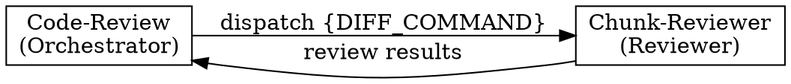

# Code Review

Orchestrates chunk-reviewer agents against diffs. Handles input parsing, context gathering, chunking, and result synthesis.

## Input Modes

```bash
# PR (number or URL)
/code-review pr 123
/code-review pr https://github.com/org/repo/pull/123

# Branch comparison
/code-review main feature/auth

# Auto-detect (current branch vs origin/main or origin/master)
/code-review
```

## Do vs Delegate Decision Matrix

| Action | YOU Do | DELEGATE |
|--------|--------|----------|
| Requirements 3-question gate | Yes | - |
| Diff range determination & git | Yes | - |
| Chunking decision | Yes | - |
| Walkthrough/critique synthesis | Yes | - |
| Project conventions calibration | NEVER | explore |
| Cross-file impact / design fit | NEVER | oracle |
| Individual chunk review | NEVER | chunk-reviewer |
| Code modification | NEVER | (forbidden entirely) |

**RULE**: Orchestration, synthesis, decisions = Do directly. Convention search, impact analysis, chunk review = DELEGATE. Code modification = FORBIDDEN.

### Role Separation: YOU DO NOT REVIEW CODE

**Code review is NOT your job. It is chunk-reviewer's job.**



**Your role as orchestrator:**
- Dispatch chunks to chunk-reviewer with diff commands
- Synthesize walkthrough and critique from chunk-reviewer results
- Decide chunking strategy, severity normalization, final verdict

**NOT your role:**
- Reading raw diff output (no `git diff {range}` without `--stat` or `--name-only`)
- Reviewing code quality, correctness, or patterns yourself
- Running `git diff {range} -- <files>` to load changed file content

**RULE**: When chunk-reviewer returns results, your ONLY actions are synthesis and verdict. Not "review then synthesize". Just synthesize.

### Context Budget

What you are **allowed** to load into context:

| Allowed | Command / Source |
|---------|-----------------|
| Diff statistics | `git diff {range} --stat` |
| Changed file list | `git diff {range} --name-only` |
| Commit history | `git log {range} --oneline` |
| Project conventions | CLAUDE.md files |
| Codebase context | explore / oracle agent summaries |
| Review results | chunk-reviewer agent output |

What you are **forbidden** from loading:

| Forbidden | Why |
|-----------|-----|
| `git diff {range}` (without `--stat` or `--name-only`) | Loads raw diff lines into orchestrator context |
| `git diff {range} -- <files>` | Loads file-level diff into orchestrator context |
| `Read` tool on diff target source files | Loads changed file content into orchestrator context |
| Any tool that loads changed file content | Review responsibility belongs to chunk-reviewer |

**RULE**: If a command would put diff lines or source code into your context, it is forbidden. Only metadata (stats, file names, commit messages) and agent outputs are allowed.

## Step 0: Requirements Context

Three-question gate — adapt by input mode:

**PR mode:**
1. Auto-extract PR metadata:
   `gh pr view <number> --json title,body,labels,comments,reviews`
2. Scan PR body and comments for references to related documents (previous PRs, issues, Jira tickets, design docs, external URLs, review threads, etc.):
   - GitHub refs (`#123`) → fetch context via `gh pr view` or `gh issue view`
   - Non-fetchable references (Jira, Notion, Confluence, etc.) → note for user inquiry
3. If description is substantial (>1 sentence): proceed with auto-extracted context, confirm with user: "Extracted requirements from PR description: [summary]. Anything to add?"
4. If description is thin AND no linked references found: ask user "Do you have core requirements or a spec for this PR?"
5. If non-fetchable external references found, ask user: "The PR references these external documents: [links]. Please share relevant context if available. (If not, review will proceed with available information)"

**Branch comparison mode:**
Ask user: "What was implemented on this branch? If there are original requirements/spec, please share."

**Auto-detect mode:**
1. Infer from commit messages (`git log --oneline`)
2. Ask user: "Do you have requirements/spec for the recent work? (If not, review will focus on code quality)"

**User deferral** ("없어", "그냥 리뷰해줘", "skip"):
→ Set {REQUIREMENTS} = "N/A - code quality review only"
→ Proceed without blocking

**Vague Answer Handling:**
- Explicit deferral ("없어", "skip", "그냥 해줘") → Treat as N/A and proceed
- Vague answer → Refine with follow-up question:

| User says | Follow-up |
|-----------|-----------|
| "대충 있어" / "뭐 좀 있긴 한데" | "Where can I find them? (PR description, Notion, Jira, etc.)" |
| "그냥 성능 개선이야" | "What specific metrics were you trying to improve? (latency, throughput, memory, etc.)" |
| "여러 가지 고쳤어" | "What are the 1-2 most important changes? I'll identify the rest from code." |

Rule: 2 consecutive vague answers → Declare "I'll identify the context directly from the code" and proceed. No infinite questioning.

**Question Method:**

| Situation | Method |
|-----------|--------|
| 2-4 structured choices (review scope, severity threshold) | AskUserQuestion tool |
| Free-form / subjective (intent, context, concerns) | Plain text question |

**Question Quality Standard:**

| BAD | GOOD |
|-----|------|
| "요구사항이 있나요?" | "Do you have core requirements or a spec for this PR? (If not, review will focus on code quality)" |
| "어떤 부분을 볼까요?" | "23 files changed. Any specific area to focus on? (If not, I'll review everything)" |
| "테스트 있나요?" | "Do you have test coverage standards? (e.g., 80% line coverage, mandatory scenarios, etc.)" |

Rule: Every question must include a default action in parentheses. Ensure progress is possible even without user response.

**One Question Per Message:**
One question at a time. Proceed to the next question only after receiving an answer. Never bundle multiple questions in a single message.

**Step 0 Exit Condition:**
Proceed to Step 1 when any of the following are met:
- Requirements captured (PR description, user input, or spec reference)
- User explicitly deferred ("skip", "없어", "그냥 리뷰해줘")
- 2-strike vague limit reached → proceed with code-quality-only review

**Context Brokering:**
- DO NOT ask user about codebase facts (file locations, patterns, architecture)
- USE explore/oracle in Step 2 for codebase context
- ONLY ask user about: requirements, intent, specific concerns

## Step 1: Input Parsing

Determine range and setup for subsequent steps:

| Input | Setup | Range |
|-------|-------|-------|
| `pr <number or URL>` | Fetch PR ref locally (see below) | `origin/<baseRefName>...pr-<number>` |
| `<base> <target>` | (none — branches already local) | `<base>...<target>` |
| (none) | Detect default branch (`origin/main` or `origin/master`) | `<default>...HEAD` |

### PR Mode: Local Ref Setup (NO checkout)

Fetch the PR ref and base branch without switching the current branch:

```bash
# 1. Get base branch name
BASE_REF=$(gh pr view <number> --json baseRefName --jq '.baseRefName')

# 2. Fetch PR ref and base branch (no checkout — user's working directory untouched)
git fetch origin pull/<number>/head:pr-<number>
git fetch origin ${BASE_REF}
```

The range `origin/<baseRefName>...pr-<number>` uses three-dot syntax to show only changes introduced by the PR (not changes on the base branch since the PR branched).

All subsequent steps use `{range}` from this table. The orchestrator constructs `{DIFF_COMMAND}` in the format `git diff {range} -- <files>` for delegation to chunk-reviewer (the orchestrator does NOT execute this command — see Context Budget).

## Early Exit

After Input Parsing, before proceeding to Step 2:

1. Run `git diff {range} --stat` (using the range determined in Step 1)
2. If empty diff: report "No changes detected (between <base> and <target>)" and exit
3. If binary-only diff: report "Only binary file changes detected" and exit

## Step 2: Context Gathering

Collect in parallel (using `{range}` from Step 1):

1. `git diff {range} --stat` (change scale)
2. `git diff {range} --name-only` (file list)
3. `git log {range} --oneline` (commit history)
4. CLAUDE.md files: repo root + each changed directory's CLAUDE.md (if exists)

Subagent context:

### Subagent Selection Guide

| Need | Agent | When |
|------|-------|------|
| Codebase convention baseline | explore | Find internal patterns, naming conventions, structure to calibrate chunk-reviewer |
| Deep codebase analysis | oracle | Analyze cross-file impact, hidden dependencies, architectural fit |

### Explore -- Codebase Convention Baseline

Chunk-reviewer only sees the diff, so it has no baseline for judging "does this code follow project conventions?" Without explore's convention baseline, chunk-reviewer will:
- Suggest new patterns while ignoring already-established ones (noise)
- Misjudge convention-compliant code as "needs improvement" (false positive)
- Miss code that violates project conventions (false negative)

→ Always dispatch. Low cost (targeted grep level), high value (quality calibration for all chunk reviews).

5. Dispatch explore agent (4-Field prompt):
   ```
   Task(subagent_type="explore", prompt="
   [CONTEXT] Reviewing a PR that changes {file_list}. PR description: {DESCRIPTION}.
   [GOAL] Understand existing codebase conventions to evaluate whether the PR follows established patterns.
   [DOWNSTREAM] Output injected into {CODEBASE_CONTEXT} to calibrate chunk-reviewer agent against project norms.
   [REQUEST] Find: naming conventions, error handling patterns, test structure, and related implementations for the changed modules. Return file paths with pattern descriptions. Skip unrelated directories.")
   ```
   → Always dispatch (lightweight, provides codebase context)

### Oracle -- Deep Codebase Analysis

Core principle: **Dispatch when the diff alone cannot determine the safety of this change.**

A diff shows "what changed" but not "whether this change is safe for the existing system." Oracle reads the entire codebase and answers four types of questions:

| Type | Question | Example |
|------|----------|---------|
| Impact analysis | "How far does this change's impact reach?" | Does the migration break existing queries? Does the cache key change invalidate other services? |
| Consistency verification | "Is it consistent with existing patterns?" | Does the new error handling differ from the existing strategy? Does the new integration's retry policy mismatch existing ones? |
| Hidden interaction | "Are there invisible dependencies?" | Does this lock create deadlocks with other locks? Does this event match consumer expectations? |
| Design fitness | "Does it fit architectural principles?" | Does it violate layer boundaries? Does it bypass existing abstractions? |

**When NOT to dispatch oracle:**
- Simple refactoring (rename, extract method, move file) -- diff is sufficient
- Test-only changes -- no production impact
- Documentation/config-only changes -- no architecture analysis needed
- Logic changes within a single function (external interface unchanged) -- no cross-file impact
- Explore results already provide sufficient context

**Oracle trigger conditions:**
- Changes modify shared interfaces, base classes, contracts, event schemas, or extension points consumed by other modules → (impact analysis, hidden interaction)
- New component, service, or architectural layer introduced affecting existing system structure → (design fitness, impact analysis)
- Changes cross architectural layer boundaries or span multiple independent business modules → (consistency verification, design fitness)
- Database schema or data model changes with downstream consumers → (impact analysis)
- Changes involve concurrency coordination, transaction boundaries, or distributed state management → (hidden interaction)

6. Dispatch oracle agent (only if trigger conditions met):
   Briefly announce "Consulting Oracle for [reason]" before invocation.
   → Only if trigger conditions met (see above)

## Step 3: Chunking Decision

### Diff Size Measurement

Parse the `--stat` summary line (already collected in Step 2):

```
 N files changed, X insertions(+), Y deletions(-)
```

Total changed lines = X + Y (insertions + deletions).

### Threshold

| Condition | Strategy |
|-----------|----------|
| Total < 1500 lines AND < 30 files | Single review |
| Total >= 1500 lines OR >= 30 files | Multi-chunk review |

### Chunking Algorithm

When multi-chunk is required:

1. **Group by top-level directory prefix** from the `--name-only` file list (e.g., `src/order/`, `src/payment/`, `test/`)
2. **Per-chunk cap: ~1500 lines** (soft guide). Walk groups in order:
   - If adding the next group would exceed ~1500 lines, start a new chunk
   - If a single file exceeds 1500 lines, it becomes a standalone chunk
3. **Split oversized groups**: If a single directory group exceeds the cap, split by subdirectory prefix within that group
4. **Flat structure fallback**: If subdirectory splitting still produces oversized chunks (flat directory with many files), batch alphabetically into groups of ~10-15 files each

## Step 4: Agent Dispatch

1. Read dispatch template from `chunk-reviewer-prompt.md`
2. Interpolate placeholders with context from Steps 0-2:
   - {WHAT_WAS_IMPLEMENTED} ← Step 0 description
   - {DESCRIPTION} ← Step 0 or commit messages
   - {REQUIREMENTS} ← Step 0 requirements (or "N/A - code quality review only")
   - {CODEBASE_CONTEXT} ← Step 2 explore/oracle output (or empty)
   - {FILE_LIST} ← Step 2 file list
   - {DIFF_COMMAND} ← complete shell command string that the chunk-reviewer will execute to obtain the diff. Orchestrator constructs this from range (Step 1) and chunk file list (Step 3) but does NOT execute it. Examples: `git diff origin/main...HEAD` (single chunk) or `git diff origin/main...HEAD -- src/api/auth.ts src/api/router.ts` (multi-chunk)
   - {CLAUDE_MD} ← Step 2 CLAUDE.md content (or empty)
   - {COMMIT_HISTORY} ← Step 2 commit history
3. Dispatch `chunk-reviewer` agent(s) via Task tool (`subagent_type: "chunk-reviewer"`) with interpolated prompt

> **Note:** chunk-reviewer internally dispatches to multiple models and returns consensus-annotated synthesis.

**Dispatch rules:**

| Scale | Action |
|-------|--------|
| Single chunk | 1 agent call |
| Multiple chunks | Parallel dispatch -- all chunks in ONE response. Each chunk gets its own interpolated template with chunk-specific {DIFF_COMMAND} and {FILE_LIST} |

## Step 5: Walkthrough Synthesis + Result Synthesis

After all agents return, produce the final output in two phases.

### Phase 1: Walkthrough Synthesis (MANDATORY)

Orchestrator directly produces the Walkthrough from:
- All chunk Chunk Analysis sections (raw comprehension material from chunk-reviewer agents)
- Step 2 context (explore/oracle output, CLAUDE.md, commit history)

**Generate the following sections:**

#### Change Summary
- 1-2 paragraph prose summary of the entire change's purpose and context
- Include motivation, approach taken, and overall impact
- Written for someone unfamiliar with the code to understand the change

#### Core Logic Analysis
- Consolidate all chunk Chunk Analyses into a unified module/feature-level narrative
- Cover both core changes AND supporting/peripheral changes
- Explain data flow, design decisions, and side effects from the perspective of inter-module relationships
- Level of detail: enough to understand the full change WITHOUT reading the code

#### Architecture Diagram
- Mermaid class diagram or component diagram
- Show changed classes/modules and their relationships (inheritance, composition, dependency)
- Distinguish new vs modified elements
- If no structural changes (e.g., logic-only changes within existing methods): write "No structural changes — existing architecture preserved"

#### Sequence Diagram
- Mermaid sequence diagram visualizing the primary call flow(s) affected by the changes
- Include actors, method calls, return values, and significant conditional branches
- If no call flow changes (e.g., variable rename, config change): write "No call flow changes"

### Phase 2: Critique Synthesis

Chunk-reviewer agents return consensus-annotated findings from multi-model review. Each issue carries a consensus level:

- :red_circle: **Confirmed (3/3)** -- all models flagged this issue
- :orange_circle: **High Confidence (2/3)** -- majority of models flagged this issue
- :yellow_circle: **Needs Review (1/3)** -- single model flagged this issue

For multi-chunk reviews:

1. **Merge** all Strengths, Issues, Recommendations sections
2. **Deduplicate** issues appearing in multiple chunks, applying **cross-chunk consensus promotion**:
   - Same issue Confirmed in chunk A and Needs Review in chunk B → promote to Confirmed
   - Same issue at different consensus levels across chunks → use the strongest (highest agreement) level
3. **Carry issues by consensus level:**
   - :red_circle: Confirmed (3/3): carry directly to final output
   - :orange_circle: High Confidence (2/3): carry with consensus annotation preserved
   - :yellow_circle: Needs Review (1/3): include with "single-model finding" note
4. **Identify cross-file concerns** -- issues spanning chunk boundaries (e.g., interface contract mismatches, inconsistent error handling patterns)
5. **Normalize severity labels** across chunks using Critical / Important / Minor scale -- reconcile inconsistent labels for same-type issues across chunks; escalate recurring cross-chunk issues
6. **Determine final verdict** -- "Ready to merge?" is the STRICTEST of all chunk verdicts (any "No" = overall "No")
7. **Produce unified critique** (Strengths / Issues / Recommendations / Assessment)

For single-chunk reviews, Phase 2 returns the agent's critique output directly (Strengths through Assessment), preserving consensus annotations.

### Final Output Format

```
## Walkthrough

### Change Summary
[Generated in Phase 1]

### Core Logic Analysis
[Generated in Phase 1]

### Architecture Diagram
[Generated in Phase 1 — Mermaid or "No structural changes — existing architecture preserved"]

### Sequence Diagram
[Generated in Phase 1 — Mermaid or "No call flow changes"]

---

## Strengths
[Generated in Phase 2]

## Issues
[Generated in Phase 2]

## Recommendations
[Generated in Phase 2]

## Assessment
[Generated in Phase 2]
```

### Example Final Output

Synthesized from 3 chunks: (A) Order API + domain, (B) Payment integration, (C) Inventory + messaging.

````
## Walkthrough

### Change Summary
Implements end-to-end order payment flow for the e-commerce platform, spanning three domains: order lifecycle management (creation, validation, state transitions), payment gateway integration (Stripe charge creation, webhook handling, refund support), and inventory reservation (stock deduction on payment confirmation with Kafka-based async messaging). The PR introduces 9 new files and modifies 3 existing files across the API, domain, infrastructure, and messaging layers. Orders transition through a state machine (`CREATED` → `PENDING_PAYMENT` → `PAYMENT_IN_PROGRESS` → `PAID` → `FULFILLMENT_READY`), with inventory reserved asynchronously on payment confirmation via a Kafka event. A Flyway migration adds the `payment_records` and `inventory_reservations` tables to support the new flows.

### Core Logic Analysis

**Order Lifecycle (order/)**:
`OrderController.kt` exposes `POST /api/v1/orders` for creation and `POST /api/v1/orders/{id}/pay` to initiate payment. `OrderService.kt` owns the order state machine — `canTransition()` validates allowed state changes, `initiatePayment()` transitions from `CREATED`/`PENDING_PAYMENT` to `PAYMENT_IN_PROGRESS` and delegates to the payment layer. `OrderRepository.kt` extends Spring Data JPA with a custom `findByIdWithLock()` using `@Lock(PESSIMISTIC_WRITE)` to prevent concurrent payment attempts on the same order. The state machine is enforced at the service layer, not via DB constraints — this means invalid transitions are caught in application code but not at the storage level.

**Payment Integration (payment/)**:
`OrderPaymentController.kt` orchestrates the payment flow: validates order state, delegates to `StripeGatewayAdapter.charge()`, and persists the `PaymentRecord`. `StripeGatewayAdapter.kt` implements the `PaymentGateway` port interface — maps domain `PaymentCommand` to Stripe `PaymentIntentCreateParams`, calls the Stripe SDK, and maps the response back. The webhook endpoint receives async payment confirmations from Stripe and publishes a `PaymentConfirmedEvent` to Kafka for downstream processing. `PaymentRequest.kt` is the DTO carrying amount, currency, and callback URL from the API boundary.

**Inventory Reservation (inventory/)**:
`InventoryService.kt` listens for `PaymentConfirmedEvent` via `@KafkaListener` and reserves stock by decrementing `available_quantity` in the `inventory` table. Uses `SELECT ... FOR UPDATE` to prevent overselling under concurrent reservations. If stock is insufficient, publishes an `InventoryShortageEvent` to a separate topic for the order service to handle (cancellation or backorder). `InventoryReservation` entity tracks which order reserved which SKUs and quantities — used for idempotency checks on retry.

**Messaging (kafka/)**:
`PaymentEventProducer.kt` publishes `PaymentConfirmedEvent` and `PaymentFailedEvent` to the `payment-events` topic. Uses `KafkaTemplate` with a `ProducerRecord` that includes the `orderId` as the message key for partition affinity — all events for the same order land on the same partition, preserving ordering. No dead letter topic is configured for the `payment-events` consumer group.

**Database (migration/)**:
`V2024_001__add_payment_and_inventory_tables.sql` adds two tables: `payment_records` (transaction ID, order ID, amount, currency, status, Stripe payment intent ID, timestamps) and `inventory_reservations` (order ID, SKU, quantity, reserved_at). Both tables have foreign keys to `orders`. The `payment_records` table has a unique constraint on `stripe_payment_intent_id` for idempotency. No index on `inventory_reservations.order_id` despite being used in the idempotency lookup query.

### Architecture Diagram


### Sequence Diagram


---

## Strengths
- Clean hexagonal architecture: Stripe interaction fully encapsulated behind `PaymentGateway` port interface, domain never references Stripe SDK types (StripeGatewayAdapter.kt:1-15)
- Order state machine validation prevents double-charging — `canTransition()` check with pessimistic locking rejects concurrent payment attempts on the same order (OrderService.kt:42-58, OrderRepository.kt:12)
- Kafka partition key strategy using `orderId` ensures ordering guarantees per order — payment confirmed before inventory reserved, never reversed (PaymentEventProducer.kt:23-31)
- Idempotency check on inventory reservation prevents duplicate stock deductions on Kafka consumer retries (InventoryService.kt:34-42)

## Issues

### Critical (Must Fix)
1. **`@Transactional` wrapping external HTTP call to Stripe**
   - File: OrderPaymentController.kt:34-67
   - Issue: `processPayment()` is `@Transactional` but includes `StripeGatewayAdapter.charge()` — an external HTTP round-trip (500ms-2s). The DB connection is held open for the entire network call. Under concurrent load, 10 in-flight payments saturate the HikariCP pool, blocking all DB operations including order browsing and cart.
   - Fix: Split into two transactions: (1) validate + mark `PAYMENT_IN_PROGRESS`, (2) after Stripe call, persist result + update status. Use compensating job for stuck `PAYMENT_IN_PROGRESS` orders.
   - Requirement trace: REQ-PAY-003 "Payment processing must not degrade order browsing or cart operations under load"

2. **No circuit breaker on Stripe API calls**
   - File: StripeGatewayAdapter.kt:44-78
   - Issue: No circuit breaker, bulkhead, or timeout override on `charge()` and `refund()`. Stripe SDK default timeout is 30s. Combined with the `@Transactional` issue, a Stripe degradation cascades into full system unavailability.
   - Fix: Add Resilience4j `@CircuitBreaker` (50% failure threshold, 30s wait, 3 half-open calls). Set Stripe SDK timeout to 5s. Return `PaymentResult.TEMPORARILY_UNAVAILABLE` as fallback.
   - Requirement trace: REQ-PAY-007 "System must gracefully degrade when third-party payment provider is unavailable"

3. **HTTPS not validated on webhook callback URL**
   - File: PaymentRequest.kt:8-12
   - Issue: `callbackUrl: String` with only `@NotBlank` validation. Accepts `http://` scheme — payment confirmations could be sent over plaintext, interceptable via MITM.
   - Fix: Custom `@ValidCallbackUrl` annotation: well-formed URL, `https` scheme, no private/loopback IP. Production: allowlist of registered callback domains.
   - Requirement trace: REQ-SEC-012 "All payment-related data transmission must use TLS 1.2+"

### Important (Should Fix)
1. **No dead letter queue for failed payment callbacks** — OrderPaymentController.kt:85-102. Failed webhook processing silently drops events. Stripe retries for 3 days then gives up permanently.
2. **Currency field is unbounded String instead of ISO 4217 enum** — PaymentRequest.kt:6. Invalid currency codes reach Stripe, producing cryptic 400 errors surfaced as generic 500 to clients.
3. **Missing index on `inventory_reservations.order_id`** — V2024_001__add_payment_and_inventory_tables.sql:28. Idempotency lookup on every Kafka message does a full table scan. Grows linearly with order volume.
4. **No structured logging on payment events** — OrderPaymentController.kt:34-102, StripeGatewayAdapter.kt:44-78. No correlation ID, no MDC context. End-to-end payment debugging across sync and async flows requires manual log correlation.
5. **Kafka message loss leaves orders stuck in PAID state** — PaymentEventProducer.kt:23-31, InventoryService.kt. If `PaymentConfirmedEvent` is lost (producer failure, Kafka outage, or consumer deserialization error), the order remains in `PAID` state indefinitely and never transitions to `FULFILLMENT_READY`. No compensating mechanism (scheduled reconciliation job, timeout-based retry) exists to detect and recover stuck orders. This is a cross-chunk gap: the order state machine (Chunk A) assumes the async inventory flow (Chunk C) always completes, but the messaging layer (Chunk C) has no delivery guarantee beyond Kafka's at-least-once semantics.

### Minor (Nice to Have)
1. **Missing OpenAPI annotations on payment endpoints** — OrderPaymentController.kt:28-33. API consumers have no contract documentation for payment flow.
2. **Hardcoded retry count and timeout values** — StripeGatewayAdapter.kt:45, StripeGatewayAdapter.kt:52. Not configurable per environment.

## Recommendations
- Introduce a `PaymentApplicationService` between controllers and adapters to own transaction boundaries — the controller handles HTTP, the adapter handles Stripe, and the service orchestrates the domain flow between them
- Add Resilience4j circuit breaker as a cross-cutting concern via Spring AOP — any future payment gateway integration (PayPal, Toss) will need the same protection pattern
- Implement distributed tracing with correlation ID propagated through HTTP headers → Kafka message headers → consumer MDC — critical for debugging the async payment confirmation flow that spans 3 services
- Set up a dead letter topic with an admin dashboard for payment event reprocessing — failed webhook events and inventory shortage events both need manual intervention workflows

## Assessment
**Ready to merge: No**
**Reasoning:** Three Critical issues block merge — `@Transactional` spanning external HTTP calls risks connection pool starvation under load, missing circuit breaker enables cascading failures from Stripe outages, and unvalidated callback URL scheme violates transport security requirements. All three must be resolved before this code handles production payment traffic.
````
