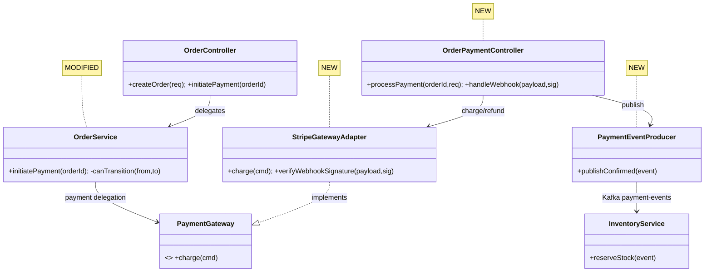
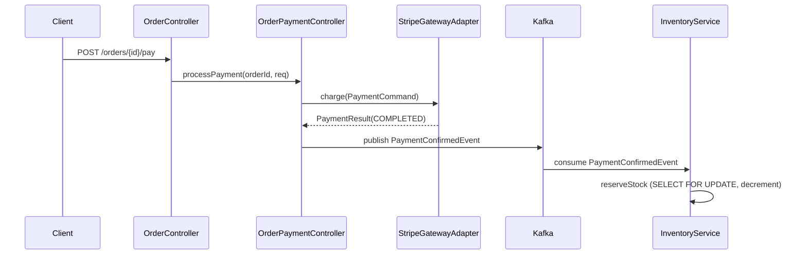

# Example Final Output

Synthesized from 3 chunks: (A) Order API + domain, (B) Payment integration, (C) Inventory + messaging.

This example demonstrates the complete report-only output format: the Walkthrough, then verdict-labeled findings split into Correctness and Cleanup. There is no merge verdict — the review reports, it does not gate.

````
## Walkthrough

### Change Summary
Implements end-to-end order payment flow for the e-commerce platform, spanning three domains: order lifecycle management (creation, validation, state transitions), payment gateway integration (Stripe charge creation, webhook handling, refund support), and inventory reservation (stock deduction on payment confirmation with Kafka-based async messaging). The PR introduces 9 new files and modifies 3 existing files across the API, domain, infrastructure, and messaging layers. Orders transition through a state machine (`CREATED` → `PENDING_PAYMENT` → `PAYMENT_IN_PROGRESS` → `PAID` → `FULFILLMENT_READY`), with inventory reserved asynchronously on payment confirmation via a Kafka event. A Flyway migration adds the `payment_records` and `inventory_reservations` tables to support the new flows.

### Core Logic Analysis

**Order Lifecycle (order/)**:
`OrderController.kt` exposes `POST /api/v1/orders` for creation and `POST /api/v1/orders/{id}/pay` to initiate payment. `OrderService.kt` owns the order state machine — `canTransition()` validates allowed state changes, `initiatePayment()` transitions from `CREATED`/`PENDING_PAYMENT` to `PAYMENT_IN_PROGRESS` and delegates to the payment layer. `OrderRepository.kt` adds `findByIdWithLock()` using `@Lock(PESSIMISTIC_WRITE)` to prevent concurrent payment attempts on the same order. The state machine is enforced at the service layer, not via DB constraints.

**Payment Integration (payment/)**:
`OrderPaymentController.kt` orchestrates the payment flow: validates order state, delegates to `StripeGatewayAdapter.charge()`, and persists the `PaymentRecord`. `StripeGatewayAdapter.kt` implements the `PaymentGateway` port — maps domain `PaymentCommand` to Stripe params, calls the SDK, maps the response back. The webhook endpoint receives async confirmations and publishes a `PaymentConfirmedEvent` to Kafka.

**Inventory Reservation (inventory/)**:
`InventoryService.kt` listens for `PaymentConfirmedEvent` via `@KafkaListener` and reserves stock by decrementing `available_quantity` with `SELECT ... FOR UPDATE` to prevent overselling. On insufficient stock it publishes an `InventoryShortageEvent`. The `InventoryReservation` entity tracks which order reserved which SKUs for idempotency on retry.

**Messaging (kafka/)**:
`PaymentEventProducer.kt` publishes to `payment-events` keyed by `orderId` for partition affinity — events for the same order keep ordering. No dead-letter topic is configured for the consumer group.

### Architecture Diagram


### Sequence Diagram


---

## Findings

### Correctness

**[CONFIRMED] `@Transactional` wraps the external HTTP call to Stripe**
- **Location**: `OrderPaymentController.kt:34` — `processPayment()`
- **Current Code**:
  ```kotlin
  @PostMapping("/{orderId}/payment")
  @Transactional
  fun processPayment(@PathVariable orderId: Long, @RequestBody @Valid request: PaymentRequest): ResponseEntity<PaymentResponse> {
      val order = orderRepository.findByIdWithLock(orderId)
          ?: throw OrderNotFoundException(orderId)
      order.transitionTo(OrderStatus.PAYMENT_IN_PROGRESS)
      val result = stripeGatewayAdapter.charge(order, request)  // external HTTP call inside TX
      val record = paymentRecordRepository.save(PaymentRecord.from(order, result))
      order.transitionTo(OrderStatus.PAID)
      return ResponseEntity.ok(PaymentResponse.from(record))
  }
  ```
- **What's wrong**: `processPayment()` is `@Transactional`, but `stripeGatewayAdapter.charge()` is an external HTTP round-trip (500ms–2s). The DB connection is held open for the entire network call.
- **Failure scenario**: Under concurrent load, ~10 in-flight payments exhaust the HikariCP pool; every other DB operation (order lookup, cart) then blocks. Every payment request holds a DB connection across the Stripe call, so this manifests in normal operation, not only at peak.
- **Fix**:
  ```diff
  -@PostMapping("/{orderId}/payment")
  -@Transactional
  -fun processPayment(...): ResponseEntity<PaymentResponse> {
  -    val order = orderRepository.findByIdWithLock(orderId) ?: throw OrderNotFoundException(orderId)
  -    order.transitionTo(OrderStatus.PAYMENT_IN_PROGRESS)
  -    val result = stripeGatewayAdapter.charge(order, request)
  -    val record = paymentRecordRepository.save(PaymentRecord.from(order, result))
  -    order.transitionTo(OrderStatus.PAID)
  -    return ResponseEntity.ok(PaymentResponse.from(record))
  -}
  +@PostMapping("/{orderId}/payment")
  +fun processPayment(...): ResponseEntity<PaymentResponse> {
  +    val order = paymentApplicationService.initiatePayment(orderId)       // TX 1: validate + mark IN_PROGRESS
  +    val result = stripeGatewayAdapter.charge(order, request)            // external call outside any TX
  +    val record = paymentApplicationService.persistResult(order, result) // TX 2: save + update status
  +    return ResponseEntity.ok(PaymentResponse.from(record))
  +}
  ```
- **Blast Radius**: `OrderController.kt:initiatePayment()` calls `processPayment()`; the new `PaymentApplicationService` becomes the transaction owner.
- **Found by**: cross-file (corroborated by line-scan)

**[PLAUSIBLE] Webhook marks order PAID without re-checking the charged amount**
- **Location**: `OrderPaymentController.kt:88` — `handleWebhook()`
- **Current Code**:
  ```kotlin
  @PostMapping("/webhook")
  fun handleWebhook(@RequestBody payload: String, @RequestHeader("Stripe-Signature") sig: String): ResponseEntity<Unit> {
      stripeGatewayAdapter.verifyWebhookSignature(payload, sig)
      val event = objectMapper.readValue(payload, StripeEvent::class.java)
      if (event.type == "payment_intent.succeeded") {
          val order = orderRepository.findByPaymentIntentId(event.data.id)
              ?: return ResponseEntity.ok().build()
          order.transitionTo(OrderStatus.PAID)   // no amount comparison
      }
      return ResponseEntity.ok().build()
  }
  ```
- **What's wrong**: The webhook transitions the order to PAID on `payment_intent.succeeded` but never compares the charged amount against the order total.
- **Failure scenario**: If a PaymentIntent's amount can be influenced below the order total (client-tampered create path, or a partial-capture flow), the order is marked PAID for less than owed. Whether the create path is influenceable is not provable from this diff — realistic but unconfirmed, hence PLAUSIBLE. Confirm by checking that `PaymentIntentCreateParams.amount` is server-derived only.
- **Fix**: In `handleWebhook()`, load the order and assert `event.amount == order.totalMinorUnits` before transitioning to PAID; reject and alert on mismatch.
- **Blast Radius**: webhook path only; `verifyWebhookSignature()` already runs first.
- **Found by**: removed-behavior

### Cleanup

**[CONFIRMED] `PaymentRecord.from()` re-implements the money-conversion helper**
- **Location**: `PaymentRecord.kt:21`
- **Current Code**:
  ```kotlin
  fun from(order: Order, result: PaymentResult): PaymentRecord =
      PaymentRecord(
          orderId = order.id,
          amountMinor = result.amount.multiply(BigDecimal(100)).toLong(),  // re-implements MoneyUtils.toMinorUnits
          currency = order.currency,
      )
  ```
- **What's wrong**: Converts to minor units inline (`amount.multiply(BigDecimal(100)).toLong()`) when `MoneyUtils.toMinorUnits(amount, currency)` already exists and handles rounding and zero-decimal currencies (JPY).
- **Failure scenario** (cost): The duplicated money logic drifts from the canonical helper, and the inline version silently mishandles zero-decimal currencies — a correctness-and-maintenance liability the next currency addition will trip on.
- **Fix**: Replace the inline conversion with `MoneyUtils.toMinorUnits(amount, currency)`.
- **Blast Radius**: This location only.
- **Found by**: cleanup

## Out of Scope (Pre-existing)

**[PLAUSIBLE] [Pre-existing] `inventory_reservations.order_id` is unindexed**
- **Location**: `inventory_reservations` table (predates this PR)
- The idempotency lookup added in this PR reads `inventory_reservations` by `order_id`, but the column has no index, so reads are full scans. Not introduced here, but this PR is the first heavy reader. Noted, not blocking.

## Recommendations
- Resolve the `@Transactional`-over-Stripe finding (`OrderPaymentController.kt:34`) — removes a bug that exhausts the connection pool under normal load.
- Add the webhook amount re-check (`OrderPaymentController.kt:88`) — preserves the requirement that an order is never marked PAID for less than its total.
- Replace the inline money conversion with `MoneyUtils.toMinorUnits` (`PaymentRecord.kt:21`) — improves maintainability and removes the latent zero-decimal-currency bug.
````
