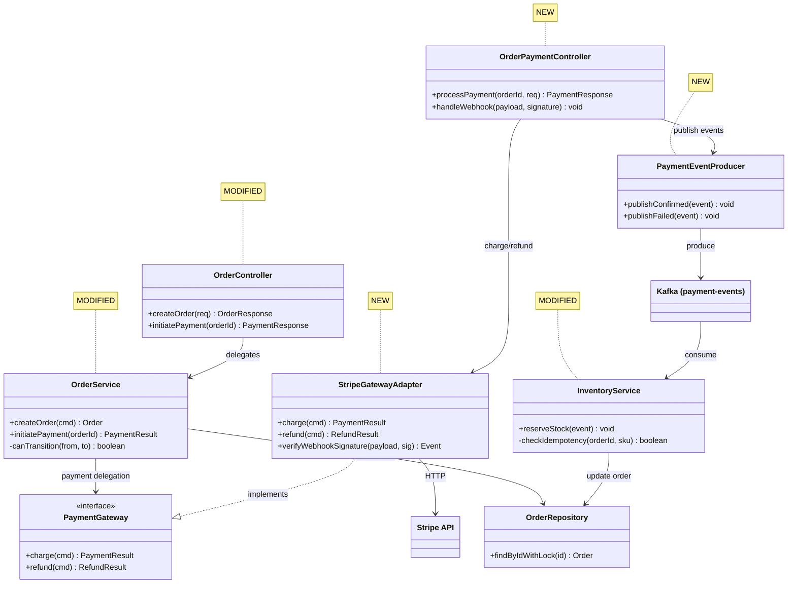
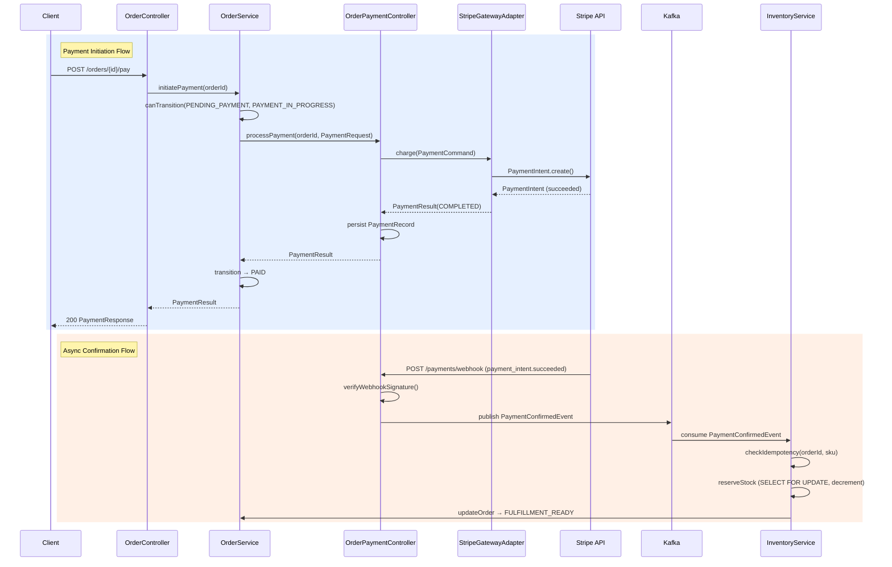

# Example Final Output

Synthesized from 3 chunks: (A) Order API + domain, (B) Payment integration, (C) Inventory + messaging.

This example demonstrates the complete output format with all required sections, enriched findings, and severity adjudication with Review Consensus.

````
## Walkthrough

### Change Summary
Implements end-to-end order payment flow for the e-commerce platform, spanning three domains: order lifecycle management (creation, validation, state transitions), payment gateway integration (Stripe charge creation, webhook handling, refund support), and inventory reservation (stock deduction on payment confirmation with Kafka-based async messaging). The PR introduces 9 new files and modifies 3 existing files across the API, domain, infrastructure, and messaging layers. Orders transition through a state machine (`CREATED` → `PENDING_PAYMENT` → `PAYMENT_IN_PROGRESS` → `PAID` → `FULFILLMENT_READY`), with inventory reserved asynchronously on payment confirmation via a Kafka event. A Flyway migration adds the `payment_records` and `inventory_reservations` tables to support the new flows.

### Core Logic Analysis

**Order Lifecycle (order/)**:
`OrderController.kt` exposes `POST /api/v1/orders` for creation and `POST /api/v1/orders/{id}/pay` to initiate payment. `OrderService.kt` owns the order state machine — `canTransition()` validates allowed state changes, `initiatePayment()` transitions from `CREATED`/`PENDING_PAYMENT` to `PAYMENT_IN_PROGRESS` and delegates to the payment layer. `OrderRepository.kt` extends Spring Data JPA with a custom `findByIdWithLock()` using `@Lock(PESSIMISTIC_WRITE)` to prevent concurrent payment attempts on the same order. The state machine is enforced at the service layer, not via DB constraints — this means invalid transitions are caught in application code but not at the storage level.

**Payment Integration (payment/)**:
`OrderPaymentController.kt` orchestrates the payment flow: validates order state, delegates to `StripeGatewayAdapter.charge()`, and persists the `PaymentRecord`. `StripeGatewayAdapter.kt` implements the `PaymentGateway` port interface — maps domain `PaymentCommand` to Stripe `PaymentIntentCreateParams`, calls the Stripe SDK, and maps the response back. The webhook endpoint receives async payment confirmations from Stripe and publishes a `PaymentConfirmedEvent` to Kafka for downstream processing. `PaymentRequest.kt` is the DTO carrying amount, currency, and callback URL from the API boundary.

**Inventory Reservation (inventory/)**:
`InventoryService.kt` listens for `PaymentConfirmedEvent` via `@KafkaListener` and reserves stock by decrementing `available_quantity` in the `inventory` table. Uses `SELECT ... FOR UPDATE` to prevent overselling under concurrent reservations. If stock is insufficient, publishes an `InventoryShortageEvent` to a separate topic for the order service to handle (cancellation or backorder). `InventoryReservation` entity tracks which order reserved which SKUs and quantities — used for idempotency checks on retry.

**Messaging (kafka/)**:
`PaymentEventProducer.kt` publishes `PaymentConfirmedEvent` and `PaymentFailedEvent` to the `payment-events` topic. Uses `KafkaTemplate` with a `ProducerRecord` that includes the `orderId` as the message key for partition affinity — all events for the same order land on the same partition, preserving ordering. No dead letter topic is configured for the `payment-events` consumer group.

**Database (migration/)**:
`V2024_001__add_payment_and_inventory_tables.sql` adds two tables: `payment_records` (transaction ID, order ID, amount, currency, status, Stripe payment intent ID, timestamps) and `inventory_reservations` (order ID, SKU, quantity, reserved_at). Both tables have foreign keys to `orders`. The `payment_records` table has a unique constraint on `stripe_payment_intent_id` for idempotency. No index on `inventory_reservations.order_id` despite being used in the idempotency lookup query.

### Architecture Diagram


### Sequence Diagram


---

## Strengths
- Clean hexagonal architecture: Stripe interaction fully encapsulated behind `PaymentGateway` port interface, domain never references Stripe SDK types (StripeGatewayAdapter.kt:1-15)
- Order state machine validation prevents double-charging — `canTransition()` check with pessimistic locking rejects concurrent payment attempts on the same order (OrderService.kt:42-58, OrderRepository.kt:12)
- Kafka partition key strategy using `orderId` ensures ordering guarantees per order — payment confirmed before inventory reserved, never reversed (PaymentEventProducer.kt:23-31)
- Idempotency check on inventory reservation prevents duplicate stock deductions on Kafka consumer retries (InventoryService.kt:34-42)

## Issues

### P0 (Must Fix)

**[P0-1] `@Transactional` wrapping external HTTP call to Stripe**
- **Location**: `OrderPaymentController.kt:34` — `processPayment()`
- **Current Code**:
  ```kotlin
  @PostMapping("/{orderId}/payment")
  @Transactional
  fun processPayment(@PathVariable orderId: Long, @RequestBody @Valid request: PaymentRequest): ResponseEntity<PaymentResponse> {
      val order = orderRepository.findByIdWithLock(orderId)
          ?: throw OrderNotFoundException(orderId)
      order.transitionTo(OrderStatus.PAYMENT_IN_PROGRESS)
      val result = stripeGatewayAdapter.charge(order, request)  // external HTTP call inside TX
      val record = paymentRecordRepository.save(PaymentRecord.from(order, result))
      order.transitionTo(OrderStatus.PAID)
      return ResponseEntity.ok(PaymentResponse.from(record))
  }
  ```
- **Context**: HTTP POST handler → Stripe API call → DB persist. DB 트랜잭션이 외부 HTTP 호출을 포함하여 Stripe 응답 대기 동안 DB 커넥션을 점유
- **Problem**: `processPayment()`는 `@Transactional`이지만 `StripeGatewayAdapter.charge()` — 외부 HTTP 왕복(500ms-2s)을 포함함. DB 커넥션이 전체 네트워크 호출 동안 열려 있음
- **Impact**: 동시 부하 시 10개의 진행 중인 결제가 HikariCP 풀을 고갈시켜 주문 조회, 장바구니 등 모든 DB 작업 차단 — 모든 결제 요청이 정상 운영 중 DB 커넥션을 Stripe 호출 동안 보유하므로 즉시 발현됨
- **Fix**:
  ```diff
  -@PostMapping("/{orderId}/payment")
  -@Transactional
  -fun processPayment(@PathVariable orderId: Long, @RequestBody @Valid request: PaymentRequest): ResponseEntity<PaymentResponse> {
  -    val order = orderRepository.findByIdWithLock(orderId)
  -        ?: throw OrderNotFoundException(orderId)
  -    order.transitionTo(OrderStatus.PAYMENT_IN_PROGRESS)
  -    val result = stripeGatewayAdapter.charge(order, request)
  -    val record = paymentRecordRepository.save(PaymentRecord.from(order, result))
  -    order.transitionTo(OrderStatus.PAID)
  -    return ResponseEntity.ok(PaymentResponse.from(record))
  -}
  +@PostMapping("/{orderId}/payment")
  +fun processPayment(@PathVariable orderId: Long, @RequestBody @Valid request: PaymentRequest): ResponseEntity<PaymentResponse> {
  +    val order = paymentApplicationService.initiatePayment(orderId)  // TX 1: validate + mark IN_PROGRESS
  +    val result = stripeGatewayAdapter.charge(order, request)        // external call outside TX
  +    val record = paymentApplicationService.persistResult(order, result)  // TX 2: save result + update status
  +    return ResponseEntity.ok(PaymentResponse.from(record))
  +}
  ```
- **Blast Radius**: `OrderController.kt:initiatePayment()` → `processPayment()` 호출
- **Review Consensus**: 3/3 models identified (Opus P0, Sonnet P0, Gemini P0; adjudicated P0 — unanimous)

(... additional P0, P1, P2, P3 issues follow the same enriched format ...)

## Recommendations
- Introduce a `PaymentApplicationService` between controllers and adapters to own transaction boundaries
- Add Resilience4j circuit breaker as a cross-cutting concern via Spring AOP
- Implement distributed tracing with correlation ID propagated through HTTP headers → Kafka message headers → consumer MDC
- Set up a dead letter topic with an admin dashboard for payment event reprocessing

## Assessment
**Ready to merge: No**
**Reasoning:** Three P0 issues block merge — `@Transactional` spanning external HTTP calls risks connection pool starvation under load, missing circuit breaker enables cascading failures from Stripe outages, and unvalidated callback URL scheme violates transport security requirements. All P0 issues must be resolved before this code handles production payment traffic. Four P1 issues (dead letter queue, currency validation, missing index, stuck orders) should be addressed before or immediately after merge.
````
