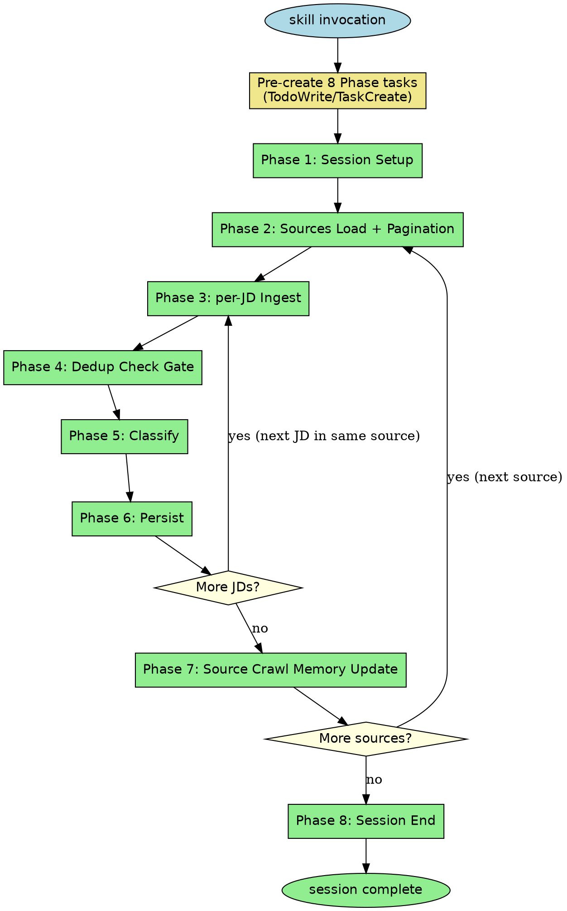
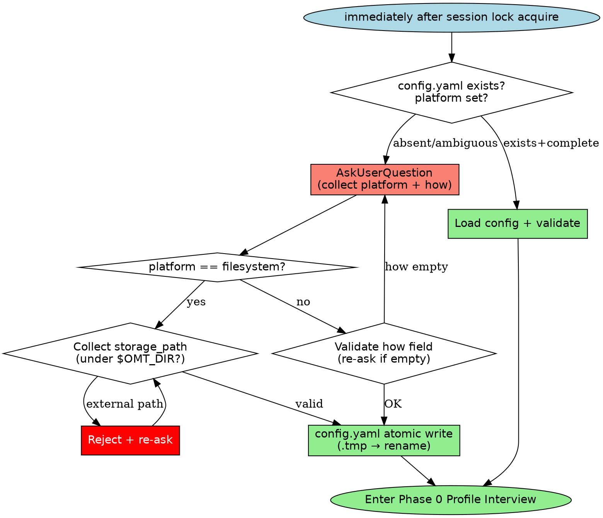

# Bootstrap Rules Detail

> Reference doc for `collect-jd` skill — session-init domain rules (Phase tasks, Session Lock, Storage Backend, Atomic Write, State Location, Profile Interview).
> Linked from `SKILL.md` via anchor references. Each section corresponds to a MANDATORY rule in SKILL.md.

## Table of Contents

- [Phase Task Creation](#phase-task-creation)
- [Storage Backend Interview](#storage-backend-interview)
- [State Location & Forbidden Paths](#state-location--forbidden-paths)
- [Session Lock](#session-lock)
- [Atomic Write Pattern](#atomic-write-pattern)
- [Phase 0: Profile Interview Required](#phase-0-profile-interview-required)

---

## Phase Task Creation

### Specification (MANDATORY)

Immediately at skill invocation start (even before Session Lock acquire — the single prerequisite), pre-register all 8 phases as individual tasks. Prevents phase skipping and provides progress visibility to the user.

- Task creation tool: `TodoWrite` or the environment's task API (e.g., oh-my-toong's `TaskCreate`).
- Task title examples:
  - Phase 1: Session Setup (lock + storage + sources + profile)
  - Phase 2: Sources Load + Pagination (sources.yaml + Listing)
  - Phase 3: per-JD Ingest (URL fetch + validation)
  - Phase 4: Dedup Check Gate (L1/L2 + fingerprint + audit)
  - Phase 5: Classify (role tagging + matching loop)
  - Phase 6: Persist (JD atomic write + tags/taxonomy)
  - Phase 7: Source Crawl Memory Update (crawl_state update)
  - Phase 8: Session End (rules re-eval + lock release)
- Each task has **a single state only**: `pending` → `in_progress` (on start) → `completed` (immediately on finish). Batching forbidden.
- **Batch mode**: Repeat Phases 2-7 per source/JD. For multiple sources, iterate Phase 2-7 per source count; for multiple JDs within a source, iterate Phase 3-6 per JD count. Phases 1/8 are session-scoped.
- After each Phase completion, print `[Phase N/8: <name> ✓]` marker in response. Missing = reviewer flags immediately as violation.

### Flowchart



### Rationalization Loopholes (MUST REJECT)

- "Low workload so skip task creation" — Phase skipping prevention is the purpose. Low task count is not a reason to omit.
- "Phase 4 Dedup Check Gate looks trivial-pass, so don't create task and skip" — The audit itself is the purpose. Absent task = treated as silent skip.
- "In batch mode, merge Phase 3-6 into 1 task" — Per-JD separation is mandatory. Dedup/matching results must be audited per JD.
- "Task marker `[Phase N/8 ✓]` is decorative, skip it" — Required for visibility + audit. Absent = no evidence of phase completion.
- "If task must be skipped mid-way, leave state as-is" — Skip decisions must also be explicit (e.g., `deleted` or `completed` with reason). Leaving `in_progress` is forbidden.

### Counterexample (normal flow)

- Session start → pre-create 8 tasks → Phase 1 `in_progress` → complete `[Phase 1/8: Session Setup ✓]` → repeat Phase 2 → ... → Phase 8 `completed`. ✓
- Batch mode (1 source + 3 JDs) → Phase 1 (×1) + Phase 2 (×1) + Phase 3-6 × 3 (12) + Phase 7 (×1) + Phase 8 (×1) = 16 tasks pre-registered. ✓
- Batch mode (2 sources + 3+2 JDs) → Phase 1 (×1) + [src1: Phase 2 (×1) + Phase 3-6 × 3 (12) + Phase 7 (×1)] + [src2: Phase 2 (×1) + Phase 3-6 × 2 (8) + Phase 7 (×1)] + Phase 8 (×1) = 25 tasks pre-registered. ✓

---

## Storage Backend Interview

### Specification (MANDATORY)

Immediately after session lock acquire (before Phase 0 Profile Interview), check whether `$OMT_DIR/collect-jd/config.yaml` exists and whether the `platform` field is fully set.

- **Absent or `platform` unset/ambiguous**: AskUserQuestion is mandatory — collect 2 fields: `platform` + `how`:
  - `platform` example values: `filesystem` | `notion` | `google_drive` | `gist` | user-defined MCP name
  - `how`: free-form description of "where and how to store" (may include Notion page ID, table name, template file path, MCP call procedure, etc.)
  - When `platform: filesystem` is selected, additionally collect `storage_path` (suggest default: `$OMT_DIR/collect-jd/jobs/`; must be under `$OMT_DIR`; global/cross-project paths forbidden)
  → After selection, atomic write `config.yaml`.
- **Exists + `platform` set**: Load that field → validate → use. Re-interview forbidden (only when user explicitly requests it).

### Flowchart



### config.yaml schema

```yaml
version: 1
_created_at: <ISO8601>
platform: filesystem | notion | google_drive | gist | <custom MCP>
how: <free-form — may be omitted when platform=filesystem>
storage_path: <absolute path, under $OMT_DIR — only when platform=filesystem>
```

### Rationalization Loopholes (MUST REJECT)

- "It's the first run so just silent-save as default platform=filesystem" — ❌ AskUserQuestion is mandatory. Silent default strips the user of their decision.
- "Even without config.yaml, save to $OMT_DIR/collect-jd/jobs/ and interview later" — ❌ Interview before saving. Order reversal forbidden.
- "User already mentioned not to ask about storage_path" — ❌ Without an explicit request ("use config as-is"), interview is required. User's _absence_ ≠ _consent_.
- "Re-interview every session even when config.yaml exists" — ❌ Once decided, use the existing config. Re-ask only on user request.
- "platform: notion with empty how and 'set up later'" — ❌ When platform is not filesystem, how field is mandatory. Must be collected before saving.

### Counterexample (normal flow)

- First run → lock acquire → config.yaml absent → AskUserQuestion → user selects "filesystem, `$OMT_DIR/collect-jd/jobs/`" → `config.yaml` atomic write (`platform: filesystem`, `storage_path: $OMT_DIR/collect-jd/jobs/`) → enter Phase 0. ✓
- First run → lock acquire → config.yaml absent → AskUserQuestion → user inputs "notion, page_id=abc123, template: JD_Template" → `config.yaml` atomic write (`platform: notion`, `how: "page_id=abc123, template: JD_Template, MCP: notion-mcp"`) → enter Phase 0. ✓
- Second run → lock acquire → config.yaml exists (platform: filesystem, storage_path: `/Users/foo/jobs`) → load + validate OK → enter Phase 0 (interview skipped). ✓

---

## State Location & Forbidden Paths

All collect-jd state **must** be written to `$OMT_DIR/collect-jd/` only. `$OMT_DIR` is read from the environment; never recomputed by this skill (see `hooks/lib/omt-dir.sh`). If `$OMT_DIR` is unset, abort with a recovery hint — do **not** compute a fallback.

### Forbidden Paths (never write here)

- `~/.omt/global/**` — any path under user-level global state
- `~/.omt/<other-project>/collect-jd/**` — other projects' scope (cross-project state leak)
- `/tmp/**`, `/var/**`, system paths — not collect-jd's concern
- Any absolute path not prefixed by the resolved `$OMT_DIR` value

### Rejection protocol

If a user requests a forbidden path (examples below), refuse **immediately** and respond with:

1. Which specific forbidden path was requested
2. Why it is forbidden (scope boundary)
3. Where the state will be written instead (`$OMT_DIR/collect-jd/...`)
4. Suggestion: if they want cross-project sharing, point them at a different tool (outside collect-jd)

### Rationalization Loopholes (MUST REJECT)

- "User requested it for convenience, just once" — ❌ Convenience is not a reason.
- "`~/.omt/global` is the user's personal path so it's OK" — ❌ Path ownership and scope rules are separate.
- "User's logic for needing another project to reference it is reasonable, so exception" — ❌ Rules take precedence over user logic.
- "Save to both `$OMT_DIR` and global to serve both" — ❌ Violates single-store principle.
- "`$OMT_DIR` is unset so substitute `~/.omt/global`" — ❌ Unset is an abort reason, not a global fallback reason.
- "User explicitly specified `~/.omt/global/...` so respect it" — ❌ Even if user specifies it, if it violates the rules, refuse.

---

## Session Lock

A file-based lock is used to prevent another session in the same OMT_PROJECT from concurrently running collect-jd while the skill is executing.

### Specification

**Lock file path:** `$OMT_DIR/collect-jd/.lock`

#### Acquire protocol

Execute the following sequence at skill trigger time (first of all, before Phase 0 entry):

1. Check whether `$OMT_DIR/collect-jd/.lock` exists.
2. **Absent**: Write current PID to a temp file (`$OMT_DIR/collect-jd/.lock.tmp`) then `rename(.lock.tmp, .lock)` — atomic write (same writeAtomic pattern). Session lock acquired. Continue skill.
3. **Present**: Read the held PID from `.lock`. Perform `kill -0 <pid>`:
   - **Success (process alive)**: abort. Output to stderr: `collect-jd: lock held by PID <N> — 다른 세션이 실행 중이므로 종료`. Exit non-zero (abnormal termination). Stop skill execution.
   - **Failure (stale lock)**: Overwrite `.lock` with current PID (writeAtomic pattern). Continue skill.

#### Lock scope (MUST)

The lock must be held throughout the entire session. This includes:

- During `AskUserQuestion` calls (while waiting for user response).
- During file editing, LLM calls, batch rescan, dedup calculations, and all other steps.
- During any "quiet period" or "read-only period".

#### Release protocol

- **Normal exit**: Delete the `.lock` file. Before deletion, verify that `.lock` content matches current PID (to avoid accidentally removing a lock that another session already replaced via stale auto-overwrite).
- **Exception/error exit**: Best-effort deletion. Attempt deletion via process exit hook (trap). Failure is not fatal — next session's stale check will auto-overwrite.
- **PID mismatch on release**: If current PID and `.lock` PID differ, do not release (it may be another session's live lock).

### Rationalization Loopholes (MUST REJECT)

- "While waiting for AskUserQuestion, release the lock temporarily and re-acquire when response arrives — isn't that more efficient?" — ❌ No. If another session modifies state while waiting for user response, the state that the skill reads at response-processing time becomes unpredictable. The cost of holding the lock is just 1 `.lock` file — essentially zero cost.
- "Dedup calculation is read-only, so it's fine to proceed without the lock during that period" — ❌ No. Even during read-only periods, if another session performs writes concurrently, dedup judgments based on a stale view can occur. Lock must be held during reads too.
- "collect-jd from another project has no conflict, so per-project lock is unnecessary" — ❌ No. `$OMT_DIR/collect-jd/.lock` is already a per-project lock because `$OMT_DIR` is resolved per OMT_PROJECT. Different projects use separate `.lock` paths with no conflict. However, **multiple sessions within the same OMT_PROJECT** must abort.
- "Batch processing is faster without the lock" — ❌ No. Risks of concurrent batch execution include: dedup judgment contamination, `last_checked_at` race conditions, `rules.yaml` races, etc. Speed improvement does not justify data integrity compromise. Batch is handled as a single session within collect-jd.
- "`kill -0` is unnecessary, just checking for the PID file's existence is enough" — ❌ No. PIDs are recycled by the OS. A different, unrelated process may reuse the same PID after the previous session terminates. Must verify process alive status with `kill -0 <pid>`.
- "Lock implementation is complex, can add it later" — ❌ No. Lock is a Must Have (plan:140). Absence of lock acquire at skill trigger time is a rule violation.

### Counterexamples

**Bad implementation — missing release**:

```
# Session terminates without deleting .lock file
# → Next session finds stale lock → kill -0 fails → auto-overwrite
# → Not fatal but stale files can accumulate
```

Stale auto-overwrite prevents the system from halting. However, intentionally omitting release is a rule violation — "it gets overwritten anyway so release is optional" is a rationalization loophole.

---

## Atomic Write Pattern

The pattern that must be used whenever this skill writes to state files. Guarantees that the target file does not end up in a partially-written state on intermediate crash or forced process termination.

### Specification

**Function contract:** `writeAtomic(path: string, content: string): void`

1. **Determine temp path**: `<path>.tmp` (created in the same directory as the target file). Reason for same directory: `rename()` is POSIX atomic only when on the same filesystem. Using a different directory like `/tmp/xxx` may result in a cross-filesystem rename, which does not guarantee atomicity.
2. **Write to temp file**: Write content to `<path>.tmp`.
3. **fsync (recommended)**: Flush to disk with fsync before rename. Included by default for crash-safe behavior.
4. **Atomic rename**: Perform `rename(<path>.tmp, <path>)`. By POSIX standard this operation is atomic — readers see either the previous version or the new version, never an intermediate state.

#### Mandatory call sites (all write operations in this skill)

The following write actions **must** use `writeAtomic` without exception:

- First save of a new JD (`jobs/<company_slug>/<role_slug>.md` creation)
- Company registration in `sources.yaml` (including append)
- `profile.yaml` write (after Phase 0 interview)
- `tags.yaml` update (new tag append or count update)
- Updating `last_checked_at` on existing JD
- Status reversal (overwriting existing file frontmatter)
- fingerprint update (changing `fingerprint_check` field)
- `rules.yaml.proposed` creation (Rules Re-evaluation step 3)
- `rules.yaml` overwrite on approve (Rules Re-evaluation step 6)
- Session lock `.lock` file write itself (acquire and stale overwrite)

#### Failure modes and handling

- **temp write failure**: abort. If `<path>.tmp` remains, clean up (attempt deletion). Report error.
- **rename failure (permission issues, etc.)**: abort. Clean up `<path>.tmp`. Output error to stderr.
- **Process death mid-way**: `<path>.tmp` may remain. The target file (`<path>`) is unchanged since rename had not occurred. In the next session startup, orphan `.tmp` files found can be safely ignored or deleted — they are unrelated to the protected target file.

### Rationalization Loopholes (MUST REJECT)

- "The file is small so `open(path, 'w') + write()` is sufficient" — ❌ No. Regardless of file size, a process can terminate mid-write due to `SIGKILL`, disk full, power loss, etc. Result: file is truncated or half-written — YAML parse failure, dedup recalculation contamination. writeAtomic prevents this.
- "fsync can be skipped for performance" — ❌ Acceptable at the operational level but weakens crash recovery. Default implementation must include fsync; omission must be documented as an explicit trade-off.
- "Using `/tmp/collect-jd-xxx` as temp path avoids path collision and is safer" — ❌ No. `/tmp` may be mounted on a separate filesystem (tmpfs) on most macOS/Linux. A cross-filesystem rename has no POSIX atomic guarantee and may be replaced by copy+delete, which destroys atomicity. Temp path must always be in the same directory as the target file.
- "Writing in append mode preserves existing data on intermediate crash, so writeAtomic is unnecessary" — ❌ No. This skill rewrites entire YAML files (not partial appends). Append mode is not the appropriate use case here; writeAtomic is the only safe method when replacing an entire YAML structure.

### Counterexamples

**Bad implementation — direct write crash scenario**:

```python
# BAD: direct write
with open(path, 'w') as f:
    f.write(content)   # ← SIGKILL or disk full at this point
# → path left in truncated state
# → Next session attempts YAML parse → parse failure → must present recovery options to user
# → Unnecessary recovery burden + data loss risk
```

With writeAtomic, even if the process dies before rename, `path` is preserved as the previous version; only the orphan `.tmp` remains.

---

## Phase 0: Profile Interview Required

Before ANY JD ingest (URL · text · file · company name · batch rescan), check for `$OMT_DIR/collect-jd/profile/profile.yaml`.

**If `profile.yaml` is absent:**

1. **Halt ingest immediately.** Do not call WebFetch, do not write JD files.
2. Run a **3-round minimum** profile interview using `AskUserQuestion`. Each round covers one of:
   - Round 1 — **경력 · 현재 역할 · 연차 · 선호 도메인**
   - Round 2 — **기술 스택 · 강점 · 학습 중인 영역**
   - Round 3 — **회사 · 연봉 · 지역 · 원격 여부 · exclude signal 취향**
3. Write `$OMT_DIR/collect-jd/profile/profile.yaml` atomically (temp + rename). Include `version: 1` field in YAML. Map each round's answers to the corresponding section.
4. After `profile.yaml` exists, **resume** the original ingest request.

**If `profile.yaml` exists:** proceed to ingest normally.

### Rationalization Loopholes (MUST REJECT)

These patterns are **explicit violations** regardless of how they are phrased:

- "유저가 이미 URL 을 줬으니까 수집 먼저, 인터뷰는 나중" — ❌ Interview first.
- "대충 기본값으로 profile.yaml 만들고 수집 진행" — ❌ Must be based on user answers.
- "한 번만 건너뛰기" / "이번엔 급하니까" — ❌ No exceptions.
- "profile.yaml 없지만 유저가 재촉해서 수집 강행" — ❌ Urgency is not a reason to skip the interview.
- "이미 profile 있는 것처럼 간주하고 진행" — ❌ File existence is the only criterion.

The purpose of the profile interview is to ensure that subsequent matching operates stably via `history → rules → filter`. Skipping it means S3 (ambiguity predicate) results become meaningless, flooding the user with irrelevant questions.
