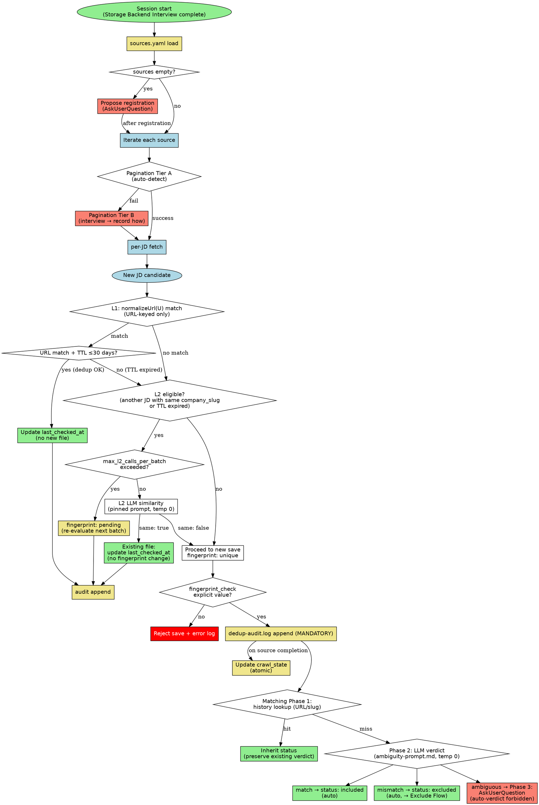
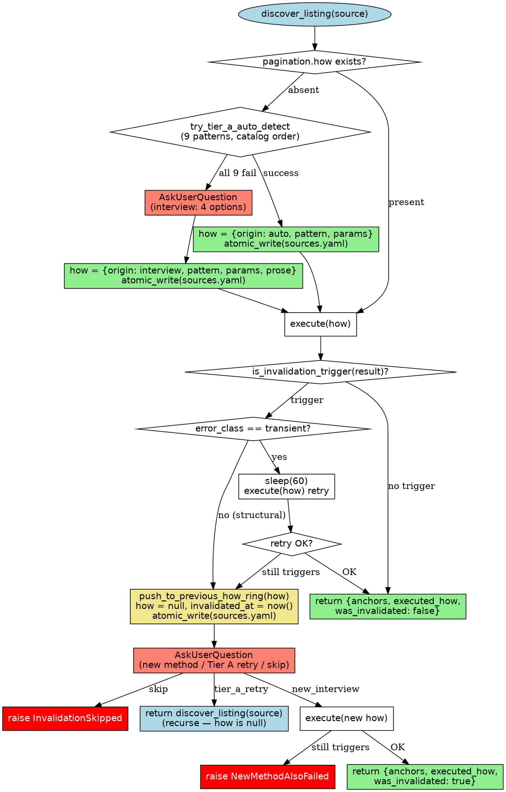
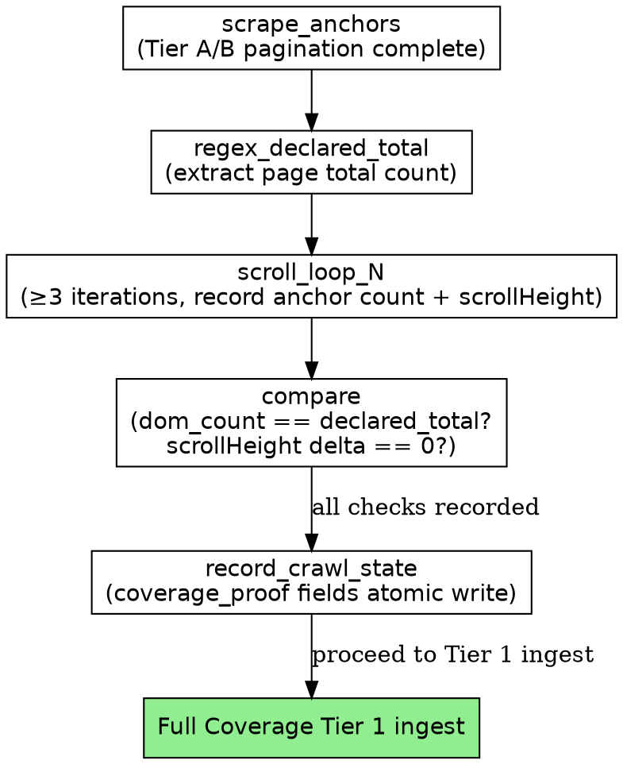
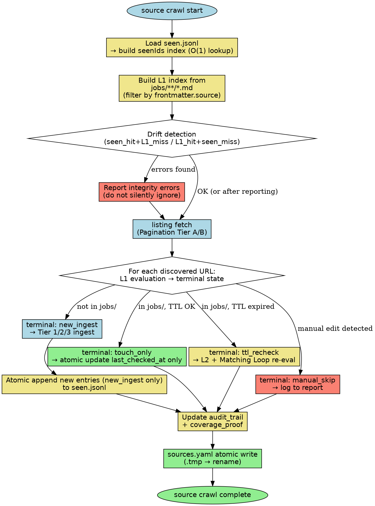

# Dedup and Discovery Rules Detail

> Reference doc for `collect-jd` skill — source/listing domain rules (Sources Registration, Pagination, Coverage Verification, Per-Site Crawl Memory, Identifier Kind Heuristic, Dedup L1/L2, Company-Name Ingest, Decision Flow).
> Linked from `SKILL.md` via anchor references — do not move section headings.

## Table of Contents

- [Decision Flow](#decision-flow)
- [Sources Registration](#sources-registration)
- [Listing Pagination](#listing-pagination)
- [Listing Pagination Coverage Verification](#listing-pagination-coverage-verification)
- [Per-Site Crawl Memory](#per-site-crawl-memory)
- [Per-Source Ledger](#per-source-ledger)
- [Identifier Kind Heuristic](#identifier-kind-heuristic)
- [Dedup Check Gate Enforcement](#dedup-check-gate-enforcement)
- [Dedup Layer 1](#dedup-layer-1)
- [Dedup Layer 2](#dedup-layer-2)
- [Company-Name Ingest](#company-name-ingest)

---

## Decision Flow

Decision tree for Dedup L1 → L2 escalation and Matching Loop Phase 1→2→3 gating. The remaining rules form a linear pipeline that needs no separate visualization — refer to each rule section directly.



**How to read**: Gray diamond = decision branch, green box = terminal path (save complete), yellow box = pending/record obligation (crawl_state update, fingerprint: pending), orange box = user question required. `salmon` (ambiguous → Phase 3, ask_register, pagination_tierB) = forced user-intervention path. Blue box (source_iter, per_jd_fetch) = **batch iteration unit** — repeats M times for M JDs across N sources.

---

## Sources Registration

### Specification (MANDATORY)

At session start, load `$OMT_DIR/collect-jd/sources.yaml`. If empty or absent, propose via a **single AskUserQuestion**: "Do you have JD source sites to register?" Skippable — not as mandatory as Profile Interview. When user provides a URL, atomic append with `{slug, name, careers_url, added_at, pagination, crawl_state}` structure.

### Trigger phrases (Reusable Crawl)

When any of the following is detected, **iterate all registered sources** → Listing Pagination → per-JD fetch + L1 evaluation (Algorithm B) + Dedup Gate + Classify + Persist:

- "오늘 돌려" / "오늘 크롤"
- "싹 돌려" / "전부 돌려"
- "전체 재크롤" / "전체 크롤"
- "sources 돌려" / "소스 돌려"
- "등록된 곳 전부" / "등록 사이트 크롤"

No automatic scheduling — depends on user utterance.

### sources.yaml schema (complete)

```yaml
version: 1
companies:
  - slug: toss
    name: Toss
    careers_url: https://toss.im/career
    added_at: 2026-04-01
    pagination:
      how:
        origin: auto         # auto | interview
        pattern: <enum>      # see Tier A 9-pattern catalog or interview pattern (manual_list / interview_script / interview_mcp / interview_api)
        params: {}           # pattern-specific (e.g., {start: 1, increment: 1, stop_condition: empty_response})
        prose: ""            # free-form description; mandatory for interview, optional for auto
      previous_how: []       # LRU ring (max 3) — pushed on invalidation
      invalidated_at: null   # ISO8601 if last invalidation occurred
    crawl_state:
      seen:
        identifier_kind: id_query  # or url, fingerprint
        identifier_extractor: "job_id"  # param name for id_query; null for url; hash spec for fingerprint
        items_path: "crawl_state/<source>/seen.jsonl"
        items_count: 0
      audit_trail:
        total_discovered: 0
        range_covered: []
        crawl_history: []
      coverage_proof:
        verified_at: null
        method: null
        page_declared_total: null
        dom_unique_anchor_count: null
        infinite_scroll_detected: null
        conclusion: null
      batch_run_completed: false
      pending_count: 0
    ingest:
      detail_required_before_persist: false   # default false; set true if Tier 2 fetch is mandatory before persist
blacklist:
  - slug: xyz
    name: XYZCorp
    reason_note: 이미 수집 완료, 재수집 불필요
```

See [Per-Site Crawl Memory](#per-site-crawl-memory) for full schema semantics.

### Rationalization Loopholes (MUST REJECT)

- "sources.yaml is empty so open-web free crawl" — ❌ No sources = no crawl. Only prompt for registration.
- "User said '싹 돌려' so crawl anywhere even with 0 sources" — ❌ If source count is 0, report "등록된 소스가 없어요" and stop.
- "Periodic auto-crawl without user utterance" — ❌ Automatic scheduling forbidden. User explicit utterance required.
- "Add to sources.yaml by company name alone without URL" — ❌ URL required. Auto-inference forbidden.
- "Auto-append to sources.yaml without user confirmation" — ❌ Only after user provides URL + expresses registration intent.

### Counterexample (normal flow)

- Session start → sources.yaml absent → "Do you have JD source sites to register?" AskUserQuestion → user provides "https://toss.im/career" → `{slug: toss, name: Toss, careers_url: ..., added_at: today}` atomic append → crawl proceeds normally. ✓
- User "싹 돌려" → sources.yaml has toss, kakao (2 entries) → crawl toss (Listing Pagination → per-JD) → crawl kakao → append `seen.jsonl` + update `audit_trail` → report. ✓
- User "싹 돌려" → sources.yaml empty → report "등록된 소스가 없어요. 등록할 사이트가 있나요?" + prompt registration. ✓

---

## Listing Pagination

### Specification (MANDATORY, single-path)

**Single source of truth: `pagination.how`**. All listing discovery — first-time auto-detect, user-interview fallback, cached re-execution, invalidation re-interview — collapses into one algorithm `discover_listing(source)`.

**Algorithm (3 steps)**:
1. If `pagination.how` absent → try Tier A 9-pattern catalog. On success, serialize as `how={origin: auto, pattern, params}` and atomic write. On all-9-fail → AskUserQuestion mandatory → `how={origin: interview, pattern, params, prose}` and atomic write.
2. Execute `pagination.how`.
3. On execution failure → classify trigger (transient: 1-retry then invalidate; structural: invalidate immediately). Push current `how` to `previous_how` 3-slot ring → set `how=null`, `invalidated_at=now()` → AskUserQuestion 3-option (new method / Tier A retry / skip). skip → **raise** `InvalidationSkipped`. retry-fail → **raise** `NewMethodAlsoFailed`. Silent empty `[]` return is **forbidden**.

### γ Schema for `pagination.how`

```yaml
pagination:
  how:
    origin: auto | interview         # 누가 만들었는지
    pattern: <enum 13>               # see Tier A (9) + Interview (4)
    params: {}                       # pattern-specific (start, increment, stop_condition 등)
    prose: |                         # 자유서술. interview 면 mandatory, auto 면 optional
      <free-form description>
  previous_how: []                   # 3-slot inline ring buffer (LRU; oldest evicted on 4th push)
  invalidated_at: null               # ISO8601 (마지막 invalidation 시각). 정상 상태는 null
```

기존 `pagination.method` 필드는 **drop** (derivable from `how.origin`).

| Field | Type | Description |
|---|---|---|
| `origin` | `auto` \| `interview` | `auto` = Tier A 자동 감지; `interview` = 사용자 인터뷰 결과 |
| `pattern` | enum (13) | 아래 Tier A 9-pattern + Interview 4-pattern 중 하나 |
| `params` | object | pattern-specific 파라미터 (예: `start: 1`, `increment: 50`, `stop_condition: empty_array`) |
| `prose` | string | 자유서술. `origin: interview` 면 mandatory. `origin: auto` 면 optional. |
| `previous_how` | array (max 3) | 3-slot inline ring buffer — 과거 invalidated how 목록 |
| `invalidated_at` | ISO8601 \| null | 마지막 invalidation 시각. 정상 상태는 `null` |

### Tier A 9-pattern Catalog

Attempt the following patterns in catalog order. On first success, record `how={origin: auto, pattern: <enum>, params: {...}}`.

| # | `pattern` enum | Description |
|---|---|---|
| 1 | `page_increment` | `?page=N` — increment from 1, stop on empty response |
| 2 | `offset` | `?offset=N` — increment by `limit` value |
| 3 | `cursor` | `?after=<token>` or `?cursor=<token>` — extract next cursor from response |
| 4 | `next_link` | `<a rel="next">` or text "다음"/"Next"/">" in `<a>` tag |
| 5 | `numeric_pagination` | `<a>2</a><a>3</a>...` pattern — extract last page number |
| 6 | `load_more_button` | "더 보기"/"Load more" button → Playwright click + XHR wait |
| 7 | `infinite_scroll` | Playwright network intercept: capture `fetch`/`XHR` URL then repeat calls |
| 8 | `api_json` | JSON API endpoint direct — `Content-Type: application/json` + `jobs`/`positions`/`listings` key |
| 9 | `graphql` | `pageInfo.hasNextPage` + `endCursor` |

Tier A success criterion: additional pages exist and can be fetched. A single-page site (no additional pages) also counts as success (pattern detected, result is 1 page).

### Interview Patterns (4)

When Tier A completely fails (all 9 patterns unmatched), **AskUserQuestion is mandatory**:

```
이 사이트({{source.careers_url}})의 전체 JD 목록을 어떻게 가져올 수 있나요?
가능한 방법:
(1) 수동 복붙 (URL 목록 또는 HTML)
(2) 스크립트 경로 또는 명령어
(3) 전용 MCP (예: mcp:notion, mcp:greenhouse)
(4) API URL (예: curl 명령어 또는 URL 패턴)
```

| `pattern` enum | Description | `prose` requirement |
|---|---|---|
| `manual_list` | 사용자가 URL 목록 또는 HTML 을 직접 붙여넣기 | mandatory — 복붙 방법 및 URL 목록 기술 |
| `interview_script` | 사용자 제공 스크립트 경로 또는 명령어 | mandatory — 스크립트 경로 + 실행 방법 |
| `interview_mcp` | 전용 MCP (예: `mcp:notion`) | mandatory — MCP 이름 + 호출 절차 |
| `interview_api` | 사용자 제공 API URL 패턴 | mandatory — URL 패턴 + 반복 조건 (stop on empty 등) |

Store result as `how={origin: interview, pattern: <one of 4>, params: {...}, prose: <free-form>}`. From next session onward, `pagination.how` is already set → skip Tier A → execute directly.

### Algorithm (pseudocode)

```pseudocode
discover_listing(source) -> { anchors, executed_how, was_invalidated }:
  if not source.pagination.how:
    auto_result = try_tier_a_auto_detect(source)  # attempts 9 patterns in catalog order
    if auto_result.success:
      source.pagination.how = {
        origin: "auto",
        pattern: auto_result.pattern,
        params: auto_result.params,
        prose: auto_result.description  # optional
      }
    else:
      # all 9 patterns failed → AskUserQuestion mandatory
      response = ask_user_for_method(source)
      source.pagination.how = {
        origin: "interview",
        pattern: response.pattern,  # one of manual_list / interview_script / interview_mcp / interview_api
        params: response.params,
        prose: response.free_form
      }
    atomic_write(sources.yaml)

  result = execute(source.pagination.how)

  if is_invalidation_trigger(result):
    # 1-retry-before-invalidation for transient errors
    if result.error_class == "transient":
      sleep(60)
      result = execute(source.pagination.how)
      if not is_invalidation_trigger(result):
        return { anchors: result.anchors, executed_how: source.pagination.how, was_invalidated: false }

    # invalidation confirmed → push current to previous_how ring (max 3)
    push_to_previous_how_ring(source.pagination.how)
    source.pagination.how = null
    source.pagination.invalidated_at = now()
    atomic_write(sources.yaml)

    # AskUserQuestion: re-interview / Tier A retry / skip
    response = ask_user_for_invalidation_choice(source, error=result.error)
    if response == "skip":
      raise InvalidationSkipped(source)  # caller handles — does NOT silently return empty
    if response == "tier_a_retry":
      # recurse: pagination.how is now null, so first branch fires
      return discover_listing(source)
    if response == "new_interview":
      # new how recorded by ask_user_for_invalidation_choice
      result = execute(source.pagination.how)  # retry once with new how
      if is_invalidation_trigger(result):
        raise NewMethodAlsoFailed(source)  # caller handles

    return { anchors: result.anchors, executed_how: source.pagination.how, was_invalidated: true }

  return { anchors: result.anchors, executed_how: source.pagination.how, was_invalidated: false }
```

### Invalidation Trigger Table

| Trigger | Severity | Action |
|---|---|---|
| Playwright timeout / network exception | Transient | 1 retry (60s), then invalidate |
| HTTP 5xx | Transient | 1 retry (60s), then invalidate |
| HTTP 4xx (404, 410) | Structural | Invalidate immediately |
| DOM selector match 0 (selector explicit) | Structural | Invalidate immediately |
| Known-error keyword ("Not Found", "Access Denied", "Unauthorized") | Structural | Invalidate immediately |
| 0 anchors collected | Ambiguous (gated) | **Invalidate ONLY if `crawl_state.audit_trail.total_discovered > 0`**. First-run 0 is legal |

### previous_how Ring (LRU, max 3)

On invalidation, push current `how` (plus `invalidated_at` timestamp and `invalidation_reason`) into `previous_how` ring before nulling `how`. Ring holds max 3 entries; oldest entry is evicted on 4th push (LRU).

```yaml
previous_how:
  - origin: auto
    pattern: page_increment
    params: { start: 1, increment: 1 }
    prose: ""
    invalidated_at: "2026-04-20T10:00:00Z"
    invalidation_reason: "HTTP 404 on page 2"
  - origin: interview
    pattern: interview_api
    params: {}
    prose: "GET /api/jobs?offset=X repeat (offset += 50, stop on empty)"
    invalidated_at: "2026-04-22T15:30:00Z"
    invalidation_reason: "DOM selector match 0"
  - { ... }  # oldest slot — evicted on 4th push
```

### Flowchart



### Coverage Verification Ordering

`Listing Pagination Coverage Verification` (3-check protocol) fires **only after `discover_listing` returns `was_invalidated: false` (success path) or `was_invalidated: true` after retry success**. When `discover_listing` raises (`InvalidationSkipped` or `NewMethodAlsoFailed`), Coverage Verification is **skipped** and Per-Site Memory `range_covered` append is also **skipped**.

### Rationalization Loopholes (MUST REJECT)

| Temptation pattern | Rejection basis |
|---|---|
| "On Tier A failure, save first-page only and 'collection complete'" | ❌ Must escalate to AskUserQuestion interview |
| "interview 결과 `pagination.how` 미저장 (Tier B answer used once, not recorded)" | ❌ `pagination.how` atomic write is mandatory. Reuse in next session is mandatory |
| "first-page only 저장 + collection complete 보고" | ❌ First-page-only without exhaustive pagination is a violation |
| "Skip pagination pattern check and fall back to manual URL list paste" | ❌ Tier A 9-pattern attempt is mandatory. Only if user explicitly says 'skip Tier A' may interview shortcut apply |
| "Auto-detect succeeded but didn't confirm last page, collected only 3 pages" | ❌ Continue until empty response or `has_next_page == false` |
| "First-time discovery skipping straight to AskUserQuestion without attempting Tier A 9-pattern catalog" | ❌ first-run 에 `pagination.how` 부재 시 Tier A 9 패턴 모두 시도 mandatory. user 직접 'skip Tier A' 발화 없이 인터뷰 shortcut 금지 |
| "Returning 0 anchors when execution failed (or invalidation-retry-fail) silently" | ❌ `discover_listing` 은 raise 또는 explicit `was_invalidated: true` 반환만 허용. silent empty `[]` 반환은 Per-Site Memory 의 `discovered − seen = ∅` false-clean 위험 |

### Counterexample

- **Auto success (γ schema)**: `?page=` pattern detected → sequential fetch pages 1~5 → page 6 response empty → 87 URLs total. Saved as `how = { origin: auto, pattern: page_increment, params: { start: 1, stop_condition: empty_response } }`. `was_invalidated: false` → Coverage Verification fires. ✓
- **Interview success (γ schema)**: All 9 patterns fail → AskUserQuestion → user provides "API: GET /careers/api/jobs?limit=50&offset=X". Saved as `how = { origin: interview, pattern: interview_api, params: { limit: 50, increment: 50, stop_condition: empty_array }, prose: "GET /careers/api/jobs?limit=50&offset=X repeat (offset += 50, stop on empty)" }`. Next session: `pagination.how` present → execute directly. ✓
- **Invalidation → skip**: `page_increment` how executes, HTTP 404 on page 2 (structural). Push to `previous_how`, `how = null`, `invalidated_at = now()`. AskUserQuestion → user chooses "skip". `raise InvalidationSkipped`. Caller logs skip + no Coverage Verification + no `range_covered` append. ✓

---

## Listing Pagination Coverage Verification

### Specification (MANDATORY, 3-check)

Discovery-side proof that the listing was scraped exhaustively. After Tier A/B pagination collects the anchor set, three checks MUST pass before Full Coverage Tier 1 ingest begins.

**The 3 checks:**

1. **Declared total match** — regex-extract page-level total count (e.g., "236개의 포지션") → must equal DOM unique-anchor count. Both values must be recorded.
2. **Scroll stability** — execute `window.scrollTo(0, document.documentElement.scrollHeight)` × ≥3 iterations via `browser_evaluate` → anchor count must remain unchanged across iterations.
3. **Infinite-scroll absence** — `scrollHeight` delta across iterations == 0 → no lazy fetch triggered.

**Persist to `sources.yaml.<source>.crawl_state.coverage_proof`:**

```yaml
coverage_proof:
  verified_at: <ISO8601>
  method: playwright_scroll_to_bottom_N_iterations
  page_declared_total: <int or null>   # null if no visible total count
  dom_unique_anchor_count: <int>
  infinite_scroll_detected: <bool>
  conclusion: <string>
```

**Pass criteria when `page_declared_total: null`**: Check #1 (declared-total match) is **N/A**. Pass requires: (check #1 PASS OR N/A) AND check #2 PASS AND check #3 PASS. Check #1 is evaluated as `page_declared_total == dom_unique_anchor_count` per evaluation; no separate stored field is needed (derived from the two source fields above).

### Rationalization Loopholes (MUST REJECT)

| Temptation pattern | Rejection basis |
|---|---|
| "Collected 236 URLs so pagination is complete — no need to verify" | ❌ Claimed count without scroll test is unverified. Verification Protocol required. |
| "Scroll test takes time, skip for large listing" | ❌ Coverage verification is MANDATORY. Time cost does not justify skipping. |
| "Site has no visible total count so declared-total check is not applicable" | ❌ Record `page_declared_total: null` + note "no declared total" in Tier B `how`. Other 2 checks must still run. |
| "1 browser_evaluate call is enough to confirm no infinite scroll" | ❌ ≥3 iterations required to establish stability. |
| "batch_run_completed=true already set; no need to re-verify" | ❌ coverage_proof must be set before batch_run_completed=true is ever declared. |

### T11 Violation Case

T11 dogfood (2026-04-25) initial run:

- **Claimed**: "236 unique URLs collected"
- **Actual tool calls**: 1 × `browser_evaluate` (anchor count only), 0 scroll tests, no declared-total regex
- **Violation**: Coverage Verification Protocol was not performed. The "236 URLs" claim was unverified — scroll stability and infinite-scroll absence were never confirmed.
- **Required**: ≥3 scroll iterations + declared-total regex match + `coverage_proof` field recorded before proceeding to Tier 1 ingest.

### T11-b Compliance Example

```
# Step 1: regex-extract declared total
page_declared_total = 236  # from "236개의 포지션"

# Step 2: scroll × 5 iterations
iteration 1: anchor_count = 236, scrollHeight = 8420
iteration 2: anchor_count = 236, scrollHeight = 8420
iteration 3: anchor_count = 236, scrollHeight = 8420
iteration 4: anchor_count = 236, scrollHeight = 8420
iteration 5: anchor_count = 236, scrollHeight = 8420

# Step 3: evaluate
infinite_scroll_detected = false  # scrollHeight delta == 0
# Check #1 derived: page_declared_total (236) == dom_unique_anchor_count (236) → match

# Step 4: persist
coverage_proof:
  verified_at: 2026-04-25T11:30:00Z
  method: playwright_scroll_to_bottom_5_iterations
  page_declared_total: 236
  dom_unique_anchor_count: 236
  infinite_scroll_detected: false
  conclusion: "Exhaustive collection confirmed — no additional anchors loaded on scroll."
```

### Decision Flow



**CRITICAL**:
- Without `coverage_proof` field set, `batch_run_completed=true` declaration is forbidden.
- Sites without a visible total count may record `page_declared_total: null` plus a note in Tier B `how`. Scroll stability check (checks 2 & 3) must still be performed.

---

## Per-Site Crawl Memory

### Specification (MANDATORY)

Maintain per-source crawl memory using a two-layer structure: a JSONL file for the seen-set and a structured block in `sources.yaml` for audit and coverage metadata. After each crawl session, atomic write `sources.yaml`.

### Storage Layout

**seen.jsonl** — append-only flat file:
- Path: `$OMT_DIR/collect-jd/crawl_state/<source>/seen.jsonl`
- One JSON object per line, each line < 1 KB.
- Append via POSIX `open(path, 'a')`. Session-lock guarantees single-writer.
- **Line schema**:
  ```json
  {"id": "...", "url": "...", "processed_at": "<ISO8601>", "verdict": "included|excluded|ambiguous", "role_title": "..."}
  ```
- The `id` field in seen.jsonl is **NOT** an auto-generated UUID; it is a **deterministic key** derived from the per-site `identifier_kind` strategy.

**sources.yaml** — structured metadata, 3 sub-groups under `crawl_state`:

```yaml
crawl_state:
  seen:
    identifier_kind: id_query | url | fingerprint
    identifier_extractor: <param-name> | null | <hash-spec>
    items_path: "crawl_state/<source>/seen.jsonl"
    items_count: <int>
  audit_trail:
    total_discovered: <int>
    range_covered:
      - from: <marker>
        to: <marker>
        run_at: <ISO8601>
        collected_count: <int>
        total_listed: <int or null>
    crawl_history:
      - run_at: <ISO8601>
        method: auto | interview_script | mcp:<name>
        new_jds: <int>
        already_seen: <int>
        pages_fetched: <int>
  coverage_proof:
    verified_at: <ISO8601>
    method: playwright_scroll_to_bottom_N_iterations
    page_declared_total: <int or null>
    dom_unique_anchor_count: <int>
    infinite_scroll_detected: <bool>
    conclusion: <string>
  batch_run_completed: <bool>
  pending_count: <int>
```

### Field Definitions

**`seen` sub-group**:

| Field | Type | Description |
|---|---|---|
| `identifier_kind` | enum | Strategy for deriving the `id` key: `id_query`, `url`, or `fingerprint` |
| `identifier_extractor` | string or null | Param name for `id_query`; `null` for `url`; free-form hash spec for `fingerprint` |
| `items_path` | string | Relative path to the seen.jsonl file from `$OMT_DIR/collect-jd/` |
| `items_count` | int | Number of entries currently in seen.jsonl (updated after each append) |

**`identifier_kind` — valid values and `identifier_extractor` meaning**:

| `identifier_kind` | `identifier_extractor` value | How `id` is derived |
|---|---|---|
| `id_query` | URL query param name (e.g., `"job_id"`) | `URLSearchParams.get(extractor)` from anchor href |
| `url` | `null` (omitted) | `normalizeUrl(href)` — the full normalized URL is the key |
| `fingerprint` | Hash input spec (e.g., `"role_title_verbatim + first_200_chars_of_body"`) | Hash of specified fields |

**`audit_trail` sub-group**: Replaces legacy `range_covered` and `crawl_history` top-level fields. Contains `total_discovered`, `range_covered` array (one entry per crawl run), and `crawl_history` array (execution metadata per run).

**`coverage_proof` sub-group**: Replaces legacy `coverage_verification` field. Scalar fields capturing the exhaustiveness proof from the Coverage Verification Protocol.

### Re-crawl Algorithm (Algorithm B Canonical)

**Migration note (2026-04-27 spec change)**: Earlier versions specified set-difference (`discovered − seen = new`) as the re-crawl algorithm. This was deprecated in favor of Algorithm B (L1 TTL canonical) due to the "stale forever" failure mode where seen items were never re-evaluated. Implementations following the old set-difference flow should migrate to Algorithm B; existing seen.jsonl data is forward-compatible (used as fast-lookup index).

Every discovered URL goes through L1 evaluation. **No set-difference pre-filter.** seen.jsonl is an audit/fast-lookup index, NOT a pre-L1 exclusion gate. The truth source for `last_checked_at` is the JD file at `jobs/<company_slug>/<role_title_slug>-<YYMMDD>.md` whose `frontmatter.source` matches the current source key; seen.jsonl mirrors it for O(1) id lookup.

#### Terminal States (L1 outcome)

For each discovered URL, L1 produces one of 4 **terminal states**:

| Terminal state | Trigger | Action |
|---|---|---|
| `new_ingest` | URL not in jobs/ | Proceed to Tier 1/2/3 ingest |
| `touch_only` | URL match in jobs/ AND `last_checked_at` within TTL (30d) | Atomic update `last_checked_at` only. No body fetch. No Tier 2/3. |
| `ttl_recheck` | URL match in jobs/ AND `last_checked_at` exceeds TTL (30d) | Enter L2 (LLM similarity check) → re-evaluate per Matching Loop |
| `manual_skip` | Manual Edit Safety detected (canonical contract violation or `last_checked_at` in future) | Skip, log to report |

#### L1 Outcome Decision Tree

```python
function classifyL1(url, jobsDir, ttl_days=30):
    l1Hit = lookup(url, jobsDir)            # URL-keyed only
    if not l1Hit:
        return TerminalState.new_ingest     # URL miss → ingest
    if jobs[url].manual_edit_detected:
        return TerminalState.manual_skip
    age_days = today - jobs[url].last_checked_at
    if age_days <= ttl_days:
        return TerminalState.touch_only     # Within TTL
    return TerminalState.ttl_recheck        # TTL exceeded
```

**Partition guarantee**: The 4 terminal states form a complete partition over the URL key space. Slug-level similarity is downstream concern (Matching Loop / L2). This separates URL-keyed dedup (L1) from content-keyed similarity (L2).

#### Drift Detection (MANDATORY)

Any of the following is an integrity error and **must be reported** (not silently ignored):

- **`seen_hit + L1_miss`**: ID is in seen.jsonl but no matching frontmatter found in jobs/. Indicates seen.jsonl drift or out-of-band jobs/ deletion.
- **`L1_hit + seen_miss`**: jobs/ frontmatter exists but ID not in seen.jsonl. Indicates seen.jsonl corruption or out-of-band jobs/ creation.

```pseudocode
// Drift detection pseudocode (run after building both sets)
// JD files are stored under jobs/<company_slug>/, not jobs/<source>/.
// Use a single canonical scan with a frontmatter.source filter — requires
// the 16-key canonical schema (frontmatter-schema.md) where `source` is required.
seenIds = buildSeenIdsFromJsonl("crawl_state/<source>/seen.jsonl")  // O(1) lookup index
l1Ids = buildL1IdsFromJobsFrontmatter("jobs/**/*.md", filter=fm => fm.source == source)

for id of seenIds:
  if id not in l1Ids:
    report_error("seen_hit + L1_miss: " + id)  // integrity error — must surface

for id of l1Ids:
  if id not in seenIds:
    report_error("L1_hit + seen_miss: " + id)  // integrity error — must surface
```

#### Post-processing

Crash recovery: skip invalid JSON lines in seen.jsonl + warn. After processing, atomic append new entries to `seen.jsonl` **for `new_ingest` terminal states only** (POSIX `open(path, 'a')`). Do not append `touch_only`, `ttl_recheck`, or `manual_skip` entries — those already exist in seen.jsonl.

### Atomic Append Safety Contract

- Use POSIX `open(path, 'a')` — the OS guarantees each `write()` call is atomic at the line level when `write()` payload ≤ PIPE_BUF (typically 4 KB; our lines are < 1 KB, well within limit).
- Session-lock (`.lock` file) ensures single-writer per session — no interleaved appends from concurrent sessions.
- Never truncate or rewrite the file in place; always append.
- Crash recovery: on next session load, skip any line that fails `JSON.parse()` and emit a warning. Partial lines from a crashed write are silently skipped.

### Migration Mapping (from legacy schema)

| Legacy field | New location | Notes |
|---|---|---|
| `marker_type` + `last_seen_marker` | → `seen.identifier_kind` + `seen.items_path` | Cursor-based rescan replaced by Algorithm B (L1 TTL canonical) — see "Re-crawl Algorithm (Algorithm B Canonical)" 섹션. |
| `coverage_verification` | → `coverage_proof` | Renamed; fields preserved |
| top-level `range_covered` | → `audit_trail.range_covered` | Moved under `audit_trail` |
| top-level `crawl_history` | → `audit_trail.crawl_history` | Moved under `audit_trail` |

### Flowchart



### Rationalization Loopholes (MUST REJECT)

- "Dynamic listing is recommendation-sorted, but a cursor is faster than reading the whole seen.jsonl" — ❌ Cursors assume stable ordering. Recommendation-sorted listings reorder items between runs. Algorithm B (every URL → L1 → 4 terminal states) is the only correct approach.
- "seen.jsonl will get large — skip reading it and use last_seen_marker as a shortcut" — ❌ `last_seen_marker` is deprecated and removed. seen.jsonl is the single source of truth. Read it in full every time; at typical JD counts (hundreds to low thousands) the file is < 1 MB and fast.
- "Recommendations always surface new items at the top, so cursor pointing to the latest item is sufficient" — ❌ Recommendation ranking changes retroactively (A/B tests, personalization). Items below the cursor can become new. Only Algorithm B (L1 TTL canonical) is correct. Set-difference was deprecated 2026-04-27 due to stale-forever failure mode.
- "The site uses chronological sort so a timestamp cursor is safe" — ❌ Timestamp cursors fail when items are backdated, unpublished, or re-published. Algorithm B (L1 TTL canonical) is universally correct regardless of sort order.
- "Appending to seen.jsonl before confirming the JD was persisted risks false positives" — ❌ Append only after successful persist. The ingest loop appends entries for JDs that completed the persist phase. Aborted JDs are simply not appended; they will appear as new on the next run.
- "identifier_kind defaults to url — just pick it silently and let the user fix it later" — ❌ Silent default is explicitly forbidden. Run the heuristic, report, confirm.
- "seen.jsonl is empty (first run), so skip L1 TTL evaluation and treat known URLs as new" — ❌ The algorithm is correct: an empty L1 index naturally routes every URL to `new_ingest`. No special casing needed; just run Algorithm B.

### Counterexample

- **id_query (Toss)**: `identifier_kind: id_query`, `identifier_extractor: job_id`. Anchor `https://toss.im/career/job-detail?job_id=4097` → `id = "4097"`. On re-crawl, `seenIds = {"4097", "3981", ...}`. New anchor with `job_id=4201` → `"4201" ∉ seenIds` → new candidate. ✓
- **url (company without ID params)**: `identifier_kind: url`, `identifier_extractor: null`. `id = normalizeUrl(href)`. Stable URL = stable key. ✓
- **fingerprint (obfuscated URLs)**: `identifier_kind: fingerprint`, `identifier_extractor: "role_title_verbatim + first_200_chars_of_body"`. URL changes per session (tokens, timestamps in query) → URL not usable as key. Hash of role title + body excerpt is stable. ✓

---

## Per-Source Ledger

### Overview

One ledger file per source per crawl session. The ledger is the source of truth for per-item progress and Coverage Gate (Gate 8). Without a ledger, Gate 8 cannot pass. The ledger complements `seen.jsonl` (permanent audit log) — it is a session-scoped progress tracker.

### Path Schema

**`session_id` format**: `<UTC_ISO_compact>-<random8>` (예: `20260428T103015-a1b2c3d4`).
한 collect-jd 호출 = 한 session_id. session_id는 호출 시점에 1회 생성되어 모든 source의 ledger 파일명에 동일 값으로 사용. 같은 날짜 재실행도 다른 session_id를 받으므로 ledger 파일이 분리되어 Coverage Gate 집계 오염을 형식적으로 봉쇄.

```
$OMT_DIR/collect-jd/crawl_state/<source>/ledger-<session_id>.jsonl
```

### Row Schema (canonical — use verbatim, do not rename fields)

```json
{
  "id": "<deterministic id from identifier_kind strategy>",
  "url": "<JD URL>",
  "l1_outcome": "new_ingest|touch_only|ttl_recheck|manual_skip",
  "ttl_state": "fresh|stale|na",
  "fanout_check": "single|multi_subsidiary|na",
  "classification": "included|excluded|ambiguous|na|pending",
  "persist_status": "saved|touched|skipped|pending",
  "terminal_state": "new_ingest|touch_only|ttl_recheck|manual_skip",
  "ts": "<ISO8601>"
}
```

### Field-by-Field Semantics

| Field | Type | Valid values | Description |
|---|---|---|---|
| `id` | string | deterministic key | Same derivation as seen.jsonl `id` — from `identifier_kind` strategy, NOT an auto-generated UUID |
| `url` | string | URL | Raw (pre-normalize) JD URL for human readability |
| `l1_outcome` | enum(4) | `new_ingest\|touch_only\|ttl_recheck\|manual_skip` | Result of Algorithm B L1 evaluation — written at Gate 4 |
| `ttl_state` | enum(3) | `fresh\|stale\|na` | `fresh` = within TTL; `stale` = TTL exceeded; `na` = new_ingest (no existing file) |
| `fanout_check` | enum(3) | `single\|multi_subsidiary\|na` | Result of Detail Split Auto Fan-out check — written at Gate 6; `na` if body not fetched |
| `classification` | enum(5) | `included\|excluded\|ambiguous\|na\|pending` | Matching Loop verdict — written at Gate 6; na for rows where l1_outcome ∈ {touch_only, manual_skip} (no Matching Loop applies); pending is in-flight only |
| `persist_status` | enum(4) | `saved\|touched\|skipped\|pending` | Outcome of Gate 7 persist — `saved` (new file written), `touched` (last_checked_at updated), `skipped` (dedup/manual_skip), `pending` is in-flight only |
| `terminal_state` | enum(4) | `new_ingest\|touch_only\|ttl_recheck\|manual_skip` | Final resolved state — reuses Algorithm B 4-enum. Must be non-pending by Gate 8 |
| `ts` | ISO8601 | datetime string | Timestamp of the row write (or last update) |

**`pending` constraint**: `pending` is permitted only in `classification` and `persist_status` as in-flight transient values within an event row. By Gate 8, every latest-by-id row's `classification` ∈ {included, excluded, ambiguous, na} and `persist_status` ∈ {saved, touched, skipped}. `terminal_state` MUST NEVER be `pending` in any row — it must always be one of the 4-enum values.

### Lifecycle: Which Gate Writes Which Fields

```
Gate 3  → ledger file created (empty)
Gate 4  → row appended (event 1): id, url, l1_outcome, ttl_state, ts,
            classification = (na if l1_outcome ∈ {touch_only, manual_skip} else pending),
            fanout_check = na, persist_status = pending,
            terminal_state = l1_outcome (initial)
Gate 5 (L2 / TTL recheck)
        → row appended (event 2): same id, fresh ts, ttl_state updated,
            terminal_state mapped from L2 outcome.
        Input scope:
          - `ttl_recheck` URLs (L1 hit + TTL exceeded): always run L2.
          - `new_ingest` URLs with sibling JDs in `jobs/<company_slug>/`:
            L2 is delegated to Gate 6 / Tier 1-3 ingest as part of the
            `fingerprint_check` save gate (see L2 Algorithm section, line 1040).
        Mapping:
            L2 same:true  → terminal_state=touch_only, classification=na
            L2 same:false → terminal_state=new_ingest, classification stays pending (Gate 6 갱신)
Gate 6  → row appended (event 3): same id, fresh ts, fanout_check + classification updated
Gate 7  → row appended (event 4): same id, fresh ts, persist_status set,
            terminal_state finalized
Gate 8  → audit: latest-by-id row count == total_discovered AND
            all latest-by-id terminal_state ∈ 4-enum
```

**Immediate write rule**: Each L1 evaluation at Gate 4 MUST write a row immediately after evaluation — not lazily at batch end. This guarantees crash-resumability: on next session, rows already written indicate which URLs were processed.

### Append Protocol

- Format: append-only JSONL, one row per line, < 1 KB per row.
- Open with POSIX `open(path, 'a')` — OS guarantees atomicity at line level when write payload ≤ PIPE_BUF (< 1 KB, well within limit).
- Session-lock (`.lock` file) guarantees single-writer per session — no interleaved appends from concurrent sessions.
- `fsync` is optional but recommended for crash safety.
- Never truncate or rewrite the ledger file in place.

### Append Semantics (Event-Log Model)

The ledger is interpreted as an append-only event log keyed by `id`. Each Gate 4-7
"update" appends a NEW row with the same `id` and a fresh `ts`. Earlier rows for
the same `id` are preserved as historical events for crash-recovery audit.

For any given `id`, the row with the greatest `ts` is the canonical latest state.
Coverage Gate (Gate 8) MUST compute latest-by-id before applying its checks.

```pseudocode
function pickLatestByTs(rows):
  by_id = {}
  for r in rows:
    if r.id not in by_id or r.ts > by_id[r.id].ts:
      by_id[r.id] = r
  return by_id
```

This semantics is compatible with the append-only POSIX `open(a)` contract:
no row is ever rewritten in place. Storage size grows linearly with gate transitions
per URL — bounded at ~4 events per id (Gates 4, 5, 6, 7).

### Crash Recovery

On session resume, load existing ledger rows to determine which URLs were already evaluated. Skip invalid JSON lines and emit a warning (partial last-line tolerance). URLs not present in the ledger re-enter from Gate 4.

### Coverage Gate Algorithm (Gate 8)

Coverage Gate runs in two layers: per-source check (`coverageGate`) and session-wide commit (`gate8AllSources`).
Per-source check is pure (no side effect on sources.yaml or session lock).
Session-wide commit runs once after all sources pass — single point of lock release and atomic sources.yaml write.

The session lock is released exactly once per session — after `gate8AllSources` confirms all sources are fully resolved. Per-source `coverageGate` is pure and has no side effect on sources.yaml or the lock.

```pseudocode
function coverageGate(source, session_id):
  ledger_path = "$OMT_DIR/collect-jd/crawl_state/{source}/ledger-{session_id}.jsonl"
  rows = loadJsonlRows(ledger_path)   # skip invalid JSON lines + warn
  latest_by_id = pickLatestByTs(rows)

  total_discovered = sources_yaml[source].crawl_state.audit_trail.total_discovered

  # Check 1: unique-id row count matches discovered count
  if len(latest_by_id) != total_discovered:
    fail("Coverage Gate FAIL [{source}]: ledger has {len(latest_by_id)} unique-id rows, expected {total_discovered}")

  # Check 2: every latest-by-id row is fully resolved (terminal_state ∈ 4-enum AND classification non-pending AND persist_status non-pending)
  pending_rows = [r for r in latest_by_id.values()
                  if r.terminal_state not in TERMINAL_STATES
                  or r.classification == "pending"
                  or r.persist_status == "pending"]
  if len(pending_rows) > 0:
    fail("Coverage Gate FAIL [{source}]: {len(pending_rows)} rows are not fully resolved (terminal_state / classification / persist_status pending)")

  return PASS   # pure check, no side effect

function gate8AllSources(sources, session_id):
  for source in sources:
    if coverageGate(source, session_id) != PASS: return FAIL

  # All sources passed — single atomic commit + lock release
  for source in sources:
    sources_yaml[source].crawl_state.batch_run_completed = true
    sources_yaml[source].crawl_state.pending_count = 0   # explicit reset on success
  atomic_write(sources_yaml)
  release_session_lock()
  return PASS

TERMINAL_STATES = {"new_ingest", "touch_only", "ttl_recheck", "manual_skip"}

function fail(reason):
  # Refuse lock release
  # Require explicit user approval to set remaining rows to manual_skip with reason
  ask_user_for_approval(reason)
```

### Migration Note

Prior crawl sessions (before this ledger spec) have no ledger files. Existing `seen.jsonl` and `sources.yaml` data remains valid for read-only audit. New sessions write a ledger; old data without a ledger is not back-filled automatically.

### Rationalization Loopholes (MUST REJECT)

- "Skip the ledger, tasks alone are sufficient" — ❌ Tasks track gate completion; the ledger tracks per-item progress. Gate 8 requires ledger row count == `total_discovered`. There is no substitute.
- "Append rows lazily at end of batch" — ❌ Each L1 evaluation MUST write a row immediately. Crash between Gate 4 and lazy-append means all progress is lost — unacceptable for large crawls.
- "`pending` for `terminal_state` when unsure" — ❌ `terminal_state` is resolved at Gate 4 (initial) and finalized at Gate 7. It must always be one of the 4-enum values. If outcome is unclear, that is a gate 5/6 concern — not a reason to set `terminal_state: pending`.
- "One ledger for all sources combined" — ❌ One ledger per source per session. Mixed-source ledgers make Coverage Gate logic ambiguous.
- "Use seen.jsonl as the ledger" — ❌ seen.jsonl is permanent cross-session audit. The ledger is session-scoped progress tracking. They serve different purposes and must not be conflated.

---

## Identifier Kind Heuristic

### Specification (MANDATORY)

On first registration of a new source, automatically infer the `identifier_kind` by sampling anchor URLs from the listing page before writing to `sources.yaml`. Report the result to the user and require confirmation before writing.

### Heuristic Algorithm

```pseudocode
anchors = collectListingAnchors(source.careers_url)
total = anchors.length

// Step 1: check for monotonic ID query param
paramCounts = {}
for anchor of anchors:
  params = new URLSearchParams(new URL(anchor.href).search)
  for [key, value] of params:
    if /^\d+$/.test(value):
      paramCounts[key] = (paramCounts[key] ?? 0) + 1

bestParam = argmax(paramCounts)
bestCount = paramCounts[bestParam] ?? 0

if bestCount / total >= 0.80:
  return { identifier_kind: "id_query", identifier_extractor: bestParam }

// Step 2: check URL stability (requires 2 separate fetches)
anchors2 = collectListingAnchors(source.careers_url)  // second fetch
stable = countStableUrls(anchors, anchors2)
if stable / total >= 0.95:
  return { identifier_kind: "url", identifier_extractor: null }

// Step 3: URL varies — fingerprint
return {
  identifier_kind: "fingerprint",
  identifier_extractor: "role_title_verbatim + first_200_chars_of_body"  // default spec
}
```

### User Report Format

After running the heuristic, report in this format before writing to `sources.yaml`:

```
Detected `identifier_kind: id_query` with extractor `job_id`
(218/236 anchors match `?job_id=\d+` pattern).
Confirm or override?
  [confirm] → write to sources.yaml
  [override] → edit sources.yaml manually
```

Wait for user response before writing. User can override by editing `sources.yaml` directly after confirmation.

### Override Procedure

User may change `identifier_kind` + `identifier_extractor` in `sources.yaml` at any time. On next rescan, the skill reads the current values from `sources.yaml` — no re-inference needed. If the user changes `identifier_kind` after seen.jsonl already has entries, re-derive all existing `id` values and rewrite `seen.jsonl` (or alert the user that a migration is needed).

### Rationalization Loopholes (MUST REJECT)

- "Only one anchor was sampled — url looks fine, set it silently" — ❌ Sampling a single anchor is insufficient. Full anchor set collection is required for the 80% threshold check.
- "User is in a hurry — default to `url` and let them fix it later" — ❌ Silent default is explicitly forbidden regardless of urgency. The heuristic takes seconds to run.
- "80% threshold is high — 60% of anchors have an ID param so that's probably right" — ❌ The threshold is 80%. Below threshold → do not select `id_query`; fall through to `url` or `fingerprint` check.
- "The site is well-known (e.g., Toss) so I already know it uses job_id param — skip heuristic" — ❌ Heuristic must always run. Prior knowledge does not exempt the confirmation step.
- "identifier_extractor can be left null for id_query because the param is obvious" — ❌ `identifier_extractor` must be the specific param name when `identifier_kind` is `id_query`. `null` is only valid for `url`.

### Counterexample

- **Toss careers**: 236 anchors sampled → 218 match `?job_id=\d+` pattern (92.4%) → heuristic selects `id_query` + extractor `job_id`. Report shown, user confirms. Written to `sources.yaml`. ✓
- **Company with path-based URLs** (e.g., `/careers/software-engineer-backend`): 0 anchors have ID query params. Second fetch shows 94/100 URLs stable → `url` kind selected. ✓
- **Company with session-token URLs** (e.g., `/jobs?token=abc123&id=456`): token changes per session → < 95% stable. Hash of role title + body excerpt selected as `fingerprint`. ✓

---

## Dedup Check Gate Enforcement

### Specification (MANDATORY)

Dedup L1/L2 **must always leave a gate execution record**. Silent-skip is forbidden in cases where `jobs/` is empty or L2 conditions are not met. If the `fingerprint_check` field is not set to an explicit value before JD save, reject the save.

- **L1 gate** — must execute on every JD ingest:
  - jobs empty → `L1_candidates_checked: 0`, `fingerprint_check: pending` (L2 미실행 표시), then proceed to L2 step.
  - candidates exist → perform normal normalize matching.
- **L2 gate** — must be evaluated after L1 pass:
  - 0 other JDs with same `company_slug` in `jobs/<company_slug>/` (all sessions) → `L2_evaluated: not_applicable (no_sibling_jds)`, `fingerprint_check: unique`.
  - JDs with same `company_slug` exist in `jobs/<company_slug>/` (all sessions) → call LLM similarity → `fingerprint_check: unique | duplicate_of:<existing.url>`.
- **Pre-save validation**: If `fingerprint_check ∉ {unique, duplicate_of:<url>, pending}`, reject save + error log.

### Dedup Gate Audit Line (MANDATORY)

At the end of each ingest operation, append 1 line to `$OMT_DIR/collect-jd/dedup-audit.log` (atomic):

```
<ISO8601>\t<url>\tL1:<status>\tL2:<status>\tfingerprint:<value>
```

L1 status values: `checked_N` (N candidates) / `no_candidates`.
L2 status values: `called` / `not_applicable` / `cap_exceeded`.
For L2 same:true outcome, `<value>` is the literal string `duplicate_of:<existing.url>` (substituting the matched existing JD's URL). Otherwise `<value>` ∈ {unique, pending}.

→ See top-level Decision Flow at the start of this document.

### Rationalization Loopholes (MUST REJECT)

- "jobs/ is empty so L1 check skip produces the same result" — ❌ Without a gate execution record in the audit log, verification is impossible. Must record "executed, 0 candidates".
- "No JD for the same company so skip L2 call" — ❌ The evaluation itself must be performed. "not_applicable" must be explicitly recorded.
- "fingerprint_check defaults to unique so can be omitted" — ❌ Explicit write is mandatory. Omission is equivalent to dedup not being run.
- "dedup-audit.log is optional, isn't it?" — ❌ MANDATORY. Absent = save rejected.
- "Batch mode has duplicate L1/L2 scans, so some can be skipped" — ❌ Gate execution is mandatory per JD. Batch only adjusts the cap.

### Counterexample (normal flow — 2 cases)

1. **Empty jobs**: First JD ingest → L1 gate executes (candidates: 0) → L2 gate evaluates (sibling: 0) → `fingerprint_check: unique` → JD atomic write → `dedup-audit.log` appends `...\tL1:no_candidates\tL2:not_applicable\tfingerprint:unique`.
2. **Sibling exists**: Second toss JD ingest → L1 gate (candidates: 1, normalize match: no) → L2 gate (sibling: 1) → LLM similarity (same: false) → `fingerprint_check: unique` → save. audit: `...\tL1:checked_1\tL2:called\tfingerprint:unique`.

---

## Dedup Layer 1

Before writing a new JD file, **always** run L1 dedup against existing files in `$OMT_DIR/collect-jd/jobs/<company_slug>/`.

### L1 match conditions

Given candidate JD with normalized URL `U` and slugs `(company_slug, role_title_slug)`:

- **Match** if any existing JD satisfies:
  - `normalizeUrl(existing.url) == U`

`normalizeUrl()` is defined in `scripts/url-normalize.ts` (spec: `reference/url-normalize.md`). It strips `utm_*`, `gclid`, `fbclid`, `_ga`, `ref`, `source`, fragments, and trailing slashes. **Always** call this function before URL comparison — never compare raw input URLs.

### L1 match action (MANDATORY)

If L1 matches an existing file:
1. **Do not create** a new JD file under `jobs/`.
2. Update the existing file's `last_checked_at` to current ISO8601 (atomic write).
3. Report: `"중복 감지: 기존 <path> (L1: URL normalized match)"`.
4. Go to L2 only if URL match AND last_checked_at is older than TTL (30 days).

### Rationalization Loopholes (MUST REJECT)

- "utm attached so different link, separate entry" — ❌ Compare after normalizeUrl.
- "User explicitly said two URLs are different so save as requested" — ❌ Dedup takes precedence over user preference.
- "Only fragment (#anchor) differs so separate" — ❌ normalize removes fragments.
- "Query param order differs so separate" — ❌ normalize sorts and strips params.
- "Might be duplicate of previous collection but uncertain, so save anyway" — ❌ If uncertain, call L2; if still unclear, save with `fingerprint_check: pending` (per S13 rule).

### Counterexample: different positions

Two JDs with the same (company_slug, role_title_slug) but different normalized URLs are SEPARATE L1 entries — slug similarity is L2's concern, not L1's. Same-URL collisions are the only L1 match condition.

---

## Dedup Layer 2

When L1 (URL-only key) **does not match**, or when L1 matched but `last_checked_at` exceeds TTL (30 days), call L2 LLM similarity judgment.

### When to call L2

- L1 no-match + **another JD with the same `company_slug`** already saved **in `jobs/<company_slug>/` (all sessions, not just current batch)** → L2 comparison mandatory (prevents cross-session same-company duplicates)
- L1 URL match + `last_checked_at` > 30 days → L2 re-verification (content may have actually changed)
- Single-session L2 call cap `max_l2_calls_per_batch: 50`. If exceeded, proceed with save but mark `fingerprint_check: pending` → re-evaluate in next batch.

### L2 invocation contract

- **Prompt file:** `reference/dedup-l2-prompt.md` (pinned, version-controlled)
- **Temperature: 0** (deterministic)
- **Output contract:** JSON `{"same": bool, "reason": str}`
- On JSON parse failure, retry once. On 2nd failure, save conservatively with `fingerprint_check: pending` (preservation takes precedence over dedup skip).
- **Raw URL comparison forbidden**, **slug-only judgment forbidden** — must always go through L2 prompt.

### L2 match action (same == true)

1. **Forbid** creating new JD file.
2. Update existing (matched) file's `last_checked_at` to current ISO8601 (atomic write).
3. Record candidate URL in `dedup-audit.log` (where dup was detected from). Existing file's `fingerprint_check` is **not** modified — symmetric with L1 hit behavior.
4. Report: `"중복 감지: 기존 <path> (L2: LLM similarity same=true, reason=<reason>)"`.

### L2 non-match action (same == false)

- Proceed to save new JD file. Record `fingerprint_check: unique`.

### Rationalization Loopholes (MUST REJECT)

- "Different URLs obviously means different JDs" — ❌ L2 content comparison is mandatory (handles company blog vs job portal same posting case).
- "Blog is a promotional piece, separate from hiring site" — ❌ If content is the same, it's a duplicate.
- "Content is slightly different so separate" — ❌ Delegate to LLM judge. Temperature 0 makes result reproducible.
- "Batch is busy so skip L2 and save" — ❌ When `max_l2_calls_per_batch` is exceeded, saving with `fingerprint_check: pending` is allowed — **that is not a skip**. Re-evaluate in next batch, mandatory.
- "L2 response JSON is broken so just save" — ❌ 1 retry; if still failing, `fingerprint_check: pending`.

### Counterexample: different team · different seniority

Even same company · same role_title, if L2 returns `same: false`, save as separate JDs (e.g., "네이버 백엔드 시니어" vs "네이버 백엔드 주니어").

---

## Company-Name Ingest

Ingest path #4 (company name only) operates **only within sites registered in `sources.yaml`**. Open-web free search is **absolutely forbidden**.

### Processing flow

1. User provides company name only, e.g., "XYZCorp 의 JD 가져와줘".
2. Skill looks up company slug match in `sources.yaml`'s `companies[]` (or equivalent field).
3. **Match found:**
   - Use the matched company's `careers_url` from `sources.yaml` to fetch JD list
   - For each JD: standard ingest flow (Phase 0 → Dedup L1/L2 → Matching Loop → save)
4. **Match not found (unregistered):**
   - WebFetch call **forbidden**.
   - LLM open-world search · Google search · LinkedIn exploration all **forbidden**.
   - Trigger `AskUserQuestion`: "XYZCorp 의 공식 채용 페이지 URL 을 알려주세요. 등록하면 다음부터 회사명만으로 수집 가능합니다."
   - Options:
     - `URL input`: user provides URL → append to `sources.yaml`'s `companies[]` (`{slug, name, careers_url, added: <ISO date>}`) → return to step 3
     - `skip`: abandon collection. Report "XYZCorp 는 등록되지 않아 건너뛰었습니다."
     - `ignore (blacklist)`: add to `sources.yaml.blacklist[]` → immediately skip on next occurrence of this company request (optionally with reason_note).

### sources.yaml schema (relevant portion)

```yaml
version: 1
companies:
  - slug: toss
    name: Toss
    careers_url: https://toss.im/career
    added: 2026-04-01
blacklist:
  - slug: xyz
    name: XYZCorp
    reason_note: 이미 수집 완료, 재수집 불필요      # optional
```

### Rationalization Loopholes (MUST REJECT)

- "User provides company name so obviously need to search Google — that's being helpful" — ❌ Open-web search is absolutely forbidden (plan non-goal).
- "Not registered but try WebFetch with a guessed URL anyway" — ❌ WebFetch call forbidden.
- "Skip AskUserQuestion and quietly skip unregistered companies" — ❌ Must notify user (transparency).
- "Let skill auto-append to sources.yaml without user confirmation" — ❌ Append only after user provides URL. Auto-inference forbidden.
- "Blacklisted companies: skip without even asking for registration — don't even throw registration question" — ⭕ OK (blacklist is user explicit intent). But must include one line in report noting blacklist triggered.

### Counterexample

- User "Toss 채용공고 가져와줘" → `toss` exists in `sources.yaml.companies` → fetch `https://toss.im/career` → standard flow.
- User "XYZCorp 채용" → unregistered → AskUserQuestion → user provides URL → append to `sources.yaml` → fetch.
- User "어제 등록한 xyz 회사" → found in blacklist → quietly skip + report line "XYZCorp blacklist (reason: 이미 수집 완료)".
