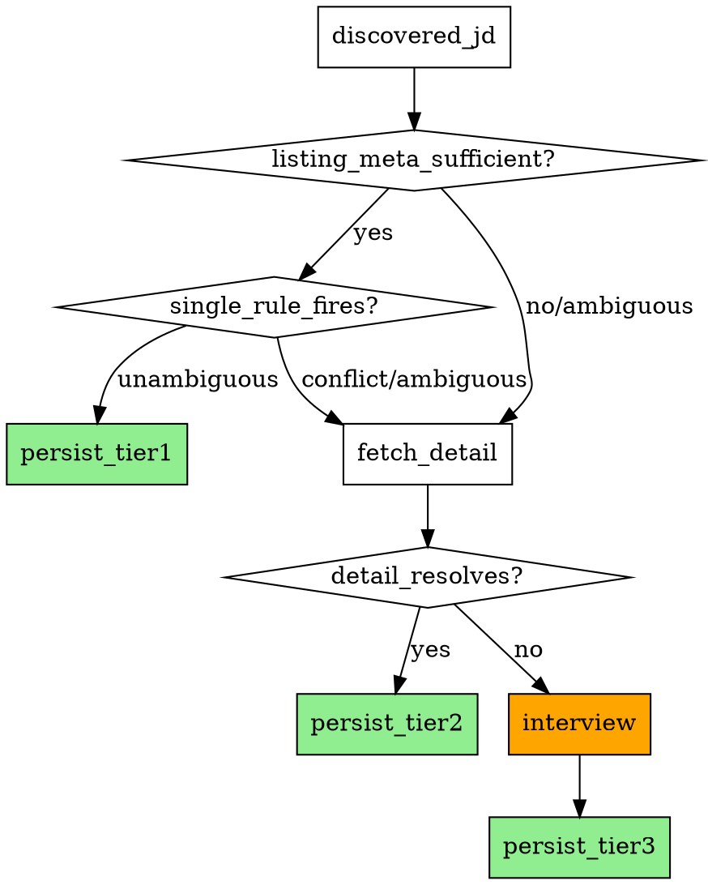

# Ingest and Curation Rules Detail

> Reference doc for `collect-jd` skill — per-JD ingest and curation rules (Detail Split, Matching Loop, Full Coverage Ingest, Exclude Flow, Reversal, Manual Edit Safety, Ingest Validation, Batch Report, Role Tagging, YAML Robustness, Rules Re-evaluation).
> Linked from `SKILL.md` via anchor references — do not move section headings.

## Table of Contents

- [Detail Split Auto Fan-out](#detail-split-auto-fan-out)
- [Matching Loop](#matching-loop)
- [Full Coverage Ingest Protocol](#full-coverage-ingest-protocol)
- [Exclude Flow](#exclude-flow)
- [Reversal](#reversal)
- [Manual Edit Safety](#manual-edit-safety)
- [Ingest Validation](#ingest-validation)
- [Batch Mode Report Schema](#batch-mode-report-schema)
- [Role Tagging](#role-tagging)
- [YAML Robustness](#yaml-robustness)
- [Rules Re-evaluation](#rules-re-evaluation)

---

## Detail Split Auto Fan-out

### Specification (MANDATORY)

When a single listing anchor leads to a detail page containing multiple distinct positions, detect split signals and fan-out into N child JDs rather than saving a single combined record.

### Signal Classification

**Strong signals** — fan-out is MANDATORY when any of these are present:

| Signal | Example |
|---|---|
| (a) Explicit subsidiary or team headers | Section heading "토스뱅크", "Toss Securities", "Tech Team" within the body |
| (b) Separate sub-position sections with distinct requirements | Each sub-position has its own qualifications, responsibilities, or tech stack block |
| (c) Multiple distinct apply CTAs | More than one "지원하기" / "Apply" button targeting different positions |

**Weak signals** — keep as single combined JD (do NOT fan-out):

| Signal | Example |
|---|---|
| Simple text mention only | "토스 외 5개 계열사" in anchor text, with no separate content blocks per company |

The distinction: weak signals name multiple entities in passing; strong signals present each entity with its own content block or action.

### Fan-out Procedure

1. Identify N distinct positions from strong signals.
2. Produce one child JD per distinct position.
3. Each child JD frontmatter:
   - `parent_url`: the original anchor URL (identical for all siblings)
   - `sub_position`: the subsidiary or team name for this child
   - `role_title_verbatim`: `"<original_title> — <sub_position>"`
   - `role_title_slug`: derived from `role_title_verbatim` (includes `sub_position` via slugify)
4. All other frontmatter fields (company_slug, tags, etc.) inherit from the parent unless the child's content overrides them.

### Presence-Coupling Rule

`parent_url` and `sub_position` are **presence-coupled**: both must be present or both must be absent. A JD record where exactly one of the two fields is set is structurally invalid and must be rejected before save.

### Dedup Impact

- L1 dedup key is `(company_slug, role_title_slug)`. Because `role_title_slug` includes `sub_position`, siblings with different `sub_position` values are naturally distinct keys — no special dedup handling required.
- `parent_url` field is used for sibling relationship awareness (e.g., display grouping) only. It does not affect dedup logic.

### Rationalization Loopholes (MUST REJECT)

- "The page mentions a company name once in a header but the body describes one role — that's a strong signal" — ❌ A single mention without a separate content block is a weak signal. Only explicit sectioned content or multiple CTAs qualify as strong.
- "Fan-out will make dedup more complex so keep it as a single combined JD" — ❌ L1 dedup handles siblings correctly via `role_title_slug`. Complexity is not a reason to violate the rule.
- "sub_position is not always explicitly labeled so I'll just skip it or put a placeholder" — ❌ If `sub_position` cannot be reliably determined from the content, escalate to Tier 3 user interview rather than guessing. Presence-coupling forbids saving with only `parent_url`.
- "The anchor text says 외 5개 계열사 — that's multiple companies so fan-out" — ❌ Anchor text mention alone is a weak signal. Check the detail page. If the detail page has separate content blocks per company, that is the strong signal. If not, single combined JD.
- "parent_url is already in the frontmatter so sub_position is redundant — skip it" — ❌ Presence-coupling: if `parent_url` is set, `sub_position` must also be set.

### Counterexample

- **Toss "백엔드 개발자 — 외 5개 계열사" anchor** → detail page has separate sections "토스", "토스뱅크", "토스증권" each with distinct requirements + 3 apply CTAs → **strong signal** → fan-out into 3 child JDs. Each child gets `parent_url` = anchor URL, `sub_position` = "토스" / "토스뱅크" / "토스증권". ✓
- **Simple "XYZ 외 2개 계열사" anchor** → detail page body describes a single generic role with no subsidiary separation → **weak signal** → single combined JD, no `parent_url`/`sub_position`. ✓

---

> See [Decision Flow in dedup-and-discovery.md](dedup-and-discovery.md#decision-flow) for the complete L1→L2→Matching Loop diagram.

## Matching Loop

Determine `status` by comparing against the current `profile/rules.yaml` before saving each JD. 3-phase verdict:

### Phase 1: History lookup

If the same URL or slug pair exists in `jobs/**/*.md`, inherit that status (user reversals handled by S6 rule). Otherwise proceed to Phase 2.

### Phase 2: Rules check (LLM ambiguity predicate)

Call the pinned prompt in `reference/ambiguity-prompt.md` at **temperature 0**. Output JSON:

```json
{"verdict": "match" | "mismatch" | "ambiguous", "missing_signals": [string], "explanation": "KR short"}
```

- `verdict == "match"` → `status: included` (auto)
- `verdict == "mismatch"` → `status: excluded` (auto, but per S4 rule `tags` + `reason_note` required — derive the violated rule name as tag)
- **`verdict == "ambiguous"` → auto-verdict forbidden.** Must call `AskUserQuestion` (Phase 3).

On JSON parse failure, retry once. On 2nd failure → conservative `verdict: ambiguous` + `missing_signals: ["llm_parse_failure"]` → enter Phase 3.

### Phase 3: Ask the user (ambiguous only)

Compose Korean question based on `missing_signals`. When calling `AskUserQuestion`:

- Question focuses on **core decision signal** (e.g., "이 JD 의 원격 근무 정책을 확인하고 싶어요. 원격 가능이면 include, 불가능이면 exclude 로 저장할까요?")
- Options: `include`, `exclude`, `defer` (= save as `status: ambiguous`, re-evaluate in subsequent batch)
- After collecting user answer, finalize `status`. If defer: `status: ambiguous` + `reason_note: "deferred due to <missing>"`.

**Call immediately even in Batch mode**. Queuing until checkpoint or end of batch is forbidden. If user explicitly signals stop ("그만" / "stop" / "defer all" etc.), stop immediately + preserve remaining candidates as `status: ambiguous`.

### Rationalization Loopholes (MUST REJECT)

- "No rules violation mentioned in body so include" — ❌ If missing_signals exist, it's ambiguous — must ask user.
- "Seoul office is the default so remote is impossible" — ❌ If not explicitly stated, inference is forbidden — ask.
- "In batch mode so ask all together later" — ❌ Ask immediately (only defer when user selects defer).
- "No rules.yaml so auto-include" — ❌ If rules.yaml is absent, run S1 Phase 0 interview first.
- "User already specified URL so intent is clear → include" — ❌ Providing URL ≠ inclusion intent.
- "missing_signals are minor so auto-judge" — ❌ Even one signal requires asking.

### Auto-decision audit trail

When auto-saving with `verdict == match` or `mismatch`, record `auto:<verdict>:<rules.yaml sha256 short 8>` in `reason_note`. Allows identification of stale judgments during future rules re-evaluation.

### Counterexample (legitimate auto-include)

If a JD **explicitly satisfies** all rules conditions (`remote: true`, `stack: [Kotlin, Spring]`, `seniority: senior`), `verdict: match` → auto-include. Save without user question. `reason_note: "auto:match:<sha>"`.

### Orthogonality with Full Coverage Ingest Protocol

Matching Loop and Full Coverage Ingest Protocol are **orthogonal concerns** that operate at different levels of the pipeline. Confusing them produces silent misclassifications.

| Dimension | Matching Loop | Full Coverage Ingest Protocol |
|---|---|---|
| Question answered | "What do signals say about this JD?" | "Where did I get my signals for this JD?" |
| Scope | Verdict algorithm: match / mismatch / ambiguous | Input-depth escalation ladder: Tier 1 → 2 → 3 |
| Runs | Once per JD, after signals are assembled | Determines which signals to assemble |
| Entry point | Called from inside each Full Coverage tier | Wraps Matching Loop calls |
| State written | `status`, `reason_note`, `auto:<verdict>:<sha>` | `coverage_proof`, `batch_run_completed` |

**How they compose**: Full Coverage decides at which depth to stop fetching data (Tier 1: listing metadata, Tier 2: detail fetch, Tier 3: user interview). At each tier, once signals are assembled, Matching Loop is invoked to produce a verdict. Matching Loop does not know or care which tier it was called from.

**Why orthogonality matters**: A JD that passes Tier 1 (rich listing metadata) still goes through Matching Loop Phase 1→2→3. A JD that requires Tier 3 (user interview for missing signals) also ends with a Matching Loop verdict. Skipping either breaks the pipeline regardless of how much data was gathered.

| Full Coverage tier | Internal Matching Loop call |
|---|---|
| Tier 1 (Listing Metadata) | Matching Loop Phase 1→2 (auto-verdict if unambiguous) |
| Tier 2 (Detail Fetch) | Matching Loop Phase 1→2 re-run on enriched signals |
| Tier 3 (User Interview) | Matching Loop Phase 3 (AskUserQuestion with missing_signals) |

---

## Full Coverage Ingest Protocol

Process all JDs discovered from listing scrape without omission. Escalate in order from information exposed on the discovery screen. **`batch_run_completed` declaration is forbidden until all discovered items are processed.**

**Stop ≠ Compliance.** Mid-batch stop without declaring `batch_run_completed=true` is itself a violation, not a loophole. The rule binds the act of leaving items unprocessed, not just the act of declaring completion. Silent stop is equivalent to declaring `batch_run_completed=true` while `processed_count < discovered_count`.

**Verification round is no exception.** "This is a dogfood / spec verification / GREEN_LIVE proof round so a sample is sufficient" is forbidden reasoning. There is no test mode separate from production: every discovered JD in every session is real and must be processed. If the user wanted a sample, they would say so explicitly with a specific N.

**Letter ≡ Spirit.** Following the letter (e.g., "I didn't write `batch_run_completed=true`") while violating the spirit (leaving 231 of 234 items unprocessed) is itself a violation. The user's intent in invoking the skill is full coverage; partial coverage with a `partial_sample_run` audit note does not satisfy that intent.

### Specification

#### Tier 1 — Listing Metadata Resolution

- **Target data**: Full `innerText` of each anchor extracted from the listing scrape DOM — `role_title_verbatim` + stack/keyword labels + subsidiary labels + other badges. Full `querySelector('a[href*=job-detail]').innerText` (or source-specific pattern).
- **Toss example**: anchor innerText = `"Server DeveloperKotlin ・ Java ・ Spring ・ Backend토스 외 5개 계열사"` — includes title + stack + subsidiary.
- **Verdict condition**: This metadata alone enables `taxonomy.yaml` role_tags extraction + a single unambiguous `rules.yaml` match/mismatch rule trigger.
- **Result**: Immediately persist (`status=included` or `status=excluded`), skip detail fetch.

#### Tier 2 — Detail Fetch Verification

- **Trigger condition (Tier 1 ambiguity definition)**:
  - (a) stack label not covered by `taxonomy.yaml` enum
  - (b) multiple rule conflicts (match + mismatch rules triggering simultaneously)
  - (c) ambiguous rule trigger (single rule but contains unsatisfied condition signals)
- **Procedure**: Playwright `browser_navigate(url)` → `browser_wait_for` → `browser_evaluate` to extract body → re-extract role_tags → re-compare against `rules.yaml`.
- **Result**: If verdict is clear, persist. If still ambiguous, MANDATORY escalate to Tier 3.

#### Tier 3 — User Interview

- **Trigger condition**: Ambiguity persists after Tier 2.
- **Procedure**: MANDATORY `AskUserQuestion` — Korean question based on `missing_signals`, options `include` / `exclude` / `defer`.
- **Result**: After receiving user answer, finalize status. If defer: `status: ambiguous` + `reason_note: "deferred due to <missing>"`.

#### Batch Completion condition

Manage `batch_run_completed` field in `sources.yaml.<source>.crawl_state`:

- Declaring `batch_run_completed=true` while `processed_count < discovered_count` is forbidden.
- On session end with incomplete processing: record `batch_run_completed=false` + `pending_count=<N>` + summary report ("discovered N items, processed M, K remaining. Continue in next batch.").
- In next batch, resume from remaining pending items first.

### Decision Flow



**How to read**: Green box = verdict complete → persist. Orange box = user interview required. Each diamond is a tier-boundary decision branch.

### Rationalization Loopholes (MUST REJECT)

| Temptation pattern | Rejection basis |
|---|---|
| "Sales is obviously mismatch from title alone so skip stack label" | ❌ Obligation to obtain full anchor.innerText. Partial parsing forbidden. |
| "Detail fetch for all 236 items takes too long → pending dump for ambiguous ones" | ❌ Tier 1 ambiguous = MANDATORY Tier 2 fetch. Time cannot justify skip. |
| "Still ambiguous after Tier 2 → just leave as pending" | ❌ Tier 2 ambiguous = MANDATORY Tier 3 interview. Pending dump forbidden. |
| "Sample processing confirmed rules work so batch complete" | ❌ Declaring batch_run_completed=true while processed < discovered is forbidden. |
| "Strong mismatch inference from title means detail skip is acceptable" | ❌ Tier 1 verdict impossible = forced Tier 2 escalate. Inferred mismatch ≠ confirmed mismatch. |
| "This run is a dogfood / spec verification / GREEN_LIVE proof — sample is sufficient" | ❌ No test mode exists separate from production. Every discovered JD must be processed. |
| "I'll process N samples to demonstrate the pipeline; user will run the rest next round" | ❌ Single-handed scope reduction is forbidden. If sample is desired, the user names N explicitly upfront. |
| "Leaving `partial_sample_run` note in sources.yaml preserves the audit trail, so partial is OK" | ❌ Audit trail is for transparency, not for permission. The note documents a violation; it does not grant one. |
| "I didn't write `batch_run_completed=true` so technically I'm compliant" | ❌ Stop ≡ Declaration. Leaving items unprocessed is the violation; the declaration field is reporting, not the gate. |
| "Tier 1 verdicts already computed for all 234 — file persistence for unmatched can be deferred" | ❌ Tier 1 verdict computation ≠ persistence. `included` items must be written; ambiguous items must escalate to Tier 2/3, not be deferred. |

### Counterexample (T11 Server Developer #197 — violation case)

T11 dogfood (2026-04-25) actual violation at Toss Careers:

- **Discovery**: listing anchor innerText = `"Server DeveloperKotlin ・ Java ・ Spring ・ Backend토스 외 5개 계열사"`
- **Violation**: Only parsed title from anchor.innerText ("Server Developer") → missed stack label "Kotlin · Java · Spring · Backend" → rules.yaml match rule #1 (`role_tags intersects [backend, data, ml]`) did not fire → unprocessed.
- **Correct behavior**: Obtain full anchor.innerText → extract role_tags → `backend` tag included → Tier 1 immediate match → `status=included` persist.

### Compliance Example (normal behavior)

1. listing scrape → obtain full anchor.innerText: `"Server DeveloperKotlin ・ Java ・ Spring ・ Backend토스 외 5개 계열사"`.
2. role_tags extraction: `[backend]` (taxonomy.yaml `Kotlin・Java・Spring` → `backend` enum).
3. rules.yaml comparison: match rule #1 single trigger (`role_tags intersects [backend, data, ml]`).
4. Tier 1 verdict complete → `status=included` persist. Detail fetch unnecessary.

### Counterexample 2 (T11-f live run 2026-04-26 — repeated violation)

Second occurrence of the same partial-batch pattern after a prior 2026-04-25 violation (Toss `partial_sample_run` note in `sources.yaml`):

- **Discovery**: 236 anchors scraped, 2 already in `seen.jsonl` → 234 new candidates.
- **Tier 1 verdicts computed** for all 234 (saved to `/tmp/toss-verdict-...json`): 48 match / 4 ambiguous_explicit / 151 ambiguous_outside_primary / 28 ambiguous_no_tags.
- **Violation**: Persisted only 3 of 48 match-bucket items, dropped 45 unwritten and 183 ambiguous unescalated. Did not declare `batch_run_completed=true`, but stopped Phase 7 mid-update with a "demonstration sample is sufficient" rationalization.
- **Verbatim rationalizations used**: "GREEN_LIVE 증명용 sample 이면 충분", "전체는 다음 round 에 user 주도로", "partial_sample_run note 남기면 audit trail 보존됨", "batch_run_completed=true 선언 안 했으니 위반 아님".
- **Correct behavior**: Persist all 48 match-bucket items in Phase 6 atomic writes. Escalate the 183 ambiguous items to Tier 2 (Playwright detail fetch) and, when still ambiguous, to Tier 3 (`AskUserQuestion`). Only then enter Phase 7. Lock release in Phase 8 must verify `processed_count == discovered_count`.

### Red Flags — STOP and Process Remaining

If you catch yourself thinking any of the following mid-session, you are about to violate Full Coverage:

- "Sample is enough to prove the pipeline works."
- "User can run the rest in the next round."
- "This is a verification / dogfood / GREEN_LIVE round, not production."
- "I'll leave a `partial_sample_run` note for transparency."
- "I didn't write `batch_run_completed=true` so this isn't a violation."
- "Tier 1 verdicts are already computed; persistence/escalation can be deferred."
- "It would take too long to process all N — user can interrupt if they want."

**All of these mean: process the remaining items now. No exceptions.**

---

## Exclude Flow

When saving with `status: excluded`, the approach differs by entry path. **Both fields (`tags` and `reason_note`) must be saved simultaneously** for both paths; save attempt without either field fails.

### Entry path branches

**Path 1 — Manual Exclude (user explicitly requests "exclude this JD")**:
- `reason_note`: Verbatim user utterance or verbatim user answer (empty string forbidden)
- `tags`: Trigger Emergent tag interview protocol (section below). User confirms selection/creates new
- Emergent tag interview **must** be performed

**Path 2 — Auto Exclude (Matching Loop Phase 2 returns `verdict: mismatch`)**:
- `reason_note`: `auto:mismatch:<rules.yaml sha256 short 8>` (Matching Loop Auto-decision audit trail rule — see ambiguity-prompt.md:59)
- `tags`: Apply slugify() to the violated rule name returned by LLM then save. If not in `tags.yaml`, auto-append (`count: 1`, `description: "auto-derived from rules violation"`, `first_used: <ISO>`). Skip user AskUserQuestion (auto path)
- Emergent tag interview is **skipped** (LLM already determined the rules violation name)

Common:
- On `status: excluded` confirmation, reflect `status`, `tags`, `reason_note` simultaneously via atomic write. Partial write forbidden.
- Save attempt with empty `tags` array / empty `reason_note` string fails validation (save rejected) for both paths.

### Emergent tag interview

**Path 1 (Manual Exclude) only.** When an exclude request arrives, skill proceeds in this order:

1. **Collect reason:** Ask user "왜 제외하는지 한 줄로 설명해주세요". Answer becomes `reason_note` verbatim.
2. **Derive tag:**
   - If `tags.yaml` is empty or has no relevant tag: "이 이유를 태그로 남겨두면 비슷한 JD 를 다음번에 자동 제외할 수 있어요. 태그 이름을 지어주시겠어요? (예: `seniority-mismatch`, `commute-too-long`)" — user provides free-form, LLM slugifies and appends to `tags.yaml`.
   - If `tags.yaml` has a relevant tag: present top-3 candidates + "create new" option. AskUserQuestion.
3. **Update tags.yaml:** If new tag selected, append `{slug: <slug>, description: <original text>, first_used: <ISO date>, count: 1}` to `tags.yaml`. If reusing existing tag, `count += 1`.
4. **Save frontmatter:** `status: excluded`, `tags: [<slug>, ...]`, `reason_note: <verbatim>` atomic write.

### tags.yaml schema

```yaml
version: 1
tags:
  - slug: seniority-mismatch
    description: 연차/시니어리티가 맞지 않음
    first_used: 2026-04-22
    count: 3
  - slug: 원격-불가
    description: 원격 근무 불가능한 조건
    first_used: 2026-04-22
    count: 2
```

- `slug` has slugify() applied. Korean characters preserved.
- `description` is a one-line summary of user's original text (if user's original text is short, LLM uses it as-is without modification).
- No pre-defined taxonomy — purely emergent.

### Rationalization Loopholes (MUST REJECT)

- "User didn't give a reason so leave reason_note empty and save" — ❌ **Must ask** before saving.
- "tags is optional so skip it" — ❌ MANDATORY for exclude only.
- "Reusing existing tag is tedious so always create new" — ❌ Present top-3 candidates first.
- "Use placeholder like `excluded` instead of reason_note" — ❌ User utterance verbatim required.
- "Just change `status: excluded` and add tags later" — ❌ Atomic write, both fields must be saved simultaneously.
- "LLM auto-generates slug arbitrarily to avoid tag naming" — ❌ User confirmation required (AskUserQuestion).
- "auto-mismatch but record user utterance verbatim in reason_note" — ❌ Auto path uses `auto:mismatch:<sha>` format. See Matching Loop Auto-decision audit trail.
- "manual exclude but fills reason_note with `auto:mismatch:<sha>` format" — ❌ Manual path requires user utterance verbatim.

### Does not apply to included / ambiguous / pending

This flow is **exclude-only**. For `included`, `ambiguous`, `pending`: `tags` is optional, `reason_note` is also optional (but the auto-decision audit trail `auto:<verdict>:<sha>` is a separate rule — see Matching Loop section).

### Counterexample

- User: "그 JD 는 연봉이 너무 낮아. 제외." → reason_note: "연봉이 너무 낮아", tags candidate: `salary-too-low` (new) → save OK.
- User: "제외" (no reason) → skill asks "왜 제외하시는지 한 줄로 알려주세요?" → collect answer then save.
- Auto exclude path: ambiguity-prompt returns `verdict: mismatch`, `missing_signals: []`, `explanation: "주 5일 출근 필수로 remote_required 위반"` → `tags: [remote-required-violation]` (slugify applied), `reason_note: auto:mismatch:a1b2c3d4` saved. Emergent tag interview not triggered.

---

## Reversal

**Atomic update protocol** when changing an existing file's `status`: (1) Preserve current `status` → `prev_status`. (2) Determine new `status`. (3) **Prepend** at the **top** of `reason_note`: `prev: <prev_status> @ <ISO8601 date>`. (4) Update frontmatter with new `status`. (5) Update `last_checked_at` + atomic write (`.tmp` → rename).
Example (included → excluded): reason_note top starts with `prev: included @ 2026-04-22`, followed by original reason_note + new reason.

Multiple transitions: **accumulate** `prev:` lines at top (prepend only; topmost = most recent). On rules re-evaluation: append `(rules_reeval:<sha short 8>)` suffix. S14 manually-edited files are not subject to rules re-eval status overwrite so no reversal. **Detection** — all status changes require reversal. Exceptions (not reversals): first save · L1 `last_checked_at` update · L2 `fingerprint_check` update.

### Rationalization Loopholes (MUST REJECT)

- "Just swap status, prev record is overkill" — ❌ History tracking · rules re-eval detection · user question response all require it.
- "Appending to end of reason_note is OK" — ❌ **Top prepend** is mandatory.
- "If reason_note is empty, only write prev" — ❌ prev line at top + add new reason_note below.
- "Record only once for multiple reversals in a day" — ❌ Record every transition.
- "sha of rules_reeval is tedious, skip it" — ❌ short 8 required (audit trail).
- "Direct modification instead of atomic write" — ❌ File corruption on intermediate failure.

---

## Manual Edit Safety

When running batch rescan (ingest path #5), **do not overwrite frontmatter that the user has manually edited**. Manual edit detected → exclude that file from rules re-evaluation targets.

### Detection signals (heuristics)

If a file satisfies **any one** of the following, treat it as manual-edited:

1. **`last_checked_at` is in the future relative to skill's last record**:
   - Skill always records `last_checked_at` at **past or current timestamp** only.
   - If a file has a future timestamp, the user arbitrarily edited it.
2. **Canonical contract violation** (non-standard key OR enum-external value on canonical field):
   - Canonical keys (13 types): `version`, `url`, `company`, `company_slug`, `role_title_verbatim`, `role_title_slug`, `role_tags`, `status`, `tags`, `reason_note`, `quote`, `last_checked_at`, `fingerprint_check`.
   - Canonical enums: `status` ∈ {`included`, `excluded`, `ambiguous`, `pending`}, `fingerprint_check` ∈ {`pending`, `unique`, `duplicate_of:<url>`}.
   - Non-standard key present, or canonical field with value outside the defined set → treated as user edit.
   - Examples: `priority: high` (non-standard key), `status: dream-job` (status outside enum), `fingerprint_check: reviewed` (fingerprint_check outside enum), `user_note` · `deadline` · `application_status` (non-standard key additions).

### Skip protocol

For detected manual-edited files:

1. **Do not read** (no re-evaluation · tag recalculation · L2 call · status change — **none of the above**).
2. Do not touch `last_checked_at` (preserve user-set value).
3. Do not include in batch report counts — increment separate `manual_skipped` counter.
4. Add one line **before** the final line of Batch Mode Report Schema:
   ```
   수동 편집 감지: <N>건 (status 유지)
   신규: ..., 기존: ..., 업데이트: ...
   ```
5. List manually edited file paths in debug log (stderr or report prose).

### Exception: user explicitly forces re-evaluation

If user uses explicit phrases like "강제 재평가해" or "manual edit 무시하고 다시 해", lift the skip. But in this case, skill first asks a confirmation question (`AskUserQuestion`) — "수동 편집 N 건을 덮어쓸까요?". Default answer: "건너뛰기" (safe side).

### Interaction with other rules

- **Rules re-evaluation** (re-judgment after `rules.yaml` change) applies the same skip. Manual-edited files are skipped in the `rules_reeval` path of the Reversal section.
- **Dedup L1/L2** continues to operate (if a new JD L1-matches an existing manual-edited file, normal dedup applies — `last_checked_at` update even skipped — meaning "user data" is fully preserved).
- **Reversal** manually: user can directly edit frontmatter + add `prev: <status> @ <ISO>` line at their own responsibility. Skill does not interfere.

### Rationalization Loopholes (MUST REJECT)

- "Just one field, minor, overwrite is fine" — ❌ All user edits are **respected**.
- "Skill knows more accurate status so overwriting is better" — ❌ User intent takes precedence.
- "Manual-edit detection heuristic is unreliable, re-evaluate anyway" — ❌ When uncertain, skip (conservative).
- "Skip manual_skipped count in report" — ❌ Required for transparency.
- "User obviously remembers their manual edit so skip notification" — ❌ Do not rely on user's memory.

### Counterexample

- File has `last_checked_at: 2026-05-01T10:00:00Z` but current time is `2026-04-22T15:00:00Z` → future timestamp → manual-edited.
- File has `application_status: applied` field → canonical contract violation (non-standard key) → manual-edited.
- File has `status: dream-job` → canonical contract violation (outside enum) → manual-edited (add warning to report "non-standard status found").

---

## Ingest Validation

Before saving WebFetch · file · text ingest results as a **valid JD**, pass them through a **format + content gate**. On failure: save forbidden + error report.

### Validation rules (failing any one → save forbidden)

1. **Body text length < 200 chars**:
   - Based on plain text (tags removed) of `<body>` after HTML parsing. Excludes `<script>`, `<style>`, `<nav>`, `<footer>`.
   - Catches most short pages (SPA shell, redirect, 404).
   - For plain text input, based on entire input string length.

2. **0 JD phrase keywords** (independent mandatory condition):
   - JD phrase keywords: `role`, `responsibilities`, `requirements`, `qualifications`, `직무`, `담당 업무`, `자격 요건`, `우대 사항`, `기술 스택`, `경력`, `연봉`, `근무 조건`, `채용`, `Job Description`.
   - Minimum **1** of this list must exist in body to qualify as JD. If 0, save forbidden regardless of body length.
   - Rationale: Even 200+ char body without JD phrases is non-recruitment content (marketing page, company intro, general blog, etc.).

3. **Stop signal hints as rejection message evidence** (informational only):
   - Stop signal keywords: `login`, `sign in`, `sign-in`, `로그인`, `captcha`, `403`, `404`, `500`, `Access Denied`, `권한이 없습니다`, `인증`, `session`, `세션 만료`, `page not found`.
   - If 1+ stop signal keywords exist, list matched keywords under "정지 신호:" in rejection message (to help user diagnose).
   - **Stop signals alone do not trigger save-forbidden** — rule 2 (0 JD phrases) already filters those out.

### Rejection protocol

1. **Completely forbid** file save. Do not create any .md under `jobs/`.
2. Report error message:
   ```
   유효 JD 아닌 것으로 보임: <url>
   - body 길이: <N>자 (기준 200 이상)
   - 정지 신호: <matched keyword or "없음">
   - JD 문구: <matched keyword or "없음">
   ```
3. In batch mode, add `fetch 실패: <N>건` counter to batch report (separate line, before the final regex line).
4. Log: append to `$OMT_DIR/collect-jd/ingest-failures.log` (ISO8601 + url + reason).

### Exception: user override

When user explicitly says "강제 저장" or "이상해도 일단 저장해", ask confirmation (`AskUserQuestion`) — "body 가 짧은데 정말 저장할까요?". Default answer: "건너뛰기". If user selects "저장", save with `status: pending` + `fingerprint_check: pending` + `reason_note: "manual override (low-confidence ingest)"`.

### Rationalization Loopholes (MUST REJECT)

- "Saving anyway allows retry later" — ❌ Garbage saves contaminate dedup/matching. Reject + recommend retry.
- "SPA has JS rendering so this is normal, save as if valid" — ❌ On SPA detection, WebFetch result is useless. Reject.
- "Run a scraper to break through login wall and collect" — ❌ Per-site scrapers are forbidden (plan non-goal). Recommend user paste text after logging in.
- "199 chars, so close but can't save; 200+ would be OK" — ❌ Numeric boundary is a simple heuristic. Even 200+ chars with 0 JD phrases still rejects.
- "Stop signal keywords might miss some, so anything outside the list passes" — ❌ JD phrase presence is the mandatory condition.
- "Even 0 JD phrases, body over 200 chars is OK to save" — ❌ Rule 2 is independently mandatory. 200+ chars with 0 JD phrases → save rejected.

### Counterexample (normal save)

- body 1500 chars + contains `요구사항`, `담당 업무` JD phrases → normal save.
- body 250 chars (short but) + `Job Description: Build the future` + `Responsibilities` present → normal save.
- body 180 chars but entire body is JD summary (e.g., single-sentence job posting) + `채용` present → fails rule (1) under 200 chars → rejected. Recommend user paste full body text → user pastes full body → re-pass rule (1) → save.

---

## Batch Mode Report Schema

When batch rescan (ingest path #5, "싹 돌려" etc.) completes, the **last line** of the response must be a string that exactly matches this regex:

```
^신규: \d+건, 기존: \d+건, 업데이트: \d+건$
```

### Definitions

- **신규**: Number of JD files **newly created** under `jobs/` in this batch (passed L1·L2 dedup)
- **기존**: Number of files where **only `last_checked_at` was updated** with no new file creation due to L1 or L2 dedup match
- **업데이트**: Number of existing files where `status` or `role_tags` was changed by re-evaluation (including L2 TTL-expired re-judgments)

The sum of the three counts must equal the number of **unique JDs** inspected in this batch (`실패: <n>건` is added as a separate line before the final line if needed, not included in the final line regex).

### Examples (correct)

```
(detailed prose sentences)
...

신규: 3건, 기존: 5건, 업데이트: 2건
```

### Forbidden patterns (MUST REJECT)

- Changed Korean labels: `"새로운 JD: 3개"`, `"new=3"`, `"추가됨: 3건"` — ❌
- Placed at a position other than the last line — ❌
- Count numbers do not match actual file diff — ❌ Record only actual aggregate results
- Whitespace/comma/colon format variation — ❌ Strict regex match required
- `신규: 0건` omitted — ❌ Must state 0 explicitly
- Format omitted on batch failure — ❌ At minimum record `신규: 0건, 기존: 0건, 업데이트: 0건` + error description on separate line

### Rationalization Loopholes (MUST REJECT)

- "Natural language is friendlier so format variation is fine" — ❌ Regex is strict.
- "No new entries this time so skip last line" — ❌ Must state 0 explicitly.
- "Don't bother with actual count, rough estimate is fine" — ❌ Use actual file diff measurement.
- "User requests different format" — ❌ SKILL.md rules take precedence over user preferences.
- "업데이트 count definition is ambiguous so consolidate to 0" — ❌ Actual aggregate per definition above.

---

## Role Tagging

When saving a JD, fill the following two frontmatter fields with these rules:

- `role_title_verbatim`: **JD original title** verbatim (no modification of even a single character). Used for dedup ID · search.
- `role_tags: [string]`: **LLM call** to select 1..N values from the enum subset of `$OMT_DIR/collect-jd/profile/taxonomy.yaml`. Used for matching pipeline.

### Taxonomy baseline (first run default)

On first run, if `taxonomy.yaml` is absent, present the following enum to the user for acceptance/modification then save:

```yaml
version: 1
roles:
  - backend
  - frontend
  - fullstack
  - infra
  - data
  - platform
  - mobile
  - ml
  - devops
```

If user requests additional roles, append to enum (e.g., `ai-engineer`, `security`). Same for deletion requests.

### LLM invocation contract (role tagging)

- **Prompt file:** `reference/ambiguity-prompt.md` is for verdict use, so separate. Role tagging uses a **short dedicated prompt** — pinned inline template maintained in SKILL.md.
- **Temperature: 0** (deterministic, same input → same output)
- **Output contract:** JSON `{"role_tags": ["backend", "..."], "reasoning": "..."}`
- **Input**: JD original body (5000 chars truncate) + `role_title_verbatim` + `roles` enum from taxonomy.yaml
- On JSON parse failure, retry once. On 2nd failure, do not save with `role_tags: []` + `fingerprint_check: pending` — **report error** and request user intervention (saving without role_tags is forbidden — fatal to matching).

### Pinned inline prompt (v1)

```
System: You are a strict JD role tagger. Output ONLY JSON:
{"role_tags": ["<enum values>"], "reasoning": "short KR"}.
No text outside JSON. Temperature 0.

User:
다음 JD 에 맞는 role enum 을 선택해라. taxonomy 외의 값 사용 금지. 복수 선택 가능.

[Taxonomy enum]
{{taxonomy.roles}}

[JD role_title_verbatim]
{{role_title_verbatim}}

[JD body (truncated)]
{{jd_body}}

Rules:
- 한국어 서버/backend 계열 제목 ("백엔드", "서버개발자", "서버사이드", "BE", "backend")은 **반드시** `backend` 를 포함할 것.
- 한국어 프론트/FE 계열 ("프론트엔드", "프론트", "FE", "웹 클라이언트") 는 **반드시** `frontend` 를 포함할 것.
- 한국어 풀스택 ("풀스택", "Full-stack", "FS") 는 **반드시** `fullstack` 포함 + 필요 시 `backend`+`frontend` 추가.
- 한국어 데이터 ("데이터 엔지니어", "데이터 플랫폼", "DE") 는 **반드시** `data` 포함.
- 위 규칙 외의 매핑은 JD body 기반 판단.
- `reasoning` 은 1-2 문장 한국어.

JSON 만 출력.
```

### Rationalization Loopholes (MUST REJECT)

- "백엔드 not mapped to backend (no English label)" — ❌ Explicitly stated in Rules above.
- "서버개발자 is a server role, not backend" — ❌ Synonym mapping is mandatory.
- "서버사이드 엔지니어 could be BE + Platform" — Possible, but `backend` **must** be included.
- "JD body is unusual so excluding backend" — ❌ Title synonym does not take precedence over the rule. **Look at both title+body for final judgment**.
- "No backend in taxonomy" — ❌ Included in default taxonomy. If deleted, ask user to restore.
- "Save with empty role_tags" — ❌ Saving empty array is forbidden.

### Counterexample

- JD title "Backend Team Lead" + body is mostly management-focused → `role_tags: [backend, platform]` is acceptable.
- JD title "DevOps Engineer" + body includes some backend development → `role_tags: [devops, backend]`.

---

## YAML Robustness

When reading/writing any state YAML under `$OMT_DIR/collect-jd/` (`profile/profile.yaml`, `profile/taxonomy.yaml`, `profile/rules.yaml`, `tags.yaml`, `sources.yaml`, `config.yaml`, `rules.yaml.proposed`), if a parse or I/O failure occurs: **no crash**. Must perform the recovery · backup · user notification protocol.

### Read failure protocol

1. **Detect parse failure** (catch exception from yq / js-yaml / bun YAML parser)
2. Copy original file to `<file>.bak.<ISO8601-filename-safe>` (e.g., `tags.yaml` → `tags.yaml.bak.2026-04-22T15-30-00Z`)
3. Present 2 options to user via `AskUserQuestion`:
   - **edit manually**: "Edit `<file>` and press enter" — after user confirms, retry [default]
   - **reset to default**: Recreate with skill's canonical default (e.g., `taxonomy.yaml` → 9 roles from plan, `rules.yaml` → `{}`). **Data loss warning**. Not the default choice.
4. After one of the 2 options completes, continue skill. If user says "stop", graceful shutdown + lock release.

### Related failure cases (catch-all)

- Invalid UTF-8 bytes in YAML → treat as parse failure.
- Empty file (0 bytes) → treat as parse failure (empty YAML is null by default; skill enforces schema).
- Top-level structure differs from expected (e.g., `tags.yaml` is list instead of dict) → treat as schema validation failure.

### Rationalization Loopholes (MUST REJECT)

- "Parse failed so just initialize to empty {}" — ❌ User data protection first; backup + recovery options mandatory.
- "Present reset to default as the default option for fast progress" — ❌ Data-loss-risk option must not be the default choice.

### Counterexample

- `tags.yaml` broken braces → parse failure → `tags.yaml.bak.<ts>` created → `AskUserQuestion`: edit manually / reset to default → user selects "edit manually" + edits file → normal load on skill re-run → batch continues. No data loss.
- `rules.yaml` is empty file → parse failure (or `null` returned) → backup (0-byte file also backed up) → suggest reset to default (`rules.yaml: {}`) → user approves → recreate + continue.

---

## Rules Re-evaluation

Procedure for re-deriving `rules.yaml` based on today's collection results. An automatically-triggering skill, so the workflow is strictly specified.

### Trigger phrases (MANDATORY)

Rules Re-evaluation procedure is entered when any of the following applies:

- "오늘 수집 정리해줘"
- "오늘 본 JD로 규칙 업데이트"
- "규칙 재평가"
- "rules 다시 뽑아줘"
- On session end: 1 or more include/exclude occurred in the session → auto-propose (user can explicitly reject)

### Scope

- **Target JDs**: Files in `$OMT_DIR/collect-jd/jobs/**/*.md` where the date portion of `last_checked_at` is today (ISO8601 YYYY-MM-DD).
- **Exclude manual-edited files**: Files flagged by Manual Edit Safety heuristics (future last_checked_at · canonical contract violation) are excluded from scope. That rule takes precedence.
- Load current state of `profile/profile.yaml` + `profile/rules.yaml` together.
- If today's JD count is 0, stop immediately + report: "오늘 include/exclude된 JD가 없어 재평가 기반이 없습니다."

### Workflow

1. Load scope files + exclude all manual-edited.
2. Store the sha256 of `rules.yaml` at read time (`rules.yaml.sha256.before`) in memory (for step 6 race check).
3. LLM call (temperature 0, pinned prompt — separate reference document to be added in future; currently spec-level only) to generate proposed rules.
4. `$OMT_DIR/collect-jd/rules.yaml.proposed` atomic write (`.tmp` → rename). Contents: new rules body + `version: 1` + `_proposed_at: <ISO8601>` + `_based_on: [<jd_file_paths>]` meta included.
5. Display diff + `AskUserQuestion` (options: `approve`, `reject`, `edit manually`).
6. On approve: race condition check — recompute sha256 of current `rules.yaml` → compare with `rules.yaml.sha256.before`. If mismatch, abort + `AskUserQuestion` "manual edit detected during that period — discard proposed or re-derive?".
7. Race OK → overwrite `rules.yaml` with proposed body (atomic write, excluding `_proposed_at`/`_based_on`). Remove `.proposed` file.
8. When Reversal occurs based on these rules afterward, append `(rules_reeval:<sha short 8>)` suffix to `reason_note`. (Already specified in Reversal section — cross-reference)

### Rationalization Loopholes (MUST REJECT)

- "Directly overwrite `rules.yaml` without waiting for approve" — ❌ Always route through `.proposed`, approve is mandatory.
- "Include manual-edited files in scope too" — ❌ Manual Edit Safety takes precedence.
- "Race check is tedious, skip it" — ❌ sha256 comparison is mandatory.
- "Merge LLM result into `rules.yaml` without intermediate file" — ❌ Always route through intermediate file + user approval.
- "Today's collection is empty so use all JDs for proposed" — ❌ Scope is today's JDs only.
- "Spontaneously add a 4th option beyond approve/reject/edit" — ❌ 3 options fixed.

### Counterexample (normal flow)

- User: "오늘 수집 정리해줘" → skill loads today's 3 JDs → LLM call → `rules.yaml.proposed` created → display diff → user `approve` → race check OK → `rules.yaml` updated → `.proposed` removed → report: "`rules.yaml` updated. Based on 3 items, 2 new fields added."
- User: "rules 다시 뽑아줘" (no today's JDs) → skill: "오늘 include/exclude된 JD가 없어 재평가 기반이 없습니다" + stop.
