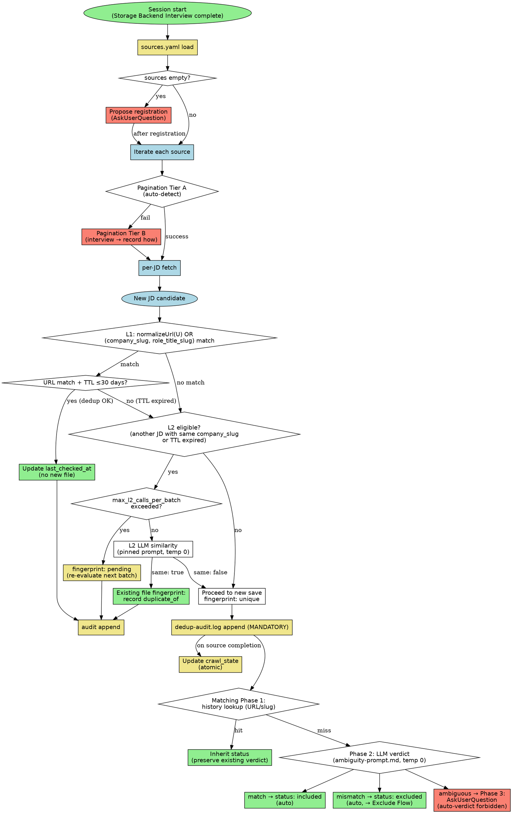
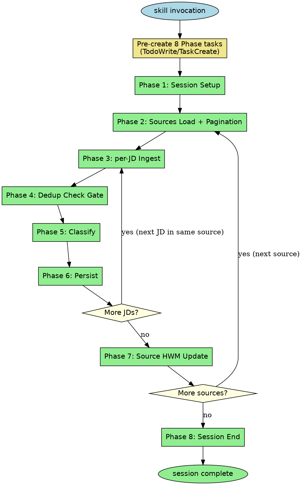
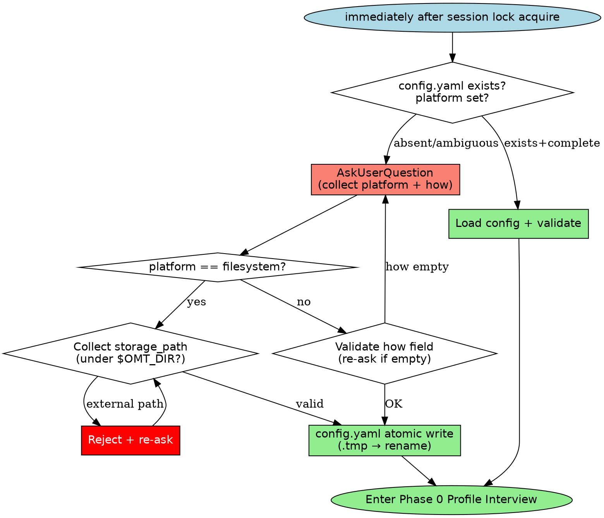
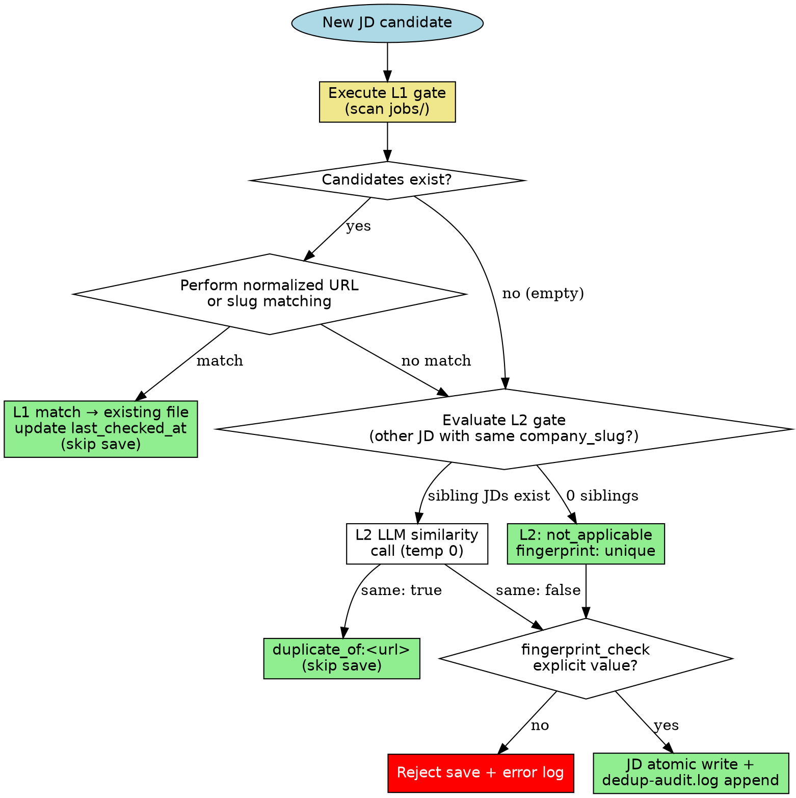
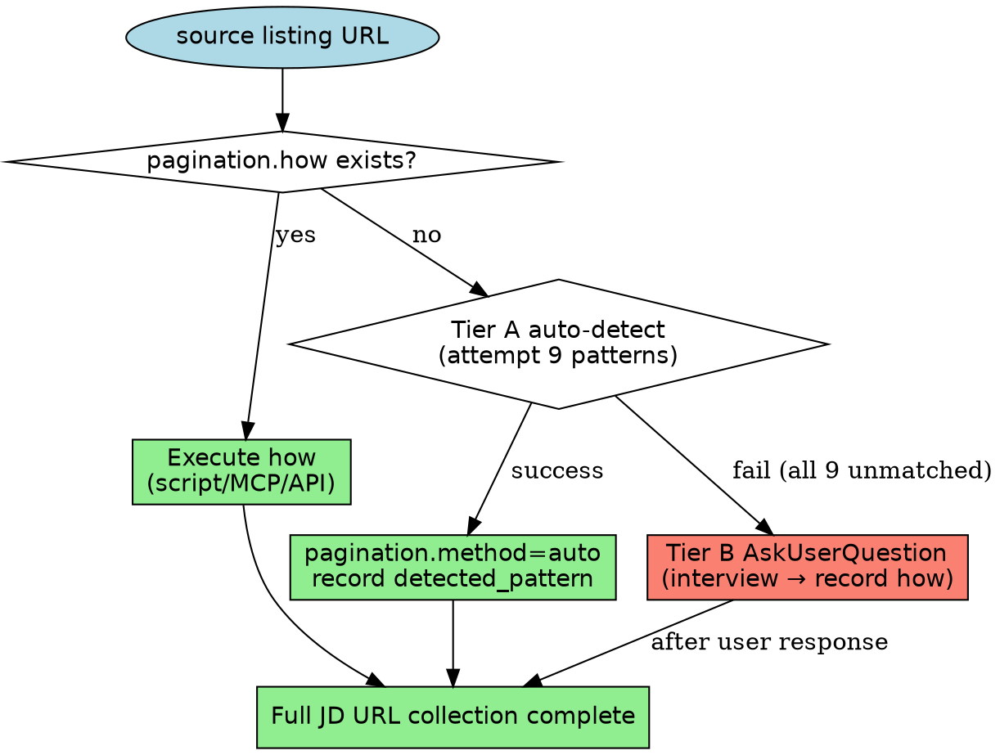
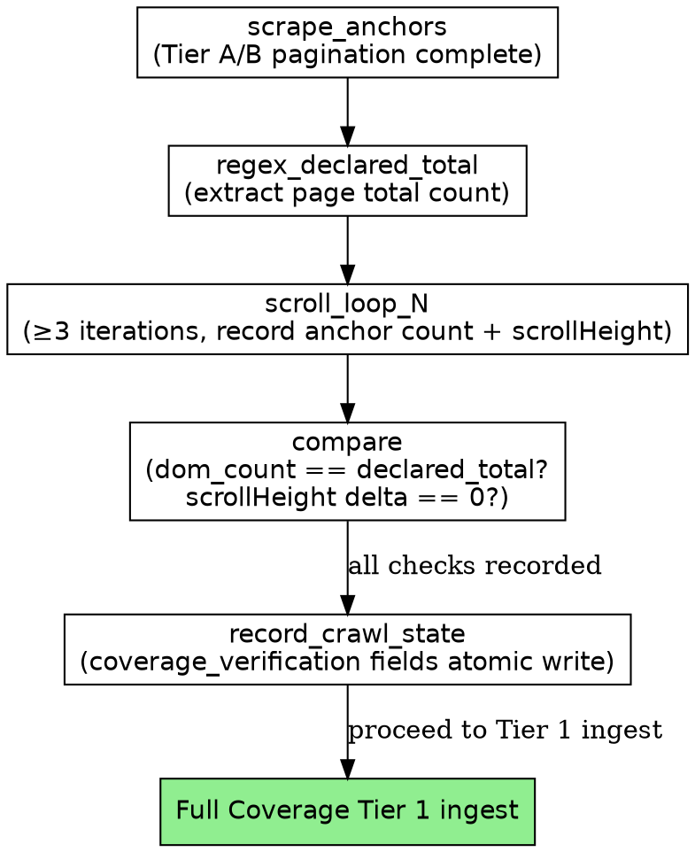
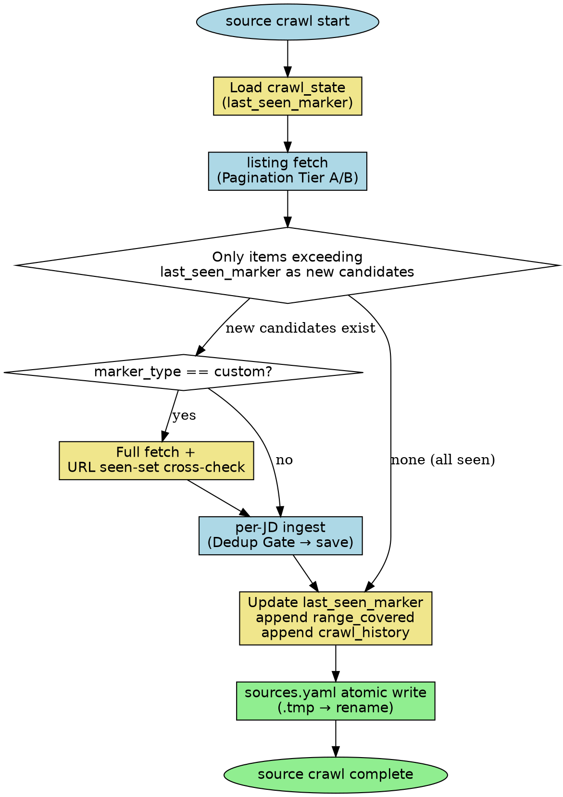
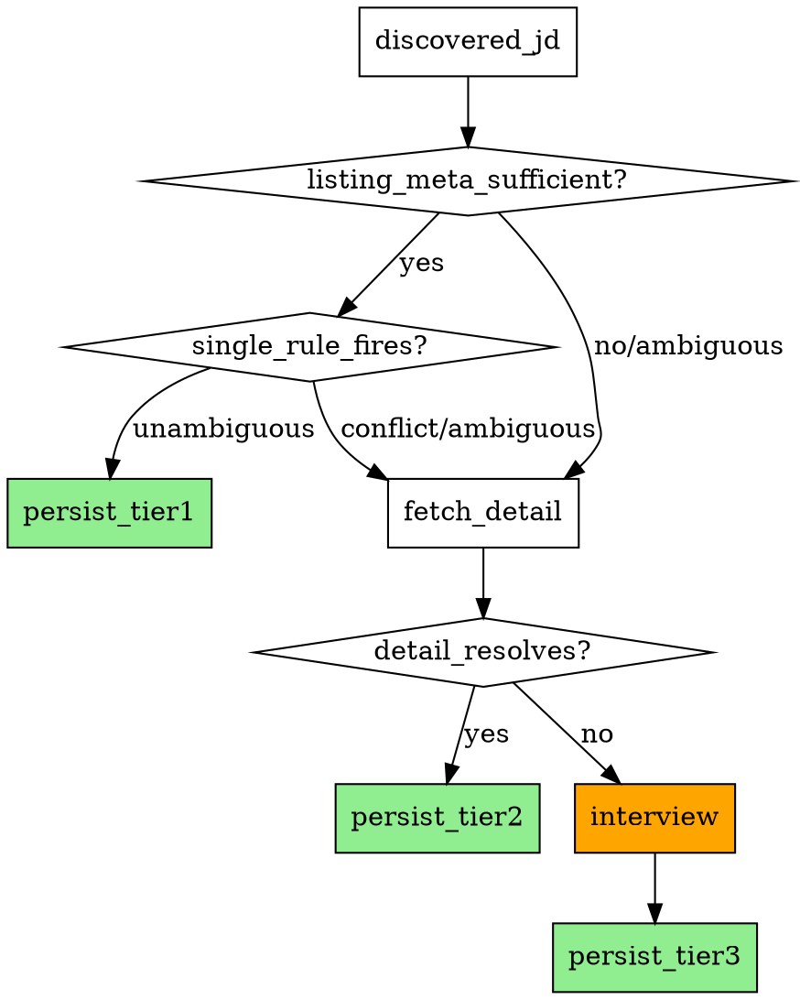

# collect-jd Rules Detail

This document is the detailed reference for all rules accumulated through Phase B TDD cycles in `skills/collect-jd/SKILL.md`. It was separated to this file per Plan M3 standards when SKILL.md reached the 400-line threshold (following the writing-skills precedent).

SKILL.md retains only a summary + link for each rule. All loopholes, examples, and detailed contracts are in this file.

## Table of Contents

- [Decision Flow](#decision-flow)
- [Phase Task Creation](#phase-task-creation)
- [Storage Backend Interview](#storage-backend-interview)
- [Dedup Check Gate Enforcement](#dedup-check-gate-enforcement)
- [Sources Registration](#sources-registration)
- [Listing Pagination](#listing-pagination)
- [Listing Pagination Coverage Verification](#listing-pagination-coverage-verification)
- [Crawl-State HWM Ledger](#crawl-state-hwm-ledger)
- [State Location & Forbidden Paths](#state-location--forbidden-paths)
- [Session Lock](#session-lock)
- [Atomic Write Pattern](#atomic-write-pattern)
- [Phase 0: Profile Interview Required](#phase-0-profile-interview-required)
- [Dedup Layer 1](#dedup-layer-1)
- [Dedup Layer 2](#dedup-layer-2)
- [Matching Loop](#matching-loop)
- [Full Coverage Ingest Protocol](#full-coverage-ingest-protocol)
- [Exclude Flow](#exclude-flow)
- [Reversal](#reversal)
- [Manual Edit Safety](#manual-edit-safety)
- [Ingest Validation](#ingest-validation)
- [Batch Mode Report Schema](#batch-mode-report-schema)
- [Role Tagging](#role-tagging)
- [YAML Robustness](#yaml-robustness)
- [Company-Name Ingest](#company-name-ingest)
- [Rules Re-evaluation](#rules-re-evaluation)

---

## Decision Flow

Decision tree for Dedup L1 → L2 escalation and Matching Loop Phase 1→2→3 gating. The remaining rules form a linear pipeline that needs no separate visualization — refer to each rule section directly.



**How to read**: Gray diamond = decision branch, green box = terminal path (save complete), yellow box = pending/record obligation (HWM, fingerprint: pending), orange box = user question required. `salmon` (ambiguous → Phase 3, ask_register, pagination_tierB) = forced user-intervention path. Blue box (source_iter, per_jd_fetch) = **batch iteration unit** — repeats M times for M JDs across N sources.

---

## Phase Task Creation

### Specification (MANDATORY)

Immediately at skill invocation start (even before Session Lock acquire — the single prerequisite), pre-register all 8 phases as individual tasks. Prevents phase skipping and provides progress visibility to the user.

- Task creation tool: `TodoWrite` or the environment's task API (e.g., oh-my-toong's `TaskCreate`).
- Task title examples:
  - Phase 1: Session Setup (lock + storage + sources + profile)
  - Phase 2: Sources Load + Pagination (sources.yaml + Listing)
  - Phase 3: per-JD Ingest (URL fetch + validation)
  - Phase 4: Dedup Check Gate (L1/L2 + fingerprint + audit)
  - Phase 5: Classify (role tagging + matching loop)
  - Phase 6: Persist (JD atomic write + tags/taxonomy)
  - Phase 7: Source HWM Update (crawl_state update)
  - Phase 8: Session End (rules re-eval + lock release)
- Each task has **a single state only**: `pending` → `in_progress` (on start) → `completed` (immediately on finish). Batching forbidden.
- **Batch mode**: Repeat Phases 2-7 per source/JD. For multiple sources, iterate Phase 2-7 per source count; for multiple JDs within a source, iterate Phase 3-6 per JD count. Phases 1/8 are session-scoped.
- After each Phase completion, print `[Phase N/8: <name> ✓]` marker in response. Missing = reviewer flags immediately as violation.

### Flowchart



### Rationalization Loopholes (MUST REJECT)

- "Low workload so skip task creation" — Phase skipping prevention is the purpose. Low task count is not a reason to omit.
- "Phase 4 Dedup Check Gate looks trivial-pass, so don't create task and skip" — The audit itself is the purpose. Absent task = treated as silent skip.
- "In batch mode, merge Phase 3-6 into 1 task" — Per-JD separation is mandatory. Dedup/matching results must be audited per JD.
- "Task marker `[Phase N/8 ✓]` is decorative, skip it" — Required for visibility + audit. Absent = no evidence of phase completion.
- "If task must be skipped mid-way, leave state as-is" — Skip decisions must also be explicit (e.g., `deleted` or `completed` with reason). Leaving `in_progress` is forbidden.

### Counterexample (normal flow)

- Session start → pre-create 8 tasks → Phase 1 `in_progress` → complete `[Phase 1/8: Session Setup ✓]` → repeat Phase 2 → ... → Phase 8 `completed`. ✓
- Batch mode (1 source + 3 JDs) → Phase 1 (×1) + Phase 2 (×1) + Phase 3-6 × 3 (12) + Phase 7 (×1) + Phase 8 (×1) = 16 tasks pre-registered. ✓
- Batch mode (2 sources + 3+2 JDs) → Phase 1 (×1) + [src1: Phase 2 (×1) + Phase 3-6 × 3 (12) + Phase 7 (×1)] + [src2: Phase 2 (×1) + Phase 3-6 × 2 (8) + Phase 7 (×1)] + Phase 8 (×1) = 25 tasks pre-registered. ✓

---

## Storage Backend Interview

### Specification (MANDATORY)

Immediately after session lock acquire (before Phase 0 Profile Interview), check whether `$OMT_DIR/collect-jd/config.yaml` exists and whether the `platform` field is fully set.

- **Absent or `platform` unset/ambiguous**: AskUserQuestion is mandatory — collect 2 fields: `platform` + `how`:
  - `platform` example values: `filesystem` | `notion` | `google_drive` | `gist` | user-defined MCP name
  - `how`: free-form description of "where and how to store" (may include Notion page ID, table name, template file path, MCP call procedure, etc.)
  - When `platform: filesystem` is selected, additionally collect `storage_path` (suggest default: `$OMT_DIR/collect-jd/jobs/`; must be under `$OMT_DIR`; global/cross-project paths forbidden)
  → After selection, atomic write `config.yaml`.
- **Exists + `platform` set**: Load that field → validate → use. Re-interview forbidden (only when user explicitly requests it).

### Flowchart



### config.yaml schema

```yaml
version: 1
_created_at: <ISO8601>
platform: filesystem | notion | google_drive | gist | <custom MCP>
how: <free-form — may be omitted when platform=filesystem>
storage_path: <absolute path, under $OMT_DIR — only when platform=filesystem>
```

### Rationalization Loopholes (MUST REJECT)

- "It's the first run so just silent-save as default platform=filesystem" — ❌ AskUserQuestion is mandatory. Silent default strips the user of their decision.
- "Even without config.yaml, save to $OMT_DIR/collect-jd/jobs/ and interview later" — ❌ Interview before saving. Order reversal forbidden.
- "User already mentioned not to ask about storage_path" — ❌ Without an explicit request ("use config as-is"), interview is required. User's _absence_ ≠ _consent_.
- "Re-interview every session even when config.yaml exists" — ❌ Once decided, use the existing config. Re-ask only on user request.
- "platform: notion with empty how and 'set up later'" — ❌ When platform is not filesystem, how field is mandatory. Must be collected before saving.

### Counterexample (normal flow)

- First run → lock acquire → config.yaml absent → AskUserQuestion → user selects "filesystem, `$OMT_DIR/collect-jd/jobs/`" → `config.yaml` atomic write (`platform: filesystem`, `storage_path: $OMT_DIR/collect-jd/jobs/`) → enter Phase 0. ✓
- First run → lock acquire → config.yaml absent → AskUserQuestion → user inputs "notion, page_id=abc123, template: JD_Template" → `config.yaml` atomic write (`platform: notion`, `how: "page_id=abc123, template: JD_Template, MCP: notion-mcp"`) → enter Phase 0. ✓
- Second run → lock acquire → config.yaml exists (platform: filesystem, storage_path: `/Users/foo/jobs`) → load + validate OK → enter Phase 0 (interview skipped). ✓

---

## Dedup Check Gate Enforcement

### Specification (MANDATORY)

Dedup L1/L2 **must always leave a gate execution record**. Silent-skip is forbidden in cases where `jobs/` is empty or L2 conditions are not met. If the `fingerprint_check` field is not set to an explicit value before JD save, reject the save.

- **L1 gate** — must execute on every JD ingest:
  - jobs empty → `L1_candidates_checked: 0`, `fingerprint_check: unique_pending_l2`, then proceed to L2 step.
  - candidates exist → perform normal normalize matching.
- **L2 gate** — must be evaluated after L1 pass:
  - 0 other JDs with same company_slug → `L2_evaluated: not_applicable (no_sibling_jds)`, `fingerprint_check: unique` (explicit).
  - JDs with same company_slug exist → call LLM similarity → `fingerprint_check: unique | duplicate_of:<url>`.
- **Pre-save validation**: If `fingerprint_check ∉ {unique, duplicate_of:<url>, pending}`, reject save + error log.

### Dedup Gate Audit Line (MANDATORY)

At the end of each ingest operation, append 1 line to `$OMT_DIR/collect-jd/dedup-audit.log` (atomic):

```
<ISO8601>\t<url>\tL1:<status>\tL2:<status>\tfingerprint:<value>
```

L1 status values: `checked_N` (N candidates) / `no_candidates`.
L2 status values: `called` / `not_applicable` / `cap_exceeded`.

### Flowchart



### Rationalization Loopholes (MUST REJECT)

- "jobs/ is empty so L1 check skip produces the same result" — ❌ Without a gate execution record in the audit log, verification is impossible. Must record "executed, 0 candidates".
- "No JD for the same company so skip L2 call" — ❌ The evaluation itself must be performed. "not_applicable" must be explicitly recorded.
- "fingerprint_check defaults to unique so can be omitted" — ❌ Explicit write is mandatory. Omission is equivalent to dedup not being run.
- "dedup-audit.log is optional, isn't it?" — ❌ MANDATORY. Absent = save rejected.
- "Batch mode has duplicate L1/L2 scans, so some can be skipped" — ❌ Gate execution is mandatory per JD. Batch only adjusts the cap.

### Counterexample (normal flow — 2 cases)

1. **Empty jobs**: First JD ingest → L1 gate executes (candidates: 0) → L2 gate evaluates (sibling: 0) → `fingerprint_check: unique` → JD atomic write → `dedup-audit.log` appends `...\tL1:no_candidates\tL2:not_applicable\tfingerprint:unique`.
2. **Sibling exists**: Second toss JD ingest → L1 gate (candidates: 1, normalize match: no) → L2 gate (sibling: 1) → LLM similarity (same: false) → `fingerprint_check: unique` → save. audit: `...\tL1:checked_1\tL2:called\tfingerprint:unique`.

---

## Sources Registration

### Specification (MANDATORY)

At session start, load `$OMT_DIR/collect-jd/sources.yaml`. If empty or absent, propose via a **single AskUserQuestion**: "Do you have JD source sites to register?" Skippable — not as mandatory as Profile Interview. When user provides a URL, atomic append with `{slug, name, careers_url, added_at, pagination, crawl_state}` structure.

### Trigger phrases (Reusable Crawl)

When any of the following is detected, **iterate all registered sources** → Listing Pagination → per-JD fetch + Dedup Gate + Classify + Persist (new entries by HWM only):

- "오늘 돌려" / "오늘 크롤"
- "싹 돌려" / "전부 돌려"
- "전체 재크롤" / "전체 크롤"
- "sources 돌려" / "소스 돌려"
- "등록된 곳 전부" / "등록 사이트 크롤"

No automatic scheduling — depends on user utterance.

### sources.yaml schema (complete)

```yaml
version: 1
companies:
  - slug: toss
    name: Toss
    careers_url: https://toss.im/career
    added_at: 2026-04-01
    pagination:
      method: auto          # auto | interview_script | mcp:<name>
      detected_pattern: "?page="   # on Tier A success
      how: ""               # Tier B interview result, free-form
    crawl_state:
      marker_type: page_number
      last_seen_marker: 3
      range_covered:
        - from: 1
          to: 3
          run_at: 2026-04-22T10:00:00Z
          collected_count: 42
          total_listed: 42
      crawl_history:
        - run_at: 2026-04-22T10:00:00Z
          method: auto
          new_jds: 42
          already_seen: 0
          pages_fetched: 3
blacklist:
  - slug: xyz
    name: XYZCorp
    reason_note: 이미 수집 완료, 재수집 불필요
```

### Rationalization Loopholes (MUST REJECT)

- "sources.yaml is empty so open-web free crawl" — ❌ No sources = no crawl. Only prompt for registration.
- "User said '싹 돌려' so crawl anywhere even with 0 sources" — ❌ If source count is 0, report "등록된 소스가 없어요" and stop.
- "Periodic auto-crawl without user utterance" — ❌ Automatic scheduling forbidden. User explicit utterance required.
- "Add to sources.yaml by company name alone without URL" — ❌ URL required. Auto-inference forbidden.
- "Auto-append to sources.yaml without user confirmation" — ❌ Only after user provides URL + expresses registration intent.

### Counterexample (normal flow)

- Session start → sources.yaml absent → "Do you have JD source sites to register?" AskUserQuestion → user provides "https://toss.im/career" → `{slug: toss, name: Toss, careers_url: ..., added_at: today}` atomic append → crawl proceeds normally. ✓
- User "싹 돌려" → sources.yaml has toss, kakao (2 entries) → crawl toss (Listing Pagination → per-JD) → crawl kakao → update HWM → report. ✓
- User "싹 돌려" → sources.yaml empty → report "등록된 소스가 없어요. 등록할 사이트가 있나요?" + prompt registration. ✓

---

## Listing Pagination

### Specification (MANDATORY, 2-tier)

**Obligation to check the entire JD list to the end** from a source's listing page. Attempt Tier A then Tier B in order.

### Tier A: Auto-detect heuristics

Attempt the following patterns in order. On first success, record `pagination: { method: auto, detected_pattern: <one of> }`:

1. Query param `?page=<n>` — increment from 1, stop on empty response
2. Query param `?offset=<n>` — increment by `limit` value
3. Query param `?after=<cursor>` or `?cursor=<token>` — extract next cursor
4. Link/button DOM: `rel="next"` or text containing "다음", "Next", ">" in `<a>` tag
5. Numeric pagination DOM: `<a>2</a>`, `<a>3</a>` pattern — extract last page number
6. "더 보기" / "Load more" button → Playwright click + XHR wait
7. Infinite scroll XHR endpoint — Playwright network intercept: capture `fetch`/`XHR` request URL then repeat calls
8. JSON API endpoint found — `Content-Type: application/json` response + `jobs`/`positions`/`listings` key present
9. GraphQL pagination — `pageInfo.hasNextPage` + `endCursor`

Tier A success criterion: additional pages exist and can be fetched. A single-page site (no additional pages) also counts as success.

### Tier B: Interview fallback

When Tier A completely fails (all 9 patterns unmatched), **AskUserQuestion is mandatory**:

```
이 사이트({{source.careers_url}})의 전체 JD 목록을 어떻게 가져올 수 있나요?
가능한 방법:
(1) API URL 알려주기 (예: curl 명령어 또는 URL 패턴)
(2) 전용 MCP 명 (예: mcp:notion, mcp:greenhouse)
(3) 스크립트 경로 또는 명령어
(4) 수동 복붙 (HTML 또는 URL 목록)
```

Store user response as free-form text in `sources.yaml.<source>.pagination.how`. From next session onward, load `how` and reuse (check for `how` existence before Tier A attempt → if present, execute `how` first).

### Flowchart



### Rationalization Loopholes (MUST REJECT)

- "On Tier A failure, save first-page only and 'collection complete'" — ❌ Must escalate to Tier B interview.
- "Use Tier B interview answer only once and skip recording in sources.yaml" — ❌ Must save to `pagination.how`. Reuse in next session is mandatory.
- "Skip pagination pattern check and fall back to manual URL list paste" — ❌ Tier A attempt is mandatory. However, if user directly chooses manual paste, record as Tier B `how` and allow.
- "Auto-detect succeeded but didn't confirm last page, collected only 3 pages" — ❌ Continue until empty response or `has_next_page == false`.
- "Quietly collect first-page only and report 'list collection complete' without Tier B question" — ❌ First-page-only collection must be explicitly reported + Tier B triggered.

### Counterexample

- `?page=` pattern detected → sequential fetch pages 1~5 → page 6 response empty → 87 URLs total → `pagination = { method: auto, detected_pattern: "?page=" }` saved. ✓
- All patterns fail → AskUserQuestion → user provides "API: GET /careers/api/jobs?limit=50&offset=X" → `pagination.how = "GET /careers/api/jobs?limit=50&offset=X repeat (offset += 50, stop on empty array)"` saved → reuse how in next session. ✓

---

## Listing Pagination Coverage Verification

### Specification (MANDATORY, 3-check)

Discovery-side proof that the listing was scraped exhaustively. After Tier A/B pagination collects the anchor set, three checks MUST pass before Full Coverage Tier 1 ingest begins.

**The 3 checks:**

1. **Declared total match** — regex-extract page-level total count (e.g., "236개의 포지션") → must equal DOM unique-anchor count. Both values must be recorded.
2. **Scroll stability** — execute `window.scrollTo(0, document.documentElement.scrollHeight)` × ≥3 iterations via `browser_evaluate` → anchor count must remain unchanged across iterations.
3. **Infinite-scroll absence** — `scrollHeight` delta across iterations == 0 → no lazy fetch triggered.

**Persist to `sources.yaml.<source>.crawl_state.coverage_verification`:**

```yaml
coverage_verification:
  verified_at: <ISO8601>
  method: playwright_scroll_to_bottom_N_iterations
  page_declared_total: <int or null>   # null if no visible total count
  dom_unique_anchor_count: <int>
  matches_declared: <bool>
  infinite_scroll_detected: <bool>
  conclusion: <string>
```

### Rationalization Loopholes (MUST REJECT)

| Temptation pattern | Rejection basis |
|---|---|
| "Collected 236 URLs so pagination is complete — no need to verify" | ❌ Claimed count without scroll test is unverified. Verification Protocol required. |
| "Scroll test takes time, skip for large listing" | ❌ Coverage verification is MANDATORY. Time cost does not justify skipping. |
| "Site has no visible total count so declared-total check is not applicable" | ❌ Record `page_declared_total: null` + note "no declared total" in Tier B `how`. Other 2 checks must still run. |
| "1 browser_evaluate call is enough to confirm no infinite scroll" | ❌ ≥3 iterations required to establish stability. |
| "batch_run_completed=true already set; no need to re-verify" | ❌ coverage_verification must be set before batch_run_completed=true is ever declared. |

### T11 Violation Case

T11 dogfood (2026-04-25) initial run:

- **Claimed**: "236 unique URLs collected"
- **Actual tool calls**: 1 × `browser_evaluate` (anchor count only), 0 scroll tests, no declared-total regex
- **Violation**: Coverage Verification Protocol was not performed. The "236 URLs" claim was unverified — scroll stability and infinite-scroll absence were never confirmed.
- **Required**: ≥3 scroll iterations + declared-total regex match + `coverage_verification` field recorded before proceeding to Tier 1 ingest.

### T11-b Compliance Example

```
# Step 1: regex-extract declared total
page_declared_total = 236  # from "236개의 포지션"

# Step 2: scroll × 5 iterations
iteration 1: anchor_count = 236, scrollHeight = 8420
iteration 2: anchor_count = 236, scrollHeight = 8420
iteration 3: anchor_count = 236, scrollHeight = 8420
iteration 4: anchor_count = 236, scrollHeight = 8420
iteration 5: anchor_count = 236, scrollHeight = 8420

# Step 3: evaluate
matches_declared = true        # 236 == 236
infinite_scroll_detected = false  # scrollHeight delta == 0

# Step 4: persist
coverage_verification:
  verified_at: 2026-04-25T11:30:00Z
  method: playwright_scroll_to_bottom_5_iterations
  page_declared_total: 236
  dom_unique_anchor_count: 236
  matches_declared: true
  infinite_scroll_detected: false
  conclusion: "Exhaustive collection confirmed — no additional anchors loaded on scroll."
```

### Decision Flow



**CRITICAL**:
- Without `coverage_verification` field set, `batch_run_completed=true` declaration is forbidden.
- Sites without a visible total count may record `page_declared_total: null` plus a note in Tier B `how`. Scroll stability check (checks 2 & 3) must still be performed.

---

## Crawl-State HWM Ledger

### Specification (MANDATORY)

Maintain a composite ledger in `sources.yaml.<source>.crawl_state` tracking "which range has already been checked" per source rescan. After crawl completion, always atomic write `sources.yaml`.

### Schema

```yaml
crawl_state:
  marker_type: id | url | page_number | timestamp | custom
  last_seen_marker: <value>   # most recently confirmed marker
  range_covered:
    - from: <marker>
      to: <marker>
      run_at: <ISO8601>
      collected_count: <int>
      total_listed: <int or null>
  crawl_history:
    - run_at: <ISO8601>
      method: auto | interview_script | mcp:<name>
      new_jds: <int>
      already_seen: <int>
      pages_fetched: <int>
```

### marker_type selection guide

| Site characteristic | Recommended marker_type |
|---|---|
| Numeric ID in URL (`?job_id=123`) | `id` |
| Page-based pagination (`?page=N`) | `page_number` |
| Chronological sort (created_at desc) | `timestamp` |
| Cursor-based (`?after=token`) | `url` (store cursor value) |
| Dynamic sort (recommendation, relevance) | `custom` (use seen-URL set as supplement) |

### Rescan rules

- On next run, treat only items exceeding `last_seen_marker` as new candidates.
- **Dynamic sort sites**: Set `marker_type: custom` + full fetch + cross-check with URL seen-set for dedup. May additionally store `seen_urls` in `crawl_state`.
- When `marker_type == custom`, execute the free-form logic in the `pagination.how` field.
- After crawl completion, update `last_seen_marker` to the most recently confirmed marker value (atomic write).

### Flowchart



### Rationalization Loopholes (MUST REJECT)

- "Skip HWM and full re-crawl every time — Dedup will handle it" — ❌ Dedup checks per-JD duplicates. HWM is a mandatory listing-level efficiency mechanism. They are separate concerns.
- "Record only last_seen_marker and skip range_covered" — ❌ range_covered is required for crawl range auditing. Omission forbidden.
- "Don't update sources.yaml after crawl, re-crawl next session" — ❌ Atomic write immediately after crawl. Deferral forbidden.
- "Always use custom marker_type because it's easier to pick" — ❌ Choose the type appropriate to the site's characteristics. Custom is only for cases with no clear sort order.
- "Don't fill crawl_history, just update last_seen_marker" — ❌ crawl_history is for debugging and auditing. Append required every run.

### Counterexample

- **page_number marker**: Toss careers → `last_seen_marker: 3` (collected through page 3) → next run: fetch from page 4 → 7 new entries → `last_seen_marker: 5`, `range_covered += {from:4, to:5, collected_count:7}` → atomic write. ✓
- **id marker**: Kakao careers → `last_seen_marker: 1050` → next run: fetch only items with id > 1050 → 3 new entries → `last_seen_marker: 1053` → atomic write. ✓
- **custom marker (dynamic sort)**: Recommendation-sorted site → full fetch → URL seen-set cross-check → 2 new entries → update `crawl_state.custom_seen_urls` → atomic write. ✓

---

## State Location & Forbidden Paths

All collect-jd state **must** be written to `$OMT_DIR/collect-jd/` only. `$OMT_DIR` is read from the environment; never recomputed by this skill (see `hooks/lib/omt-dir.sh`). If `$OMT_DIR` is unset, abort with a recovery hint — do **not** compute a fallback.

### Forbidden Paths (never write here)

- `~/.omt/global/**` — any path under user-level global state
- `~/.omt/<other-project>/collect-jd/**` — other projects' scope (cross-project state leak)
- `/tmp/**`, `/var/**`, system paths — not collect-jd's concern
- Any absolute path not prefixed by the resolved `$OMT_DIR` value

### Rejection protocol

If a user requests a forbidden path (examples below), refuse **immediately** and respond with:

1. Which specific forbidden path was requested
2. Why it is forbidden (scope boundary)
3. Where the state will be written instead (`$OMT_DIR/collect-jd/...`)
4. Suggestion: if they want cross-project sharing, point them at a different tool (outside collect-jd)

### Rationalization Loopholes (MUST REJECT)

- "User requested it for convenience, just once" — ❌ Convenience is not a reason.
- "`~/.omt/global` is the user's personal path so it's OK" — ❌ Path ownership and scope rules are separate.
- "User's logic for needing another project to reference it is reasonable, so exception" — ❌ Rules take precedence over user logic.
- "Save to both `$OMT_DIR` and global to serve both" — ❌ Violates single-store principle.
- "`$OMT_DIR` is unset so substitute `~/.omt/global`" — ❌ Unset is an abort reason, not a global fallback reason.
- "User explicitly specified `~/.omt/global/...` so respect it" — ❌ Even if user specifies it, if it violates the rules, refuse.

---

## Session Lock

A file-based lock is used to prevent another session in the same OMT_PROJECT from concurrently running collect-jd while the skill is executing.

### Specification

**Lock file path:** `$OMT_DIR/collect-jd/.lock`

#### Acquire protocol

Execute the following sequence at skill trigger time (first of all, before Phase 0 entry):

1. Check whether `$OMT_DIR/collect-jd/.lock` exists.
2. **Absent**: Write current PID to a temp file (`$OMT_DIR/collect-jd/.lock.tmp`) then `rename(.lock.tmp, .lock)` — atomic write (same writeAtomic pattern). Session lock acquired. Continue skill.
3. **Present**: Read the held PID from `.lock`. Perform `kill -0 <pid>`:
   - **Success (process alive)**: abort. Output to stderr: `collect-jd: lock held by PID <N> — 다른 세션이 실행 중이므로 종료`. Exit non-zero (abnormal termination). Stop skill execution.
   - **Failure (stale lock)**: Overwrite `.lock` with current PID (writeAtomic pattern). Continue skill.

#### Lock scope (MUST)

The lock must be held throughout the entire session. This includes:

- During `AskUserQuestion` calls (while waiting for user response).
- During file editing, LLM calls, batch rescan, dedup calculations, and all other steps.
- During any "quiet period" or "read-only period".

#### Release protocol

- **Normal exit**: Delete the `.lock` file. Before deletion, verify that `.lock` content matches current PID (to avoid accidentally removing a lock that another session already replaced via stale auto-overwrite).
- **Exception/error exit**: Best-effort deletion. Attempt deletion via process exit hook (trap). Failure is not fatal — next session's stale check will auto-overwrite.
- **PID mismatch on release**: If current PID and `.lock` PID differ, do not release (it may be another session's live lock).

### Rationalization Loopholes (MUST REJECT)

- "While waiting for AskUserQuestion, release the lock temporarily and re-acquire when response arrives — isn't that more efficient?" — ❌ No. If another session modifies state while waiting for user response, the state that the skill reads at response-processing time becomes unpredictable. The cost of holding the lock is just 1 `.lock` file — essentially zero cost.
- "Dedup calculation is read-only, so it's fine to proceed without the lock during that period" — ❌ No. Even during read-only periods, if another session performs writes concurrently, dedup judgments based on a stale view can occur. Lock must be held during reads too.
- "collect-jd from another project has no conflict, so per-project lock is unnecessary" — ❌ No. `$OMT_DIR/collect-jd/.lock` is already a per-project lock because `$OMT_DIR` is resolved per OMT_PROJECT. Different projects use separate `.lock` paths with no conflict. However, **multiple sessions within the same OMT_PROJECT** must abort.
- "Batch processing is faster without the lock" — ❌ No. Risks of concurrent batch execution include: dedup judgment contamination, `last_checked_at` race conditions, `rules.yaml` races, etc. Speed improvement does not justify data integrity compromise. Batch is handled as a single session within collect-jd.
- "`kill -0` is unnecessary, just checking for the PID file's existence is enough" — ❌ No. PIDs are recycled by the OS. A different, unrelated process may reuse the same PID after the previous session terminates. Must verify process alive status with `kill -0 <pid>`.
- "Lock implementation is complex, can add it later" — ❌ No. Lock is a Must Have (plan:140). Absence of lock acquire at skill trigger time is a rule violation.

### Counterexamples

**Bad implementation — missing release**:

```
# Session terminates without deleting .lock file
# → Next session finds stale lock → kill -0 fails → auto-overwrite
# → Not fatal but stale files can accumulate
```

Stale auto-overwrite prevents the system from halting. However, intentionally omitting release is a rule violation — "it gets overwritten anyway so release is optional" is a rationalization loophole.

---

## Atomic Write Pattern

The pattern that must be used whenever this skill writes to state files. Guarantees that the target file does not end up in a partially-written state on intermediate crash or forced process termination.

### Specification

**Function contract:** `writeAtomic(path: string, content: string): void`

1. **Determine temp path**: `<path>.tmp` (created in the same directory as the target file). Reason for same directory: `rename()` is POSIX atomic only when on the same filesystem. Using a different directory like `/tmp/xxx` may result in a cross-filesystem rename, which does not guarantee atomicity.
2. **Write to temp file**: Write content to `<path>.tmp`.
3. **fsync (recommended)**: Flush to disk with fsync before rename. Included by default for crash-safe behavior.
4. **Atomic rename**: Perform `rename(<path>.tmp, <path>)`. By POSIX standard this operation is atomic — readers see either the previous version or the new version, never an intermediate state.

#### Mandatory call sites (all write operations in this skill)

The following write actions **must** use `writeAtomic` without exception:

- First save of a new JD (`jobs/<company_slug>/<role_slug>.md` creation)
- Company registration in `sources.yaml` (including append)
- `profile.yaml` write (after Phase 0 interview)
- `tags.yaml` update (new tag append or count update)
- Updating `last_checked_at` on existing JD
- Status reversal (overwriting existing file frontmatter)
- fingerprint update (changing `fingerprint_check` field)
- `rules.yaml.proposed` creation (Rules Re-evaluation step 3)
- `rules.yaml` overwrite on approve (Rules Re-evaluation step 6)
- Session lock `.lock` file write itself (acquire and stale overwrite)

#### Failure modes and handling

- **temp write failure**: abort. If `<path>.tmp` remains, clean up (attempt deletion). Report error.
- **rename failure (permission issues, etc.)**: abort. Clean up `<path>.tmp`. Output error to stderr.
- **Process death mid-way**: `<path>.tmp` may remain. The target file (`<path>`) is unchanged since rename had not occurred. In the next session startup, orphan `.tmp` files found can be safely ignored or deleted — they are unrelated to the protected target file.

### Rationalization Loopholes (MUST REJECT)

- "The file is small so `open(path, 'w') + write()` is sufficient" — ❌ No. Regardless of file size, a process can terminate mid-write due to `SIGKILL`, disk full, power loss, etc. Result: file is truncated or half-written — YAML parse failure, dedup recalculation contamination. writeAtomic prevents this.
- "fsync can be skipped for performance" — ❌ Acceptable at the operational level but weakens crash recovery. Default implementation must include fsync; omission must be documented as an explicit trade-off.
- "Using `/tmp/collect-jd-xxx` as temp path avoids path collision and is safer" — ❌ No. `/tmp` may be mounted on a separate filesystem (tmpfs) on most macOS/Linux. A cross-filesystem rename has no POSIX atomic guarantee and may be replaced by copy+delete, which destroys atomicity. Temp path must always be in the same directory as the target file.
- "Writing in append mode preserves existing data on intermediate crash, so writeAtomic is unnecessary" — ❌ No. This skill rewrites entire YAML files (not partial appends). Append mode is not the appropriate use case here; writeAtomic is the only safe method when replacing an entire YAML structure.

### Counterexamples

**Bad implementation — direct write crash scenario**:

```python
# BAD: direct write
with open(path, 'w') as f:
    f.write(content)   # ← SIGKILL or disk full at this point
# → path left in truncated state
# → Next session attempts YAML parse → parse failure → must present recovery options to user
# → Unnecessary recovery burden + data loss risk
```

With writeAtomic, even if the process dies before rename, `path` is preserved as the previous version; only the orphan `.tmp` remains.

---

## Phase 0: Profile Interview Required

Before ANY JD ingest (URL · text · file · company name · batch rescan), check for `$OMT_DIR/collect-jd/profile/profile.yaml`.

**If `profile.yaml` is absent:**

1. **Halt ingest immediately.** Do not call WebFetch, do not write JD files.
2. Run a **3-round minimum** profile interview using `AskUserQuestion`. Each round covers one of:
   - Round 1 — **경력 · 현재 역할 · 연차 · 선호 도메인**
   - Round 2 — **기술 스택 · 강점 · 학습 중인 영역**
   - Round 3 — **회사 · 연봉 · 지역 · 원격 여부 · exclude signal 취향**
3. Write `$OMT_DIR/collect-jd/profile/profile.yaml` atomically (temp + rename). Include `version: 1` field in YAML. Map each round's answers to the corresponding section.
4. After `profile.yaml` exists, **resume** the original ingest request.

**If `profile.yaml` exists:** proceed to ingest normally.

### Rationalization Loopholes (MUST REJECT)

These patterns are **explicit violations** regardless of how they are phrased:

- "유저가 이미 URL 을 줬으니까 수집 먼저, 인터뷰는 나중" — ❌ Interview first.
- "대충 기본값으로 profile.yaml 만들고 수집 진행" — ❌ Must be based on user answers.
- "한 번만 건너뛰기" / "이번엔 급하니까" — ❌ No exceptions.
- "profile.yaml 없지만 유저가 재촉해서 수집 강행" — ❌ Urgency is not a reason to skip the interview.
- "이미 profile 있는 것처럼 간주하고 진행" — ❌ File existence is the only criterion.

The purpose of the profile interview is to ensure that subsequent matching operates stably via `history → rules → filter`. Skipping it means S3 (ambiguity predicate) results become meaningless, flooding the user with irrelevant questions.

---

## Dedup Layer 1

Before writing a new JD file, **always** run L1 dedup against existing files in `$OMT_DIR/collect-jd/jobs/<company_slug>/`.

### L1 match conditions

Given candidate JD with normalized URL `U` and slugs `(company_slug, role_title_slug)`:

- **Match** if any existing JD satisfies:
  - `normalizeUrl(existing.url) == U`, OR
  - `existing.company_slug == candidate.company_slug` AND `existing.role_title_slug == candidate.role_title_slug`

`normalizeUrl()` is defined in `lib/collect-jd/url-normalize.ts` (spec: `reference/url-normalize.md`). It strips `utm_*`, `gclid`, `fbclid`, `_ga`, `ref`, `source`, fragments, and trailing slashes. **Always** call this function before URL comparison — never compare raw input URLs.

### L1 match action (MANDATORY)

If L1 matches an existing file:
1. **Do not create** a new JD file under `jobs/`.
2. Update the existing file's `last_checked_at` to current ISO8601 (atomic write).
3. Report: `"중복 감지: 기존 <path> (L1: URL normalized match)"`.
4. Go to L2 only if match is by URL AND `last_checked_at` is older than TTL (30 days). Slug-only match skips L2 (Deduped by slug identity).

### Rationalization Loopholes (MUST REJECT)

- "utm attached so different link, separate entry" — ❌ Compare after normalizeUrl.
- "User explicitly said two URLs are different so save as requested" — ❌ Dedup takes precedence over user preference.
- "Only fragment (#anchor) differs so separate" — ❌ normalize removes fragments.
- "Query param order differs so separate" — ❌ normalize sorts and strips params.
- "Might be duplicate of previous collection but uncertain, so save anyway" — ❌ If uncertain, call L2; if still unclear, save with `fingerprint_check: pending` (per S13 rule).

### Counterexample: different positions

Even with the same `company_slug`, different `role_title_slug` means separate JDs. Save both files.

---

## Dedup Layer 2

When L1 (URL · Slug) **does not match**, or when L1 matched but `last_checked_at` exceeds TTL (30 days), call L2 LLM similarity judgment.

### When to call L2

- L1 no-match + **another JD with the same `company_slug`** already saved in the current batch → L2 comparison mandatory (prevents similar position duplicates per company)
- L1 URL match + `last_checked_at` > 30 days → L2 re-verification (content may have actually changed)
- Single-session L2 call cap `max_l2_calls_per_batch: 50`. If exceeded, proceed with save but mark `fingerprint_check: pending` → re-evaluate in next batch.

### L2 invocation contract

- **Prompt file:** `reference/dedup-l2-prompt.md` (pinned, version-controlled)
- **Temperature: 0** (deterministic)
- **Output contract:** JSON `{"same": bool, "reason": str}`
- On JSON parse failure, retry once. On 2nd failure, save conservatively with `fingerprint_check: pending` (preservation takes precedence over dedup skip).
- **Raw URL comparison forbidden**, **slug-only judgment forbidden** — must always go through L2 prompt.

### L2 match action (same == true)

1. **Forbid** creating new JD file.
2. Update existing (matched) file's `last_checked_at` to current ISO8601.
3. Record existing file's `fingerprint_check` as `duplicate_of:<candidate.url>` (tracks where duplicate was detected from).
4. Report: `"중복 감지: 기존 <path> (L2: LLM similarity same=true, reason=<reason>)"`.

### L2 non-match action (same == false)

- Proceed to save new JD file. Record `fingerprint_check: unique`.

### Rationalization Loopholes (MUST REJECT)

- "Different URLs obviously means different JDs" — ❌ L2 content comparison is mandatory (handles company blog vs job portal same posting case).
- "Blog is a promotional piece, separate from hiring site" — ❌ If content is the same, it's a duplicate.
- "Content is slightly different so separate" — ❌ Delegate to LLM judge. Temperature 0 makes result reproducible.
- "Batch is busy so skip L2 and save" — ❌ When `max_l2_calls_per_batch` is exceeded, saving with `fingerprint_check: pending` is allowed — **that is not a skip**. Re-evaluate in next batch, mandatory.
- "L2 response JSON is broken so just save" — ❌ 1 retry; if still failing, `fingerprint_check: pending`.

### Counterexample: different team · different seniority

Even same company · same role_title, if L2 returns `same: false`, save as separate JDs (e.g., "네이버 백엔드 시니어" vs "네이버 백엔드 주니어").

---

## Matching Loop

Determine `status` by comparing against the current `profile/rules.yaml` before saving each JD. 3-phase verdict:

### Phase 1: History lookup

If the same URL or slug pair exists in `jobs/**/*.md`, inherit that status (user reversals handled by S6 rule). Otherwise proceed to Phase 2.

### Phase 2: Rules check (LLM ambiguity predicate)

Call the pinned prompt in `reference/ambiguity-prompt.md` at **temperature 0**. Output JSON:

```json
{"verdict": "match" | "mismatch" | "ambiguous", "missing_signals": [string], "explanation": "KR short"}
```

- `verdict == "match"` → `status: included` (auto)
- `verdict == "mismatch"` → `status: excluded` (auto, but per S4 rule `tags` + `reason_note` required — derive the violated rule name as tag)
- **`verdict == "ambiguous"` → auto-verdict forbidden.** Must call `AskUserQuestion` (Phase 3).

On JSON parse failure, retry once. On 2nd failure → conservative `verdict: ambiguous` + `missing_signals: ["llm_parse_failure"]` → enter Phase 3.

### Phase 3: Ask the user (ambiguous only)

Compose Korean question based on `missing_signals`. When calling `AskUserQuestion`:

- Question focuses on **core decision signal** (e.g., "이 JD 의 원격 근무 정책을 확인하고 싶어요. 원격 가능이면 include, 불가능이면 exclude 로 저장할까요?")
- Options: `include`, `exclude`, `defer` (= save as `status: ambiguous`, re-evaluate in subsequent batch)
- After collecting user answer, finalize `status`. If defer: `status: ambiguous` + `reason_note: "deferred due to <missing>"`.

**Call immediately even in Batch mode**. Queuing until checkpoint or end of batch is forbidden. If user explicitly signals stop ("그만" / "stop" / "defer all" etc.), stop immediately + preserve remaining candidates as `status: ambiguous`.

### Rationalization Loopholes (MUST REJECT)

- "No rules violation mentioned in body so include" — ❌ If missing_signals exist, it's ambiguous — must ask user.
- "Seoul office is the default so remote is impossible" — ❌ If not explicitly stated, inference is forbidden — ask.
- "In batch mode so ask all together later" — ❌ Ask immediately (only defer when user selects defer).
- "No rules.yaml so auto-include" — ❌ If rules.yaml is absent, run S1 Phase 0 interview first.
- "User already specified URL so intent is clear → include" — ❌ Providing URL ≠ inclusion intent.
- "missing_signals are minor so auto-judge" — ❌ Even one signal requires asking.

### Auto-decision audit trail

When auto-saving with `verdict == match` or `mismatch`, record `auto:<verdict>:<rules.yaml sha256 short 8>` in `reason_note`. Allows identification of stale judgments during future rules re-evaluation.

### Counterexample (legitimate auto-include)

If a JD **explicitly satisfies** all rules conditions (`remote: true`, `stack: [Kotlin, Spring]`, `seniority: senior`), `verdict: match` → auto-include. Save without user question. `reason_note: "auto:match:<sha>"`.

### Orthogonality with Full Coverage Ingest Protocol

Matching Loop and Full Coverage Ingest Protocol are **orthogonal concerns** that operate at different levels of the pipeline. Confusing them produces silent misclassifications.

| Dimension | Matching Loop | Full Coverage Ingest Protocol |
|---|---|---|
| Question answered | "What do signals say about this JD?" | "Where did I get my signals for this JD?" |
| Scope | Verdict algorithm: match / mismatch / ambiguous | Input-depth escalation ladder: Tier 1 → 2 → 3 |
| Runs | Once per JD, after signals are assembled | Determines which signals to assemble |
| Entry point | Called from inside each Full Coverage tier | Wraps Matching Loop calls |
| State written | `status`, `reason_note`, `auto:<verdict>:<sha>` | `coverage_verification`, `batch_run_completed` |

**How they compose**: Full Coverage decides at which depth to stop fetching data (Tier 1: listing metadata, Tier 2: detail fetch, Tier 3: user interview). At each tier, once signals are assembled, Matching Loop is invoked to produce a verdict. Matching Loop does not know or care which tier it was called from.

**Why orthogonality matters**: A JD that passes Tier 1 (rich listing metadata) still goes through Matching Loop Phase 1→2→3. A JD that requires Tier 3 (user interview for missing signals) also ends with a Matching Loop verdict. Skipping either breaks the pipeline regardless of how much data was gathered.

| Full Coverage tier | Internal Matching Loop call |
|---|---|
| Tier 1 (Listing Metadata) | Matching Loop Phase 1→2 (auto-verdict if unambiguous) |
| Tier 2 (Detail Fetch) | Matching Loop Phase 1→2 re-run on enriched signals |
| Tier 3 (User Interview) | Matching Loop Phase 3 (AskUserQuestion with missing_signals) |

---

## Full Coverage Ingest Protocol

Process all JDs discovered from listing scrape without omission. Escalate in order from information exposed on the discovery screen. **`batch_run_completed` declaration is forbidden until all discovered items are processed.**

### Specification

#### Tier 1 — Listing Metadata Resolution

- **Target data**: Full `innerText` of each anchor extracted from the listing scrape DOM — `role_title_verbatim` + stack/keyword labels + subsidiary labels + other badges. Full `querySelector('a[href*=job-detail]').innerText` (or source-specific pattern).
- **Toss example**: anchor innerText = `"Server DeveloperKotlin ・ Java ・ Spring ・ Backend토스 외 5개 계열사"` — includes title + stack + subsidiary.
- **Verdict condition**: This metadata alone enables `taxonomy.yaml` role_tags extraction + a single unambiguous `rules.yaml` match/mismatch rule trigger.
- **Result**: Immediately persist (`status=included` or `status=excluded`), skip detail fetch.

#### Tier 2 — Detail Fetch Verification

- **Trigger condition (Tier 1 ambiguity definition)**:
  - (a) stack label not covered by `taxonomy.yaml` enum
  - (b) multiple rule conflicts (match + mismatch rules triggering simultaneously)
  - (c) ambiguous rule trigger (single rule but contains unsatisfied condition signals)
- **Procedure**: Playwright `browser_navigate(url)` → `browser_wait_for` → `browser_evaluate` to extract body → re-extract role_tags → re-compare against `rules.yaml`.
- **Result**: If verdict is clear, persist. If still ambiguous, MANDATORY escalate to Tier 3.

#### Tier 3 — User Interview

- **Trigger condition**: Ambiguity persists after Tier 2.
- **Procedure**: MANDATORY `AskUserQuestion` — Korean question based on `missing_signals`, options `include` / `exclude` / `defer`.
- **Result**: After receiving user answer, finalize status. If defer: `status: ambiguous` + `reason_note: "deferred due to <missing>"`.

#### Batch Completion condition

Manage `batch_run_completed` field in `sources.yaml.<source>.crawl_state`:

- Declaring `batch_run_completed=true` while `processed_count < discovered_count` is forbidden.
- On session end with incomplete processing: record `batch_run_completed=false` + `pending_count=<N>` + summary report ("discovered N items, processed M, K remaining. Continue in next batch.").
- In next batch, resume from remaining pending items first.

### Decision Flow



**How to read**: Green box = verdict complete → persist. Orange box = user interview required. Each diamond is a tier-boundary decision branch.

### Rationalization Loopholes (MUST REJECT)

| Temptation pattern | Rejection basis |
|---|---|
| "Sales is obviously mismatch from title alone so skip stack label" | ❌ Obligation to obtain full anchor.innerText. Partial parsing forbidden. |
| "Detail fetch for all 236 items takes too long → pending dump for ambiguous ones" | ❌ Tier 1 ambiguous = MANDATORY Tier 2 fetch. Time cannot justify skip. |
| "Still ambiguous after Tier 2 → just leave as pending" | ❌ Tier 2 ambiguous = MANDATORY Tier 3 interview. Pending dump forbidden. |
| "Sample processing confirmed rules work so batch complete" | ❌ Declaring batch_run_completed=true while processed < discovered is forbidden. |
| "Strong mismatch inference from title means detail skip is acceptable" | ❌ Tier 1 verdict impossible = forced Tier 2 escalate. Inferred mismatch ≠ confirmed mismatch. |

### Counterexample (T11 Server Developer #197 — violation case)

T11 dogfood (2026-04-25) actual violation at Toss Careers:

- **Discovery**: listing anchor innerText = `"Server DeveloperKotlin ・ Java ・ Spring ・ Backend토스 외 5개 계열사"`
- **Violation**: Only parsed title from anchor.innerText ("Server Developer") → missed stack label "Kotlin · Java · Spring · Backend" → rules.yaml match rule #1 (`role_tags intersects [backend, data, ml]`) did not fire → unprocessed.
- **Correct behavior**: Obtain full anchor.innerText → extract role_tags → `backend` tag included → Tier 1 immediate match → `status=included` persist.

### Compliance Example (normal behavior)

1. listing scrape → obtain full anchor.innerText: `"Server DeveloperKotlin ・ Java ・ Spring ・ Backend토스 외 5개 계열사"`.
2. role_tags extraction: `[backend]` (taxonomy.yaml `Kotlin・Java・Spring` → `backend` enum).
3. rules.yaml comparison: match rule #1 single trigger (`role_tags intersects [backend, data, ml]`).
4. Tier 1 verdict complete → `status=included` persist. Detail fetch unnecessary.

---

## Exclude Flow

When saving with `status: excluded`, the approach differs by entry path. **Both fields (`tags` and `reason_note`) must be saved simultaneously** for both paths; save attempt without either field fails.

### Entry path branches

**Path 1 — Manual Exclude (user explicitly requests "exclude this JD")**:
- `reason_note`: Verbatim user utterance or verbatim user answer (empty string forbidden)
- `tags`: Trigger Emergent tag interview protocol (section below). User confirms selection/creates new
- Emergent tag interview **must** be performed

**Path 2 — Auto Exclude (Matching Loop Phase 2 returns `verdict: mismatch`)**:
- `reason_note`: `auto:mismatch:<rules.yaml sha256 short 8>` (Matching Loop Auto-decision audit trail rule — see ambiguity-prompt.md:59)
- `tags`: Apply slugify() to the violated rule name returned by LLM then save. If not in `tags.yaml`, auto-append (`count: 1`, `description: "auto-derived from rules violation"`, `first_used: <ISO>`). Skip user AskUserQuestion (auto path)
- Emergent tag interview is **skipped** (LLM already determined the rules violation name)

Common:
- On `status: excluded` confirmation, reflect `status`, `tags`, `reason_note` simultaneously via atomic write. Partial write forbidden.
- Save attempt with empty `tags` array / empty `reason_note` string fails validation (save rejected) for both paths.

### Emergent tag interview

**Path 1 (Manual Exclude) only.** When an exclude request arrives, skill proceeds in this order:

1. **Collect reason:** Ask user "왜 제외하는지 한 줄로 설명해주세요". Answer becomes `reason_note` verbatim.
2. **Derive tag:**
   - If `tags.yaml` is empty or has no relevant tag: "이 이유를 태그로 남겨두면 비슷한 JD 를 다음번에 자동 제외할 수 있어요. 태그 이름을 지어주시겠어요? (예: `seniority-mismatch`, `commute-too-long`)" — user provides free-form, LLM slugifies and appends to `tags.yaml`.
   - If `tags.yaml` has a relevant tag: present top-3 candidates + "create new" option. AskUserQuestion.
3. **Update tags.yaml:** If new tag selected, append `{slug: <slug>, description: <original text>, first_used: <ISO date>, count: 1}` to `tags.yaml`. If reusing existing tag, `count += 1`.
4. **Save frontmatter:** `status: excluded`, `tags: [<slug>, ...]`, `reason_note: <verbatim>` atomic write.

### tags.yaml schema

```yaml
version: 1
tags:
  - slug: seniority-mismatch
    description: 연차/시니어리티가 맞지 않음
    first_used: 2026-04-22
    count: 3
  - slug: 원격-불가
    description: 원격 근무 불가능한 조건
    first_used: 2026-04-22
    count: 2
```

- `slug` has slugify() applied. Korean characters preserved.
- `description` is a one-line summary of user's original text (if user's original text is short, LLM uses it as-is without modification).
- No pre-defined taxonomy — purely emergent.

### Rationalization Loopholes (MUST REJECT)

- "User didn't give a reason so leave reason_note empty and save" — ❌ **Must ask** before saving.
- "tags is optional so skip it" — ❌ MANDATORY for exclude only.
- "Reusing existing tag is tedious so always create new" — ❌ Present top-3 candidates first.
- "Use placeholder like `excluded` instead of reason_note" — ❌ User utterance verbatim required.
- "Just change `status: excluded` and add tags later" — ❌ Atomic write, both fields must be saved simultaneously.
- "LLM auto-generates slug arbitrarily to avoid tag naming" — ❌ User confirmation required (AskUserQuestion).
- "auto-mismatch but record user utterance verbatim in reason_note" — ❌ Auto path uses `auto:mismatch:<sha>` format. See Matching Loop Auto-decision audit trail.
- "manual exclude but fills reason_note with `auto:mismatch:<sha>` format" — ❌ Manual path requires user utterance verbatim.

### Does not apply to included / ambiguous / pending

This flow is **exclude-only**. For `included`, `ambiguous`, `pending`: `tags` is optional, `reason_note` is also optional (but the auto-decision audit trail `auto:<verdict>:<sha>` is a separate rule — see Matching Loop section).

### Counterexample

- User: "그 JD 는 연봉이 너무 낮아. 제외." → reason_note: "연봉이 너무 낮아", tags candidate: `salary-too-low` (new) → save OK.
- User: "제외" (no reason) → skill asks "왜 제외하시는지 한 줄로 알려주세요?" → collect answer then save.
- Auto exclude path: ambiguity-prompt returns `verdict: mismatch`, `missing_signals: []`, `explanation: "주 5일 출근 필수로 remote_required 위반"` → `tags: [remote-required-violation]` (slugify applied), `reason_note: auto:mismatch:a1b2c3d4` saved. Emergent tag interview not triggered.

---

## Reversal

**Atomic update protocol** when changing an existing file's `status`: (1) Preserve current `status` → `prev_status`. (2) Determine new `status`. (3) **Prepend** at the **top** of `reason_note`: `prev: <prev_status> @ <ISO8601 date>`. (4) Update frontmatter with new `status`. (5) Update `last_checked_at` + atomic write (`.tmp` → rename).
Example (included → excluded): reason_note top starts with `prev: included @ 2026-04-22`, followed by original reason_note + new reason.

Multiple transitions: **accumulate** `prev:` lines at top (prepend only; topmost = most recent). On rules re-evaluation: append `(rules_reeval:<sha short 8>)` suffix. S14 manually-edited files are not subject to rules re-eval status overwrite so no reversal. **Detection** — all status changes require reversal. Exceptions (not reversals): first save · L1 `last_checked_at` update · L2 `fingerprint_check` update.

### Rationalization Loopholes (MUST REJECT)

- "Just swap status, prev record is overkill" — ❌ History tracking · rules re-eval detection · user question response all require it.
- "Appending to end of reason_note is OK" — ❌ **Top prepend** is mandatory.
- "If reason_note is empty, only write prev" — ❌ prev line at top + add new reason_note below.
- "Record only once for multiple reversals in a day" — ❌ Record every transition.
- "sha of rules_reeval is tedious, skip it" — ❌ short 8 required (audit trail).
- "Direct modification instead of atomic write" — ❌ File corruption on intermediate failure.

---

## Manual Edit Safety

When running batch rescan (ingest path #5), **do not overwrite frontmatter that the user has manually edited**. Manual edit detected → exclude that file from rules re-evaluation targets.

### Detection signals (heuristics)

If a file satisfies **any one** of the following, treat it as manual-edited:

1. **`last_checked_at` is in the future relative to skill's last record**:
   - Skill always records `last_checked_at` at **past or current timestamp** only.
   - If a file has a future timestamp, the user arbitrarily edited it.
2. **Canonical contract violation** (non-standard key OR enum-external value on canonical field):
   - Canonical keys (13 types): `version`, `url`, `company`, `company_slug`, `role_title_verbatim`, `role_title_slug`, `role_tags`, `status`, `tags`, `reason_note`, `quote`, `last_checked_at`, `fingerprint_check`.
   - Canonical enums: `status` ∈ {`included`, `excluded`, `ambiguous`, `pending`}, `fingerprint_check` ∈ {`pending`, `unique`, `duplicate_of:<url>`}.
   - Non-standard key present, or canonical field with value outside the defined set → treated as user edit.
   - Examples: `priority: high` (non-standard key), `status: dream-job` (status outside enum), `fingerprint_check: reviewed` (fingerprint_check outside enum), `user_note` · `deadline` · `application_status` (non-standard key additions).

### Skip protocol

For detected manual-edited files:

1. **Do not read** (no re-evaluation · tag recalculation · L2 call · status change — **none of the above**).
2. Do not touch `last_checked_at` (preserve user-set value).
3. Do not include in batch report counts — increment separate `manual_skipped` counter.
4. Add one line **before** the final line of Batch Mode Report Schema:
   ```
   수동 편집 감지: <N>건 (status 유지)
   신규: ..., 기존: ..., 업데이트: ...
   ```
5. List manually edited file paths in debug log (stderr or report prose).

### Exception: user explicitly forces re-evaluation

If user uses explicit phrases like "강제 재평가해" or "manual edit 무시하고 다시 해", lift the skip. But in this case, skill first asks a confirmation question (`AskUserQuestion`) — "수동 편집 N 건을 덮어쓸까요?". Default answer: "건너뛰기" (safe side).

### Interaction with other rules

- **Rules re-evaluation** (re-judgment after `rules.yaml` change) applies the same skip. Manual-edited files are skipped in the `rules_reeval` path of the Reversal section.
- **Dedup L1/L2** continues to operate (if a new JD L1-matches an existing manual-edited file, normal dedup applies — `last_checked_at` update even skipped — meaning "user data" is fully preserved).
- **Reversal** manually: user can directly edit frontmatter + add `prev: <status> @ <ISO>` line at their own responsibility. Skill does not interfere.

### Rationalization Loopholes (MUST REJECT)

- "Just one field, minor, overwrite is fine" — ❌ All user edits are **respected**.
- "Skill knows more accurate status so overwriting is better" — ❌ User intent takes precedence.
- "Manual-edit detection heuristic is unreliable, re-evaluate anyway" — ❌ When uncertain, skip (conservative).
- "Skip manual_skipped count in report" — ❌ Required for transparency.
- "User obviously remembers their manual edit so skip notification" — ❌ Do not rely on user's memory.

### Counterexample

- File has `last_checked_at: 2026-05-01T10:00:00Z` but current time is `2026-04-22T15:00:00Z` → future timestamp → manual-edited.
- File has `application_status: applied` field → canonical contract violation (non-standard key) → manual-edited.
- File has `status: dream-job` → canonical contract violation (outside enum) → manual-edited (add warning to report "non-standard status found").

---

## Ingest Validation

Before saving WebFetch · file · text ingest results as a **valid JD**, pass them through a **format + content gate**. On failure: save forbidden + error report.

### Validation rules (failing any one → save forbidden)

1. **Body text length < 200 chars**:
   - Based on plain text (tags removed) of `<body>` after HTML parsing. Excludes `<script>`, `<style>`, `<nav>`, `<footer>`.
   - Catches most short pages (SPA shell, redirect, 404).
   - For plain text input, based on entire input string length.

2. **0 JD phrase keywords** (independent mandatory condition):
   - JD phrase keywords: `role`, `responsibilities`, `requirements`, `qualifications`, `직무`, `담당 업무`, `자격 요건`, `우대 사항`, `기술 스택`, `경력`, `연봉`, `근무 조건`, `채용`, `Job Description`.
   - Minimum **1** of this list must exist in body to qualify as JD. If 0, save forbidden regardless of body length.
   - Rationale: Even 200+ char body without JD phrases is non-recruitment content (marketing page, company intro, general blog, etc.).

3. **Stop signal hints as rejection message evidence** (informational only):
   - Stop signal keywords: `login`, `sign in`, `sign-in`, `로그인`, `captcha`, `403`, `404`, `500`, `Access Denied`, `권한이 없습니다`, `인증`, `session`, `세션 만료`, `page not found`.
   - If 1+ stop signal keywords exist, list matched keywords under "정지 신호:" in rejection message (to help user diagnose).
   - **Stop signals alone do not trigger save-forbidden** — rule 2 (0 JD phrases) already filters those out.

### Rejection protocol

1. **Completely forbid** file save. Do not create any .md under `jobs/`.
2. Report error message:
   ```
   유효 JD 아닌 것으로 보임: <url>
   - body 길이: <N>자 (기준 200 이상)
   - 정지 신호: <matched keyword or "없음">
   - JD 문구: <matched keyword or "없음">
   ```
3. In batch mode, add `fetch 실패: <N>건` counter to batch report (separate line, before the final regex line).
4. Log: append to `$OMT_DIR/collect-jd/ingest-failures.log` (ISO8601 + url + reason).

### Exception: user override

When user explicitly says "강제 저장" or "이상해도 일단 저장해", ask confirmation (`AskUserQuestion`) — "body 가 짧은데 정말 저장할까요?". Default answer: "건너뛰기". If user selects "저장", save with `status: pending` + `fingerprint_check: pending` + `reason_note: "manual override (low-confidence ingest)"`.

### Rationalization Loopholes (MUST REJECT)

- "Saving anyway allows retry later" — ❌ Garbage saves contaminate dedup/matching. Reject + recommend retry.
- "SPA has JS rendering so this is normal, save as if valid" — ❌ On SPA detection, WebFetch result is useless. Reject.
- "Run a scraper to break through login wall and collect" — ❌ Per-site scrapers are forbidden (plan non-goal). Recommend user paste text after logging in.
- "199 chars, so close but can't save; 200+ would be OK" — ❌ Numeric boundary is a simple heuristic. Even 200+ chars with 0 JD phrases still rejects.
- "Stop signal keywords might miss some, so anything outside the list passes" — ❌ JD phrase presence is the mandatory condition.
- "Even 0 JD phrases, body over 200 chars is OK to save" — ❌ Rule 2 is independently mandatory. 200+ chars with 0 JD phrases → save rejected.

### Counterexample (normal save)

- body 1500 chars + contains `요구사항`, `담당 업무` JD phrases → normal save.
- body 250 chars (short but) + `Job Description: Build the future` + `Responsibilities` present → normal save.
- body 180 chars but entire body is JD summary (e.g., single-sentence job posting) + `채용` present → fails rule (1) under 200 chars → rejected. Recommend user paste full body text → user pastes full body → re-pass rule (1) → save.

---

## Batch Mode Report Schema

When batch rescan (ingest path #5, "싹 돌려" etc.) completes, the **last line** of the response must be a string that exactly matches this regex:

```
^신규: \d+건, 기존: \d+건, 업데이트: \d+건$
```

### Definitions

- **신규**: Number of JD files **newly created** under `jobs/` in this batch (passed L1·L2 dedup)
- **기존**: Number of files where **only `last_checked_at` was updated** with no new file creation due to L1 or L2 dedup match
- **업데이트**: Number of existing files where `status` or `role_tags` was changed by re-evaluation (including L2 TTL-expired re-judgments)

The sum of the three counts must equal the number of **unique JDs** inspected in this batch (`실패: <n>건` is added as a separate line before the final line if needed, not included in the final line regex).

### Examples (correct)

```
(detailed prose sentences)
...

신규: 3건, 기존: 5건, 업데이트: 2건
```

### Forbidden patterns (MUST REJECT)

- Changed Korean labels: `"새로운 JD: 3개"`, `"new=3"`, `"추가됨: 3건"` — ❌
- Placed at a position other than the last line — ❌
- Count numbers do not match actual file diff — ❌ Record only actual aggregate results
- Whitespace/comma/colon format variation — ❌ Strict regex match required
- `신규: 0건` omitted — ❌ Must state 0 explicitly
- Format omitted on batch failure — ❌ At minimum record `신규: 0건, 기존: 0건, 업데이트: 0건` + error description on separate line

### Rationalization Loopholes (MUST REJECT)

- "Natural language is friendlier so format variation is fine" — ❌ Regex is strict.
- "No new entries this time so skip last line" — ❌ Must state 0 explicitly.
- "Don't bother with actual count, rough estimate is fine" — ❌ Use actual file diff measurement.
- "User requests different format" — ❌ SKILL.md rules take precedence over user preferences.
- "업데이트 count definition is ambiguous so consolidate to 0" — ❌ Actual aggregate per definition above.

---

## Role Tagging

When saving a JD, fill the following two frontmatter fields with these rules:

- `role_title_verbatim`: **JD original title** verbatim (no modification of even a single character). Used for dedup ID · search.
- `role_tags: [string]`: **LLM call** to select 1..N values from the enum subset of `$OMT_DIR/collect-jd/profile/taxonomy.yaml`. Used for matching pipeline.

### Taxonomy baseline (first run default)

On first run, if `taxonomy.yaml` is absent, present the following enum to the user for acceptance/modification then save:

```yaml
version: 1
roles:
  - backend
  - frontend
  - fullstack
  - infra
  - data
  - platform
  - mobile
  - ml
  - devops
```

If user requests additional roles, append to enum (e.g., `ai-engineer`, `security`). Same for deletion requests.

### LLM invocation contract (role tagging)

- **Prompt file:** `reference/ambiguity-prompt.md` is for verdict use, so separate. Role tagging uses a **short dedicated prompt** — pinned inline template maintained in SKILL.md.
- **Temperature: 0** (deterministic, same input → same output)
- **Output contract:** JSON `{"role_tags": ["backend", "..."], "reasoning": "..."}`
- **Input**: JD original body (5000 chars truncate) + `role_title_verbatim` + `roles` enum from taxonomy.yaml
- On JSON parse failure, retry once. On 2nd failure, do not save with `role_tags: []` + `fingerprint_check: pending` — **report error** and request user intervention (saving without role_tags is forbidden — fatal to matching).

### Pinned inline prompt (v1)

```
System: You are a strict JD role tagger. Output ONLY JSON:
{"role_tags": ["<enum values>"], "reasoning": "short KR"}.
No text outside JSON. Temperature 0.

User:
다음 JD 에 맞는 role enum 을 선택해라. taxonomy 외의 값 사용 금지. 복수 선택 가능.

[Taxonomy enum]
{{taxonomy.roles}}

[JD role_title_verbatim]
{{role_title_verbatim}}

[JD body (truncated)]
{{jd_body}}

Rules:
- 한국어 서버/backend 계열 제목 ("백엔드", "서버개발자", "서버사이드", "BE", "backend")은 **반드시** `backend` 를 포함할 것.
- 한국어 프론트/FE 계열 ("프론트엔드", "프론트", "FE", "웹 클라이언트") 는 **반드시** `frontend` 를 포함할 것.
- 한국어 풀스택 ("풀스택", "Full-stack", "FS") 는 **반드시** `fullstack` 포함 + 필요 시 `backend`+`frontend` 추가.
- 한국어 데이터 ("데이터 엔지니어", "데이터 플랫폼", "DE") 는 **반드시** `data` 포함.
- 위 규칙 외의 매핑은 JD body 기반 판단.
- `reasoning` 은 1-2 문장 한국어.

JSON 만 출력.
```

### Rationalization Loopholes (MUST REJECT)

- "백엔드 not mapped to backend (no English label)" — ❌ Explicitly stated in Rules above.
- "서버개발자 is a server role, not backend" — ❌ Synonym mapping is mandatory.
- "서버사이드 엔지니어 could be BE + Platform" — Possible, but `backend` **must** be included.
- "JD body is unusual so excluding backend" — ❌ Title synonym does not take precedence over the rule. **Look at both title+body for final judgment**.
- "No backend in taxonomy" — ❌ Included in default taxonomy. If deleted, ask user to restore.
- "Save with empty role_tags" — ❌ Saving empty array is forbidden.

### Counterexample

- JD title "Backend Team Lead" + body is mostly management-focused → `role_tags: [backend, platform]` is acceptable.
- JD title "DevOps Engineer" + body includes some backend development → `role_tags: [devops, backend]`.

---

## YAML Robustness

When reading/writing any state YAML under `$OMT_DIR/collect-jd/` (`profile/profile.yaml`, `profile/taxonomy.yaml`, `profile/rules.yaml`, `tags.yaml`, `sources.yaml`, `config.yaml`, `rules.yaml.proposed`), if a parse or I/O failure occurs: **no crash**. Must perform the recovery · backup · user notification protocol.

### Read failure protocol

1. **Detect parse failure** (catch exception from yq / js-yaml / bun YAML parser)
2. Copy original file to `<file>.bak.<ISO8601-filename-safe>` (e.g., `tags.yaml` → `tags.yaml.bak.2026-04-22T15-30-00Z`)
3. Present 2 options to user via `AskUserQuestion`:
   - **edit manually**: "Edit `<file>` and press enter" — after user confirms, retry [default]
   - **reset to default**: Recreate with skill's canonical default (e.g., `taxonomy.yaml` → 9 roles from plan, `rules.yaml` → `{}`). **Data loss warning**. Not the default choice.
4. After one of the 2 options completes, continue skill. If user says "stop", graceful shutdown + lock release.

### Related failure cases (catch-all)

- Invalid UTF-8 bytes in YAML → treat as parse failure.
- Empty file (0 bytes) → treat as parse failure (empty YAML is null by default; skill enforces schema).
- Top-level structure differs from expected (e.g., `tags.yaml` is list instead of dict) → treat as schema validation failure.

### Rationalization Loopholes (MUST REJECT)

- "Parse failed so just initialize to empty {}" — ❌ User data protection first; backup + recovery options mandatory.
- "Present reset to default as the default option for fast progress" — ❌ Data-loss-risk option must not be the default choice.

### Counterexample

- `tags.yaml` broken braces → parse failure → `tags.yaml.bak.<ts>` created → `AskUserQuestion`: edit manually / reset to default → user selects "edit manually" + edits file → normal load on skill re-run → batch continues. No data loss.
- `rules.yaml` is empty file → parse failure (or `null` returned) → backup (0-byte file also backed up) → suggest reset to default (`rules.yaml: {}`) → user approves → recreate + continue.

---

## Company-Name Ingest

Ingest path #4 (company name only) operates **only within sites registered in `sources.yaml`**. Open-web free search is **absolutely forbidden**.

### Processing flow

1. User provides company name only, e.g., "XYZCorp 의 JD 가져와줘".
2. Skill looks up company slug match in `sources.yaml`'s `companies[]` (or equivalent field).
3. **Match found:**
   - Use the matched company's `careers_url` from `sources.yaml` to fetch JD list
   - For each JD: standard ingest flow (Phase 0 → Dedup L1/L2 → Matching Loop → save)
4. **Match not found (unregistered):**
   - WebFetch call **forbidden**.
   - LLM open-world search · Google search · LinkedIn exploration all **forbidden**.
   - Trigger `AskUserQuestion`: "XYZCorp 의 공식 채용 페이지 URL 을 알려주세요. 등록하면 다음부터 회사명만으로 수집 가능합니다."
   - Options:
     - `URL input`: user provides URL → append to `sources.yaml`'s `companies[]` (`{slug, name, careers_url, added: <ISO date>}`) → return to step 3
     - `skip`: abandon collection. Report "XYZCorp 는 등록되지 않아 건너뛰었습니다."
     - `ignore (blacklist)`: add to `sources.yaml.blacklist[]` → immediately skip on next occurrence of this company request (optionally with reason_note).

### sources.yaml schema (relevant portion)

```yaml
version: 1
companies:
  - slug: toss
    name: Toss
    careers_url: https://toss.im/career
    added: 2026-04-01
blacklist:
  - slug: xyz
    name: XYZCorp
    reason_note: 이미 수집 완료, 재수집 불필요      # optional
```

### Rationalization Loopholes (MUST REJECT)

- "User provides company name so obviously need to search Google — that's being helpful" — ❌ Open-web search is absolutely forbidden (plan non-goal).
- "Not registered but try WebFetch with a guessed URL anyway" — ❌ WebFetch call forbidden.
- "Skip AskUserQuestion and quietly skip unregistered companies" — ❌ Must notify user (transparency).
- "Let skill auto-append to sources.yaml without user confirmation" — ❌ Append only after user provides URL. Auto-inference forbidden.
- "Blacklisted companies: skip without even asking for registration — don't even throw registration question" — ⭕ OK (blacklist is user explicit intent). But must include one line in report noting blacklist triggered.

### Counterexample

- User "Toss 채용공고 가져와줘" → `toss` exists in `sources.yaml.companies` → fetch `https://toss.im/career` → standard flow.
- User "XYZCorp 채용" → unregistered → AskUserQuestion → user provides URL → append to `sources.yaml` → fetch.
- User "어제 등록한 xyz 회사" → found in blacklist → quietly skip + report line "XYZCorp blacklist (reason: 이미 수집 완료)".

---

## Rules Re-evaluation

Procedure for re-deriving `rules.yaml` based on today's collection results. An automatically-triggering skill, so the workflow is strictly specified.

### Trigger phrases (MANDATORY)

Rules Re-evaluation procedure is entered when any of the following applies:

- "오늘 수집 정리해줘"
- "오늘 본 JD로 규칙 업데이트"
- "규칙 재평가"
- "rules 다시 뽑아줘"
- On session end: 1 or more include/exclude occurred in the session → auto-propose (user can explicitly reject)

### Scope

- **Target JDs**: Files in `$OMT_DIR/collect-jd/jobs/**/*.md` where the date portion of `last_checked_at` is today (ISO8601 YYYY-MM-DD).
- **Exclude manual-edited files**: Files flagged by Manual Edit Safety heuristics (future last_checked_at · canonical contract violation) are excluded from scope. That rule takes precedence.
- Load current state of `profile/profile.yaml` + `profile/rules.yaml` together.
- If today's JD count is 0, stop immediately + report: "오늘 include/exclude된 JD가 없어 재평가 기반이 없습니다."

### Workflow

1. Load scope files + exclude all manual-edited.
2. Store the sha256 of `rules.yaml` at read time (`rules.yaml.sha256.before`) in memory (for step 6 race check).
3. LLM call (temperature 0, pinned prompt — separate reference document to be added in future; currently spec-level only) to generate proposed rules.
4. `$OMT_DIR/collect-jd/rules.yaml.proposed` atomic write (`.tmp` → rename). Contents: new rules body + `version: 1` + `_proposed_at: <ISO8601>` + `_based_on: [<jd_file_paths>]` meta included.
5. Display diff + `AskUserQuestion` (options: `approve`, `reject`, `edit manually`).
6. On approve: race condition check — recompute sha256 of current `rules.yaml` → compare with `rules.yaml.sha256.before`. If mismatch, abort + `AskUserQuestion` "manual edit detected during that period — discard proposed or re-derive?".
7. Race OK → overwrite `rules.yaml` with proposed body (atomic write, excluding `_proposed_at`/`_based_on`). Remove `.proposed` file.
8. When Reversal occurs based on these rules afterward, append `(rules_reeval:<sha short 8>)` suffix to `reason_note`. (Already specified in Reversal section — cross-reference)

### Rationalization Loopholes (MUST REJECT)

- "Directly overwrite `rules.yaml` without waiting for approve" — ❌ Always route through `.proposed`, approve is mandatory.
- "Include manual-edited files in scope too" — ❌ Manual Edit Safety takes precedence.
- "Race check is tedious, skip it" — ❌ sha256 comparison is mandatory.
- "Merge LLM result into `rules.yaml` without intermediate file" — ❌ Always route through intermediate file + user approval.
- "Today's collection is empty so use all JDs for proposed" — ❌ Scope is today's JDs only.
- "Spontaneously add a 4th option beyond approve/reject/edit" — ❌ 3 options fixed.

### Counterexample (normal flow)

- User: "오늘 수집 정리해줘" → skill loads today's 3 JDs → LLM call → `rules.yaml.proposed` created → display diff → user `approve` → race check OK → `rules.yaml` updated → `.proposed` removed → report: "`rules.yaml` updated. Based on 3 items, 2 new fields added."
- User: "rules 다시 뽑아줘" (no today's JDs) → skill: "오늘 include/exclude된 JD가 없어 재평가 기반이 없습니다" + stop.
