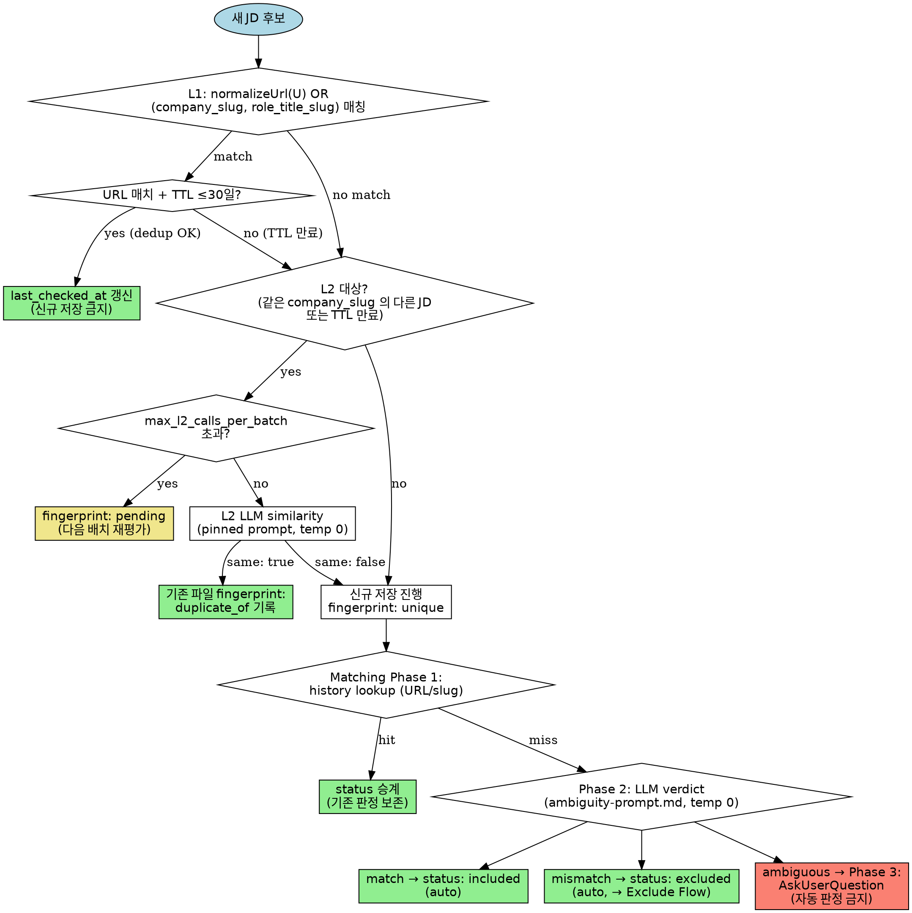

# collect-jd Rules Detail

이 문서는 `skills/collect-jd/SKILL.md` 에서 Phase B TDD 사이클을 통해 누적된 모든 규칙의 상세본이다. Plan M3 기준에 따라 SKILL.md 가 400 줄 임계에 도달하여 이 파일로 분리되었다 (writing-skills 선례 준수).

SKILL.md 는 각 규칙의 요약 + 링크만 유지한다. 모든 loopholes, 예시, 세부 계약은 이 파일에 있다.

## Table of Contents

- [Decision Flow](#decision-flow)
- [State Location & Forbidden Paths](#state-location--forbidden-paths)
- [Phase 0: Profile Interview Required](#phase-0-profile-interview-required)
- [Dedup Layer 1](#dedup-layer-1)
- [Dedup Layer 2](#dedup-layer-2)
- [Matching Loop](#matching-loop)
- [Exclude Flow](#exclude-flow)
- [Reversal](#reversal)
- [Manual Edit Safety](#manual-edit-safety)
- [Ingest Validation](#ingest-validation)
- [Batch Mode Report Schema](#batch-mode-report-schema)
- [Role Tagging](#role-tagging)
- [YAML Robustness](#yaml-robustness)
- [Company-Name Ingest](#company-name-ingest)

---

## Decision Flow

Dedup L1 → L2 escalation 과 Matching Loop Phase 1→2→3 gating 의 결정 트리. 나머지 rule 은 선형 파이프라인이라 별도 시각화가 불필요하며, 각 규칙 섹션을 참조하면 된다.



**읽는 법**: 회색 다이아몬드 = 결정 분기, 녹색 박스 = 종료 경로 (저장 완료), 황색 박스 = 보류 (fingerprint: pending), 주황 박스 = 유저 질문 필요. `salmon` (ambiguous → Phase 3) 이 이 스킬의 핵심 안전장치 — 자동 판정 금지 경로.

---

## State Location & Forbidden Paths

All collect-jd state **must** be written to `$OMT_DIR/collect-jd/` only. `$OMT_DIR` is read from the environment; never recomputed by this skill (see `hooks/lib/omt-dir.sh`). If `$OMT_DIR` is unset, abort with a recovery hint — do **not** compute a fallback.

### Forbidden Paths (never write here)

- `~/.omt/global/**` — any path under user-level global state
- `~/.omt/<other-project>/collect-jd/**` — other projects' scope (cross-project state leak)
- `/tmp/**`, `/var/**`, system paths — not collect-jd's concern
- Any absolute path not prefixed by the resolved `$OMT_DIR` value

### Rejection protocol

If a user requests a forbidden path (examples below), refuse **immediately** and respond with:

1. Which specific forbidden path was requested
2. Why it is forbidden (scope boundary)
3. Where the state will be written instead (`$OMT_DIR/collect-jd/...`)
4. Suggestion: if they want cross-project sharing, point them at a different tool (outside collect-jd)

### Rationalization Loopholes (MUST REJECT)

- "유저가 편의를 위해 요청했으니까 한 번만" — ❌ 편의는 이유가 아님.
- "`~/.omt/global` 이 유저 개인 경로니까 OK" — ❌ 경로 소유자와 scope 규칙은 별개.
- "다른 프로젝트에서 참조해야 한다는 유저 논리가 합당하니까 예외" — ❌ 규칙이 유저 논리보다 우선.
- "`$OMT_DIR` 과 global 양쪽에 저장해서 유저 편의도 살리기" — ❌ 유일 저장소 원칙 위반.
- "`$OMT_DIR` 이 unset 이니까 `~/.omt/global` 로 대체" — ❌ unset 은 abort 사유지 global 폴백 사유 아님.
- "유저가 이미 `~/.omt/global/...` 경로를 명시했으니 존중" — ❌ 유저가 명시해도 규칙 위반이면 거부.

---

## Phase 0: Profile Interview Required

Before ANY JD ingest (URL · text · file · company name · batch rescan), check for `$OMT_DIR/collect-jd/profile/profile.yaml`.

**If `profile.yaml` is absent:**

1. **Halt ingest immediately.** Do not call WebFetch, do not write JD files.
2. Run a **3-round minimum** profile interview using `AskUserQuestion`. Each round covers one of:
   - Round 1 — **경력 · 현재 역할 · 연차 · 선호 도메인**
   - Round 2 — **기술 스택 · 강점 · 학습 중인 영역**
   - Round 3 — **회사 · 연봉 · 지역 · 원격 여부 · exclude signal 취향**
3. Write `$OMT_DIR/collect-jd/profile/profile.yaml` atomically (temp + rename). YAML 에 `version: 1` 필드 포함. 각 round 답변을 해당 섹션에 매핑.
4. After `profile.yaml` exists, **resume** the original ingest request.

**If `profile.yaml` exists:** proceed to ingest normally.

### Rationalization Loopholes (MUST REJECT)

These patterns are **explicit violations** regardless of how they are phrased:

- "유저가 이미 URL 을 줬으니까 수집 먼저, 인터뷰는 나중" — ❌ 인터뷰 먼저.
- "대충 기본값으로 profile.yaml 만들고 수집 진행" — ❌ 반드시 유저 답변 기반.
- "한 번만 건너뛰기" / "이번엔 급하니까" — ❌ 예외 없음.
- "profile.yaml 없지만 유저가 재촉해서 수집 강행" — ❌ 재촉은 인터뷰 중단 사유 아님.
- "이미 profile 있는 것처럼 간주하고 진행" — ❌ 파일 실재 여부만 판단 기준.

Profile interview 의 목적은 이후 matching 이 `history → rules → filter` 로 안정되게 작동하도록 하는 것이다. 건너뛰면 S3 (ambiguity predicate) 결과가 쓰레기가 되어 유저에게 무의미한 질문만 쏟아진다.

---

## Dedup Layer 1

Before writing a new JD file, **always** run L1 dedup against existing files in `$OMT_DIR/collect-jd/jobs/<company_slug>/`.

### L1 match conditions

Given candidate JD with normalized URL `U` and slugs `(company_slug, role_title_slug)`:

- **Match** if any existing JD satisfies:
  - `normalizeUrl(existing.url) == U`, OR
  - `existing.company_slug == candidate.company_slug` AND `existing.role_title_slug == candidate.role_title_slug`

`normalizeUrl()` is defined in `lib/collect-jd/url-normalize.ts` (spec: `reference/url-normalize.md`). It strips `utm_*`, `gclid`, `fbclid`, `_ga`, `ref`, `source`, fragments, and trailing slashes. **Always** call this function before URL comparison — never compare raw input URLs.

### L1 match action (MANDATORY)

If L1 matches an existing file:
1. **Do not create** a new JD file under `jobs/`.
2. Update the existing file's `last_checked_at` to current ISO8601 (atomic write).
3. Report: `"중복 감지: 기존 <path> (L1: URL normalized match)"`.
4. Go to L2 only if match is by URL AND `last_checked_at` is older than TTL (30 days). Slug-only match skips L2 (Deduped by slug identity).

### Rationalization Loopholes (MUST REJECT)

- "utm 달려있어서 다른 링크니까 별개" — ❌ normalizeUrl 후 비교.
- "유저가 명시적으로 두 URL 달라고 했으니 요청대로 저장" — ❌ dedup 은 유저 선호보다 우선.
- "fragment(#anchor) 만 달라서 별개" — ❌ normalize 가 fragment 제거.
- "query param 순서가 달라서 별개" — ❌ normalize 가 param 정렬·제거.
- "이전 수집과 중복일 수도 있지만 확실하지 않으니 일단 저장" — ❌ 불확실하면 L2 호출, 그래도 불명확이면 `fingerprint_check: pending` 으로 저장 (S13 규칙 참조).

### Counterexample: different positions

같은 `company_slug` 라도 `role_title_slug` 가 다르면 서로 다른 JD. 두 파일 모두 저장.

---

## Dedup Layer 2

L1 (URL · Slug) 이 **매치하지 않은 경우**, 또는 L1 매치했지만 `last_checked_at` 이 TTL (30일) 을 초과한 경우, L2 LLM 유사도 판정을 호출한다.

### When to call L2

- L1 no-match + 직전 배치에서 **같은 `company_slug` 의 다른 JD** 가 이미 저장됨 → L2 비교 필수 (회사별로 유사 포지션 중복 방지)
- L1 URL match + `last_checked_at` > 30 days → L2 재검증 (내용이 실제로 달라졌을 수 있음)
- 단일 세션에서 L2 호출 상한 `max_l2_calls_per_batch: 50`. 초과 시 저장은 진행하되 `fingerprint_check: pending` 마킹 → 다음 배치에서 L2 재평가.

### L2 invocation contract

- **Prompt file:** `reference/dedup-l2-prompt.md` (pinned, version 관리)
- **Temperature: 0** (deterministic)
- **Output contract:** JSON `{"same": bool, "reason": str}`
- JSON 파싱 실패 시 retry 1회. 2회 실패 시 conservative `fingerprint_check: pending` 로 저장 (dedup 건너뛰고 보존 우선).
- **Raw URL 비교 금지**, **slug 만으로 판정 금지** — 항상 L2 prompt 거쳐야 함.

### L2 match action (same == true)

1. 신규 JD 파일 생성 **금지**.
2. 기존 (매치된) 파일의 `last_checked_at` 을 현재 ISO8601 로 갱신.
3. 기존 파일의 `fingerprint_check` 를 `duplicate_of:<candidate.url>` 로 기록 (원본이 어디에서 중복 검출되었는지 추적).
4. 보고: `"중복 감지: 기존 <path> (L2: LLM similarity same=true, reason=<reason>)"`.

### L2 non-match action (same == false)

- 신규 JD 파일 저장 진행. `fingerprint_check: unique` 기록.

### Rationalization Loopholes (MUST REJECT)

- "URL 이 다르니 당연히 다른 JD" — ❌ L2 content 비교 필수 (회사 블로그 vs 잡포털 동일 공고 케이스).
- "블로그는 홍보글이니 채용사이트와 별개" — ❌ 내용 같으면 중복.
- "내용 살짝 달라서 별개" — ❌ LLM judge 에 위임. temperature 0 이므로 결과 재현.
- "배치가 바쁘니 L2 skip 하고 저장" — ❌ `max_l2_calls_per_batch` 초과 시 `fingerprint_check: pending` 저장은 허용, **skip 이 아니다**. 다음 배치에서 반드시 재평가.
- "L2 응답 JSON 깨졌으니 그냥 저장" — ❌ 1회 retry, 그래도 실패면 `fingerprint_check: pending`.

### Counterexample: 다른 팀 · 다른 시니어리티

같은 회사 · 같은 role_title 이어도 L2 응답이 `same: false` 면 별개 JD 로 저장 (예: "네이버 백엔드 시니어" vs "네이버 백엔드 주니어").

---

## Matching Loop

각 JD 저장 전에 현재 `profile/rules.yaml` 과 대조하여 `status` 를 결정한다. 3-phase 판정:

### Phase 1: History lookup

기존 `jobs/**/*.md` 에 동일 URL 혹은 slug pair 가 있으면 해당 status 승계 (사용자 reversal 은 S6 규칙으로 처리). 없으면 Phase 2.

### Phase 2: Rules check (LLM ambiguity predicate)

`reference/ambiguity-prompt.md` 의 pinned prompt 를 **temperature 0** 으로 호출. Output JSON:

```json
{"verdict": "match" | "mismatch" | "ambiguous", "missing_signals": [string], "explanation": "KR short"}
```

- `verdict == "match"` → `status: included` (자동)
- `verdict == "mismatch"` → `status: excluded` (자동, 단 S4 규칙에 따라 `tags` + `reason_note` 필요 — rules 위반 이름을 tag 로 derive)
- **`verdict == "ambiguous"` → 자동 판정 금지.** 반드시 `AskUserQuestion` 호출 (Phase 3).

JSON 파싱 실패 시 1회 retry. 2회 실패 → conservative `verdict: ambiguous` + `missing_signals: ["llm_parse_failure"]` 로 Phase 3 진입.

### Phase 3: Ask the user (ambiguous only)

`missing_signals` 을 기반으로 한국어 질문 구성. `AskUserQuestion` 호출 시:

- 질문은 **핵심 결정 신호** 중심 (예: "이 JD 의 원격 근무 정책을 확인하고 싶어요. 원격 가능이면 include, 불가능이면 exclude 로 저장할까요?")
- 옵션: `include`, `exclude`, `defer` (= status: `ambiguous` 로 저장, 후속 배치에서 재평가)
- 유저 답변 수집 후 `status` 확정. defer 인 경우 `status: ambiguous` + `reason_note: "deferred due to <missing>"`.

**Batch mode 에서도 즉시 호출**. 체크포인트 · 배치 종료 대기 금지. 유저가 "그만" / "stop" / "defer all" 등 명시적 중단 의사 표명 시 즉시 중단 + 남은 후보 `status: ambiguous` 로 일괄 보존.

### Rationalization Loopholes (MUST REJECT)

- "본문에 rules 위반 언급 없으니 include" — ❌ missing_signals 있으면 ambiguous, 반드시 유저 질문.
- "서울 사옥 기본이라 원격 불가 판정" — ❌ 명시 없으면 추론 금지, 질문해라.
- "배치 모드 중이니 나중에 일괄 질문" — ❌ 즉시 질문 (유저가 defer 선택 시에만 저장 후 재평가).
- "rules.yaml 없으니 자동 include" — ❌ rules.yaml 부재 시 S1 Phase 0 규칙에 따라 인터뷰 먼저.
- "유저가 이미 URL 명시했으니 의사 분명 → include" — ❌ URL 명시 ≠ inclusion 의사.
- "missing_signals 가 경미하니 자동 판정" — ❌ 하나라도 있으면 질문.

### Auto-decision audit trail

`verdict == match` 또는 `mismatch` 로 자동 저장 시 `reason_note` 에 `auto:<verdict>:<rules.yaml sha256 short 8>` 기록. 추후 rules 재평가 때 stale 판정 식별 가능.

### Counterexample (정당한 auto-include)

JD 가 rules 전 조건 (`remote: true`, `stack: [Kotlin, Spring]`, `seniority: senior`) 을 **명시적으로** 만족하면 `verdict: match` → 자동 include. 유저 질문 없이 저장. `reason_note: "auto:match:<sha>"`.

---

## Exclude Flow

`status: excluded` 로 저장하려면 **다음 두 필드를 동시에** 채워야 한다:

- `tags: [string, ...]` — 최소 1개. `$OMT_DIR/collect-jd/tags.yaml` 의 emergent taxonomy 에서 slug 로 선택 (혹은 신규 추가).
- `reason_note: string` — 유저 발화 원문 또는 요약. 빈 문자열 금지.

둘 중 하나라도 누락된 상태로 저장 시도 → **저장 전 인터뷰 발동** (아래 "Emergent tag interview").

### Emergent tag interview

Exclude 요청이 들어오면 skill 은 다음 순서로 진행:

1. **reason 수집:** 유저에게 "왜 제외하는지 한 줄로 설명해주세요" 물어본다. 답변이 곧 `reason_note` 원문.
2. **tag 유도:**
   - `tags.yaml` 이 비어있거나 관련 tag 가 없으면: "이 이유를 태그로 남겨두면 비슷한 JD 를 다음번에 자동 제외할 수 있어요. 태그 이름을 지어주시겠어요? (예: `seniority-mismatch`, `commute-too-long`)" — 유저 자유 서술 후 LLM 이 slug 화하여 `tags.yaml` 에 append.
   - `tags.yaml` 에 관련 tag 가 있으면: top-3 후보 제시 + "새로 만들기" 옵션. AskUserQuestion.
3. **tags.yaml 업데이트:** 새 tag 가 선택되면 `tags.yaml` 에 `{slug: <slug>, description: <원문>, first_used: <ISO date>, count: 1}` append. 기존 tag 재사용 시 `count += 1`.
4. **Frontmatter 저장:** `status: excluded`, `tags: [<slug>, ...]`, `reason_note: <원문>` atomic write.

### tags.yaml schema

```yaml
version: 1
tags:
  - slug: seniority-mismatch
    description: 연차/시니어리티가 맞지 않음
    first_used: 2026-04-22
    count: 3
  - slug: 원격-불가
    description: 원격 근무 불가능한 조건
    first_used: 2026-04-22
    count: 2
```

- `slug` 는 slugify() 적용. 한글 보존.
- `description` 은 유저 원문 한 줄 요약 (LLM 이 유저 원문을 손대지 않고 짧으면 그대로 사용).
- 사전 정의된 taxonomy 없음 — 순수 emergent.

### Rationalization Loopholes (MUST REJECT)

- "유저가 이유 안 말했으니 reason_note 비워두고 저장" — ❌ 저장 전 **반드시** 질문.
- "tags 는 optional 이니까 넣지 말기" — ❌ exclude 때만 MANDATORY.
- "기존 tag 재사용 귀찮으니 매번 신규" — ❌ top-3 후보 먼저 제시.
- "reason_note 대신 `excluded` 같은 placeholder 사용" — ❌ 유저 발화 원문 필수.
- "`status: excluded` 만 바꾸고 tags 는 나중에" — ❌ atomic write, 두 필드 동시 저장.
- "태그 이름 재생성 피곤하니 LLM 이 임의로 slug 생성" — ❌ 유저 확인 필수 (AskUserQuestion).

### included / ambiguous / pending 에는 반영 안 됨

이 플로우는 **exclude 전용**. `included`, `ambiguous`, `pending` 에서는 `tags` 는 optional, `reason_note` 도 optional (단 auto-decision audit trail `auto:<verdict>:<sha>` 는 별도 규칙, Matching Loop 섹션 참조).

### Counterexample

- 유저: "그 JD 는 연봉이 너무 낮아. 제외." → reason_note: "연봉이 너무 낮아", tags 후보: `salary-too-low` (신규) → 저장 OK.
- 유저: "제외" (이유 없음) → skill 이 "왜 제외하시는지 한 줄로 알려주세요?" 질문 → 답변 수집 후 저장.

---

## Reversal

기존 파일 `status` 를 변경할 때 **Atomic update protocol**: (1) 현재 `status` → `prev_status` 보존. (2) 새 `status` 결정. (3) `reason_note` **최상단에** prepend: `prev: <prev_status> @ <ISO8601 date>`. (4) 새 `status` 로 frontmatter 업데이트. (5) `last_checked_at` 갱신 + atomic write (`.tmp` → rename).
예시 (included → excluded): reason_note 최상단이 `prev: included @ 2026-04-22` 로 시작하고, 그 아래에 기존 reason_note + 새 사유가 이어진다.

다중 전환: `prev:` 라인 최상단에 **누적** (prepend 만, 가장 위 = 가장 최근). Rules 재평가 시: `prev: <prev_status> @ <date> (rules_reeval:<sha short 8>)`. S14 수동 편집 파일은 rules re-eval 이 status 를 덮어쓰지 않으므로 reversal 없음. **Detection** — status 변경이면 모두 reversal. 예외 (아님): 첫 저장 · L1 `last_checked_at` 갱신 · L2 `fingerprint_check` 갱신.

### Rationalization Loopholes (MUST REJECT)

- "status 만 갈아끼우면 되지 prev 기록은 과잉" — ❌ history 추적 · rules 재평가 감지 · 유저 질문 대응 모두 필요.
- "reason_note 끝에 append 해도 OK" — ❌ **최상단 prepend** 강제.
- "reason_note 가 비어있으면 prev 만 쓰기" — ❌ prev 라인 + 새 reason_note 아래에 추가.
- "하루에 여러 번 뒤집으면 한 번만 기록" — ❌ 모든 전환 기록.
- "rules_reeval sha 번거로우니 생략" — ❌ short 8 필수 (audit trail).
- "atomic write 대신 직접 수정" — ❌ 중간 실패 시 파일 손상.

---

## Manual Edit Safety

배치 재스캔 (ingest path #5) 실행 시 **유저가 수동으로 편집한 frontmatter 를 덮어쓰지 않는다**. 수동 편집 감지 → 해당 파일은 rule 재평가 대상에서 제외.

### 감지 신호 (휴리스틱)

파일이 다음 중 **하나라도** 만족하면 manual-edited 로 간주:

1. **`last_checked_at` 이 skill 의 마지막 기록보다 미래**:
   - skill 은 항상 **과거 또는 현재 시점** 으로만 `last_checked_at` 을 기록.
   - 파일에 미래 timestamp 가 있으면 유저가 임의로 편집한 것으로 판정.
2. **Canonical 계약 위반** (비표준 키 OR canonical 필드의 enum 외 값):
   - canonical 키 (13종): `version`, `url`, `company`, `company_slug`, `role_title_verbatim`, `role_title_slug`, `role_tags`, `status`, `tags`, `reason_note`, `quote`, `last_checked_at`, `fingerprint_check`.
   - canonical enum: `status` ∈ {`included`, `excluded`, `ambiguous`, `pending`}, `fingerprint_check` ∈ {`pending`, `unique`, `duplicate_of:<url>`}.
   - 위 집합을 벗어난 키의 존재, 또는 enum 필드의 정의 외 값 → 유저 편집으로 판정.
   - 예: `priority: high` (비표준 키), `status: dream-job` (status enum 외), `fingerprint_check: reviewed` (fingerprint_check enum 외), `user_note` · `deadline` · `application_status` (비표준 키 추가 사례).

### Skip protocol

감지된 manual-edited 파일에 대해:

1. **파일 읽지 않음** (재평가 · tag 재계산 · L2 호출 · status 변경 **모두 안 함**).
2. `last_checked_at` 도 건드리지 않음 (유저가 설정한 값 유지).
3. 배치 보고의 카운트에 포함하지 않음 — 별도 카운터 `manual_skipped` 증가.
4. Batch Mode Report Schema 의 마지막 줄 **앞에** 한 줄 추가:
   ```
   수동 편집 감지: <N>건 (status 유지)
   신규: ..., 기존: ..., 업데이트: ...
   ```
5. 디버그 로그 (stderr 또는 보고 서술부) 에 수동 편집 파일 경로 나열.

### Exception: 유저 명시적 강제 재평가

유저가 "강제 재평가해" 또는 "manual edit 무시하고 다시 해" 같은 explicit 문구를 사용하면 skip 해제. 단 이 경우 skill 은 확인 질문 (`AskUserQuestion`) 을 먼저 던진다 — "수동 편집 N 건을 덮어쓸까요?". 기본 답: "건너뛰기" (안전 쪽).

### Interaction with other rules

- **Rules re-evaluation** (`rules.yaml` 변경 후 재판정) 에서도 동일 skip. `Reversal` 섹션 의 `rules_reeval` 경로에서 manual-edited 파일은 건너뛴다.
- **Dedup L1/L2** 는 계속 작동 (새 JD 가 기존 manual-edited 파일과 L1 match 하면 normal dedup — last_checked_at 갱신 조차 skip — 즉 "유저 자료" 완전 보존).
- **Reversal** 을 manual 로 하려면 유저가 frontmatter 를 직접 편집 + `prev: <status> @ <ISO>` 라인 본인 책임으로 추가 가능. skill 은 간섭 안 함.

### Rationalization Loopholes (MUST REJECT)

- "필드 하나 정도는 사소하니 덮어써도 됨" — ❌ 유저 편집은 **모두** 존중.
- "skill 이 더 정확한 status 알고 있으니 덮어쓰기가 이득" — ❌ 유저 의도가 우선.
- "manual-edited 감지 휴리스틱 신뢰 안 됨, 일단 재평가" — ❌ 의심 시 skip (conservative).
- "보고에서 manual skipped 카운트 생략" — ❌ 투명성 위해 보고 필수.
- "유저가 당연히 수동 편집 기억하니까 skip 고지 불필요" — ❌ 유저 기억에 의존 금지.

### Counterexample

- 파일에 `last_checked_at: 2026-05-01T10:00:00Z` 이 있는데 현재 시각 `2026-04-22T15:00:00Z` → 미래 timestamp → manual-edited.
- 파일에 `application_status: applied` 필드 존재 → canonical 계약 위반 (비표준 키) → manual-edited.
- 파일에 `status: dream-job` → canonical 계약 위반 (enum 외 값) → manual-edited (단 보고에 경고 추가 "비표준 status 발견").

---

## Ingest Validation

WebFetch · 파일 · 텍스트 ingest 결과를 **유효 JD** 로 저장하기 전에 **형식 + 내용 게이트** 를 통과시킨다. 실패 시 저장 금지 + 에러 보고.

### 검증 규칙 (둘 중 하나라도 해당 → 저장 금지)

1. **본문 텍스트 길이 < 200자**:
   - HTML 파싱 후 `<body>` 의 plain text (태그 제거) 기준. `<script>`, `<style>`, `<nav>`, `<footer>` 는 제외.
   - 짧은 페이지 (SPA shell, redirect, 404) 대부분 캐치.
   - 플레인 텍스트 입력은 입력 문자열 전체 길이가 기준.
2. **정지 신호 힌트만 포함** (실 JD 문구 부재):
   - 정지 신호 키워드: `login`, `sign in`, `sign-in`, `로그인`, `captcha`, `403`, `404`, `500`, `Access Denied`, `권한이 없습니다`, `인증`, `session`, `세션 만료`, `page not found`.
   - JD 문구 키워드 (최소 1개 존재해야 JD 로 판정): `role`, `responsibilities`, `requirements`, `qualifications`, `직무`, `담당 업무`, `자격 요건`, `우대 사항`, `기술 스택`, `경력`, `연봉`, `근무 조건`, `채용`, `Job Description`.
   - 정지 신호 키워드 ≥ 1개 **AND** JD 문구 키워드 0개 → 저장 금지.

### Rejection protocol

1. 파일 저장 **완전 금지**. `jobs/` 에 어떤 .md 도 생성하지 않는다.
2. 에러 메시지 보고:
   ```
   유효 JD 아닌 것으로 보임: <url>
   - body 길이: <N>자 (기준 200 이상)
   - 정지 신호: <matched keyword or "없음">
   - JD 문구: <matched keyword or "없음">
   ```
3. 배치 모드 중이면 배치 보고에 `fetch 실패: <N>건` 카운터 추가 (별도 라인, 마지막 regex 라인 앞).
4. 로그: `$OMT_DIR/collect-jd/ingest-failures.log` 에 append (ISO8601 + url + reason).

### Exception: 유저 override

유저가 "강제 저장" 또는 "이상해도 일단 저장해" 명시 시 `AskUserQuestion` 확인 ("body 가 짧은데 정말 저장할까요?"). 기본 답변은 "건너뛰기". 유저가 "저장" 선택 시 `status: pending` + `fingerprint_check: pending` + `reason_note: "manual override (low-confidence ingest)"` 로 저장.

### Rationalization Loopholes (MUST REJECT)

- "저장해두면 나중에 다시 불러서 재시도 가능하니 일단 저장" — ❌ 쓰레기 저장은 dedup/matching 을 오염시킨다. 거부 + 재시도 권고.
- "SPA 는 JS 렌더링이라 원래 그러함, 정상인 척 저장" — ❌ SPA 감지 시 WebFetch 결과는 쓸모 없음. 거부.
- "login wall 뚫는 스크레이퍼 돌려서라도 수집" — ❌ site 별 스크레이퍼 금지 (plan non-goal). 유저에게 로그인 후 텍스트 복붙 권유.
- "body 199자 라서 아깝게 못 저장하지만 200자 이상이면 OK" — ❌ 수치 경계는 단순 휴리스틱. 200자 이상이어도 JD 문구 0개면 여전히 거부.
- "정지 신호 키워드 빠뜨릴 수 있으니 리스트 외에는 통과" — ❌ JD 문구 존재 여부가 필수 조건.

### Counterexample (정상 저장)

- body 1500자 + `요구사항`, `담당 업무` 등 JD 문구 포함 → 정상 저장.
- body 250자 (짧지만) + `Job Description: Build the future` + `Responsibilities` 포함 → 정상 저장.
- body 180자 but 전체가 JD 요약 (예: 단일 문장 채용 공고) + `채용` 포함 → 규칙 (1) 기준 200자 미만이라 거부. 유저에게 텍스트 복붙 권유 → 유저가 직접 full body 붙여넣기 → 규칙 (1) 재통과 후 저장.

---

## Batch Mode Report Schema

배치 재스캔 (ingest path #5, "싹 돌려" 등) 이 완료되면 응답의 **마지막 줄** 을 다음 regex 에 정확히 매치하는 문자열로 작성한다:

```
^신규: \d+건, 기존: \d+건, 업데이트: \d+건$
```

### 정의

- **신규**: 이번 배치에서 `jobs/` 아래에 **새로 생성된** JD 파일 수 (L1·L2 dedup 통과)
- **기존**: L1 또는 L2 dedup 매치로 **신규 파일 생성 없이** `last_checked_at` 만 갱신된 파일 수
- **업데이트**: 기존 파일의 `status` 또는 `role_tags` 가 재평가로 변경된 수 (L2 TTL 초과 재판정 결과 포함)

세 카운트의 합은 이번 배치에서 검사한 **고유 JD** 수와 일치해야 한다 (`실패: <n>건` 은 필요 시 별도 라인으로 마지막 줄 **앞에** 추가, 마지막 줄 regex 에는 포함되지 않음).

### 예시 (정상)

```
(상세 서술 문장들)
...

신규: 3건, 기존: 5건, 업데이트: 2건
```

### 금지 패턴 (MUST REJECT)

- 한글 라벨 변경: `"새로운 JD: 3개"`, `"new=3"`, `"추가됨: 3건"` — ❌
- 마지막 줄이 아닌 다른 위치에 배치 — ❌
- 카운트 수치가 실제 파일 diff 와 불일치 — ❌ 실 집계 결과만 기록
- 공백/쉼표/콜론 포맷 변형 — ❌ regex 엄격 일치
- `신규: 0건` 생략 — ❌ 0 도 명시
- 배치 실패 시 포맷 생략 — ❌ 최소 `신규: 0건, 기존: 0건, 업데이트: 0건` 기록 + 별도 라인에 에러 설명

### Rationalization Loopholes (MUST REJECT)

- "자연어가 더 친근하니 포맷 변형" — ❌ regex 엄격.
- "이번엔 신규 없어서 마지막 줄 생략" — ❌ 0 이라도 명시.
- "실 집계 안 하고 대충 반올림" — ❌ 파일 diff 실측 사용.
- "유저가 다른 포맷 요청" — ❌ SKILL.md 규칙이 유저 선호보다 우선.
- "업데이트 카운트 정의 애매하니 0 으로 통합" — ❌ 위 정의에 따른 실 집계.

---

## Role Tagging

JD 저장 시 frontmatter 의 두 필드를 다음 규칙으로 채운다:

- `role_title_verbatim`: **JD 원문 제목** 그대로 (한 글자도 수정 금지). dedup 용 ID · 검색용.
- `role_tags: [string]`: **LLM 호출** 로 `$OMT_DIR/collect-jd/profile/taxonomy.yaml` 의 enum 부분집합에서 1..N 개 선택. matching 파이프라인용.

### Taxonomy baseline (first run default)

첫 실행 시 `taxonomy.yaml` 이 없으면 다음 enum 을 유저에게 제시하고 수용/수정 받은 뒤 저장:

```yaml
version: 1
roles:
  - backend
  - frontend
  - fullstack
  - infra
  - data
  - platform
  - mobile
  - ml
  - devops
```

유저가 추가 role 을 요청하면 enum 에 append (예: `ai-engineer`, `security`). 삭제 요청도 동일.

### LLM invocation contract (role tagging)

- **Prompt file:** `reference/ambiguity-prompt.md` 는 verdict 용이므로 별도. Role tagging 은 **짧은 전용 prompt** — SKILL.md 안에 pinned inline 템플릿 유지.
- **Temperature: 0** (deterministic, 동일 입력 → 동일 출력)
- **Output contract:** JSON `{"role_tags": ["backend", "..."], "reasoning": "..."}`
- **Input**: JD 원문 본문 (5000 chars truncate) + `role_title_verbatim` + taxonomy.yaml 의 `roles` enum
- JSON 파싱 실패 시 1회 retry. 2회 실패 시 `role_tags: []` + `fingerprint_check: pending` 로 저장하지 말고 **에러 보고**해 유저 개입 요청 (role_tags 없이 저장 금지 — matching 에 치명적).

### Pinned inline prompt (v1)

```
System: You are a strict JD role tagger. Output ONLY JSON:
{"role_tags": ["<enum values>"], "reasoning": "short KR"}.
No text outside JSON. Temperature 0.

User:
다음 JD 에 맞는 role enum 을 선택해라. taxonomy 외의 값 사용 금지. 복수 선택 가능.

[Taxonomy enum]
{{taxonomy.roles}}

[JD role_title_verbatim]
{{role_title_verbatim}}

[JD body (truncated)]
{{jd_body}}

Rules:
- 한국어 서버/backend 계열 제목 ("백엔드", "서버개발자", "서버사이드", "BE", "backend")은 **반드시** `backend` 를 포함할 것.
- 한국어 프론트/FE 계열 ("프론트엔드", "프론트", "FE", "웹 클라이언트") 는 **반드시** `frontend` 를 포함할 것.
- 한국어 풀스택 ("풀스택", "Full-stack", "FS") 는 **반드시** `fullstack` 포함 + 필요 시 `backend`+`frontend` 추가.
- 한국어 데이터 ("데이터 엔지니어", "데이터 플랫폼", "DE") 는 **반드시** `data` 포함.
- 위 규칙 외의 매핑은 JD body 기반 판단.
- `reasoning` 은 1-2 문장 한국어.

JSON 만 출력.
```

### Rationalization Loopholes (MUST REJECT)

- "백엔드 를 backend 로 매핑 안 함 (영어 표기 없어서)" — ❌ 위 Rules 에 명시.
- "서버개발자 가 서버 롤이지 backend 는 아니다" — ❌ 동의어 매핑 강제.
- "서버사이드 엔지니어 는 BE + Platform 두 개" — 가능하지만 `backend` 는 **반드시** 포함.
- "JD body 가 특이해서 backend 제외" — ❌ title synonym 이 규칙보다 우선되지 않음. **Title+body 둘 다 보고 최종 판단**.
- "taxonomy 에 backend 없어서" — ❌ default taxonomy 에 포함. 삭제되었다면 유저에게 복구 질문.
- "role_tags 비어있어도 저장" — ❌ 빈 배열로 저장 금지.

### Counterexample

- JD title "Backend Team Lead" + body 가 매니지먼트 위주 → `role_tags: [backend, platform]` 가능.
- JD title "DevOps Engineer" + body 가 backend 개발도 일부 → `role_tags: [devops, backend]`.

---

## YAML Robustness

`$OMT_DIR/collect-jd/` 아래 모든 state YAML (`profile/profile.yaml`, `profile/taxonomy.yaml`, `profile/rules.yaml`, `tags.yaml`, `sources.yaml`, `config.yaml`, `rules.yaml.proposed`) 읽기/쓰기에서 파싱 · I/O 실패가 발생하면 **crash 금지**. 복구 · 백업 · 유저 알림 프로토콜을 반드시 수행한다.

### 읽기 실패 protocol

1. **Parse 실패 감지** (yq / js-yaml / bun YAML parser 예외 catch)
2. 원본 파일을 `<file>.bak.<ISO8601-filename-safe>` 로 복사 (예: `tags.yaml` → `tags.yaml.bak.2026-04-22T15-30-00Z`)
3. 유저에게 `AskUserQuestion` 으로 2 옵션 제시:
   - **edit manually**: "`<file>` 를 수정하고 엔터" — 유저 확인 후 retry [기본]
   - **reset to default**: skill 의 canonical default 로 재생성 (예: `taxonomy.yaml` 은 plan 의 9 roles, `rules.yaml` 은 `{}`). **데이터 손실 주의** 경고. 기본 선택 아님.
4. 2 옵션 중 하나 완료 후 스킬 계속 진행. 유저가 "그만" 이면 graceful shutdown + lock 해제.

### 관련 실패 케이스 (catch-all)

- Invalid UTF-8 bytes in YAML → 파싱 실패로 취급.
- 빈 파일 (0 bytes) → 파싱 실패로 취급 (빈 YAML 은 기본 null; skill 은 schema 강제).
- Top-level structure 예상과 다름 (예: `tags.yaml` 이 dict 대신 list) → schema validation 실패로 취급.

### Rationalization Loopholes (MUST REJECT)

- "파싱 실패했으니 그냥 빈 {} 로 초기화" — ❌ 유저 자료 보호 우선, 백업 + 복구 옵션 필수.
- "reset to default 를 기본값으로 제시해 빠르게 진행" — ❌ 데이터 손실 위험 옵션은 기본 선택 아니어야 함.

### Counterexample

- `tags.yaml` 중괄호 깨짐 → 파싱 실패 → `tags.yaml.bak.<ts>` 생성 → `AskUserQuestion`: edit manually / reset to default → 유저 "edit manually" 선택 + 파일 수정 → 스킬 재실행 시 정상 로드 → 배치 계속. 데이터 손실 없음.
- `rules.yaml` 이 빈 파일 → 파싱 실패 (혹은 `null` 반환) → 백업 (0 bytes 파일도 백업) → reset to default 제안 (`rules.yaml: {}`) → 유저 승인 시 재생성 + 계속.

---

## Company-Name Ingest

Ingest path #4 (회사명만 제공) 은 **`sources.yaml` 등록 사이트 내에서만** 동작한다. Open-web 자유 검색은 **절대** 수행하지 않는다.

### 처리 흐름

1. 유저가 "XYZCorp 의 JD 가져와줘" 식으로 회사명만 제공.
2. 스킬이 `sources.yaml` 의 `companies[]` (또는 동등 필드) 에서 회사 slug 매치 조회.
3. **매치 발견:**
   - `sources.yaml` 의 해당 회사 `careers_url` 을 사용해 JD 목록 fetch
   - 각 JD 에 대해 standard ingest flow (Phase 0 → Dedup L1/L2 → Matching Loop → save)
4. **매치 실패 (미등록):**
   - WebFetch 호출 **금지**.
   - LLM open-world 검색 · 구글 검색 · LinkedIn 탐색 등 모두 **금지**.
   - `AskUserQuestion` 발동: "XYZCorp 의 공식 채용 페이지 URL 을 알려주세요. 등록하면 다음부터 회사명만으로 수집 가능합니다."
   - 옵션:
     - `URL 입력`: 유저가 URL 제공 → `sources.yaml` 의 `companies[]` 에 append (`{slug, name, careers_url, added: <ISO date>}`) → 처리 흐름 3번으로 복귀
     - `건너뛰기`: 수집 포기. "XYZCorp 는 등록되지 않아 건너뛰었습니다." 보고.
     - `무시 (blacklist)`: `sources.yaml.blacklist[]` 에 추가 → 다음 번에도 이 회사 요청이 오면 즉시 건너뛰기 (선택적으로 reason_note).

### sources.yaml schema (관련 부분)

```yaml
version: 1
companies:
  - slug: toss
    name: Toss
    careers_url: https://toss.im/career
    added: 2026-04-01
blacklist:
  - slug: xyz
    name: XYZCorp
    reason_note: 이미 수집 완료, 재수집 불필요      # optional
```

### Rationalization Loopholes (MUST REJECT)

- "유저가 회사명 주면 당연히 구글에서 찾아야 친절하지" — ❌ open-web 검색 절대 금지 (plan non-goal).
- "등록되지 않아도 일단 대충 추측한 URL 로 WebFetch 해보기" — ❌ WebFetch 호출 금지.
- "AskUserQuestion 피곤하니 등록 안 된 회사는 조용히 skip" — ❌ 유저에게 알려야 함 (투명성).
- "sources.yaml append 는 skill 이 알아서, 유저 확인 없이" — ❌ 유저가 URL 제공한 이후에만 append. 자동 추정 금지.
- "blacklist 에 있으면 묻지 말고 넘어가자 — 등록 질문조차 안 던지기" — ⭕ OK (blacklist 는 유저 explicit 의사). 단 블랙리스트 trigger 됐음을 보고에 한 줄.

### Counterexample

- 유저 "Toss 채용공고 가져와줘" → `sources.yaml.companies` 에 `toss` 존재 → `https://toss.im/career` fetch → standard flow.
- 유저 "XYZCorp 채용" → 미등록 → AskUserQuestion → 유저 URL 제공 → `sources.yaml` append → fetch.
- 유저 "어제 등록한 xyz 회사" → blacklist 에 있음 → 조용히 skip + 보고 라인 "XYZCorp blacklist (reason: 이미 수집 완료)".

