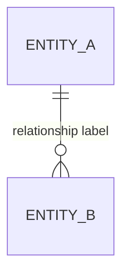

# Deep Interview Spec Template

````markdown
# Deep Interview Spec: {title}

## Metadata
- Interview ID: {uuid}
- Rounds: {count}
- Final Ambiguity Score: {score}%
- Type: greenfield | brownfield
- Generated: {timestamp}
- Threshold: {threshold}
- Initial Context Summarized: {yes|no}
- Status: {PASSED | BELOW_THRESHOLD_EARLY_EXIT}

## Clarity Breakdown
| Dimension | Score | Weight | Weighted |
|-----------|-------|--------|----------|
| Intent Clarity | {s} | {w} | {s*w} |
| Outcome Clarity | {s} | {w} | {s*w} |
| Scope Clarity | {s} | {w} | {s*w} |
| Constraint Clarity | {s} | {w} | {s*w} |
| Success Criteria | {s} | {w} | {s*w} |
| Context Clarity (brownfield) | {s} | {w} | {s*w} |
| **Total Clarity** | | | **{total}** |
| **Ambiguity** | | | **{1-total}** |

## Goal
{crystal-clear goal statement derived from interview}

## Constraints
- {constraint 1}
- {constraint 2}
- ...

## Non-Goals
- {explicitly excluded scope 1}
- {explicitly excluded scope 2}

## Acceptance Criteria
- [ ] {testable criterion 1}
- [ ] {testable criterion 2}
- [ ] {testable criterion 3}
- ...

## Assumptions Exposed & Resolved
| Assumption | Challenge | Resolution |
|------------|-----------|------------|
| {assumption} | {how it was questioned} | {what was decided} |

## Approach & Design Decisions
- **Selected approach:** {chosen implementation direction}
- **Rejected alternatives:** {options considered but ruled out, and why}
- **Rationale:** {why the selected approach was chosen over alternatives}
- **Tradeoffs:** {what is gained and what is given up with this approach}

Downstream (prometheus) consumes this as a FIXED input — does not re-decide the approach. When a user-forced exit left a design branch unresolved, do NOT invent a Selected approach — record the fork under **Risks & Unresolved Forks** below.

## Diagrams
The coverage table below comes first and lists all six deep-interview lenses; a subsection follows for each lens that was actually drawn, in Why → Diagram → Interpretation form.

| Lens | Trigger FACT | Status |
|------|--------------|--------|
| System topology | {trigger FACT} | {drawn \| trigger FALSE: <reason>} |
| Module-API | {trigger FACT} | {drawn \| trigger FALSE: <reason>} |
| Actor scenario | {trigger FACT} | {drawn \| trigger FALSE: <reason>} |
| Entity lifecycle | {trigger FACT} | {drawn \| trigger FALSE: <reason>} |
| Domain entity | {trigger FACT} | {drawn \| trigger FALSE: <reason>} |
| Logic branching | {trigger FACT} | {drawn \| trigger FALSE: <reason>} |

### Domain entity
**Why:** {trigger FACT that fired this lens}



**Interpretation:** {what the diagram reveals about the domain model}

## Risks & Unresolved Forks
- **Unresolved approach forks:** {design decisions left open at a user-forced exit — name the branch and its divergent options; empty if all branches were resolved}
- **Risks / open questions:** {known risks or assumptions not fully validated}

## Technical Context
{brownfield: relevant codebase findings from explore agent}
{greenfield: technology choices and constraints}

## Ontology (Key Entities)
{Fill from the FINAL round's ontology extraction, not just crystallization-time generation}. The entity-relationship diagram for these entities lives in the Domain entity lens under **## Diagrams**, not here.

| Entity | Type | Fields | Relationships |
|--------|------|--------|---------------|
| {entity.name} | {entity.type} | {entity.fields} | {entity.relationships} |

## Ontology Convergence
{Show how entities stabilized across interview rounds using data from ontology_snapshots in state}

| Round | Entity Count | New | Changed | Stable | Stability Ratio |
|-------|-------------|-----|---------|--------|----------------|
| 1 | {n} | {n} | - | - | - |
| 2 | {n} | {new} | {changed} | {stable} | {ratio}% |
| ... | ... | ... | ... | ... | ... |
| {final} | {n} | {new} | {changed} | {stable} | {ratio}% |

## Interview Transcript
<details>
<summary>Full Q&A ({n} rounds)</summary>

### Round 1
**Q:** {question}
**A:** {answer}
**Ambiguity:** {score}% (Intent: {i}, Outcome: {o}, Scope: {sc}, Constraints: {con}, Success: {su}{brownfield: , Context: {cx}})

...
</details>
````
