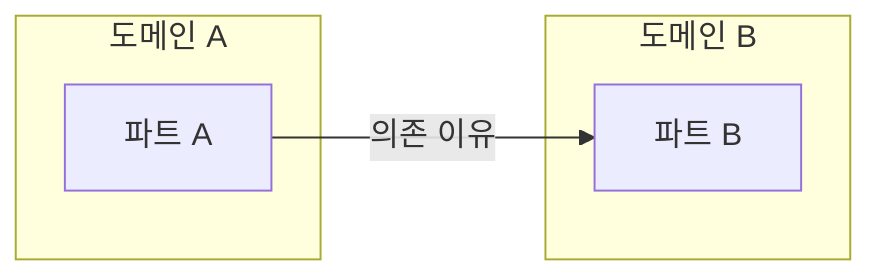
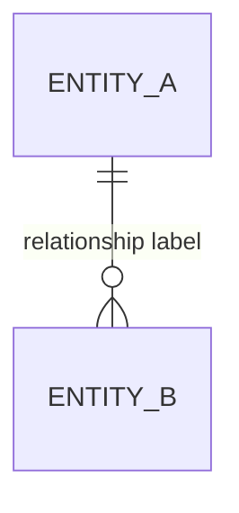

# Deep Interview Spec Template

````markdown
# Deep Interview Spec: {title}

## Metadata
- Interview ID: {uuid}
- Design anchor: design-anchor: deep-interview:<state.interview_id>
- Anchor source: persisted state.interview_id; stable across resume; never from title, slug, timestamp, or hash
- Output shape: {task-tickets | ai-execution-plan | domain-output}
- Output shape source: persisted state.output_shape; copy the exact enum without prose or synonyms
- Rounds: {count}
- Final Ambiguity Score: {score}%
- Type: greenfield | brownfield
- Generated: {timestamp}
- Threshold: {threshold}
- Initial Context Summarized: {yes|no}
- Status: {PASSED | BELOW_THRESHOLD_EARLY_EXIT}

## Goal
{crystal-clear goal statement derived from interview}

## Constraints
- {constraint 1}
- {constraint 2}
- ...

## Invariants
Properties that must hold in EVERY state, on EVERY path that can change what they constrain. Distinct from the three neighbouring sections: a **Constraint** is an environmental limit given to you (8 slots, app-only surface), an **Acceptance Criterion** is one scenario observed once (dispense → count drops by 1), an **Invariant** is a proposition quantified over all paths. When a property is true across paths, it belongs here — recording it only as the scenario that made you notice it loses the quantifier.

`paths:` is what makes the claim checkable: enumerate every operation that can change the constrained value, not just the one the interview discussed. A path the interview never resolved goes in the list as `<path> 미확정` — the property stays recorded and the hole stays visible. Dropping the property into **Risks & Unresolved Forks** instead is the failure this section exists to prevent, and asserting it here while listing a path that violates it under Risks is a contradiction the self-review must catch.

- {property, stated so a violation is observable} | paths: {every operation that can change it} | check: {how a violation would be caught — assertion, test, DB constraint}
- ...

## Non-Goals
- {explicitly excluded scope 1} | decider: {how to tell a finding belongs to this exclusion}
- {explicitly excluded scope 2} | decider: {how to tell a finding belongs to this exclusion}
- ...

## Acceptance Criteria
- [ ] {testable criterion 1}
- [ ] {testable criterion 2}
- [ ] {testable criterion 3}
- ...

## Assumptions Exposed & Resolved
| Assumption | Challenge | Resolution |
|------------|-----------|------------|
| {assumption} | {how it was questioned} | {what was decided} |

## Approach & Design Decisions
- **Selected approach:** {chosen implementation direction}
- **Rejected alternatives:** {options considered but ruled out, and why}
- **Rationale:** {why the selected approach was chosen over alternatives}
- **Tradeoffs:** {what is gained and what is given up with this approach}

Downstream (prometheus) consumes this as a FIXED input — does not re-decide the approach. When a user-forced exit left a design branch unresolved, do NOT invent a Selected approach — record the fork under **Risks & Unresolved Forks** below.

## Topology
Round 0 (Topology Enumeration Gate) enumerated and confirmed the component list below. Every component is either **active** (scored across all 6 dimensions in Phase 2) or explicitly **deferred** (excluded from floor pressure, never silently dropped).

| Component | Status | Intent | Outcome | Scope | Constraints | Success | Context | Weakest Dimension |
|-----------|--------|--------|---------|-------|-------------|---------|---------|--------------------|
| {component.id} — {component.name} | {active \| deferred} | {s} | {s} | {s} | {s} | {s} | {s} | {weakest dimension} |
| ... | ... | ... | ... | ... | ... | ... | ... | ... |

An unscored ({null}) dimension on any active component holds the interview's overall convergence back (Closure Guard) even when every other component and dimension is fully scored.

## Boundary Map
The Topology table above lists the components and their scores; this section places each part on the two boundary axes — its **vertical domain** and its **horizontal use-case / layer** — so the design's structure is explicit, not reconstructed from prose. Order: **diagram → placement table → direction verdict.** Vocabulary follows the `architecture-boundaries` rule; borrow DDD / FSD / Clean-architecture names only as vocabulary, never make the spec about a methodology. Server-side scopes name the layers use-case / 도메인 서비스 / repo·adapter / store; client-side scopes may borrow FSD slice / feature / widget — the same two axes.

Read the diagram as **읽는 목표 → 그림 → 해석**, the same discipline as every diagram (see `diagram-guide.md`): one line naming what the picture lets the reader verify, then the diagram, then 2–3 sentences of interpretation naming actual nodes/edges. The diagram groups parts into their **domains** (one `subgraph` per domain) and draws dependency arrows in their real direction, marking any cross-domain or violating edge — this is the picture that makes the **Dependency direction** verdict below checkable rather than merely asserted.


```mermaid
flowchart LR
    %% One subgraph per domain; nodes are the parts named in the table below.
    %% Arrows point in the REAL dependency direction; mark the cross-domain edge (and any violation).
    subgraph DomainA["도메인 A"]
        PartA["파트 A"]
    end
    subgraph DomainB["도메인 B"]
        PartB["파트 B"]
    end
    PartA -->|"의존 이유"| PartB
```

**해석:** {which drawn edges establish the dependency-direction fact — name the cross-domain edge and whether it runs one-way}

Each part is identifiable by **name + domain + layer/role + responsibility + collaborators**, and marked **modified** (its behavior changes) vs **affected** (consumed or depended on but unchanged). The domain (vertical) and the layer/role (horizontal) are **separate columns** — never a single hand-written "layer" string — so two parts in the same domain sitting on different use-cases read as exactly that, not as arbitrarily different layers (the b2c-6578 spec mislabeled one baseline builder "제안-생성 use-case" and a sibling read service just "도메인 서비스" for no principled reason). A part you cannot name and place is a design smell to resolve in the interview, not a detail to skip.

| Part | Domain (vertical) | Layer·Role (horizontal: use-case / 도메인 서비스 / repo·adapter / store) | Responsibility | Collaborators | affected · modified |
|------|-------------------|-----------------------------------------------------------------------|----------------|---------------|---------------------|
| {part.name} | {its bounded context / domain} | {use-case \| 도메인 서비스 \| repo·adapter \| store} | {one-line responsibility} | {parts it collaborates with, through their contracts} | {modified \| affected} |
| ... | ... | ... | ... | ... | ... |

**Dependency direction:** {which way dependency flows on each axis — e.g. use-case → 도메인 서비스 → repo/adapter → store, and domain A → domain B one-way — and whether the change keeps, violates, or restores unidirectional dependency}. Flag any domain→domain back-reference, cycle, or inner/lower→outer/upper import as a coupling defect (`{defect}` or `none`); a violation surfaced here is an interview finding, not a detail to bury under Risks.

## Diagrams
The coverage table below comes first and lists all six deep-interview lenses; a subsection follows for each lens that was actually drawn, in Why → Diagram → Interpretation form. Draw **Domain entity** (the model — what exists) before **Entity lifecycle** (how a modelled thing transitions), so a lifecycle state (e.g. a `ProductOnly` storage phase) is never mistaken for the domain model itself. Node/participant naming and per-lens type rules live in `diagram-guide.md`.

| Lens | Trigger FACT | Status |
|------|--------------|--------|
| System topology | {trigger FACT} | {drawn \| trigger FALSE: <reason>} |
| Module-API | {trigger FACT} | {drawn \| trigger FALSE: <reason>} |
| Actor scenario | {trigger FACT} | {drawn \| trigger FALSE: <reason>} |
| Domain entity | {trigger FACT} | {drawn \| trigger FALSE: <reason>} |
| Entity lifecycle | {trigger FACT} | {drawn \| trigger FALSE: <reason>} |
| Logic branching | {trigger FACT} | {drawn \| trigger FALSE: <reason>} |

Each drawn lens gets a `### <lens>` subsection in Why → Diagram → Interpretation form. The Domain entity lens is shown in full below as the pattern; author the others the same way.

### Domain entity
**Why:** {trigger FACT that fired this lens}


```mermaid
erDiagram
    %% Fill from the FINAL round's ontology: one entity per ontology entity, one edge per relationship.
    %% Entity names with spaces or punctuation MUST be double-quoted, e.g. "Discount Code" — an unquoted spaced name renders an error SVG in mermaid.
    %% Zero entities: replace this entire block with the literal text "no entities yet" — do NOT emit this example or a bare erDiagram.
    ENTITY_A ||--o{ ENTITY_B : "relationship label"
```

**Interpretation:** {what the diagram reveals about the domain model}

The erDiagram above shows the relationships; the table below decodes each entity (type, fields). **This is the entities' one home** — there is no separate top-level Ontology section (round-by-round convergence telemetry lives in the Interview Audit appendix). Fill from the FINAL round's ontology extraction, not just crystallization-time generation.

| Entity | Type | Fields | Relationships |
|--------|------|--------|---------------|
| {entity.name} | {entity.type} | {entity.fields} | {entity.relationships} |

## Risks & Unresolved Forks
- **Unresolved approach forks:** {design decisions left open at a user-forced exit — name the branch and its divergent options; empty if all branches were resolved}
- **Risks / open questions:** {known risks or assumptions not fully validated}

## Technical Context
The heading is literally `## Technical Context` — never append a project-type qualifier like `(brownfield)` or `(greenfield)` to the heading. The project type conditions only the CONTENT below, not the heading text:
{brownfield: relevant codebase findings from explore agent — cited paths/symbols/lines}
{greenfield: technology choices and constraints}

---

<details>
<summary><strong>Interview Audit</strong> — scoring & convergence telemetry the interview produced (its provenance; NOT consumed by downstream execution, so a round number here says how the interview converged, not anything about the delivered spec)</summary>

## Clarity Breakdown
| Dimension | Score | Weight | Weighted |
|-----------|-------|--------|----------|
| Intent Clarity | {s} | {w} | {s*w} |
| Outcome Clarity | {s} | {w} | {s*w} |
| Scope Clarity | {s} | {w} | {s*w} |
| Constraint Clarity | {s} | {w} | {s*w} |
| Success Criteria | {s} | {w} | {s*w} |
| Context Clarity | {s} | {w} | {s*w} |
| **Total Clarity** | | | **{total}** |
| **Ambiguity** | | | **{1-total}** |

## Ontology Convergence
{Show how entities stabilized across interview rounds using data from ontology_snapshots in state. This is provenance for the entities decoded in the Domain entity lens; round numbers describe how the interview converged, not a property of the delivered spec.}

| Round | Entity Count | New | Changed | Stable | Stability Ratio |
|-------|-------------|-----|---------|--------|----------------|
| 1 | {n} | {n} | - | - | - |
| 2 | {n} | {new} | {changed} | {stable} | {ratio}% |
| ... | ... | ... | ... | ... | ... |
| {final} | {n} | {new} | {changed} | {stable} | {ratio}% |

## Interview Transcript
### Round 1
**Q:** {question}
**A:** {answer}
**Ambiguity:** {score}% (Intent: {i}, Outcome: {o}, Scope: {sc}, Constraints: {con}, Success: {su}, Context: {cx})

...
</details>
````
