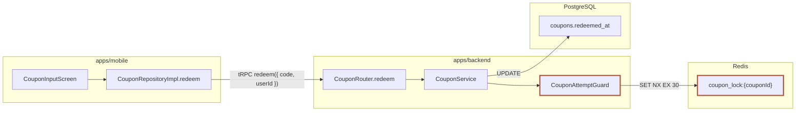

# Document template — Markdown skeleton and sanctioned components

This file owns the document's **shape**. Authors use only the skeleton and components here.
`render.ts` owns style — the structure check (R11) rejects `<style>` blocks or inline `style=`
attributes in the document. It also rejects `class=` values outside the sanctioned list.

Use **한다체 (declarative Korean)** consistently in the body — "저장한다", "확인할 수 있다".
Mixing in 합니다체 causes the measured defect of inconsistent register across documents.

## Skeleton

Section order follows step order. Each step fills its section in the shape below.
**The quiz is not a document section** — it happens in conversation, so do not put `## Quiz` in the skeleton.

```markdown
# <title> — 변경 설명

<ul class="doc-meta">
  <li><strong>목적</strong> <one line stating what this document teaches and why the reader should understand it></li>
  <li><strong>범위</strong> <code><git range></code></li>
  <li><strong>커밋</strong> N개</li>
  <li><strong>파일</strong> signal N / noise N</li>
  <li><strong>줄</strong> +N/-N</li>
</ul>

## Evidence
<signal/noise classification table — step 1>

### 원천
<collected document-source table — step 1's source-sweep result. | 종류 | 식별자/경로 | 확보 | 내용 요약 |, one row each:
issue tickets (Linear, etc.), PR body, changed docs/wiki files in the diff, relevant repo docs, external docs (Notion, etc.).
If read, 확보=열람; if no tool is available, 확보=접근 불가 (record the lead only). If that class truly has none, "없음 — <places checked>">

## Background
### 깊은 배경
이미 익숙하면 건너뛰세요.
<…incorporate system context from the source table here — name the source in parentheses for facts learned from a document…>
### 좁은 배경
<…the state just before this change, the preceding PR, and decision-document content, with source citations…>

## 목표
### 무엇을·왜
<what this change aims to achieve + why it was needed (the problem it solves) — step 3>
### 핵심
<the one-line core the reader should hold before seeing code>
### 출처
<what each source-table entry contributed to this document — one line per entry (R16)>

## Architecture
### 시스템 레벨
<mermaid (edges = short protocols: HTTP/SQL/REST) or "구조 변화 없음: <reason>">
<gloss footnote — `<ul class="gloss"><li><code>노드명</code> — 평이한 뜻</li>…` decoding each code-name node the diagram draws (process/store/mapping-table) that the standing-interface table does not already spell out; a plain-language node needs no entry (쓰기 전에 소개)>
<standing-interface table — exact three-column header/separator and at least one data row; `인터페이스`/`오가는 것` state actual signatures/payloads/response bodies; see below (R17)>
<change-contract table — three axes: 서버 API / DB 스키마 / 클라이언트 의존; see below (R14)>
### 컴포넌트 레벨
<mermaid dependency graph — nodes name modules/concepts (features/use cases/hooks/services); no file paths — or "구조 변화 없음: <reason>">
<arch-entity card per changed behavior node — 패키지 (package path locating it) / 책임 / 인터페이스 / 변경점 (what this diff changed) + change kind; see below (R18)>
### 도메인 레벨
<mermaid (erDiagram/classDiagram) — nodes name real business concepts (no file paths); fill each classDiagram box with member variables/methods — or "구조 변화 없음: <reason>">
<arch-entity per domain object — 책임 (invariants) / 핵심 멤버 / 변경점 (what this diff changed) + change kind; see below (R21)>

## 기능 단위
### <캐피빌리티 이름 — 유스케이스가 나르는 능력. 도메인 함수/리포지토리가 아니다 (R23)>
- **구현체** <the symbol(s) that carry this use-case — a service method / endpoint / script, not a persistence method>
- **버전** {라벨: <codebase version token, e.g. `program-v2`, or `버전 토큰 없음`>, 설명: <신규 | 동일버전 수정 | 버전 전이 vN→vN+1 (before→after 대조) | 폐기> — <what the transition changed>}
- **소속 도메인 + 협력** <owning domain>; <each collaborator tagged `[의존=계약 위임]` or `[직접 핸들링]`, with direction>
- **입구(트리거)** <trigger kind: 스케줄러/HTTP/tRPC/gRPC/메시지/이벤트/스크립트/display/in-tx 내부호출> <진입점> — <인터페이스 signature>. <변경 new|mod|del>
- **영향범위** <blast radius — who reads/depends on this, how failure propagates>

**책임** <only this use-case's own responsibility. A use-case orchestrates domains through their contracts; it does not steal a collaborator's responsibility or absorb a cross-cutting property (transaction/idempotency) that another path owns>

<one sentence naming what the reader verifies with the flow — then a mermaid `sequenceDiagram` (real symbols, mark the step this diff changed) — then 2–3 sentences reading the drawn flow plus its 관련 흐름. If the diff touches a user-facing surface, a user-journey `flowchart` from the user's first action `([사용자: …])` through actual branches (권한 거부/락/재시도) to what they see may replace or accompany the sequence>
<gloss footnote — `<ul class="gloss"><li><code>요소명</code> — 평이한 뜻</li>…` decoding each code-name message/participant the flow draws (`getDisplayCatalog`, a repository method) that no card above already explains; a participant aliased to plain language (`participant Backend as catalog`) needs no entry (쓰기 전에 소개)>

**개념/도메인 모델 연결** <the domain models/concepts this use-case connects>

의존 방향 판정 — <one line: which direction dependencies flow, and whether this change keeps/violates/restores unidirectionality>

## Intuition
<one paragraph on the essence + toy-value example + flow/compare component>

## Commit Journey
<one-line overview — one line per commit, tagged with its destination group. Step 5>
1. `<short-hash>` <type> — <one-line intent> → 그룹 N
2. `<short-hash>` docs — <one line> → 그룹 N (흡수)
(Only when `git rev-list --no-merges <base>..<head>` yields exactly one line, replace the section with:
"단일 커밋 범위 — Commit Journey 생략.")

## Change Group 1: <concern>
> 예고: <what this group will do — group N presupposes group N-1>
> 순서: <why this order>

### `<short-hash>` — <commit title>
<one or two sentences on what this commit did in this group. If it spans multiple groups, one spillover line.>

#### 변경 1: <what this change achieved — name what it did, not a file>
<div class="cf" data-change="mod">
<p><strong><code>Class.method()</code></strong>
   (<one-line placement: what it is in which layer/domain — point to the Architecture card>) —
   <strong>기존</strong> <the symbol's previous responsibility and behavior — complete sentence>.
   <strong>변경</strong> <how this diff changed that responsibility — complete sentence>.</p>
<p><strong><code>otherFn()</code></strong> (<placement>) — <strong>신설</strong> <new responsibility — one 신설 line because there is no prior state>.</p>
<p><strong>왜</strong> — <why this change is needed> <span class="cf-src">근거</span> "<verbatim quote>"</p>
<p><strong>효과·사이드이펙트</strong> — <consequences/side effects of this change — complete sentence></p>
<p><strong>검증</strong> — <the test covering this change and what it locks down></p>
<p class="cf-loc"><strong>바뀐 위치</strong> — <code>base:path/a.ts:12</code>→<code>head:path/a.ts:15</code>,
   <code>base:path/b.ts:40</code>→<code>head:path/b.ts:31</code></p>
</div>

​```ts
// Core logic — the essential lines of this change (one required per change block)
​```

<p><strong>예시 연결</strong> <required for a block traversed by an Intuition example: same input → actual condition/call → intermediate value → result></p>
```

### Carrying an example into Code

Each Intuition example continues in the change block that implements it, immediately
after that block's code fence. A path crossing multiple blocks carries its intermediate
values forward. Blocks outside that path do not require this paragraph.

For example, if Intuition worked through `attempt = 3` and the actual code uses
`attempt < 3`, the paragraph reads:

```html
<p><strong>예시 연결</strong> 앞의 <code>attempt = 3</code>을
<code>nextAction(3)</code>에 넣으면 <code>3 &lt; 3</code>이
<code>false</code>여서 <code>stop</code>을 반환한다.</p>
```

Use the inspected code's own identifiers and values. For a behavior-preserving
refactor, trace the same result through the new owner of the responsibility.
The author checks this cross-section continuity before submitting code; R6 still
judges only the Intuition section, which is submitted before Code exists.

**The unit is the change, and the spine is the commit.** A Change Group (concern) is the first-class
grouping; descend within it by commit (`### \`hash\` — 제목`). Under each commit come its **change
blocks** (`#### 변경 N: <한 일>`); **the block's unit is a change, not a file.** One change comprises
responsibility shifts of several **symbols** (classes/functions edited together), so each change block
has one entry per symbol. **Each entry's subject is the symbol, narrated before→after**:
`<code>심볼</code>` + placement (which layer/domain), followed by **기존** (its previous responsibility
and behavior) and **변경** (how this diff changed them), in complete sentences. A new symbol uses one
**신설** line (its new responsibility) instead of 기존; a removed symbol uses one **삭제** line (where
its responsibility went). Numbering roles as "책임 1 — <역할>" and describing only the post-state leaves
the reader unable to answer "그래서 이전엔 어땠는데?" (a measured defect). Files appear only as location
citations in `바뀐 위치`, never as headings. `왜`, `효과·사이드이펙트`, `검증`, and core code appear once
per change. Absorb docs/noise commits as one line in the group explaining the contract, rather than listing them separately.

## Questions answered by the three Architecture levels

| Level | Question | Recommended mermaid |
|---|---|---|
| 시스템 레벨 | Which **distinct processes, services, deployables, and stores** are involved, and which boundary does this diff touch? | `flowchart` + `subgraph` (boundaries) — name the relevant core resources (modules, stores, mapping tables) through which the change flows inside each subgraph. Show at least two (at most five) when two or more are relevant; exactly one is allowed only when the document names it and explains why there is only one. Mark touched nodes/edges with `:::changed`. |
| 컴포넌트 레벨 | How do dependencies between modules/domains differ before and after the change? | Two `flowchart`s (Before/After), or one distinguishing added/removed edges. |
| 도메인 레벨 | What are the entities, concepts, and invariants, and what changes? | `erDiagram`/`classDiagram`; add a `stateDiagram-v2` if a touched concept has 3+ states or named transitions (lock, retry limit exceeded, confirm, expire), labeling transitions with actual guards. If none truly exists, say so in one line. |

**The system level is about process boundaries.** Function/module call chains within one process
(runtime) belong to the component/domain level, not the system level — do not disguise an in-process
call chain (such as `test → helper → tool`) as a system diagram. If this diff crosses no process/service
boundary, use the `구조 변화 없음: <사유>` marker for the system level.

**Fill each subgraph's interior.** Create a `subgraph` for each involved process/service/store, and
fill it with named nodes for the relevant core resources through which this change flows — modules,
stores, mapping tables. Show at least two (at most five) when two or more are relevant; a subgraph with
exactly one is allowed only when the document names it and explains why there is only one (internal
dependency edges traversed by the change are welcome). A reader should get from one diagram:
system units + each system's core internal composition + contracts between systems. A single node
repeating its subgraph label shows a boundary but no composition — name the actual parts. The boundary
rule above still holds: diffs crossing no boundary use a waiver, and internal nodes cannot replace a cross-process edge.

**Diagrams show more than what the diff changed.** Include unchanged surrounding systems, services,
and components as context when needed to understand this diff. However, (1) every node must actually
exist in the system (no invention), and (2) change markers (`:::changed`/Before-After) must identify
what this diff changed, so context and changes remain distinguishable.

If a level truly has nothing to draw, write one line under it —
`구조 변화 없음: <이 diff가 그 레벨을 건드리지 않는 이유 한 문장>`.
The structure check rejects a marker without a reason.

### System level — change-contract table (R14 required)

The diagram alone cannot answer what changes. Below the system-level diagram (or waiver marker),
place a **table enumerating the contracts this diff changes across three axes**. Describe each changed
contract concretely, or write `변경 없음: <사유>` when it does not apply.

```markdown
| 축 | 이번에 바뀌는 계약 |
|---|---|
| 서버 API | <changed endpoints/tRPC procedures/request-response schemas> |
| DB 스키마 | <changed tables/columns/constraints/indexes, or 변경 없음: <reason>> |
| 클라이언트 의존 | <contracts whose client dependencies must change to match this change> |
```

All three axis labels (`서버 API`, `DB 스키마`, `클라이언트 의존`) must appear in the system level to pass R14.

### System level — standing-interface table (R17 required)

Label diagram edges with **short protocols** only (HTTP, SQL, REST) — long endpoints/queries on edges
break the layout. The **standing-interface table** below the diagram answers which entrances they
communicate through. For each boundary (edge), state the current endpoint/query/screen URL and what
flows across it. This table differs in layer from R14: **R14 = contracts changed by this diff;
R17 = current standing communication interfaces**. Order: diagram → standing-interface table →
change-contract table (context first, delta second).

| 경계 | 인터페이스 | 오가는 것 |
|---|---|---|
| browser → Hono backend | `GET /v1/supplement-catalog?includeDeletedCategories=true` | 표시 카탈로그 |
| Next.js BFF → Python health API | health-profile REST | 부스트팩 원본 |
| backend → PostgreSQL | `supplement_categories` 조회(활성/전체) | 카탈로그 행 |

This must be a **real rendered Markdown table**. Its header and separator row must have exactly
three columns, `경계`, `인터페이스`, and `오가는 것`, with at least one data row below the separator.
Prose column names, a fenced example, or a header/separator-only table do not pass R17.
**The `인터페이스` and `오가는 것` cells state the actual message** — a signature and request/response
body with fields and types, not a naming-convention note such as "camelCase generationRequest"
(for example, `오가는 것` = `{ generationRequest: { userRequest: string, intakeTimeCodes: string[] }, proposalType: enum } → { asyncTaskId: string }`). The value crossing the boundary must be concretely readable.

### Component level — node cards (R18 required)

A component is **one module** — a feature, use case, hook, service, or schema module — not a file.
Diagram **nodes therefore name modules/concepts**, not source file paths (a path tells the reader
where, not what; long paths truncate mid-word in rendering — `health-`, `proposal-`). The card's
`패키지` slot states **where** the component lives at package-path granularity
(`packages/schemas/src/program`, `entities/supplement/api`). This slot holds a directory path, hence
the name 패키지; calling it "레이어" (an architecture layer) misleads readers. R18 rejects file-path nodes.
A dependency graph (mermaid) shows what connects to what, but the node name alone cannot explain what
`CurrentBoostPackInfoCard` does. If component structure truly does not change, a reasoned
`구조 변화 없음: <사유>` waiver can satisfy R18. Otherwise, every authored `arch-entity` card is checked
**independently**. Each must contain **패키지·책임·인터페이스 (functions)·변경점** and
`data-change="new|mod|del"`; one complete card cannot mask an incomplete or invalid one. The
`data-change` badge conveys only the **kind** of change, so **the `변경점` slot states what changed and
how** — describe what this diff did to the component in one before→after line. This prevents the
measured defect of a card explaining responsibility but leaving the actual change unknown. Changes
to pure data/contract types do not permit simply omitting cards; explicitly provide a reasoned waiver
when the structure needs no cards. Prose-only card descriptions or unsupported `data-change` values do not count for R18.

```markdown
<div class="arch-entity" data-change="new">
<p><strong>이름</strong> <code>useSupplementCodeResolver</code></p>
<p><strong>패키지</strong> commerce/entities/supplement/api</p>
<p><strong>책임</strong> 두 카탈로그 query를 묶어 fail-closed 해소기를 카드에 공급</p>
<p><strong>인터페이스</strong> <code>{ resolveAlias, resolveDisplay, areCatalogsSettled }</code></p>
<p><strong>변경점</strong> 해소기 훅 신설 — 기존에는 카드 컴포넌트가 카탈로그 query를 직접 조회해 fail-open이었다</p>
</div>
```

To pass R18, the component level must contain `패키지`/`책임`/`인터페이스`/`변경점` labels and
renderer-recognized `arch-entity`/`data-change` cards (a reasoned waiver may replace cards).
`data-change="new|mod|del"` carries the change kind; render.ts supplies the badge color.

### Domain level — entity cards (R21 required)

The domain level is easily left the thinnest of the three, but **it is the most important level for
readers** — a diagram alone cannot tell them which domain objects this diff added/changed or what
they guarantee. Nodes and cards must be **real business concepts**: things the domain actually models
(a Program, an intake-time slot, a request kind such as onboarding vs regular generation), explained
in the codebase's own domain terms. A schema class name can serve as a domain object **only when its
encoded business concept is explained**; an encoding-only node (`GenerationIntakeTimeCodesSchema`)
without business meaning is not a domain object. **Above** the entity/relation diagram
(`erDiagram`/`classDiagram`), place **one `arch-entity` card per domain object this diff touches**.
Fill each card's three distinct slots:

- **책임** — Describe the object's full picture thoroughly: its duty, invariants, and **the relevant
  business logic it already owns (what it can do)**. Include unchanged responsibilities relevant to
  this diff; readers need that foundation to gauge the change. A one-line summary leaves this level
  thin again. **Do not enumerate member variables in prose** — members belong in the chip slot below
  (unscannable prose enumeration is a measured defect).
- **핵심 멤버** — List member variables, keys, and core methods as **code chips**:
  `<p class="ae-members"><strong>핵심 멤버</strong> <code>userId</code> …</p>`. Apply the `chg` class
  to added/changed members, as in `<code class="chg">has_completed_tutorial</code>`; render.ts draws
  the chips and change colors. The chip tag **must be `<code>`** — `<span>` does not receive chip CSS,
  and backticks inside raw HTML blocks are not converted to Markdown, leaving literal backticks on
  screen (a measured defect). For member-less concepts (value concepts such as request kinds), write
  `핵심 멤버 없음 — <사유>`.
- **변경점** — State **which responsibilities/members above this diff added/changed/deleted**, with
  before→after visible. Responsibility without changes leaves readers unable to answer
  "그래서 뭐가 바뀐 건데?" (a measured defect).

The badge carries the **change kind (`data-change`)**. **Fill every box in an object/class diagram**
with member variables and methods/messages. An empty name-only box teaches nothing, and R21 rejects
member-less `classDiagram`s. In the diagram too, append `←변경` to member lines added/changed by this
diff (`+has_completed_tutorial: boolean ←변경` — verified safe for mmdc rendering). Nodes name domain
concepts, not file paths. If no domain object truly changes, use a `구조 변화 없음: <사유>` waiver instead.

```markdown
### 도메인 레벨
​```mermaid
classDiagram
  class SupplementCategory {
    +code: string
    +displayName: string
    +isActive() bool ←변경
  }
  class ProposalCategoryMirror {
    +categoryCode: string
    +proposalId: string
    +reflects() SupplementCategory
  }
  SupplementCategory "1" <-- "*" ProposalCategoryMirror : identifies
​```

<div class="arch-entity" data-change="mod">
<p><strong>이름</strong> <code>SupplementCategory</code></p>
<p><strong>책임</strong> 영양제의 canonical 정체성을 보유한다 — 판매 여부와 무관한 노출 판정을 이미 제공하고, 판매 상품이 교체돼도 같은 카테고리로 유지되는 불변식을 지킨다.</p>
<p class="ae-members"><strong>핵심 멤버</strong> <code>code</code> <code>displayName</code> <code class="chg">isActive()</code></p>
<p><strong>변경점</strong> <code>isActive()</code>가 삭제 카테고리도 표시용으로 남기도록 바뀌었다 — 기존에는 삭제 즉시 노출에서 제외됐다.</p>
</div>

<div class="arch-entity" data-change="new">
<p><strong>이름</strong> <code>ProposalCategoryMirror</code></p>
<p><strong>책임</strong> 제안이 어떤 카테고리를 바꾸는지 canonical mirror 행으로 표현하고, <code>reflects()</code>로 원본 카테고리를 가리킨다.</p>
<p class="ae-members"><strong>핵심 멤버</strong> <code class="chg">categoryCode</code> <code class="chg">proposalId</code> <code class="chg">reflects()</code></p>
<p><strong>변경점</strong> 개념 자체가 이번 diff로 신설 — 기존에는 제안이 카테고리를 문자열로만 참조해 mirror가 없었다.</p>
</div>
```

To pass R21, the domain level must contain `arch-entity` cards with `책임`/`핵심 멤버`/`변경점`
labels and allowed `data-change` values (a reasoned waiver may replace cards). If a `classDiagram`
is drawn, every box must also contain members/methods.

## 기능 단위 chapters (R15 required)

**What this section is**: a **change map of capabilities (use cases) — created or changed by this
diff**, promoted to top-level `## 기능 단위` with **one `### <capability>` chapter per use-case**. The
system/component/domain levels explained the *parts*; these chapters explain **the capabilities those
parts assemble into and the paths in which they actually run**.

**The three layers — place each part on the right one.** A capability is the middle layer; do not
confuse it with the layer above or below.

| Layer | What it is | Gets a chapter? |
|---|---|---|
| **입구 (trigger)** | what runs the capability: 스케줄러 / HTTP / tRPC / gRPC / 메시지 / 이벤트 / 스크립트 / display / in-tx 내부호출 | No — it is a **slot** (`입구`) of the capability it triggers |
| **기능 단위 (use-case)** | one capability carried end to end — an **orchestrator** of domains through their contracts (Clean-arch use-case / FSD feature / DDD service) | **Yes — one chapter each** |
| **도메인 함수·모델** | a repository/persistence method or domain operation (e.g. `markTutorialCompleted` = "mark completed and persist") | No — it surfaces as a **depended-on collaborator** inside a capability's `소속 도메인 + 협력` slot |

**Inclusion rule: one chapter = one use-case, never a domain/persistence function.** A persistence
method is not a capability just because it has a tRPC/HTTP adapter — its adapter belongs to whichever
use-case orchestrates it. Mistaking a repository method for a capability is a measured defect (RED,
luna max on pr-3619): `markTutorialCompleted` is `user` domain persistence, and the use-case that owns
its orchestration is `ProposalApprovalService`.

**A chapter states only its own responsibility.** A use-case orchestrates the domains it needs through
their contracts; it does not **steal a collaborator's responsibility** or **absorb a cross-cutting
property another path owns**. Describe a transaction boundary / idempotency / consistency inside the
`책임` and flow of the use-case that actually owns it — a version-bumped feature is still the same
feature (compare it across versions; do not treat it as a new one), and "온보딩 완료 기록" does not own
"프로그램 활성화" (that atomicity belongs to the approval path).

**Each chapter carries these header slots** (R15 checks their presence per chapter, plus a flow
diagram; R23 — the judge — checks the semantic discipline the scan cannot see):

- **구현체** — the symbol(s) that carry this use-case (service method / endpoint / script), so the
  reader is not left guessing what an identifier is.
- **버전** — `{라벨: <codebase version token, e.g. \`program-v2\`, or \`버전 토큰 없음\`>, 설명: <분류> — <what changed>}`.
  The 분류 is one of **신규 / 동일버전 수정 / 버전 전이 vN→vN+1 / 폐기**. For a 버전 전이, contrast
  before→after; the 라벨 anchors to a **real version token in the codebase**, not an invented one.
- **소속 도메인 + 협력** — the owning domain, then each collaborator tagged `[의존=계약 위임]` (reached
  through its contract) or `[직접 핸들링]` (handled inside this use-case), with direction.
- **입구(트리거)** — the trigger kind + entry point + interface signature + change kind (new|mod|del).
- **영향범위** — the blast radius: who reads/depends on this capability and how a failure propagates.

Then the **narrative body** (judged, not scanned): **책임** (its own responsibility only), a mermaid
`sequenceDiagram` of the flow with the changed step marked plus 2–3 sentences reading it and its
관련 흐름, **개념/도메인 모델 연결**, and a one-line `의존 방향 판정`. Participants must be real
module/service/function names (R12); if the flow truly does not change, a diff that changes no use-case
uses a section-level `구조 변화 없음: <사유>` waiver in place of chapters.

Follow the two axes of the `architecture-boundaries` rule in vocabulary and principle, but **write
neither methodology names (DDD, FSD, Clean-arch, bounded context) nor axis labels such as `수평`/`수직`
in the output** — name touched areas in the codebase's actual domain terms. R19 scans both the
`## Architecture` and `## 기능 단위` prose for these standalone tokens (ignoring fenced blocks and
inline code; English methodology tokens are case-insensitive).

```markdown
## 기능 단위

### 표시 카탈로그 조회
- **구현체** `SupplementCatalogService.getDisplayCatalog` — 입구 어댑터는 `catalog.router.ts`
- **버전** {라벨: 버전 토큰 없음, 설명: 신규 — 삭제 카테고리까지 포함한 표시용 카탈로그 조회 유스케이스를 추가했다.}
- **소속 도메인 + 협력** commerce 도메인이 소유한다. `resolveDisplay`는 `[의존=계약 위임]`으로 entities resolver에 맡기고, 카탈로그 조립은 `[직접 핸들링]`한다.
- **입구(트리거)** tRPC `catalog.getDisplay` — `getDisplayCatalog(): Promise<Catalog>`. 신규 입구(new).
- **영향범위** 상담챗 카드 렌더가 삭제 카테고리를 포함해 읽는다. 읽기 전용이라 쓰기 계약 변경은 없다.

**책임** 나는 삭제 카테고리까지 포함한 표시용 카탈로그를 조회해 카드에 공급한다. 카탈로그 영속화 자체는 저장소에 위임하고, 판매 여부 판정은 이 유스케이스에 두지 않는다.

표시 카탈로그가 조립되어 상담챗 카드로 돌아가는 흐름을 확인한다.

​```mermaid
sequenceDiagram
  participant Chat as 상담챗 feature
  participant Resolver as entities resolver
  participant Backend as backend catalog
  Chat->>+Resolver: resolveDisplay(code)
  Resolver->>+Backend: GET /v1/supplement-catalog?includeDeletedCategories=true
  Note over Resolver,Backend: 이 diff — 삭제 카테고리까지 포함해 조회
  Backend-->>-Resolver: 표시 카탈로그(삭제 포함)
  Resolver-->>-Chat: 카드용 표시 카탈로그
​```

`Resolver`가 `includeDeletedCategories=true`로 backend를 조회하는 단계가 이 diff로 바뀐다. 관련 흐름인 판매용 카탈로그 조회는 삭제 카테고리를 여전히 제외하므로 이 경로와 분리된다.

**개념/도메인 모델 연결** SupplementCategory의 canonical 정체성과 그 삭제 상태를 표시 판정에 연결한다 — 삭제된 카테고리도 표시용으로는 남는다.

의존 방향 판정 — commerce feature → entities resolver → shared schema → backend REST 단방향 유지. commerce가 catalog 내부 테이블을 직접 조회하지 않고 계약 뒤에 머문다 — 새 순환·경계 침투 없음.
```

R15 checks, **per chapter**, the presence of the `구현체`/`버전`/`소속 도메인`/`입구`/`영향범위` slots
and a mermaid flow diagram (the same presence philosophy as R14). One complete chapter cannot mask an
incomplete one — every `### <capability>` chapter is checked independently. The author fills each
slot's content; R23 judges whether the chapter is a real use-case (not a demoted domain function),
whether it steals a collaborator's responsibility, and whether the version classification is grounded.

## Mermaid authoring rules

- Use a ` ```mermaid ` fence. `render.ts` bakes it into inline SVG through mmdc at build time —
  the resulting HTML remains self-contained, with no external references and no script needed to
  render (its only script is an ESC/Enter shortcut for the zoom overlay that degrades away cleanly).
- Use real system identifiers (service names, module paths, command names) for node labels — invented
  generic nouns ("service"→"DB") fit any diff and fail R12. Context nodes may be unchanged, but nodes/
  edges this diff changed must carry change markers. Judgment (R12) verifies label reality and change
  markers through quotes.
- Standardize change markers on `classDef changed stroke:#b0563a,stroke-width:3px`, but application
  syntax differs by diagram type — combinations outside this table cause parse errors:

  | Type | Application syntax |
  |---|---|
  | `flowchart` | `class order,coupon changed` |
  | `classDiagram` | `cssClass "Foo,Bar" changed` or `class Foo:::changed` in the declaration |
  | `stateDiagram-v2` | `class Active changed` |
  | `erDiagram` | classDef unsupported — identify changed entities in the caption or body |

  ```mermaid
  flowchart LR
    order[OrderCancelService] -->|REVOKE_COUPONS| coupon[coupon-command-handlers]
    coupon --> db[(PostgreSQL)]
    classDef changed stroke:#b0563a,stroke-width:3px
    class order,coupon changed
  ```

- Do not exceed 12 nodes per diagram. Exceeding that signals a wrong level or a need to split into two diagrams.
- Arrange every diagram as **reading goal → picture → interpretation**: one sentence immediately
  above the fence naming a concrete goal the reader can verify with it, and 2–3 sentences immediately
  below interpreting actual drawn nodes/edges (structural facts such as store lifetime differences,
  the edge preserving unidirectionality, or where causal paths merge). Genre descriptions such as
  "이 그림은 흐름을 보여준다" are not goals.
- Draw synchronous `sequenceDiagram` calls with activation pairs — `A->>+B: 호출(인자)` …
  `B-->>-A: 반환값` (or `activate`/`deactivate` pairs). Explicitly mark messages without returns as
  async/fire-and-forget using `A-)B:` or a Note, so readers can distinguish no response by design from
  a missing return edge. Use real symbols verbatim for participant labels, without abbreviation.
- **Double-quote flowchart labels whenever they contain special characters.** Unquoted node/edge
  labels containing parentheses `()`, braces `{}`, colons, or slashes cause parse errors (mmdc fails
  during render): quote the entire label as `"…"`, as in `A -->|"redeem({ code, householdId })"| B`
  and `node["pairing_code:{code}"]`. With this document style's signature/payload labels, it is safe
  to treat virtually every edge label as requiring quotes.
- **Semicolons separate mermaid statements.** A `;` inside label/note text splits the statement and
  causes a parse error — replace it with a comma or `·`; for long notes use the multiline form
  `note right of X` … `end note`.
- **Activations must balance to render.** A `B-->>-A` return must pair with an earlier `A->>+B`
  activation — deactivating without activating makes mmdc fail with
  "Trying to inactivate an inactive participant". Close nested calls from the inside out like a
  stack; for calls drawn without activation, also omit `-` on the return: `B-->>A:`.
- **The classDiagram change marker is inline `:::changed`.** The flowchart bulk assignment
  `class A,B,C changed` causes a classDiagram parse error — attach the marker inline in the class
  declaration, as in `class CardType:::changed` (the `classDef` definition stays the same).

### Worked example — one system-level diagram applying all the rules above

This example uses a fictional domain (coupon redemption). It sets the quality bar for combining
goal sentence → diagram → interpretation, named subgraph resources, quoted contract labels, and change markers in one picture.

이 그림으로 쿠폰 적용 요청이 모바일에서 Node로 넘어간 뒤, 새로 추가된 잠금 키와
기존 쿠폰 테이블 중 어느 쪽을 먼저 만지는지 확인할 수 있다.



이 작례의 범위에서 Redis와 PostgreSQL은 이 흐름에 관련된 핵심 자원이 각각 하나뿐이다 —
Redis는 `coupon_lock:{couponId}` 잠금 키만, PostgreSQL은 `coupons.redeemed_at` 컬럼만
해당하므로 각 subgraph에 하나씩만 실명으로 둔다.

`CouponAttemptGuard`와 `coupon_lock:{couponId}`만 변경 마커를 달고 있어, 이 diff가
검증 경로에 잠금 한 겹을 끼웠을 뿐 `CouponService`→`coupons.redeemed_at`의 기존 쓰기
경로는 그대로임이 그림에서 바로 읽힌다. 잠금 키가 테이블이 아니라 Redis subgraph에
있다는 것이 저장소 수명 차이(TTL 30초 vs 영구 행)를 드러낸다.

## Core-logic code (R13 required)

Show each change block's **core logic** in one code fence — the essential lines of actual diff code,
or pseudocode summarizing them if long. Location anchors alone do not explain what was done. Even
when a change touches several files, one fence revealing its core suffices (the central responsibility's code).

```markdown
​```ts
export const SupplementCostItem = z.strictObject({
  supplementCategoryId: z.uuid(),
  pillCount: z.number().int().positive(),
});
​```
```

- Use the actual file language tag (`ts`, `py`, `sql`, etc.). mermaid is reserved for diagrams; do not use it here.
- Also represent deleted files with a one-line fence such as `# 이 파일은 통째로 삭제된다`.

## Sanctioned components (complete list)

This list is R11's sanctioned set. Classes not listed here cannot be used.

### `doc-meta` — document header metadata

```html
<ul class="doc-meta">
  <li><strong>범위</strong> <code>origin/main...HEAD</code></li>
  <li><strong>커밋</strong> 15개</li>
</ul>
```

### `cf` / `cf-src` / `cf-loc` — field block for one change

Place this immediately below a code-section change block (`#### 변경 N: <한 일>`). It describes
**one change, not a file**. A change comprises several **responsibilities** (duties of classes/functions
changed together), so each responsibility row takes its owning symbol as subject and opens with
`<code>심볼</code>`. State the symbol's placement (which layer/domain), then write `<strong>기존</strong>`
and `<strong>변경</strong>` as complete sentences in the same `<p>`. New symbols use `<strong>신설</strong>`
instead of 기존; removed symbols use `<strong>삭제</strong>`. Below that, write `왜`,
`효과·사이드이펙트`, and `검증` once per change in complete sentences. Keep provenance outside prose
in `cf-src` badges, and locations in `cf-loc` slots. `data-change` carries the change-kind badge
(신설·변경·삭제); render.ts supplies its colors and labels — authors provide only `new`/`mod`/`del`.
Use `<strong>` for field labels; Markdown `**…**` does not work inside divs. `cf-loc` is a **location
citation**, not a flow; the use-case-level sequence diagram shows flow.

`start` passes the supplied range string unchanged to `git diff` and stores unified-diff hunk
metadata, preserving `A...B` merge-base diff semantics. Only `git rev-list` commit enumeration
normalizes `A...B` to `A..B`. At `code` submission, textual hunk ranges are checked **per file**;
a changed file with no textual hunk uses its legacy anchor presence/placeholder fallback, rather than
being rejected as globally missing even when other files have hunks. Numeric anchors parse the final
`:<number>` suffix and count only when the preceding path matches the enclosing file block's path,
so paths with spaces are compared as whole paths too. `base:…:1 → head:…:1` is valid for a real
first-line hunk. When metadata is absent or that file has no textual hunk, legacy fallback still
rejects modified files' `:1 → :1` placeholders. Added files need only `head:`, deleted files only
`base:`; a zero-count side has no file lines and therefore no anchor. Confirm locations in the captured hunk headers.

```html
<div class="cf" data-change="mod">
<p><strong><code>SupplementCostItem</code></strong> (packages/schemas의 commerce 비용 계약, 서버·클라이언트가 공유) — <strong>기존</strong> 두 식별자 축을 함께 허용했다. <strong>변경</strong> <code>supplementCategoryId</code> 단독 strict 계약으로 축소한다.</p>
<p><strong><code>parseSupplementCostRequest()</code></strong> (packages/schemas의 비용 요청 파서) — <strong>기존</strong> product 축이 섞인 비용 요청도 파싱할 수 있었다. <strong>변경</strong> category 축만 받아 구 요청을 파싱 단계에서 거부한다.</p>
<p><strong>왜</strong> — 비용 계약의 두 축 공존을 끝내고 category 하나로 고정하기 위해
   <span class="cf-src">근거</span> "feat!: 카테고리 축으로 고정"</p>
<p><strong>효과·사이드이펙트</strong> — 이미 배포된 구 클라이언트가 product 축으로 보내는
   비용 요청은 검증 단계에서 거부되므로, 클라이언트도 category 축으로 함께 올려야 한다.</p>
<p><strong>검증</strong> — <code>supplement-cost.test.ts</code> 가 category 단독 통과와
   product 축 혼입 거부를 함께 고정한다.</p>
<p class="cf-loc"><strong>바뀐 위치</strong> — <code>base:packages/schemas/src/commerce/supplement-cost.ts:8</code>→<code>head:packages/schemas/src/commerce/supplement-cost.ts:6</code></p>
</div>
```

The `cf-src` badge text is one of three: `근거` (verbatim source in the diff/commit/comment, followed
by a quote), `추론` (inferred from code, followed by the inference ground), or `Unknown / not supplied`
(no reachable ground; leave it an open question). R3 rejects a 왜 field without this provenance tag.

### `arch-entity` — structural card for one architecture node

This component carries **component-level nodes (R18)** and **domain-level objects (R21)**. (The
`## 기능 단위` chapters are not cards — they are `### <capability>` subsections with header slots; see
that section above.) It uses the same `<p><strong>라벨</strong> 값>` field convention as `cf`, with the
change kind in `data-change` supplying a badge. render.ts owns badge text and colors; authors provide
only the kind (`new`/`mod`/`del`). Required labels vary by section (component: `패키지`/`책임`/`인터페이스`/`변경점`;
domain: `책임`/`핵심 멤버`/`변경점`). Under R18, every authored component-level card must satisfy
these fields independently; one valid card cannot compensate for another card's missing/invalid fields.

```html
<div class="arch-entity" data-change="new">
<p><strong>이름</strong> <code>useSupplementCodeResolver</code></p>
<p><strong>패키지</strong> commerce/entities/supplement/api</p>
<p><strong>책임</strong> fail-closed 해소기를 카드에 공급</p>
<p><strong>인터페이스</strong> <code>{ resolveAlias, resolveDisplay, areCatalogsSettled }</code></p>
<p><strong>변경점</strong> 해소기 훅 신설 — 기존에는 카드 컴포넌트가 카탈로그 query를 직접 조회해 fail-open이었다</p>
</div>
```

`data-change` is one of `new` (added), `mod` (modified), or `del` (deleted). A renderer-recognized
`arch-entity` opening tag must carry an allowed value to count as a card for R15/R18. Do not write
colors/styles directly in the artifact (R11) — provide the kind and render.ts supplies colors.

### `flow` / `flow-step` / `flow-arrow` — one-dimensional step strip

Use only for **things flowing in one line**, such as chronological or call order. Use mermaid when boundaries/branches are needed.

```html
<div class="flow">
  <div class="flow-step">주문 O-123<br>취소 커밋</div><span class="flow-arrow">→</span>
  <div class="flow-step"><code>REVOKE_COUPONS</code></div><span class="flow-arrow">→</span>
  <div class="flow-step">U-9 회수<br><code>1200 차감</code></div>
</div>
```

### `compare` / `compare-before` / `compare-after` — before/after comparison cards

CSS supplies BEFORE/AFTER labels — do not write them yourself.

```html
<div class="compare">
  <div class="compare-before">렌탈 종료 코드가 쿠폰 서비스를 직접 조립했다.</div>
  <div class="compare-after">모든 취소 경로가 <code>REVOKE_COUPONS</code> 하나를 보낸다.</div>
</div>
```

### `callout` — emphasis box

Use only for one-paragraph cautions or key points. Overuse defeats emphasis.

```html
<p class="callout">개별 usage 실패는 계속 처리하지만, 목록 조회 실패는 전체 경계 실패다.</p>
```

### `diagram` — diagram wrapper with caption

render.ts automatically wraps mermaid blocks in `<figure class="diagram">`.
Write the wrapper yourself only when adding a caption:

```html
<figure class="diagram">
  <!-- (When inserting a component combination other than mermaid) -->
  <figcaption>회수 커맨드의 경계</figcaption>
</figure>
```

### `gloss` — "이 그림의 요소" footnote decoding a diagram's code-name elements

Place **directly under a mermaid diagram** whose nodes/messages carry raw code identifiers a
no-context reader cannot decode from the picture (a `sequenceDiagram`'s messages, a 시스템 레벨
`flowchart`'s process/store nodes). One `<li>` per code-name element drawn — the element in
`<code>`, then a plain-language reading. Skip an element already spelled out by an `arch-entity`
card (R18/R21) or already aliased to plain language in the diagram (`participant Backend as catalog`);
this footnote is for the identifiers the cards do not reach. render.ts supplies the "이 그림의 요소"
label — do not write it yourself (쓰기 전에 소개).

```html
<ul class="gloss">
  <li><code>getDisplayCatalog</code> — 삭제된 카테고리까지 포함해 표시용 카탈로그를 읽는 조회</li>
  <li><code>ProgramActivationTx</code> — 프로그램을 활성화하는 단일 DB 트랜잭션</li>
</ul>
```
