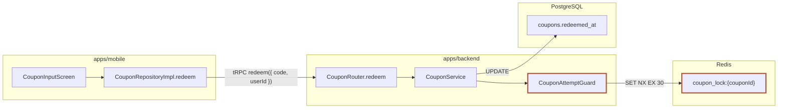

# 문서 템플릿 — 마크다운 골격과 승인된 컴포넌트

이 파일이 문서의 **모양**을 소유한다. 저자는 여기 있는 골격과 컴포넌트만 쓴다.
스타일은 `render.ts`가 소유한다 — 문서 안에 `<style>` 블록이나 인라인 `style=` 속성을
쓰면 구조 검사(R11)가 거부한다. 승인 목록 밖의 `class=` 값도 같은 이유로 거부된다.

본문 어체는 **한다체(평서형)** 로 통일한다 — "저장한다", "확인할 수 있다". 합니다체를
섞으면 문서 집합 안에서 어체가 갈라지는 실측 결함이 된다.

## 골격

섹션 순서는 스텝 순서와 같다. 각 스텝이 자기 섹션을 아래 모양대로 채운다.
**퀴즈는 문서 섹션이 아니다** — 대화로 진행하므로 골격에 `## Quiz`를 쓰지 않는다.

```markdown
# <제목> — 변경 설명

<ul class="doc-meta">
  <li><strong>목적</strong> <이 문서가 무엇을 가르치고 왜 이해해야 하는지 한 줄></li>
  <li><strong>범위</strong> <code><git range></code></li>
  <li><strong>커밋</strong> N개</li>
  <li><strong>파일</strong> signal N / noise N</li>
  <li><strong>줄</strong> +N/-N</li>
</ul>

## Evidence
<signal/noise 분류표 — 스텝 1>

### 원천
<수집한 문서 원천 표 — 스텝 1의 원천 스윕 결과. | 종류 | 식별자/경로 | 확보 | 내용 요약 | 한 행씩:
이슈 티켓(Linear 등), PR 본문, diff 안의 docs/wiki 변경 파일, 레포 관련 문서, 외부 문서(Notion 등).
열람했으면 확보=열람, 도구가 없으면 확보=접근 불가(실마리만 기록). 해당 종류가 정말 없으면 "없음 — <확인한 곳>">

## Background
### 깊은 배경
이미 익숙하면 건너뛰세요.
<…원천 표에서 얻은 시스템 맥락을 여기에 녹인다 — 문서가 알려준 사실에는 그 원천을 괄호로 지목…>
### 좁은 배경
<…이 변경 직전의 상태·직전 PR·결정 문서 내용을 원천 인용과 함께…>

## 목표
### 무엇을·왜
<이 변경이 이루려는 것 + 왜 필요했는가(해결하는 문제) — 스텝 3>
### 핵심
<코드를 보기 전에 독자가 먼저 쥐어야 할 핵심 한 줄>
### 출처
<원천 표의 각 항목이 이 문서에 무엇을 제공했는지 — 항목별 한 줄 (R16)>

## Architecture
### 시스템 레벨
<mermaid(간선=짧은 프로토콜: HTTP/SQL/REST) 또는 "구조 변화 없음: <사유>">
<상시 인터페이스 표 — 정확한 3열 헤더·구분선과 최소 1개 데이터 행, `인터페이스`·`오가는 것`은 시그니처/페이로드/응답 바디를 실제로 적는다, 아래 참조 (R17)>
<변경 계약 표 — 서버 API / DB 스키마 / 클라이언트 의존 3축, 아래 참조 (R14)>
### 컴포넌트 레벨
<mermaid 의존 그래프 — 노드는 모듈/개념 이름(피처·유스케이스·훅·서비스), 파일 경로 금지 — 또는 "구조 변화 없음: <사유>">
<변경 행위 노드마다 arch-entity 카드 — 패키지(어디에 있는지 패키지 경로) / 책임 / 인터페이스 / 변경점(이 diff로 무엇이 바뀌었나) + 변경종류, 아래 참조 (R18)>
### 도메인 레벨
<mermaid(erDiagram/classDiagram) — 노드는 실재 비즈니스 개념 이름(파일 경로 금지), classDiagram이면 각 박스에 멤버 변수·메소드를 채운다 — 또는 "구조 변화 없음: <사유>">
<도메인 객체마다 arch-entity — 책임(불변식) + 변경종류, 아래 참조 (R21)>

### 경계·의존·유스케이스
<유스케이스 오케스트레이션 mermaid sequenceDiagram(흐름 + 바뀐 단계) 또는 waiver>
<사용자 대면 표면(화면·입력·표시·알림·진입점)을 건드린 diff면: 사용자 여정 flowchart —
 사용자의 첫 행동 `([사용자: …])`에서 시작해 실제로 겪는 분기(권한 거부·잠금·재시도)를
 지나 최종적으로 보게 되는 것까지; 바뀐 단계 표시 — 없으면 없음을 한 줄로>
<동작 단위마다 arch-entity — 변경종류 + 한 일 + 영향 인터페이스, + 의존 방향 판정 한 줄 — 아래 참조 (R15)>

## Intuition
<본질 한 문단 + toy 값 예시 + flow/compare 컴포넌트>

## Commit Journey
<한 줄 오버뷰 — 커밋마다 한 줄, 어느 그룹으로 가는지 태그. 스텝 5>
1. `<short-hash>` <타입> — <한 줄 의도> → 그룹 N
2. `<short-hash>` docs — <한 줄> → 그룹 N (흡수)
(`git rev-list --no-merges <base>..<head>`가 정확히 한 줄일 때만 섹션 대신:
"단일 커밋 범위 — Commit Journey 생략.")

## Change Group 1: <관심사>
> 예고: <이 그룹이 무엇을 할지 — 그룹 N은 그룹 N-1을 전제>
> 순서: <왜 이 순서인지>

### `<short-hash>` — <커밋 제목>
<이 커밋이 이 그룹에서 한 일 한두 문장. 여러 그룹을 가로지르면 spillover 한 줄.>

#### 변경 1: <이 변경이 이룬 것 — 파일명이 아니라 "한 일"로 짓는다>
<div class="cf" data-change="mod">
<p><strong><code>Class.method()</code></strong>
   (<어느 레이어·도메인의 무엇인지 한 줄 배치 — 아키텍처 섹션 카드를 가리킨다>) —
   <strong>기존</strong> <이 심볼이 지던 책임과 동작 — 완결 문장>.
   <strong>변경</strong> <이번 diff로 그 책임이 어떻게 달라졌는지 — 완결 문장>.</p>
<p><strong><code>otherFn()</code></strong> (<배치>) — <strong>신설</strong> <새로 지는 책임 — 기존이 없으므로 신설 한 줄>.</p>
<p><strong>왜</strong> — <이 변경이 필요한 이유> <span class="cf-src">근거</span> "<원문 인용>"</p>
<p><strong>효과·사이드이펙트</strong> — <이 변경이 부른 결과·부작용 — 완결 문장으로></p>
<p><strong>검증</strong> — <이 변경을 고정하는 테스트와, 그 테스트가 무엇을 잠그는지></p>
<p class="cf-loc"><strong>바뀐 위치</strong> — <code>base:path/a.ts:12</code>→<code>head:path/a.ts:15</code>,
   <code>base:path/b.ts:40</code>→<code>head:path/b.ts:31</code></p>
</div>

​```ts
// 핵심 로직 — 이 변경의 핵심 몇 줄 (변경 블록마다 하나 필수)
​```
```

**단위는 변경(change)이고, 뼈대는 커밋이다.** Change Group(관심사)이 1급 묶음이고, 그 안에서
커밋 단위로 내려간다(`### \`hash\` — 제목`). 커밋 아래에는 그 커밋이 이룬 **변경 블록**
(`#### 변경 N: <한 일>`)이 오며, **파일이 아니라 변경이 블록의 단위다.** 하나의 변경은 여러
**심볼**(함께 바뀌는 class·function)의 책임 변화로 이뤄지므로, 한 변경 블록은 심볼마다 항목
하나를 둔다. **각 항목의 주어는 심볼이고, 서술은 전→후다**: `<code>심볼</code>` + 배치(어느
레이어·도메인) 뒤에 **기존**(이 심볼이 지던 책임과 동작)과 **변경**(이번 diff로 어떻게
달라졌는지)을 완결 문장으로 잇는다. 처음 생기는 심볼은 기존 대신 **신설**(새로 지는 책임)
한 줄, 사라지는 심볼은 **삭제**(지던 책임이 어디로 갔는지) 한 줄이다. "책임 1 — <역할>"처럼
번호와 역할명만 붙이고 후상태만 서술하면 독자는 "그래서 이전엔 어땠는데?"를 알 수 없다(실측
결함). 파일은 heading이 아니라 `바뀐 위치` 슬롯의 위치 인용으로만 등장한다.
`왜`·`효과·사이드이펙트`·`검증`·핵심 코드는 변경 레벨에 하나씩 붙는다. docs·noise
커밋은 별도 나열하지 않고 계약을 설명하는 그룹 안에서 한 줄로 흡수한다.

## Architecture 세 레벨이 각각 답하는 질문

| 레벨 | 질문 | 권장 mermaid |
|---|---|---|
| 시스템 레벨 | 어떤 **서로 다른 프로세스·서비스·배포 단위·저장소**가 관여하고, 이 diff는 그중 어느 경계에 닿는가 | `flowchart` + `subgraph`(경계) — 각 subgraph 안에 그 시스템에서 변경이 흐르는 관련 핵심 자원(모듈·저장소·매핑 테이블)을 실명으로 채운다 — 관련 자원이 2개 이상이면 최소 2개(최대 5개)를, 정확히 1개뿐이면 그 하나와 하나뿐인 이유를 문서에 명시할 때만 허용한다; 변경이 닿는 노드/간선에 `:::changed` |
| 컴포넌트 레벨 | 모듈·도메인 사이 의존이 변경 전후로 어떻게 달라지는가 | `flowchart` 두 개(Before/After) 또는 한 개에 추가/제거 간선 구분 |
| 도메인 레벨 | 엔티티·개념·불변식이 무엇이고 무엇이 바뀌는가 | `erDiagram`/`classDiagram`; 건드린 개념에 3+ 상태나 명명된 전이(잠금·재시도 초과·확정·만료)가 있으면 `stateDiagram-v2`를 추가로 그린다(전이 라벨=실제 가드) — 정말 없으면 없음을 한 줄로 적는다 |

**시스템 레벨은 프로세스 경계다.** 한 프로세스(런타임) 안의 함수·모듈 호출 체인은 시스템이
아니라 컴포넌트/도메인 레벨이다 — 인-프로세스 콜체인(예: `test → helper → tool`)을 시스템
그림으로 위장하지 않는다. 이 diff가 어떤 프로세스·서비스 경계도 넘지 않으면 시스템 레벨은
`구조 변화 없음: <사유>` 마커를 쓴다.

**subgraph 내부를 채운다.** 관여하는 프로세스·서비스·저장소마다 `subgraph`를 만들고, 그
안에 그 시스템에서 이 변경이 흐르는 관련 핵심 자원 — 모듈·저장소·매핑 테이블 — 을 실명
노드로 채운다. 관련 자원이 2개 이상이면 최소 2개(최대 5개)를, 정확히 1개뿐인 subgraph는
그 하나와 하나뿐인 이유를 문서에 명시할 때만 채운다(변경 흐름이 지나는 내부 의존 간선도 환영).
독자가 한 그림에서 얻어야 하는 것:
시스템 단위 + 각 시스템의 내부 핵심 구성 + 시스템 사이 계약. subgraph 라벨을 되풀이하는
단일 노드는 경계만 보여주고 구성을 보여주지 못한다 — 실제 부품을 이름으로 채운다. 위
경계 규칙은 그대로다: 경계를 넘지 않는 diff는 여전히 waiver를 쓰고, 내부 노드가
크로스-프로세스 간선을 대신하지 못한다.

**다이어그램은 "diff가 바꾼 것"만 그리는 게 아니다.** 이 diff를 이해하는 데 필요한 범위라면
변경되지 않은 주변 시스템·서비스·컴포넌트도 맥락으로 그린다. 대신 (1) 모든 노드는 실제
시스템에 존재하는 실물이어야 하고(발명 금지), (2) 그중 이 diff로 무엇이 바뀌었는지를 반드시
변경 표시(`:::changed`/Before-After)로 지목한다 — 맥락과 변경분이 섞이지 않게 한다.

레벨에 그릴 것이 정말 없으면 그 레벨 아래 한 줄로 적는다 —
`구조 변화 없음: <이 diff가 그 레벨을 건드리지 않는 이유 한 문장>`.
사유 없는 마커는 구조 검사가 거부한다.

### 시스템 레벨 — 변경 계약 표 (R14 필수)

다이어그램만으로는 "무엇이 바뀌는가"에 답하지 못한다. 시스템 레벨은 다이어그램(또는
생략 마커) 아래에 **이번 diff가 바꾸는 계약을 세 축으로 열거하는 표**를 둔다. 각 축은
바뀌는 계약을 구체적으로 적거나, 해당 없으면 `변경 없음: <사유>`로 채운다.

```markdown
| 축 | 이번에 바뀌는 계약 |
|---|---|
| 서버 API | <바뀌는 엔드포인트·tRPC 프로시저·요청/응답 스키마> |
| DB 스키마 | <바뀌는 테이블·컬럼·제약·인덱스, 또는 변경 없음: <사유>> |
| 클라이언트 의존 | <이 변경에 맞춰 클라이언트가 의존을 바꿔야 하는 계약> |
```

세 축 라벨(`서버 API`·`DB 스키마`·`클라이언트 의존`)이 시스템 레벨 안에 모두 있어야
R14를 통과한다.

### 시스템 레벨 — 상시 인터페이스 표 (R17 필수)

다이어그램의 간선은 **짧은 프로토콜**(HTTP·SQL·REST)만 얹는다 — 긴 엔드포인트·쿼리를
간선 라벨로 박으면 레이아웃이 무너진다. "어떤 입구로 소통하는가"는 다이어그램 아래
**상시 인터페이스 표**가 답한다. 각 경계(간선)가 지금 어떤 엔드포인트·쿼리·화면 URL로
통신하고 무엇이 오가는지 적는다. 이 표는 R14와 층이 다르다 — **R14 = 이번에 바뀌는 계약,
R17 = 지금 소통하는 상시 인터페이스**. 순서는 다이어그램 → 상시 인터페이스 표 → 변경 계약 표
(맥락 먼저, 델타 나중).

| 경계 | 인터페이스 | 오가는 것 |
|---|---|---|
| browser → Hono backend | `GET /v1/supplement-catalog?includeDeletedCategories=true` | 표시 카탈로그 |
| Next.js BFF → Python health API | health-profile REST | 부스트팩 원본 |
| backend → PostgreSQL | `supplement_categories` 조회(활성/전체) | 카탈로그 행 |

이 표는 **실제로 렌더되는 Markdown 표**여야 한다. 헤더와 separator row는 정확히 세 열
`경계`·`인터페이스`·`오가는 것`이어야 하고, separator 아래에 최소 한 개의 데이터 행이
있어야 한다. 산문으로 열 이름만 쓰거나 펜스 안 예시, 헤더·separator만 있는 표로
대체하면 R17을 통과하지 못한다. **`인터페이스`와 `오가는 것` 칸은 실제 메시지를 적는다** —
"camelCase generationRequest" 같은 명명 규칙 메모가 아니라, 시그니처와 요청/응답 바디를 필드·타입으로
쓴다(예: `오가는 것` = `{ generationRequest: { userRequest: string, intakeTimeCodes: string[] }, proposalType: enum } → { asyncTaskId: string }`). 무엇이 경계를 넘는 값인지 구체적으로 읽혀야 한다.

### 컴포넌트 레벨 — 노드 카드 (R18 필수)

컴포넌트는 **하나의 모듈**이다 — 피처·유스케이스·훅·서비스·스키마 모듈 — 파일이 아니다.
그래서 다이어그램 **노드는 모듈/개념 이름**이지 소스 파일 경로가 아니다(경로를 노드로 쓰면 독자에게
위치만 알려주고 무엇인지는 못 알려주며, 긴 경로는 렌더에서 중간이 잘린다 — `health-`, `proposal-`).
컴포넌트가 **어디에 있는지**는 카드의 `패키지` 슬롯이 패키지 경로 단위로 말한다
(`packages/schemas/src/program`, `entities/supplement/api`) — 이 슬롯의 내용물은 디렉터리
경로이므로 이름도 패키지다(아키텍처 계층을 뜻하는 "레이어"라고 부르면 독자를 속인다).
노드가 파일 경로면 R18이 거부한다.
의존 그래프(mermaid)는 "무엇이 무엇에 연결되나"를 그리지만, 노드 이름만으로는
`CurrentBoostPackInfoCard` 가 무엇을 하는지 읽히지 않는다. 컴포넌트 구조가 정말 바뀌지
않는다면 그 이유를 담은 `구조 변화 없음: <사유>` waiver로 R18을 충족할 수 있다. 그 외에는
작성한 모든 `arch-entity` 카드를 **각각 독립적으로** 검사받는다. 각 카드에
**패키지·책임·인터페이스(함수)·변경점** 필드와 `data-change="new|mod|del"` 를 둬야 하며,
완전한 카드 하나가 불완전하거나 잘못된 다른 카드를 가릴 수 없다. `data-change` 배지는
변경의 **종류**만 나르므로, **무엇이 어떻게 바뀌었는지는 `변경점` 슬롯이 말한다** — 이
diff가 이 컴포넌트에 한 일을 전→후가 드러나게 한 줄로 적는다("책임은 아는데 정작 뭐가
바뀌었는지는 모르는" 카드가 이 슬롯이 막는 실측 결함이다). 순수 데이터/계약 타입만
바뀌었다는 이유로 카드를 그냥 생략할 수는 없으며, 카드가 필요 없는 구조라면 reasoned
waiver를 명시해야 한다. 산문만으로 카드를 설명하거나 허용되지 않은 `data-change` 값을
쓰면 R18에 포함되지 않는다.

```markdown
<div class="arch-entity" data-change="new">
<p><strong>이름</strong> <code>useSupplementCodeResolver</code></p>
<p><strong>패키지</strong> commerce/entities/supplement/api</p>
<p><strong>책임</strong> 두 카탈로그 query를 묶어 fail-closed 해소기를 카드에 공급</p>
<p><strong>인터페이스</strong> <code>{ resolveAlias, resolveDisplay, areCatalogsSettled }</code></p>
<p><strong>변경점</strong> 해소기 훅 신설 — 기존에는 카드 컴포넌트가 카탈로그 query를 직접 조회해 fail-open이었다</p>
</div>
```

`패키지`·`책임`·`인터페이스`·`변경점` 라벨과 renderer-recognized `arch-entity`·`data-change`
카드가 컴포넌트 레벨 안에 있어야 R18을 통과한다(단, reasoned waiver는 카드 대신 허용된다).
변경종류는 `data-change="new|mod|del"` 로 나르고 배지 색은 render.ts가 붙인다.

### 도메인 레벨 — 엔티티 카드 (R21 필수)

도메인 레벨은 세 레벨 중 가장 얇게 방치되기 쉽지만, **독자에게는 가장 중요한 레벨이다** —
다이어그램 하나로 끝내면 독자는 어떤 도메인 객체가 이 diff로 추가·변경됐고 그것이 무엇을
보장하는지 읽지 못한다. 노드와 카드는 **실재 비즈니스 개념**이어야 한다 — 도메인이 실제로
모델링하는 것(Program, 섭취 시간대 슬롯, 온보딩 vs 일반 생성 같은 요청 종류)을, 코드베이스
자신의 도메인 용어로 푼다. 스키마 클래스 이름은 **그것이 인코딩하는 비즈니스 개념을 설명할
때에만** 도메인 객체로 쓸 수 있다 — 비즈니스 의미 없이 인코딩 이름만 있는 노드
(`GenerationIntakeTimeCodesSchema`)는 도메인 객체가 아니다. 엔티티/관계 다이어그램
(`erDiagram`/`classDiagram`) **위에**, 이 diff가 건드린 **도메인 객체마다 `arch-entity`
카드**를 둔다. 각 카드는 세 슬롯을 나눠 채운다:

- **책임** — 이 객체의 온전한 모습을 힘을 다해 서술한다: 지는 duty와 불변식, 그리고
  **이미 보유한 관련 비즈니스 로직(무엇을 할 줄 아는지)** 까지. 변경과 무관한 기존 책임도
  이 diff와 관련된 것이라면 적는다 — 독자는 그 바탕 위에서만 변경의 크기를 잰다. 한 줄
  요약으로 때우면 이 레벨이 다시 얇아진다. **멤버 변수를 산문 안에 늘어놓지 않는다** —
  멤버는 아래 칩 슬롯의 몫이다(산문 나열은 스캔이 안 되는 실측 결함).
- **핵심 멤버** — 멤버 변수·키·핵심 메소드를 **코드 칩 나열**로 적는다:
  `<p class="ae-members"><strong>핵심 멤버</strong> <code>userId</code> …</p>`. 이번 diff가
  추가/변경한 멤버는 `<code class="chg">has_completed_tutorial</code>`처럼 `chg` 클래스로
  변경색을 입힌다(render.ts가 칩과 변경색을 그린다). 칩 태그는 **반드시 `<code>`다** —
  `<span>`은 칩 CSS가 적용되지 않고, raw HTML 블록 안의 백틱은 마크다운으로 변환되지 않아
  화면에 백틱 문자가 그대로 노출된다(실측 결함). 멤버가 없는 개념(요청 종류 같은 값
  개념)이면 `핵심 멤버 없음 — <사유>`로 채운다.
- **변경점** — 위 책임·멤버 중 **무엇이 이번 diff로 추가·변경·삭제됐는지**를 전→후가
  드러나게 적는다. 책임은 서술했는데 변경점이 없으면 독자는 "그래서 뭐가 바뀐 건데?"에
  답을 못 얻는다(실측 결함).

**변경종류(`data-change`)** 는 배지로 나른다. **객체/클래스 다이어그램을 그리면 각 박스를
채운다** — 멤버 변수와 메소드/메시지. 이름만 있는 빈 박스는 아무것도 가르치지 못하고, 멤버
없는 `classDiagram`은 R21이 거부한다. 다이어그램 안에서도 이번 diff가 추가/변경한 멤버
라인 끝에 `←변경`을 붙여 지목한다(`+has_completed_tutorial: boolean ←변경` — mmdc 렌더
안전 확인됨). 노드는 도메인 개념 이름이지 파일 경로가 아니다.
도메인 객체가 정말 안 바뀌면 `구조 변화 없음: <사유>` waiver로 대신한다.

```markdown
### 도메인 레벨
​```mermaid
classDiagram
  class SupplementCategory {
    +code: string
    +displayName: string
    +isActive() bool ←변경
  }
  class ProposalCategoryMirror {
    +categoryCode: string
    +proposalId: string
    +reflects() SupplementCategory
  }
  SupplementCategory "1" <-- "*" ProposalCategoryMirror : identifies
​```

<div class="arch-entity" data-change="mod">
<p><strong>이름</strong> <code>SupplementCategory</code></p>
<p><strong>책임</strong> 영양제의 canonical 정체성을 보유한다 — 판매 여부와 무관한 노출 판정을 이미 제공하고, 판매 상품이 교체돼도 같은 카테고리로 유지되는 불변식을 지킨다.</p>
<p class="ae-members"><strong>핵심 멤버</strong> <code>code</code> <code>displayName</code> <code class="chg">isActive()</code></p>
<p><strong>변경점</strong> <code>isActive()</code>가 삭제 카테고리도 표시용으로 남기도록 바뀌었다 — 기존에는 삭제 즉시 노출에서 제외됐다.</p>
</div>

<div class="arch-entity" data-change="new">
<p><strong>이름</strong> <code>ProposalCategoryMirror</code></p>
<p><strong>책임</strong> 제안이 어떤 카테고리를 바꾸는지 canonical mirror 행으로 표현하고, <code>reflects()</code>로 원본 카테고리를 가리킨다.</p>
<p class="ae-members"><strong>핵심 멤버</strong> <code class="chg">categoryCode</code> <code class="chg">proposalId</code> <code class="chg">reflects()</code></p>
<p><strong>변경점</strong> 개념 자체가 이번 diff로 신설 — 기존에는 제안이 카테고리를 문자열로만 참조해 mirror가 없었다.</p>
</div>
```

`책임`·`핵심 멤버`·`변경점` 라벨과 허용된 `data-change` 를 가진 `arch-entity` 카드가 도메인
레벨 안에 있어야 R21을 통과한다(reasoned waiver는 카드 대신 허용된다). `classDiagram`을
그렸다면 각 박스의 멤버·메소드도 채워야 한다.

## 경계·의존·유스케이스 블록 (R15 필수)

**이 블록의 정체**: 이 diff가 만들거나 바꾼 **유스케이스 — 진입점에서 저장소까지 끝에서
끝으로 이어지는 실행 경로 — 의 변경 지도**다. 시스템/컴포넌트/도메인 레벨이 "부품"을
설명했다면, 이 블록은 **부품들이 조립되어 실제로 실행되는 경로**를 설명한다. 수록 기준:
**카드 하나 = 실행 단위 하나** — 서비스 메서드, HTTP 엔드포인트, 배치 스크립트, 훅처럼
호출되어 실행되는 것만 카드가 된다. 트랜잭션 경계·멱등성·일관성 같은 **횡단 속성은 독립
카드가 될 수 없다** — 그 속성을 보유한 실행 단위 카드의 `한 일` 안에서 서술한다("온보딩
승인 트랜잭션" 같은 속성 이름의 카드는 정체 불명이 되는 실측 결함이다). 각 카드의 `한 일`
첫 문장은 **그 단위의 정체를 밝히며 시작한다** — 무엇(서비스 메서드인지 엔드포인트인지
스크립트인지)이고 어느 모듈 소유인지. 식별자만 던져진 카드(`update_onboarding_status`가
뭔지 독자가 추측해야 하는 카드)는 실패다.

피처·유스케이스는 대개 **오케스트레이션의 책임**을 지므로, 이 블록의 무게중심은
**흐름**이다 — "누가 누구를 어떤 순서로 부르고, 그중 어느 단계가 이 diff로 바뀌었나". 그 흐름을
**mermaid `sequenceDiagram`으로 그리고**(정적 카드로 말로 때우지 않는다), 바뀐 단계를 `Note`나
`:::changed`로 지목한다. 그 위에 동작 단위마다 `arch-entity`로 한 일·영향 인터페이스를 얹고,
의존 방향을 한 줄로 판정한다.

- **오케스트레이션 다이어그램** — 유스케이스의 호출 흐름을 `sequenceDiagram`(권장)으로 그린다.
  참가자는 실재 모듈·서비스·함수 이름이어야 하고(R12), 이 diff가 바꾼 단계를 표시한다. 흐름이
  정말 안 바뀌면 `구조 변화 없음: <사유>` waiver로 대신한다. (R15가 이 블록에 mermaid 또는
  waiver가 있는지 검사한다.)
- **동작 단위** — 이 변경이 추가/삭제/변경한 **실행 단위**마다 `arch-entity` 하나. 변경종류는
  `data-change`, 각 단위는 **한 일(첫 문장에 정체·소유 모듈) + 영향 인터페이스**를 적는다. 어휘·원리는
  `architecture-boundaries` rule의 2축을 따르되 **방법론 이름(DDD·FSD·Clean-arch·bounded context)도,
  `수평`/`수직` 같은 축 라벨도 산출물에 쓰지 않는다** — 이 diff가 닿은 곳을 코드베이스 실제 도메인
  이름으로 적는다(부품을 수평/수직 격자에 분류하는 게 아니라). R19가 명칭과 축 라벨을 모두 검사한다.
- **의존 방향 판정** — 의존이 어느 방향으로 흐르는지, 이 변경이 단방향을 유지·위반·복원하는지
  한 줄로 판정한다. reach-in·역참조·순환은 결합 결함으로 플래그한다. `의존 방향` 라벨이 있어야 한다.

R19는 렌더되는 `## Architecture` 산문만 검사한다. fenced block과 inline-code 예시는 무시하고,
방법론·축 토큰이 식별자 안에 묻힌 경우가 아닌 **standalone token**일 때만 거부한다(영문 방법론
토큰은 대소문자를 구분하지 않는다).

```markdown
### 경계·의존·유스케이스

> 유스케이스 — 부스트팩 상담챗이 표시 카탈로그를 읽어 카드를 그리는 흐름. 아래 시퀀스의
> backend 조회 단계가 이 diff로 바뀐다.

​```mermaid
sequenceDiagram
  participant Chat as 상담챗 feature
  participant Resolver as entities resolver
  participant Backend as backend catalog
  Chat->>+Resolver: resolveDisplay(code)
  Resolver->>+Backend: GET /v1/supplement-catalog?includeDeletedCategories=true
  Note over Resolver,Backend: 이 diff — 삭제 카테고리까지 포함해 조회
  Backend-->>-Resolver: 표시 카탈로그(삭제 포함)
  Resolver-->>-Chat: 카드용 표시 카탈로그
​```

<div class="arch-entity" data-change="new">
<p><strong>이름</strong> display catalog 조회</p>
<p><strong>한 일</strong> backend catalog 라우터가 소유한 HTTP 조회 엔드포인트다 — 삭제 카테고리까지 포함한 표시용 카탈로그 경로를 신설하고, 조회는 단일 트랜잭션 없이 읽기 전용으로 동작한다.</p>
<p><strong>영향 인터페이스</strong> <code>GET /v1/supplement-catalog?includeDeletedCategories=true</code></p>
</div>

**의존 방향** — commerce feature → entities resolver → shared schema → backend REST 단방향 유지.
commerce가 catalog 내부 테이블을 직접 조회하지 않고 계약 뒤에 머문다 — 새 순환·경계 침투 없음.
```

R15는 펜스를 마스킹한 실제 블록에서 `영향 인터페이스`·`의존 방향` 슬롯과 허용된
`data-change="new|mod|del"` 를 가진 renderer-recognized `arch-entity`의 **존재**를 검사한다
(R14와 같은 철학) — 각 칸이 말하는 내용은 저자가 채운다. 산문 속 `data-change` 언급이나
허용되지 않은 값은 카드로 세지 않는다. 펜스 안 예시는 마스킹되므로 위 예시를 그대로 두는
것으로는 통과하지 못한다 — 실제 변경 내용으로 블록을 문서에 써야 한다.

## mermaid 작성 규칙

- ` ```mermaid ` 펜스로 쓴다. `render.ts`가 빌드 타임에 mmdc로 인라인 SVG로 굽는다 —
  산출 HTML은 여전히 런타임 JS 없이 자기완결이다.
- 노드 라벨에는 실제 시스템에 실재하는 식별자(서비스명·모듈 경로·커맨드명)를 쓴다 — 발명한
  일반 명사("service"→"DB")는 어떤 diff에도 들어맞아 R12에서 탈락한다. 맥락 노드는 변경되지
  않아도 좋지만, 이 diff가 바꾼 노드/간선에는 반드시 변경 표시를 단다. 심사(R12)가 라벨의
  실재성과 변경 표시를 인용으로 검증한다.
- 변경 표시는 `classDef changed stroke:#b0563a,stroke-width:3px` 하나로 통일하되,
  적용 문법은 다이어그램 타입마다 다르다 — 아래 표 밖의 조합은 파스 에러가 난다:

  | 타입 | 적용 문법 |
  |---|---|
  | `flowchart` | `class order,coupon changed` |
  | `classDiagram` | `cssClass "Foo,Bar" changed` 또는 선언에 `class Foo:::changed` |
  | `stateDiagram-v2` | `class Active changed` |
  | `erDiagram` | classDef 미지원 — 변경 엔티티는 캡션이나 본문에서 지목 |

  ```mermaid
  flowchart LR
    order[OrderCancelService] -->|REVOKE_COUPONS| coupon[coupon-command-handlers]
    coupon --> db[(PostgreSQL)]
    classDef changed stroke:#b0563a,stroke-width:3px
    class order,coupon changed
  ```

- 한 다이어그램에 노드 12개를 넘기지 않는다. 넘치면 레벨을 잘못 골랐거나
  두 장으로 나눌 신호다.
- 모든 다이어그램은 **읽는 목표 → 그림 → 해석** 3부로 놓는다: 펜스 바로 위에 이 그림으로
  독자가 검증할 구체 목표 한 문장, 바로 아래에 실제로 그려진 노드·간선을 지목하는 해석
  2–3문장(저장소 수명 차이, 단방향을 지키는 간선, 원인 경로의 합류 지점 같은 구조적 사실).
  "이 그림은 흐름을 보여준다" 류 장르 설명은 목표가 아니다.
- `sequenceDiagram`의 동기 호출은 activation 쌍으로 그린다 — `A->>+B: 호출(인자)` …
  `B-->>-A: 반환값` (또는 `activate`/`deactivate` 쌍). 반환이 없는 메시지는 `A-)B:` 또는
  Note로 async/fire-and-forget임을 명시해, 독자가 "설계상 무응답"과 "반환 간선 누락"을
  구분할 수 있게 한다. participant 라벨은 실재 심볼을 줄이지 않고 그대로 쓴다.
- **flowchart의 라벨은 특수문자가 들어가는 순간 큰따옴표로 감싼다.** 괄호 `()`·중괄호
  `{}`·콜론·슬래시가 든 노드/간선 라벨은 미인용이면 파스 에러다(mmdc가 render 단계에서
  죽는다): `A -->|"redeem({ code, householdId })"| B`, `node["pairing_code:{code}"]`처럼
  라벨 전체를 `"…"`로 감싼다. 시그니처·페이로드를 라벨에 적는 이 문서 스타일에서는
  사실상 모든 간선 라벨이 인용 대상이라고 보면 안전하다.
- **세미콜론은 mermaid 문장 구분자다.** 라벨·note 텍스트 안에 `;`를 쓰면 그 지점에서
  문장이 쪼개져 파스 에러가 난다 — 쉼표나 `·`로 바꾸고, note 텍스트가 길면
  `note right of X` … `end note` 다중행 형태를 쓴다.
- **activation은 균형이 맞아야 렌더된다.** `B-->>-A` 반환은 반드시 그에 앞선 `A->>+B`
  활성화와 짝이다 — activate 없이 deactivate하면 mmdc가
  "Trying to inactivate an inactive participant"로 죽는다. 중첩 호출은 스택처럼
  안쪽부터 닫고, activation 없이 그리는 호출은 반환도 `-` 없이 `B-->>A:`로 쓴다.
- **classDiagram의 변경 마커는 `:::changed` 인라인이다.** flowchart의
  `class A,B,C changed` 일괄 지정 문법은 classDiagram에서 파스 에러다 — classDiagram은
  선언부에 `class CardType:::changed`처럼 인라인으로 붙인다(`classDef` 정의는 동일).

### 작례 — 위 규칙이 전부 적용된 시스템 레벨 한 장

가공 도메인(쿠폰 적용)의 예다. 목표 문장 → 그림 → 해석 3부, subgraph 내부의 실명
자원, 인용된 계약 라벨, 변경 마커가 한 장에서 어떻게 만나는지의 기준 품질이다.

이 그림으로 쿠폰 적용 요청이 모바일에서 Node로 넘어간 뒤, 새로 추가된 잠금 키와
기존 쿠폰 테이블 중 어느 쪽을 먼저 만지는지 확인할 수 있다.



이 작례의 범위에서 Redis와 PostgreSQL은 이 흐름에 관련된 핵심 자원이 각각 하나뿐이다 —
Redis는 `coupon_lock:{couponId}` 잠금 키만, PostgreSQL은 `coupons.redeemed_at` 컬럼만
해당하므로 각 subgraph에 하나씩만 실명으로 둔다.

`CouponAttemptGuard`와 `coupon_lock:{couponId}`만 변경 마커를 달고 있어, 이 diff가
검증 경로에 잠금 한 겹을 끼웠을 뿐 `CouponService`→`coupons.redeemed_at`의 기존 쓰기
경로는 그대로임이 그림에서 바로 읽힌다. 잠금 키가 테이블이 아니라 Redis subgraph에
있다는 것이 저장소 수명 차이(TTL 30초 vs 영구 행)를 드러낸다.

## 핵심 로직 코드 (R13 필수)

변경 블록마다 그 변경의 **핵심 로직**을 코드 펜스 하나로 보여준다 — 실제 diff 코드의
핵심 몇 줄이거나, 그것이 길면 수도코드로 요약한다. 위치 앵커만으로는 "무엇을 했나"가
읽히지 않는다. 한 변경이 여러 파일을 건드려도 코드 펜스는 그 변경의 핵심을 드러내는 하나면
된다(가장 중심이 되는 책임의 코드).

```markdown
​```ts
export const SupplementCostItem = z.strictObject({
  supplementCategoryId: z.uuid(),
  pillCount: z.number().int().positive(),
});
​```
```

- 언어 태그는 실제 파일 언어를 쓴다(`ts`·`py`·`sql` 등). mermaid는 다이어그램 전용이므로
  여기 쓰지 않는다.
- 삭제된 파일도 `# 이 파일은 통째로 삭제된다` 같은 한 줄 펜스로 표시한다.

## 승인된 컴포넌트 (전체 목록)

이 목록이 R11의 승인 집합이다. 여기 없는 클래스는 쓰지 못한다.

### `doc-meta` — 문서 머리 메타

```html
<ul class="doc-meta">
  <li><strong>범위</strong> <code>origin/main...HEAD</code></li>
  <li><strong>커밋</strong> 15개</li>
</ul>
```

### `cf` / `cf-src` / `cf-loc` — 변경 하나의 필드 블록

코드 섹션의 변경 블록(`#### 변경 N: <한 일>`) 바로 아래에 온다. **파일이 아니라 변경 하나**를
설명하는 블록이다. 한 변경은 여러 **책임**(함께 바뀐 class·function의 duty)으로 이뤄지므로
각 책임 행은 그 책임을 지는 심볼을 주어로 삼아 `<code>심볼</code>`로 시작한다. 심볼이 어느
레이어·도메인에 사는지(배치)를 밝힌 뒤 같은 `<p>` 안에 `<strong>기존</strong>`과
`<strong>변경</strong>`을 각각 완결 문장으로 쓴다. 처음 생기는 심볼은 기존 대신
`<strong>신설</strong>`, 사라지는 심볼은 `<strong>삭제</strong>`를 쓴다. 그 아래
`왜`·`효과·사이드이펙트`·`검증`은 변경 레벨에 하나씩, 완결 문장으로 쓴다. 출처는 `cf-src` 배지로, 위치는 `cf-loc` 슬롯으로
산문 밖에 둔다. 변경종류(신설·변경·삭제) 배지는 `data-change` 로 싣고 색·라벨은 render.ts가
붙인다 — 저자는 `new`·`mod`·`del` 종류만 준다. 필드 라벨은 `<strong>` 으로 쓴다 — 마크다운
`**…**` 는 div 안에서 살지 않는다. `cf-loc` 슬롯은 흐름이 아니라 **위치 인용**이다 — 흐름은
유스케이스 레벨의 시퀀스 다이어그램이 보여준다.

`start`는 전달받은 range 문자열을 그대로 `git diff`에 넘겨 unified diff hunk 메타데이터를
저장한다. 따라서 `A...B`의 merge-base diff 의미가 보존된다. `git rev-list` 커밋 열거만
`A...B`를 `A..B`로 정규화한다. `code` 제출 때는 텍스트 hunk 범위를 **파일별로** 검사하며,
다른 파일에 hunk가 있어도 텍스트 hunk가 없는 변경 파일은 전역 누락으로 거부하지 않고 그
파일에 legacy 앵커 존재/플레이스홀더 fallback을 적용한다. 숫자 앵커는 마지막 `:<number>`
suffix를 파싱하고, 그 앞의 경로가 감싸는 파일 블록의 경로와 일치할 때만 인정하므로 공백이
있는 경로도 파일 전체 경로로 비교한다. 실제 첫 줄 hunk라면 `base:…:1 → head:…:1`도 유효하다.
메타데이터가 없거나 해당 파일에 텍스트 hunk가 없을 때는 legacy fallback이 수정 파일의
`:1 → :1` 플레이스홀더를 계속 거부한다. 신규 파일은 `head:`만, 삭제 파일은 `base:`만
필요하고, zero-count side에는 파일 줄이 없으므로 그쪽 앵커도 없다. 위치는 캡처된 hunk
헤더에서 확인한다.

```html
<div class="cf" data-change="mod">
<p><strong><code>SupplementCostItem</code></strong> (packages/schemas의 commerce 비용 계약, 서버·클라이언트가 공유) — <strong>기존</strong> 두 식별자 축을 함께 허용했다. <strong>변경</strong> <code>supplementCategoryId</code> 단독 strict 계약으로 축소한다.</p>
<p><strong><code>parseSupplementCostRequest()</code></strong> (packages/schemas의 비용 요청 파서) — <strong>기존</strong> product 축이 섞인 비용 요청도 파싱할 수 있었다. <strong>변경</strong> category 축만 받아 구 요청을 파싱 단계에서 거부한다.</p>
<p><strong>왜</strong> — 비용 계약의 두 축 공존을 끝내고 category 하나로 고정하기 위해
   <span class="cf-src">근거</span> "feat!: 카테고리 축으로 고정"</p>
<p><strong>효과·사이드이펙트</strong> — 이미 배포된 구 클라이언트가 product 축으로 보내는
   비용 요청은 검증 단계에서 거부되므로, 클라이언트도 category 축으로 함께 올려야 한다.</p>
<p><strong>검증</strong> — <code>supplement-cost.test.ts</code> 가 category 단독 통과와
   product 축 혼입 거부를 함께 고정한다.</p>
<p class="cf-loc"><strong>바뀐 위치</strong> — <code>base:packages/schemas/src/commerce/supplement-cost.ts:8</code>→<code>head:packages/schemas/src/commerce/supplement-cost.ts:6</code></p>
</div>
```

`cf-src` 배지 텍스트는 셋 중 하나다 — `근거`(diff·커밋·주석에 원문이 있을 때, 뒤에 인용),
`추론`(코드에서 추론될 때, 뒤에 추론 근거), `Unknown / not supplied`(도달 근거 없음, 열린
질문으로 남긴다). 이 출처 태그가 왜 필드에 없으면 R3가 거부한다.

### `arch-entity` — 아키텍처 노드·동작단위 하나의 구조 카드

컴포넌트 레벨의 노드(R18)와 경계 블록의 동작 단위(R15)가 함께 쓰는 단일 컴포넌트다. `cf`와 같은
`<p><strong>라벨</strong> 값>` 필드 규칙에, 변경종류를 `data-change` 속성으로 실어 배지를 붙인다 —
배지 텍스트·색은 render.ts가 소유하므로 저자는 종류(`new`·`mod`·`del`)만 준다. 어느 라벨이 필수인지는
섹션마다 다르다(컴포넌트: `패키지`·`책임`·`인터페이스`·`변경점` / 경계: `한 일`·`영향 인터페이스`). R18에서는
컴포넌트 레벨에 작성한 모든 카드가 이 필드를 각각 충족해야 하며, 한 유효 카드가 다른 카드의
누락·무효 필드를 대신하지 않는다.

```html
<div class="arch-entity" data-change="new">
<p><strong>이름</strong> <code>useSupplementCodeResolver</code></p>
<p><strong>패키지</strong> commerce/entities/supplement/api</p>
<p><strong>책임</strong> fail-closed 해소기를 카드에 공급</p>
<p><strong>인터페이스</strong> <code>{ resolveAlias, resolveDisplay, areCatalogsSettled }</code></p>
<p><strong>변경점</strong> 해소기 훅 신설 — 기존에는 카드 컴포넌트가 카탈로그 query를 직접 조회해 fail-open이었다</p>
</div>
```

`data-change` 는 `new`(신설)·`mod`(변경)·`del`(삭제) 셋 중 하나다. renderer-recognized
`arch-entity` opening tag가 이 허용값을 가져야 R15/R18의 카드로 인정된다. 산출물에 색·style을
직접 쓰지 않는다(R11) — 종류만 주면 render.ts가 색을 붙인다.

### `flow` / `flow-step` / `flow-arrow` — 1차원 단계 스트립

시간 순서·호출 순서 등 **한 줄로 흐르는 것**에만 쓴다. 경계·분기가 필요하면 mermaid.

```html
<div class="flow">
  <div class="flow-step">주문 O-123<br>취소 커밋</div><span class="flow-arrow">→</span>
  <div class="flow-step"><code>REVOKE_COUPONS</code></div><span class="flow-arrow">→</span>
  <div class="flow-step">U-9 회수<br><code>1200 차감</code></div>
</div>
```

### `compare` / `compare-before` / `compare-after` — 전후 대비 카드

BEFORE/AFTER 라벨은 CSS가 붙인다 — 직접 쓰지 않는다.

```html
<div class="compare">
  <div class="compare-before">렌탈 종료 코드가 쿠폰 서비스를 직접 조립했다.</div>
  <div class="compare-after">모든 취소 경로가 <code>REVOKE_COUPONS</code> 하나를 보낸다.</div>
</div>
```

### `callout` — 강조 박스

한 문단짜리 주의·핵심 강조에만. 남발하면 강조가 아니다.

```html
<p class="callout">개별 usage 실패는 계속 처리하지만, 목록 조회 실패는 전체 경계 실패다.</p>
```

### `diagram` — 캡션 있는 다이어그램 래퍼

mermaid 블록은 render.ts가 자동으로 `<figure class="diagram">`로 감싼다.
캡션을 달고 싶을 때만 직접 쓴다:

```html
<figure class="diagram">
  <!-- (mermaid가 아닌 컴포넌트 조합을 넣을 때) -->
  <figcaption>회수 커맨드의 경계</figcaption>
</figure>
```
