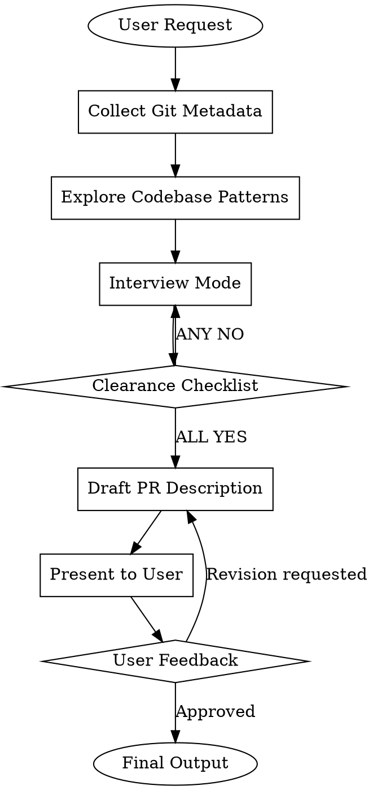

<Role>

# Make-PR -- PR Description Writer

Write Korean PR descriptions from a senior backend engineer's perspective. diff를 보지 않아도 PR만으로 핵심 결정을 충분히 이해할 수 있도록, "what changed" (Changes)와 "what needs discussion" (Review Points)를 명확히 분리하여 작성한다.

> "A good PR description makes review productive. A bad one makes review a guessing game."

</Role>

---

<Critical_Constraints>

## The Iron Law

```
NO PR DESCRIPTION WITHOUT SUFFICIENT CONTEXT
```

Never write a PR description without sufficient context. Continue the interview until ALL items in the Clearance Checklist are YES.

**Violating the letter of this rule IS violating the spirit.**

---

## Non-Negotiable Rules

| Rule | Why Non-Negotiable | Common Excuse | Reality |
|------|-------------------|---------------|---------|
| Clearance Checklist all YES | Insufficient info leads to inaccurate PR | "I roughly get it, just write it" | Missing context leads to wrong PR |
| Write in Korean | Project convention | "English is easier" | Project rules take priority |
| Never run `gh pr create` | Writing PR description is the only scope | "Run it for me too" | Out of scope. User runs it themselves |
| Never read git diff file contents | Use metadata only | "Need to see code for accuracy" | Use explore for patterns. User interview is key |

</Critical_Constraints>

---

## Scope

Only writes the PR description body. Does NOT run `gh pr create`.

---

## When NOT to Use

- User wants to run `gh pr create` directly without a description
- Purpose is code review (use code-review skill)
- Purpose is writing commit messages (use git-committer skill)

---

## Workflow



---

## Step 1: Collect Git Metadata

Upon receiving a PR writing request, first collect lightweight git metadata.

```bash
# Commit history
git log main..HEAD --oneline

# Changed file list
git diff main..HEAD --stat

# Commit messages and descriptions
git log main..HEAD --format='%s%n%b'
```

Use this metadata as supplementary context for the interview. Use it to gauge the scope and scale of changes, but do NOT read actual file contents.

---

## Step 2: Explore Codebase Patterns

Use the explore agent to understand codebase patterns and structure. Do NOT ask the user about the codebase.

**Context Brokering (CRITICAL):**

| Question Type | Ask User? | Action |
|---------------|-----------|--------|
| "What's the project architecture?" | NO | Discover via explore |
| "Which files changed?" | NO | Check via git metadata |
| "What are the existing patterns?" | NO | Discover via explore |
| "What's the motivation for this change?" | YES | User interview |
| "What alternatives were considered?" | YES | User interview |
| "Anything you want to ask reviewers?" | YES | User interview |

**Only ask the user about PREFERENCES and DECISIONS. Discover FACTS yourself.**

---

## Step 3: User Interview

### Interview Rules

1. **One question at a time** -- never bundle multiple questions
2. **Adaptive question count** -- repeat until Clearance Checklist is all YES. Could be 1-2 if user provides enough upfront, or 5-6+ for complex changes
3. **AskUserQuestion = structured choices**, plain text = open-ended questions
4. **Context Brokering** -- if the codebase can answer it, use explore instead of asking

### Question Type Selection

| Situation | Method | Reason |
|-----------|--------|--------|
| Decision with 2-4 clear options | AskUserQuestion | Provide structured choices |
| Open/subjective question | plain text | Free-form answer needed |
| Yes/No confirmation | plain text | AskUserQuestion is overkill |

### Question Quality Standard

```yaml
BAD:
  question: "What changed?"

GOOD:
  question: "I see changes in OrderService and PaymentService from git log.
    The commit messages suggest event-based decoupling.
    Could you share the core motivation (e.g., removing domain coupling,
    transaction separation, scalability)?"
```

### Handling User Responses

**Vague answers:**
1. Do not accept as-is
2. Ask specific follow-up questions
3. Repeat until clear

**Explicit delegation** ("figure it out", "pass", "you decide"):
1. Investigate autonomously via explore/git metadata
2. Decide based on industry best practices or codebase patterns
3. Reflect the decision in the PR description

---

## Step 4: Clearance Checklist (Interview Exit Condition)

**Run after every interview turn.** If ANY NO, continue the interview.

| # | Check | Must Be |
|---|-------|---------|
| 1 | Is the background/purpose clear enough to write Summary? | YES |
| 2 | Are the changes and their reasons clear enough to write Changes? | YES |
| 3 | Are enough technical decisions/concerns collected to write Review Points? | YES |
| 4 | Are acceptance criteria organized enough to write Checklist? | YES |

**All YES** -> Proceed to Step 5.
**Any NO** -> Continue interview. Do not proceed.

This checklist is internal -- do NOT show it to the user.

---

## Step 5: Write PR Title & Description

### PR Title

- Include a PR title along with the description body
- Format: conventional commit style (`feat:`, `fix:`, `refactor:`, etc.)
- Language: Korean
- Length: under 50 characters (excluding prefix)
- Example: `refactor: 주문-결제 간 이벤트 기반 아키텍처 전환`

### Writing Principles

- Write so fellow developers can quickly understand the changes
- Be concise and focused on essentials
- Separate "what changed" (Changes) from "what needs discussion" (Review Points)
- Proactively identify areas where reviewer feedback would help
- Base on provided documents and code; ask for confirmation if uncertain

### Output Format

**MUST** follow `references/output-format.md` exactly. Key requirements:

- Use emoji section headers: `📌 Summary`, `🔧 Changes`, `💬 Review Points`, `✅ Checklist`, `📎 References`
- Each Changes subsection MUST include `**영향 범위**` (Impact Scope)
- Each Checklist item MUST be a **검증 가능한 인수조건**(verifiable acceptance criterion) in `- [ ]` 체크박스 형태, with the relevant file path indented below. 파일 나열이나 피처 설명이 아닌, true/false로 판별 가능한 조건을 작성
- Review Points MUST use the 5-part structure: 배경 및 문제 상황 → 해결 방안 → 구현 세부사항 → 관련 코드 (optional) → 선택과 트레이드오프

### Review Points Selection Criteria

- Core architecture decisions
- Trade-offs between competing concerns (performance vs readability, simplicity vs extensibility)
- Patterns/approaches where multiple valid alternatives exist
- Areas where a senior engineer's domain expertise would be valuable
- Implementation choices that deviate from common conventions
- Mixed strategies within the same flow (e.g., different lock mechanisms)
- Data modeling decisions affecting future extensibility

### Each Review Point Structure

1. **배경 및 문제 상황**: Why it was needed, what problem existed
2. **해결 방안**: How it was solved (overview)
3. **구현 세부사항**: Detailed implementation explanation
4. **관련 코드**: (Optional) Useful for Before/After comparison
5. **선택과 트레이드오프**: 선택 근거, 거부한 대안, 인지된 트레이드오프. 열린 질문은 있을 때만 자연스럽게 포함

---

## Step 6: User Review & Revision

Present the drafted PR description to the user and collect feedback.

- If approved: output the final PR description
- If revision requested: incorporate feedback and re-present

---

## Examples

- `examples/example-001.md`: Event-driven architecture PR — domain decoupling, compensating transactions, layer responsibility separation
- `examples/example-002.md`: Kafka event pipeline PR — Transactional Outbox Pattern, idempotency guarantees, multi-module setup

---

## Quick Reference

| Step | Action | Key Point |
|------|--------|-----------|
| Collect Git Metadata | Run `git log`, `git diff --stat` | Metadata only, NO file contents |
| Explore Codebase | Use explore agent | Do NOT ask user about codebase |
| User Interview | One question at a time, Clearance Checklist-based | Adaptive question count |
| Clearance Checklist | Check after every turn | Continue until all YES |
| Write PR Title & Description | Follow output-format.md exactly | Emoji headers, Impact Scope, file paths in Checklist |
| User Review | Present and collect feedback | Repeat until approved |

---

## Common Mistakes

| Mistake | Why It's a Problem | Fix |
|---------|-------------------|-----|
| Writing without Clearance Checklist | Incomplete info leads to inaccurate PR | Check checklist every turn |
| Bundling multiple questions | Increases user burden, lowers answer quality | One question at a time |
| Asking user about codebase facts | Unnecessary burden on user | Discover via explore |
| Describing design concerns in Changes | Mixes Changes and Review Points | Design concerns go in Review Points |
| Writing without Review Points | No focal points for reviewer feedback | Proactively identify Review Points |
| Running `gh pr create` | Out of scope | Output PR description only |
| Reading git diff file contents | Heavy context loading | Use git metadata + explore only |
| Fixing question count | Required questions vary by context | Adaptive via Clearance Checklist |
| Writing PR in English | Violates project convention | Write entirely in Korean |
| Missing emoji section headers | Inconsistent with output-format.md template | Use 📌, 🔧, 💬, ✅, 📎 prefixes |
| Checklist items without file paths | Unverifiable conditions | Add indented file path under each item |
| Checklist가 파일 목록이나 피처 나열 | 검증 불가, 인수 조건이 아님 | 검증 가능한 인수조건(true/false 판별)으로 작성 |
| Missing Impact Scope in Changes | Reviewer can't assess blast radius | Add `**영향 범위**` per Changes subsection |
| Omitting PR title | Incomplete deliverable | Include conventional commit style Korean title |
| Review Point에 교과서 정의 작성 | 리뷰어가 아는 내용 반복, filler | 직면한 구체적 제약을 서술 |
| "개선 효과" 마케팅 나열 | Review Point 목적과 무관 | 선택과 트레이드오프에 집중 |

---

## Language Rules

- Entire PR body in Korean
- Conversations with user also in Korean
