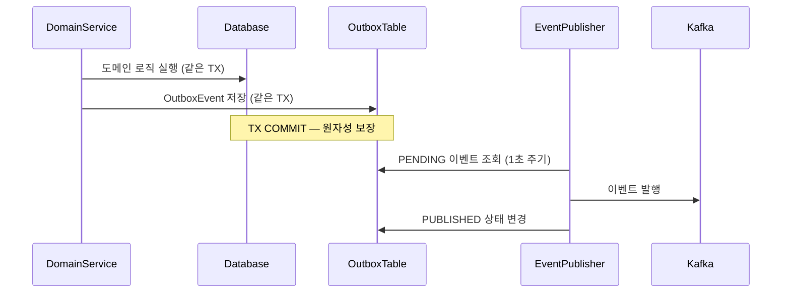

> this is example
---
# feat: Kafka 이벤트 파이프라인 기반 상품 메트릭 집계 서비스 구현

## 📌 Summary
API 서비스(`commerce-api`)에서 발생하는 도메인 이벤트를 Kafka 파이프라인으로 독립 집계 서비스(`commerce-streamer`)에 전달하여, 좋아요 수·판매량·조회 수를 실시간으로 집계하는 구조를 구현했습니다. 도메인 트랜잭션과 Kafka 발행의 원자성을 Transactional Outbox Pattern으로 보장하고, Consumer 측에서는 `event_handled` 테이블과 `version` 필드로 멱등성을 확보했습니다.

---

## 🔧 Changes

### Producer (commerce-api)

- Transactional Outbox Pattern 기반 이벤트 발행 파이프라인 구현
- 도메인 이벤트(ApplicationEvent)를 OutboxEvent로 변환하여 DB에 저장
- 스케줄러가 1초 주기로 PENDING 이벤트를 Kafka로 발행

기존 도메인 이벤트 시스템(Spring ApplicationEvent)은 JVM 내부에서만 동작했다. 외부 서비스(commerce-streamer)와의 통신이 필요해지면서, 기존 내부 이벤트 흐름을 수정하지 않고 `OutboxBridgeEventListener`가 ApplicationEvent를 수신하여 OutboxEvent로 변환하는 브릿지 방식을 채택했다. 이를 통해 도메인 트랜잭션과 Kafka 발행의 원자성을 Outbox Pattern으로 보장한다.

**영향 범위**
- `commerce-api` 모듈에 Outbox 관련 엔티티/서비스/스케줄러 추가
- 기존 도메인 이벤트 발행 흐름에는 영향 없음 (브릿지 리스너가 별도로 Outbox 변환)

### Consumer (commerce-streamer)

- 새 모듈(`commerce-streamer`) 추가: Kafka 이벤트 수취 및 상품 메트릭 집계
- `event_handled` 테이블 + `version` 필드 기반 멱등성 보장
- Manual Ack으로 이벤트 처리 성공 후에만 offset 커밋

상품별 좋아요 수, 판매량, 조회 수를 실시간으로 집계하기 위한 독립 서비스다. API 서비스와 분리하여 집계 장애가 주문/결제에 영향을 주지 않도록 했다.

**영향 범위**
- 신규 모듈이므로 기존 서비스에 직접적 영향 없음
- Kafka 토픽 3개 추가: `like-events`, `order-events`, `product-events`

### Kafka 설정 (modules/kafka)

- Producer: `acks=all`, `enable.idempotence=true`로 At Least Once 보장
- Consumer: `auto.offset.reset=latest`, Manual Ack으로 수동 커밋
- 파티션 키: `like-events`/`product-events` → `productId`, `order-events` → `orderId`

외부 시스템과의 통신이므로 DB에서 직접 검증할 수 없어, Producer 설정(`acks=all`, `enable.idempotence=true`)으로 메시지 유실을 방지하고 Consumer 측 멱등 처리로 중복을 방지하는 구조를 택했다. Consumer는 자동 커밋을 비활성화하고 Manual Ack으로 이벤트 처리 성공 후에만 offset을 커밋하여, 처리 실패 시 재처리가 가능하도록 했다.

**영향 범위**
- 공유 Kafka 모듈에 설정 추가. 기존 Consumer가 없으므로 호환성 문제 없음

---

## 💬 Review Points

> 각 포인트는 저자의 기술적 선택과 트레이드오프를 담고 있습니다.
> diff를 보지 않아도 PR의 핵심 결정을 이해할 수 있도록 작성되었습니다.

### 1. Transactional Outbox Pattern 구현 방식의 적절성

**배경 및 문제 상황:**
기존 commerce-api의 도메인 이벤트는 Spring ApplicationEvent로 JVM 내부에서만 동작했다. commerce-streamer가 추가되면서 같은 이벤트를 외부로도 전달해야 했는데, 도메인 서비스에서 직접 Kafka로 발행하면 도메인 트랜잭션과 Kafka 발행의 원자성이 깨진다. 예를 들어, 주문 생성 트랜잭션이 성공했지만 Kafka 발행이 실패하면 집계 서비스는 해당 주문 이벤트를 받지 못하고, 반대로 Kafka 발행 후 트랜잭션이 롤백되면 존재하지 않는 주문의 이벤트가 전달되는 문제가 있었다.

**해결 방안:**
Transactional Outbox Pattern을 적용했다. 도메인 트랜잭션과 같은 트랜잭션에서 `OutboxEvent`를 DB에 저장하고, 별도 스케줄러가 주기적으로 PENDING 상태의 이벤트를 Kafka로 발행하는 구조다. 거부한 대안으로는 (1) 도메인 서비스에서 직접 Kafka 발행 — 트랜잭션 원자성 미보장, (2) CDC(Change Data Capture) 기반 — Debezium 등 추가 인프라 필요하고 운영 복잡도가 현재 규모에 비해 과도함.

**구현 세부사항:**
1. **ApplicationEvent → OutboxEvent 변환**: `OutboxBridgeEventListener`가 `@TransactionalEventListener(phase = TransactionPhase.AFTER_COMMIT)`로 설정되어, 도메인 트랜잭션이 커밋된 후에만 Outbox에 저장한다.

2. **스케줄러 기반 발행**: `OutboxEventPublisher`가 1초마다 PENDING 이벤트를 최대 100개씩 읽어 Kafka로 발행한다. 발행 성공 시 `PUBLISHED`, 실패 시 `FAILED` 상태로 변경하여 다음 스케줄에서 재시도한다.

도메인 트랜잭션과 Kafka 발행의 원자성을 보장하는 흐름을 아래 시퀀스로 나타냈다.
트랜잭션 경계가 어디서 끊기는지가 핵심이다.



도메인 로직과 Outbox 저장이 같은 트랜잭션에 있으므로, 둘 중 하나만 성공하는 상황이 불가능하다.
스케줄러는 별도 트랜잭션으로 동작하며, 발행 실패 시 FAILED 상태로 변경하여 재시도한다.

**관련 코드:**
```java
// OutboxBridgeEventListener.java - 도메인 트랜잭션 커밋 후에만 Outbox에 저장
@TransactionalEventListener(phase = TransactionPhase.AFTER_COMMIT)
public void handleLikeAdded(LikeEvent.LikeAdded event) {
    outboxEventService.saveEvent(/* ... */);
}

// OutboxEventPublisher.java - 1초마다 PENDING 이벤트를 읽어 Kafka로 발행
@Scheduled(fixedDelay = 1000)
public void publishPendingEvents() {
    List<OutboxEvent> pendingEvents = outboxEventRepository.findPendingEvents(BATCH_SIZE);
    for (OutboxEvent event : pendingEvents) {
        publishEvent(event);
        event.markAsPublished();  // PUBLISHED 상태로 변경
    }
}
```

**선택과 트레이드오프:**
- `AFTER_COMMIT` 시점에 Outbox를 저장하면 도메인 트랜잭션 성공 후에만 이벤트가 생성되어 일관성이 보장된다. 단, Outbox 저장 자체가 실패하면 도메인 트랜잭션을 롤백할 수 없다는 단점이 있다.
- 스케줄러 주기(1초)와 배치 크기(100)는 현재 트래픽 기준으로 설정했다. 주기가 짧으면 DB 부하, 길면 발행 지연이 증가한다.
- 개별 이벤트 발행 실패 시 `FAILED` 상태로 변경하고 다음 스케줄에서 재시도하지만, 재시도 횟수 제한이나 FAILED 이벤트 모니터링은 아직 없다.

---

### 2. 멱등성 처리 전략: event_handled 테이블과 version 필드의 조합

**배경 및 문제 상황:**
Kafka의 At Least Once 보장과 Manual Ack 구조상, 네트워크 오류나 Consumer 재시작 시 동일한 메시지가 여러 번 전달될 수 있다. 중복 메시지를 그대로 처리하면 좋아요 수나 판매량이 중복 집계되어 잘못된 메트릭이 생성된다.

**해결 방안:**
중복 처리를 방지하기 위해 두 가지 전략을 조합했다:
1. **event_handled 테이블**: 동일 `eventId`(UUID)의 완전 중복 처리 방지
2. **version 필드**: `aggregateId`별 순차 증가 버전으로, 오래된 이벤트가 최신 상태를 덮어쓰는 것 방지

**구현 세부사항:**

**1) event_handled 테이블을 통한 중복 처리 방지:**
- 각 이벤트에 UUID 기반 `eventId`를 부여하고, Consumer에서 처리 전 이미 처리된 `eventId`인지 확인한다.
- `event_id` 컬럼에 UNIQUE 제약조건을 설정하여, 두 Consumer 인스턴스가 동시에 같은 이벤트를 처리해도 하나만 성공한다.

**2) version 필드를 통한 오래된 이벤트 처리 방지:**
- `OutboxEvent`에 `aggregateId`별로 순차 증가하는 `version`을 부여한다.
- Consumer에서 `ProductMetrics`의 현재 `version`과 이벤트의 `version`을 비교하여, 이벤트 버전이 더 클 때만 업데이트한다.

**관련 코드:**
```java
// OutboxEventService.java - eventId(UUID)와 version(aggregateId별 순차 증가) 부여
public void saveEvent(...) {
    String eventId = UUID.randomUUID().toString();
    Long nextVersion = outboxEventRepository.findLatestVersionByAggregateId(...) + 1L;
    // OutboxEvent에 eventId와 version 저장
}

// OutboxEventPublisher.java - Kafka 헤더에 eventId와 version 포함
private void publishEvent(OutboxEvent event) {
    messageBuilder
        .setHeader("eventId", event.getEventId())
        .setHeader("version", event.getVersion());
}

// ProductMetricsConsumer.java - 멱등성 체크 및 버전 비교
public void consumeLikeEvents(...) {
    String eventId = extractEventId(record);
    if (eventHandledService.isAlreadyHandled(eventId)) continue;  // 중복 체크

    Long eventVersion = extractVersion(record);
    productMetricsService.incrementLikeCount(productId, eventVersion);  // version 비교 포함
    eventHandledService.markAsHandled(eventId, ...);
}

// ProductMetricsService.java - version 비교로 최신 이벤트만 반영
public void incrementLikeCount(Long productId, Long eventVersion) {
    if (!metrics.shouldUpdate(eventVersion)) return;  // 오래된 이벤트 스킵
    metrics.incrementLikeCount();
}
```

**선택과 트레이드오프:**
- `event_handled` 테이블이 무한 증가하는 문제가 있다. TTL이나 아카이빙 전략이 필요하지만 현재는 미구현 상태다.
- `version`은 `aggregateId`별 순차 증가 방식으로, `updatedAt` 기반 대비 시스템 시간 불일치 문제가 없다. 대신 `aggregateId`별로 별도 버전을 관리해야 하므로 복잡도가 증가한다.
- 두 전략이 중복으로 보일 수 있지만 목적이 다르다. `eventId`는 동일 이벤트의 완전 중복을 방지하고, `version`은 순서 역전 상황(예: version=3이 먼저 도착하고 version=2가 나중에 도착)에서 오래된 이벤트를 무시한다.

---

### 3. 파티션 키 기반 순서 보장과 offset.reset: latest 설정의 조합

**배경 및 문제 상황:**
commerce-streamer가 같은 상품의 `LikeAdded`와 `LikeRemoved`를 잘못된 순서로 처리하면 좋아요 수가 음수가 될 수 있었다. 또한 Consumer 재시작이나 새 Consumer Group 시작 시 과거 메시지를 모두 재처리하면, 이미 처리된 이벤트가 중복 처리되거나 테스트 환경에서 이전 테스트의 메시지가 다음 테스트에 영향을 줄 수 있었다.

**해결 방안:**

**1) 파티션 키 기반 순서 보장:**
- `like-events`와 `product-events`는 `productId`, `order-events`는 `orderId`를 파티션 키로 사용하여 같은 aggregate root의 이벤트가 항상 같은 파티션에서 순서대로 처리되도록 했다.

**2) offset.reset: latest 설정:**
- 새 Consumer Group 시작 시 최신 메시지부터 읽도록 설정하여, 과거 메시지 재처리를 방지했다.

**구현 세부사항:**

파티션 키 설정:
```java
// OutboxBridgeEventListener.java
public void handleLikeAdded(LikeEvent.LikeAdded event) {
    outboxEventService.saveEvent(
        "LikeAdded",
        event.productId().toString(),  // aggregateId
        "Product",
        event,
        "like-events",
        event.productId().toString()  // partitionKey
    );
}

// OutboxEventPublisher.java - Kafka 메시지에 파티션 키 설정
private void publishEvent(OutboxEvent event) {
    var messageBuilder = MessageBuilder
        .withPayload(payload)
        .setHeader(KafkaHeaders.KEY, event.getPartitionKey());
    kafkaTemplate.send(event.getTopic(), message);
}
```

테스트 환경에서는 `KafkaCleanUp.resetAllTestTopics()`로 토픽을 삭제·재생성하고 Consumer Group을 초기화하여 매 테스트마다 `offset.reset: latest`가 적용되도록 했다. 추가로 테스트 프로파일에서 Consumer Group ID를 동적으로 생성(`${spring.application.name}-test-${random.uuid}`)하여 테스트 간 offset 격리를 보장한다.

**선택과 트레이드오프:**
- 파티션 키를 `productId`/`orderId`로 설정하면 순서는 보장되지만, 인기 상품에 이벤트가 집중되면 파티션 불균형이 발생할 수 있다. 현재는 순서 보장이 더 중요하다고 판단했다.
- `offset.reset: latest`는 새 Consumer Group에만 적용되므로, 테스트 격리를 위해 토픽 삭제·재생성이 필요하다. 테스트 실행 시간이 증가하지만 격리를 확실히 보장한다.
- 랜덤 파티션 키를 사용하면 불균형은 해소되지만, 같은 상품의 `LikeAdded`/`LikeRemoved`가 다른 파티션에 배치되어 순서 역전 시 메트릭 부정합이 발생한다.

---

### 4. 내부/외부 이벤트 브릿지 설계

**배경 및 문제 상황:**
commerce-api에서 도메인 이벤트는 이미 Spring ApplicationEvent로 처리 중이었다. 예를 들어, 주문 생성 시 재고 차감이나 포인트 적립은 같은 JVM 내에서 ApplicationEvent로 처리했다. commerce-streamer 추가로 같은 도메인 이벤트를 JVM 외부로도 전달해야 하는 요구가 생겼는데, 도메인 서비스가 직접 Outbox를 저장하면 도메인이 인프라에 의존하게 되는 문제가 있었다.

**해결 방안:**
`OutboxBridgeEventListener`를 도입하여 ApplicationEvent → OutboxEvent 변환을 별도 계층에서 처리했다. 기존 도메인 이벤트 발행 코드는 수정 없이 유지하고, 브릿지 리스너가 `@TransactionalEventListener`로 ApplicationEvent를 수신하여 OutboxEvent로 변환·저장한다.

거부한 대안: 도메인 서비스에서 직접 `OutboxEventService.saveEvent()`를 호출하는 방식. 구현이 단순하지만 도메인 계층이 Outbox 인프라에 직접 의존하게 되어, 외부 이벤트 파이프라인이 변경될 때마다 도메인 코드를 수정해야 한다.

**구현 세부사항:**
`OutboxBridgeEventListener`가 각 도메인 이벤트 타입(`LikeAdded`, `LikeRemoved`, `OrderCreated`, `ProductViewed`)에 대해 핸들러 메서드를 가지고, `@TransactionalEventListener(phase = TransactionPhase.AFTER_COMMIT)`로 도메인 트랜잭션 커밋 후에만 OutboxEvent를 저장한다. 이 구조에서 기존 내부 이벤트 리스너(재고 차감, 포인트 적립 등)와 브릿지 리스너가 동일한 ApplicationEvent를 각자 독립적으로 수신한다.

**관련 코드:**
```java
// 기존: 도메인 서비스는 ApplicationEvent만 발행 (변경 없음)
applicationEventPublisher.publishEvent(new OrderEvent.OrderCreated(...));

// 신규: 브릿지 리스너가 ApplicationEvent → OutboxEvent 변환
@TransactionalEventListener(phase = TransactionPhase.AFTER_COMMIT)
public void handleOrderCreated(OrderEvent.OrderCreated event) {
    outboxEventService.saveEvent(/* OutboxEvent로 변환하여 DB 저장 */);
}
```

**선택과 트레이드오프:**
- 브릿지 패턴을 사용하면 도메인 이벤트 리스너가 늘어나지만, 기존 내부 처리 로직을 전혀 수정하지 않아도 된다. 새 외부 이벤트 타입 추가 시에도 브릿지 리스너에 핸들러만 추가하면 된다.
- 대안인 도메인 직접 저장 방식은 코드가 단순하지만, 도메인이 Outbox 인프라에 의존하게 되어 외부 이벤트 메커니즘 변경(예: Kafka → RabbitMQ) 시 도메인 코드 수정이 필요해진다.
- 현재 구조에서는 하나의 ApplicationEvent에 내부 리스너와 외부 브릿지 리스너가 모두 반응하므로, 리스너 간 실행 순서에 대한 명시적 제어가 필요할 수 있다.

---

## ✅ Checklist

### Producer (Outbox 이벤트 발행)

- [ ] LikeAdded, LikeRemoved, OrderCreated, ProductViewed 4종 도메인 이벤트가 발행되어 OutboxEvent로 변환됨
  - `apps/commerce-api/src/main/java/com/loopers/application/outbox/OutboxBridgeEventListener.java`
- [ ] 도메인 트랜잭션과 OutboxEvent 저장이 같은 트랜잭션에서 원자적으로 실행됨
  - `apps/commerce-api/src/main/java/com/loopers/application/outbox/OutboxEventService.java`
  - `apps/commerce-api/src/main/java/com/loopers/domain/outbox/OutboxEvent.java`
- [ ] 스케줄러가 PENDING 이벤트를 like-events, order-events, product-events 토픽으로 발행함
  - `apps/commerce-api/src/main/java/com/loopers/infrastructure/outbox/OutboxEventPublisher.java`
- [ ] like-events/product-events는 productId, order-events는 orderId를 파티션 키로 사용하여 같은 aggregate의 이벤트가 순서대로 처리됨
  - `apps/commerce-api/src/main/java/com/loopers/infrastructure/outbox/OutboxEventPublisher.java`
- [ ] Producer 설정이 acks=all, enable.idempotence=true로 메시지 유실 없이 전달됨
  - `modules/kafka/src/main/resources/kafka.yml`
- [ ] 개별 이벤트 발행 실패 시 FAILED 상태로 변경되어 다음 스케줄에서 재시도됨
  - `apps/commerce-api/src/main/java/com/loopers/infrastructure/outbox/OutboxEventPublisher.java`

### Consumer (메트릭 집계)

- [ ] 좋아요 수, 판매량, 조회 수가 이벤트 수신 시 product_metrics에 실시간 집계됨
  - `apps/commerce-streamer/src/main/java/com/loopers/application/metrics/ProductMetricsService.java`
- [ ] 이벤트 처리 성공 후에만 offset이 커밋되어 처리 실패 시 재처리 가능함
  - `apps/commerce-streamer/src/main/java/com/loopers/interfaces/consumer/ProductMetricsConsumer.java`
- [ ] 동일 eventId를 가진 중복 메시지가 UNIQUE 제약조건으로 한 번만 처리됨
  - `apps/commerce-streamer/src/main/java/com/loopers/application/eventhandled/EventHandledService.java`
- [ ] 오래된 버전의 이벤트가 나중에 도착해도 최신 상태를 덮어쓰지 않음
  - `apps/commerce-streamer/src/main/java/com/loopers/domain/metrics/ProductMetrics.java`
- [ ] 동일 eventId 메시지를 중복 전송해도 메트릭이 한 번만 증가함
  - `apps/commerce-streamer/src/test/java/com/loopers/interfaces/consumer/ProductMetricsConsumerTest.java`
- [ ] 재고 차감 후 stock == 0이면 상품 상세 캐시가 무효화됨
  - `apps/commerce-api/src/main/java/com/loopers/application/product/ProductEventHandler.java`

---

## 📎 References
- Source: https://github.com/Loopers-dev-lab/loopers-spring-java-template/pull/191
