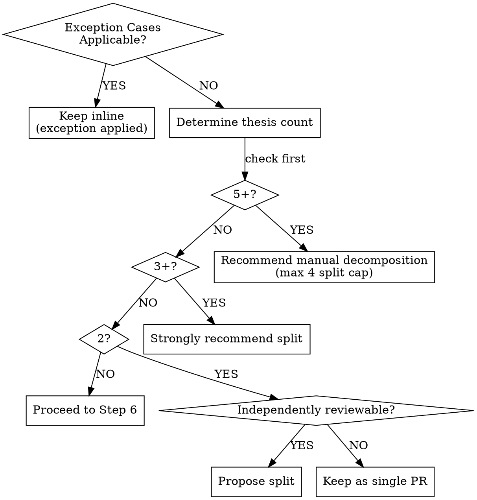

# Scope Assessment (Thesis-Based PR Scope Analysis)

Single reference document for Step 5 PR scope analysis. Source of truth for all scope analysis logic, from thesis definition to separation procedure and exception handling.

> **Branch placeholder**: `{base-branch}` represents the project's default branch detected in Step 0 (e.g., main, master, develop).

---

## Thesis Definition

**Thesis**: A single independently reviewable behavioral change. A unit that reviewers can evaluate without needing to understand other changes simultaneously.

> Source: Meta Jackson Gabbard's "thesis isolation" concept. Related principles: Google Small CLs ("one self-contained change"), Kent Beck "Tidy First?" (structure vs behavior separation).

### Single Thesis Examples (No Split Needed)

| Change Description | Reason |
|-----------|------|
| Add event publishing to order creation | Single purpose even if multiple files change |
| Add cache layer to Repository | Single cross-cutting concern |
| OrderService transaction boundary refactoring | Single design decision |

### Multi-Thesis Examples (Split Candidates)

| Change Description | Reason |
|-----------|------|
| Add event publishing AND refactor payment service | Two unrelated behavioral changes |
| New feature implementation AND legacy module migration | Two changes with different purposes |
| Bug fix AND domain redesign | Two changes in different categories |

### AND Test

If writing the PR Summary as a single sentence requires connecting **unrelated behaviors** with "AND", it's a multi-thesis signal.

```
"Add order event publishing and refactor payment service" → multi-thesis
"Add event publishing across the entire order creation flow" → single-thesis (multiple files within the same domain)
```

---

## Decision Framework



**Split cap**: Maximum 4 sub-PRs. If 5+ theses are detected, do not attempt automatic separation; recommend manual decomposition to the user.

> **Evaluation order**: Exception Cases (new abstraction under design, campsite-level cleanup, minimal cross-domain addition) are evaluated **before** thesis count thresholds. If an exception condition applies, inline or combined retention applies regardless of thesis count.

---

## Proxy Signals

> **Important**: Proxy signals are **detection triggers**, not judgment criteria. When a signal is present, perform thesis analysis — the thesis analysis result determines the judgment.

| Signal | Description | Threshold |
|--------|------|--------|
| Commit type diversity | Mix of feat + fix + refactor | 2+ types |
| Domain/module spread | Changed files span 2+ domains | 2+ domains |
| LOC threshold | Lines of code changed | 400+ lines |

> Note: SmartBear/Cisco research shows 200-400 LOC = 70-90% defect detection rate, 600+ LOC = detection rate drops sharply.

Even without proxy signals, if the AND test detects multi-thesis, consider splitting.

---

## Thesis Analysis Data Sources

Data sources used for thesis analysis and their purposes:

| Data Source | Purpose | Command |
|-------------|------|--------|
| File list | Which files changed | `git diff origin/{base-branch}..HEAD --stat` |
| Commit metadata | Commit messages, types, count | `git log origin/{base-branch}..HEAD --oneline` |
| Commit descriptions | Detailed commit messages | `git log origin/{base-branch}..HEAD --format='%s%n%b'` |
| Per-commit file changes | Which commits modified which files | `git log origin/{base-branch}..HEAD --name-status` |
| Domain structure | Module boundaries, dependencies | explore agent results |
| Change purpose | User-described intent | Interview answers |

**NON-NEGOTIABLE**: `git diff` (file contents) must never be used. See Non-Negotiable Rules.

---

## Explore Prompt Guide

Example explore agent prompts for thesis analysis:

```
"Identify the module/domain boundaries in this project. Describe each module's responsibilities and dependencies."
```

```
"Check which domains/modules the changed files belong to and whether there are cross-module dependencies:
[file list from git diff --stat]"
```

```
"Determine whether [pattern name] is a standard pattern or a new abstraction in this project."
```

---

## Split Proposal

When multi-thesis is detected, propose to the user in the following format.

### Proposal Format

```
[N]개의 thesis가 변경 범위에서 감지되었습니다:

**Thesis 1: [thesis name]**
- 포함된 커밋: [commit list]
- 포함된 파일: [file list]

**Thesis 2: [thesis name]**
- 포함된 커밋: [commit list]
- 포함된 파일: [file list]

어떻게 진행하시겠습니까?
1. 동의 (분리 진행)
2. 거부 (단일 PR로 진행)
3. Thesis 경계 조정 (파일/커밋 할당 수정)
```

### User Choice Handling

| Choice | Action |
|--------|--------|
| Accept | Proceed to Branch Separation Procedure |
| Reject | Proceed to Step 6 (single PR standard flow) |
| Adjust thesis boundaries | User modifies file/commit assignment → re-confirm |

---

## Split PR Base Relationship

All splits are chained on top of the previous split. The first PR uses `{base-branch}` as base; subsequent PRs use the previous split branch as base.

> **Note**: This is a stacked-only strategy. Even logically independent theses are chained sequentially. This is an intentional simplification.

---

## Branch Separation Procedure

### Separation Steps

**Precondition**: Working tree must be clean. Run `git status --porcelain` — if output is non-empty, ask the user to commit or stash changes before proceeding.

Record the current branch: `ORIGINAL_BRANCH=$(git branch --show-current)`

1. Finalize the list of commits included in each thesis (excluding merge commits), and record the mapping of thesis → commit hashes

For each thesis (in stacking order):
   a. Create branch:
      - First thesis: `git checkout -b {branch-name} origin/{base-branch}`
      - Subsequent theses: `git checkout -b {branch-name} {previous-split-branch}`
   b. Cherry-pick ONLY the commits assigned to this thesis from the mapping in Step 1: `git cherry-pick {hash1} {hash2} ...`
   c. Push branch: `git push -u origin {branch-name}` (Split Accept includes branch push. Accepting the split is considered the user's consent to creating remote branches.)

2. After all sub-branches are created, write Sub-PR Descriptions

> **Mixed commit warning**: If a single commit modifies files belonging to multiple theses (mixed commit), cherry-picking will include unintended changes. When a mixed commit is detected, **immediately stop automatic separation** and switch to the Graceful Degradation procedure. Inform the user that manual file-level separation may be possible, but the LLM must not attempt to extract files directly.

### Merge Commit Handling

Merge commits are excluded from thesis analysis. They are artifacts of branch synchronization and contain changes unrelated to any thesis. Skip merge commits during cherry-pick as well.

### Failure Handling

If cherry-pick fails:
1. Abort the entire separation (`git cherry-pick --abort`)
2. Return to the original branch: `git checkout $ORIGINAL_BRANCH` (the currently checked-out branch cannot be deleted)
3. For each sub-branch created during this procedure:
   a. `git branch -D {branch-name}`
   b. `git push origin --delete {branch-name} 2>/dev/null || true`
4. Fall back to single PR flow (Step 6)
5. Inform the user of the failure cause

### Original Branch Preservation

The original branch must never be deleted. If the user changes their mind after split completion:
- Delete sub-branches (local and remote: `git branch -D` + `git push origin --delete`)
- Return to the original branch
- If a PR was already created with `gh pr create`, guide the user to manually close it

---

## Sub-PR Description Writing

### Format

Each sub-PR follows the format in `references/output-format.md` (📌 Summary, 🔧 Changes, 💬 Review Points, ✅ Checklist, 📎 References).

### Split Context Note

Add split context at the top of each sub-PR Summary:

```markdown
> 이 PR은 [N]개 분리 PR 중 [K]번째입니다. 먼저 머지되어야 합니다. 관련 PR: [sibling PR links]
```

### User Confirmation

Obtain user confirmation before each `gh pr create` execution.

---

## Graceful Degradation

When commit-level separation is not possible (mixed commit detected, or cherry-pick conflict during separation):

1. Inform the user: `"Automatic commit-level separation is not possible. [file] has been changed across two theses."`
2. Fall back to single PR
3. Explain thesis boundaries in the single PR's Review Points: write so reviewers can understand the mixed concerns

A cherry-pick conflict on a shared file is the typical outcome of this case.

---

## Exception Cases

### New Abstraction Under Design

When the interface is not yet finalized → keep combined.

| Category | Example | Action |
|------|------|------|
| Standard pattern (split OK) | MQ consumer/producer, REST client, Repository, Cache layer, Middleware | Can split |
| New domain abstraction (keep combined) | DiscountEngine, PricingStrategy — the interface design itself is under review | Keep as single PR |

Detection signal: When the user mentions "I want to confirm the design" or "the interface is not finalized yet".

### Campsite-Level Cleanup

Import cleanup, typo fixes, dead code removal — do not treat as a separate thesis. Keep inline.

Judgment criterion: Changes that a reviewer can approve without any context.

### Minimal Cross-Domain Addition

When implementing a feature in Domain A requires adding 1 method or fewer than 5 lines to Domain B → keep inline. Do not split as a separate thesis.

---

## Quick Reference

| Situation | Judgment | Action |
|------|------|------|
| 1 thesis | Single thesis | Proceed to Step 6 |
| 2 theses, interface not finalized | New abstraction under design | Keep combined |
| 2 theses, independently reviewable | Split candidate | Propose split |
| 2 theses, not independently reviewable | Coupled dependency | Keep as single PR |
| 3-4 theses | Strongly recommend split | Propose split (cap: 4) |
| 5+ theses | Too many | Recommend manual decomposition |
| cherry-pick conflict | File-level separation not possible | Graceful Degradation |
| Campsite-level cleanup | Not a thesis | Keep inline |
