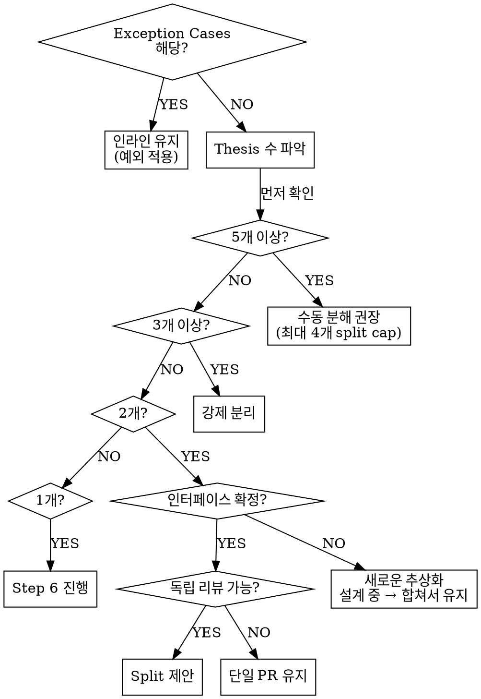

# Scope Assessment (Thesis 기반 PR 범위 판별)

Step 5의 PR 범위 판별을 위한 단일 참조 문서. Thesis 정의부터 분리 절차, 예외 처리까지 모든 범위 판별 로직의 진실 원천(source of truth).

> **브랜치 플레이스홀더**: `{base-branch}`는 Step 0에서 감지된 프로젝트의 기본 브랜치를 나타낸다 (예: main, master, develop).

---

## Thesis Definition (Thesis 정의)

**Thesis**: 하나의 독립적으로 리뷰 가능한 행동적 변경(behavioral change). 리뷰어가 다른 변경을 동시에 이해하지 않아도 평가할 수 있는 단위.

> 출처: Meta Jackson Gabbard의 "thesis isolation" 개념. 관련 원칙: Google Small CLs ("one self-contained change"), Kent Beck "Tidy First?" (구조 vs 행동 분리).

### 단일 Thesis 예시 (분리 불필요)

| 변경 설명 | 이유 |
|-----------|------|
| 주문 생성에 이벤트 발행 추가 | 파일이 여러 개 변경되더라도 목적이 하나 |
| Repository에 캐시 레이어 추가 | 단일 횡단 관심사(cross-cutting concern) |
| OrderService 트랜잭션 경계 리팩토링 | 하나의 설계 결정 |

### 다중 Thesis 예시 (분리 대상)

| 변경 설명 | 이유 |
|-----------|------|
| 이벤트 발행 추가 AND 결제 서비스 리팩토링 | 서로 무관한 두 가지 행동적 변경 |
| 신규 기능 구현 AND 레거시 모듈 마이그레이션 | 목적이 다른 두 변경 |
| 버그 픽스 AND 도메인 재설계 | 범주가 다른 두 변경 |

### AND 테스트

PR Summary를 한 문장으로 쓸 때 **무관한 행동**을 "AND"로 연결해야 한다면 multi-thesis 시그널.

```
"주문 이벤트 발행을 추가하고 결제 서비스를 리팩토링함" → multi-thesis
"주문 생성 플로우 전반에 걸쳐 이벤트 발행을 추가함" → single-thesis (같은 도메인 내 여러 파일)
```

---

## Decision Framework (판별 프레임워크)



**Split cap**: 최대 4개 sub-PR. 5개 이상의 thesis가 감지되면 자동 분리를 시도하지 않고 사용자에게 수동 분해를 권장.

> **평가 순서**: Exception Cases (새로운 추상화 설계 중, 캠프사이트급 정리, 극소량 크로스-도메인 추가)는 thesis 수 기반 임계값보다 **먼저** 평가한다. 예외 조건에 해당하면 thesis 수와 무관하게 인라인 유지 또는 합쳐서 유지가 적용된다.

---

## Proxy Signals (프록시 시그널)

> **중요**: 프록시 시그널은 **탐지 트리거**다. 판별 기준이 아니다. 시그널이 있으면 Thesis 분석을 수행하고, Thesis 분석 결과가 판별한다.

| 시그널 | 설명 | 임계값 |
|--------|------|--------|
| 커밋 타입 다양성 | feat + fix + refactor 혼합 | 2가지 이상 타입 |
| 도메인/모듈 분산 | 변경 파일이 2개 이상 도메인에 걸쳐 있음 | 2+ 도메인 |
| LOC 임계값 | 변경 라인 수 | 400+ lines |

> 참고: SmartBear/Cisco 연구에서 200-400 LOC = 70-90% 결함 탐지율, 600+ LOC = 탐지율 급락.

프록시 시그널이 **없어도** AND 테스트에서 multi-thesis가 감지되면 분리를 고려한다.

---

## Thesis 분석 데이터 소스

Thesis 판별에 사용하는 데이터 소스와 그 목적:

| 데이터 소스 | 목적 | 명령어 |
|-------------|------|--------|
| 파일 목록 | 어떤 파일이 변경되었는지 | `git diff --stat` |
| 커밋 메타데이터 | 커밋 메시지, 타입, 수 | `git log {base-branch}..HEAD --oneline` |
| 커밋 설명 | 상세 커밋 메시지 | `git log {base-branch}..HEAD --format='%s%n%b'` |
| 도메인 구조 | 모듈 경계, 의존 관계 | explore agent 결과 |
| 변경 목적 | 사용자가 설명한 의도 | 인터뷰 답변 |

**NON-NEGOTIABLE**: `git diff`(파일 내용)는 절대 사용 불가. Non-Negotiable Rules 참조.

---

## Explore 프롬프트 가이드

Thesis 분석을 위한 explore agent 프롬프트 예시:

```
"이 프로젝트의 모듈/도메인 경계를 파악해줘. 각 모듈의 책임과 의존 관계를 알려줘."
```

```
"변경된 파일들이 어떤 도메인/모듈에 속하는지, 모듈 간 의존성이 있는지 확인해줘:
[git diff --stat 결과의 파일 목록]"
```

```
"이 프로젝트에서 [패턴명]이 표준 패턴인지 새로운 추상화인지 판단해줘."
```

---

## Split Proposal (Split 제안)

Multi-thesis가 감지되면 사용자에게 다음 형식으로 제안한다.

### 제안 형식

```
변경 범위에서 [N]개의 thesis가 감지되었습니다:

**Thesis 1: [thesis 이름]**
- 포함 커밋: [커밋 목록]
- 포함 파일: [파일 목록]

**Thesis 2: [thesis 이름]**
- 포함 커밋: [커밋 목록]
- 포함 파일: [파일 목록]

어떻게 진행할까요?
1. 동의 (분리 진행)
2. 거부 (단일 PR로 진행)
3. Thesis 경계 조정 (파일/커밋 배정 수정)
```

### 사용자 선택 처리

| 선택 | 처리 |
|------|------|
| 동의 | 브랜치 분리 절차 진행 |
| 거부 | Step 6 (단일 PR 표준 플로우) 진행 |
| Thesis 경계 조정 | 사용자가 파일/커밋 배정 수정 → 재확인 |

---

## Split PR Base 관계

모든 split은 이전 split 위에 체이닝된다. 첫 번째 PR은 `{base-branch}`를 base로, 이후 PR은 이전 split 브랜치를 base로 생성한다.

---

## 브랜치 분리 절차

### 분리 절차

1. 각 thesis에 포함된 커밋 목록 확정 (머지 커밋 제외)
2. 새 브랜치 생성:
   - 첫 번째 thesis: `git checkout -b {branch-name} origin/{base-branch}`
   - 이후 thesis: `git checkout -b {branch-name} {이전-split-브랜치}`
3. Cherry-pick commits for the thesis in chronological order (oldest first): `git cherry-pick {commit-hash}` (git log outputs newest-first, so apply bottom-to-top)
4. 브랜치 push: `git push -u origin {branch-name}` (Split Accept는 브랜치 push를 포함한다. Accept 시점에서 유저가 remote 브랜치 생성에 동의한 것으로 간주한다.)
5. 모든 sub-브랜치 생성 완료 후 Sub-PR Description 작성

### 머지 커밋 처리

머지 커밋은 thesis 분석에서 제외한다. 브랜치 동기화의 아티팩트이며, thesis와 무관한 변경이다. cherry-pick 시에도 머지 커밋은 건너뛴다.

### 실패 처리

cherry-pick이 실패하면:
1. 분리 전체 중단 (`git cherry-pick --abort`)
2. 원본 브랜치로 복귀: `git checkout {원본-브랜치}` (현재 체크아웃된 브랜치는 삭제할 수 없으므로)
3. 지금까지 생성된 모든 sub-브랜치 삭제
4. 단일 PR 플로우(Step 6)로 fallback
5. 사용자에게 실패 원인 안내

### 원본 브랜치 보존

원본 브랜치는 절대 삭제하지 않는다. 사용자가 split 완료 후 마음을 바꾸면:
- sub-브랜치 삭제
- 원본 브랜치로 복귀
- `gh pr create`로 이미 PR이 생성된 경우, 사용자에게 수동 close 안내

---

## Sub-PR Description 작성

### 형식

각 sub-PR는 `references/output-format.md`의 형식을 따른다 (📌 Summary, 🔧 Changes, 💬 Review Points, ✅ Checklist, 📎 References).

### Split Context 노트

각 sub-PR Summary 상단에 split 컨텍스트를 추가한다:

```markdown
> 이 PR은 [N]개 분리 PR 중 [K]번째입니다. 먼저 머지되어야 합니다. 관련 PR: [sibling PR 링크들]
```

### 사용자 확인

각 `gh pr create` 실행 전에 사용자 확인을 받는다.

---

## Graceful Degradation (우아한 퇴보)

파일 수준 분리가 불가능한 경우 (하나의 파일에 두 thesis의 변경이 혼재):

1. 사용자에게 안내: `"파일 수준 분리가 불가합니다. [file]이 두 thesis에 걸쳐 변경되었습니다."`
2. 단일 PR로 fallback
3. 단일 PR의 Review Points에 thesis 경계를 설명: 리뷰어가 혼재된 관심사를 이해할 수 있도록 작성

cherry-pick이 공유 파일에서 충돌을 발생시키는 것이 이 경우의 전형적인 결과다.

---

## 분리 예외 (Exception Cases)

### 새로운 추상화 설계 중

인터페이스가 확정되지 않은 경우 → 합쳐서 유지.

| 구분 | 예시 | 처리 |
|------|------|------|
| 표준 패턴 (분리 OK) | MQ consumer/producer, REST client, Repository, Cache layer, Middleware | 분리 가능 |
| 새로운 도메인 추상화 (합쳐서 유지) | DiscountEngine, PricingStrategy — 인터페이스 설계 자체가 리뷰 대상 | 단일 PR 유지 |

탐지 시그널: 사용자가 "설계를 확인받고 싶다", "인터페이스가 아직 확정이 아니다" 등을 언급하는 경우.

### 캠프사이트급 정리 (Campsite-level cleanup)

import 정리, 오타 수정, 데드 코드 제거 — 별도 thesis로 취급하지 않는다. 인라인 유지.

판별 기준: 리뷰어가 맥락 없이도 승인할 수 있는 변경.

### 극소량 크로스-도메인 추가

Domain A의 기능 구현 일부로 Domain B에 메서드 1개 또는 5줄 미만을 추가하는 경우 → 인라인 유지. 별도 thesis로 분리하지 않는다.

---

## 빠른 참조

| 상황 | 판단 | 처리 |
|------|------|------|
| Thesis 1개 | 단일 thesis | Step 6 진행 |
| Thesis 2개, 인터페이스 미확정 | 새로운 추상화 설계 중 | 합쳐서 유지 |
| Thesis 2개, 독립 리뷰 가능 | 분리 대상 | Split 제안 |
| Thesis 2개, 독립 리뷰 불가 | 결합 의존성 | 단일 PR 유지 |
| Thesis 3-4개 | 강제 분리 | Split 제안 (cap: 4개) |
| Thesis 5개 이상 | 너무 많음 | 수동 분해 권장 |
| cherry-pick 충돌 | 파일 수준 분리 불가 | Graceful Degradation |
| 캠프사이트급 정리 | Thesis 아님 | 인라인 유지 |
