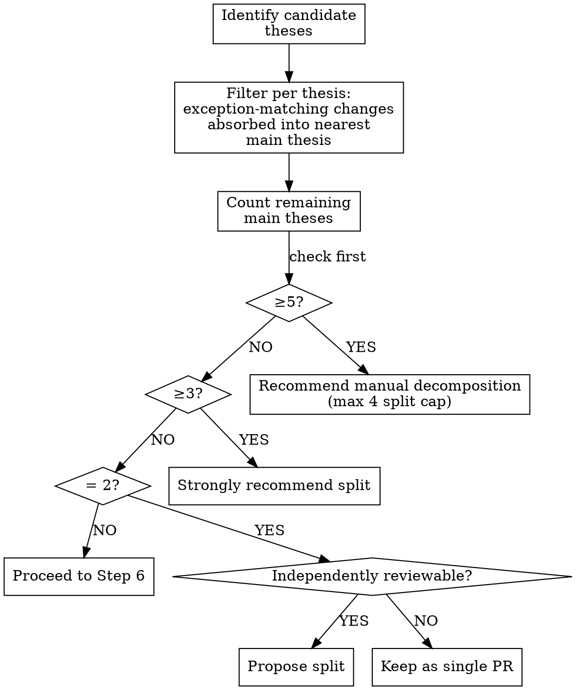

# Scope Assessment (Thesis-Based PR Scope Analysis)

Single reference document for Step 5 PR scope analysis. Source of truth for all scope analysis logic, from thesis definition to separation procedure and exception handling.

> **Branch placeholders**: `{base-branch}` represents the project's default branch detected in Step 0 (e.g., main, master, develop). `{original-branch}` represents the branch that was checked out when the separation procedure began.

---

## Thesis Definition

**Thesis**: A single independently reviewable behavioral change. A unit that reviewers can evaluate without needing to understand other changes simultaneously.

> Source: Meta Jackson Gabbard's "thesis isolation" concept. Related principles: Google Small CLs ("one self-contained change"), Kent Beck "Tidy First?" (structure vs behavior separation).

### Single Thesis Examples (No Split Needed)

| Change Description | Reason |
|-----------|------|
| Add event publishing to order creation | Single purpose even if multiple files change |
| Add cache layer to Repository | Single cross-cutting concern |
| OrderService transaction boundary refactoring | Single design decision |

### Multi-Thesis Examples (Split Candidates)

| Change Description | Reason |
|-----------|------|
| Add event publishing AND refactor payment service | Two unrelated behavioral changes |
| New feature implementation AND legacy module migration | Two changes with different purposes |
| Bug fix AND domain redesign | Two changes in different categories |

### AND Test

If writing the PR Summary as a single sentence requires connecting **unrelated behaviors** with "AND", it's a multi-thesis signal.

```
"Add order event publishing and refactor payment service" → multi-thesis
"Add event publishing across the entire order creation flow" → single-thesis (multiple files within the same domain)
```

---

## Decision Framework


```dot
digraph thesis_decision {
    rankdir=TB;

    "Identify candidate\ntheses" [shape=box];
    "Filter per thesis:\nexception-matching changes\nabsorbed into nearest\nmain thesis" [shape=box];
    "Count remaining\nmain theses" [shape=box];
    "= 2?" [shape=diamond];
    "≥3?" [shape=diamond];
    "≥5?" [shape=diamond];
    "Proceed to Step 6" [shape=box];
    "Independently reviewable?" [shape=diamond];
    "Propose split" [shape=box];
    "Keep as single PR" [shape=box];
    "Strongly recommend split" [shape=box];
    "Recommend manual decomposition\n(max 4 split cap)" [shape=box];

    "Identify candidate\ntheses" -> "Filter per thesis:\nexception-matching changes\nabsorbed into nearest\nmain thesis";
    "Filter per thesis:\nexception-matching changes\nabsorbed into nearest\nmain thesis" -> "Count remaining\nmain theses";
    "Count remaining\nmain theses" -> "≥5?" [label="check first"];
    "≥5?" -> "Recommend manual decomposition\n(max 4 split cap)" [label="YES"];
    "≥5?" -> "≥3?" [label="NO"];
    "≥3?" -> "Strongly recommend split" [label="YES"];
    "≥3?" -> "= 2?" [label="NO"];
    "= 2?" -> "Independently reviewable?" [label="YES"];
    "= 2?" -> "Proceed to Step 6" [label="NO"];
    "Independently reviewable?" -> "Propose split" [label="YES"];
    "Independently reviewable?" -> "Keep as single PR" [label="NO"];
}
```

**Split cap**: Maximum 4 sub-PRs. If 5+ theses are detected, do not attempt automatic separation; recommend manual decomposition to the user.

> **Evaluation order**: Exception-matching changes (campsite-level cleanup, new abstraction under design, minimal cross-domain addition) are absorbed into their nearest main thesis rather than counted as separate theses. After this per-thesis exception filtering, the remaining main thesis count determines the split decision.

---

## Proxy Signals

> **Important**: Proxy signals are **detection triggers**, not judgment criteria. When a signal is present, perform thesis analysis — the thesis analysis result determines the judgment.

| Signal | Description | Threshold |
|--------|------|--------|
| Commit type diversity | Mix of feat + fix + refactor | 2+ types |
| Domain/module spread | Changed files span 2+ domains | 2+ domains |
| LOC threshold | Lines of code changed | 400+ lines |

> Note: SmartBear/Cisco research shows 200-400 LOC = 70-90% defect detection rate, 600+ LOC = detection rate drops sharply.

Even without proxy signals, if the AND test detects multi-thesis, consider splitting.

---

## Thesis Analysis Data Sources

Data sources used for thesis analysis and their purposes:

| Data Source | Purpose | Command |
|-------------|------|--------|
| File list | Which files changed | `git diff origin/{base-branch}..HEAD --stat` |
| Commit metadata | Commit messages, types, count | `git log origin/{base-branch}..HEAD --oneline` |
| Commit descriptions | Detailed commit messages | `git log origin/{base-branch}..HEAD --format='%s%n%b'` |
| Per-commit file changes | Which commits modified which files | `git log origin/{base-branch}..HEAD --name-status` |
| Domain structure | Module boundaries, dependencies | explore agent results |
| Change purpose | User-described intent | Interview answers |

**NON-NEGOTIABLE**: `git diff` (file contents) must never be used. See Non-Negotiable Rules.

---

## Explore Prompt Guide

Example explore agent prompts for thesis analysis:

```
"Identify the module/domain boundaries in this project. Describe each module's responsibilities and dependencies."
```

```
"Check which domains/modules the changed files belong to and whether there are cross-module dependencies:
[file list from git diff --stat]"
```

```
"Determine whether [pattern name] is a standard pattern or a new abstraction in this project."
```

---

## Split Proposal

When multi-thesis is detected, propose to the user in the following format.

### Proposal Format

```
[N]개의 thesis가 변경 범위에서 감지되었습니다:

**Thesis 1: [thesis name]**
- 포함된 커밋: [commit list]
- 포함된 파일: [file list]

**Thesis 2: [thesis name]**
- 포함된 커밋: [commit list]
- 포함된 파일: [file list]

어떻게 진행하시겠습니까?
1. 동의 (분리 진행)
2. 거부 (단일 PR로 진행)
3. Thesis 경계 조정 (파일/커밋 할당 수정)
```

### User Choice Handling

| Choice | Action |
|--------|--------|
| Accept | Proceed to Branch Separation Procedure |
| Reject | Proceed to Step 6 (single PR standard flow) |
| Adjust thesis boundaries | User modifies file/commit assignment → re-confirm |

---

## Split PR Base Relationship

All splits are chained on top of the previous split. The first PR uses `{base-branch}` as base; subsequent PRs use the previous split branch as base.

> **Note**: This is a stacked-only strategy. Even logically independent theses are chained sequentially. This is an intentional simplification. Cherry-pick-based separation cannot guarantee that two theses do not touch the same file; if they do, a parallel approach would produce conflicting branches with no safe merge path. Stacking ensures each thesis builds cleanly on the previous one, making conflicts detectable and resolvable at each step.

---

## Branch Separation Procedure

### Shell-safe branch/ref bindings

Never interpolate a raw branch/ref placeholder into shell source. Every external branch, ref, path, or hash uses a `<shell-word:name>` token: before the shell parses the block, replace the whole token with one single-quoted shell literal, encoding each internal apostrophe as `'\''`. Then validate branch refs when created or renamed and use only quoted variable expansions. A branch such as `feat;id`, `$()` or backticks remains data. The binding contract is:

```bash
BRANCH_NAME=<shell-word:branch-name>
BASE_BRANCH=<shell-word:base-branch>
PREVIOUS_SPLIT_BRANCH=<shell-word:previous-split-branch>
git check-ref-format --branch "$BRANCH_NAME"
git check-ref-format --branch "$BASE_BRANCH"
```

Use the same contract for worktree paths, cherry-pick operands, downstream rebase, push, and rollback. Commit hashes are likewise bound as one value before use (for example, `COMMIT_HASH=<shell-word:hash1>` and `git -C "$WT_DIR" cherry-pick "$COMMIT_HASH"`).

Each sub-PR gets its own **git worktree** — a separate checked-out directory backed by the same repository — instead of switching branches in the one working directory.

**Why**: the split is not done when the PRs open; that is when review starts. Review comments land on several sub-PRs at once, and because the split is stacked, a fix on one sub-PR has to be carried up the chain. One working directory turns every one of those moves into a checkout-and-stash round trip. One worktree per sub-PR lets each PR be edited in place, side by side, while the original branch stays checked out where it was.

### Separation Steps

**Precondition**: Working tree must be clean. Run `git status --porcelain` — if output is non-empty, ask the user to commit or stash changes before proceeding.

1. Finalize the list of commits included in each thesis (excluding merge commits), sorted in chronological order (oldest first), and record the mapping of thesis → commit hashes. Before creating any worktree, record an explicit **branch → worktree** mapping for every planned sub-PR.

2. Pre-check for mixed commits: run `git log origin/{base-branch}..HEAD --name-status` and cross-reference each commit's changed files against the thesis mapping from step 1. If any single commit modifies files assigned to more than one thesis, **immediately stop and switch to the Graceful Degradation procedure** before creating any branch. Do not proceed to the separation loop.

Before creating any worktree, preflight every planned split branch and worktree path. Abort the split setup before creating resources if a local branch or worktree path already exists. For each planned name, bind `PLANNED_BRANCH=<shell-word:branch-name>`, validate it with `git check-ref-format --branch "$PLANNED_BRANCH"`, then run `git ls-remote --exit-code --heads origin "refs/heads/$PLANNED_BRANCH"`: exit 0 means the remote branch already exists, exit 2 means it is absent, and any other result is a remote-check failure. If any remote branch exists, require a different branch name and repeat the complete preflight; never push to or register a pre-existing remote split branch.

For each thesis (in stacking order):
   a. Name the branch `{branch-name}` following `{branch-convention}` from the Step 1 PR Convention Survey (fallback when no convention: descriptive kebab-case topic name). Its worktree directory is a sibling of the repository root, named after the branch with `/` replaced by `-`:
      ```bash
      REPO_ROOT=$(git rev-parse --show-toplevel)
      BRANCH_NAME=<shell-word:branch-name>
      BASE_BRANCH=<shell-word:base-branch>
      PREVIOUS_SPLIT_BRANCH=<shell-word:previous-split-branch>
      git check-ref-format --branch "$BRANCH_NAME"
      WT_DIR="$(dirname "$REPO_ROOT")/$(basename "$REPO_ROOT")-$(printf '%s' "$BRANCH_NAME" | tr '/' '-')"
      ```
   b. Create the worktree with the new branch — this checks the branch out in `$WT_DIR`, leaving the main working directory on `{original-branch}`:
      - First thesis: `git worktree add -b "$BRANCH_NAME" "$WT_DIR" "origin/$BASE_BRANCH"`
      - Subsequent theses: `git worktree add -b "$BRANCH_NAME" "$WT_DIR" "$PREVIOUS_SPLIT_BRANCH"`
      - After a successful command, append this worktree path and local branch to the current-run rollback registry. Do not register a failed or pre-existing resource.
   c. Cherry-pick ONLY the commits assigned to this thesis from the mapping in Step 1, inside that worktree: bind each hash (`COMMIT_HASH=<shell-word:hash1>`) and run `git -C "$WT_DIR" cherry-pick "$COMMIT_HASH"` (MUST be in chronological order — oldest commit first)
   d. Push branch with a create-only compare-and-swap: `git -C "$WT_DIR" push --force-with-lease="refs/heads/$BRANCH_NAME:" -u origin "$BRANCH_NAME"`. The empty expected value means the remote ref must still be absent; if a competitor created it after preflight (even at an ancestor tip), the push fails and cannot overwrite that ref. Split Accept includes branch push. Accepting the split is considered the user's consent to creating remote branches. After a successful push, append that remote branch to the current-run rollback registry; do not register a branch whose push failed or a remote branch that pre-dated this run.

3. After all sub-branches are created, tell the user each sub-PR's branch and worktree directory, then write Sub-PR Descriptions. Preserve an explicit branch → worktree mapping (for example, `{target-sub-branch}` → `{mapped-worktree}`) for Step 8; if any sub-PR lacks a mapping, stop and ask the user rather than guessing a directory.

The `gh pr create` invocation in Step 8 targets `--head {branch-name}` and can run from the main directory or from any of the worktrees — they all address the same repository. Branch-dependent git checks, renames, and pushes must still run in the mapped worktree.

### Worktree Lifetime

The worktrees stay after the PRs are created; handling review feedback is what they are for. Remove one only when its sub-PR is merged and needs no further edits:

```bash
WORKTREE_PATH=<shell-word:worktree-path> # from the recorded branch → worktree mapping
git worktree remove "$WORKTREE_PATH"
```

Because the split is stacked, a review fix committed in one sub-PR's worktree has to be carried into every worktree above it, each in its own directory:

```bash
DOWNSTREAM_WT=<shell-word:downstream-worktree>
UPSTREAM_BRANCH=<shell-word:upstream-branch>
git check-ref-format --branch "$UPSTREAM_BRANCH"
git -C "$DOWNSTREAM_WT" rebase "$UPSTREAM_BRANCH"
git -C "$DOWNSTREAM_WT" push --force-with-lease
```

> **Mixed commit warning**: If a single commit modifies files belonging to multiple theses (mixed commit), cherry-picking will include unintended changes. When a mixed commit is detected, **immediately stop automatic separation** and switch to the Graceful Degradation procedure. Inform the user that manual file-level separation may be possible, but the LLM must not attempt to extract files directly.

### Merge Commit Handling

Merge commits are excluded from thesis analysis. They are artifacts of branch synchronization and contain changes unrelated to any thesis. Skip merge commits during cherry-pick as well.

### Failure Handling

The `worktree add`, `cherry-pick`, and `push` commands are all failure points. A failure at any of those stages must enter the same shared rollback path; the preflight checks are not a sufficient guard. Track only worktrees and local branches successfully created during this run, and track only remote branches successfully pushed during this run. A late worktree-add failure must roll back remote branches pushed by earlier iterations of this run, but must not touch any pre-existing resource.

1. If the failure occurred during a cherry-pick, run `git -C "$WT_DIR" cherry-pick --abort` only when a cherry-pick is active; do not invoke `--abort` for an add or push failure (or for an already-clean worktree).
2. Remove worktrees first, then delete the corresponding local branches, using only the tracked resources from this run:
   Iterate the current-run rollback registry's paired worktree/local-branch entries; for each entry bind `TRACKED_WORKTREE_PATH=<shell-word:tracked-worktree-path>` and `TRACKED_LOCAL_BRANCH=<shell-word:tracked-local-branch>` from that registry, then:
   a. `git worktree remove --force "$TRACKED_WORKTREE_PATH"`
   b. `git branch -D "$TRACKED_LOCAL_BRANCH"`
3. Ask the user for confirmation before deleting any tracked remote branch: list each remote branch to be deleted and wait for explicit approval. Never delete a remote branch without that confirmation.
4. For each remote branch confirmed by the user:
   bind `REMOTE_BRANCH=<shell-word:confirmed-remote-branch>` from the user's confirmation list, then `git push origin --delete "$REMOTE_BRANCH" 2>/dev/null || true`
5. Preserve pre-existing worktrees, local branches, and remote branches, then fall back to the single PR flow (Step 6) — the main working directory never left `{original-branch}`, so there is nothing to check back out.
6. Inform the user of the failure cause and which tracked resources were cleaned up.

### Original Branch Preservation

The original branch must never be deleted. It stays checked out in the main working directory for the whole procedure — the sub-branches live in their own worktrees. If the user changes their mind after split completion:
- Iterate the recorded branch → worktree mapping; for each entry bind `WORKTREE_PATH=<shell-word:worktree-path>`, `LOCAL_BRANCH=<shell-word:local-branch>`, and (after confirmation) `REMOTE_BRANCH=<shell-word:confirmed-remote-branch>`, then remove the worktree and delete local/remote branches (`git worktree remove --force "$WORKTREE_PATH"`, `git branch -D "$LOCAL_BRANCH"`, and `git push origin --delete "$REMOTE_BRANCH"`).
- The main working directory is already on the original branch
- If a PR was already created with `gh pr create`, guide the user to manually close it

---

## Sub-PR Description Writing

### Format

Each sub-PR follows the format in `references/output-format.md` (📌 Summary, 🔧 Changes, 💬 Review Points, ✅ Checklist, 📎 References).

### Sub-PR Title

Each sub-PR title states its position in the series as a suffix after the convention-conforming title (K = this PR's position, N = total sub-PRs):

```
feat: 주문 이벤트 스키마 정의 (1/3)
```

### Split Context Note

The 📌 Summary of every sub-PR opens with the split context block. One template covers every position:

```markdown
> **분리 PR (K/N)** — [분리 전 전체 작업 한 줄 설명]을 N개 PR로 나눈 것 중 K번째입니다.
> - 머지 순서: #[1번 PR] → #[2번 PR] → 이 PR → #[K+1번 PR] → …
> - 선행 PR: #[K-1] [해당 PR 제목] 이 먼저 머지되어야 합니다
> - 관련 PR: [모든 형제 PR 링크]
```

Fill rules:

| Slot | How to fill |
|---|---|
| 머지 순서 | The full chain in stacking order, with this PR shown as `이 PR` — self-reference avoids needing your own number before creation |
| 선행 PR | When K = 1, write `선행 PR 없음 — 이 시리즈에서 가장 먼저 머지됩니다` instead |
| Any sub-PR number not yet created | The literal placeholder `#TBD`, replaced in the Post-Creation Update below — never drop the slot. A dropped slot leaves the reader with no route to the rest of the series |
| Sibling PR notation | Bare `#N` — GitHub auto-links it inside the same repository. The `[Title](URL)` rule in `references/output-format.md` governs the 📎 References section, not this block |

### User Confirmation

Obtain user confirmation before each `gh pr create` execution.

### Post-Creation Update

After ALL sub-PRs have been created, replace every `#TBD` placeholder in the already-created descriptions with the actual PR numbers using `gh pr edit`:

```bash
gh pr edit {pr-number} --body "$(cat <<'EOF'
{updated description with sibling links filled in}
EOF
)"
```

- Update sub-PRs 1 through N-1 — each of them was created carrying at least one `#TBD` for a PR that did not exist yet. The last sub-PR already knows every predecessor at creation time and carries no placeholder.
- After the update pass, no `#TBD` may remain in any sub-PR description.

### Early Stop / Partial Creation Finalization

If the user declines a later `gh pr create` or that command fails, stop before creating any later sub-PRs. Let **M** be the number of sub-PRs successfully created in this run. When **M > 0**, finalize every created PR with `gh pr edit`: change each visible title and split-context/body series count from `K/N` to the actual M created PRs (`K/M`), remove every `#TBD`, and remove or rewrite every reference to an uncreated sibling so the remaining merge order and related-PR links describe only the created series. Report which planned theses were not published. When M = 0, do not edit any remote PR. The normal all-created update path remains unchanged.

---

## Graceful Degradation

When commit-level separation is not possible (mixed commit detected, or cherry-pick conflict during separation):

1. Inform the user that automatic commit-level separation is not possible because [file] has been changed across two theses.
2. Fall back to single PR
3. Explain thesis boundaries in the single PR's Review Points: write so reviewers can understand the mixed concerns

A cherry-pick conflict on a shared file is the typical outcome of this case.

---

## Exception Cases

### New Abstraction Under Design

When the interface is not yet finalized → keep combined.

| Category | Example | Action |
|------|------|------|
| Standard pattern (split OK) | MQ consumer/producer, REST client, Repository, Cache layer, Middleware | Can split |
| New domain abstraction (keep combined) | DiscountEngine, PricingStrategy — the interface design itself is under review | Keep as single PR |

Detection signal: When the user mentions "I want to confirm the design" or "the interface is not finalized yet".

### Campsite-Level Cleanup

Import cleanup, typo fixes, dead code removal — do not treat as a separate thesis. Keep inline.

Judgment criterion: Changes that a reviewer can approve without any context.

### Minimal Cross-Domain Addition

When implementing a feature in Domain A requires adding 1 method or fewer than 5 lines to Domain B → keep inline. Do not split as a separate thesis.

---

## Quick Reference

| Situation | Judgment | Action |
|------|------|------|
| 1 thesis | Single thesis | Proceed to Step 6 |
| 2 theses, interface not finalized | New abstraction under design | Keep combined |
| 2 theses, independently reviewable | Split candidate | Propose split |
| 2 theses, not independently reviewable | Coupled dependency | Keep as single PR |
| 3-4 theses | Strongly recommend split | Propose split (cap: 4) |
| 5+ theses | Too many | Recommend manual decomposition |
| cherry-pick conflict | File-level separation not possible | Graceful Degradation |
| Campsite-level cleanup | Not a thesis | Keep inline |
